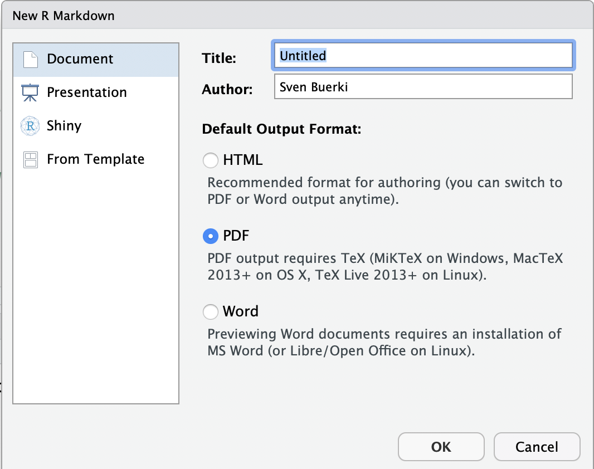

\newpage

```{r setup, include=FALSE}
knitr::opts_chunk$set(fig.pos = 'H')
```

# Aim of chapter 1

The overarching aim of chapter 1 is to provide students with the bioinformatic skills allowing them to link and execute data and code into a unified environment making research reproducible (\autoref{fig:ReproScience}). This chapter focuses on learning the R Markdown syntax and protocols allowing to include text, code, figures, tables and bibliography into a document. This document will then be compiled into an output file (in either \verb|pdf|, `HTML` or `Word` formats) allowing sharing your research. More specifically, this tutorial provides students with the minimum knowledge allowing them to complete their bioinformatic tutorials (PART 2) and individual projects (PART 3). The chapter will be subdivided into four parts as follows:

- **Part A:** Basics of R Markdown (1-Sept).
- **Part B:** Tables, Figures and References (3-Sept).
- **Part C:** Advanced R Markdown settings (8-Sept).
- **Part D:** User Defined Functions in R (10-Sept).

```{r ReproScience, echo=FALSE, fig.cap="The spectrum of reproducibility.", fig.show="asis", out.width = '100%'}
knitr::include_graphics("Figures/Fig1.png")
```

# Learning outcomes

This tutorial is devoted to part A and provides students with opportunities to learn procedures to:

- Install R Markdown on your computer. 
- Create and render (or knitting) your first R Markdown document.
- Execute basic R Markdown syntax and protocols.

# Associated files supporting this tutorial

Although less used in part A, a set of files are provided to support teaching of material presented in this chapter. These files are deposited in the shared Google Drive at this path: 
  
  + `Reproducible_Science/Chapters/Chapter_1/Tutorial_files`

Files are as follows:

- \verb|EEB603_Syllabus_BUERKI.Rmd|: This is the \verb|.Rmd| file used to compile the syllabus of this class. This file provides a good source of information for the syntax and protocols described in this tutorial.
- \verb|Bibliography_Reproducible_Science_2.bib|: This file contains references cited in [BibTex](#BibTex) format. 
- \verb|AmJBot.csl|: This citation style language (CSL) file allows formatting citations and bibliography following citation style of *American Journal of Botany*.
- \verb|Bioinformatic workflow_PART2.pdf|: A \verb|pdf| file containing the bioinformatic workflow taught in this class. This file will be used to learn how to incorporate a figure into R Markdown file.

# Install R Markdown software

Software and packages required to perform this tutorial are detailed below. Students should install those software and packages on their personal computers to be able to complete this course. Additional packages might need to be installed and the instructor will provide guidance on how to install those as part of the forthcoming tutorials.

- **R**: https://www.r-project.org
- **R packages**: \verb|bookdown|, \verb|knitr| and \verb|R Markdown|. Use the following R command to install those packages:
```{r eval=F, tidy=TRUE}
install.packages(c("bookdown","knitr", "rmarkdown"))
```
- **RStudio**: https://www.rstudio.com/products/rstudio/download/
- **TeX**: This software is required to compile document into \verb|pdf| format. Please install MiKTeX on Windows, MacTeX on OS X and TeXLive on Linux.

## RStudio: An Integrated Development Environment (IDE) for R

RStudio is an integrated development environment (IDE) that allows you to interact with R more readily. RStudio is similar to the standard RGUI, but it is considerably more user friendly. It has more drop-down menus, windows with multiple tabs, and many customization options (see \autoref{fig:IDE}). Detailed information on using RStudio can be found at at [RStudio’s website](https://support.rstudio.com/hc/en-us/sections/200107586-Using-RStudio).

```{r IDE, echo=FALSE, fig.cap="Snapshot of the RStudio environment showing the four windows and their content.", fig.show="asis", out.width = '100%'}
knitr::include_graphics("Figures/IDE.png")
```

## Web resources

Please find below URLs to webpages that are providing key information for chapter 1:

- **R Markdown:** https://RMarkdown.rstudio.com
- **R Markdown: The Definitive Guide (by Yihui Xie, J. J. Allaire, Garrett Grolemund):** https://bookdown.org/yihui/RMarkdown/
- **Write HTML, PDF, ePub, and Kindle books with R Markdown:** https://bookdown.org
- **bookdown: Authoring Books and Technical Documents with R Markdown (by Yihui Xie):** https://bookdown.org/yihui/bookdown/
- **knitr:** http://yihui.name/knitr/
- **Pandoc: A universal document converter:** https://pandoc.org
- **Bibliographies and Citations in R Markdown:** https://RMarkdown.rstudio.com/authoring_bibliographies_and_citations.html
- **Tutorial on knitr with R Markdown (by Karl Broman):** http://kbroman.org/knitr_knutshell/pages/RMarkdown.html

# Create and render (or knitting) your first R Markdown document

## Introduction to R Markdown

Markdown is a simple formatting syntax language used for authoring HTML, PDF, and MS Word documents, which is implemented in the `rmarkdown` package. An R Markdown document is usually subdivided into three sections (\autoref{fig:RMdown}):

1. **YAML metadata section:** This section provides high level information about the output format of the R Markdown file. Information stored in this section will be used by the Pandoc program to format the output document (see \autoref{fig:Rflow}).
2. **Publication core text:** This section represents the core of your document/publication and uses Markdown syntax.
3. **Code chunk:** This section allows to import and analyze data as well as produce figures and tables that will be directly displayed in the output file. 

```{r RMdown, echo=FALSE, fig.cap="Example of an R Markdown file showing the three major sections.", fig.show="asis", out.width = '100%'}
knitr::include_graphics("Figures/Presentation_RMarkdown.pdf")
```

## Creating an R Markdown file

```{r RMdownscreen, echo=FALSE, fig.cap="Snapshot of window to create an R Markdown file.", fig.show="asis", out.width = '40%', fig.align="center"}

```

To create an R Markdown document execute the following steps in RStudio:

1. Select: \verb|File -> New File -> R Markdown...| 
2. Provide title for the document and define \verb|Default output format| (\autoref{fig:RMdownscreen}).
If you want to knit your document in \verb|pdf| format, a version of the \verb|TeX| program has to be installed on your computer (see \autoref{fig:RMdownscreen}). 
3. Save the \verb|.Rmd| document (using \verb|File -> Save As...|). Save this file in a new folder devoted to the project (**Warning:** Knitting the document will generate several files).

## Rendering (or knitting) an R Markdown document

To render or knit  your R Markdown document/script into the format specified in the YAML metadata section do the following steps in RStudio:

1. Select the \verb|Knit| button (\autoref{fig:RMdown}) in the upper bar of your window to render document.
2. There are several options depending on the output format; however if you just push the button it will automatically knit the document following settings provided in the YAML metadata section (\autoref{fig:RMdown}).
3. The output file will automatically be created in the same directory as the \verb|.Rmd| file. You can track progress in the \verb|R Markdown| console. If the knitting fails, error messages will be printed in the \verb|R Markdown| console (including information on which line of the script the error occurred, but it might not always be the case). Error messages are very useful to debug your R Markdown document.  

## <a name="compilation"></a>How does the knitting process work?

When you knit your document, R Markdown will feed the \verb|.Rmd| file to the R *knitr* package, which executes all of the code chunks and creates a new markdown (\verb|.md|) document. This latter document includes the code and its output (\autoref{fig:Rflow}). The markdown file generated by \verb|knitr| is then processed by the Pandoc program, which is responsible for creating the finished format (\autoref{fig:Rflow}).

```{r Rflow, echo=FALSE, fig.cap="R Markdown flow.", out.width = '100%'}
knitr::include_graphics("Figures/rmarkdownflow.png")
```

# Basic R Markdown syntax and protocols

We will focus here on learning the syntax and protocols to produce:

- Headers. 
- Lists.
- Italicize and bold words.
- Embed code chunks and inline code.
- Check spelling.

More syntax are available in the R Markdown Reference Guide. You can access this document as follows in RStudio:

- Select: \verb|Help -> Cheatsheets -> R Markdown Reference Guide|

**Notice:** The Cheatsheet section also allows accessing additional supporting documents related to R Markdown and Data manipulation. Those documents will be very useful for this class.

## Headers

Please find below the syntax to create headers (3 levels):

Syntax:
```{r eval=FALSE}
The "#" refers to the level of the header
# Header 1  
## Header 2  
### Header 3  
```  

## Lists

There are two types of lists:

- Unordered
- Ordered

### Syntax for unordered lists
Syntax:
```{r eval=FALSE}
* unordered list
* item 2
  + sub-item 1
  + sub-item 2
```

Output:

* unordered list
* item 2
  + sub-item 1
  + sub-item 2   

### Syntax for ordered lists

Syntax:
```{r eval=FALSE}
1. ordered list
2. item 2
   + sub-item 1
   + sub-item 2
```

Output:

1. ordered list
2. item 2
   + sub-item 1
   + sub-item 2

## Italicize and bold words

The following syntax will render text in italics or bold: 

```{r eval=FALSE}
#Syntax for italics
*italics*

#Syntax for bold
**bold**
```

## Embed code chunks and inline code

One of the most exciting features of working with the R Markdown format is the implementation of functions allowing to directly "plug" the output of R code into the compiled document (see \autoref{fig:Rflow}). In other words, when you compile your \verb|.Rmd| file, R Markdown will automatically run and process each code chunk and code lines and embed their results in your final document. If the output of the code is a table or a figure, you will be able to assign a label to this item (by adding information in the code chunk; see part B) and refer to it (=cross-referencing) in your \verb|pdf| document. Cross-referencing is possible thanks to the \verb|\autoref{}| function implemented in TeX. 

### Code chunk

A code chunk could easily be inserted in your document as follows:

- Using the keyboard shortcut **Ctrl + Alt + I** (OS X: **Cmd + Option + I**).
- Pressing on the \verb|Insert| button  in the editor toolbar.
- Typing \verb|```{r}| and \verb|```|.

By default the code chunk will expect R code, but you can also insert code chunks supporting different computer languages (e.g. Bash, Python).

#### Chunk options

Chunk output can be customized with *knitr* options arguments set in the \verb|{}| of a chunk header. In the examples displayed in \autoref{fig:RChunk} five arguments are used:

- `include = FALSE` prevents code and results from appearing in the finished file. R Markdown still runs the code in the chunk, and the results can be used by other chunks.
- `echo = FALSE` prevents code, but not the results from appearing in the finished file. This is a useful way to embed figures.
- `message = FALSE` prevents messages that are generated by code from appearing in the finished file.
- `warning = FALSE` prevents warnings that are generated by code from appearing in the finished.
- `fig.cap = "..."` adds a caption to graphical results.

We will delve more into chunk options in part C of chapter 1, but in the meantime please see the R Markdown Reference Guide for more details. 

```{r RChunk, echo=FALSE, fig.cap="Example of code chunks.", out.width = '100%'}
knitr::include_graphics("Figures/code-1-options.png")
```

### Inline code

Code results can be inserted directly into the text of a \verb|.Rmd| file by enclosing the code with \verb|`r `|.

R Markdown will always:

- Display the results of inline code, but not the code.
- Apply relevant text formatting to the results.

As a result, inline output is indistinguishable from the surrounding text. **Warning:** Inline expressions do not take *knitr* options and is therefore less versatile. We usually use inline code to perform simple stats (e.g. 4x4; `r 4*4`)

## Check spelling

There are three ways to access spell checking in an R Markdown document in RStudio:

1. A spell check button  to the right of the save button.
2. Edit > Check Spelling...
3. The F7 key.

# Exercises

Students will work individually to complete the following exercises:

1. Create an `*.Rmd` file entitled `Exercises chapter 1: part A` and select `HTML` as output format.
2. Save this document as `Exe_chap1_partA.Rmd` in a sub-folder called `Exercises` located in:
  + `Reproducible_Science/Chapters/Chapter_1`
3. Practice syntax to do:
  + headers, 
  + lists, 
  + include R code chunk and inline code.
4. Confirm that your syntax works by knitting your document and inspecting the output.

To further learn syntax and protocols, please look at associated files provided by the instructor (see above for more details).
