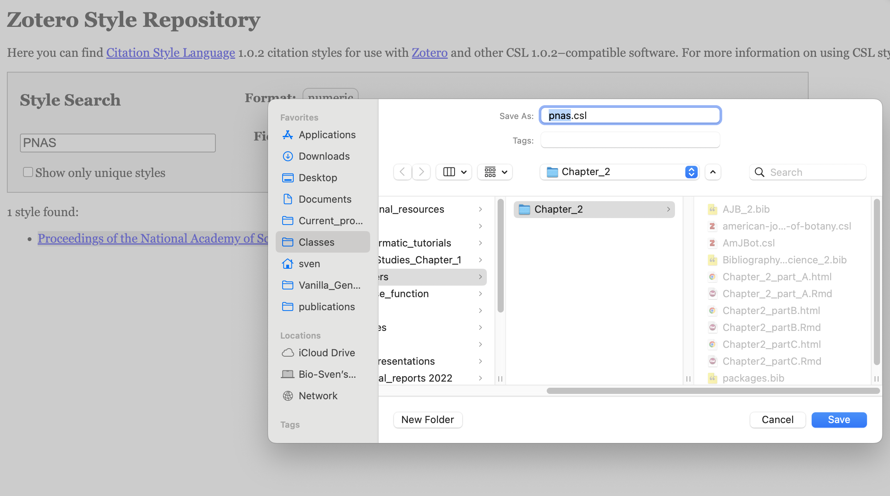
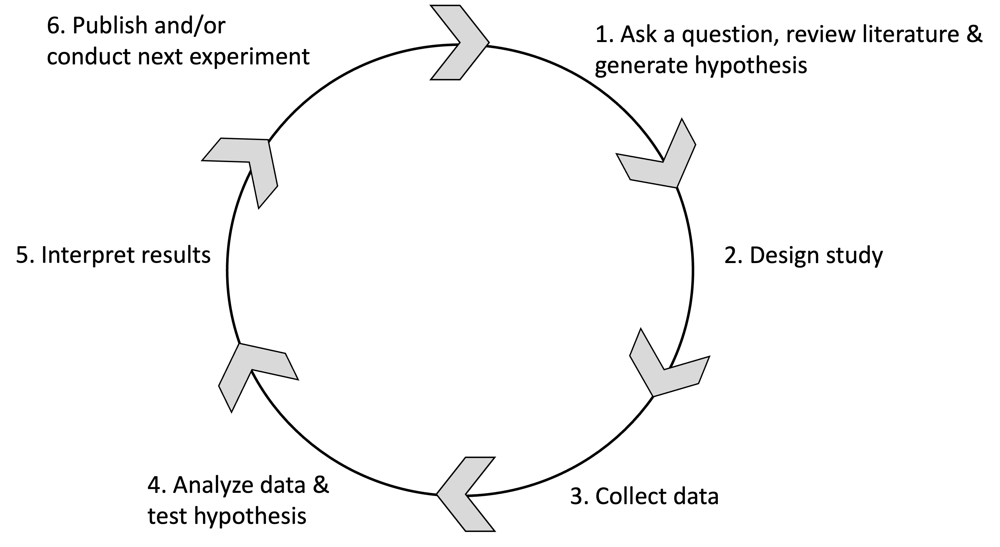

```{js logo-js, echo=FALSE}
$(document).ready(function() {
  $('#header').parent().prepend('<div id=\"logo\"></div>');
  $('#header').css('margin-right', '120px')
});
```

```{r packages, echo = FALSE, warning = FALSE, include = FALSE, cache = FALSE}
###~~~
# Load R packages
###~~~
# Create vector w/ R packages
# --> If you have a new dependency, don't forget to add it in this vector
pkg <- c("knitr", "rmarkdown", "bookdown", "formattable", "kableExtra", 
         "dplyr", "magrittr", "prettydoc", "htmltools", "knitcitations", 
         "bibtex", "devtools", "kfigr", "data.tree", "DT", 
         "DiagrammeR", "rticles", "klippy")  # Added klippy

##~~~
# 2. Check if pkg are installed
##~~~
print("Check if packages are installed")
new.pkg <- pkg[!(pkg %in% installed.packages())]

##~~~
# 3. Install missing packages
##~~~
if (length(new.pkg) > 0) {
  print(paste("Install missing package(s):", new.pkg, sep = ' '))
  for (p in new.pkg) {
    if (p == "klippy") {
      devtools::install_github("rlesur/klippy")  # or use remotes::install_github()
    } else {
      install.packages(p, dependencies = TRUE)
    }
  }
} else {
  print("All packages are already installed!")
}

##~~~
# 4. Load all packages
##~~~
print("Load packages and return status")
sapply(pkg, require, character.only = TRUE)

# Generate BibTeX citation file for all R packages used to produce report
knitr::write_bib(.packages(), file = 'packages.bib')
```

```{r setup, include = FALSE, cache = FALSE, message = FALSE}
# Chunk options: see http://yihui.name/knitr/options/ ###

## Text results
#opts_chunk$set(echo = TRUE, warning = TRUE, message = TRUE, include = TRUE)

## Code decoration
opts_chunk$set(tidy = TRUE, tidy.opts = list(blank = FALSE, width.cutoff = 60), highlight = TRUE)

## Caching code
#opts_chunk$set(cache = 2, cache.path = "cache/")

## Plots
#opts_chunk$set(fig.path = "Figures_MS/", dev=c('pdf', 'png'), dpi = 300)

## Locate figures as close as possible to requested position (=code)
knitr::opts_chunk$set(fig.pos = 'H')

# Read bibtex file
refs <- bibtex::read.bib("Bibliography_Reproducible_Science_2.bib")
```

<!-- THIS code adds a copy/paste button to copy code -->
```{r klippy-code, echo=FALSE, results='asis'}
# Enable klippy button
if (requireNamespace("klippy", quietly = TRUE)) klippy::klippy(position = c("top", "right"))
```

<!-- THIS CODE CHUNK is used for pdf viewing -->

```{r embendpdf, echo = F, results='hide'}
embed_pdf <- function(pdf_path, unique_id) {
  cat(glue::glue('
<div style="text-align: center;">
  <iframe id="pdfFrame{unique_id}" allowfullscreen src="{pdf_path}" width="100%" height="600px" style="border:none;">
    <p>Your browser does not support PDFs. <a href="{pdf_path}">Download the PDF</a>.</p>
  </iframe>
</div>
  '))
}
```


# Syllabus

Please see this [webpage](index.html) for more details on the Syllabus.

# Chapt. 1 -- The Reproducibility Crisis {#chap1}
## Goal

In this chapter, we engage in group activities and literature reading to **explore the concept of reproducible science**, including its challenges, benefits, and practical implementation in research. Overall, this chapter aims to provide a broader understanding of reproducible science and the context that underpins the material covered throughout the course.

The chapter is subdivided into two parts:

- [PART A:](#WhatRepSci) What is Reproducible Science?
- [PART B:](#WhatFacBreakRep) What Factors Break Reproducibility?

## Learning Outcomes

- Understand the definitions of reproducibility and replicability in scientific research
- Identify the importance of reproducible science for research integrity and advancements
- Recognize the challenges to achieving reproducibility and potential solutions
- Engage with practical tools and strategies to promote reproducible research practices 

## Online Resources {#OnlineResChap1}

This list of online resources supports our group activities:

- [Reproducibility and Replicability in Science](https://doi.org/10.17226/25303) - A report published by the National Academies of Sciences, Engineering, and Medicine.
- [Retraction Watch](https://retractionwatch.com/) - Tracking retractions as a window into the scientific process.
- [PubPeer](https://pubpeer.com/) - An online journal club where researchers are posting comments on articles.
- [PubMed](https://pubmed.ncbi.nlm.nih.gov/) - This database comprises more than 39 million citations for biomedical literature from MEDLINE, life science journals, and online books. Citations may include links to full text content from PubMed Central and publisher web sites.
- [RESCIENCE C](http://rescience.github.io/) - Reproducible Science is good. Replicated Science is better.
- [Peer Review Week](https://peerreviewweek.net/index.php) - Peer Review Week is a community-led yearly global virtual event celebrating the essential role that peer review plays in maintaining research quality. The event brings together individuals, institutions, and organizations committed to sharing the central message that quality peer review in whatever shape or form it may take is critical to scholarly communication.
- [Research Integrity and Peer Review](https://researchintegrityjournal.biomedcentral.com/) - An international, open access, peer reviewed journal that encompasses all aspects of integrity in research publication, including peer review, study reporting, and research and publication ethics.
- [Tools such as ChatGPT threaten transparent science; here are our ground rules for their use](https://www.nature.com/articles/d41586-023-00191-1) - A *Nature* editorial discussing the inclusion of AI in research articles.

## What is Reproducible Science? {#WhatRepSci}

To investigate this question, **students engage in self-reflection and group activities designed to explore the meaning of reproducible science and its implementation in research** and scientific publications.

**Disclaimer:** The instructor has provided definitions and other supporting materials (in collapsible boxes) throughout this section. However, students are advised not to read these materials in advance, in order to complete the exercises sincerely and derive the greatest benefit from the experience.  

### Class Outline

The structure of this class, held over two sessions, is as follows:

1. [Introduction and Definitions](#IntroDef) <span style="color:dimgray;">(30 minutes)</span>
2. [Case Studies and Challenges](#CaseStudies) <span style="color:dimgray;">(80 minutes over two sessions)</span>
3. [Best Practices and Open Science Tools](#BestPract) <span style="color:dimgray;">(20 minutes)</span>
4. [Wrap-up and Future Directions](#WrapUp) <span style="color:dimgray;">(10 minutes)</span>

The first two sections will be covered during Session 1, while the remaining sections will be addressed in Session 2.  
Please ensure that you have identified the reproducibility challenges in your assigned publication (see [Case Studies and Challenges](#CaseStudies)) prior to attending the second session. 

### Introduction and Definitions {#IntroDef}

#### ✍️ Individual Self-Reflection <span style="color:dimgray;">(5 minutes)</span>

Students reflect on what **“reproducible science”** means to them and write down a personal definition.

---

#### 🤝 Group Sharing and Discussion <span style="color:dimgray;">(15 minutes)</span>

- Form small groups (2-3 students)
- Small groups share and compare their definitions
- Each group presents insights to the class to foster open discussion

---

#### 📘 Formal Definitions <span style="color:dimgray;">(10 minutes)</span>

Standard definitions are introduced to clarify the distinction between **reproducibility** and **replicability**.  
Students are invited to relate them to their own research experience.

<details>
<summary><b>📌 What is Reproducible Science?</b></summary>

Reproducible science means **achieving the same findings** using the **original data, methods, and code**.

**Key elements:**

- **Transparency** – Open access to data, code, and methods.
- **Documentation** – Clear steps and research design explanation.
- **Data Availability** – Raw data is publicly available.
- **Code Availability** – Scripts are shared and well-commented.
- **Standardized Practices** – Use of trusted tools and workflows.

</details>

<details>
<summary><b>🔄 Reproduction vs. Replication</b></summary>

**Reproduction** = Running the same code on the same data to verify results (like software testing for an entire study).  
**Replication** = Repeating the study with **intentional variations** (e.g., different species, software, or parameters) to test if conclusions hold.

- **Reproduction** confirms that the research is **traceable** and correctly recorded.
- **Replication** tests **what aspects of a study matter** for the results to hold.

<blockquote><b>Key insight:</b> Replication is most useful <i>after</i> reproduction is verified.</blockquote>

<br>

<b>💭 Think about it:</b> Can you think of examples of scientific studies, methods, or protocols where replication would be particularly important? What would you learn by repeating them with intentional variations?

</details>

### Case Studies and Challenges {#CaseStudies}

#### 👥 Group Work Activity <span style="color:dimgray;">(50 minutes)</span>

Each group is given a real-world **publication that illustrates challenges to reproducibility**, such as:

- 🔒 **Lack of data/code sharing**  
  Data and code are not made available, preventing verification and reuse.
- 🧩 **Incomplete methodological detail**  
  Missing or vague descriptions of protocols, tools, or parameters hinder reproducibility.
- 📉 **Poor statistical practices**  
  Misuse or misunderstanding of statistical tests can lead to invalid conclusions.
- 🎯 **Publication bias**  
  Preference for positive or novel results skews the scientific record and limits replication efforts.
- 🤖 **Unclear or unvalidated use of AI tools**  
  Use of AI (e.g., large language models, predictive algorithms) without documenting models, prompts, parameters, or validation steps reduces transparency and reproducibility.
- 🧪 **Data manipulation or selective reporting**  
  Deliberate or unintentional exclusion, alteration, or cherry-picking of data that misrepresents findings.

#### 📄 Publications Used in This Activity

I assign one of the retracted articles below to each group at the start of the activity. The links are here so that you can find your article again afterwards. The reasons behind each retraction are given at the end of this section --- **work through your article and reach your own conclusions before opening that table.** The articles are also available on our [Google Drive](https://drive.google.com/drive/folders/1AeoPIzzs4mEUMIhUiACT7TYtUHS9U0Nu?usp=drive_link).

```{r caseassign, echo=FALSE, results='asis', warning=FALSE, message=FALSE}
###~~~
# Case-study assignments, derived from the same Retraction Watch csv that feeds
# Table \@ref(tab:retractionwatch), so the group numbers, titles and DOIs here
# can never drift away from that table. Each link goes to the ORIGINAL article
# (OriginalPaperDOI), which is what the group has to read -- not to the
# retraction notice.
###~~~
cols  <- c("GroupID", "Title", "Journal", "OriginalPaperDOI")
cases <- read.csv("Chapters_files/Chapter_1_PartA_Case_Studies.csv")[, cols]
cases <- cases[order(cases$GroupID), ]

stopifnot(all(nzchar(cases$OriginalPaperDOI)))   # no group left without a link

for (i in seq_len(nrow(cases))) {
  cat(sprintf("- **Group %s** --- [%s](https://doi.org/%s), *%s*\n",
              cases$GroupID[i], cases$Title[i],
              cases$OriginalPaperDOI[i], cases$Journal[i]))
}
```

---

**📝 Task Instructions:**

Each group:

1. **Read** their assigned publication
2. **Identify** specific reproducibility challenges
3. **Investigate** the journal where the article was published, including its policies and practices related to **research ethics, integrity, transparency, and reproducibility**, as well as its **impact and influence** in the field
4. **Discuss** how these challenges and the journal’s practices might impact the broader research community
5. **Brainstorm** strategies or solutions to mitigate these issues and improve reproducibility, considering both **researchers and journals**

<blockquote>
💡 <b>Note:</b> Students are encouraged to explore their assigned study online and consult the provided <a href="#OnlineResChap1">resources</a>.  
<b>However, please form your own conclusions before researching externally.</b>
</blockquote>

---

#### 📢 Group Presentations & Class Discussion <span style="color:dimgray;">(20 minutes)</span>

- Each group presents:
  - The **reproducibility challenges** in their case study
  - **Proposed solutions** or best practices to address them

- 🧭 **Facilitated Discussion Tip:**  
  Guide the discussion by drawing links across different case studies — uncover **systemic challenges** and the **interconnected factors** that shape reproducibility across disciplines.

#### Reasons Behind the Retractions of Case Studies <span style="color:dimgray;">(10 minutes)</span>

The data supporting the retractions of the case studies are presented in Table \@ref(tab:retractionwatch) (sourced from [Retraction Watch](https://retractionwatch.com/)). Digital Object Identifiers ([DOI](https://www.doi.org/)) and [PubMed IDs]([PubMed](https://pubmed.ncbi.nlm.nih.gov/)) are provided for each case study.  

<details>
<summary><b>📊 Show Table \@ref(tab:retractionwatch) --- the reasons behind each retraction</b></summary>

```{r retractionwatch, warning = FALSE, echo = FALSE}
###~~~
# Load data
###~~~
retractioncsv <- read.csv("Chapters_files/Chapter_1_PartA_Case_Studies.csv")
###~~~
# Plot timetable in doc
###~~~
knitr::kable(retractioncsv, caption = "Reasons behind the retractions of case studies sourced from the Retraction Watch database.", format = "html") %>%
  kable_styling(bootstrap_options = c("striped", "hover", "condensed"), 
                full_width = FALSE,  # Prevent full width stretching
                fixed_thead = TRUE) %>%  # Fix header for scrolling
  scroll_box(width = "100%", height = "700px")  # Add scrollable box
```

</details>

### Best Practices and Open Science Tools {#BestPract}

#### 🧠 Whiteboard Brainstorm <span style="color:dimgray;">(20 minutes)</span>

Working in **2--3 groups, each at a whiteboard**, you will build a two-column list: on the left the **issues** that break reproducibility, and on the right the **best practice or open science tool** that addresses each one.

**Start from the retracted articles you have just worked on.** The case studies in [Case Studies and Challenges](#CaseStudies) and the reasons behind their retractions in Table \@ref(tab:retractionwatch) are your raw material: every entry in the *Reason* column of that table is something that somebody failed to prevent. Begin by asking what would have had to be different for your article never to have been retracted.

**The order matters --- diagnose before you prescribe.**

1. **List the issues first** <span style="color:dimgray;">(~8 minutes)</span>
   What actually went wrong in [your group's article](#CaseStudies), and what does Table \@ref(tab:retractionwatch) say went wrong in the other two? Add anything from the challenge types listed in that section, or from your own research experience. Be specific: *"the raw data were never deposited anywhere"* is workable; *"bad practice"* is not.

2. **Then pair each issue with a solution** <span style="color:dimgray;">(~8 minutes)</span>
   Work along your list and, for every issue, name the practice, habit or tool that would have prevented it. Some issues will attract several solutions; some solutions will fix several issues. Both are worth noticing.

3. **Report back** <span style="color:dimgray;">(~4 minutes)</span>
   Each group walks the class through its board. We will then compare the boards to see which issues everyone found, and which were spotted by only one group.

<blockquote>
💡 <b>One rule:</b> every practice or tool on the right must answer a specific issue on the left. A tool nobody can attach to a problem is a tool you do not yet have a reason to use --- and saying so out loud is a perfectly good contribution.
</blockquote>

### Wrap-up and Future Directions {#WrapUp}

#### 🚀 Key Strategies & Tools <span style="color:dimgray;">(10 minutes)</span>

**With your boards from [the brainstorm](#BestPract) still up**, we now compare them against the short list below and turn the discussion towards your own work.

Three questions guide this last part:

1. **What did we all find?** Which practices appeared on every board, and which on only one? A tool that only one group thought of is usually the one worth talking about.
2. **What is missing from the list below --- and what is missing from your boards?** The list is deliberately short. If your board names something it does not, that is not an error on your part; it is a gap in the list, and I would like to hear it.
3. **What will you actually deploy?** For each strategy, ask whether it belongs in *your* research: could you start using it this semester, does it need a tool you do not yet have, or is it not relevant to the kind of data you work with? Naming one practice you will adopt is worth more than agreeing that all of them are good.

Every item below is developed further in [Chapt. 5 -- Data Management and Reproducible Code](#Chap5), so this is a map of where we are going as much as a summary of where we have been.

Please don't look at the content of the box before we get here!

<details>
    <summary><b> ✅ Strategies and tools for reproducible science</b></summary>
<ul>
  <li><strong>Detailed Protocols:</strong> Importance of clear and precise documentation of all steps leading to data production.</li>
  <li><strong>Lab Notebooks:</strong> For improved documentation and data management.</li>
  <li><strong>Version Control:</strong> Using tools like Git for code and data management.</li>
  <li><strong>Data and Code Repositories:</strong> Platforms like Dryad, Zenodo, and Figshare for sharing research materials.</li>
</ul>
</details>


## What Factors Break Reproducibility? {#WhatFacBreakRep}

### Goal

In Part A, we investigated what reproducible science *is*, and why it fails. In Part B, we ask **which factors break it**, and then we do something about them.

We work from two sources of evidence: the survey of 1,576 researchers published by @Baker_2016, which reports what the scientific community itself blames for irreproducible work, and the report of the National Academies of Sciences, Engineering, and Medicine [@NAP25303], which sets out what should be done about it.

**The goal of Part B is to turn that evidence into a defence.** By the end of these two sessions your group will have produced one deliverable: a **[reproducibility charter](#draftcharter)** --- a set of standards your research team commits to, each one chosen to block a specific factor known to break reproducible science. It is a short shared document, and if you want to see what a standard actually looks like before we begin, there are [worked examples of charter clauses](#chartertemplate) further down. The diagnosis is where we start; the charter is what we are here to produce.

**Your charter opens by saying what it is for.** Before any of the standards, it states in three lines what your group means by *reproducible science*, and what distinguishes *reproducibility* from *replicability* (the definitions you worked on in [Part A](#IntroDef)). A charter that sets standards without saying what they are for is just a list of rules; those three lines are what the rules are in service of, which is why they sit at the top. Everything below them has to earn its place by serving them.

### Class Outline

This class is run as a single [**group activity**](#FactorsActivity) (writing your group's reproducibility charter) held over two sessions and divided as follows:

1. [Overview of the Group Activity](#FactorsActivity) <span style="color:dimgray;">(10 minutes)</span>
2. [What Do You Remember?](#recall) <span style="color:dimgray;">(10 minutes)</span>
3. [Review the Resources](#reviewres) <span style="color:dimgray;">(10 minutes)</span>
4. [The Factors, Together](#factors) <span style="color:dimgray;">(10 minutes)</span>
5. [Draft Your Charter](#draftcharter) <span style="color:dimgray;">(30 minutes)</span>
6. [Stress-Test Another Team's Charter](#stresstest) <span style="color:dimgray;">(20 minutes)</span>
7. [Revise and Commit](#commitcharter) <span style="color:dimgray;">(15 minutes)</span>

The first four sections will be covered during Session 1, while the remaining sections will be addressed in Session 2.  
**Each group finishes its draft charter as homework between the two sessions, and adds a short block of definitions at the top**, because Session 2 opens with another group taking it apart (see [Draft Your Charter](#draftcharter)).

Every one of these sections draws on the [**Resources**](#PartBresources) set out below: the two **publications**, the **teaching material**, and the **recommendations** of the National Academies. They are the evidence this class is built on --- you will check your own answers against them in [Review the Resources](#reviewres), and draw on them again for every clause you write into your charter.

### Investigated Questions

We will be investigating the following questions:

- Is there a reproducibility crisis?
- How much published work in your field is reproducible?
- What is the scale of the reproducibility crisis?
- What corrective measures can be implemented?
- What factors contribute to irreproducible research?
- What can be done to mitigate the reproducible crisis?

### Resources {#PartBresources}

#### Publications {#PartBpubs}

The PDFs of @Baker_2016 and @NAP25303 are available in our shared [Google Drive](https://drive.google.com/drive/folders/13aOxsvVgyxA3sm8bf1RBXLvrR5nCHVhp?usp=drive_link) at the following paths:

`Reproducible_Science > Publications > Baker_Nature_2016.pdf`  
`Reproducible_Science > Publications > Reproducibility_and_Replicability_in_Science_2019.pdf`


#### Teaching Material {#PartBteaching}

The presentation associated with this class is below. We work through it in [The Factors, Together](#factors), after you have committed to your own answers --- and it is here afterwards for revision.

<!-- Container for the iframe and button -->
<div style="text-align: center;">
  <button onclick="toggleFullScreen()">Toggle Full Screen</button>
  <iframe id="pdfFrame" src="Chapters_files/Chapter_1_Part_B_Reproducibility_crisis.pdf" width="100%" height="600px" style="border:none;">
    <p>Your browser does not support PDFs. <a href="Chapters_files/Chapter_1_Part_B_Reproducibility_crisis.pdf">Download the PDF</a>.</p>
  </iframe>
</div>

<script>
function toggleFullScreen() {
  var elem = document.getElementById("pdfFrame");
  if (!document.fullscreenElement) {
    if (elem.requestFullscreen) {
      elem.requestFullscreen();
    } else if (elem.mozRequestFullScreen) { // Firefox
      elem.mozRequestFullScreen();
    } else if (elem.webkitRequestFullscreen) { // Chrome, Safari
      elem.webkitRequestFullscreen();
    } else if (elem.msRequestFullscreen) { // IE/Edge
      elem.msRequestFullscreen();
    }
  } else {
    if (document.exitFullscreen) {
      document.exitFullscreen();
    }
  }
}
</script>


#### Recommendations {#NASEMrec}

The most relevant recommendations proposed by the @NAP25303 for our course are listed in the table below. It is searchable, so in [Review the Resources](#reviewres) you can look up the three factors on your shortlist rather than reading the whole table.

```{r recommendations, eval = T, echo = F, warning = FALSE, message = FALSE, escape = F}
###~~~
# Read in CSV with recommendations
###~~~
rec <- read.csv("Chapters_files/Chapter_1_B_National_Academies_Report_Recommendations.csv")
rownames(rec) <- NULL
###~~~
# Preprocess Markdown to HTML
###~~~
# Function to convert Markdown bold (**text**) to HTML <strong>text</strong>
convert_markdown_to_html <- function(text) {
  if (is.na(text)) return(text)
  # Replace **text** with <strong>text</strong>
  gsub("\\*\\*(.*?)\\*\\*", "<strong>\\1</strong>", text)
}

# Apply conversion to all character columns (adjust based on your CSV structure)
for (col in names(rec)[sapply(rec, is.character)]) {
  rec[[col]] <- sapply(rec[[col]], convert_markdown_to_html)
}
###~~~
# Plot timetable in doc
###~~~
# Plot table with HTML rendering
DT::datatable(rec, 
              extensions = 'Buttons',  # Remove Markdown extension
              options = list(
                dom = 'Blfrtip', 
                buttons = c('copy', 'csv', 'excel', 'pdf', 'print'),
                pageLength = 5  # Set to display 5 rows by default
              ), 
              rownames = FALSE,
              escape = FALSE) %>%  # Allow HTML rendering
  DT::formatStyle('Topic', fontWeight = 'bold')
```

<hr style="border: 2px solid #333; margin: 2em 0;">


### 👥 Group Activity: Write Your Lab's Reproducibility Charter {#FactorsActivity}

In this session we cover the material of Part B (the survey evidence of @Baker_2016, the recommendations of @NAP25303, and the [questions listed above](#WhatFacBreakRep)) and then put it to work. You will use it to write something of your own: a **reproducibility charter**.

<blockquote>
📜 <b>Charter</b> <i>(noun)</i> --- a short written document in which a group sets out the standards it binds <i>itself</i> to.
<br><br>
A charter is not advice, and not a summary of good practice. Guidelines describe what researchers in general ought to do; a charter states what <b>this group will always do</b>. Three things follow from that: it is written by the people who will be held to it, each commitment is specific enough that somebody else can tell whether it was kept, and it is public within the group, so colleagues can point to it when it is not.
<br><br>
Research groups, laboratories and consortia write these for exactly this reason --- so that standards survive a deadline, a new student, or a change of principal investigator, instead of living in one person's head.
</blockquote>


#### Why we are doing this

**You already have the evidence you need.** Three things feed this charter, and every clause you write should be traceable to one of them:

1. **What you saw in [Part A](#WhatRepSci).** You examined retracted articles and the reasons behind their retractions (Table \@ref(tab:retractionwatch)). Those are documented failures --- your charter should make them harder to repeat.
2. **What the field reports.** @Baker_2016 tells you which factors researchers themselves blame most often. A charter that ignores the commonest causes is not serious.
3. **What has been recommended.** @NAP25303 sets out what the National Academies concluded should change. You can adopt, adapt or argue with it, but you should know what it says.

**The test for every clause is whether it supports the [scientific process](#scientificprocess)** --- whether it makes it more likely that a claim you publish can be checked, repeated and built on by somebody else. That is what reproducibility is *for*. A standard that is merely tidy, or that only makes your own life easier, is not yet a reproducibility standard.

**And this is not a one-off exercise.** Nearly everything you write today (data management, documentation, reproducible code, version control, deposition, citation) is developed properly later in this course. Your charter is therefore a **map of where we are going**: at the end of the semester you should be able to return to it and find that you now know how to implement what you committed to today, and to judge whether you were ambitious enough.

Work in **two groups of three**. Each group is a research team, and **every member owns one section of the charter**:

| Role | Owns the standards for |
|---|---|
| **Data lead** | How data are generated and recorded: protocols, field and laboratory notes, file naming, storage, backup and metadata |
| **Analysis lead** | Code and statistics: the analysis plan, what is decided before the data are seen, and how an analysis is made re-runnable |
| **Reporting lead** | What leaves the group: what is deposited and when, how results and limitations are reported, and how data, software and sources are cited |

Between them these three cover the whole data life cycle, so nothing in the charter is unowned. **You are responsible for your section and you will be the one defending it**, so choose the role closest to the research you actually do --- or the one furthest from it, if you would rather learn something new.


#### 🧠 What Do You Remember? <span style="color:dimgray;">(10 minutes)</span> {#recall}

**Books closed.** No paper, no slides, no notes, no laptops. You read @Baker_2016 for today, and this is where you find out how much of it stayed with you.

Working as a group, agree on four answers and **write them on a single sheet**:

1. **The scale.** Of the 1,576 researchers surveyed, what share reported a *significant* reproducibility crisis? Give a percentage.
2. **Your own field.** What proportion of published work in your field do you believe is reproducible? This one is not recall --- it is your own judgement, and there is no answer at the back of the book.
3. **The causes.** Which **three factors** did respondents most often blame for irreproducible research? Name them as precisely as you can.
4. **Your shortlist.** From those, a **provisional** list of the three factors you think are most dangerous to *your* research. Provisional because you are about to check your answers, and may want to change your mind.

**Commit to specifics.** "Quite a lot of people" is not an answer; "about 70%" is. Recalling something and getting it wrong fixes the right answer in memory far better than reading it a second time does --- which is the whole point of doing this before you open anything.

<blockquote>
📄 <b>What you take out of this step:</b> one sheet per group, with four answers on it. You will mark it up in <a href="#reviewres">Review the Resources</a>, and your shortlist becomes what the charter has to defend against.
</blockquote>


#### 📖 Review the Resources <span style="color:dimgray;">(10 minutes)</span> {#reviewres}

**Now confirm your answers against the evidence.** You have committed to four answers from memory; this step is where you find out which of them hold up. The PDFs are on our shared Google Drive as well as linked below.

Work **individually, and in silence**. Go to [Resources](#PartBresources) and give each of the three a few minutes:

- the [publications](#PartBpubs) --- check the figures you have just tried to recall, and read around the ones you got wrong;
- the [teaching material](#PartBteaching) --- skim the slides for anything you have not already met;
- the [recommendations](#NASEMrec) --- the table is searchable, so look up the three factors on your group's shortlist.

Mark up your sheet as you go: correct the numbers you got wrong, and note which of your three factors you now want to keep, and which you want to swap.

**Read with your own role in mind.** You will shortly be drafting as the data, analysis or reporting lead, and this is the only part of the session where you are reading rather than arguing --- so note down what you will want when it is your turn to write.

By the end of this step your group should have a **corrected sheet and a settled shortlist** --- the evidence checked, the three factors chosen. That is everything the charter needs to be built on.

#### 📊 The Factors, Together <span style="color:dimgray;">(10 minutes)</span> {#factors}

I will take us through the factors that break reproducibility, drawing on the [slides](#PartBteaching) and on the recommendations of @NAP25303. Since you have read @Baker_2016 already, this is a short synthesis rather than a walk through the paper.

Keep the three factors from the [previous step](#recall) in front of you: if something named here is not on your list, add it --- your charter is about to have to deal with it.


#### ✍️ Draft Your Charter <span style="color:dimgray;">(30 minutes)</span> {#draftcharter}

**Write it in a shared document.** Before you start, one member of each group creates a **Google Doc** (preferred, because all three of you can type in it at once) or a **Word document**, names it `Charter_Group1` or `Charter_Group2`, and saves it in our shared Google Drive at [`Reproducible_Science > Chapters > Chapter_1 > Part_B`](https://drive.google.com/drive/folders/1l3ZwbVjiswHWdW38wt5Hd7VxS-_uHKOG?usp=drive_link). Give it four headings --- **Definitions**, **Data**, **Analysis**, **Reporting**. Each lead writes under their own section today; the **Definitions** block is completed as homework (see the end of this step).

Keeping it in that folder is what makes the rest of the activity work: it is how the three of you draft together, how you carry on after class, and how the other group opens your charter to stress-test it.

Each lead drafts the clauses for their own section. Between you, the charter must address all three factors from the [first step](#recall), and you may consult the [recommendations table](#NASEMrec) for wording and for what others have proposed.

**Be ready to say where each clause comes from** --- a failure you saw in [Part A](#CaseStudies), a factor reported by @Baker_2016, or a recommendation from @NAP25303. A clause nobody can source is usually a habit, not a standard.

**The standard is that a clause must be checkable.** Somebody outside your group should be able to tell whether you followed it:

- ❌ *"We will document our data well."*
- ✅ *"Every dataset has a README recording who collected it, when, with what instrument, and what each column means, written before the data leave the field laptop."*

For each clause, be ready to say **what it costs** --- in time, in effort, or in freedom to change your mind later. A standard nobody can afford is a standard nobody will keep.

**You are not starting from nothing.** The box below gives each lead a set of questions to work through, one worked example to show the level of detail expected, and where to look in the course material. Aim for **two or three clauses per section** --- six to nine in total is a charter; twenty is a wish-list. The three definitions go at the top, and are written as homework once the clauses are settled.

<details id="chartertemplate">
<summary><b>🧭 Starting points for each section</b></summary>

<p><b>📜 Definitions</b> --- completed as homework, see <a href="#IntroDef">Introduction and Definitions</a> in Part A. One line each for <i>reproducible science</i>, <i>reproducibility</i> and <i>replicability</i>, in your own words. Write them <b>after</b> your clauses, not before: it is far easier to say what your standards are for once you can see what they actually are.</p>

<p><b>Everyone:</b> the four strategies in <a href="#WrapUp">Wrap-up and Future Directions</a> --- detailed protocols, laboratory notebooks, version control, and data and code repositories --- are the obvious backbone. Your charter should say something about each of them, in the section where it belongs.</p>

<p><b>📊 Data lead</b> --- see <a href="#partDM">Data Management</a> (Chapt. 5) and the data life cycle: create, process, document, preserve, share, reuse.</p>
<ul>
  <li>Where do raw data live the moment they are created, and where is the second copy?</li>
  <li>How would somebody who was not there know what each file, and each column, contains?</li>
  <li>What has to be written down <em>at the time</em> because it cannot be reconstructed later?</li>
  <li>What happens to the raw file once cleaning starts?</li>
</ul>
<p><em>Example clause:</em> "Raw data are never edited. All cleaning happens in a script, and the raw file is kept read-only."</p>

<p><b>💻 Analysis lead</b> --- see <a href="#repcode">Reproducible Code</a> (Chapt. 5).</p>
<ul>
  <li>Which decisions in an analysis get made <em>after</em> seeing the data, and which should be fixed before?</li>
  <li>If your laptop disappeared tomorrow, what would somebody need in order to re-run your analysis?</li>
  <li>How do you record which version of which software produced a given result?</li>
  <li>How does a number in your manuscript get traced back to the code that produced it?</li>
</ul>
<p><em>Example clause:</em> "Every figure and table in a manuscript is produced by code that runs from the raw data with a single command."</p>

<p><b>📢 Reporting lead</b> --- see <a href="#chap4">Open Science and CARE Principles</a> and <a href="#getpub">Getting Published</a>.</p>
<ul>
  <li>What must a reader have in order to check your central claim for themselves?</li>
  <li><em>When</em> does that become available --- at submission, at acceptance, on request, or never?</li>
  <li>How are data, code and software credited, and who is an author?</li>
  <li>What do you report when an analysis did not work, or was abandoned?</li>
</ul>
<p><em>Example clause:</em> "Data and code are deposited before submission, not after acceptance, and every software package is cited with its version."</p>

</details>

<blockquote>
📌 <b>Before Session 2:</b> finish the draft. You are not expected to leave today with a complete charter --- you are expected to leave with every section started and the hard arguments had. Each lead completes their own clauses as homework <b>in the shared document</b>, so the group arrives with <b>one agreed draft</b> rather than three sets of notes. Have it finished before the next session starts --- the other group opens it straight away.
<br><br>
<b>Then add the Definitions block at the top of the charter.</b> Three entries, <b>one line each</b>:
<ul>
  <li><b>Reproducible science</b> --- what it is, in a single sentence;</li>
  <li><b>Reproducibility</b> --- what it means to reproduce a study;</li>
  <li><b>Replicability</b> --- and how that differs.</li>
</ul>
Use the definitions you worked on in class in <a href="#IntroDef">Introduction and Definitions</a> (Part A), <b>written in your own words</b> rather than copied. As set out in the [Goal](#WhatFacBreakRep), these lines are what the rest of your charter is in service of --- and in the next session the other group will read them first, then check whether your clauses actually deliver them.
</blockquote>

#### 🔍 Stress-Test Another Team's Charter <span style="color:dimgray;">(20 minutes)</span> {#stresstest}

**Open the other group's charter** from [`Reproducible_Science > Chapters > Chapter_1 > Part_B`](https://drive.google.com/drive/folders/1l3ZwbVjiswHWdW38wt5Hd7VxS-_uHKOG?usp=drive_link) --- you review theirs, they review yours. Add your challenges as **comments in their document**, so they can see exactly which clause each objection lands on. Your job now is to be the sceptic:

a. **Which clause breaks first** when a deadline is three days away?
b. **Which clause is unenforceable** --- how would anyone know it had been broken?
c. **What is missing?** Look at the retracted articles and Table \@ref(tab:retractionwatch) in [Part A](#CaseStudies): would this charter have prevented those retractions?
d. **Do the clauses serve the definitions?** Read the Definitions block at the top, then the clauses below it. Does this charter actually deliver what the group says reproducible science is?

Then hand it back. **Each lead answers the challenges to their own section**, replying to the comments on their own clauses --- defend the clause, or concede and rewrite it. Both are good answers; neither is a loss. The comment thread is worth keeping: it is a record of which standards survived scrutiny and which did not.


#### ✅ Revise and Commit <span style="color:dimgray;">(15 minutes)</span> {#commitcharter}

Revise your charter in the light of the challenges, then each student states, out loud, **one clause from their own section that they will apply to their own project this semester** --- starting now, not in principle.

We will keep the charters, and they will guide the rest of the course. What you have written today is developed in [Chapt. 4 -- Open Science and CARE Principles](#chap4), in [Data Management](#partDM) and [Reproducible Code](#repcode) in Chapt. 5, and in [Chapt. 6 -- Getting Published and Peer Review](#chap6). We will return to your charter as we go: each time, you should be able to take a clause you wrote today and say how you would now actually implement it.

<blockquote>
💡 <b>Why a charter?</b> Diagnosing other people's failures is comparatively easy. Deciding what <i>your</i> group will always do --- knowing it will cost you something, and that colleagues can hold you to it --- is what a research lead actually does. That is the skill this activity is for.
</blockquote>


# Chapt. 2 -- R, R Markdown and User-Defined Functions {#chap2}
## Introduction

In this chapter, we introduce the use of **bioinformatics tools for writing and disseminating reproducible reports**, as implemented in RStudio [@RStudio]. More specifically, we will learn how to **link and execute data and code within a unified environment** (see Figure \@ref(fig:ReproScience)). 


### Aim

This chapter aims to ***equip students with the essential skills required to effectively use R Markdown for integrating text, code, figures, tables, and references into a cohesive, reproducible document***. The final output can be rendered into multiple formats—including `PDF`, `HTML`, or `Word`—to streamline the communication and sharing of research findings.

This tutorial provides students with the foundational knowledge necessary to complete their bioinformatics tutorials (**PART 2**) and individual projects (**PART 3**).

### Objectives

The chapter is divided into six parts, each with specific learning objectives:

- [**PART A:**](#partA) Learning the Basics
- [**PART B:**](#partB) Setting Your R Markdown Document
- [**PART C:**](#partC) Tables, Figures, and References  
- [**PART D:**](#partD) Advanced R Markdown Settings  
- [**PART E:**](#partE) User-Defined Functions in R  
- [**PART F:**](#partF) Interactive Tutorials  

```{r ReproScience, fig.alt="A left-to-right gradient scale from blue to gold: a blue box labeled Publication only sits at the not reproducible end, a wide middle box labeled Publication plus contains three graded levels (Data, then Data and code, then Linked and executable data and code), and a gold box labeled Full replication sits at the gold standard end.", echo=FALSE, fig.cap="The spectrum of reproducibility.", fig.show="asis", out.width = '100%'}
knitr::include_graphics("Figures/Fig1.png")
```

### Supporting Files {#Files}

Files supporting this chapter are available on [Google Drive](https://drive.google.com/drive/folders/1Olb6huHcBfv02OxL50WEbQR-uJvkuX7O?usp=drive_link).

### Install R Markdown Software

Software and packages required to perform this tutorial are detailed below. Students should install those software and packages on their personal computers to be able to complete this course. Additional packages might need to be installed and the instructor will provide guidance on how to install those as part of the forthcoming tutorials.

- **R**: https://www.r-project.org
- **R packages**: `bookdown`, `knitr` and `R Markdown`. Use the following R command to install those packages:
```{r eval=F, tidy=TRUE}
install.packages(c("bookdown","knitr", "rmarkdown"))
```
- **RStudio**: https://www.rstudio.com/products/rstudio/download/
- **TeX**: This software is required to compile document into `pdf` format. Please install MiKTeX on Windows, MacTeX on OS X and TeXLive on Linux. **For this class, you are not requested to install this software**, which takes significant hard drive space and is harder to operate on Windows OS. 

**NOTE:** The instructor is using the following version of `RStudio`: Version 2025.05.0+496 (2025.05.0+496). If your computer is experiencing issues running the latest version of the software, you can install previous versions [here](https://docs.posit.co/previous-versions/rstudio/).

### What is RStudio?

RStudio [@RStudio] is an **integrated development environment (IDE)** that allows you to interact with R more efficiently. While similar to the standard R GUI, RStudio is significantly more user-friendly. It offers more drop-down menus, tabbed windows, and extensive customization options (see Figure \@ref(fig:IDE)). 

Detailed information on using RStudio can be found on [RStudio’s website](https://support.rstudio.com/hc/en-us/sections/200107586-Using-RStudio).

```{r IDE, fig.alt="Screenshot of the RStudio window with labels overlaid on each of its four panes: Source with an open .Rmd file top left, Console/Terminal/RMarkdown bottom left, Environment/History/Connections top right, and Files/Plots/Packages/Help bottom right.", echo=FALSE, fig.cap="Snapshot of the RStudio environment showing the four windows and their content.", fig.show="asis", out.width = '100%'}
knitr::include_graphics("Figures/IDE.png")
```

### Web Resources

Below are URLs to web resources that provide key information related to Chapter 2:

- **R Markdown:** https://rmarkdown.rstudio.com  
- **R Markdown: The Definitive Guide** (by Yihui Xie, J. J. Allaire, and Garrett Grolemund): https://bookdown.org/yihui/rmarkdown/  
- **Write HTML, PDF, ePub, and Kindle books with R Markdown:** https://bookdown.org  
- **bookdown: Authoring Books and Technical Documents with R Markdown** (by Yihui Xie): https://bookdown.org/yihui/bookdown/  
- **knitr:** http://yihui.name/knitr/  
- **Pandoc: A Universal Document Converter:** https://pandoc.org  
- **Bibliographies and Citations in R Markdown:** https://rmarkdown.rstudio.com/authoring_bibliographies_and_citations.html  
- **Tutorial on knitr with R Markdown** (by Karl Broman): http://kbroman.org/knitr_knutshell/pages/RMarkdown.html

## PART A: Learning the Basics {#partA}

In this part, we will provide a survey of the procedures to create and render (or knitting) your first R Markdown document.

### Learning Outcomes

This tutorial provides students with the opportunity to learn how to:

- [Create and render (or "knit") your first R Markdown document](#firstMDhow)
- Understand basic Markdown syntax and conventions, including:
    + [Headers](#headers)  
    + [Inside text commenting](#comment)  
    + [Lists](#lists)  
    + [Italicizing and bolding text](#itbold) 
    + [Creating hyperlinks](#hyperlinks)  
    + [Including code chunks](#codechunkhow)
    + [Inline code](#inlinecode)  
    + [Checking spelling](#checkspell)

### Introduction to R Markdown {#IntroRMd}

Markdown is a simple formatting syntax used for authoring HTML, PDF, and Microsoft Word documents. It is implemented in the `rmarkdown` package. An R Markdown document is typically divided into three sections (see Figure \@ref(fig:RMdown)):

1. **YAML metadata section:** This section provides high-level information about the output format of the R Markdown file. The information defined here is used by the Pandoc program to format the final document (see Figure \@ref(fig:RMdown)).
2. **Main body text:** This section represents the core content of your document or publication and uses Markdown syntax.
3. **Code chunks:** This section allows you to import and analyze data, and to produce figures and tables that are directly embedded in the output document.

```{r RMdown, fig.alt="Screenshot of an R Markdown file open in the RStudio source editor, with overlaid labels marking the YAML metadata section between the triple dashes at the top, the publication core text in the middle, a shaded code chunk labeled importing data, and a second shaded chunk labeled analyze data and output figures and tables.", echo=FALSE, fig.cap="Example of an R Markdown file showing the three major sections.", fig.show="asis", out.width = '100%'}
knitr::include_graphics("Figures/Presentation_RMarkdown.png")
```

### Your First R Markdown Document {#firstMDhow}

In this section, you will learn how to create and knit your first R Markdown document.

#### Create Document

To create an R Markdown document, follow these steps in RStudio:

1. Navigate to: `File -> New File -> R Markdown...`  
2. Enter a title for your document and set the output format to `HTML` (see Figure \@ref(fig:RMdownscreen))
    - **Title:** `Chapter 2 - Part A` (This is the title of your document, not the name of your file; see below)
    - **Note:** We will knit documents to the `HTML` format, which is the default output in RStudio. If you prefer to generate a `PDF` document, you must have a version of the `TeX` program installed on your computer (see Figure \@ref(fig:RMdownscreen)).  
3. Save the `.Rmd` file by selecting: `File -> Save As...`  
    - **File name:** `Chapter_2_part_A.Rmd`  
    - **Project path:** `Reproducible_Science/Chapters/Chapter_2`  
    - **Warning:** Because the knitting process generates multiple files, you should save your `.Rmd` file in a dedicated project folder.

```{r RMdownscreen, fig.alt="Screenshot of the RStudio New R Markdown dialog box, with Document selected in the left-hand list, a Title field, a date field, HTML selected among the Default Output Format radio buttons, and Create Empty Document, OK and Cancel buttons along the bottom.", echo=FALSE, fig.cap="Snapshot of window to create an R Markdown file.", fig.show="asis", out.width = '40%', fig.align="center"}
knitr::include_graphics("Figures/Create_RMarkdown.png")
```

#### Knit Document

To knit {alt=""} or render your R Markdown document into an HTML file, follow these steps in RStudio:

1. Click the `Knit` button (Figure \@ref(fig:RMdown)) in the top toolbar to render the document.  
2. There are several output format options; however, if you simply click the button, RStudio will automatically knit the document using the settings specified in the YAML metadata section (Figure \@ref(fig:RMdown)).  
3. The output file will be created in the same directory as your `.Rmd` file (Figure \@ref(fig:MyFirstRMfolder)). You can monitor the progress in the **R Markdown** console.  

<style>
.info {
  background-color: #e7f3fe;
  border-left: 6px solid #2196F3;
}
</style>
<div class="info">
  <p><strong>💡 Info</strong> If the knitting process fails, error messages will appear in the Render console, often indicating the line in the script where the error occurred (although this is not always the case). These messages are helpful for debugging your R Markdown document.
  </p>
</div>

```{r MyFirstRMfolder, fig.alt="Screenshot of a macOS Finder list view showing an expanded folder named Chapter_2 containing two files, Chapter_2_part_A.html and Chapter_2_part_A.Rmd.", echo=FALSE, fig.cap="Snapshot of your project folder with the knitted html document.", fig.show="asis", out.width = '100%', fig.align="center"}
knitr::include_graphics("Figures/MyFirstRMarkdown_HTML.png")
```

#### <a name="compilation"></a>How Does the Knitting Process Work?

When you knit your document, R Markdown passes the `.Rmd` file to the R *knitr* package, which executes all code chunks and generates a new Markdown (`.md`) file. This Markdown file includes both the code and its output (see Figure \@ref(fig:Rflow)).

The `.md` file created by *knitr* is then processed by the Pandoc program, which converts it into the final output format (e.g., HTML, PDF, or Word) as illustrated in Figure \@ref(fig:Rflow).

```{r Rflow, fig.alt="A left-to-right pipeline of five stages joined by arrows: an .Rmd file icon, a knitr box, an .md file icon, a pandoc box, and finally a stack of output document icons.", echo=FALSE, fig.cap="R Markdown flow.", out.width = '100%'}
knitr::include_graphics("Figures/rmarkdownflow.png")
```

### Basic R Markdown Syntax

In this section, we will focus on learning the syntax and protocols needed to create:

- [Headers](#headers)  
- [Inside text commenting](#comment) 
- [Lists](#lists)  
- [Italicized, bold, and combined formatting](#itbold) 
- [Embedded code chunks and inline code](#hyperlinks)  
- [Spell checking](#checkspell)

To master these skills, edit your `.Rmd` file as we progress, and knit the document to view the final result.

Additional syntax and formatting options are available in the **R Markdown Reference Guide**, which you can access in RStudio as follows:

- Select: `Help -> Cheatsheets -> R Markdown Reference Guide`

**Note:** The **Cheatsheets** section also provides access to other helpful resources related to R Markdown and data manipulation. These documents will be very useful throughout this course.

---

### Before Starting {#beforeyoustart}

Before you start this tutorial, please delete the content of your R Markdown file starting on line 11 `## R Markdown` to the end of the document (see Figure \@ref(fig:beforestart)).

```{r beforestart, fig.alt="Screenshot of the RStudio source editor showing the top of Chapter_2_part_A.Rmd, with the YAML header giving the title, html_document output and a date, followed by a shaded setup code chunk calling knitr opts_chunk set echo TRUE, then the default R Markdown headings and text.", echo=FALSE, fig.cap="R Markdown of Chapter 2 - Part A.", out.width = '100%'}
knitr::include_graphics("Figures/Chapter_2_partA_Rmd.png")
```

---

### Headers {#headers}

Below is the syntax to create headers at three levels:

**Syntax:**
```{r eval=FALSE}
The "#" refers to the level of the header
# Header 1

## Header 2  

### Header 3  
```  

<div class="info">
  <p><strong>💡 Info</strong></p>
  <ul>
    <li>While Markdown headers will render correctly without blank lines, it is best practice to include blank lines both before and after headers. Doing so improves the readability of the raw Markdown and helps minimize knitting quirks. Overall, including a blank line before a header (except at the very start of a document) and after it is not strictly required, but it makes your Markdown cleaner and more consistent.</li>  </ul>
</div>

<style>
.danger {
  background-color: #ffdddd;
  border-left: 6px solid #f44336;
}
</style>
<div class="danger">
  <p><strong>💡 Your turn to practice this syntax in your document by:</strong>
    <ul>
      <li>Including 2 level 1 headers</li>
      <li>Embedding 2 level 2 headers under each level 1 header</li>
      <li>Checking your code by knitting the document</li>
    </ul>
  </p>
  <p>
  I let you pick great names for your headers!
  </p>
</div>

---

### Inside Text Commenting {#comment}

Markdown does not have a built-in syntax for adding comments within text, but you can use HTML-style comments instead:

```{r eval = FALSE, echo = TRUE}
# HTML syntax to comment inside text
<!-- COMMENT -->
```

This syntax is typically used to highlight areas of the text that need revision, clarification, or further work. Comments inserted this way will not be visible in the knitted document.

You can learn more about this HTML syntax on this [webpage](https://www.w3schools.com/html/html_comments.asp).

<style>
.danger {
  background-color: #ffdddd;
  border-left: 6px solid #f44336;
}
</style>
<div class="danger">
  <p><strong>💡 Your turn to practice this syntax in your document by:</strong>
    <ul>
      <li>Adding comments describing the content included under each level 1 header</li>
      <li>Checking your code by knitting the document</li>
    </ul>
  </p>
</div>

---

### Lists {#lists}

There are two types of lists:

- Unordered
- Ordered

#### Syntax for unordered lists

**Syntax:**
```{r eval=FALSE}
* unordered list
* item 2
  + sub-item 1
  + sub-item 2
```

**Note:** For each sub-level include two tabs to create the hierarchy.

**Output:**

* unordered list
* item 2
  + sub-item 1
  + sub-item 2   

<style>
.danger {
  background-color: #ffdddd;
  border-left: 6px solid #f44336;
}
</style>
<div class="danger">
  <p><strong>💡 Your turn to practice this syntax in your document by:</strong>
    <ul>
      <li>Including a 2-level unordered list under the first level 1 header</li>
      <li>Checking your code by knitting the document</li>
    </ul>
  </p>
</div>

#### Syntax for ordered lists

**Syntax:**
```{r eval=FALSE}
1. ordered list
2. item 2
   + sub-item 1
   + sub-item 2
```

**Output:**

1. ordered list
2. item 2
   + sub-item 1
   + sub-item 2

<style>
.danger {
  background-color: #ffdddd;
  border-left: 6px solid #f44336;
}
</style>
<div class="danger">
  <p><strong>💡 Your turn to practice this syntax in your document by:</strong>
    <ul>
      <li>Including a 2-level ordered list under the second level 1 header</li>
      <li>Checking your code by knitting the document</li>
    </ul>
  </p>
</div>

---

### Italicize and Bold Words {#itbold}

The following syntax renders text in *italics*, **bold**, or ***both italics and bold***: 

```{r eval=FALSE}
#Syntax for italics
*italics*

#Syntax for bold
**bold**

#Syntax for italic and bold
***italic and bold***
```

**Output:**

- *Italic*
- **Bold**
- ***Italic and bold***

<style>
.danger {
  background-color: #ffdddd;
  border-left: 6px solid #f44336;
}
</style>
<div class="danger">
  <p><strong>💡 Your turn to practice this syntax in your document by:</strong>
    <ul>
      <li>Writing a sentence in your R Markdown document that includes an italicized word</li>
      <li>Writing a sentence that includes a word or phrase in bold</li>
      <li>Writing a sentence where a word or phrase is both bold and italicized</li>
      <li>Checking your code by knitting the document</li>
    </ul>
  </p>
</div>

---

### Create Hyperlinks {#hyperlinks}

Adding hyperlinks to your documents support reproducible science and it can be easily done with the following syntax:

```{r eval=FALSE}
#Syntax to add hyperlink
[text](link)

#Example to provide hyperlink to RStudio
[RStudio](https://www.rstudio.com)
```

When knitted, the example with RStudio turns like that [RStudio](https://www.rstudio.com).

<style>
.danger {
  background-color: #ffdddd;
  border-left: 6px solid #f44336;
}
</style>
<div class="danger">
  <p><strong>💡 Your turn to practice this syntax in your document by:</strong>
    <ul>
      <li>Creating a hyperlink to the Boise State website</li>
      <li>Creating a hyperlink to download R for Mac computers</li>
      <li>Checking your code by knitting the document</li>
    </ul>
  </p>
</div>

---

### Include Code Chunks {#codechunkhow}

One of the most exciting features of working with the R Markdown format is the ability to directly *embed* the output of R code into the compiled document (see Figure \@ref(fig:Rflow)). 

In other words, when you compile your `.Rmd` file, R Markdown will automatically execute each code chunk and inline code expression (see example below), and insert their results into the final document.

If the output is a table or a figure, you can assign a label to it (by adding metadata within the code chunk; see Part B) and refer to it later in your `PDF` or `HTML` document. This process—known as *cross-referencing*—is made possible through the `\@ref()` function, which is implemented in the R `bookdown` package.
 
#### Code Chunk

A code chunk can be easily inserted into your document using one of the following methods:

- Using the keyboard shortcut **Ctrl + Alt + I** (on macOS: **Cmd + Option + I**).
- Clicking the `Insert` button {alt=""} in the editor toolbar.
- Typing ```{r} to open the chunk and ``` to close it.

By default, the code chunk expects R code, but you can also insert chunks for other programming languages (e.g., Bash, Python).

<style>
.danger {
  background-color: #ffdddd;
  border-left: 6px solid #f44336;
}
</style>
<div class="danger">
  <p><strong>💡 Your turn to practice this syntax in your document by:</strong>
    <ul>
      <li>Creating a code chunk in your R Markdown document that prints the message "Hello world" when you knit the document</li>
    </ul>
  </p>
</div>

#### Chunk Options

Chunk output can be customized with *knitr* options arguments set in the `{}` of a code chunk header. In the examples displayed in Figure \@ref(fig:RChunk) five arguments are used:

- `include = FALSE` prevents code and results from appearing in the finished file. R Markdown still runs the code in the chunk, and the results can be used by other chunks.
- `echo = FALSE` prevents code, but not the results from appearing in the finished file. This is a useful way to embed figures.
- `message = FALSE` prevents messages that are generated by code from appearing in the finished file.
- `warning = FALSE` prevents warnings that are generated by code from appearing in the finished.
- `fig.cap = "..."` adds a caption to graphical results.

We will delve more into chunk options in part D of chapter 2, but in the meantime please see the R Markdown Reference Guide for more details. 

```{r RChunk, fig.alt="Screenshot of RStudio split between the source editor on the left, showing an .Rmd file whose code chunks carry different options such as include equals FALSE, message and warning equals FALSE, and fig.cap, and the Viewer pane on the right showing the knitted page with a purple-to-yellow heatmap and its caption.", echo=FALSE, fig.cap="Example of code chunks.", out.width = '100%'}
knitr::include_graphics("Figures/code-1-options.png")
```

<style>
.danger {
  background-color: #ffdddd;
  border-left: 6px solid #f44336;
}
</style>
<div class="danger">
  <p><strong>💡 Your turn to practice this syntax in your document by:</strong>
    <ul>
      <li>Editing the code chunk you created earlier (that prints "Hello world") so that the <b>code is hidden</b> when you knit the document, but the <b>output is still displayed</b></li>
    </ul>
  </p>
</div>

---

### Inline Code {#inlinecode}

Code results can also be inserted directly into the text of a `.Rmd` file by enclosing the code as follows:
```{r eval=FALSE}
# Syntax for inline code
``r 2+2`` # Please amend to include only 1 back tick
```

**Output:**
`r 2+2`

R Markdown will always:

- Display the results of inline code, but not the code.
- Apply relevant text formatting to the results.

As a result, inline output is indistinguishable from the surrounding text. 

**Warning:** Inline expressions do not take *knitr* options and is therefore less versatile. We usually use inline code to perform simple stats (e.g. 4x4; `r 4*4`)

<style>
.danger {
  background-color: #ffdddd;
  border-left: 6px solid #f44336;
}
</style>
<div class="danger">
  <p><strong>💡 Your turn to practice this syntax in your document by:</strong>
    <ul>
      <li>Editing a sentence in your R Markdown text to include the <b>output of the line of code 2 + 2</b>, so that the result is automatically displayed when the document is knitted</li>
    </ul>
  </p>
</div>

---

### Check Spelling {#checkspell}

There are three ways to access spell checking in an R Markdown document in RStudio:

1. A spell check button {alt=""} to the right of the save button.
2. `Edit > Check Spelling...`
3. The F7 key.

## PART B: Setting Your R Markdown Document {#partB}

### Introduction

The **aim** of this tutorial is to develop an R Markdown document that can be used as a template to produce your reproducible reports. 

We will focus on learning how to configure your document to manage software dependencies, set global parameters for knitting, and produce appendices with software citations, package version information, and details about the operating system used to generate the reproducible report.

### Learning Outcomes

This tutorial provides students with the opportunity to learn how to:

- [Study and understand the structure of an R Markdown document](#structRMD)  
- [Reinforce your skills in creating R Markdown documents within dedicated project folders](#creatRMDfile)  
- [Define parameters in the YAML metadata section to control the formatting of the knitted document](#YAMLset)  
- [Install R dependencies and load packages needed to produce your document](#loadRreq)
- [Generate a citation file for the R packages used in the document](#citfileRpkg)  
- [Generate an appendix with citations for all R packages](#appendixRpkg)  
- [Generate an appendix with R package versions used to produce the document](#appendixRverOS)  

---

### Structure of an R Markdown Document {#structRMD}

To facilitate the teaching of the learning outcomes, a roadmap of the R Markdown file (`*.Rmd`) structure is summarized in Figure \@ref(fig:RMarkdwnstrct).

To support the reproducibility of your research, we structure the R Markdown file as follows (Figure \@ref(fig:RMarkdwnstrct)):

1. The YAML metadata section (at the top of the document) must include information about your bibliography (`*.bib`) and citation style language (`*.csl`) files, both of which must be stored in the working directory.
2. Two R code chunks are provided just below the YAML metadata section:
    - [Code chunk #1]{.underline}: Installs and loads packages, and generates a `packages.bib` file (stored in the working directory).
    - [Code chunk #2]{.underline}: Sets global options for code chunks.
3. The Markdown section beneath the two R code chunks is edited to add headers for the References and Appendices sections.
4. Finally, two R code chunks are included in the Appendices section:
    - [Code chunk #3]{.underline}: Provides citations of software (relying on the output of Code chunk #1) for Appendix 1.
    - [Code chunk #4]{.underline}: Provides software version information (relying on *sessionInfo()*) for Appendix 2.

```{r RMarkdwnstrct, fig.alt="A stacked block diagram of an .Rmd file read top to bottom: a green YAML metadata block, then blue code chunks for packages and setup, a white YOUR RESEARCH block, and headings for References and Appendices followed by two further blue code chunks for software citations and package versions; arrows on the right connect four blocks to notes about declaring .bib and .csl files, loading and analyzing data, automatic formatting of references, and using packages.bib to build the software bibliography.", echo=FALSE, fig.cap = "Representation of the RMarkdown file structure taught in this class. The following colors represent the three main computing languages found in an RMarkdown document: Black: Markdown (we also sometimes use HTML), Green: YAML, and Blue: R (included in code chunks). See text for more details.", fig.show = "asis", out.width = '100%'}
knitr::include_graphics("Figures/RMarkdown_file_structure.png")
```

---

### Supporting Files

Please refer to [section](#Files) for more details on supporting files and their locations on the shared Google Drive.

---

### Create Your R Markdown Document {#creatRMDfile} 

Use the material from the [Chapter 2 – Part A](#firstMDhow) and [Before Starting](#beforeyoustart) sections to create and save your R Markdown document for this tutorial. 

<style>
.danger {
  background-color: #ffdddd;
  border-left: 6px solid #f44336;
}
</style>
<div class="danger">
  <p><strong>💡 Guidelines</strong> 
    <ul>
       <li><b>Document title:</b> Chapter 2 - part B</li>
       <li><b>Document output format:</b> HTML</li>
       <li><b>File name:</b> Chapter2_partB.Rmd</li>
       <li><b>File path:</b> `Reproducible_Science/Chapters/Chapter_2`</li>
    </ul>
  </p>
</div>

---

### YAML Metadata Section {#YAMLset}

The YAML metadata section (Figure \@ref(fig:RMarkdwnstrct)) allows users to provide arguments (referred to as *fields*) that control how an R Markdown document is converted into its final output format. In this class, we will use functions from the *knitr* [@R-knitr; @knitr2015] and *bookdown* [@R-bookdown; @bookdown2016] packages to populate this section. (Field names, as declared in the YAML metadata section, are provided in parentheses.)

1. Title (`title`)
2. Subtitle (`subtitle`)
3. Author(s) (`author`)
4. Date (`date`)
5. Output format(s) (`output`)
6. Citations link (`link-citations`)
7. Font size (`fontsize`)
8. Bibliography file(s) (`bibliography`)
9. Citation style file for journal formatting (`csl`)

The YAML code shown below generates either an `HTML` or `PDF` document (see the `output` field), includes a table of contents (see the `toc` field), and formats in-text citations and the bibliography section according to the journal style specified in the `AmJBot.csl` file (via the `csl` field). The bibliography must be stored in a `.bib` file (in this case, `Bibliography_Reproducible_Science_2.bib`) placed at the root of your working directory.

```{r YAML, eval=FALSE, echo=TRUE}
--- 
title: "Your title"
subtitle: "Your subtitle"
author: "Your name"
date: "`r Sys.Date()`"
output:
  bookdown::html_document2: 
    toc: TRUE
  bookdown::pdf_document2:
    toc: TRUE
link-citations: yes
fontsize: 12pt
bibliography: Bibliography_Reproducible_Science_2.bib 
csl: AmJBot.csl
---
```

#### Step-by-Step Procedure

Follow these steps to set up your YAML metadata section (also see Figure \@ref(fig:RMarkdwnstrct)):

1. Make sure you have created a document following the approach described [here](#creatRMDfile)
2. Copy the following files, available on [Google Drive](https://drive.google.com/drive/folders/1JFjKmb0JHm96UfimO8SJLq33hE1JRu5v?usp=drive_link), into your project folder:  
    + `Bibliography_Reproducible_Science_2.bib`  
    + `AmJBot.csl`  
3. Replace your YAML metadata section (at the top of your R Markdown document) with the code as shown in the [section above](#YAMLset)
4. Knit your document and inspect the output file. Read this [section](#knitmore) to get more details on the knitting procedure.  

<div class="info">
  <p><strong>💡 Info</strong></p>
  <ul>
    <li><b>Warning:</b> The `.bib` and `.csl` files must be stored in the same working directory as your `.Rmd` file.</li>
    <li><b><code>R</code> functions in the YAML metadata section:</b> This can be done using inline R code syntax. For example, use <code>Sys.Date()</code> to automatically add the current date to the output document.</li>
    <li><b>Bibliography files:</b> You can use multiple bibliography files by specifying them like this: <code>bibliography: [file1.bib, file2.bib]</code>.</li>
    <li><b>Omitting parameters in the YAML metadata section:</b> You can omit parameters by commenting them out with a <code>#</code> at the beginning of the line (equivalent to commenting).</li>
    <li><b>More information:</b> To learn more about YAML and its use in R Markdown, visit this 
      <a href="https://zsmith27.github.io/rmarkdown_crash-course/lesson-4-yaml-headers.html" target="_blank" rel="noopener noreferrer">website</a>.
    </li>
  </ul>
</div>

#### Knitting Procedure {#knitmore}

Since you have declared two output formats in the YAML metadata section, and both are specific to `bookdown` functions, you need to select which format you want to use to compile your document. To do this, click the drop-down menu to the left of the `Knit` button (see Figure \@ref(fig:knitout)).

To ensure that `bookdown` functions are applied correctly, make sure to select one of the following options (see Figure \@ref(fig:knitout)):

- `Knit to html_document2`
- `Knit to pdf_document2`

```{r knitout, fig.alt="Screenshot of the RStudio source editor with the Knit button drop-down menu open at the top left, listing Knit to html_document2, Knit to pdf_document2, Knit with Parameters, Knit Directory and Clear Knitr Cache.", echo=FALSE, fig.cap="Snapshot of RStudio console showing the drop-down list associated to Knit button.", out.width = "100%", fig.align='center', dpi=72, fig.pos= "H"}
knitr::include_graphics("Figures/knit_drop_down.png")
```

---

### Install R Dependencies and Load Packages {#loadRreq}

#### Introduction

It is best practice to **add an R code chunk** directly below the YAML metadata section **to automatically install and load the required R packages**.

This approach offers two key benefits that support the reproducibility of your research:

1. It ensures that all dependencies needed to produce your document are installed and available (see Figure \@ref(fig:RMarkdwnstrct)).  
2. It allows you to automatically generate a citation file for all R packages used in your report (see [below](#citfileRpkg)).

<style>
.disclaimer {
  background-color: #FFEFD5;       /* Pale orange */
  border-left: 6px solid #FFA500;  /* Slightly darker orange */
  padding: 1em;                    /* Space inside the box */
  margin: 1em 0;                   /* Space around the box */
  overflow-wrap: break-word;      /* Wrap long lines */
  box-sizing: border-box;         /* Ensure padding stays inside width */
}
</style>
<div class="disclaimer">
  <p><strong>💡 Disclaimer</strong></p>
  <ul>
    <li><b>Warning:</b> The code provided in this section will install the following <code>R</code> packages on your computer: "knitr", "rmarkdown", "bookdown", "formattable", "kableExtra", "dplyr", "magrittr", "prettydoc", "htmltools", "knitcitations", "bibtex", "devtools".</li>
    <li><b>More on the <code>R</code> packages:</b> These packages are required to produce your reproducible reports in RStudio. All of them are available on <a href="https://cran.r-project.org/web/packages/" target="_blank" rel="noopener noreferrer">CRAN</a>, the official repository for <code>R</code>.</li>
    <li><b><code>R</code> package repositories:</b> Make sure you have set your <code>R</code> package repositories in RStudio before proceeding with this tutorial. You can do this by following <a href="https://docs.posit.co/ide/user/ide/guide/environments/r/packages.html" target="_blank" rel="noopener noreferrer">this procedure</a>.</li>
    <li><b>Questions or concerns:</b> If you have any questions, please contact the instructor at <a href="mailto:svenbuerki@boisestate.edu">svenbuerki@boisestate.edu</a>.</li>
  </ul>
</div>

#### Step-by-Step Procedure

1. Insert an R code chunk {alt=""} directly below your YAML metadata section (see Figure \@ref(fig:RMarkdwnstrct)).
2. Name the code chunk `packages` and set the chunk options as follows (see Figure \@ref(fig:packageschunkfig)):
   + `echo = FALSE`  
   + `warning = FALSE`  
   + `include = FALSE`
```{r packageschunkfig, fig.alt="Close-up of a single R Markdown chunk header that opens with three backticks and reads r packages, echo=FALSE, warning=FALSE, include=FALSE, followed by the closing backticks on the next line.", echo=FALSE, fig.cap = "This is how your packages R code chunk should look like at this stage of the procedure.", fig.show = "asis", out.width = '100%'}
knitr::include_graphics("Figures/packages_code_chunk_options.png")
```
3. Copy the following code into your R code chunk (Figure \@ref(fig:packageschunkfig)) to install and load the packages required to produce your report:

```{r eval = FALSE, echo = TRUE, tidy = FALSE}
###~~~
# Load R packages
###~~~
#Create a vector w/ the required R packages
# --> If you have a new dependency, don't forget to add it in this vector
pkg <- c("knitr", "rmarkdown", "bookdown", "formattable", "kableExtra", "dplyr", "magrittr", "prettydoc", "htmltools", "knitcitations", "bibtex", "devtools")

##~~~
#2. Check if pkg are already installed on your computer
##~~~
print("Check if packages are installed")
#This line outputs a list of packages that are not installed
new.pkg <- pkg[!(pkg %in% installed.packages())]

##~~~
#3. Install missing packages
##~~~
# Use an if/else statement to check whether packages have to be installed
# WARNING: If your target R package is not deposited on CRAN then you need to adjust code/function
if(length(new.pkg) > 0){
  print(paste("Install missing package(s):", new.pkg, sep=' '))
  install.packages(new.pkg, dependencies = TRUE)
}else{
  print("All packages are already installed!")
}

##~~~
#4. Load all required packages
##~~~
print("Load packages and return status")
#Here we use the sapply() function to require all the packages
# To know more about the function type ?sapply() in R console
sapply(pkg, require, character.only = TRUE)
```

4. Review the R code to ensure you understand what it does and why
5. Knit your document and inspect the output file

---

### Generate a Citation File of R Packages Used {#citfileRpkg}

#### Introduction

I do not know about you, but I often struggle to properly cite R packages in my publications. Fortunately, R provides a built-in function to help with this. If you want to retrieve the citation for an R package, you can use the base R function `citation()`.

For example, the citation for the *knitr* package can be obtained as follows:

```{r cit, eval=T, echo=TRUE}
#Generate citation for knitr
# Type this code directly in the Console
citation("knitr")
```

If you want to generate those citation entries in BibTeX format, you can pass the object returned by `citation()` to `toBibtex()` as follows:

```{r cit2, eval=T, echo=TRUE}
#Generate citation for knitr in BibTex format
#Note that there is no citation identifiers. Those will be automatically generated in our next code. 
utils::toBibtex(utils::citation("knitr"))
```

<div class="info">
  <p><strong>💡 Info</strong></p>
  <ul>
    <li>
      Note that both <code>citation()</code> and <code>toBibtex()</code> are functions in the 
      <i>utils</i> R package.
    </li>
    <li>
      <strong>To make sure that you are calling the right R function</strong>, you can add the package 
      name in front of the function, followed by <code>::</code>. In this example, the code is as follows: 
      <code>utils::toBibtex(utils::citation("knitr"))</code>.
    </li>
  </ul>
</div>

#### Step-by-Step Procedure

Here, you will edit the `packages` code chunk to output a `.bib` file containing references for all R packages used to generate your document. This file will be included in the appendix 1 presented in the next section.

This can be done by **adding the following code at the end of your `packages` R code chunk**:

```{r cit3, eval=F, echo=TRUE}
#Generate BibTex citation file for all loaded R packages used to produce report
# Notice the syntax used here to call the function
knitr::write_bib(.packages(), file = 'packages.bib')
```

The `.packages()` function returns *invisibly* the names of all packages loaded in the current R session (to see the output, use `.packages(all.available = TRUE)`). This ensures that all packages used in your code will have their citation entries written to the `.bib` file.

Finally, to be able to cite these references (see [Citation identifier](#citationidentifier)) in your text, you need to edit the [YAML metadata section](#YAMLset). See [Appendix 1] for a full list of references associated with the R packages used to generate this report.

<div class="danger">
  <p><strong>💡 Your turn to practice this syntax in your document by:</strong></p>
  <ul>
    <li>Adding the code to generate <code>packages.bib</code> in your R code chunk entitled <q>packages</q>.</li>
    <li>Knitting your document and inspecting your project folder to observe the creation of a new file entitled <code>packages.bib</code>.</li>
  </ul>
</div>

---

### Generate Appendix with Citations of Used R Packages {#appendixRpkg}

Although a References section will be provided at the end of your document to cite in-text references (see [References] and Figure \@ref(fig:RMarkdwnstrct)), it is useful to create a customized appendix listing citations for all R packages used to conduct the research, as shown in [Appendix 1]. 

Here, we will learn the procedure to assemble such an appendix.

#### Step-by-Step Procedure

1. Add a level-1 header at the end of your document titled "References".
2. Include the appendices after the References section (see Figure \@ref(fig:RMarkdwnstrct)) by following the steps below:  
   + Insert `<div id="refs"></div>` as shown below. This ensures that the appendices (or any other material) appear *after* the References section.  
     (See [this resource](https://bookdown.org/yihui/rmarkdown-cookbook/bibliography.html#include-appendix-after-bibliography) for more details.)
```{r eval=FALSE}
# References

<div id="refs"></div>

# (APPENDIX) Appendices {-}

# Appendix 1

Citations of all R packages used to generate this report.
```
3. Insert an R code chunk {alt=""} directly below `# Appendix 1` to read and print the citations saved in `packages.bib`. Use the following code:
```{r generateBibliography1, eval=FALSE, echo=TRUE, warning = FALSE, message=FALSE}
###
#Load R package
###
library("knitcitations")

###
#Process and print citations in packages.bib
###
# Clear all bibliography that could be in the cash
cleanbib()
# Set pandoc as the default output option for bib
options("citation_format" = "pandoc")
# Read and print bib from file
read.bibtex(file = "packages.bib")
``` 
4. Edit your R code chunk options as follows to correctly print the references:  
   `{r generateBibliography, results = "asis", echo = FALSE, warning = FALSE, message = FALSE}`
5. Knit your document to check that it produces the correct output (see [Knitting procedure]). Refer to [Appendix 1] to see an example of the expected result.

---

### Generate Appendix with R Package Versions and Operating System {#appendixRverOS}

In addition to citing R packages, you may also want to provide detailed information about the R package versions and operating system used (see Figure \@ref(fig:RMarkdwnstrct)).

In R, the simplest — yet highly useful and important — way to document your environment is to include the output of `sessionInfo()` (or `devtools::session_info()`). Among other details, this output shows all loaded packages and their versions from the R session used to run your analysis.

Providing this information allows others to reproduce your work more reliably, as they will know exactly which packages, versions, and operating system were used to execute the code.

For example, here is the output of `sessionInfo()` showing the R version and packages I used to create this document:

```{r eval=T, echo=T}
# Collect Information About the Current R Session
sessionInfo()
```

#### Step-by-Step Procedure

I have also used the approach described above to add this information in [Appendix 2]. This can be done as follows:

1. Edit your document to add the following text below Appendix 1.
```{r eval = FALSE}
# Appendix 2

Version information about R, the operating system (OS) and attached or R loaded packages. This appendix was generated using `sessionInfo()`.
```
2. Then, add an R code chunk {alt=""} and set its options as follows to correctly print the content:  
   `{r sessionInfo, eval = TRUE, echo = FALSE, warning = FALSE, message = FALSE}`
3. Copy this code in your code chunk:
```{r eval=F, echo=T, warning = FALSE, message=FALSE}
#Load and provide all packages and versions
sessionInfo()
```
4. Knit your document to check that it produces the correct output.

---

### All Set — You’re Good to Go!

You have now set up your R Markdown environment and are ready to start populating it! This means you can begin inserting your text and additional code chunks directly below the `packages` code chunk.

The [References] section marks the end of the main body of your document. If you wish to add appendices, do so under [Appendix 2]. Note that appendices will be labeled differently from the main sections of the document.

<div class="info">
  <p><strong>💡 Info</strong></p>
  <ul>
    <li>This R Markdown document will be used as a template for the rest of Chapter 2.</li>
    <li>This document also serves as a foundation for your <a href="https://svenbuerki.github.io/EEB603_Reproducible_Science/index.html#BioTut" target="_blank" rel="noopener noreferrer">Bioinformatics Tutorial</a>.</li>
  </ul>
</div>

## PART C: Tables, Figures and References {#partC}

### Introduction

The **aim** of this tutorial is to provide students with the expertise to generate reproducible reports using *bookdown* [@R-bookdown; @bookdown2016] and related R packages (see [Appendix 1] for a full list). Unlike the functions implemented in the R *rmarkdown* package [@rmarkdown2018, which is better suited for generating `PDF` reproducible reports], *bookdown* allows the use of **one** unified set of functions to generate both `HTML` and `PDF` documents.

In addition, the same approach and functions are used to **process tables and figures, as well as to cross-reference them in the main body of the text**. This tutorial will also cover **how to cite references in the text, automatically generate a references section, and format citations according to journal styles**.

### Learning Outcomes

This tutorial provides students with the opportunity to learn how to:

- [Insert tables in an R Markdown document](#inserttable)
- [Insert figures in an R Markdown document](#insertfigure)
- [Cross-reference tables and figures in the text](#crossrefTabFig)
- [Cite references in the text](#bib)
- [Generate a References section](#refsection)
- [Format citations according to journal style](#cslForm)

---

### Create Your R Markdown

Follow the approach described in the box below to create your R Markdown file for Chapter 2 – Part C.

<div class="info">
  <p><strong>💡 Approach to Create Your R Markdown</strong></p>
  <ul>
    <li><strong>Create document:</strong> Make a copy of <code>Chapter2_partB.Rmd</code> in the same project folder and rename it <code>Chapter2_partC.Rmd</code></li>
    <li><strong>Download document:</strong> If you have any issues with Chapter 2 - part B, then download the instructor version on <a href="https://drive.google.com/drive/folders/1JFjKmb0JHm96UfimO8SJLq33hE1JRu5v?usp=drive_link" target="_blank" rel="noopener noreferrer">Google Drive</a></li>
    <li><strong>Document title:</strong> Open the file in RStudio and edit the title in the YAML section to <code>Chapter 2 – Part C</code></li>
    <li><strong>Test document:</strong> Knit your document to ensure it works properly</li>
  </ul>
</div>

---

### Insert Tables {#inserttable}

This tutorial introduces key concepts related to table creation in R Markdown, specifically the following:

- Creating a table based on R code  
- Assigning a table caption  
- Providing a unique label to the R code chunk for cross-referencing in the text  
- Displaying the table in the document  

More details on this topic will be provided in Chapter 9.

In this section, you will learn the R Markdown syntax and R code needed to replicate the grading scale presented in the syllabus (see Table \@ref(tab:tabgrades)).
 
```{r tabgrades, echo=F, fig.align='center'}
#Create a data.frame w/ grading scale
grades <- data.frame(Percentage = c("100-98","97.9-93", "92.9-90", "89.9-88", "87.9-83", "82.9-80", "79.9-78", "77.9-73", "72.9-70", "69.9-68", "67.9-60", "59.9-0"), Grade = c("A+","A","A-","B+","B","B-","C+","C","C-","D+","D","F"))
#Plot table
knitr::kable(grades, caption = "Grading scale applied in this class.", format = "html") %>% kable_styling(c("striped","scale_down"))
```

#### Step-by-Step Protocol <span style="color:dimgray;">(10 minutes)</span>

Follow these steps to reproduce Table \@ref(tab:tabgrades) in your R Mardown document: 

1. Open `Chapter2_partC.Rmd` in RStudio.  
2. Add a first-level header titled `Tables` below the `packages`code chunk.  
3. Insert an R code chunk under your header by clicking the `Insert` button {alt=""} in the editor toolbar.  
4. Copy and paste the following R code into your code chunk:
```{r tabgrades2, eval=FALSE, echo=TRUE}
###
# Load package (for testing)
###
library(dplyr)

###
# Create a data.frame w/ grading scale
###
grades <- data.frame(Percentage = c("100-98","97.9-93", "92.9-90", "89.9-88", "87.9-83", "82.9-80", "79.9-78", "77.9-73", "72.9-70", "69.9-68", "67.9-60", "59.9-0"), Grade = c("A+","A","A-","B+","B","B-","C+","C","C-","D+","D","F"))

###
# Plot table and add caption
###
knitr::kable(grades, caption = "Grading scale applied in this class.", format = "html") %>% kableExtra::kable_styling(c("striped","scale_down"))
```
5. Edit the R code chunk options line by adding the following argument (**Note:** each argument should be separated by a comma):  
   - `echo = FALSE`  
6. Add the unique label `tabgrades` in the chunk options line (immediately after `{r`) to enable cross-referencing.  
7. Test your R code to ensure it produces the expected table by clicking the `Play` button at the top left of the code chunk (see Fig. \@ref(fig:runcodetab)).
```{r runcodetab, fig.alt="An R Markdown code chunk with a green Run arrow highlighted at the top right, and below it the inline preview pane showing the resulting grading scale table with Percentage and Grade columns starting at 100-98 for A+.", echo=FALSE, fig.cap = "Demonstrates how to test your code within the R Markdown document. Click the play icon in the top-right corner of the code chunk to execute the code and return its output directly in the R Markdown document without knitting.", fig.show = "asis", out.width = '100%'}
knitr::include_graphics("Figures/run_code_rmarkdown_table.png")
```
8. Knit your document using the `Knit` button {alt=""} in the editor toolbar (see Figure \@ref(fig:knitout)) to inspect the output and check your syntax and code.

##### Challenge <span style="color:dimgray;">(10 minutes)</span>

<div class="danger">
  <p><strong>💡 Is something missing?</strong></p>
  <ul>
    <li><strong>Challenge:</strong> Scrutinize the code provided in this section to determine how the table caption is created.</li>
    <li><strong>Test Your Hypothesis:</strong> Once you have figured out how the caption is assigned, test your hypothesis by editing it and knitting your document.</li>
  </ul>
</div>

#### Double "Table" in Caption <span style="color:dimgray;">(10 minutes)</span>

Several students have encountered an issue with duplicate table labels in the caption. The instructor did a web search and found a possible solution to help debug the issue:

- **Problem:** When using `kableExtra::kbl()` or `knitr::kable()` in combination with `kableExtra` functions, you might see a caption like "Table Table X: Your Caption".
- **Solution:** Specify the `format` argument in `knitr::kable()` (e.g., `format = "html"`), or use `kableExtra::kbl()` directly, which automatically handles the format. This prevents `kableExtra` from re-interpreting a markdown table as a new table and adding an extra "Table" prefix.

In our case, we could try editing the code as follows (two options):

```{r tabgrades3, eval=FALSE, echo=TRUE}
###
# Load package (for testing)
###
library(dplyr)

###
# Create a data.frame w/ grading scale
###
grades <- data.frame(Percentage = c("100-98","97.9-93", "92.9-90", "89.9-88", "87.9-83", "82.9-80", "79.9-78", "77.9-73", "72.9-70", "69.9-68", "67.9-60", "59.9-0"), Grade = c("A+","A","A-","B+","B","B-","C+","C","C-","D+","D","F"))

###
# Plot table and add caption
###

# Option 1
knitr::kable(grades, caption = "Grading scale applied in this class.", format = "html") %>% kableExtra::kable_styling(c("striped","scale_down"))

# Option 2
kableExtra::kbl(grades, caption = "Grading scale applied in this class.") %>%
kableExtra::kable_styling(c("striped","scale_down"))
```

The instructor encourages students to test the options proposed above in their own documents and determine whether they resolve the issue.

---

### Insert Figures {#insertfigure}

This tutorial introduces key concepts related to figure creation in R Markdown, specifically the following:

- Creating a figure based on R code. 
- Assigning a figure caption.
- Providing a unique label to the R code chunk allowing further cross-referencing in the text.
- Displaying the figure in the document.  

More details on this topic will be provided in Chapter 10.

In this section, you will learn the R Markdown syntax and R code needed to replicate Figure \@ref(fig:cars). 

```{r cars, echo=FALSE, results="hide", fig.cap="Plot of cars' speed in relation to distance.", out.width = '100%'}
summary(cars)
plot(cars)
```

#### Step-by-Step Protocol <span style="color:dimgray;">(10 minutes)</span>

Follow these steps to reproduce Figure \@ref(fig:cars) in your R Markdown document: 

1. If not done yet, open `Chapter2_partC.Rmd` in RStudio.
2. Add a first-level header titled `Figures` below the `Tables` header.  
3. Insert an R code chunk under your header by clicking the `Insert` button {alt=""} in the editor toolbar.
4. Copy and paste the following R code into your code chunk:
```{r eval=FALSE}
###
# Load and summarize the cars dataset
###
summary(cars)

###
# Plot data
###
plot(cars)
```
5. Edit the R code chunk options line by adding the following argument (**Note:** each argument should be separated by a comma):
  - `echo = FALSE`
  - `results = "hide"`
  - `fig.cap = "Plot of cars' speed in relation to distance."`
  - `out.width = "100%"`
6. Add the unique label `cars` in the chunk options line (immediately after `{r`) to enable cross-referencing. 
7. Test your R code to ensure it produces the expected table by clicking the `Play` button at the top left of the code chunk (as done in [Tables](#inserttable)). 
8. Knit your document using the `Knit` button {alt=""} in the editor toolbar (see Figure \@ref(fig:knitout)) to inspect the output and check your syntax and code.

##### Challenge <span style="color:dimgray;">(10 minutes)</span>

<div class="danger">
  <p><strong>💡 Challenge</strong></p>
  <ul>
    <li>What syntax is used to assign a figure caption?</li>
    <li>How does the syntax for assigning captions to tables and figures compare?</li>
  </ul>
</div>

---

### Cross-reference Tables and Figures in the Text {#crossrefTabFig}

Cross-referencing tables and figures in the main body of your R Markdown document can easily be done by using the `\@ref()` function implemented in  the *bookdown* package (see Figure \@ref(fig:RMarkdwnstrct)). 

#### General Syntax

The general syntax is as follows:

```{r synt, eval=F}
# Cross-referencing tables in main body of text
Table \@ref(tab:code_chunk_ID)

# Cross-referencing figures in main body of text
Figure \@ref(fig:code_chunk_ID)
```

<div class="info">
  <p><strong>💡 More Info on the Syntax</strong></p>
  <ul>
    <li>It is worth mentioning that you need to manually add <code>Table</code> or <code>Figure</code> in front of <code>\@ref(tab:code_chunk_ID)</code> or <code>\@ref(fig:code_chunk_ID)</code>. This design allows the user to choose how tables and figures are referenced in the text. Journals often have distinct formatting styles, which must be followed during submission.</li>
  </ul>
</div>

#### Step-by-Step Procedure <span style="color:dimgray;">(10 minutes)</span>

1. To cross-reference your table (labeled `tabgrades`) in the text, follow these steps:
    - Type the following sentence below your `Tables` header:  
      `The grading scale presented in the syllabus is available in Table \@ref(tab:tabgrades).`
    - Knit your document using the `Knit` button {alt=""} in the editor toolbar (see Figure \@ref(fig:knitout)) to inspect the output and verify that the syntax and code are working correctly.

2. To cross-reference your figure (labeled `cars`) in the text, follow these steps:
    - Type the following sentence below your `Figures` header:  
      `The plot of the cars data is available in Figure \@ref(fig:cars).`
    - Knit your document using the `Knit` button {alt=""} in the editor toolbar (see Figure \@ref(fig:knitout)) to inspect the output and verify that the syntax and code are working correctly.

---

### Cite References in the Text {#bib}

#### Introduction

In this section, we will cover the following topics before delving into the practical implementation of citing references in your R Markdown document:

- [The Bibliography File](#bibFile)
- [The BibTeX Format](#BibTexFormat)
- [Citation Identifier](#citationidentifier)

##### The Bibliography File {#bibFile}

Pandoc can automatically generate citations in your text and a References section following a specific journal style (see Figure \@ref(fig:RMarkdwnstrct)). To use this feature, you need to declare a bibliography file in the [YAML metadata section] under the `bibliography:` field.

In this course, we are working with bibliography files formatted using the [`BibTeX`](#BibTexFormat) format. Other formats can also be used — please see this [resource](https://rmarkdown.rstudio.com/authoring_bibliographies_and_citations.html) for more details.

Most journals allow citations to be downloaded in `BibTeX` format, but if this feature is not available, you can convert citation formats using online services (e.g., EndNote to BibTeX: https://www.bruot.org/ris2bib/).

##### The BibTeX Format {#BibTexFormat}

**BibTeX is a reference management tool commonly used** in conjunction with LaTeX (a Markup language) **to format lists of references** in scientific documents. It allows users to maintain a bibliographic database (`.bib` file) and cite references in a consistent and automated way.

Each entry in a `.bib` file follows this general structure:

Please find below an example of a reference formatted in `BibTeX` format:

```{r eval = FALSE}
@entrytype{citationIndentifier,
  field1 = {value1},
  field2 = {value2},
  ...
}
```

<div class="info">
  <p><strong>💡 Info on BibTeX format</strong></p>
  <ul>
    <li><strong><code>&#64;entrytype</code>:</strong> Type of reference (e.g., <code>&#64;article, &#64;book, &#64;inproceedings</code>).</li>
    <li><strong>citationIdentifier:</strong> Unique ID used to cite the entry in your R Markdown document.</li>
    <li><strong>fields:</strong> Key-value pairs with bibliographic information (e.g., author, title, year).</li>
  </ul>
</div>

Here is an example associated with @Baker_2016:

```{r eval = FALSE}
# Example of BibTex format for Baker (2016) published in Nature
@Article{Baker_2016,
  doi = {10.1038/533452a},
  url = {https://doi.org/10.1038/533452a},
  year = {2016},
  month = {may},
  publisher = {Springer Nature},
  volume = {533},
  number = {7604},
  pages = {452--454},
  author = {Monya Baker},
  title = {1,500 scientists lift the lid on reproducibility},
  journal = {Nature},
}
```

##### Citation Identifier {#citationidentifier}

The unique citation identifier of a reference (`Baker_2016` in the example above) is set by the user in the `BibTeX` citation file (see the first lines in the examples provided above). This identifier is used to refer to the publication in the R Markdown document and also enables citing references and generating the References section.

#### Step-by-Step Procedures

In this section, we will cover the following topics to implement the tools for references citing in your R Markdown document:

- [Steps to Complete Before Citing References in Your Text](#stepsbeforeciting)
- [Cite References in Your Text](#citerefintext)

##### Steps to Complete Before Citing References in Your Text {#stepsbeforeciting}  

1. Save all your `BibTeX`-formatted references in a bibliography text file, and make sure to add the `.bib` or `.bibtex` extension.  
2. Place the bibliography file in your project folder (alongside your `.Rmd` file).  
3. Declare the name of your bibliography file in the [YAML metadata section] under the `bibliography:` field.  
4. References formatted in the `BibTeX` format are available in the following file:  
    + `Bibliography_Reproducible_Science_2.bib`

###### Challenge <span style="color:dimgray;">(5 minutes)</span>

<div class="danger">
  <p><strong>💡 Download a Citation in BibTeX Format</strong></p>
  <ul>
    <li>Visit this <a href="https://doi.org/10.1093/botlinnean/box083" target="_blank" rel="noopener noreferrer">webpage</a>.</li>
    <li>Locate the <code>Cite</code> icon and download a citation in <code>.bibtex</code> format.</li>
    <li>Open the <code>.bibtex</code> file in a text editor and inspect its contents.</li>
    <li>What is the unique citation identifier of this article?</li>
  </ul>
</div>

##### Cite References in Your Text {#citerefintext}

We will examine the syntax for citing references, either as parenthetical citations or in-text citations.

- [Parenthetical Citation:](#parentcitation) The entire citation appears in parentheses, usually at the end of a sentence or clause.  
- [In-Text Citation:](#intextcitation) The author's name is part of the sentence, and the citation appears naturally in the flow of the text.

###### Parenthetical Citation {#parentcitation}

In this case, citations are placed inside square brackets (`[]`) (usually at the end of a sentence or clause) and separated by semicolons. Each citation must include a key composed of `@` followed by the citation identifier (as stored in the `BibTeX` file).

Please find below some examples on citation syntax:

```{r eval=FALSE}
#Syntax
Blah blah [see @Baker_2016, pp. 33-35; also @Smith2016, ch. 1].
Blah blah [@Baker_2016; @Smith2016].
```

Once knitted (using the  button), the citation syntax is rendered as:

Blah blah [see @Baker_2016, pp. 33–35; also @Smith2016, ch. 1].

Blah blah [@Baker_2016; @Smith2016].

A minus sign (`-`) before the `@` symbol will suppress the author's name in the citation. This is useful when the author is already mentioned in the text:
```{r eval=FALSE}
#Syntax
Baker says blah blah [-@Baker_2016].
```

Once knitted, the citation is rendered as:

Baker says blah blah [-@Baker_2016].

###### In-Text Citation {#intextcitation}

In this case, in-text citations can be rendered with the following syntax:
```{r eval=FALSE}
#Syntax
@Baker_2016 says blah.
@Baker_2016 [p. 1] says blah.
```

Once knitted, the citation is rendered as:

@Baker_2016 says blah.

@Baker_2016 [p. 1] says blah.

###### Challenge <span style="color:dimgray;">(10 minutes)</span>

<div class="danger">
  <p><strong>💡 Your turn to practice citing references in your document by:</strong></p>
  <ul>
    <li>Write a sentence citing &#64;Baker_2016 using parenthetical citation syntax.</li>
    <li>Write a sentence citing &#64;Baker_2016 using in-text citation syntax.</li>
  </ul>
</div>

---

### Generate a References Section {#refsection}

Upon knitting, a References section will automatically be generated and inserted at the end of your document (see Figure \@ref(fig:RMarkdwnstrct)). 

We recommend adding a level-1 "References" header immediately after the final paragraph of the document, as shown below:

```{r eval=FALSE}
last paragraph...

# References
```

The bibliography will be inserted after this header (please see the [References] section of this tutorial for more details).

#### Challenge <span style="color:dimgray;">(10 minutes)</span>

<div class="danger">
  <p><strong>💡 Your Turn!</strong></p>
  <ul>
    <li>Edit your document to add a References section.</li>
  </ul>
</div>

---

### Format Citations to Journal Style {#cslForm}

In this section, we will explore how your bibliography can be automatically formatted to match a specific journal style. This is done by specifying a **Citation Style Language (CSL)** file in the YAML metadata section using the `csl:` field. The CSL file contains the formatting rules required to style both in-text citations and the bibliography according to the selected journal or publication.

#### What is the Citation Style Language?

The **Citation Style Language (CSL)** is an open-source project designed to simplify scholarly publishing by **automating the formatting of citations and bibliographies**. The project maintains a crowdsourced repository of over 8,000 free CSL citation styles. For more information, visit: [https://citationstyles.org](https://citationstyles.org)

#### CSL repositories

There are two main CSL repositories: 

- **GitHub Repository:** https://github.com/citation-style-language/styles
- **Zotero Style Repository:** https://www.zotero.org/styles

#### Step-by-Step Procedure <span style="color:dimgray;">(10 minutes)</span>

To learn this procedure and syntax, you will be tasked with downloading a `.csl` file and using it in your document (in place of `AmJBot.csl`).

Follow these steps to format your citations and bibliography according to a specific citation style (see Figure \@ref(fig:RMarkdwnstrct) for more details):

1. Download a `.csl` file from the [Zotero Style Repository](https://www.zotero.org/styles).
    + To do this, type the name of your target journal in the search bar. Then, right-click on the corresponding style and select **"Save Link As..."** to download the `.csl` file. Save it in your project folder (see Figure \@ref(fig:zoterosavecsl)).
    ```{r zoterosavecsl, echo=FALSE, fig.cap = "Procedure to save csl file for PNAS on the Zotero Style Repository.", fig.show = "asis", out.width = '100%'}
    
    ```
2. Make sure your `.csl` file is in your project folder (alongside your `.Rmd` file).  
3. Edit your YAML metadata section to specify the name of your `.csl` file.
4. Knit your document using the `Knit` {alt=""} button. The Pandoc program will use the information specified in the YAML metadata section to format both the in-text citations and the bibliography section according to the citation style defined in the CSL file. Be sure to add a `References` header at the end of your `.Rmd` document.

## PART D: Advanced R and R Markdown settings {#partD}

### Introduction

The **aim** of this tutorial is to provide an overview of procedures that can be applied to streamline your R Markdown document, supporting both your computing needs and formatting style.

### Learning Outcomes

This tutorial provides students with the opportunity to learn how to:

- [Set up your working directory](#setwdir)
- Understand how to set global options for code chunks related to:
  + [text output](#textout)
  + [code formatting](#codeformat)
  + [code caching](#codecach)
  + [plot output (format and resolution)](#plotout)
  + [figure positioning (close to the associated code chunks)](#figpos)
- [Implement global options for code chunks](#setupcode)
- [Practice the global options procedure](#practglobalopt)

---

### Supporting Files

Please refer to [section](#Files) for more details on supporting files and their locations on the shared Google Drive.

---

### Set Up Your Working Directory {#setwdir}

Unlike R scripts, where you must set your working directory or provide the path to your files, the approach implemented in an R Markdown document (`.Rmd`) automatically sets the working directory to the location of the `.Rmd` file. This behavior is managed by functions from the **knitr** package. 

<div class="info">
  <p><strong>💡 More Info</strong></p>
  <ul>
    <li><code>knitr</code> expects all referenced files to be located either in the same directory as the <code>.Rmd</code> file or in a subfolder within that directory.</li>
    <li>This setup is designed to enhance the portability of your R Markdown project, which typically consists of multiple related files.</li>
  </ul>
</div>

#### Step-by-Step Procedure

Before knitting your document, you will be testing your code (see Figure \@ref(fig:runcodetab)). To ensure smooth code testing, you need to set your working directory. This can be done in RStudio by clicking (see Figure \@ref(fig:setwd)):

`Session --> Set Working Directory --> To Source File Location`

```{r setwd, fig.alt="Screenshot of the RStudio menu bar with the Session menu open, the Set Working Directory submenu expanded and 'To Source File Location' highlighted, over an R Markdown editor pane in the background.", echo=FALSE, fig.cap="Snapshot of RStudio showing procedure to set your working directory to allow testing your code prior to knitting.", out.width = "100%"}
knitr::include_graphics("Figures/Setwkd.png")
```

---

### Set Global Options for Code Chunks

#### Introduction

To improve code reproducibility and efficiency, and to comply with publication requirements, it is customary to include a code chunk at the beginning of your `.Rmd` file that sets global options for the entire document (see Figure \@ref(fig:RMarkdwnstrct)). These settings relate to the following elements of your code:

- [text output](#textout)
- [code formatting](##codeformat)
- [code caching](#codecach)
- [plot output (or figures)](#plotout)
- [figure positioning](#figpos)

These general settings will be configured using the `opts_chunk$set()` function provided by the `knitr` package [@R-knitr]. The following website contains valuable information on code chunk options:

- https://yihui.name/knitr/options/

##### The `opts_chunk$set()` Function

The `knitr` function `opts_chunk$set()` is used to modify the default global options in an `.Rmd` document.

Before starting, please note the following important points about the options:

1. Chunk options must be written on a single line; no line breaks are allowed within chunk options.
2. Avoid using spaces and periods (`.`) in chunk labels and directory names.
3. All option values must be valid R expressions, just as function arguments are written.

We will discuss each part of the settings individually; however, these settings must be combined into a single code chunk in your document named `setup` (please see below for more details).

---

#### Text Output {#textout}

This section covers settings related to the text output generated by code chunks.

Below is an example of options that can be applied across code chunks:

```{r echo= TRUE, eval = FALSE}
# Setup options for text results
opts_chunk$set(echo = TRUE, warning = TRUE, message = TRUE, include = TRUE)
```

##### Explanations of the Code

- `echo = TRUE`: Include all R source code in the output file.
- `warning = TRUE`: Preserve warnings (produced by `warning()`) in the output, as if running R code in a terminal.
- `message = TRUE`: Preserve messages emitted by `message()` (similar to warnings).
- `include = TRUE`: Include all chunk outputs in the final output document.

If you want some text results to use different options, please adjust those in their specific code chunks. This comment applies to all other general settings as well.

---

#### Code Formatting {#codeformat}

This section covers settings related to code formatting (that is, how code is displayed in the final `html` or `pdf` document) generated by code chunks.

Below is an example of options that can be applied across code chunks:

```{r echo= TRUE, eval=FALSE}
# Setup options for code formatting
opts_chunk$set(tidy = TRUE, tidy.opts = list(blank = FALSE, width.cutoff = 60), highlight = TRUE)
```

##### Explanations of the Code

- `tidy = TRUE`: Use `formatR::tidy_source()` to reformat the code. Please see the `tidy.opts` option below.
- `tidy.opts = list(blank = FALSE, width.cutoff = 60)`: A list of options passed to the function specified by the `tidy` option. Here, the code is formatted to avoid blank lines and has a width cutoff of 60 characters.
- `highlight = TRUE`: Highlight the source code.

---

#### Code Caching {#codecach}

To compile your `.Rmd` document faster—especially when you have computationally intensive tasks—you can cache the output of your code chunks. This process saves the results of these chunks, allowing you to reuse the output later without re-running the code.

The *knitr* package provides options to evaluate cached chunks only when necessary, but this must be set by the user. This procedure creates a unique MD5 digest (a data storage technique) for each chunk to track changes. When the option `cache = TRUE` (there are other, more granular settings; see below) is set, the chunk will only be re-evaluated in the following scenarios:

- There are no cached results (either this is the first time running or the cached results were moved or deleted).
- The code chunk has been modified.

The following code allows you to implement this caching procedure in your document:

```{r echo = TRUE, eval = FALSE}
# Setup options for code caching
opts_chunk$set(cache = 2, cache.path = "cache/")
```

##### Explanations of the Code

- In addition to `TRUE` and `FALSE`, the `cache` option also accepts numeric values (`cache = 0, 1, 2, 3`) for more granular control. `0` is equivalent to `FALSE`, and `3` is equivalent to `TRUE`.  
  - With `cache = 1`, the results are loaded from the cache, so the code is not re-evaluated; however, everything else is still executed, including output hooks and saving recorded plots to files.  
  - With `cache = 2` (used here), the behavior is similar to `1`, but recorded plots will not be re-saved to files if the plot files already exist—saving time when dealing with large plots.
- `cache.path = "cache/"`: Specifies the directory where cache files will be saved. You do not need to create the directory manually; *knitr* will create it automatically if it does not already exist.
  
---

#### Plot Output {#plotout}

Plots are a major component of your research and form the basis of your figures. You can take advantage of options provided by the `knitr` package to produce plots that meet publication requirements. This approach can save valuable time during the writing phase, as it eliminates the need to manually adjust figure size and resolution to comply with journal guidelines.

Below is an example of options that can be applied across code chunks:

```{r echo = TRUE, eval = FALSE}
# Setup options for plots
# The first dev is the master for the output document
opts_chunk$set(fig.path = "Figures_MS/", dev = c('png', 'pdf'), dpi = 300)
```

##### Explanations of the Code

- `fig.path = "Figures_MS/"`: Specifies the directory where figures generated by the R Markdown document will be saved. As with caching, this folder does not need to exist beforehand; it will be created automatically. Files will be saved based on the code chunk label and assigned figure number.
- `dev = c("pdf", "png")`: Saves each figure in both `pdf` and `png` formats.
- `dpi = 300`: Sets the resolution (dots per inch) for bitmap devices. The resulting image dimensions follow the formula: DPI × inches = pixels. Check the submission guidelines of your target publication to ensure this value meets their requirements.

<div class="info">
  <p><strong>💡 More Than One Type of Figure</strong></p>
  <ul>
    <li>It is worth noting that you might use external figures in your `.Rmd` document. To avoid confusion between figures generated by the `.Rmd` file and those imported from outside sources, it is best practice to save them in two separate subfolders for more details).</li>
  </ul>
</div>

##### Additional Plot Options

Some journals have specific requirements for figure dimensions. You can easily set these using the following option:

- `fig.dim`: *(NULL; numeric)* — If a numeric vector of length 2, it specifies `fig.width` and `fig.height`. For example: `fig.dim = c(5, 7)`.  
  The unit for both dimensions is **inches**.

---

#### Figure Positioning {#figpos}

Positioning figures close to their corresponding code chunks is important for clarity and reproducibility. This can be controlled by adding another `opts_chunk$set()` option in your `setup` code chunk. 

Use the `fig.pos` argument and set it to `"H"` to enforce figure placement near the relevant code.

```{r echo= TRUE, eval=FALSE}
## Locate figures as close as possible to requested position (=code)
opts_chunk$set(fig.pos = "H")
```

<div class="disclaimer">
  <p><strong>💡 Warning</strong></p>
  <ul>
    <li>This setting may cause errors when the <code>.Rmd</code> file is knitted to a <code>pdf</code> document. If this occurs, comment out the line of code using <code>#</code> and try knitting again.</li>
  </ul>
</div>

---

### Implement Global Options for Code Chunks {#setupcode}

In this section, we will combine all the global settings discussed above into a code chunk named `setup`, which should be placed below the YAML metadata section (see Figure \@ref(fig:RMarkdwnstrct) for more details on its location). 

In addition to containing the global settings, it is advisable to include a code section for loading the required R packages (see [Chapter 2 - Part B](#partB) and Figure \@ref(fig:RMarkdwnstrct)).

Below is the code for the `setup` code chunk based on the options presented above:

```{r echo= TRUE, eval=FALSE}
###
# Load packages
###
## Add any packages specific to your code
library("knitr")
library("bookdown")

###
# Chunk options: see http://yihui.name/knitr/options/ ###
###
## Text output
opts_chunk$set(echo = TRUE, warning = TRUE, message = TRUE, include = TRUE)

## Code formatting
opts_chunk$set(tidy = TRUE, tidy.opts = list(blank = FALSE, width.cutoff = 60), highlight = TRUE)

## Code caching
opts_chunk$set(cache = 2, cache.path = "cache/")

## Plot output
# The first dev is the master for the output document
opts_chunk$set(fig.path = "Figures_MS/", dev = c('png', 'pdf'), dpi = 300)

## Figure positioning
opts_chunk$set(fig.pos = "H")
```

#### Settings of the `setup` R Code Chunk {#codechunkoptions}

When inserting the code above into an R code chunk (see Figure \@ref(fig:RMarkdwnstrct)), please set the chunk options as follows:

- `setup`: Unique ID of the code chunk.
- `include = FALSE`: The code will be evaluated, and any plot files will be generated, but nothing will be written to the output document.
- `cache = FALSE`: The code chunk will not be cached (see above for more details).
- `message = FALSE`: Messages emitted by `message()` will not be included in the output.

---

### Practice the Global Options Procedure {#practglobalopt}

Please follow the procedure outlined above to implement the material presented in this section and become familiar with the tutorial content. This exercise is divided into seven steps as follows:

1. Open RStudio and open your `Chapter_2_PartC.Rmd` document.
2. Set your working directory according to the file location. **Note:** This step is especially important if you want to test your R code prior to knitting the document.
3. Insert an R code chunk (using the `Insert` {alt=""} button) directly below your `packages` code chunk and name it `setup`. This code chunk will be used to define the global settings via the `opts_chunk$set()` function.
4. Copy the content of the code presented in this [section](#setupcode) into your `setup` code chunk.
5. Edit your code chunk options as presented [above](#codechunkoptions).
6. Use the R code provided [below](#step5) (which generates a plot) to explore the effect of global settings on code outputs.
7. Once you have completed the procedures associated with step 6, knit your document using the `Knit` {alt=""} button. Please pay attention to the outputs in your working directory.
8. Use the `bookdown` `\@ref()` function to cite your figure or plot in the text.

#### Code for Step 6 {#step5}

The R code provided below corresponds to step 6 of the procedure and produces the plot shown in Figure \@ref(fig:PlotFig).

```{r PlotFig, echo=FALSE, results="hide", fig.cap="Plot of y ~ x."}
# Generate a set of observations (n=100) that have a normal distribution
x <- rnorm(100)

# Add a small amount of noise to x to generate a new vector (y)
y <- jitter(x, 1000)

# Plot y ~ x
plot(x, y)
```

##### Step-by-Step Procedure

1. Insert an R code chunk (using the `Insert` {alt=""} button) under the `Figures` header of your document and set the following options and arguments:
    - `plotcache`: Unique ID of the code chunk.
    - `fig.cap = "Plot of y ~ x."`: Figure caption.
    - `fig.show = "asis"`: Figure display.
    - `out.width = "100%"`: Figure width on the page.
2. Enter the following R code inside the code chunk.

```{r Plot2, eval = FALSE}
# Generate a set of observations (n=100) that have a normal distribution
x <- rnorm(100)

# Add a small amount of noise to x to generate a new vector (y)
y <- jitter(x, 1000)

# Plot y ~ x
plot(x, y)
```

3. Test your code to ensure it performs as expected (using the `Run` {alt=""} button).  
4. Proceed to step 7 in the above section and complete the procedure.

## PART E: User-Defined Functions in R {#partE}

### Aim

The **aim** of this tutorial is to provide an introduction to functions; more specifically, we will be studying user-defined functions (UDFs) as implemented in R.

<div class="info">
  <p><strong>💡 UDFs 101</strong></p>
  <ul>
    <li><b>What are UDFs?</b> UDFs allow users to write their own functions and make them available in the R Global Environment.</li>
    <li><b>How do they work?</b> UDFs are saved in <code>.R</code> scripts and are made available to users using the <code>source()</code> function, which reads the file content and loads the UDFs.</li>
    <li><b>Your UDF collection can ultimately lead to creating <a href="https://r-pkgs.org">R packages</a>.</b></li>
  </ul>
</div>

### Learning Outcomes

By the end of this tutorial, students will be able to:

- [Define a function and understand its applicability](#definefunc)
- [Use the correct syntax to implement user-defined functions in R](#syntaxUDFs)
- [Apply best practices for writing clear and maintainable code](#bestcodepract1)
- [Load and call user-defined functions](#loadandcallUDFs)
- [Develop, implement, and apply user-defined functions that return a single value](#UDFsingle)
- [Create, name, and access elements of a list in R](#Rlists)
- [Develop, implement, and apply user-defined functions that return multiple values](#UDFmultiple)
- [Implement defensive programming techniques to improve code robustness](#defensiveprog)
- [Use logical operators effectively within R functions](#logicalop)

<div class="disclaimer">
  <p><strong>💡 Disclaimer</strong></p>
  <ul>
    <li>To achieve the learning outcomes, students will complete three guided exercises. Mathematical examples will be used to demonstrate the broad applicability of the material. Before diving into the exercises, the instructor will provide context on what functions are, when to use them, and best practices for writing pseudocode and R code (explored further in <a href="#Chap5">Chapter 5</a>). The tutorial will also cover effective strategies for calling and organizing R functions.</li>
    <li>This tutorial will be taught using an <code>.R</code> script.</li>
    <li>We will discuss how to integrate user-defined functions (UDFs) from an <code>.R</code> script into your R Markdown document.</li>
  </ul>
</div>

---

### Define a Function and Understand its Applicability {#definefunc}

#### What is a Function?

In programming, you use functions to incorporate sets of instructions that you want to use repeatedly or that, because of their complexity, are better self-contained in a subprogram and called when needed.

**A function is a piece of code written to carry out a specified task**; it may or may not accept arguments or parameters, and it may or may not return one or more values.

#### Functions in R

There are many terms used to define and describe functions—subroutines, procedures, methods, etc.—but for the purposes of this tutorial, you will ignore these distinctions, which are often semantic and reminiscent of older programming languages (see here for more details on [semantics](http://programmers.stackexchange.com/questions/123159/what-are-the-specific-meanings-of-the-terms-functions-methods-procedures-and?rq=1)). In our context, these definitions are less important because, in R, we only have functions.

#### R Syntax for Functions

In R, according to the base documentation, you define a function with the following construct:

```{r Rfuncsyntax, tidy = FALSE, echo=TRUE, eval=FALSE}
function(arglist){
   body
}
```

The code between the curly braces is the `body` of the function.

When you use built-in functions, the only things you need to worry about are how to effectively communicate the correct input arguments (`arglist`) and how to manage the return value(s) (or outputs), if there are any. To learn more about the arguments associated with a specific function, you can access its documentation using the following syntax (entered in the R console):

```{r echo=TRUE, eval=F, tidy=F}
#General syntax
?function() 

#Example with read.csv()
?read.csv()
```

---

### Syntax to Implement UDFs in R {#syntaxUDFs}

R allows users to define their own functions (UDFs), which are based on the following syntax:

```{r eval=FALSE, tidy = FALSE}
function.name <- function(arguments){
   computations on the arguments
   some more code
   return value(s)
}
```

<div class="info">
  <p><strong>💡 In most cases, an R function has the following components:</strong></p>
  <ul>
    <li><b>A name:</b> In our example, <code>function.name</code>.</li>
    <li><b>Arguments (<code>arguments</code>):</b> These are inputs to the function, declared within the parentheses <code>()</code> following the keyword <code>function</code>.</li>
    <li><b>A body:</b> The body is the code enclosed within curly braces <code>{}</code>, where the computation is carried out.</li>
    <li><b>One or more return values:</b> These values are output by the user-defined function (UDF).</li>
    <li><b>Definition syntax:</b> Overall, you define the function similarly to variables, by “assigning” the directive <code>function(arguments)</code> to the “variable” <code>function.name</code>, followed by the function body.</li>
  </ul>
</div>

### Apply Best Practices for Writing Code {#bestcodepract1}

This topic will be explored in more detail in [Chapter 5](#Chap5), but here we introduce some best practices for writing clear and maintainable code.

**A key part of this process involves starting with pseudocode before transitioning to actual R code.** Pseudocode provides a high-level, language-agnostic description of the tasks your function needs to perform. It allows you to plan the structure and logic of your function before dealing with R syntax.

Once the pseudocode is defined, the next step is to translate each task into actual R code. This involves identifying existing R functions that can perform the required operations. If suitable functions do not exist, you may need to write your own—potentially supported by additional pseudocode to clarify the logic.

Below, you will find more detailed definitions of the two key concepts introduced here: [pseudocode](#writepseudointro) and [code writing/implementation](#writingcodeintro).

#### Writing Pseudocode {#writepseudointro}

**Pseudocode is an informal, high-level description of the operating logic of a computer program or algorithm.** It uses the structural conventions of a programming language (in this case, `R`) but is intended for human understanding rather than machine execution.

In this stage, you outline the major steps of your function and break them down into associated tasks. You then link these steps to specific `R` functions—either existing ones or those you will need to develop. This provides the backbone of your code and supports the transition to implementation.

#### Writing Code {#writingcodeintro}

Writing clear, reproducible code has (at least) three main benefits:

1. It makes it much easier to revisit your code months later—whether you're returning to an old project or making revisions after peer review.
2. It allows others to more easily scrutinize the results of your analysis, helping to establish their validity.
3. Clean, well-documented, and reproducible code can encourage others to adopt any new methods you've developed (and can lead to more citations).

---

### Load and Call UDFs {#loadandcallUDFs}

When working on your project, it is highly likely that you will develop multiple UDFs tailored to your research. In this case, it is recommended to create a dedicated folder named `R_functions` within your project directory (see Figure \@ref(fig:Structure)). Save each UDF as a separate file (e.g., `check.install.pkg.R`) inside the `R_functions` folder.

```{r Structure, fig.alt="Screenshot of a macOS Finder window for a folder named Project_ID, listing six subfolders (Data, MS, Figures and Tables, Output, Reports, R_functions) above five numbered R scripts (01_download_data.R through 05_generate_figures.R) and a README.md file.", echo=FALSE, fig.cap="Example file structure of a simple analysis project. See Chapter 4 for more details", fig.show="asis", out.width = '100%'}
knitr::include_graphics("Figures/Example_project_structure.png")
```

#### The `source()` Function

Once your project is properly structured (see Figure \@ref(fig:Structure)), it becomes easy to load specific UDFs stored in separate R scripts using the `source()` function.

For example, to load the `check.install.pkg()` function (saved as `R_functions/check.install.pkg.R`) into the Global Environment, enter the following code in the R console (see Figure \@ref(fig:sourceUDF)):


```{r echo=TRUE, eval=T}
source("R_functions/check.install.pkg.R")
```

```{r sourceUDF, fig.alt="Screenshot of the full RStudio window: the source editor on the left shows the check.install.pkg function definition, the console below shows source() and View() calls being run, and the Environment panel on the right lists check.install.pkg under a Functions heading.", echo=FALSE, fig.cap="Snapshot of RStudio showing output of source() function and the UDF made available in the Global Environment. You can also view the code unperpinning the UDF.", fig.show="asis", out.width = '100%'}
knitr::include_graphics("Figures/source_view.png")
```

Below is an example of R code that loads all your UDFs stored in the `R_functions` folder. This approach is especially useful when you have multiple UDFs associated with your analysis pipeline.

```{r sourceallUDF, echo=T, eval=F}
###
#Load all UDFs stored in R_functions
##

#1. Create vector with names of UDF files in R_functions (with full path)
files_source <- list.files("R_functions", full.names = T)

#2. Iterative sourcing of all UDFs
sapply(files_source, source)
```

#### Call Your UDFs

Once your UDFs are loaded into the Global Environment (see Figure \@ref(fig:sourceUDF) for an example), you can call them by typing their names directly into the R console. For example:

```{r echo=TRUE, eval=T}
#Check if knitr package is installed, if not install it and then load it
check.install.pkg(pkg=c("knitr"))
```

---

### Develop, Implement, and Apply UDFs That Return a Single Value {#UDFsingle}

In this section, we ***aim*** at developing UDFs that return a single value. But how do we tell a function what to return?

In R, this is done using the `return()` function.

To learn this skill, we will work on a challenge.

#### Challenge <span style="color:dimgray;">(15 minutes)</span> {.tabset}

We are tasked with

> *Developing, implementing, and applying a UDF to calculate the square of a number.*

##### Writing Pseudocode

Let's begin by understanding this challenge from a mathematical perspective. Then, we will develop a pseudocode to solve it computationally. Finally, we will implement our solution in R.

In **mathematics**, the **squared symbol** ($^2$) is an arithmetic operator that signifies **multiplying a number by itself**. The “square” of a number is the product of the number and itself. Multiplying a number by itself is called “squaring” the number.

Although this task is straightforward, the **pseudocode** to implement the function requires the following steps:

1. Store the number inputted by the user into an argument called `base`, as part of the function’s argument(s).
2. Calculate the square of `base` by multiplying the number by itself.
3. Save the result of step 2 into an object called `sq`.
4. Return the `sq` object to the user (a single numeric value). To do this, we will use the `return()` function.

<div class="info">
  <p><strong>💡 Let's talk about the class of input/output data</strong></p>
  <ul>
    <li><strong>Input:</strong> The class of the input data must be <code>numeric</code>.</li>
    <li><strong>Output:</strong> The class of the output data must also be <code>numeric</code>.</li>
    <li><strong>Tip:</strong> You can check the class of an object using the <code>class()</code> function.</li>
    <li>The <code>class()</code> function is also useful when implementing defensive programming.</li>
  </ul>
</div>

##### Writing Code

In this section, we will implement the pseudocode outlined above in a function called `square_number()`. 

This function takes one argument from the user (`base`, a number) and returns the square of that number (i.e., `base * base`).

```{r tidy = FALSE, echo=TRUE, eval=T}
## Create a UDF in R to calculate square number:
# - argument: base (= one number)
# - output: square of base (= one number)
square_number <- function(base){
  #Infer square of base and save it into object
  sq <- base*base
  
  #Return sq object
  return(sq)
}
```

#### Implement and Load the UDF in R <span style="color:dimgray;">(10 minutes)</span>

Follow these steps to implement and load the UDF in R:

1. Create a new folder named `R_functions` inside your `Chapter_2` folder.
2. In RStudio, create a new `.R` script and save it as `square_number.R` in `Chapter_2/R_functions`.
3. Copy the code for the `square_number` function into your new R script.
4. Load the function into the Global Environment by executing all lines related to `square_number`.
5. Verify that `square_number` has been loaded by checking the Environment panel in RStudio (see Figure \@ref(fig:envir)).

```{r envir, fig.alt="Close-up screenshot of the RStudio Environment tab set to Global Environment, showing a single Functions section with one entry, square_number, described as function (base).", echo=FALSE, fig.cap="Close-up of the Environment panel in RStudio showing that the UDF is loaded in the Global Environment and can be used.", fig.show="asis", out.width = '100%'}
knitr::include_graphics("Figures/Environment_RStudio.png")
```

<div class="info">
  <p><strong>💡 Use the <code>source()</code> function to load the UDF.</strong></p>
  <ul>
    <li>You can also load the <code>square_number()</code> function by typing the following command in the console: 
      <code>source("R_functions/square_number.R")</code>.
    </li>
  </ul>
</div>

#### Apply Your Function <span style="color:dimgray;">(5 minutes)</span>

The R language is quite flexible and allows functions to be applied to a single value (e.g., `base = 2`) or a vector (e.g., `base = c(2, 4, 16, 23, 45)`). Let's further explore this concept by completing the following tasks in your R script:


1. Create a new `.R` script titled `Chapter_2_partE.R` saved in `Chapter_2/`.
2. Edit your `.R` script as follows to load your UDF using the `source()` function.
```{r echo=TRUE, eval=FALSE}
###
# Source UDFs
###
# Source the square_number function
source("R_functions/square_number.R")
```
3. Apply your UDF to a single value:
```{r echo=TRUE, eval=T}
###
# Apply your UDFs
###
#Square number of 2
square_number(base = 2)
```
4. Apply your UDF to a vector containing multiple values:

```{r echo=TRUE, eval=T}
#Create vector with numbers
bases <- c(2,4,16,23,45)

#Apply function to vector
square_number(base = bases)
```

---

### Create, Name, and Access Elements of a List in R {#Rlists}

In this section, we introduce **lists** in R and learn how to create, name, and access list elements. We will also explore how lists can contain **mixed data types** and **nested structures**.

The procedures and syntax covered here will be applied in the next section, where we investigate how to implement **user-defined functions (UDFs)** that return multiple values.

More specifically, this section provides procedures and syntax for:

- [What is a list in R?](#WhatList)
- [How to create a list](#HowCreateList)
- [How to name list elements](#HowNameList)
- [How to access list elements](#HowAccessList)

<div class="info">
  <p><strong>💡 Create Your R Script to Practice</strong></p>
  <ul>
    <li><b>R Script:</b> If not done yet, create an <code>R</code> script titled <code>Chapter_2_partE.R</code> and save it in your project folder (<code>Chapter_2</code>).</li>
    <li>Copy and paste the code provided in this section into your script to practice and reinforce these new protocols and syntax.</li>
  </ul>
</div>

#### What is a List in R? {#WhatList}

Lists are **R objects that can contain elements of different types**, such as numbers, strings, vectors, or even another list. A list can also include a matrix or a function as an element. 

Lists are created using the `list()` function.

#### How to Create a List {#HowCreateList}

Below is an example of how to create a list containing strings, numbers, vectors, and logical values using the `list()` function:

```{r echo=TRUE, eval=T}
#Create a list containing strings, numbers, vectors and a logical value
list_data <- list("Red", 51.3, 72, c(21,32,11), TRUE)

#Print object
print(list_data)
```

#### How to Name List Elements {#HowNameList}

List elements can be assigned names using the `names()` function, allowing them to be accessed by those names, as shown below:

```{r echo=TRUE, eval=T}
# Create a list containing a vector, a matrix and a list
list_data <- list(c("Jan","Feb","Mar"), matrix(c(3,9,5,1,-2,8), nrow = 2),
   list("green",12.3))

# Give names to the elements in the list
names(list_data) <- c("1st_Quarter", "A_Matrix", "An_inner_list")

# Show the list
print(list_data)
```

#### How to Access List Elements {#HowAccessList}

Elements of a list can be accessed using their **index** or, in the case of named lists, using their **names** (combined with the `$` symbol).

The following example illustrates how to access list elements using both methods:

```{r echo=TRUE, eval=T}
# Create a list containing a vector, a matrix and a list
list_data <- list(c("Jan","Feb","Mar"), matrix(c(3,9,5,1,-2,8), nrow = 2), list("green",12.3))

# Give names to the elements in the list
names(list_data) <- c("1st_Quarter", "A_Matrix", "An_inner_list")

# Access the first element of the list
print(list_data[[1]])

# Access the thrid element. As it is also a list, all its elements will be printed
print(list_data[[3]])

# Access the list element using the name of the element (combined with $ in front)
print(list_data$A_Matrix)
```

We will now apply what you have learned to return multiple values from a UDF.

---

### Develop, Implement, and Apply UDFs that Return Multiple Values {#UDFmultiple}

In this section, we will focus on developing UDFs that return multiple values.

To learn this skill, we will work on a challenge.

#### Challenge

We are tasked with

> *Developing, implementing, and applying a UDF to calculate both the logarithm and the square of a number.*

To accomplish this, we will **collect the different outputs into a list, which will then be returned to the user using `return()`**.

#### Student Activity and Solution <span style="color:dimgray;">(25 minutes)</span> {.tabset}

##### Students Work in Groups

Students will work in groups of 2–3 to complete the following tasks:

1. Develop a pseudocode plan to solve the challenge.  
2. Implement the pseudocode as a UDF in R (saved in a script).  
3. Apply and test your UDF.

##### Solution proposed by the instructor

Please find below the solution proposed by the instructor:

```{r tidy = FALSE, echo=TRUE, eval=T}
##Create a user defined function in R to calculate log and square of a number:
# argument: base (= one number)
# output: log and square of base (= two numbers) returned in a list
my_log_square <- function(base){
  ## 1. Infer log and square of base
  #log (base 10)
  log_value <- log(base)
  #Square of base
  square_value <- base^2
  
  ## 2. Return both objects/values in a list
  # Name objects in the list to help user determine what value refers to which output
  return(list(log_val = log_value, square_val = square_value))
}

# Call the function
my_log_square(base = 2)
```

---

### Implement Defensive Programming to Improve Code Robustness {#defensiveprog}

#### Introduction

Defensive programming is a technique used to ensure that code fails with well-defined errors—that is, in situations where you *know* it should not work. **The key idea is to ‘fail fast’ by ensuring the code throws an error as soon as something unexpected occurs.** This may require a bit more effort from the programmer, but it makes debugging much easier later on.

#### Case Study <span style="color:dimgray;">(25 minutes)</span>

To demonstrate how to apply defensive programming in your code, a power function `y = x^n` is implemented as a UDF and used as an example.

<div class="info">
  <p><strong>💡 Create Your R Script to Practice</strong></p>
  <ul>
    <li><b>R Script:</b> Create an <code>R</code> script titled <code>exp_number.R</code> and save it in <code>Chapter_2/R_functions</code>.</li>
    <li>Copy and paste the code provided in this section into your script to practice and reinforce these new protocols and syntax.</li>
  </ul>
</div>

```{r tidy = FALSE, echo=TRUE, eval=T}
# Define a power function (exp_number): y = x^n
# - Arguments: base (= x) and power (= n)
# - Output: a number (y)
exp_number <- function(base, power){
  #Infer exp (y) based on base (x) and power (n) (y=base^power)
  exp <- base^power
  
  #Return exp object
  return(exp)
}

# Call function
exp_number(base = 2, power = 5)
```

##### Let's Test the UDF!

You can apply defensive programming to the `exp_number` function defined above. The function requires that **both arguments be of class `numeric`**. If you provide a string (e.g., a word) as input, the function will return an error:

```{r echo=TRUE, eval=T, error=TRUE}
#Example where we don't respect the class associated with the argument base
exp_number(base = "hello", power = 5)
```

##### Let's Implement Defensive Programming in the UDF!

To help users identify and resolve potential issues, we can implement a routine that checks the class of the arguments (i.e., the input data provided by the user). If the inputs are not of class `numeric`, the function will notify the user of the issue and provide guidance on how to fix it.

This routine can be implemented as follows:

```{r tidy = FALSE, echo=TRUE, eval=T, error=TRUE}
# Define a power function (exp_number): y = x ^n
# - Arguments: base (= x) and power (= n)
# - Output: a number (y)
exp_number <- function(base, power){
    # This if statement tests if classes of base and power are numeric.
    # If one of them is not numeric it stops and return meaningful message
    if(class(base) != "numeric" | class(power) != "numeric"){
          stop("Both base and power inputs must be numeric")
    }
    #If classes are good then infer exp
    exp <- base^power
    
    # Return exp object
    return(exp)
}

# Call function
exp_number(base = "hello", power = 5)
```

Although in this case debugging the error might not take long, in more complex functions you're more likely to encounter vague error messages or code that runs for some time before failing. By applying defensive programming and adding checks to your code, you can detect unexpected behavior earlier and receive more meaningful error messages.

---

### Use Logical Operators within R Functions {#logicalop}

As you saw in the previous example, we used a logical operator—in that case, `OR` (represented by the `|` symbol)—to implement defensive programming in our user-defined function (UDF). 

In a nutshell, the most commonly used logical operators in `R` are:

- **AND (`&`)**: Returns `TRUE` only if **both** values are `TRUE`.
- **OR (`|`)**: Returns `TRUE` if **at least one** of the values is `TRUE`.
- **NOT (`!`)**: Negates the logical value it is applied to.

You can learn more about logical operators (including practice exercises) on this [website](https://builtin.com/data-science/and-in-r).
 
## PART F: Interactive Tutorials {#partF}

The objective of this section is to provide students with some tools and ideas to design their bioinformatic tutorials (for PART 2). Here, students will have an overview of the tools implemented in the R package [*learnr*](https://rstudio.github.io/learnr/index.html), which was developed to produce interactive tutorials. Although developed in R, the interactive tutorials are designed to be conducted in web browsers (but it could also be entirely done within RStudio).

The interactive tutorial presented here is subdivided into five topics:

1. **Introduction**: This part sets the scene and provides some background information on the tutorial.
2. **Exercise**: The aim of the exercise is presented together with a pseudocode (with associated R functions) outlying steps to design and implement an R code to complete the exercise. Students are asked to develop their R codes and execute them in the code chunk. You can type your code directly in the window/console and execute it using the `R Code` button. The instructor has also provided the solution to the exercise, which could be accessed by pressing the `Solution` button available in the top banner of the code chunk window. 
3. **Questions**: These questions are designed to test students' knowledge of the code.
4. **Solution**: A commented solution proposed by the instructor is available in a code chunk. Students can execute the code and inspect outputs produced to generate the final answer.
5. **YouTube tutorial**: Here, a short YouTube video presents the procedure to launch a *learn* interactive tutorial and briefly presents the exercise. The main objective of this video is to show students that it is quite easy to integrate a video into their tutorials.

Finally, the instructor wants to stress that students are not obliged to design their tutorials using *learnr*. You can also use the R Markdown language/syntax and output tutorials in HTML or PDF formats (more on this subject in Chapter 1).

This document highlights steps to execute the interactive tutorial designed by the instructor.

### Installation of required package

Open RStudio and install the *learnr* package from CRAN by typing the following command in the console:

```{r, eval=FALSE}
install.packages("learnr")
```

### Files location & description

Files associated to this tutorial are deposited on the [Google Drive](https://drive.google.com/drive/folders/1eZyjGQ478vaKiGD01hcryyNtdGp9t1J7?usp=sharing) under this path:
`Reproducible_Science -> Bioinformatic_tutorials -> Intro_interactive_tutorial`

There are two main files:

- `README.html`: The documentation to install R package and run interactive tutorial.
- `EEB603_Interactive_tutorial.Rmd`: The interactive tutorial written in R Markdown, but requiring functions from *learnr*.

### YouTube video

The instructor has made a video explaining the procedure to launch the interactive tutorial (based on option 1; see below) as well as some additional explanations related to the exercise. 

- https://youtu.be/ALSpVwymZbM

### Running tutorial

1. Download the `Intro_interactive_tutorial` folder and save it on your local computer.
2. Set working directory to location of `EEB603_Interactive_tutorial.Rmd`. 
  - This can be done as follows in RStudio: `Session -> Set Working Directory -> Choose Directory...`. 
  - You can also use the `setwd()` function to set your working directory (e.g. `setwd("~/Documents/Course_Reproducible_Science/Timetable/Intro_interactive_tutorial")`).
3. Running tutorial. There are two options to run the integrative tutorial:
  - **Option 1:** Open `EEB603_Interactive_tutorial.Rmd` in RStudio and press the `Run Document` button on the upper side bar to launch the tutorial. It will appear in the `Viewer` panel (on right bottom corner). You can open the interactive tutorial in your web browser by clicking on the third icon at the top of the viewer panel. This procedure is also explained in the [Youtube video](https://youtu.be/ALSpVwymZbM). 
  - **Option 2:** Type the following command in the console. This will open a window in RStudio. You can also open the tutorial in your web browser by pressing the `Open in Browser` button.
```{r, eval=FALSE}
rmarkdown::run("EEB603_Interactive_tutorial.Rmd")
```
4. Enjoy going through the tutorial!

### Learning syntax to develop interactive tutorials

The procedure to develop interactive tutorials using *learnr* is presented [here](https://rstudio.github.io/learnr/index.html). To learn more about the syntax, the instructor encourages you to open `EEB603_Interactive_tutorial.Rmd` in RStudio and inspect the document. This will allow learning syntax and associated procedures to:

- Design exercises (with embedded R code chunks and associated solutions).
- Include multiple choices questions.
- Embed a YouTube video.

<hr style="border: 2px solid #333; margin: 2em 0;">

# Chapt. 3 -- A Roadmap for Reproducible Science {#chap3}
## Aim

The ***aim*** of this chapter is to engage in readings and group discussions that **equip you with the knowledge and tools needed to implement reproducible science practices** in support of your research.

We will begin by reviewing the steps of the scientific process and identifying potential threats to its integrity. Then, we will discuss strategies to mitigate these threats and explore initiatives that promote and reward reproducibility in science.

---

## Let's Start with a Quote

While studying the material presented in this chapter, keep in mind this quote from [Richard Feynman](https://en.wikipedia.org/wiki/Richard_Feynman):

> *The first principle is that you must not fool yourself — and you are the easiest person to fool.*

---

## Learning Outcomes

By the end of this chapter, you will be able to:

- [Review the key steps involved in the scientific process](#scientificprocess)  
- [Identify and define common threats to the scientific process](#threatstoprocess)  
- [Discuss strategies to mitigate these threats](#soltothreats)  
- [Explain the Transparency and Openness Promotion (TOP) Guidelines and their application in scientific publishing and funding contexts](#TOP)
 
---

## Resources

This chapter is primarily based on the following resources:

- `r capture.output(print(refs["Kerr1998"]))` **– On HARKing (see Glossary section).**
- `r capture.output(print(refs["Nosek2012"]))` **– On incentives.** 
- `r capture.output(print(refs["Nosek1422"]))` **– On promoting an open research culture.**
- `r capture.output(print(refs["Baker_2016"]))` **– Results of a reproducibility survey.**
- `r capture.output(print(refs["Munafo"]))` **– Provides a framework to implement the measures proposed in this chapter.**
- `r capture.output(print(refs["Nosek2600"]))` **– On the pre-registration revolution.**
- `r capture.output(print(refs["Troudet2018"]))` **– On the accuracy of biodiversity occurrence data available in GBIF.**

The website of the [**Center for Open Science**](https://cos.io) was also used to design the chapter content. More specifically, see this [webpage](https://www.cos.io/initiatives/prereg#:~:text=When%20you%20preregister%20your%20research,%2Dtesting%20(confirmatory)%20research) on study pre-registration.

---

## Teaching Material

The presentation associated with this class is available here:

```{r echo = F, results='asis'}
embed_pdf("Chapters_files/Chapter_3_Scientific_process.pdf", "1")
```

<div class="info">
  <p><strong>💡 Best browser to view presentation</strong></p>
  <ul>
    <li>For optimal viewing of this presentation in full-screen presentation mode, the instructor recommends using Mozilla Firefox. Its built-in PDF viewer supports seamless full-screen display with easy navigation tools, making it ideal for presentations without the need for external plugins. Other browsers may not handle PDF presentation features as reliably.</li>
  </ul>
</div>

---

## Review the Steps Involved in the Scientific Process {#scientificprocess}

The scientific process can be subdivided into six phases (Figure \@ref(fig:SciProcess)):

1. Ask a question, review the literature, and generate a hypothesis[^1].  
2. Design the study.  
3. Collect data.  
4. Analyze data and test the hypothesis.  
5. Interpret results.  
6. Publish and/or conduct the next experiment.

```{r SciProcess, fig.alt="A clockwise circular cycle of six numbered stages linked by grey chevron arrows: ask a question, review literature and generate hypothesis; design study; collect data; analyze data and test hypothesis; interpret results; and publish or conduct the next experiment, which feeds back into stage one.", echo=FALSE, fig.align="center", fig.cap="Overview of the scientific process.", out.width = '80%'}

```

To facilitate understanding of the material in this chapter, the six phases of the scientific process are grouped into three categories that reflect the progress of a study:

- **Pre-study**: includes phases 1 and 2  
- **Study**: includes phases 3 to 5  
- **Post-study**: includes phase 6

Distinguishing these categories is essential for ensuring the reproducibility and transparency of a study, and for avoiding common pitfalls described in the next section of this chapter.  

For instance, treating the pre-study category as a distinct step in the scientific process promotes study pre-registration and helps prevent practices such as HARKing, p-hacking, and publication bias (see the [Glossary](#gloss) section).  

Recognizing the post-study category is equally important, as it encourages both pre- and post-publication review, thereby supporting improved dissemination and transparency of your research.

---

## 🤝 Group Sharing and Discussion <span style="color:dimgray;">(20 minutes)</span>

- Form 4 small groups (3–4 students each)
- Each group presents a definition of one of the [common key threats](#gloss) to the scientific process and explains at which step(s) it occurs (and how it **biases** research outcomes). Additionally, each group must propose a [solution](#soltothreats) to mitigate this threat. Use the resources provided in this document to carry out your group assignment.
    + Group 1: **HARKing**
    + Group 2: **Outcome switching**
    + Group 3: **P-hacking**
    + Group 4: **Publication bias**

---

## Identify and Define Threats to the Scientific Process {#threatstoprocess}

A hallmark of scientific creativity is the ability to recognize novel and unexpected patterns in data. However, a major challenge for scientists is remaining open to new and important insights while also avoiding the tendency to be misled by perceived structure in randomness.

This challenge is often driven by a combination of cognitive biases, including:

i) **Apophenia**: the tendency to see patterns in random data.  
ii) **Confirmation bias**: the tendency to focus on evidence that aligns with our expectations or preferred explanations.  
iii) **Hindsight bias** (also known as the *knew-it-all-along effect*): the tendency to view events as having been predictable only after they have occurred.

These factors can easily lead us to false conclusions and therefore pose significant threats to the scientific process. Some of these threats—such as HARKing and p-hacking—are illustrated in Figure \@ref(fig:ThreatReproSci), and definitions are provided in the [Glossary](#gloss) section.
 
```{r ThreatReproSci, fig.alt="The six-stage circular research cycle in black, with threats added in red beside each stage: failure to control for bias at stage one, low statistical power and lack of replication at study design, poor quality control at data collection, P-hacking at analysis and interpretation, and publication bias, outcome switching and no data sharing at publication; a red double-headed arrow labelled HARKing cuts across the circle from interpret results back to hypothesis generation.", echo=FALSE, fig.align="center", fig.cap="Overview of the scientific process and threats preventing reproducibility of the study (indicated in red). Abbreviations: HARKing: hypothesizing after the results are known; P-hacking: data dredging.", out.width = '80%'}
knitr::include_graphics("Figures/Threats2reproducible_science.png")
```

### Glossary of Common Threats to the Scientific Process {#gloss}

Below are definitions of common threats to the scientific process (see Figure \@ref(fig:ThreatReproSci)):

**HARKing:** Hypothesizing After the Results are Known. This occurs when a *post hoc* hypothesis—that is, a hypothesis developed based on or informed by the observed results—is presented in a research report as if it were an *a priori* hypothesis (formulated before the study).

**Outcome switching:** The practice of changing the study’s outcomes of interest after seeing the results. For example, a researcher may measure ten possible outcomes but then selectively report only those that show statistically significant results, intentionally or unintentionally. This increases the likelihood of reporting spurious findings by capitalizing on chance, while ignoring negative or non-significant results.

**P-hacking:** Also known as "data dredging," this involves conducting multiple statistical tests on data and focusing only on those with significant results, rather than pre-specifying a hypothesis and performing a single appropriate test. This misuse inflates the chance of false positives by finding patterns that appear statistically significant but have no real underlying effect.

**Publication bias:** Also called the file drawer problem, this refers to the tendency for studies with positive, novel, or significant results to be published more often than studies with negative results or replications. As a result, the published literature overrepresents positive findings and can give a misleading impression of the strength of evidence.

---

## Discuss Solutions to Mitigate Threats to the Scientific Process {#soltothreats}

The **aim** of this section is to **discuss solutions for addressing threats to the scientific process by presenting measures that ensure reproducibility and transparency**.  

Following the framework proposed by @Munafo, the measures covered in this section are organized into five categories that promote research reproducibility and transparency. When possible, these categories include specific working themes designed to minimize the threats discussed earlier (see Figure \@ref(fig:ThreatReproSci)).

1. [Methods](#methods)
2. [Reporting and Dissemination](#reportingdiss)
3. [Reproducibility](#reproducibility)
4. [Evaluation](#eval)
5. [Incentives](#incentives)

These measures are not intended to be exhaustive, but they provide a broad, practical, and evidence-based set of actions that can be implemented by researchers, institutions, journals, and funders. They also serve as a roadmap for students when designing their thesis projects.

### Methods {#methods}

This section outlines key measures that can be implemented during the research process—such as study design, methodology, statistical analysis, and collaboration—to improve scientific rigor, reproducibility, and transparency.

We have organized the content into the following themes:

- [Protecting against cognitive biases](#cognbias)  
- [Improving methodological training](#methtrain)  
- [Strengthening the chain of evidence supporting the identification of biodiversity occurrences](#biodiv)  
- [Implementing independent methodological support](#indepsupp)  
- [Encouraging collaboration and team science](#collteamsci)  

#### Protecting Against Cognitive Biases {#cognbias}

There is a substantial body of literature on the difficulty of avoiding cognitive biases. An effective strategy to mitigate self-deception and unwanted biases is **blinding**. In some research contexts, participants and data collectors can be blinded to the experimental conditions to which participants are assigned, as well as to the research hypotheses. Data analysts can also be blinded to key parts of the dataset. For example, during data preparation and cleaning (see Chapters 6 and 7), the identity of experimental conditions or variable labels can be masked so that outputs are not interpretable in terms of the research hypotheses.

Pre-registration of the study design, primary outcome(s), and analysis plan (see the *Promoting Study Pre-registration* section below) is another highly effective form of blinding, as the data do not yet exist and the outcomes are not yet known.

#### Improving Methodological Training {#methtrain}

Research design and statistical analysis are deeply interconnected. Common misconceptions—such as misunderstanding *p*-values, the limitations of null hypothesis significance testing, the importance of statistical power, the accuracy of effect size estimates, and the likelihood that a statistically significant result will replicate—can all be addressed through improved statistical training. These topics are covered in BIOL603: **Advanced Biometry**.

#### Improving the Chain of Evidence Supporting Biodiversity Occurrences {#biodiv}

##### Are occurrences in GBIF scientifically sound?

Primary biodiversity occurrence data are central to research in Ecology and Evolution. However, these data are no longer collected as they once were. The mass production of observation-based (OB) occurrences is displacing the collection of specimen-based (SB) occurrences. @Troudet2018 analyzed 536 million occurrences from the [Global Biodiversity Information Facility (GBIF)](https://www.gbif.org)[^2] and found that, between 1970 and 2016, the proportion of occurrences traceable to tangible material (i.e., SB occurrences) dropped from 68% to 18%. Moreover, many of the remaining specimen-based occurrences could not be readily traced back to a physical specimen due to missing information.

This alarming trend—characterized by low traceability and, therefore, low confidence in species identification—threatens the reproducibility of biodiversity research. For instance, low-confidence identifications limit the utility of large databases for deriving insights into species distributions, ecological traits, conservation status, phylogenetic relationships, and more.

@Troudet2018 advocate that SB occurrences must continue to be collected to allow replication of ecological and evolutionary studies and to support rich, diverse research questions. When SB collection is not possible, they suggest OB occurrences should be accompanied by **ancillary data** (e.g., photos, audio recordings, tissue samples, DNA sequences). Unfortunately, such data are often not shared. A more rigorous approach to data collection—including proper documentation of ancillary evidence—can help ensure that recently collected biodiversity data remain useful and scientifically credible.

##### Specimens Are More Than Just Dead Stuff Stored in Dusty Cabinets

Specimens deposited in natural history museums and botanical gardens serve critical roles in biodiversity research. They enable:

- Verification of species identifications  
- Access to ecological data from specimen labels (e.g., GPS coordinates, habitat type, soil composition)  
- Collection of morphological data (e.g., measuring phenotypic variation across a species’ range)  
- Sampling of tissues to support further analyses, including:  
    - Molecular analyses (e.g., genotyping or sequencing)  
    - Anatomical studies  
    - Physiological analyses (e.g., stable isotope analysis for dietary inference)  
    - etc.

These additional data are invaluable during the data collection phase and enhance the rigor of hypothesis testing. While SB occurrences may present logistical challenges (especially in field ecology), we strongly encourage students to collect and document ancillary data to support their observations and ensure the reproducibility of their analyses.

#### Implementing Independent Methodological Support {#indepsupp}

The need for independent methodological oversight is well-established in some fields. For example, many clinical trials employ multidisciplinary steering committees to oversee study design and execution. These committees arose in response to known financial conflicts of interest in clinical research.

Involving independent researchers—particularly methodologists who have no personal or financial stake in the research question—can reduce bias and improve study quality. This can be done either at the level of individual research projects or coordinated through funding agencies.

#### Encouraging Collaboration and Team Science {#collteamsci}

Studies of statistical power consistently find it to be low—often below 50%—across time and disciplines [see @Munafo and references therein]. Low statistical power increases the likelihood of both false positives and false negatives, making it ineffective for building reliable scientific knowledge.

Despite this, low-powered research persists due to poor incentives, limited understanding of statistical power, and a lack of resources. **Team science** offers a solution: instead of relying on the limited capacity of individual investigators, distributed collaboration across multiple research sites supports high-powered study designs. It also improves generalizability across populations and contexts, and fosters integration of multiple theoretical frameworks and research cultures into a single project.

### Reporting and Dissemination {#reportingdiss}

This section describes measures that can be implemented when communicating research, including (for example) reporting standards, study pre-registration, and the disclosure of conflicts of interest.

We have organized the content into the following themes:

- [Promoting study pre-registration](#studyprereg)  
- [Improving the quality of reporting](#qualityreport)  
- Promoting integration of publications, data, code, and analyses  

The last theme is addressed in more detail in [Chapter 2](#chap2).

#### Promoting Study Pre-registration {#studyprereg}

**Progress in science relies, in part, on generating hypotheses from existing observations and testing hypotheses with new observations.**  
The distinction between postdiction[^3] and prediction is well understood conceptually, but often not respected in practice. Confusing postdictions with predictions reduces the credibility of research findings. Cognitive biases—particularly hindsight bias—make it difficult to avoid this mistake.

An effective solution is to define the research questions and analysis plan *before* observing the outcomes — a process known as **pre-registration**. Pre-registration clearly distinguishes between analyses and outcomes that result from *a priori* hypotheses and those that arise *post hoc*. Various practical strategies now exist to implement pre-registration effectively, even in cases involving pre-existing data. Services to support pre-registration are now available across disciplines, and their growing adoption is contributing to increased research transparency and credibility.

At its simplest, study pre-registration [see @Nosek2600] may involve the basic registration of study design. More thorough pre-registration includes detailed specifications of procedures, outcomes, and the statistical analysis plan.

Study pre-registration addresses two major problems:

i) **Publication bias**  
ii) **Analytical flexibility** (especially outcome switching)  

Definitions of these terms are provided in the [Glossary](#gloss) section.

#### Improving the Quality of Reporting {#qualityreport}

**Pre-registration enhances the discoverability of research, but discoverability does not guarantee usability.**  
Poor usability occurs when it is difficult to evaluate what was done, replicate the methods to assess reproducibility, or incorporate findings into systematic reviews and meta-analyses.

Improving the **quality and transparency** of research reporting is therefore essential. This includes using standardized reporting guidelines, ensuring that methods and data are clearly described, and making materials available for reuse wherever possible.

### Reproducibility {#reproducibility}

This section describes measures that can be implemented to support the verification of research, including, for example, sharing data and methods.

#### Promoting Transparency and Open Science

**Science is a social enterprise: independent and collaborative groups work to accumulate knowledge as a public good.**  
The credibility of scientific claims is rooted in the evidence supporting them, which includes the methodology applied, the data collected, the process of methodology implementation, data analysis, and outcome interpretation. Claims become credible through community review, criticism, extension, and reproduction of the supporting evidence. However, without transparency, credibility relies solely on trust in the confidence or authority of the originator. **Transparency is superior to trust.**

**Open science refers to the process of making both the content and the process of producing evidence and claims transparent and accessible to others.**  
Transparency is a scientific ideal, and therefore adding ‘open’ should be redundant. In practice, however, science often lacks openness: many published articles are not available to those without personal or institutional subscriptions, and most data, materials, and code supporting research outcomes are not publicly accessible (though this is rapidly changing thanks to several initiatives, such as the [Dryad](https://datadryad.org) digital repository).

Much of the research process—for example, study protocols, analysis workflows, and peer review—is historically inaccessible, partly because there were few opportunities to make it accessible, even if desired. This has motivated calls for open access, open data, and open workflows (including analysis pipelines). However, substantial barriers remain, including vested financial interests (particularly in scholarly publishing) and limited incentives for researchers to adopt open practices.

#### Promoting Open Science is Good, but the "Open" Costs Fall onto Researchers...

To promote open science, several open-access journals have recently been established (e.g., [*BMC*](https://www.biomedcentral.com/p/the-bmc-series-journals), [*Frontiers*](https://www.frontiersin.org), [*PLoS*](https://www.plos.org)). These journals facilitate the sharing of scientific research—including associated methods, data, and code—but they are often expensive, with fees averaging over $1500 per publication.

Waivers may be available for researchers based in certain countries, and some institutions sponsor these initiatives, allowing a number of papers to be published for "free" each year. However, if you do not qualify for such waivers or institutional support, it can be challenging to cover these costs without grant funding. For example, the NSF is making efforts to promote open science through funding support.

The EEB program may be able to support some of these costs, but support will vary depending on the yearly budget and timing of the request. This topic is explored further in [Chapter 4](#chap4).

### Evaluation {#eval}

This section describes measures that can be implemented when evaluating research, including, for example, peer review.

#### Diversifying Peer Review: Pre- and Post-publication Reviews 

For most of the history of scientific publishing, two functions have been confounded: evaluation and dissemination. Journals have provided dissemination by sorting and delivering content to the research community, and gatekeeping via peer review to determine what is worth disseminating. However, with the advent of the internet, individual researchers are no longer dependent on publishers to bind, print, and mail their research to subscribers. Dissemination is now easy and can be controlled by researchers themselves (see examples of preprint publishers below).

With the increasing ease of dissemination, the role of publishers as gatekeepers is declining. Nevertheless, the other role of publishing—evaluation—remains a vital part of the research enterprise. Conventionally, a journal editor selects a limited number of reviewers to assess the suitability of a submission for a particular journal. However, more diverse evaluation processes are now emerging, allowing the collective wisdom of the scientific community to be harnessed. For example, some preprint services support public comments on manuscripts, a form of pre-publication review that can be used to improve the manuscript (see below). Other platforms, such as PubMed Commons and PubPeer, offer public forums to comment on published works, facilitating post-publication peer review. At the same time, some journals are trialing ‘results-free’ review, where editorial decisions to accept are based solely on the rationale and study methods (i.e., results-blind; for instance, [*PLoS ONE*](https://journals.plos.org/plosone/) applies this approach).

Both pre- and post-publication peer review mechanisms dramatically accelerate and broaden the evaluation process. By sharing preprints, researchers can obtain rapid feedback on their work from a diverse community, rather than waiting several months for a few reviews in the conventional, closed peer review process. Using post-publication services, reviewers can make positive and critical commentary on articles instantly, rather than relying on the laborious, uncertain, and lengthy process of authoring a commentary and submitting it to a publishing journal for possible publication.

#### Preprint Services to Disseminate Your Research Early and Receive Feedback

[**bioRxiv**](https://www.biorxiv.org) (pronounced "bio-archive") is a free online archive and distribution service for unpublished preprints in the life sciences. It is operated by Cold Spring Harbor Laboratory, a not-for-profit research and educational institution. By posting preprints on bioRxiv, authors can make their findings immediately available to the scientific community and receive feedback on draft manuscripts before submitting them to journals.

Articles on bioRxiv are not peer-reviewed, edited, or typeset before being posted online. However, all articles undergo a basic screening process to check for offensive and/or non-scientific content, potential health or biosecurity risks, and plagiarism. No endorsement of an article’s methods, assumptions, conclusions, or scientific quality by Cold Spring Harbor Laboratory is implied by its appearance on bioRxiv. An article may be posted prior to, or concurrently with, submission to a journal but should not be posted if it has already been accepted for publication.

[**PeerJ Preprints**](https://peerj.com/preprints-search/) is a preprint server for the Biological Sciences, Environmental Sciences, Medical Sciences, Health Sciences, and Computer Sciences. A PeerJ Preprint is a draft of an article, abstract, or poster that has not yet been peer-reviewed for formal publication. Authors can submit a draft, incomplete, or final version of their work for free.

Submissions to PeerJ Preprints are not formally peer-reviewed. Instead, they are screened by PeerJ staff to ensure that they fit the subject area, do not contravene any policies, and can reasonably be considered part of the academic literature. Submissions deemed unsuitable in any of these respects will not be accepted for posting. Content considered non-scientific or pseudo-scientific will not pass screening.

### Incentives {#incentives}

**Publication is the currency of academic science, influencing employment, funding, promotion, and tenure.** However, not all research is equally publishable. Positive, novel, and clean results are more likely to be published than negative findings, replications, or results with loose ends. Consequently, researchers are incentivized to produce the former, sometimes at the expense of accuracy [see @Nosek2012]. These incentives ultimately increase the likelihood of false positives in the published literature. Changing these incentives offers an opportunity to enhance the credibility and reproducibility of published results.

Funders, publishers, societies, institutions, editors, reviewers, and authors all contribute to the cultural norms that create and sustain dysfunctional incentives. Therefore, shifting incentives requires a coordinated effort by all stakeholders to alter reward structures. While there will always be incentives for innovative outcomes—rewarding those who discover new things—there can also be incentives for efficiency and rigor. Researchers who conduct transparent, rigorous, and reproducible research should be rewarded more than those who do not.

Promising examples of effective interventions include journals adopting:

- Badges to acknowledge open practices.
- Registered Reports as a results-blind publishing model.
- [TOP](#TOP) (Transparency and Openness Promotion) guidelines to promote openness and transparency.

Collectively, and at scale, these efforts can shift incentives so that what benefits the scientist also benefits science—encouraging rigorous, transparent, and reproducible research that produces credible results.

---

## The Transparency and Openness Promotion Guidelines {#TOP}

The **Transparency and Openness Promotion (TOP) Guidelines** [published in @Nosek1422] provide a framework for journals and funders to encourage greater transparency in research planning and reporting.

The guidelines consist of **eight modular standards**, each addressing a key aspect of research transparency.  
Each standard includes **three levels of increasing stringency**, allowing for a gradual implementation of open science practices (see Figure \@ref(fig:TOP)).

Journals can **choose which standards to adopt** and **at what level**, providing flexibility to account for disciplinary norms.

This structure helps establish **community-wide transparency standards** while respecting the diversity of research practices across fields.

### 🤝 Group Sharing and Discussion <span style="color:dimgray;">(15 minutes)</span>

#### 🎯 Learning Objective

Students explore how journals implement the **Transparency and Openness Promotion (TOP) Guidelines** and reflect on how these practices support open science.

#### 👥 Instructions

1. **Form 4 groups of 3–4 students.**
2. **Each group member should:**
    - Review the [TOP Guidelines](#TOPguidelines).
    - Select a journal of interest in your field.
    - Investigate how that journal applies the TOP Guidelines.  
      - For example, see how *Science* applies the TOP Guidelines:  
        https://www.science.org/content/page/science-journals-editorial-policies#TOP-guidelines  
    - Identify:
        - Which of the eight TOP standards the journal addresses
        - What level of transparency (Level 0–3) is adopted, if available
        - Any notable gaps or strengths in the journal’s approach
3. **As a group**, discuss your findings and prepare a 1-minute summary that includes:
    - One key **insight or observation** about how journals are applying the TOP Guidelines
    - One **suggestion** for how journals could improve transparency or openness in publishing
4. Each **group shares their findings** with the class to foster a broader discussion on transparency in scholarly communication.

### TOP Transparency Modular Standards {#TOPguidelines}

The eight modular standards are:

1. **Citation standards:** Proper citation of data sets and other research outputs.  
2. **Data transparency:** Archiving and sharing of research data.  
3. **Analytic methods transparency:** Archiving and sharing of analytic code.  
4. **Research materials transparency:** Archiving and sharing of materials used in the research.
5. **Design and analysis transparency:** Reporting detailed methods and results.  
6. **Pre-registration of studies:** Registering study plans prior to initiation.  
7. **Pre-registration of analysis plans:** Registering analysis plans before conducting the study.  
8. **Replication:** Conducting studies designed to replicate previously published research.

Each standard has three levels of transparency (Level 1, Level 2, and Level 3) reflecting increasing rigor (see Figure \@ref(fig:OSF)). Journals select levels based on their readiness and disciplinary norms, balancing implementation feasibility with the desire for stronger transparency requirements.

```{r TOP, fig.alt="A grid with eight transparency standards as rows (citation standards, data transparency, analytic methods or code transparency, research materials transparency, design and analysis transparency, study preregistration, analysis plan preregistration, replication) and four columns of increasing stringency: Not Implemented, Level I, Level II and Level III, each cell describing the journal or article requirement.", echo=FALSE, fig.cap="Table presenting the TOP standards and their associated levels of transparency.", fig.show="asis", out.width = '100%'}
knitr::include_graphics("Figures/TableSummary.png")
```

Over 1,000 journals and organizations had adopted one or more TOP-compliant policies as of August 2018, including *Ecology Letters*, *The Royal Society*, and *Science*. The full list of journals implementing the TOP guidelines can be found here: https://osf.io/2sk9f/

### Promoting Linkage of Publication, Data, Code, and Analyses into a Unified Environment

The material in Chapter 1 on R Markdown (as used in RStudio) addresses the need for a unified environment that links publications, code, and data.

The Center for Open Science offers a platform called the **Open Science Framework (OSF)** to support this goal (see Figure \@ref(fig:OSF)). [OSF](https://cos.io/our-products/osf/) is a free, open-source project management and repository platform designed to assist researchers throughout the entire project life cycle.

As a collaboration tool, OSF allows researchers to work privately with selected collaborators or to make parts or all of their projects publicly accessible, with citable and discoverable DOIs for broader dissemination.

As a workflow system, OSF integrates with many existing research tools, enabling researchers to manage their entire projects from one place. This connectivity helps eliminate data silos and information gaps by allowing tools to work together seamlessly, reflecting how researchers actually collaborate and share knowledge (see Figure \@ref(fig:OSF)).

```{r OSF, fig.alt="A circular wheel of research lifecycle stages running clockwise from search and discover, develop idea, design study, acquire materials, collect data, store data, analyze data, interpret findings, write report and publish report, with the OSF logo at the hub; logos of third-party services ring the outside next to the stage each supports, including Zotero and Mendeley for discovery, GitHub, Dropbox and Google Drive for data storage, and Zenodo, figshare and Dryad for publication.", echo=FALSE, fig.cap="Overview of the OSF workflow and connections with other widely used software.", fig.show="asis", out.width = '80%', fig.align="center"}
knitr::include_graphics("Figures/new-lifecycle.original_OSF.png")
```

[^1]: What is a Hypothesis? A hypothesis is a tentative, testable answer to a scientific question. Once a scientist has a scientific question they perform a literature review to find out what is already known on the topic. Then this information is used to form a tentative answer to the scientific question. Keep in mind, that the hypothesis also has to be testable since the next step is to do an experiment to determine whether or not the hypothesis is right! A hypothesis leads to one or more predictions that can be tested by experimenting. Predictions often take the shape of "If ____then ____" statements, but do not have to. Predictions should include both an independent variable (the factor you change in an experiment) and a dependent variable (the factor you observe or measure in an experiment). A single hypothesis can lead to multiple predictions.
[^2]: GBIF — the Global Biodiversity Information Facility — is an international network and research infrastructure funded by the world’s governments and aimed at providing anyone, anywhere, open access to data about all types of life on Earth.
[^3]: Postdiction involves explanation after the fact.

<hr style="border: 2px solid #333; margin: 2em 0;">

# Chapt. 4 -- Open Science and CARE Principles {#chap4}
## Challenge

Today, funding agencies and journals are increasingly promoting Open Science, a topic we began discussing in [Chapter 3](#chap3). In this context:

> *Balancing the promotion of Open Science to support reproducibility with the values of your stakeholders can be a challenging task.*

---

## Aim

This chapter aims to **explore how Open Science is promoted while recognizing when other principles, like the [CARE Principles](#CAREPrinc), must be applied to respect diverse perspectives, values, and data sovereignty**.

It also provides **solutions to address threats to the scientific process** (introduced in Chapters [1](#chap1) and [3](#chap3)) and **guidance on managing the data life cycle and responsibly sharing research**.

---

## Learning Outcomes

By the end of this chapter, you will be able to:

- [Understand what Open Science is](#WhatisOS)
- [Identify and describe the seven pillars of Open Science:](#pillars)
- [Explain the Open Access mechanism and how it supports Open Science](#openaccess)
- [Describe the purpose and use of Creative Commons licenses in scientific publications](#CClicenses)
- [Understand the CARE Principles and data sovereignty, especially concerning Indigenous Peoples](#CARE)

---

## Resources

This chapter is based on:

**Web resources**

- Albertsons library: https://www.boisestate.edu/library/
- Altmetric: https://www.altmetric.com/
- BSU Office of Research Compliance: https://www.boisestate.edu/research-compliance/
- CARE Principles: https://www.gida-global.org/care
- Creative Common: https://creativecommons.org/
- DORA Declaration: https://sfdora.org/
- FAIR Principles: https://www.go-fair.org/fair-principles/
- LERU Roadmap for Open Science: https://www.leru.org/publications/open-science-and-its-role-in-universities-a-roadmap-for-cultural-change#
- United Nations Declaration on the Rights of Indigenous Peoples: https://www.un.org/development/desa/indigenouspeoples/declaration-on-the-rights-of-indigenous-peoples.html

**Publications**

- `r capture.output(print(refs["Carroll2021"]))`
- `r capture.output(print(refs["Groom2017"]))`
- `r capture.output(print(refs["Khoo_2019"]))`
- `r capture.output(print(refs["Wagenknecht2021"]))`
- `r capture.output(print(refs["Wilkinson2016"]))`

---

## What is Open Science? {#WhatisOS}

The Organisation for Economic Co-operation and Development ([OECD](https://www.oecd.org/about/)) defines [Open Science](https://www.oecd.org/sti/inno/open-science.htm) as:

> *“to make the primary outputs of publicly funded research results – publications and the research data – publicly accessible in digital format with no or minimal restriction.”*

While this definition focuses on access to research outputs, several other organizations advocate for a broader view of Open Science. According to the [FOSTER Open Science initiative](https://www.fosteropenscience.eu/content/what-open-science-introduction), Open Science involves:

> *“extending the principles of openness to the whole research cycle, fostering sharing and collaboration as early as possible, thus entailing a systemic change to the way science and research is done.”*

---

### 🤝 Group Sharing and Discussions {#OSgroupwork}

In this section, we conduct three group activities to study the material presented in this chapter. We focus on ensuring open science while respecting data governance for our stakeholders. Use the resources provided in this chapter to complete the group assignments below.

#### FAIR Principles Group Activity <span style="color:dimgray;">(15 minutes)</span>

##### 🎯 Learning Objective

Students collaboratively explore how the **FAIR Principles** apply to real-world research data and reflect on challenges and best practices for making data FAIR.

#### 👥 Instructions

1. **Form 4 groups of 3–4 students.**
2. **Assign one FAIR Principle to each group**:
    - Group 1: **Findable**
    - Group 2: **Accessible**
    - Group 3: **Interoperable**
    - Group 4: **Reusable**  
3. **Each group member should:**
    - Review the definition of the FAIR Principles.
    - Focus on their group's assigned principle.
    - Think of a dataset (e.g., survey data, lab experiment results, environmental data) and consider:
        - How would you apply this principle to your dataset?
        - What challenge or barrier might arise?
4. **As a group**, discuss your responses and prepare a 1-minute summary that includes:
    - One key **insight** or **challenge** discussed.
    - One **tip** or **best practice** for making data more FAIR.
5. Each **group reports their findings** to the class to foster discussion.

#### CARE Principles Group Activity <span style="color:dimgray;">(15 minutes)</span>

##### 🎯 Learning Objective

Students collaboratively explore how the **CARE Principles** apply to data involving Indigenous Peoples and reflect on ethical, cultural, and governance considerations in data stewardship.

#### 👥 Instructions

1. **Form 4 groups of 3–4 students.**
2. **Assign one CARE Principle to each group**:
    - Group 1: **Collective Benefit**
    - Group 2: **Authority to Control**
    - Group 3: **Responsibility**
    - Group 4: **Ethics**
3. **Each group member should:**
    - Review the definition of the CARE Principles.
    - Focus on their group's assigned principle.
    - Consider a dataset or research scenario involving Indigenous data (e.g., health records, environmental monitoring, traditional knowledge) and discuss:
        - How would this principle apply to the dataset or scenario?
        - What challenges or considerations might arise?
4. **As a group**, discuss your responses and prepare a 1-minute summary that includes:
    - One key **insight** or **challenge** you discussed.
    - One **recommendation** or **best practice** for respecting this principle in research or data governance.
5. Each **group shares their findings** with the class to encourage shared learning and discussion.

#### FAIR & CARE Principles Comparison Activity <span style="color:dimgray;">(10 minutes)</span>

##### 🎯 Learning Objective

Students critically compare the **FAIR** and **CARE** Principles and explore how they can be applied together to support ethical, inclusive, and technically sound data practices.

#### 👥 Instructions

1. **Form 4 groups of 3–4 students.**
2. **As a group, discuss the following prompts**:
    - What are the key differences between FAIR and CARE?
    - How might the two frameworks **complement** each other in practice?
    - Where might they **conflict** or require trade-offs?
    - Think of a dataset involving Indigenous or sensitive data (e.g., health, education, environmental data):
        - How could you apply **both FAIR and CARE** to this dataset?
        - What challenges or tensions might arise?
        - What strategies or practices could help balance technical openness with ethical responsibility?
3. **Prepare a 1–2 minute group summary** that includes:
    - One key **insight or takeaway** from your discussion.
    - One **practical suggestion** for applying both FAIR and CARE in real-world data stewardship.
4. Each **group shares their findings** with the class to encourage shared learning and discussion.

---

## What are the Pillars of Open Science? {#pillars}

The 7 pillars of Open Science are: 

- [FAIR Data](#FAIR)
- [Research Integrity](#RI)
- [Next Generation Metrics](#NGSMet) 
- [Future of Scholarly Communication](#FSC) 
- [Citizen Science](#CS)
- [Education and Skills](#ES)
- [Rewards and Initiatives](#EI)

### FAIR Data {#FAIR}

The [FAIR Principles](https://doi.org/10.1038/sdata.2016.18) [@Wilkinson2016] guide researchers in ensuring that research outputs are (Figure \@ref(fig:FAIR)):

- **F**indable: Research outputs should be **discoverable** by the broader academic community and the public.
- **A**ccessible: Data should be accompanied by **unique identifiers**, metadata, and clear language, using standardized access protocols.
- **I**nteroperable: Data and metadata should follow **recognized standards** that allow them to be shared and integrated across systems. Interoperability means that different tools, platforms, or systems can connect and communicate **seamlessly**, without extra effort from the user.
- **R**eusable: Research outputs should be designed for **reuse and re-purposing**, allowing others to maximize their research potential.

<div class="info">
  <p><strong>💡 Why FAIR Matters:</strong></p>
  <ul>
    <li>Reduces barriers to accessing and using research outputs.</li>
    <li>Helps secondary researchers find, understand, and reuse data to generate new insights.</li>
    <li>Maximizes the value of existing research resources.</li>
  </ul>
</div>

```{r FAIR, fig.alt="Four black-and-white icons in a row, each paired with a word: a magnifying glass for Findable, a hand tapping a screen for Accessible, three interlocking gears for Interoperable, and a recycling triangle for Reusable.", echo=FALSE, fig.cap="The FAIR Principles (source: SangyaPundir, CC BY-SA 4.0).", fig.show="asis", out.width = '90%', fig.align="center"}
knitr::include_graphics("Figures/FAIR_data_principles.jpeg")
```

#### The FAIR Guiding Principles

@Wilkinson2016 outline a set of guidelines that support the implementation of the FAIR Principles. These guidelines ensure that data and metadata are structured in a way that promotes discovery, access, integration, and reuse.

1. **To be Findable:**
    - **F1.** (Meta)data are assigned a globally unique and persistent identifier.  
    - **F2.** Data are described with rich metadata (as defined by R1 below).  
    - **F3.** Metadata clearly and explicitly include the identifier of the data they describe.  
    - **F4.** (Meta)data are registered or indexed in a searchable resource.
2. **To be Accessible:**
    - **A1.** (Meta)data are retrievable by their identifier using a standardized communication protocol.  
        - **A1.1.** The protocol is open, free, and universally implementable.  
        - **A1.2.** The protocol allows for authentication and authorization, where necessary.  
    - **A2.** Metadata remain accessible even when the data are no longer available.
3. **To be Interoperable:**
    - **I1.** (Meta)data use a formal, accessible, shared, and broadly applicable language for knowledge representation.  
    - **I2.** (Meta)data use vocabularies that themselves follow FAIR principles.  
    - **I3.** (Meta)data include qualified references to other (meta)data.
4. **To be Reusable:**
    - **R1.** (Meta)data are richly described with a plurality of accurate and relevant attributes.  
        - **R1.1.** (Meta)data are released with a clear and accessible data usage license.  
        - **R1.2.** (Meta)data are associated with detailed provenance.  
        - **R1.3.** (Meta)data conform to domain-relevant community standards.
        
---

### Research Integrity {#RI}

Research integrity refers to the commitment of researchers to act **honestly, reliably, respectfully**, and to be **accountable** for their actions throughout the research process.

At Boise State University, the [Office of Research Compliance](https://www.boisestate.edu/research-compliance/) provides resources and guidance to support best practices in research integrity.

---

### Next Generation Metrics {#NGSMet}

The **Next Generation Metrics** pillar of Open Science aims to shift cultural thinking around how research is evaluated. It encourages moving beyond traditional metrics—such as citation counts and journal impact factors—toward more diverse, meaningful indicators of research quality and influence.

These metrics, drawn from a variety of sources and describing different aspects of scholarly impact, can help us **gain a broader and more nuanced understanding of the significance and reach of research**.

In this chapter, we demonstrate this topic with two examples:

- [The San Francisco Declaration on Research Assessment](#DORA)
- [Altmetric](#altmetric)

#### The San Francisco Declaration on Research Assessment {#DORA}

The [San Francisco Declaration on Research Assessment (DORA)](https://sfdora.org/) exemplifies the growing shift in how research quality is evaluated. Increasingly, institutions and funding bodies are supporting DORA and **openly rejecting the use of journal impact factors and other quantitative metrics** as primary indicators of research quality.

Among many others, **Springer Nature** has endorsed DORA. You can view their specific commitments [here](https://www.springernature.com/gp/researchers/dora).

#### Altmetric {#altmetric}

Another example is [Altmetric](https://www.altmetric.com/), a tool that tracks and demonstrates the **reach and influence of research outputs**—particularly among key stakeholders—by focusing primarily on social media and other online platforms (Figure \@ref(fig:NGSMetrics)).


```{r NGSMetrics, fig.alt="Screenshot of a journal article Metrics panel showing 1,062 total views (781 pageviews, 281 PDF downloads), a red line chart of monthly views peaking above 300, a Dimensions citation badge reading 2 total citations, and an Altmetric donut of 22 broken down into 1 news outlet, 1 blog, 10 tweets, and 7 Mendeley readers.", echo=FALSE, fig.cap="Example of new metrics associated to publications to assess impact of research beyond the impact factor.", fig.show="asis", out.width = '60%', fig.align="center"}
knitr::include_graphics("Figures/Metrics_example.png")
```

---

### Future of Scholarly Communication {#FSC}

The future of scholarly communication is one of the most prominent pillars of Open Scholarship, as it aims to **shift the current academic publishing model toward fully Open Access**. We will explore this topic further in the section on Open Access and associated licenses below.

---

### Citizen Science {#CS}

Citizen Science refers to the **increased involvement of the public in the research process**, recognizing the invaluable insights that non-academic contributors can offer. These contributions often provide perspectives or data that researchers might not otherwise access. Examples of such initiatives include [eBird](https://ebird.org/home) and [iNaturalist](https://www.inaturalist.org/).

Leveraging the internet, openly available tools, and local knowledge, citizen science is transforming how research is conducted. No longer limited to academic researchers, it encourages collaboration across society.

@Wagenknecht2021 discuss this concept through a European Citizen Science project, while @Groom2017 reflect on its role in biodiversity research. Citizen science has the potential to significantly enhance your research—but it's important to be aware of its challenges. For more on this topic, refer to [this section in Chapter 3](#biodiv).

---

### Education and Skills {#ES}

This pillar focuses on **identifying researchers' training needs and addressing gaps in knowledge and skills related to Open Science**—such as making publications openly accessible, managing research data in alignment with the FAIR Principles (Figure \@ref(fig:FAIR)), and upholding research integrity.

All researchers, regardless of career stage, should have access to training and professional development opportunities that support Open Science practices. Additionally, skills development should be extended to other stakeholders in the research ecosystem, including librarians, data managers, and the public, particularly in support of citizen science initiatives.

At Boise State University, the [Albertsons Library](https://www.boisestate.edu/library/) offers resources, workshops, and seminars on these topics.

---

### Rewards and Initiatives {#EI}

**Promoting engagement with Open Science requires recognizing and rewarding the efforts of those who contribute to it.** This pillar addresses systemic barriers while advocating for best practices.

A common barrier is the perceived lack of recognition for tasks such as managing research data or publishing open access. These efforts are often undervalued in traditional academic assessments, discouraging wider adoption of Open Science practices.

Work under this pillar seeks to overcome these challenges and promote greater participation in Open Science. For more on current initiatives and reward systems, refer to [Chapter 3](#chap3).

---

## Open Access: A Tool to Promote Open Science? {#openaccess}

**Open Access (OA)** refers to a set of principles and practices that make research outputs freely available online, without access charges or other barriers (Figure \@ref(fig:EcolEvolCC)). While OA publications are free for users to read, researchers often pay publication fees—typically between **\$1,500 and \$2,500**—to make their work openly accessible.

According to the 2001 definition of Open Access, it also involves **removing or reducing barriers to copying and reuse** by applying an open license. An **open license** allows others to reuse a creator’s work freely, in ways that are typically restricted by copyright, patent, or commercial licenses.

Most open licenses are:

- **Worldwide** in scope
- **Royalty-free**
- **Non-exclusive**
- **Perpetual** (they do not expire)

These characteristics ensure that research can be reused, adapted, and redistributed in alignment with the goals of Open Science.

### The Open Access Conundrum

Since most Open Access (OA) journals rely on **publication fees paid by authors** to generate revenue, there is concern that some OA publishers may be motivated to **accept lower-quality papers and forgo rigorous peer review** in order to maximize profits.

At the same time, **publication fees in prestigious OA journals can exceed \$5,000**, making this publishing model inaccessible for many researchers, particularly those without institutional funding or support.

This situation has been described as the "**Open Access sequel to the Serials Crisis**" [@Khoo_2019]. The original *Serials Crisis* refers to the unsustainable pressure on library budgets caused by the rapid inflation of journal subscription costs. Open Access was initially proposed as a solution to this problem—by removing subscription barriers, research would remain accessible without ongoing costs. However, as @Khoo_2019 notes, both traditional subscription models and Open Access publishing **present their own challenges** and limitations.

---

## Creative Commons Licenses {#CClicenses}

Most Open Access journals use [Creative Commons (CC)](https://creativecommons.org/) licenses, so it is important that you and your co-authors understand their implications before submitting your manuscript—especially regarding potential commercial use of your work by third parties (Figure \@ref(fig:EcolEvolCC)).

A CC license is a type of **public copyright license that enables the free distribution of a copyrighted work**. It allows authors to grant others the **right to share, use, and build upon their work** while retaining some control over how it is used.

Creative Commons licenses provide flexibility; for example, authors can choose to allow only non-commercial uses. They also protect users and redistributors from copyright infringement claims, provided they follow the license terms set by the author.

To help authors select the most appropriate license for their work, the Creative Commons initiative offers an [online tool](https://creativecommons.org/choose/), which I recommend consulting. For more detailed information on CC licenses, see this [Wikipedia page](https://en.wikipedia.org/wiki/Creative_Commons_license).

```{r EcolEvolCC, fig.alt="Screenshot of a journal masthead in teal type with an Open Access badge, listing the editors-in-chief, the online ISSN and Wiley copyright, and a closing note that articles accepted from 14 August 2012 carry a Creative Commons Attribution License while earlier ones carry an Attribution Non-Commercial License.", echo=FALSE, fig.cap="Front page of Ecology and Evolution, an open access journal publishing articles under the Creative Common licensing system.", fig.show="asis", out.width = '80%', fig.align="center"}
knitr::include_graphics("Figures/License_EcolEvol.png")
```

### Available CC Licenses

The Creative Commons licenses provided by the CC initiative are summarized in Figure \@ref(fig:CC).

```{r CC, fig.alt="Dark slide titled Understanding CC Data License Options, with a vertical arrow on the left shading from green at the top labeled Most Open down to red at the bottom labeled Most Restrictive; alongside it a list running CC0 No Rights Reserved, CC BY, CC BY-SA, CC BY-NC-SA, and -ND NoDerivatives, matched on the right by the corresponding badge icons.", echo=FALSE, fig.cap="Overview of Creative Common licenses sorted from most open to most restrictive (provided by Andrew Child).", fig.show="asis", out.width = '100%', fig.align="center"}
knitr::include_graphics("Figures/CC_licenses_comparison.png")
```

The description of these licenses is always presented in this format:

1. **You are free to:**
    - Share — copy and redistribute the material under specified conditions.
    - Adapt — remix, transform, and build upon the material under specified conditions.
2. **Under the following terms:**
    - Attribution — give appropriate credit to the original author.
    - No additional restrictions — you may not apply legal terms or technological measures that restrict others from doing anything the license permits.
    
Here is a list of some of the most commonly used CC licenses with URLs leading to their descriptions:

- [Attribution 4.0 International (CC BY 4.0)](https://creativecommons.org/licenses/by/4.0/)
- [Attribution-ShareAlike 4.0 International (CC BY-SA 4.0)](https://creativecommons.org/licenses/by-sa/4.0/)
- [Attribution-NoDerivatives 4.0 International (CC BY-ND 4.0)](https://creativecommons.org/licenses/by-nd/4.0/)
- [Attribution-NonCommercial-NoDerivatives 4.0 International (CC BY-NC-ND 4.0)](https://creativecommons.org/licenses/by-nc-nd/4.0/)

---

## The CARE Principles and Data Sovereignty {#CARE}

In this section, we investigate both the [CARE Principles](#CAREPrinc) and [Data Sovereignty](#datasov), emphasizing how these concepts are closely connected.

As noted by @Carroll2021:

> *"while big data, open data, and Open Science increase access to complex and large datasets for innovation, discovery, and decision-making, Indigenous Peoples’ rights to control and access their data within these environments remain limited."*

Integrating the [FAIR Principles](#FAIR) for scientific data with the CARE Principles for Indigenous Data Governance enhances machine actionability while prioritizing people and purpose. This combined approach supports Indigenous Peoples’ rights and interests in their data throughout the data lifecycle (Figure \@ref(fig:CARE)).


```{r CARE, fig.alt="Teal graphic with two rounded panels linked by circuit-board style traces: the upper panel spells FAIR with Findable, Accessible, Interoperable, Reusable beneath each letter, the word 'and' sits between them, and the lower panel spells CARE with Collective Benefit, Authority to Control, Responsibility, Ethics beneath each letter.", echo=FALSE, fig.cap="Be FAIR and CARE (source: https://www.gida-global.org/care).", fig.show="asis", out.width = '100%', fig.align="center"}
knitr::include_graphics("Figures/BeFAIRandCARE.png")
```

### The CARE Principles for Indigenous Data Governance {#CAREPrinc}

The **CARE Principles** emphasize the importance of **people and purpose** in data governance, particularly for **Indigenous communities**. CARE stands for:

- 🧩 **Collective Benefit**: Data ecosystems should be designed and operated in ways that enable **Indigenous Peoples to derive meaningful benefits** from data. This includes supporting governance, innovation, and community development.
- 🛡 **Authority to Control**: **Indigenous Peoples have the right to control** the creation, collection, access, analysis, interpretation, management, dissemination, and reuse of data relating to their people, lands, and resources.
- 📣 **Responsibility**: Researchers and data stewards must take **responsibility for how Indigenous data is used**, ensuring ethical practices and supporting capacity building within Indigenous communities.
- ⚖️ **Ethics**: The use of Indigenous data must prioritize the **rights, dignity, and well-being** of Indigenous Peoples. This goes beyond formal compliance to include meaningful engagement and respect.

> 📝 *The CARE Principles complement the FAIR Principles by adding a crucial human- and rights-centered lens to data governance.*

Finally, the [United Nations Declaration on the Rights of Indigenous Peoples](https://www.un.org/development/desa/indigenouspeoples/declaration-on-the-rights-of-indigenous-peoples.html) affirms Indigenous Peoples’ rights and interests in data and their **authority to control** it. Access to *data for governance* is essential to support self-determination, and Indigenous nations should be actively involved in the *governance of data* to ensure ethical data use and reuse.

### Data Sovereignty {#datasov}

The CARE Principles (Figure \@ref(fig:CARE)) are directly connected to the concept of data sovereignty. We provide a definition here because it is especially important for this course, as data sovereignty can impact your data sharing protocols. More on this topic will be discussed in [Chapter 5](#partDM).

**Data sovereignty is the idea that data are subject to the laws and governance structures of the nation where they are collected.** This concept is closely linked with data security, cloud computing, network sovereignty, and technological sovereignty. Unlike technological sovereignty, which is vaguely defined and often used as an umbrella term in policymaking, data sovereignty specifically concerns the governance of data itself.

Data sovereignty is usually discussed in two contexts: Indigenous groups and their autonomy from post-colonial states, and the control of transnational data flows. With the rise of cloud computing, many countries have enacted laws governing data control and storage, reflecting measures of data sovereignty. More than 100 countries now have data sovereignty laws in place.

In the context of self-sovereign identity (SSI), individuals can fully create and control their credentials, although nations may still issue digital identities within this framework.

<hr style="border: 2px solid #333; margin: 2em 0;">

# Chapt. 5 -- Data Management and Reproducible Code {#Chap5}
## Introduction

This chapter is divided into two parts:

- [**PART A:**](#partDM) Data Management  
- [**PART B:**](#repcode) Reproducible Code

## Data Management {#partDM}

### Aim

This part of Chapter 5 aims to **help students navigate data management** by first explaining what data and data management are, and why data sharing is important. It then provides advice and examples of best practices in data management.

---

### Introduction

Good data management is essential for research excellence. It ensures that research data are of high quality, accessible to others, and usable in the future (see the [TOP Guidelines](#TOP) in Chapter 3).  

The value of data is increasingly recognized through formal citation. Repositories such as **GBIF** and **Dryad** provide [DOIs](https://www.doi.org/) that allow datasets to be cited, giving researchers credit for sharing their data. By making data available for reuse, researchers can contribute to their field while also enhancing their own professional visibility.  

To ensure data citations are properly acknowledged, they must be included in publications—typically in a dedicated **"Data Availability Statement"** section at the end of the article. (See Figure \@ref(fig:DataAvail) for an example.)

```{r DataAvail, fig.alt="Excerpt of typeset journal text listing where each dataset lives: NCBI GenBank accession ranges for ITS and rbcL sequences, a BioProject and BioSample accession, SRA run numbers for raw sequence files, and a Zenodo DOI for the DNA alignments.", echo=FALSE, fig.cap="Example of a Data Availability Statement.", fig.show="asis", out.width = '50%', fig.align="center"}
knitr::include_graphics("Figures/Data_availibility_satement.png")
```

---

### Learning Outcomes

- [Understand the different types of research data and their specific characteristics](#researchdata)  
- [Provide an overview of the data life cycle](#datalifecycle)  
- [Highlight the benefits of effective data management](#benefitsDM)  
- [Learn best practices for planning data management](#planningDM)
- [Develop skills to design and implement a comprehensive data management plan using a checklist approach to ensure proper documentation, storage, sharing, and ethical compliance](#data-management-checklist)

---

### Resources

This chapter is based on the following sources:

- @DataMan — *A Guide to Data Management in Ecology and Evolution*, published by the [British Ecological Society](https://www.britishecologicalsociety.org).
- UK Managing and Sharing Research Data handbook:  
  https://data-archive.ac.uk/media/2894/managingsharing.pdf
- Companion website for the UK Managing and Sharing Research Data handbook:  
  https://www.ukdataservice.ac.uk/manage-data/handbook/
- Digital Object Identifier (DOI) system:  
  https://www.doi.org/index.html
- [ASCII](https://www.asciitable.com/) (American Standard Code for Information Interchange), used by computers to ensure data are readable by a wide range of software programs.
- Dryad Data Repository: https://datadryad.org/stash
- Zenodo Data Repository: https://zenodo.org/

---

### Teaching Material

The presentation associated with this class is available here:

```{r echo = F, results='asis'}
embed_pdf("Chapters_files/Chapter_5_PartA.pdf", "2")
```

<div class="info">
  <p><strong>💡 Best browser to view presentation</strong></p>
  <ul>
    <li>For optimal viewing of this presentation in full-screen presentation mode, the instructor recommends using Mozilla Firefox. Its built-in PDF viewer supports seamless full-screen display with easy navigation tools, making it ideal for presentations without the need for external plugins. Other browsers may not handle PDF presentation features as reliably.</li>
  </ul>
</div>

---

### Types of Research Data and Their Specific Characteristics {#researchdata}

**Research data are the factual pieces of information used to test research hypotheses.**  
Data can be classified into five categories:

- **Observational:** Data tied to a specific time and place that are irreplaceable (e.g., field observations, weather station readings, satellite data).
- **Experimental:** Data generated in a controlled or partially controlled environment, which can be reproduced—though it may be expensive to do so (e.g., field plots, greenhouse experiments, chemical analyses).
- **Simulation:** Data generated from models (e.g., climate or population modeling).
- **Derived:** Data not collected directly but inferred from other data files (e.g., population biomass calculated from population density and average body size data).
- **Metadata:** Data about data (more on this category later).

A key challenge facing researchers today is the need to work with diverse data sources. It is not uncommon for projects to integrate multiple data types into a single analysis—even drawing on data from disciplines outside of Ecology and Evolution. As research becomes increasingly collaborative and interdisciplinary, issues surrounding data management are becoming more prevalent.

---

### The Data Life Cycle {#datalifecycle}

Data have a longer lifespan than the project they were created for, as illustrated by the data life-cycle displayed in Figure \@ref(fig:LifeCycle).

```{r LifeCycle, fig.alt="Circular diagram of seven grey ellipses: a central Plan node sends arrows outward to every other stage, while a ring of double-headed arrows connects Create, Process, Document, Preserve, Share, and Reuse in sequence back around to Create.", echo=FALSE, fig.align="center", fig.cap="The data lifecycle", out.width = '60%'}
knitr::include_graphics("Figures/Data_lifecycle.png")
```

Some projects may only focus on certain parts of the data life-cycle, such as primary data creation, or reusing others’ data. Other projects may go through several revolutions of the cycle. Either way, most researchers will work with data at all stages throughout their career.

---

### Benefits of Effective Data Management {#benefitsDM}

Data management involves planning for all stages of the data life cycle and implementing this plan throughout your research project. When done effectively, it keeps the data life cycle moving smoothly, improves research efficiency, and ensures your data meet expectations set by yourself, funders, institutions, legislation, and publishers (e.g., copyright, data protection).

To put this into perspective, ask yourself:

> *Would a colleague be able to take over my project tomorrow if I disappeared, or make sense of the data without talking to me?* 

If your answer is **YES**, then you are managing your data well!

Effective data management brings several important benefits, including:

- Ensuring data are accurate, complete, authentic, and reliable.  
- Increasing research efficiency.  
- Saving time and money in the long run—‘undoing’ mistakes is frustrating.  
- Meeting funder requirements.  
- Minimizing the risk of data loss.  
- Preventing duplication by others.  
- Facilitating data sharing.

#### Why Should I Share My Data?

Data sharing is increasingly required by funders and publishers. Many funding bodies, such as the NSF, now ask for data management and sharing plans as part of grant applications. Although sharing data can feel daunting, data are valuable resources whose usefulness often extends beyond their original purpose.  

Benefits of sharing data include:

- Increasing the impact and visibility of your research.  
- Encouraging collaborations and partnerships with other researchers.  
- Enhancing transparency and accountability.  
- Supporting the improvement and validation of research methods.  
- Reducing costs by avoiding duplication of data collection.  
- Advancing science by enabling others to use data in innovative ways.

#### When Data Can’t Be Shared

There are legitimate reasons why some data cannot be shared:

- The datasets contain sensitive information about endangered or threatened species.  
- The data include personal information—sharing them could breach protocols or legal requirements.  
- Portions of the data are owned by others, and you do not have the rights to share them.

During your project’s planning stage, identify which data cannot or should not be shared. Journal data archiving policies acknowledge these valid exceptions.

---

### Planning Data Management {#planningDM}

Whether or not your funder requires a data management or sharing plan as part of your grant application, having a plan in place **before** starting your research project will prepare you for potential data management challenges (see the *Data Management Checklist* section below).

#### Before You Start Planning

Before designing your data management workflow, consider the following:

- Check funder requirements for data management plans.  
- Consult your institution—especially regarding available resources and data policies.  
- Consider your project’s budget.  
- Talk to your supervisor, colleagues, and collaborators.

#### Key Considerations When Planning

- **Time:** Creating a data management plan can take significant time. It’s not just a matter of filling out a template or checklist. A well-thought-out plan ensures that good data practices are embedded throughout the entire research process.  
- **Tailored design:** Your data management strategy should reflect the specific goals, methods, and context of your research project.  
- **Roles and responsibilities:** While one person may draft the plan, data management often involves multiple people at different stages. A strong plan supports coordinated workflows and clear communication among team members.  
- **Review and adapt:** Plan how you will review and update your data management approach throughout the project. Regular reviews help integrate best practices and catch problems early—before they grow into larger issues.

#### Creating Data

In the data life cycle (Figure \@ref(fig:LifeCycle)), data creation begins when a researcher collects information in the field or lab and digitizes it to produce a raw dataset.

```
# Workflow associated with creating data

Collect data (in the field and/or lab) --> Digitize data --> Raw dataset

!! Perform quality checks @ each step to validate data !!
```

**Quality control during data collection is essential**, as there is often only one opportunity to gather data from a given situation. Researchers should critically evaluate their methods *before* data collection begins—high-quality methods lead to high-quality data. Once collection is underway, it's equally important to document the process in detail as evidence of data quality.

##### Key Things to Consider During Data Collection

- **Logistical challenges in the field:** What potential issues might arise during fieldwork? For example, is there no access to power for charging equipment or devices?  
- **Calibration of instruments:** Are the tools you're using—e.g., balances or sensors—accurate and suitable for your research needs?  
- **Multiple measurements or samples:** Consider taking replicate observations or samples to improve statistical robustness or capture genetic variation within a population.  
- **Standardized templates and protocols:** Create templates and clear protocols to ensure consistent data collection—especially important when multiple people are collecting data.  
- **Environmental or contextual factors:** Document any conditions that could influence data quality, such as extreme weather events affecting wildlife observations.  
- **Metadata from data collectors:** Use a short questionnaire for all data collectors to capture contextual variables or collection practices that might affect the analysis. This helps explain variability during the analytical phase.  
- **Adding relevant variables:** Enhance the future usability and impact of your data by including additional variables (e.g., landscape features or environmental parameters) that may open up new research avenues.

#### Data Digitization

Data may be collected directly in digital form using electronic devices, or recorded manually as handwritten notes. In either case, some processing is required to produce a structured, digital raw dataset.

**Key things to consider during data digitization include:**

- **Database structure:** Design your data structure early. Ensure observations have unique identifiers and data files are clearly organized.  
- **Consistent data format:** Use a standardized structure—e.g., one row per record, with columns representing variables (a common “spreadsheet” format).  
- **Atomization of data:** Ensure each cell contains only one data point. This greatly improves the ease and accuracy of analysis.  
- **Plain text encoding:** Use plain characters (e.g., [ASCII](https://www.asciitable.com/)) to maximize software compatibility and prevent formatting issues.  
- **Coding variables:** Assign numerical codes to categorical variables to support statistical analysis. Keep coding systems simple and consistent.  
- **Metadata and documentation:** Describe your dataset thoroughly in a `Readme.txt` or protocol file (ideally attached as an appendix to your manuscript). Include definitions for all variables, units of measurement, and codes for missing values.  
- **Preserve raw data:** Always keep an untouched copy of the original dataset—raw data should remain raw.

#### Processing Data

**Data should be processed into a format that supports analysis and ensures long-term usability.** Data are at risk of being lost if the hardware or software used to create or process them becomes obsolete. To prevent this, data should be well organized, clearly structured, appropriately named, and version-controlled using standard, future-proof formats (see the *Data Structure and Organisation of Files* section below).

Here are some best practices for data processing (Figure \@ref(fig:LifeCycle)):

- **File formats:** Use *non-proprietary (open standard)* formats whenever possible. These formats are accessible without specialized software, ensuring long-term usability. For example:
  - `.csv` for tabular data  
  - `.txt` for plain text  
  - `.gif`, `.jpeg`, or `.png` for images  
  Avoid formats tied to specific software unless necessary.

- **File names and folder structure:** Maintain a clear and consistent folder hierarchy that mirrors the structure of your project. Organize data logically and label files descriptively so they are easy to locate.  
  - Creating a “folder map” (stored in the `Readme.txt` file) can help others navigate your project or aid your own memory over time.

- **Good file naming practices:**  
  File names should be:
  - Unique  
  - Descriptive  
  - Concise  
  - Consistently structured  
  - Include relevant metadata such as project name, content, location, date, researcher initials, and version number  
  > ⚠️ Avoid using spaces in file names — they can cause issues in scripts and metadata processing.

- **Quality assurance:** Before analysis, ensure your data are clean, consistent, and reliable by editing, verifying, and validating the dataset. Use a scripting language like **R** to process and check your data, so all steps are transparent and reproducible.  
  **Quality assurance checks may include:**
  - Identifying missing values, estimated values, or duplicate entries  
  - Running summary statistics to detect outliers or implausible values  
  - Verifying data formats and consistency across fields  
  - Comparing against reference datasets to detect discrepancies

- **Version control:** Tracking versions of your data files is critical, especially when working with collaborators or across multiple locations. A strong version control strategy helps manage changes, avoid confusion, and maintain data integrity.  
  **Version control best practices include:**
  - Defining which versions to keep and for how long  
  - Using a systematic naming convention (e.g., `v1_draft`, `v2_reviewed`, `v3_final`)  
  - Recording changes in a separate changelog or version table  
  - Mapping version locations if files are stored across systems  
  - Synchronizing versions between collaborators or storage systems  
  - Ensuring that any files referencing one another are updated together

#### Data Structure and Organisation of Files

A clearly structured directory tree offers a simple yet powerful way to summarize your project’s file organization. It improves clarity, supports reproducibility, and makes onboarding easier for collaborators.

In UNIX-based systems, you can generate a directory tree using the `tree` command or package (see Figure \@ref(fig:TreeDir)).

```{r TreeDir, fig.alt="Screenshot of a macOS terminal running tree on the Project_ID folder, printing five numbered R scripts, a README.md, and the subdirectories Data (containing species_data.csv), Figures and Tables, MS, Output, R_functions, and Reports, each with size and date, ending with 6 directories, 7 files.", echo=FALSE, fig.align="center", fig.cap="Infer directory tree structure using the UNIX tree package.", out.width = '60%'}
knitr::include_graphics("Figures/Tree_directory.png")
```

##### The UNIX `tree` Package: Supporting Data Structure and Organisation

The UNIX `tree` package can be used to generate a visual representation of your project’s directory structure. In this example, it was used to inspect the contents of the `Project_ID/` folder. This is a helpful way to check file names, file locations, and version control practices.

Some useful `tree` command options include:

- `-s` — Displays the size (in bytes) of each file alongside its name.  
- `-D` — Shows the date and time of the last modification for each file.  
  > Tip: If used with the `-c` option, it instead shows the time of the last status change.

These options make it easy to identify inconsistencies in file naming, outdated versions, or misplaced files.

**To install the `tree` package on macOS**, follow these steps:

```{r eval = FALSE, echo = TRUE}
#Install tree by typing the following code in a terminal
brew install tree
```

#### Documenting Data

Creating clear documentation and metadata is essential for ensuring that your data can be understood, interpreted, and reused over the long term (Figure \@ref(fig:LifeCycle)). Documentation—essentially the *manual* accompanying your dataset—should describe the data, explain any transformations or processing steps, and provide contextual information. The goal is to leave no room for misinterpretation.

Documentation requirements should be identified during the **planning phase**, so they can be implemented throughout all stages of the data life cycle, especially during data creation and processing. This proactive approach helps avoid “rescue missions” later—such as trying to remember undocumented steps or dealing with missing information when a collaborator leaves the project.

Data documentation includes information at both the **project** and **data** levels.

##### Project-Level Documentation

This includes broader information about the research project and how data were collected and managed:

- Project aims, objectives, and hypotheses  
- Personnel involved, including contact information for key contributors  
- Funding sources or sponsors  
- Data collection methods, including:
  - Instruments used  
  - Environmental or field conditions  
  - Copies of any data collection protocols  
- Standards and best practices followed  
- File structure and organization (see Figure \@ref(fig:TreeDir))  
- Software used to create, process, or access the data  
- Processing procedures, including:
  - Quality control steps  
  - Version control strategy  
  - Dates when changes occurred  
- Known limitations or issues that might affect data interpretation  
- How to cite the dataset  
- Intellectual property rights, licenses, or restrictions

##### Data-Level Documentation

This focuses on the details within individual datasets:

- Names, labels, and descriptions of variables  
- Explanations of coding schemes (e.g. numeric codes for categorical variables)  
- Definitions for acronyms or technical terms  
- Reasons for missing values or data gaps  
- Documentation of derived data, including:
  - Formulas or algorithms used  
  - Code used to generate them (especially if processed using software like R)

If you are using a language like **R** or **Python** for processing, much of this data-level documentation can be embedded directly in your scripts or notebooks.

#### Metadata

**Metadata** support data discovery, reuse, and interoperability—especially in online repositories and databases. They also facilitate **machine-readable** access, which is increasingly important in large-scale, automated research workflows.

Metadata are typically created using:
- A repository’s data submission form  
- A metadata editor  
- A standalone metadata generation tool (many of which are freely available online)

Metadata follow standard schemas and usually fall into three main categories:

- **Descriptive metadata** — Includes the dataset’s title, author(s), abstract, keywords, etc.  
- **Administrative metadata** — Covers rights, permissions, file formats, and technical access details.  
- **Structural metadata** — Explains how data are organized, such as table relationships or file hierarchies.

#### Preserving Data

To protect against data loss and ensure long-term accessibility, every research project should include a clear strategy for **data backup and storage** (see where this step fits in Figure \@ref(fig:LifeCycle)). A general recommendation is to maintain at least **three copies** of your data:
- the **original** file,
- an **external/local** backup (e.g. external hard drive), and
- an **external/remote** backup (e.g. cloud storage or network drive).

Consult with your thesis supervisor or institutional IT team to determine the most suitable procedures for your project and research environment.

---

##### Data Backup

When designing a backup strategy, consider the various ways in which data could be lost or compromised, including:

- Hardware failure  
- Software bugs or crashes  
- Virus infection or hacking  
- Power outages  
- Human error  
- Theft or misplacement (especially common during fieldwork)  
- Physical damage (e.g. fire or flooding)  
- Accidental overwriting of valid backups with corrupted data (this is more common than you might think)

While it's not always possible to protect against every risk, you should tailor your backup strategy to address the most likely scenarios for your project and context.

---

###### Key Considerations for a Backup Plan

- Which files require backup (e.g. raw data, scripts, figures, protocols)
- Who is responsible for backing up the files  
- How frequently backups should be performed (depends on how often files change)  
- Whether to use **full** or **incremental** backups:
  - *Incremental backups* capture only recent changes and can be done frequently  
  - *Full backups* create a complete snapshot and should be performed periodically  
- Backup procedures for **each storage location** (e.g. field devices, personal computers, servers)
- How backup files are **named, dated, and organized**

---

##### Data Storage

**Robust data storage** is essential for both original and backup files. While this applies to paper records as well, **electronic data** present unique challenges related to format obsolescence, media degradation, and digital security.

---

###### Best Practices for Electronic Data Storage

- Use **high-quality and reliable storage media**
- Save files in **non-proprietary formats** to ensure long-term readability  
- **Migrate** data every 2–5 years to newer storage media (e.g. avoid long-term use of CDs/DVDs or outdated drives)
- Perform regular **data integrity checks** to ensure files have not been corrupted  
- Store copies in **multiple formats and locations** (e.g. external hard drive + cloud storage)
- **Label files** and folders clearly with logical and consistent naming conventions  
- **Encrypt** sensitive data, especially when stored on portable devices or external drives  
  > Password-protected computers may not protect data once it’s backed up externally

---

###### Where Can Data Be Stored and Backed Up?

- **Network Drives**  
  Managed by institutional IT staff, these are regularly backed up, secure, and typically access-controlled.

- **Personal Devices** (e.g. laptops, tablets)  
  Convenient for working, but not recommended for long-term or master copies due to higher risks of loss, damage, or theft.

- **External Devices** (e.g. USBs, hard drives, CDs)  
  Affordable and portable, but also vulnerable. Use only **high-quality** devices from **reputable brands**, and avoid relying on them for long-term preservation.

- **Remote or Cloud Services** (e.g. Google Drive, Dropbox)  
  Useful for syncing and off-site backup. Free plans are often limited, and advanced features may require a subscription. Check institutional policies before using third-party services for sensitive data.

- **Paper Copies**  
  Surprisingly resilient, paper copies of small datasets or key documents can complement digital backups. While not ideal for all data types, **ink on paper offers long-term accessibility**—as long as it’s stored safely and can be found when needed!

#### Sharing Data

Research data can be shared in a variety of ways, each with its own advantages and limitations. Choosing the appropriate method depends on the nature of your data, institutional and funder policies, and your goals for dissemination and reuse.

Common data sharing methods include:

- Submitting data to a disciplinary repository (e.g. **Dryad**, **GenBank**)
- Depositing data in your **funder’s data center**
- Uploading data to your **institution’s repository**
- Sharing via **open notebooks** or **project websites** (e.g. the [Open Science Framework](https://www.osf.io) by the Center for Open Science)
- Using **virtual research environments** (e.g. SharePoint, Sakai)

> Before deciding on a sharing method, **check the data sharing policies** of your institution, funder, and target journals. These often include specific requirements for timing, formatting, licensing, and metadata.

This section focuses on the benefits of using **data repositories** as a preferred strategy for long-term sharing and preservation.

---

##### Data Repositories

Archiving your data in a trusted repository is one of the most effective and sustainable ways to share your research data. While repositories often require you to meet certain submission standards—such as data formatting, metada

#### Reusing Data

**All aspects of data management ultimately support the discovery and reuse of data by others.** This is one of the main goals of reproducible science and open research.

To facilitate responsible reuse, it is essential to clearly document **intellectual property rights, licenses, and permissions**. These should be included in your data documentation and metadata so that others understand how your data can be reused.

At this stage of the data life-cycle, it is important to clearly communicate your **expectations for reuse**, which may include:

- Acknowledgment in publications  
- Proper citation of the dataset (e.g. using the DOI)  
- Requests for co-authorship where substantial contributions are expected  

Likewise, those who wish to reuse data must take **responsibility for ethical and transparent use**. This includes:

- Giving appropriate credit to the original data creators  
- Citing the dataset properly  
- Following licensing terms and usage conditions  
- Managing any new research data with the same care and standards  

> When requesting access to someone else’s data, be transparent about your intentions. Clearly state:
> - The purpose of your request  
> - The research question or idea being explored  
> - Your expectations regarding collaboration or authorship

**Co-authorship** can be a sensitive and complex issue. It should be discussed openly with collaborators at the outset of a project to avoid misunderstandings later.

---

**Openness to data reuse, combined with long-term data preservation, fosters collaboration, transparency, and innovation.** Good data management enables high-quality datasets to remain useful beyond the original study and to contribute meaningfully to the broader research community—helping to answer the big questions in fields like ecology and evolution.

By making your data discoverable and reusable, you help ensure that science continues to grow on a strong, transparent foundation for future generations.

---

### Data Management Checklist {#data-management-checklist}

The following checklist, adapted from the [UK Data Archive](https://www.ukdataservice.ac.uk/manage-data/plan/checklist), is designed to guide you in planning effective data management and sharing. Use it to help design your own data management plan and ensure best practices throughout your research.

#### Planning

- Who is responsible for each aspect of data management?  
- Are there new skills or training needed to carry out data management activities?  
- Do you need additional resources such as personnel, time, or hardware to manage data effectively?  
- Have you accounted for costs related to depositing data for long-term preservation and access?

#### Documenting

- Will others be able to understand and properly use your data?  
- Are your data self-explanatory in terms of variable names, codes, and abbreviations?  
- What descriptions and contextual documentation will explain the meaning, collection methods, and processing of your data?  
- How will you label and organize data, records, and files?  
- Will your cataloging be consistent and clear?

#### Formatting

- Are you using standardized and consistent procedures to collect, process, transcribe, check, validate, and verify your data? (e.g., standard protocols, templates, or input forms)  
- What data formats will you use? Do these formats and associated software enable easy sharing and long-term sustainability (preferably non-proprietary or open-standard formats)?  
- When converting data across formats, do you verify that no data, annotations, or internal metadata have been lost or altered?

#### Storing

- Are your digital and non-digital data—and any copies—stored securely in multiple safe locations?  
- Do you need to securely store personal or sensitive data? If so, are appropriate protections in place?  
- How will data collected on mobile devices be transferred and stored?  
- If data are held in multiple places, how will you track different versions?  
- Are your files backed up regularly and stored safely?  
- Do you know which version of your data files is the master copy?  
- Who has access to your data during and after the research? Are access restrictions needed, and how will they be managed long-term?  
- How long will you keep your data? Have you decided which data to preserve or destroy?

#### Confidentiality, Ethics, and Consent

- Does your data contain confidential or sensitive information? Have you discussed data sharing with the participants or respondents?  
- Are you obtaining written consent to share data beyond your immediate research?  
- Will you need to anonymize data to remove identifying or personal information before sharing?

#### Copyright

- Have you clarified who owns the copyright of your data? Are there joint ownership issues?  
- Have you considered which license is appropriate for sharing your data and any restrictions on reuse?  
- If you are using or purchasing others’ data, have you reviewed sharing permissions or negotiated licenses with the original data providers?  
- Can personal information be preserved securely for long-term future use?

#### Sharing

- Do you plan to share all your data, or will you select which data to preserve and share?  
- How and where will you preserve your research data for the long term?  
- How will you make your data accessible to future users?

---

## Reproducible Code {#repcode}

### Aim

This section of Chapter 5 aims to **introduce students to the principles and practices of reproducible coding**. It provides guidance on organizing projects, maintaining clean and transparent code, and managing software dependencies to support reproducible research workflows.

---

### Introduction

To produce reproducible code, the following steps must be integrated:

- **Step 1:** Establish a reproducible project workflow.  
- **Step 2:** Organize the project for reproducibility.  
- **Step 3:** Ensure basic programming standards.  
- **Step 4:** Document and manage software dependencies.  
- **Step 5:** Produce a reproducible report (using R Markdown).  
- **Step 6:** Implement version control (using Git).  
- **Step 7:** Archive and cite code appropriately.

In this chapter, we will cover Steps 1 to 4. Step 5 was introduced in [Chapter 2](#chap2), and Step 7 is discussed in [Chapter 5](#partDM) under Data Management. Step 6 will be addressed in the bioinformatics tutorial associated with Chapter 12.

---

### Learning Outcomes

- [Learn how to organize projects to support reproducibility](#orgprjrep) 
- [Use R to explore and summarize data structure and file organization](#Rfordatastruct) 
- [Understand the importance of software licenses and how to apply them](#softwarelicenses) 
- [Apply basic programming standards to promote clarity and transparency](#basiccodestdr)
- [Understand code portability, including the difference between absolute and relative paths](#codeport)  
- [Learn how to document and manage software dependencies effectively](#docsoftdep)  

---

### Resources

This chapter draws on the following resources:

- @RepCode — *A Guide to Reproducible Code in Ecology and Evolution*, published by the [British Ecological Society](https://www.britishecologicalsociety.org).
- @wickham2014advanced — *Advanced R* by Hadley Wickham ([Online version](https://adv-r.hadley.nz)).
- Hadley Wickham’s [R Style Guide](http://adv-r.had.co.nz/Style.html), which outlines best practices for writing clear and consistent R code.
- [Absolute vs. relative paths](https://en.wikipedia.org/wiki/Path_(computing)#Absolute_and_relative_paths) — Wikipedia article explaining the difference between path types in computing.
- [Comparison of free and open-source software licenses](https://en.wikipedia.org/wiki/Comparison_of_free_and_open-source_software_licenses) — Overview of common open-source licenses and their implications for software sharing and reuse.
- [GNU Affero General Public License](https://www.gnu.org/licenses/agpl-3.0.en.html) — A widely used license for free and open-source software, particularly relevant for ensuring freedom to use and share code.

---

### Teaching Material

The presentation associated with this class is available here:

```{r echo = F, results='asis'}
embed_pdf("Chapters_files/Chapter_5_Reproducible_code.pdf", "3")
```

<div class="info">
  <p><strong>💡 Best browser to view presentation</strong></p>
  <ul>
    <li>For optimal viewing of this presentation in full-screen presentation mode, the instructor recommends using Mozilla Firefox. Its built-in PDF viewer supports seamless full-screen display with easy navigation tools, making it ideal for presentations without the need for external plugins. Other browsers may not handle PDF presentation features as reliably.</li>
  </ul>
</div>

---

### Data and Dependencies

To complete the exercise associated with the [use of R to explore and summarize data structure and file organization](#Rfordatastruct), you will need to:

1. Download the required dataset folder from the shared Google Drive.  
2. Install and load the necessary R packages.

Detailed instructions for each step are provided below.

#### Data {#dataProjectID}

The dataset for this chapter is contained in the `Project_ID` folder, which you can access via our shared [Google Drive](https://drive.google.com/drive/folders/1ZNNfDcn6b1vLscjbg66aU5cWtx773lnw?usp=drive_link):

**Path:**  
`Reproducible_Science > Exercises > Chapter_5 > Project_ID`

Please download the entire `Project_ID` folder to your local computer before starting the exercises.

#### R Packages {#RpkgRepCode}

To ensure you have all the necessary R packages, we will reuse code introduced in Chapter 1. The exercises depend on the following packages:

- `data.tree`  
- `DiagrammeR`  

Please make sure these packages are installed and loaded in your R environment before proceeding. You can use the R code provided below to do this.

Before running the code, please read the disclaimer:

<style>
.disclaimer {
  background-color: #FFEFD5;       /* Pale orange */
  border-left: 6px solid #FFA500;  /* Slightly darker orange */
  padding: 1em;                    /* Space inside the box */
  margin: 1em 0;                   /* Space around the box */
  overflow-wrap: break-word;      /* Wrap long lines */
  box-sizing: border-box;         /* Ensure padding stays inside width */
}
</style>

<div class="disclaimer">
  <p><strong>💡 Disclaimer</strong></p>
  <ul>
    <li><strong>Warning:</strong> The code in this section will install the following <code>R</code> packages (and their dependencies) on your computer: <code>data.tree</code> and <code>DiagrammeR</code>.</li>
    <li><strong>About the <code>R</code> packages:</strong> These packages help you organize your project for reproducibility. Both are available on <a href="https://cran.r-project.org/web/packages/" target="_blank" rel="noopener noreferrer">CRAN</a>, the official repository for <code>R</code> packages.</li>
    <li><strong><code>R</code> package repositories:</strong> Before running the installation code, ensure your <code>R</code> package repositories are properly set in RStudio. You can follow <a href="https://docs.posit.co/ide/user/ide/guide/environments/r/packages.html" target="_blank" rel="noopener noreferrer">this guide</a> for detailed instructions.</li>
    <li><strong>Questions or concerns:</strong> If you need assistance, please contact the instructor at <a href="mailto:svenbuerki@boisestate.edu">svenbuerki@boisestate.edu</a>.</li>
  </ul>
</div>

The code to install R packages is as follows: 

```{r eval = TRUE, echo = TRUE}
##~~~
#1. List all required packages
##~~~
#Object (args) provided by user with names of packages stored into a vector
pkg <- c("data.tree", "DiagrammeR")

##~~~
#2. Check if pkg are installed
##~~~
print("Check if packages are installed")
#This line outputs a list of packages that are not installed
new.pkg <- pkg[!(pkg %in% installed.packages())]

##~~~
#3. Install missing packages
##~~~
if(length(new.pkg) > 0){
  print(paste("Install missing package(s):", new.pkg, sep=' '))
  install.packages(new.pkg, dependencies = TRUE)
}else{
  print("All packages are already installed!")
}

##~~~
#4. Load all packages
##~~~
print("Load packages and return status")
#Here we use the sapply() function to require all the packages
sapply(pkg, require, character.only = TRUE)
```

---

### Organize Your Project for Reproducibility {#orgprjrep}

#### Visualize Your Reproducible Project Workflow

A key step to organizing your project for reproducibility is to create a clear workflow diagram that outlines how your project will be structured and executed. An example of such a reproducible project workflow is shown in Figure \@ref(fig:ReproWorkflow). We will use this workflow as a guiding template throughout this chapter to help you implement your own reproducible project.

```{r ReproWorkflow, fig.alt="Four grey text boxes in a clockwise loop joined by arrows: Before starting (folder structure, naming, coding style, install Git), then First steps (create folders, README, version control repo, LICENSE, reproducible report), then Write reproducible code, an inner top-to-bottom chain from write pseudocode to write code, program defensively, comment, test, and document code, then Prepare for publication (record package versions, update README, get colleague review, make repo public, archive with DOIs).", echo=FALSE, fig.align="center", fig.cap="A simple reproducible project workflow.", out.width = '100%'}
knitr::include_graphics("Figures/Reproducible_code_workflow.png")
```

#### The Repeatable, Reproducible Analysis Workflow

The fundamental idea behind a robust, reproducible analysis is **a clean, repeatable, script-based workflow** (i.e. the sequence of tasks from the start to the end of a project), **linking raw data through to clean data and final analysis outputs**.

#### Principles of a Good Analysis Workflow

Please find below some key concepts associated with this task:

- Start your analysis using copies of your raw data.
- Any cleaning, merging, transforming, etc. of data should be done using scripts, not manually.
- Split your workflow (scripts) into logical thematic units. For example, you might separate your code into scripts that  
  (i) load, merge, and clean data,  
  (ii) analyze data,  
  (iii) produce outputs such as figures and tables.
- Eliminate code duplication by packaging useful code into custom functions (see Step 3: Ensure basic programming standards). Make sure to **comment your functions thoroughly, explaining their expected inputs and outputs (as well as the associated arguments and their options), and what they do and why**.
- Document your code and data using comments within scripts and by producing separate documentation (using the R Markdown format).
- Any intermediate outputs generated by your workflow should be kept separate from raw data.
- Keep your raw data raw.

#### Organizing and Documenting Workflows

The simplest and most effective way to document your workflow—its inputs and outputs—is through good file system organization and informative, consistent naming of materials associated with your analysis. The name and location of files should be as informative as possible regarding what a file contains, why it exists, and how it relates to other files in the project. These principles apply to all files in your project (not just scripts) and are also closely linked to good research data management (see Chapter 5: Data Management).

#### File System Structure

It is best to keep all files associated with a particular project in a single root directory. RStudio Projects offer a great way to keep everything together in a self-contained and portable manner (i.e. so files can be moved from computer to computer), allowing internal pathways to data and scripts to remain valid even when shared or relocated.

```{r ProjStuct, fig.alt="Screenshot of a macOS Finder list view for a folder named Project_ID, showing six folders (Data, MS, Figures and Tables, Output, Reports, R_functions) above five numbered R source files from 01_download_data.R to 05_generate_figures.R and a README.md.", echo=FALSE, fig.align="center", fig.cap="Example file structure of a simple analysis project. Make sure you left-pad single digit numbers with a zero for the R scripts to avoid having those misordered.", out.width = '100%'}
knitr::include_graphics("Figures/Example_project_structure.png")
```

There is no single best way to organize a file system. The key is to ensure that the structure of directories and the location of files are **consistent**, **informative**, and **tailored to your workflow**.

Below is an example of a basic project directory structure (Figure \@ref(fig:ProjStuct)):

- The `data` folder contains all input data and associated metadata used in the analysis.
- The `MS` folder contains the manuscript files.
- The `Figures_&_Tables` folder stores all figures and tables generated by the analyses.
- The `Output` folder includes any intermediate or final output files (e.g., simulation outputs, models, processed datasets).  
  You may choose to further separate outputs by creating subfolders such as `cleaned-data`.
- The `R_functions` folder stores R scripts that define custom functions used throughout the project.
- The `Reports` folder includes R Markdown (`.Rmd`) files that document the analysis process or summarize results.
- The main analysis scripts (`*.R`) are stored in the root directory, along with the `README.md` file.  
  If your project contains many scripts, consider placing them in a dedicated folder for better organization.

---

### Using R to Infer Data Structure and File Organization {#Rfordatastruct}

Inferring the directory tree structure of your project provides a simple and efficient way to summarize the data structure and organization of files related to your project, as well as to track versioning. The R base functions *list.files()* and *file.info()* can be combined to obtain information about the files stored in your project. Please see the code below for an example associated with Figure \@ref(fig:ProjStuct).

```{r TreeDir2, echo=TRUE, tidy=TRUE, warning=FALSE}
#Produce a list of all files in working directory (Project-ID) together with info related to those files
file.info(list.files(path="Project_ID", recursive = TRUE, full.name = TRUE))
```

#### Pseudocode and Associated R Script

The code presented above could be at the core of a [user-defined function](#partE) designed to manage files and ensure data reliability for your project. To help you define such a function, let's investigate this further and produce a diagram summarizing your project structure. This objective is achieved in four steps (see Figure \@ref(fig:plotProjStr)):

- **Step 1:** Produce a list of all files in your working directory using the *file.info()* and *list.files()* functions. The output of this code is a `data.frame`.
- **Step 2:** Convert the `data.frame` into a `data.tree` class object using the *data.tree::as.Node()* function from the `data.tree` package.
- **Step 3:** Prepare and plot a diagram of the project structure. This is done using a set of functions from `data.tree`, and the output is plotted using the `DiagrammeR` package.
- **Step 4:** Save the output from Step 3.

<div class="disclaimer">
  <p><strong>💡 Disclaimer</strong></p>
  <ul>
    <li><strong>Warning:</strong> Before starting the exercise, please go to the shared Google Drive and download the <code>Project_ID</code> folder located at: <code>Reproducible_Science > Exercises > Chapter_5 > Project_ID</code>.</li>
    <li><strong>Questions or concerns:</strong> If you need assistance, please contact the instructor at <a href="mailto:svenbuerki@boisestate.edu">svenbuerki@boisestate.edu</a>.</li>
  </ul>
</div>

#### R Code and Associated Outputs

Procedure to follow:

1. Copy the `Project_ID/` folder into a directory named `Chapter_5_PartB`.
2. Create an R script and save it in `Chapter_5_PartB`.
3. Ensure that the required R packages are installed. See [here](#RpkgRepCode) for more details.
4. Study and execute the R code below to infer the file structure of `Project_ID/`. Also, read the accompanying text, which further explains the approach.

```{r plotProjStr, echo = T, eval = T, fig.cap = "Diagram of project structure for the Project_ID directory. Nodes representing folders and files associated to R code are symbolized by boxes, whereas the others are rounded.", fig.dim = c(6,6)}
### Load R packages
library(data.tree)
library(DiagrammeR)

### Step 1: Produce a list of all files in Project_ID
filesInfo <- file.info(list.files(path="Project_ID", recursive = TRUE, full.name = TRUE))

### Step 2: Convert filesInfo into data.tree class
myproj <- data.tree::as.Node(data.frame(pathString = rownames(filesInfo)))

#Inspect output
print(myproj)

### Step 3: Prepare and plot diagram of project structure (it requires DiagrammeR)

#Set general parameters related to graph
data.tree::SetGraphStyle(myproj$root, rankdir = "LR")

#Set parameters for edges
data.tree::SetEdgeStyle(myproj$root, arrowhead = "vee", color = "grey", penwidth = "2px")

#Set parameters for nodes
data.tree::SetNodeStyle(myproj, style = "rounded", shape = "box")
#Apply specific criteria only to children nodes of Scripts and R_functions folders
data.tree::SetNodeStyle(myproj$Scripts, style = "box", penwidth = "2px")
data.tree::SetNodeStyle(myproj$R_functions, style = "box", penwidth = "2px")

#Plot diagram
plot(myproj)
```

Finally, the R `DiagrammeR` package unfortunately doesn't allow you to easily save the graph to a file (Step 4) using, for example, the *pdf()* and *dev.off()* functions. However, this task can be accomplished in RStudio as follows:

1. The diagram generated in Step 3 is displayed in the `Viewer` window (bottom right panel). It can be exported by clicking the  button and selecting `Save as Image...`, as shown in Figure \@ref(fig:ExportDiag1).

```{r ExportDiag1, fig.alt="Screenshot of the RStudio Viewer pane with the Export dropdown open, offering Save as Image, Copy to Clipboard, and Save as Web Page; behind the menu is a node diagram branching from a Project_ID node to folder and file nodes such as Data, Figures and Tables, MS, Output, Reports, README.md, and Scripts leading to the five numbered R scripts.", echo=FALSE, fig.align="center", fig.cap="Snapshot showing how to export the diagram in RStudio.", out.width = '60%'}
knitr::include_graphics("Figures/Save_DiagrammR.png")
```

2. Once you have executed the previous step, a window will open allowing you to select the image format, directory, and file name, as shown in Figure \@ref(fig:ExportDiag2).

```{r ExportDiag2, fig.alt="Screenshot of the RStudio Save Plot as Image dialog, with the Image format dropdown open showing PNG highlighted plus JPEG and TIFF, Directory and File name fields on the left, Width and Height with a Maintain aspect ratio checkbox on the right, and a preview of the Project_ID node diagram above the Save and Cancel buttons.", echo=FALSE, fig.align="center", fig.cap="Snapshot showing how to save the diagram in RStudio.", out.width = '60%'}
knitr::include_graphics("Figures/Save_DiagrammR_2.png")
```

To learn more about the options for exporting or saving `DiagrammeR` graphs, please visit the following website:

https://rich-iannone.github.io/DiagrammeR/io.html

---

### Software Licenses {#softwarelicenses}

Code and software are typically licensed under the [GNU Affero General Public License](https://www.gnu.org/licenses/agpl-3.0.en.html). This is a free, copyleft license for software and other types of works, specifically designed to promote community cooperation, especially in the context of network server software. 

For example, this is the license used by the instructor for this [class](https://github.com/svenbuerki/EEB603_Reproducible_Science/blob/master/LICENSE.md).

---

### Apply Basic Programming Standards {#basiccodestdr}

#### Informative, Consistent Naming

Good naming practices should extend to all files, folders, and even objects in your analysis. This helps make the contents and relationships among the elements of your analysis understandable, searchable, and logically organized (see Figure \@ref(fig:ProjStuct) for examples, and Chapter 5: Data Management for more details).

#### Writing Pseudocode

Pseudocode is an informal, high-level description of how a computer program or algorithm operates. It uses the structural conventions of a standard programming language (in this case, R) but is intended for human understanding rather than execution by a machine. 

Here, you will define the major steps in your process (and their associated tasks) and link them to R functions—either existing ones or those you need to create. This serves as the backbone of your code and supports the process of writing it.

#### Writing Code

Writing clear, reproducible code has (at least) three major benefits:

1. It makes returning to the code much easier months later—whether you're revisiting an old project or making revisions after peer review.  
2. The results of your analysis are easier for others (e.g., readers or reviewers) to examine and validate.  
3. Clean, reproducible code can encourage broader adoption of any new methods you develop.

To support writing effective code, it is recommended to follow the workflow shown in Figure \@ref(fig:ReproWorkflow). The next section explains each part of this workflow and offers tips for writing better code. Although the workflow represents a 'gold standard,' even adopting a few of its elements can significantly improve the clarity and quality of your code.

#### Style Guides

The foundation of writing readable code is choosing a clear and consistent coding style—and sticking to it. Some key elements to consider when developing your coding style include:

- Using meaningful file names, and numbering them if they are part of a sequence (see Figure \@ref(fig:ProjStuct) for examples, and Chapter 5: Data Management for more details).

```{r tidy=F, eval=FALSE}
### Naming files
# Good
fit-models.R
utility-functions.R

# Bad
foo.r
stuff.r
```

- Use concise and descriptive object names. Variable names should typically be nouns, while function names should be verbs. Avoid using names that already exist as variables or functions in R.

```{r tidy=F, eval=FALSE}
### Naming objects
# Good
day_one
day_1

# Bad
first_day_of_the_month
DayOne
dayone
djm1
```

- Use spacing to improve readability: add spaces around operators (`=`, `+`, `-`, `<-`, etc.) and after commas, just as you would in a sentence.

```{r tidy=F, eval=FALSE}
### Spacing
# Good
average <- mean(feet / 12 + inches, na.rm = TRUE)

# Bad
average<-mean(feet/12+inches,na.rm=TRUE)
```

- Use two spaces for indentation—avoid tabs, and never mix tabs and spaces.

```{r tidy=F, eval=FALSE}
### Indentation
long_function_name <- function(a = "a long argument", 
                               b = "another argument",
                               c = "another long argument") {
  # As usual code is indented by two spaces.
}
```

- Use `<-` for assignment, not `=`.

```{r tidy=F, eval=FALSE}
### Assignment
# Good
x <- 5

# Bad
x = 5
```

The most important role of a style guide, however, is to ensure consistency across scripts.

#### Commenting Code

How often have you revisited an old script six months later and struggled to remember what you were doing? Or taken on a script from a collaborator and found it difficult to understand what their code does and why? 

An easy way to make code more readable and reproducible is the liberal—and effective—use of comments. A comment is a line of text that is visible in the script but is not executed. In both R and Python, comments begin with a `#`.

**A good principle to follow is to comment the ‘why’ rather than the ‘what’**. The code itself shows what is being done; it is far more important to explain the reasoning behind a particular section, or to clarify any nonstandard or complex parts of the code.

It is also good practice to use comments to provide an overview at the beginning of a script and to use commented lines of `---` to visually break up the script—for example, in R:

```{r eval=FALSE}
# Load data -------
```

#### Writing Functions

When analyzing data, you often need to repeat the same task multiple times. For example, you might have several files that all require loading and cleaning in the same way, or you might need to perform the same analysis for multiple species or parameters. The best way to handle these tasks is to write functions and store them in a dedicated folder (e.g., `R_functions` as shown in \@ref(fig:ProjStuct)). These functions can then be loaded into the R environment—and made available for use—by calling the `source()` function, which should be placed at the top of your R script. For more details, please see Chapter 1, Part D.

#### Testing Scientific Code

In the experimental sciences, rigorous testing ensures that results are accurate, reproducible, and reliable. Testing confirms that the experimental setup functions as intended and helps quantify any systematic biases. Since experimental results are not trusted without such validation, the same standard should apply to your code.

Testing scientific code helps ensure it works as intended and allows you to understand and quantify any limitations. Additionally, using tests can speed up code development by identifying errors early.

While establishing formal testing protocols is especially important when designing R packages, informal testing is also valuable. The instructor recommends that students load their written functions and run *ad hoc* tests in the command line to verify that the functions perform as expected.

---

### Code Portability {#codeport}

When working collaboratively, ensuring code portability between machines is crucial—that is, will your code run correctly on someone else’s computer? Portability is also important when running code on different servers, such as a High Performance Cluster. 

One effective way to improve code portability is to avoid using absolute paths and instead use relative paths (see https://en.wikipedia.org/wiki/Path_(computing)#Absolute_and_relative_paths).

- **An absolute path** provides the full address to a folder or file.  
- **A relative path** specifies the location of a file relative to the current working directory. Relative paths are preferred because they enhance code portability.

For example, consider the file `species_data.csv` stored in the `Data` folder shown in Figure \@ref(fig:ProjStuct):

```{r eval=FALSE}
# Absolute path -----------------------------
C:/Project_ID/Data/species_data.csv

Project_ID = Project root folder = working directory

# Relative path ------
Data/species_data.csv
```

Relative paths are especially useful when transferring projects between computers. For example, while you might have stored your project folder in `C:/Project_ID/`, someone else might have theirs in `C:/Users/My Documents`. Using relative paths—and running your code from the project folder—helps avoid *file-not-found errors*.

RStudio is specifically designed to facilitate code portability. For instance, you can easily set the working directory in RStudio by clicking:

```{r eval=FALSE}
Session > Set Working Directory > To Source File Location
```

Alternatively, you can use the *setwd()* function. For more details, please see [Chapter 2](#chap2).

---

### Document and Manage Software Dependencies {#docsoftdep}

Reproducibility also means ensuring that someone else can reuse your code to obtain the same results as you (see [Appendix 1] for more details).

To enable others to reproduce the results in your report, you need to provide more than just the code and data. You must also document the exact versions of all packages, libraries, and software used, as well as potentially your operating system and hardware.

R itself is quite stable, and the core development team takes backward compatibility seriously—meaning old code generally works with recent versions of R. However, default values for some functions can change, and new functions are regularly introduced. If you wrote your code on a recent R version and share it with someone using an older version, they might not be able to run it. Similarly, code written for one package version may produce different results with a newer version.

#### Reporting R Packages and Versions

In R, the simplest—and a very useful—way to document your dependencies is to include the output of `sessionInfo()` (or `devtools::session_info()`). This output shows all the packages and their versions loaded in the session used to run your analysis. Anyone wishing to recreate your work will then know which packages and versions to install. See [Appendix 2] for more details.

For example, here is the output of `sessionInfo()` showing the R version and packages used to create this document:

```{r echo=T, eval=T}
sessionInfo()
```

#### Using R Packages to Help Manage Dependencies and Recreate Setup

This topic will not be covered in this class, but it is worth noting that there are at least two R packages designed to better manage dependencies and help recreate your project setup. These packages are:

- *checkpoint*: https://cran.r-project.org/web/packages/checkpoint/vignettes/checkpoint.html  
- *packrat*: https://rstudio.github.io/packrat/  

The instructor encourages students to discuss with their supervisors whether these packages might be useful for their projects.

<hr style="border: 2px solid #333; margin: 2em 0;">

# Chapt. 6 -- Getting Published and Peer Review {#chap6}
## Introduction

This chapter is subdivided into two parts as follows:

- [**PART A:**](#getpub) Getting published.
- [**PART B:**](#writpub) Writing papers in R Markdown.

## Getting published {#getpub}

### Learning outcome

- Learn procedures to present your research and disseminate it through publications.

To support the learning outcome, we will focus on discussing:

1. The importance of knowing the key conclusion that you want to communicate and revolve your publication around it.
2. The steps towards getting your research published:
    - Selecting your journal.
    - Writing your manuscript.
    - Submitting your manuscript.
    - Acceptance and publication.

### Literature and web resources

This chapter is mostly based on the following books, publications and web resources:

**Books and Guides**

- @GetPub -- A Guide to Getting Published in Ecology and Evolution published by the [British Ecological Society](https://www.britishecologicalsociety.org).
- @Margaret_OConnor -- A book entitled "Writing Scientific Research Articles: Strategy and Steps" available to download [here](http://www.idemployee.id.tue.nl/g.w.m.rauterberg/lecturenotes/2009-Writing_Scientific_Research_Articles.pdf).
- COPE: The guide entitled "How to handle authorship disputes: a guide for new researchers" available for download here: http://publicationethics.org/files/2003pdf12_0.pdf
- Moore, A. An eBook entitled "Writing Science Well: Techniques, tips and pitfalls" available to download here: http://www.wiley.com/legacy/wileyblackwell/gmspdfs/69204eBookECR/#/1/

**Publications**

- @Allen -- Comment published in *Nature* advocating for a “taxonomy” of author roles.
- @Fox2015 -- A publication investigating the relationship between manuscript title structure and success in Ecology.

**Websites**

- The Committee on Publication Ethics (COPE) website for general information on publishing ethics (http://publicationethics.org/).
- CRediT (Contribution Roles Taxonomy): https://authorservices.wiley.com/author-resources/Journal-Authors/open-access/credit.html
- Directory of Open Access journals: https://doaj.org/
- The Wiley Author Webinars website is full of seminars covering topics such as: How to get published; How to write for scientific publications; Grant funding tips; Understand the peer review process; Improve article/publication discoverability; Ethics in publishing; Open Access; Time management skills. Available here: https://authorservices.wiley.com/author-resources/Journal-Authors/Prepare/webinars/index.html

### Download presentation

The presentation slides for Chapter 6 - part A can be downloaded [here](Chapters_files/Chapter_6_Getting_published.pdf).

### Why publish?

**Publishing research results is the one thing that unites scientists across disciplines**, and it is a necessary part of the scientific process. You can have the best ideas in the world, but if you don't communicate them clearly enough to be published, your work won't be acknowledged by the scientific community.

By publishing you are achieving three key goals for yourself and the larger scientific endeavor:

- Disseminating your research.
- Advancing your career.
- Advancing science.

In biology, publishing research is equal to journal articles. 

### Know your message

Before beginning writing your journal article and thinking where to submit it, it is important to thoroughly understand your own research and **know the key conclusion you want to communicate** (see [chapter 3](#chap3)). In other words, **what is your take home message?**

Consider your conclusion and ask yourself, is it:

- New and interesting?
- Contributing to a hot topic?
- Providing solutions to difficult problems?

If you can answer ‘*yes*’ to all three, you have a good foundation message for a paper.

Shape the whole narrative of your paper around this message.

### Steps towards getting your research published

Once you know your message, getting your research published will be a four steps process:

- **Step 1:** Selecting your journal.
- **Step 2:** Writing your manuscript.
- **Step 3:** Submitting your manuscript.
- **Step 4:** Acceptance and publication.

Each step will be discussed below. Please seek support from your supervisor to learn more about specifics from you field.

### Step 1: Selecting your journal

To target the best journal to publish your research, you need to ask yourself **what audience do I want my paper to reach?**

Your manuscript should be tailored to the journal you want to submit to in terms of content and in terms of style (as outlined in journals’ author guidelines). To confirm that a journal is the best outlet to publish your research ask yourself this question: can I relate my research to other papers published in this journal?

Here are some things to consider when choosing which journal to submit to:

#### Journal aims and scope

Look closely at what the journal publishes; manuscripts are often rejected on the basis that they would be more suitable for another journal. There can be crossover between different journals’ aims and scope – differences may be subtle, but all important when it comes to getting accepted.

Do you want your article read by a more specialist audience working on closely related topics to yours, or researchers within your broader discipline? 

**Once you have decided which journal you are most interested in, make sure that you tailor the article according to its aims and scope.**

#### Editors and editorial boards

It is a good sign if you recognize the names of the editors and editorial board members of a journal from the work you have already encountered (even better if they contributed to some of the references cited in your manuscript). Research who would likely deal with your paper if you submitted to a journal and find someone who would appreciate reading your paper. You can suggest handling editors in your cover letter or in the submission form, if it allows, but be aware that journals do not have to follow your suggestions and/or requests.

#### Impact factor and other metrics

A summary of our previously discussed material is presented below to provide more context for this chapter, but please consult Chapter 4 for more details on this topic.

Impact factors are the one unambiguous measure widely used to compare journal quality based on citations the journal receives. However, other metrics are becoming more common, e.g. altmetric score measuring the impact of individual articles through online activity (shares on different social media platforms etc.), or article download figures listed next to the published paper. 

None of the metrics described here are an exact measure of the quality of the journal or published research. You will have to decide which of these metrics (if any) matter most to your work or your funders and institutions.

#### Open access

Do you need to publish open access (OA)? Some funders mandate it and grant money often has an amount earmarked to cover the article processing charge (APC) required for Gold OA. Some universities have established agreements with publishers whereby their staff get discounts on APCs when publishing in certain journals (or even a quota of manuscripts that can be published for "free" on a yearly basis). If you do not have grant funding, check whether your university or department has got an OA fund that you could tap into. 

However, if you are not mandated to publish OA by your funder and/or you do not have the funds to do so, **your paper will still reach your target audience if you select the right journal for your paper. Remember, you can share your paper over email.**

#### Author guidelines

Author guidelines will outline the journal’s requirements for submissions:

- Aims and scope. 
- Formatting requirements (incl. words limit, numbers of figures, tables, references).
- Journal policies (e.g. on data sharing and citation).

Always follow the author guidelines, stick to the word limit and tailor your manuscript accordingly. **Remember that papers can be rejected immediately if they do not meet the author guidelines.** 

#### Time to publication

The length of time a paper takes to be peer reviewed does not correlate to the quality of peer review, but rather reflects the resources a journal has to manage the process (e.g. do they have paid editorial staff or is it managed by full-time academics?).

Journals usually give their average time to a decision on their website, so take note of this if time is a consideration for you.

Some journals also make it clear that they are reviewing for soundness of science rather than novelty and will therefore often have a faster review process (e.g. *PLoS ONE*).

#### Ethics

Ethics can be divided into two groups: 

- **Research ethics:** this term includes aspects such as how you manage sensitive species information, whether you adhere to animal welfare guidelines and regulations or how you deal with data protection. 
- **Publication ethics:** this term concerns practices around the publication process. Standards set across scholarly publishing help define good practice and identify cases of misconduct. The Committee on Publication Ethics (COPE) provides the main forum for advice on ethics within scholarly publishing and has issued several sets of guidelines that help journals, editors and publishers handle cases of misconduct such as data fabrication, peer review fraud, plagiarism, etc. 

As an author, it helps if you are familiar with what constitutes good practices and what is considered unacceptable. Please see section "Used literature & web resources" for more details on this topic.

#### Authorship

Start talking about authorship and author order for your paper with collaborators at an early stage – before submitting and ideally before writing the paper. To deal with potential issues, ask yourself the question: **Who will do what?**

Some journals are now encouraging ‘authorship contribution statements’ so check the journal guidelines to see if this is required and how to format it. To help you figuring out authorship associated with your research article, you could apply the [CRediT (Contribution Roles Taxonomy)](https://authorservices.wiley.com/author-resources/Journal-Authors/open-access/credit.html) model presented by Wiley. The classification is as follows:

**CRediT Classification**

- *Conceptualization*: Ideas; formulation or evolution of overarching research goals and aims.
- *Data Curation*: Management activities to annotate (produce metadata), scrub data and maintain research data (including software code, where it is necessary for interpreting the data itself) for initial use and later reuse.
- *Formal Analysis*: Application of statistical, mathematical, computational, or other formal techniques to analyze or synthesize study data.
- *Funding Acquisition*: Acquisition of the financial support for the project leading to this publication.
- *Investigation*: Conducting a research and investigation process, specifically performing the experiments, or data/evidence collection.
- *Methodology*: Development or design of methodology; creation of models.
- *Project Administration*: Management and coordination responsibility for the research activity planning and execution.
- *Resources*: Provision of study materials, reagents, materials, patients, laboratory samples, animals, instrumentation, computing resources, or other analysis tools.
- *Software*: Programming, software development; designing computer programs; implementation of the computer code and supporting algorithms; testing of existing code components.
- *Supervision*: Oversight and leadership responsibility for the research activity planning and execution, including mentorship external to the core team.
- *Validation*: Verification, whether as a part of the activity or separate, of the overall replication/reproducibility of results/experiments and other research outputs.
- *Visualization*: Preparation, creation and/or presentation of the published work, specifically visualization/data presentation.
- *Writing – Original Draft Preparation*: Creation and/or presentation of the published work, specifically writing the initial draft (including substantive translation).
- *Writing – Review & Editing*: Preparation, creation and/or presentation of the published work by those from the original research group, specifically critical review, commentary or revision – including pre- or post-publication stages.

Here is an example of an author contributions paragraph inspired by the CRediT model:

*F.F., N.A.B. and S.B. designed study; F.F., E.B., S.P.B., J.M., and S.B. compiled data; F.F., S.B. and J.M. performed analyses; S.I.B., P.M.H., A.L., D.P.L., S.M., H.R., C.R., D.W.S., and P.T. provided material and/or sequences; F.F., J.M. and S.B. wrote the manuscript; all authors critically read and revised the manuscript, and approved the final submitted version.*

### Step 2: Writing your manuscript

#### Planning to write

Develop a narrative that leads to your main conclusion and develop a backbone around that narrative. The narrative should progress logically, which does not necessarily mean chronologically. Work out approximate word counts for each section to help manage the article structure and keep you on track for word limits.

It is important to **set aside enough time to write your manuscript and – importantly – enough time to edit**, which may actually take longer than the writing itself.

#### Structure

The article structure will be defined in the author guidelines, but if the journal’s guidelines permit it, there may be scope to use your own subheadings. **By breaking down your manuscript into smaller sections, you will be communicating your message in a much more digestible form.**

Use subheadings to shape your narrative and write each subheading in statement form (e.g. ecological variables do not predict genome size variation).

#### Title

**The title is the most visible part of your paper and it should thus clearly communicates your key message.** Pre-publication, reviewers base their decision on whether to review a paper on the quality of the title and abstract. Post-publication, if you publish in a subscription journal and not OA, the title and abstract are the only freely available parts of your paper, which will turn up in search engines and thus reach the widest audience. **A good title will help you get citations and may even be picked up by the press.**

Draft a title before you write your manuscript to help focusing your paper. The title needs to be informative and interesting to make it stand out to reviewers and subsequently readers. Some key tips for a successful title include:

- **Write it in statement form.** When scanning papers, most people skip to the last sentence of the abstract to look for the key message, so make that sentence your title.
- **Keep it around 15 words** – any longer or shorter and it has more chance of being rejected at peer review.
- **Use punctuation to split the main message** and qualifier/subtitle e.g. ‘Feeding evolution of a herbivore influences an arthropod community through plants: implications for plant-mediated eco-evolutionary feedback loop’.
- **Keep it general** – readers prefer titles that emphasize broader conceptual or comparative issues, and these titles fare better both pre- and post-publication than papers with organism-specific titles. Try to avoid using species names, put them in the abstract and keywords instead.
- **Do not use abbreviations** even if they are familiar in your field. You should keep a broad audience in mind.
- Do not use phrases such as ‘The effect of...’, ‘The involvement of...’. These phrases give the reader scope to question your message – instead tell the reader what they are being told.

#### Abstract

**Write your abstract after you have written your paper, when you are fully aware of the narrative of your paper.** After the title, the abstract is the most read part of your paper. Abstracts are freely available and affect how discoverable your article is via search engines. 

Given its importance, your abstract should:

- Articulate your new and interesting key message.
- Outline the methods and results.
- Contextualize the work.
- Highlight how your research contributes to the field and its future implications.
- Have the last sentence communicating the key message.

#### Writing style

**Writing with clarity, simplicity and accuracy** takes practice and we can all get carried away with what we think is ‘academic writing’ (i.e. long words and jargon) but good science speaks for itself. Write short sentences (ca. 12 words on average).

**Every extra word you write is another word for a reviewer to disagree with.** Single out the narrative that leads to your main conclusion and write that – it is easy to get side tracked with lots of interesting avenues distracting from your work, but by including those in your paper, you are inviting more criticism from reviewers.

Write in an active, positive voice (e.g. ‘we found this...’ ‘we did this...’) and be direct so that your message is clear. Ambiguous writing is another invitation for reviewers to disagree with you.

In your introduction, state that **your research is timely, important, and why**. Begin each section with that section’s key message and end each section with that message again plus further implications. This will place your work in the broader context that high-quality journals like.

Draft and redraft your work to ensure it flows well and your message is clear and focused throughout. While doing this process, keep the reader in mind at all times (to have a critical look on your research and its presentation).

#### Keywords

Keywords are used by readers to discover your paper. You will increase chances of your paper being discovered through search engines by using them strategically throughout your paper – this is search engine optimization (SEO). 

Think of the words you would search for to bring up your paper in a Google search. Try it and see what comes up – are there papers that cover similar research to your own?

Build up a list of 15–20 terms relevant to your paper and divide them into two groups: 

- A core group of around 5 keywords, 
- A larger group of secondary keywords. 

Place your core keywords in the title, abstract and subheadings, and the secondary keywords throughout the text and in figures and tables. Repeat keywords in the abstract and text naturally.

#### References

Reference all sources and do it as you go along (e.g. copy the BibTeX citation into a reference file; see [chapter 1 part B](#bib)), then tidy them once the paper is complete. 

Make sure that most of your references are recent to demonstrate both that you have a good understanding of current literature, and that your research is relevant to current topics.

#### Figures and tables

**Figures and tables enhance your paper by communicating results or data concisely** (more on this topic in chapters 9 and 10). 

Use figures and tables to maintain the flow of your narrative – e.g. instead of trying to describe patterns in your results, create a figure and say ‘see Fig. 1’. Not only does this keep your word count down, but a well-designed figure can replace 1000 words! 

Figures are useful for communicating overall trends and shapes, allowing simple comparisons between fewer elements. Tables should be used to display precise data values that require comparisons between many different elements.

Figure captions and table titles should explain what is presented and highlight the key message of this part of your narrative – the figure/table and its caption/title should be understandable in isolation from the rest of your manuscript.

Check the journal’s author guidelines for details on table and figure formatting, appropriate file types, number of tables and figures allowed and any other specifications that may apply. Material presented in chapter 1 part C can help you produce figures meeting journal expectations.

#### Editing

Once you have finished writing your manuscript, put it on ice for a week so you come back to it with fresh eyes. Take your time to read it through. Editing can take more time than you expect, but this is your opportunity to fine-tune and submit the best paper possible. Don't hesitate to seek support from your thesis committee to fasten and streamline this process.

Key things to look out for when editing include:

- Spelling and grammar – a surprising amount of errors slip through. If you are a non-native English speaker, ask a native speaker, ideally a colleague who knows a little bit about the subject, to read it through, or use a language-editing service if you have the funds to do so.
- Make sure all statements and assumptions are explained.
- Remove redundant words or phrases – keep it concise and jargon-free to avoid diluting your message.
- Abbreviations – check that they have been expanded on the first use.
- Acknowledgements – make sure all funders are clearly mentioned and that all people who contributed in any way are acknowledged.
- Keywords – they should be consistent, evenly spaced throughout the text and placed at key points in your manuscript e.g. subheadings.
- Make sure you have specifically dealt with the hypothesis set out in the introduction – you’d be surprised at the number of papers submitted that don’t!
- Circulate the manuscript to your co-authors to get their comments and final approval before submission.

### Step 3: Submitting your manuscript

You are now ready to submit your paper to your chosen journal. Each journal will have a different submission procedure that you will have to adhere to, and most manage their submissions through online submission systems (e.g. ScholarOne Manuscripts). 

**Only submit your paper for consideration to one journal at a time** otherwise you will be breaching publishing ethics.

#### Cover letters

A great cover letter can set the stage towards convincing editors to send your paper for review. Write a concise and engaging letter addressed to the editor-in-chief, who may not be an expert in your field or sub-field. 

The following points should be covered in your cover letter:

- State your key message and why your paper is important and relevant to the journal.
- State that your paper is not under review in another journal and hasn’t been published before (although you will most likely adhere to that during the submission process and if it is the case you then don't need to mention this in the cover letter).
- The cover letter should be shorter than your abstract and be written in less technical language.
- Use it to recommend reviewers (include their emails) and/or a relevant handling editor. Pick suggested reviewers with a good reputation to demonstrate both your knowledge of the field and your belief that your paper can stand up to their scrutiny.
- State any potential conflict of interest with other teams and blacklist potential reviewers. 

#### Handling revisions

Very rarely is a paper immediately accepted – almost all papers go through few rounds of reviews before they get published. 

If a decision comes back asking for revisions you should reply to all comments politely. Here are some tips on handling reviewer comments and revising your paper:

- Look at the reviewer comments with scrutiny and make a list of all the points that need to be addressed.
- Start with the minor revisions such as spelling, grammar, inconsistencies – these are often the most numerous but the easiest to correct.
- If you disagree with certain comments, disagree politely and with evidence. Do not skip over them when writing your reply.
- If things can’t be dealt with in this paper then explain that to the editor – reviewers may try to push their own agenda e.g. ‘why don’t you write this paper instead’, but you have the right to disagree if you don’t feel it is appropriate to deal with this in your paper.
- Respond to comments as thoroughly as you can.
- Include a point-by-point response to the reviewer comments in the relevant section of the online system.

#### Handling rejection

Reviewers are volunteers, but the service they provide is invaluable – by undergoing peer review, regardless of the outcome, you are receiving some of the best advice from leading experts for free. With this in mind, any feedback you get will be constructive in the end and will lead you on the way to a successful publishing portfolio. 

Keep in mind that **feedback is another person’s opinion on what you have done, not on who you are**, and it is up to you to decide what to do with it.

If your paper is rejected look at the reviewer’s comments and use their feedback to improve your paper before resubmitting it.

#### Appeals

If you are unhappy with a reject decision, 99.9% of the time, move on. However, don’t be afraid of appealing if you have well-founded concerns or think that the reviewers have done a bad job. There are instances where journals grant your appeal and allow you to revise your paper, but in the large majority of cases, the decision to reject will be upheld.

### Step 4: Acceptance and publication

Congratulations! By now you should have an acceptance email from the editor-in-chief in your inbox. The process from here will vary according to each journal, but the post-acceptance workflow is usually as follows:

- Your paper will be published online, unedited, but citable as an ‘Accepted Article’ within a week of acceptance (usually a DOI is assigned and your paper is citable at this stage).
- Your paper will be copy-edited. The level of copy-editing your paper will receive will vary according to each journal, so it is worth checking your proof thoroughly.
- Your paper will be typeset and a proof will be sent to you for checking. Author queries will be marked on the proof. At this stage, only minor corrections related to the typesetting are allowed.
- Your finalized proof will be published online in ‘Early View’.
- Finally, according to the journal’s schedule, your paper will be placed in an issue (or not if it is an online only journal, e.g. *Scientific Reports*).

It might be then time to coordinate the publication of a press release or post the link of your article on social media to share your joy!

## Writing papers in R Markdown {#writpub}

### Download presentation

The presentation slides for Chapter 6 - part B can be downloaded [here](Chapters_files/Chapter_6_writing_papers.pdf).

### Literature and web resources

This chapter is mostly based on the following books and web resources:

- **Bookdown ebook on writing scientific papers:** https://bookdown.org/yihui/rmarkdown/journals.html

- **A blog on "Writing papers in R Markdown" by Francisco Rodriguez-Sanchez:** https://sites.google.com/site/rodriguezsanchezf/news/writingpapersinrmarkdown

- **rmdTemplates R package GitHub repository:** https://github.com/Pakillo/rmdTemplates

- **rticles R package GitHub repository:** https://github.com/rstudio/rticles

### Software requirements

To apply the approach described below make sure that you have a Tex distribution installed on your computer. More information on this topic is available [here](#texdistr). You will also need to install the R *rticles* package as demonstrated [here](#rticlespkg). 

### Challenges to writing publications in R Markdown

Traditionally, journals are accepting manuscripts submitted in either Word (`.doc`) or LaTex (`.tex`) formats. In addition, most journals are requesting figures to be submitted as separate files (in e.g. `.tiff` or `.eps` formats). Online submission platforms are collating your different files to produce a `.pdf` document, which is shared with reviewers for evaluation. In this context, although the `.Rmd` format is growing in popularity (due to its ability to "mesh" data analyses with data communication), this format is technically currently not accepted by journals. In this document, we are discussing ways that have been developed to circumvent this issue and allow using the approach implemented in R Markdown for journal submissions.

### Solution: Develop templates producing LaTex files matching journal requirements!

As mentioned above, many journals support the LaTeX format (`.tex`) for manuscript submissions. While you can convert R Markdown (`.Rmd`) to LaTeX, different journals have different typesetting requirements and LaTeX styles. **The solution is to develop scripts converting R Markdown files into LaTex files, which are meeting journal requirements.**

### The *rticles* package {#rticlespkg}

Submitting scientific manuscripts written in R Markdown is still challenging; however the R [*rticles*](https://cran.r-project.org/web/packages/rticles/index.html) package was designed to simplify the creation of documents that conform to submission standards for academic journals [see @R-rticles]. The package provides a suite of custom R Markdown LaTeX formats and templates for the following journals/publishers that are relevant to the EEB program:

- Biometrics articles
- Elsevier journal submissions
- Frontiers articles
- MDPI journal submissions
- PeerJ articles
- PNAS articles
- Royal Society Open Science journal submissions
- Sage journal submissions
- Springer journal submissions
- The R Journal articles
- Taylor & Francis articles

An understanding of LaTeX is recommended, but not essential in order to use this package. R Markdown templates may sometimes inevitably contain LaTeX code, but usually we can use the simpler R Markdown and *knitr* function to produce elements like figures, tables, and math equations.

#### Install *rticles* and use templates to write publications

1. Install the *rticles* package:

  - Type the above code in the R console:

```{r, eval = FALSE}
install.packages("rticles")
```

  - Or use the RStudio interface to install the package by clicking:

```{r, eval = FALSE}
Tools -> Install Packages...

Then, type "rticles" in the prompted window to install package. 
```

  - If you wish to install the development version from GitHub (which often contains new article formats), you can do this [note that this code uses a function from the *remotes* package, @R-remotes]:
  
```{r, eval = FALSE}
remotes::install_github("rstudio/rticles")
```

2. Create a new R Markdown document in RStudio:

```{r, eval = FALSE}
File -> New File -> R Markdown... 
```

3. In the `New R Markdown` window, click on `From Template` in the left panel and select the journal style that you would like to follow for your article (here PNAS Journal Article; see Figure \@ref(fig:RMarkTemplate)). Before pushing the `OK` button, provide a name for your project and set a location where the project will be saved (see Figure \@ref(fig:RMarkTemplate)). 

```{r RMarkTemplate, fig.alt="Screenshot of the RStudio New R Markdown dialog with the From Template option selected in the left sidebar and a scrollable list of journal templates on the right, where PNAS Journal Article from the rticles package is highlighted, and Name and Location fields below.", echo=FALSE, fig.cap="R Markdown window allowing to select templates following journal styles.", fig.align = 'center', out.width = '60%'}
knitr::include_graphics("Figures/New_RMarkdown_window.png")
```

4. Once you completed this task, a folder will be created (and saved in the path that you provided) containing files associated with the article submission process and the template will be automatically opened in RStudio (see Figure \@ref(fig:filestr)).

```{r filestr, fig.alt="Screenshot of the RStudio editor on the left showing the Submission_PNAS.Rmd tab open at its YAML header, alongside a macOS Finder window on the right listing the project contents including _site.yml, AmJBot.csl, a bibliography .bib file, Figures, index.html, index.Rmd, README.md, site_libs, and a highlighted Submission_PNAS folder.", echo=FALSE, fig.cap="Snapshot showing the template R Markdown and the associated folder created to generate your submission.", fig.align = 'center', out.width = '100%'}
knitr::include_graphics("Figures/Structure_files.png")
```

5. In this example, the following suite of files were created (see Figure \@ref(fig:filestr2)):
  - `Submission_PNAS.Rmd`: R Markdown file that will be used to write your article.
  - `pnas-sample.bib`: BibTeX file to store your bibliography.
  - `pnas.csl` and `pnas-new.cls`: Files containing information about the formatting of citations and bibliography adapted to journal policies. 
  - `frog.png`: A `.png` file used to show you how to include figures in `.Rmd` document.

```{r filestr2, fig.alt="Screenshot of a macOS Finder list view showing seven items inside the template folder: frog.png, pnas-new.cls, pnas-sample.bib, pnas.csl, pnasresearcharticle.sty, Submission_PNAS.Rmd, and widetext.sty, with their sizes and file kinds.", echo=FALSE, fig.cap="Snapshot showing the suite of files associated to your submission and saved in your project folder.", fig.align = 'center', out.width = '80%'}
knitr::include_graphics("Figures/Structure_files_2.png")
```

6. Start writing your article
  - Open `Submission_PNAS.Rmd` and update the YAML metadata section with information on authors, your abstract, summary and keywords (see Figure \@ref(fig:YAML2)).

```{r YAML2, fig.alt="Close-up of the color-coded YAML header of an R Markdown file, listing the title field followed by an author block with two entries, each with affiliation codes, an address block mapping those codes to institutions, and a corresponding_author block with an email.", echo=FALSE, fig.cap="Update YAML metadata section with information on authors, your abstract, summary and keywords.", fig.align = 'center', out.width = '100%'}
knitr::include_graphics("Figures/YAML_section.png")
```
  - Write your manuscript by following the journal's structure. You can take advantage of the R Markdown language in your manuscript (e.g. include R code chunks and outputs) and those will be converted by *knitr* and *rticles* packages during the compilation procedure.

7. Compile your document and use both `.pdf` and `.tex` files to submit your article (see Figure \@ref(fig:Subm)). The output files will be saved in your project folder.

```{r Subm, fig.alt="Screenshot of the RStudio editor toolbar with the Knit dropdown menu open over the Submission_PNAS.Rmd file, showing the highlighted Knit to pnas_article option above Knit with Parameters, Knit Directory, and Clear Knitr Cache.", echo=FALSE, fig.cap="Snapshot of the procedure to knit the document.", fig.align = 'center', out.width = '100%'}
knitr::include_graphics("Figures/Compiled_file.png")
```

#### Exercise

To get familiar with this procedure, please practice by applying the above approach to different journal templates by favoring those where you might be submitting to. 

Enjoy writing scientific publications in R Markdown!

<hr style="border: 2px solid #333; margin: 2em 0;">

# Chapt. 7 -- Organize and Import Data with R {#chap7}
## Introduction

In this chapter, we will **study protocols to import and gather data with R**. As stated by @Gandrud2015 in the chapter 6 of his book, **how you gather your data directly impacts how reproducible your research will be**. In this context, it is your duty to try your best to document every step of your data gathering process. Reproduction will be easier if all of your data gathering steps are tied together by your source code, then independent researchers (and you) can more easily regather the data. Regathering data will be easiest if running your code allows you to get all the way back to the raw data files (the rawer the better). Of course, this may not always be possible. You may need to conduct interviews or compile information from paper based archives, for example. The best you can sometimes do is describe your data gathering process in detail. Nonetheless, R’s automated data gathering capabilities for internet-based information is extensive. Learning how to take full advantage of these capabilities greatly increases reproducibility and can save you considerable time and effort over the long run. 

Gathering data can be done by either importing locally stored data sets (= files stored on your computer) or by importing data sets from the Internet. Usually, these data sets are saved in plain-text format (usually in comma-separated values format or `csv`) making importing them into R a fairly straightforward task (using the *read.csv()* function). However, if data sets are not saved in plain-text format, the users will have to start by converting them. In most cases, data sets will be saved in `xls` or `xlsx` formats and functions implemented in the [*readxl*](https://readxl.tidyverse.org/) package [@readxl] would be used (using the *read_xlsx()* function). If your data sets were created by other statistical programs such as SPSS, SAS or Stata, these could be imported into R using functions from the *foreign* package [@foreign]. Finally, data sets could be saved in compressed documents, which will have to be processed prior to importing the data into R.

Learning skills to import and gather data sets is especially important in the fields of Ecology, Evolution and Behavior since your research is highly likely to depend on large and complex data sets (see Figure \@ref(fig:datainter)). In addition, testing your hypotheses will rely on your ability to manage your data sets to test for complex interactions (e.g. does abiotic factors such as temperature drive selection processes in plants?; Figure \@ref(fig:datainter)).

```{r datainter, fig.alt="Three overlapping circles in a Venn arrangement labeled Genome in red at upper left, Phenome in blue at upper right, and Environment in green at bottom center, with all three sharing a common central overlap plus three pairwise overlaps.", echo=FALSE, fig.cap="Example of datasets involved in Ecology, Evolution and Behavior and their intercations.", fig.align = 'center', out.width = '60%'}
knitr::include_graphics("Figures/Data_interactions.png")
```

Here, we are providing methods and R functions that are applied to manage your projects and gather, convert and clean your data. Ultimately these tools will be applied to document and produce the raw data at the basis of your research.

## Learning outcomes

- Creating RStudio projects to manage your reproducible project.
- Importing `csv` files deposited on GitHub into R. 
- Learning about SHA-1 hash accession numbers and their usage to retrieve `csv` files associated to specific GitHub `commit` events.
- Downloading whole GitHub repository (in `zip` format) on your computer.
- Listing all files in a compressed `zip` file.
- Extracting and saving selected files from a `zip` file without decompressing it.
- Manipulating files and directories to organize your project.

## Managing projects in RStudio

RStudio projects (`.Rproj`) allow users to manage their project, more specifically by dividing their work into multiple contexts, each with their own working directory, workspace, history, and source documents.

### Creating projects

RStudio projects are associated with R working directories. You can create an RStudio project:

1. In a brand new directory.
2. In an existing directory where you already have R code and data.
3. By cloning a version control (Git or Subversion) repository.

We will be covering the last option during Chapter 11.

To create a new project in RStudio, do `File > New Project...` and then a window will pop-up allowing you to select among the 3 options (see Figure \@ref(fig:newproj)).

```{r newproj, fig.alt="Screenshot of the RStudio New Project Wizard dialog titled Create Project, offering three stacked options with icons and descriptions: New Directory to start in a brand new working directory, Existing Directory to associate a project with an existing directory, and Version Control to check out a project from a repository.", echo=FALSE, fig.cap="Window allowing you to create a New RStudio project. See text for more details.", fig.align = 'center', out.width = '60%'}
knitr::include_graphics("Figures/New_project_window.png")
```

When a new project is created RStudio:

1. Creates a project file (with an `.Rproj` extension) within the project directory. This file contains various project options and can also be used as a shortcut for opening the project directly from the filesystem.
2. Creates a hidden directory (named .`Rproj.user`) where project-specific temporary files (e.g. auto-saved source documents, window-state, etc.) are stored. This directory is also automatically added to `.Rbuildignore`, `.gitignore`, etc. if required.
3. Loads the project into RStudio and display its name in the Projects toolbar (which is located on the far right side of the main toolbar).

### Working with projects

To open a project, go to your project directory and double-click on the project file (`*.Rproj`). When your project opens within RStudio, the following actions will be taken:

- A new R session (process) is started.
- The current working directory is set to the project directory.
- Previously edited source documents are restored into editor tabs.
- If you saved your workspace into a `.RData` file (see below), it will be loaded into your environment and allowing you to purse your work. 

When you are within a project and choose to either Quit, close the project, or open another project the following actions will be taken:

- `.RData` and/or `.Rhistory` are written to the project directory (if current options indicate they should be).
- The list of open source documents is saved (so it can be restored next time the project is opened).
- The R session is terminated.

### Additional information

Additional information on RStudio projects can be found here:

https://support.rstudio.com/hc/en-us/articles/200526207-Using-Projects

## Bioinformatic dependencies and data repositories

The list of R packages and GitHub repositories used in this chapter are listed below. Please make sure you have all these set-up before starting reading and completing the material presented in this chapter.

### R packages

Most of the functions that we will be using in this chapter are base R functions installed (by default) in the *utils* package [@utils].  However, the following R package (and its dependencies) has to be installed on your computer prior to starting this tutorial: *repmis* [@repmis]. In the event that you wanted to import `xsl` or `xlsx` files into R, you would also have to install the *readxl* package [@readxl]. 

### GitHub repositories used in this chapter

#### EEB603_Reproducible_Science repository

This repository is dedicated to this course and is used to demonstrate the procedure to import `csv` files into R from GitHub repositories. More specifically, we will be importing different versions of the file (`Timetable_EEB603_topic_tasks.csv`) at the origin of the [Timetable](Timetable.html) to study procedure associated to file versioning in GitHub. It is located at this URL (Uniform Resource Locator): 

- https://github.com/svenbuerki/EEB603_Reproducible_Science 

#### Sagebrush_rooting_in_vitro_prop

This repository is associated to @Barron2020 and is used to demonstrate procedure to download whole GitHub repositories. We will be downloading the whole repository on your local computer and then extracting all `csv` files in the `01_Raw_Data/` folder and saving them on your local computer using R (see Figure \@ref(fig:GitHubRawDatashot) for more details on file content). 

```{r GitHubRawDatashot, fig.alt="Screenshot of a GitHub folder listing for the 01_Raw_Data directory of the Sagebrush_rooting_in_vitro_prop repository, with a header row showing the last commit and a table of eight files including five block CSVs, Phenotypes_sagebrush_in_vitro.csv, and Survival_height_clones.csv, each with its commit message and age.", echo=FALSE, fig.cap="Snapshot showing files in the 01_Raw_Data folder that we will be targeting in the GitHub repository.", fig.align = 'center', out.width = '100%'}
knitr::include_graphics("Figures/GitHub_01_Raw_data.png")
```

This approach is aimed at demonstrating how you could access raw data deposited on GitHub. The repository is located at this URL: 

- https://github.com/svenbuerki/Sagebrush_rooting_in_vitro_prop

## Overview of methods applied in this chapter

In this chapter, we will be focusing on learning procedures to import data from the internet focusing on GitHub. More precisely, we will be learning procedures to:

1. Import comma-separated values format (`csv`) stored in GitHub repositories.
2. Download and process whole GitHub repositories saved in compressed `zip` format.

## List of R functions covered in this chapter

The list of major R functions covered in this chapter are provided in the Table below.

```{r funcTab, eval = T, echo=F, warning = FALSE, message=FALSE}
###~~~
#Read in csv with functions
###~~~
funcTab <- read.csv("Data/Functions_Chapter_06.csv") 

###~~~
#Produce final table
###~~~

#Order table (alphabetically)
funcTab <- funcTab[order(funcTab$Function),]
rownames(funcTab) <- NULL
###~~~
#Plot timetable in doc
###~~~
#Plot table
DT::datatable(funcTab, extensions = 'Buttons', options = list(pageLength = 20, dom = 'Blfrtip', buttons = c('copy', 'csv', 'excel', 'pdf', 'print')), rownames= FALSE) %>%
  DT::formatStyle('Function', fontWeight = 'bold')

#knitr::kable(as.data.frame(lex), caption = "Lexicon of terms used in this course.") %>%
#  kable_styling(bootstrap_options = c("striped", "hover", "condensed"))

``` 

## Getting started!

Before starting coding, please do the following:

1. Open RStudio and create a **New Project** in a **New Directory** entitled `EEB603_Chapter_06`.
2. Open the new project and create and save a **new R script** entitled `01_Data_gathering.R`.

## Importing csv files from GitHub into R

Before delving into this subject, there are several topics that we need to cover.

### The SHA-1 hash accession number

With the growing popularity of GitHub, several authors are depositing their data sets on GitHub and you might would like to access those for your research. **Since Git and GitHub are supporting version control, it is important to report the exact version of the file or data set that you have downloaded**. To support such feature, **each version of a file/data set is associated to a unique encrypted [SHA-1](https://en.wikipedia.org/wiki/SHA-1) (Secure Hash Algorithm 1) hash accession number**. This means that if the file changes (because the owner of the repository updated it), its SHA-1 hash accession number will change. Such feature allows users to referring to the exact file/data set used in their analyses therefore supporting reproducibility.  

### How to retrieve the URL of a GitHub csv file?

Before being able to import a `csv` file deposited in GitHub into R you have to find it's *raw* URL. In this section, we will demonstrate how to obtain this information by using the `Timetable_EEB603_topic_tasks.csv` file located on the [course's GitHub repository](https://github.com/svenbuerki/EEB603_Reproducible_Science/blob/master/Data/Timetable_EEB603_topic_tasks.csv).

To retrieve the *raw* URL associated to `Timetable_EEB603_topic_tasks.csv` do the following:

1. Navigate to the file location on the GitHub repository by clicking [here](https://github.com/svenbuerki/EEB603_Reproducible_Science/blob/master/Data/Timetable_EEB603_topic_tasks.csv) (see Figure \@ref(fig:repoURL1)).
```{r repoURL1, fig.alt="Screenshot of the GitHub file view for Timetable_EEB603_topic_tasks.csv in the Data folder of the EEB603_Reproducible_Science repository, with the breadcrumb path and Raw and Blame buttons above a rendered two-column table of Topic and Task Deadline entries.", echo=FALSE, fig.cap="Location of Timetable_EEB603_topic_tasks.csv on the EEB603_Reproducible_Science GitHub repository.", fig.align = 'center', out.width = '100%'}
knitr::include_graphics("Figures/GitHub_csv_URL1.png")
```
2. Click on the `Raw` button on the right just above the file preview (Figure \@ref(fig:repoURL1)). This action should open a new window showing you the *raw* `csv` file (see Figure \@ref(fig:repoURL2)). 
```{r repoURL2, fig.alt="Screenshot of a browser window at raw.githubusercontent.com displaying the plain-text CSV contents, starting with the header line Topic,Task Deadline and followed by comma-separated rows pairing course topics with their deadlines.", echo=FALSE, fig.cap="Raw csv file associated to Timetable_EEB603_topic_tasks.csv. See text for more details.", fig.align = 'center', out.width = '100%'}
knitr::include_graphics("Figures/GitHub_csv_URL2.png")
```
3. The *raw* URL for this `csv` file can be retrieved by copying the URL address (see Figure \@ref(fig:repoURL2)). In this case, the URL is as follows:
https://raw.githubusercontent.com/svenbuerki/EEB603_Reproducible_Science/master/Data/Timetable_EEB603_topic_tasks.csv
4. The URL can be shorten for free by using Bitly at https://bitly.com. In this case, the short URL pointing to our `csv` file is https://bit.ly/3BDxECl. We will be using this URL in the example below. 

### Importing GitHub csv into R

Now that we have retrieved and shortened the *raw* GitHub URL pointing to our target `csv` file, we can use the *source_data()* function implemented in the R package *repmis* [@repmis] to download the file. The object return by *source_data()* is a `data.frame` and can therefore be easily manipulated and saved on your local computer (using e.g. *write.csv()*). Retrieving a `csv` data set from a GitHub repository can be done as follows:

```{r githubcsv}
###~~~
#Load package
###~~~
library(repmis)

###~~~
#Store raw short URL into object
###~~~
urlcsv <- "https://bit.ly/3BDxECl"

###~~~
#Download/Import csv into R
###~~~
csvTimeTable <- repmis::source_data(url = urlcsv) 

###~~~
#Check class
###~~~
#Class should be `data.frame`
class(csvTimeTable)

###~~~
#Print csv
###~~~
print(csvTimeTable)
```

*source_data()* will always download the most recent version of the file from the master branch and return its unique SHA-1 hash. However, you could also download a prior version of the file by providing its specific SHA-1 hash associated to a previous `commit`.

### Retrieving csv from previous commit

Retrieving the `csv` file associated to a specific `commit` can be done by applying the following approach (here using the same example than above):

1. To find a file's particular `commit` *raw* URL navigate to its location on GitHub by clicking [here](https://github.com/svenbuerki/EEB603_Reproducible_Science/blob/master/Data/Timetable_EEB603_topic_tasks.csv).
2. Click the  button. This action will take you to a page listing all of the file's versions (see Figure \@ref(fig:hist)).
```{r hist, fig.alt="Screenshot of the GitHub commit history page for Timetable_EEB603_topic_tasks.csv, showing four commits grouped by date, each row listing the commit message and its short SHA on the right, with Newer and Older paging buttons at the bottom.", echo=FALSE, fig.cap="Page showing commit history associated to Timetable_EEB603_topic_tasks.csv.", fig.align = 'center', out.width = '100%'}
knitr::include_graphics("Figures/History2.png")
```
3. Click on the  button next to the version of the file that you want to use (here `Commits on Aug 23, 2021`; Figure \@ref(fig:hist)). This will take you to the version of the file at this point in history. 
```{r hist2, fig.alt="Screenshot of the GitHub file view of an earlier version of Timetable_EEB603_topic_tasks.csv, selected in the branch dropdown, with the header noting the commit and the table below listing topics alongside their deadlines.", echo=FALSE, fig.cap="Page showing prior commit associated to Timetable_EEB603_topic_tasks.csv.", fig.align = 'center', out.width = '100%'}
knitr::include_graphics("Figures/History3.png")
```
4. Clicking on the `Raw` button will load the `csv` file and allow you to retrieve the URL (as done above).
5. Download the file using the following R code:
```{r}
###~~~
#Store raw URL into object
###~~~
urlcsvold <- "https://raw.githubusercontent.com/svenbuerki/EEB603_Reproducible_Science/1312eae07e0515d8d2423ff83834b184cf6eeb8d/Data/Timetable_EEB603_topic_tasks.csv"

###~~~
#Download/Import csv into R
###~~~
csvTimeTableOld <- repmis::source_data(url = urlcsvold) 

###~~~
#Check class
###~~~
#Class should be `data.frame`
class(csvTimeTableOld)

###~~~
#Print csv
###~~~
print(csvTimeTableOld)
```
6. You can see here that the SHA-1 hash is different from our previous download confirming that the files are different.

## Downloading and processing GitHub repositories

Before being able to download a GitHub repository and work with its files into R, you have to find the URL pointing to the compressed `zip` file containing all the files for the target repository. In this section, we will demonstrate how to obtain this information by using the [Sagebrush_rooting_in_vitro_prop GitHub repository](https://github.com/svenbuerki/Sagebrush_rooting_in_vitro_prop). As mentioned above, we will be downloading the whole repository and then extract all the `csv` files in the `01_Raw_Data/` folder (see Figure \@ref(fig:GitHubRawDatashot)). 

### How to retrieve the URL for the GitHub repository?

To retrieve the URL associated to the compressed `zip` file containing all files for the repository do the following:

1. Navigate to the GitHub repository page by clicking [here](https://github.com/svenbuerki/Sagebrush_rooting_in_vitro_prop) (see Figure \@ref(fig:repo)).
```{r repo, fig.alt="Screenshot of the GitHub code page for the Sagebrush_rooting_in_vitro_prop repository with the green Code button clicked, showing the Clone panel with the HTTPS URL and, over its Download ZIP entry, a browser right-click menu where Copy Link is highlighted.", echo=FALSE, fig.cap="GitHub repository page for Sagebrush_rooting_in_vitro_prop.", fig.align = 'center', out.width = '100%'}
knitr::include_graphics("Figures/URL_GitHub_repo.png")
```
2. To copy the URL pointing to the compressed `zip` file do the following actions:
  - Click on the  button.
  - Navigate to the  section.
  - Right-click to copy the link (as shown in Figure \@ref(fig:repo)).
3. The copied URL (https://github.com/svenbuerki/Sagebrush_rooting_in_vitro_prop/archive/refs/heads/master.zip) will serve as input for downloading the repository on your local computer (see below).

### Downloading GitHub repository on your computer

Now that we have secured the URL pointing to the compressed `zip` file for the target repository (by copying it), we will use this URL and the base R *download.file()* function as input to download the file on our local computer. Since compressed files could be large, we are also providing some code to check if the file already exists on your computer before downloading.

```{r}
###~~~
#Store URL in object
###~~~
# Paste the URL that you copied in the previous section here
URLrepo <- "https://github.com/svenbuerki/Sagebrush_rooting_in_vitro_prop/archive/refs/heads/master.zip"

###~~~  
#Download the repository from GitHub
###~~~
# Arguments:
# - url:  URLrepo
# - destfile: Path and name of destination file on your computer
#             YOU HAVE TO ADJUST PATH TO YOUR COMPUTER

# First check if the file exists, if yes then return file already downloaded else proceed with download
if(file.exists("Data/GitHubRepoSagebrush.zip") == TRUE){
  #File already exists!
  print("file already exists and doesn't need to be downloaded!")
  }else{
  #Download the file
    print("Downloading GitHub repository!")
  download.file(url = URLrepo, destfile = "Data/GitHubRepoSagebrush.zip")
}
```

### Extracting raw data from compressed GitHub repository 

Compressed files can be quite large and you might would like to avoid decompressing them, but rather accessing target files and only decompressing those. Here, we are practicing such approach by using `GitHubRepoSagebrush.zip` and targeting `csv` files in the `01_Raw_Data/` folder.   

#### What is the size of the zip file?

To estimate the size (in bytes) of a file you can use base R function *file.size()* as follows:

```{r filesize}
###~~~
#Infer file size of GitHubRepoSagebrush.zip
###~~~

# Transform and round file size from bytes to Mb
ZipSize <- round(file.size("Data/GitHubRepoSagebrush.zip")/1e6,2)

print(paste("The zip file size is", ZipSize, "Mb", sep = " "))
```

#### Decompressing and saving csv files in 01_Raw_Data/

Finally, we can now i) list all files in the `zip` file, ii) identify `csv` files in `01_Raw_Data/` and iii) save these files on our local computer in a folder entitled `01_Raw_Data/`. These files will then constitute the raw data for your subsequent analyses. 

```{r decompsave}
###~~~
#List all files in zip file without decompressing it
###~~~
filesZip <- as.character(unzip("Data/GitHubRepoSagebrush.zip", list = TRUE)$Name)

###~~~
#Identify files in 01_Raw_Data/ that are csv
###~~~
# Use grepl() to match criteria
targetF <- which(grepl("01_Raw_Data/", filesZip) & grepl(".csv", filesZip) == TRUE)
# Subset files from filesZip to only get our target files
rawcsvfiles <- filesZip[targetF]
#print list of target files
print(rawcsvfiles)

###~~~
#Create local directory to save csv files
###~~~
#Check if the folder already exists
# if not then creates it
output_dir <- file.path(paste0("Data/01_Raw_Data/"))

if(dir.exists(output_dir)){
    print(paste0("Dir", output_dir, " already exists!"))
  }else{
    print(paste0("Created ", output_dir))
    dir.create(output_dir)  
}

###~~~
#Save csv in output_dir
###~~~
# Use loop to read csv file in and then save it in output_dir
for(i in 1:length(rawcsvfiles)){
  ###~~~
  #Decompress and read in csv file
  ###~~~
  tempcsv <- read.csv(unz("Data/GitHubRepoSagebrush.zip", rawcsvfiles[i]))
  ###~~~
  #Write file in
  ###~~~
  # Extract file name
  csvName <- strsplit(rawcsvfiles[i], split = "01_Raw_Data/")[[1]][2]
  # Write csv file in output_dir
  write.csv(tempcsv, file = paste0(output_dir, csvName))
}
```

We can verify that all the files are in the newly created directory on your computer by listing them as follows (compare your results with files shown in Figure \@ref(fig:GitHubRawDatashot)):
```{r}
#List all the files in output_dir (on your local computer)
list.files(paste0(output_dir))
```

# References

<div id="refs"></div>

# (APPENDIX) Appendices {-}

# Appendix 1

Citations of all R packages used to generate this report. 

```{r generateBibliography, results="asis", echo=FALSE, cache = FALSE, warning = FALSE, message=FALSE}
library("knitcitations")
cleanbib()
options("citation_format" = "pandoc")
read.bibtex(file = "packages.bib")
``` 

# Appendix 2

Version information about R, the operating system (OS) and attached or R loaded packages. This appendix was generated using `sessionInfo()`.

```{r sessionInfo, eval = TRUE, echo = FALSE, warning = FALSE, message = FALSE}
sessionInfo()
```
