```{js logo-js, echo=FALSE}
$(document).ready(function() {
  $('#header').parent().prepend('<div id=\"logo\"></div>');
  $('#header').css('margin-right', '120px')
});
```

```{r packages, echo=FALSE, warning=FALSE, include=FALSE, cache = FALSE}
###~~~
# Load R packages
###~~~
#Create vector w/ R packages
# --> If you have a new dependency, don't forget to add it in this vector
pkg <- c("knitr", "rmarkdown", "bookdown", "formattable", "kableExtra", "dplyr", "magrittr", "prettydoc", "htmltools", "knitcitations", "bibtex", "devtools", "kfigr", "data.tree", "DT", "DiagrammeR", "rticles")

##~~~
#2. Check if pkg are installed
##~~~
print("Check if packages are installed")
#This line outputs a list of packages that are not installed
new.pkg <- pkg[!(pkg %in% installed.packages())]

##~~~
#3. Install missing packages
##~~~
# Using an if/else statement to check whether packages have to be installed
# WARNING: If your target R package is not deposited on CRAN then need to adjust code/function
if(length(new.pkg) > 0){
  print(paste("Install missing package(s):", new.pkg, sep=' '))
  install.packages(new.pkg, dependencies = TRUE)
}else{
  print("All packages are already installed!")
}

##~~~
#4. Load all packages
##~~~
print("Load packages and return status")
#Here we use the sapply() function to require all the packages
# To know more about the function type ?sapply() in R console
sapply(pkg, require, character.only = TRUE)

#Generate BibTex citation file for all R packages used to produce report
knitr::write_bib(.packages(), file = 'packages.bib')
```

```{r setup, include = FALSE, cache = FALSE, message = FALSE}
# Chunk options: see http://yihui.name/knitr/options/ ###

## Text results
#opts_chunk$set(echo = TRUE, warning = TRUE, message = TRUE, include = TRUE)

## Code decoration
opts_chunk$set(tidy = TRUE, tidy.opts = list(blank = FALSE, width.cutoff = 60), highlight = TRUE)

## Caching code
#opts_chunk$set(cache = 2, cache.path = "cache/")

## Plots
#opts_chunk$set(fig.path = "Figures_MS/", dev=c('pdf', 'png'), dpi = 300)

## Locate figures as close as possible to requested position (=code)
knitr::opts_chunk$set(fig.pos = 'H')

# Read bibtex file
refs <- bibtex::read.bib("Bibliography_Reproducible_Science_2.bib")
```

# Syllabus

Please see this [webpage](index.html) for more details on the Syllabus.

# Chapter 1

## Goal

In this chapter, we engage in group activities and literature reading to **explore the concept of reproducible science**, including its challenges, benefits, and practical implementation in research. Overall, this chapter aims to provide a broader understanding of reproducible science and the context that underpins the material covered throughout the course.

The chapter is subdivided into two parts:

- [PART A:](#WhatRepSci) What is Reproducible Science?
- [PART B:](#WhatFacBreakRep) What Factors Break Reproducibility?

## Learning Outcomes

- Understand the definitions of reproducibility and replicability in scientific research
- Identify the importance of reproducible science for research integrity and advancements
- Recognize the challenges to achieving reproducibility and potential solutions
- Engage with practical tools and strategies to promote reproducible research practices 

## Online Resources {#OnlineResChap1}

This list of online resources supports our group activities:

- [Reproducibility and Replicability in Science](https://doi.org/10.17226/25303) - A report published by the National Academies of Sciences, Engineering, and Medicine.
- [Retraction Watch](https://retractionwatch.com/) - Tracking retractions as a window into the scientific process.
- [Retraction Watch Database](https://retractiondatabase.org/RetractionSearch.aspx?&AspxAutoDetectCookieSupport=1) - The database associated with Retraction Watch.
- [PubPeer](https://pubpeer.com/) - An online journal club where researchers are posting comments on articles.
- [PubMed](https://pubmed.ncbi.nlm.nih.gov/) - This database comprises more than 39 million citations for biomedical literature from MEDLINE, life science journals, and online books. Citations may include links to full text content from PubMed Central and publisher web sites.
- [RESCIENCE C](http://rescience.github.io/) - Reproducible Science is good. Replicated Science is better.
- [Peer Review Week](https://peerreviewweek.wordpress.com/) - Peer Review Week is a community-led yearly global virtual event celebrating the essential role that peer review plays in maintaining research quality. The event brings together individuals, institutions, and organizations committed to sharing the central message that quality peer review in whatever shape or form it may take is critical to scholarly communication.
- [Research Integrity and Peer Review](https://researchintegrityjournal.biomedcentral.com/) - An international, open access, peer reviewed journal that encompasses all aspects of integrity in research publication, including peer review, study reporting, and research and publication ethics.
- [Tools such as ChatGPT threaten transparent science; here are our ground rules for their use](https://www.nature.com/articles/d41586-023-00191-1) - A *Nature* editorial discussing the inclusion of AI in research articles.

## What is Reproducible Science? {#WhatRepSci}

To investigate this question, students engage in self-reflection and group activities designed to explore the meaning of reproducible science and its implementation in research and scientific publications.

**Disclaimer:** The instructor has provided definitions and other supporting materials (in collapsible boxes) throughout this section. However, students are advised not to read these materials in advance, in order to complete the exercises sincerely and derive the greatest benefit from the experience.  

### Class Outline

The structure of this class, held over two sessions, is as follows:

1. [Introduction and Definitions](#IntroDef)
2. [Case Studies and Challenges](#CaseStudies)
3. [Best Practices and Open Science Tools](#BestPract)
4. [Wrap-up and Future Directions](#WrapUp)

The first two sections will be covered during Session 1, while the remaining sections will be addressed in Session 2.  
Please ensure that you have identified the reproducibility challenges in your assigned publication (see [Case Studies and Challenges](#CaseStudies)) prior to attending the second session. 

### Introduction and Definitions {#IntroDef}

#### ✍️ Individual Self-Reflection <span style="color:gray;">(5 minutes)</span>

Students reflect on what **“reproducible science”** means to them and write down a personal definition.

---

#### 🤝 Group Sharing and Discussion <span style="color:gray;">(15 minutes)</span>

- Form small groups (3–4 students)
- Small groups share and compare their definitions
- Each group presents insights to the class to foster open discussion

---

#### 📘 Formal Definitions <span style="color:gray;">(10 minutes)</span>

Standard definitions are introduced to clarify the distinction between **reproducibility** and **replicability**.  
Students are invited to relate them to their own research experience.

<details>
<summary><b>📌 What is Reproducible Science?</b></summary>

Reproducible science means **achieving the same findings** using the **original data, methods, and code**.

**Key elements:**

- **Transparency** – Open access to data, code, and methods.
- **Documentation** – Clear steps and research design explanation.
- **Data Availability** – Raw data is publicly available.
- **Code Availability** – Scripts are shared and well-commented.
- **Standardized Practices** – Use of trusted tools and workflows.

</details>

<details>
<summary><b>🔄 Reproduction vs. Replication</b></summary>

**Reproduction** = Running the same code on the same data to verify results (like software testing for an entire study).  
**Replication** = Repeating the study with **intentional variations** (e.g., different species, software, or parameters) to test if conclusions hold.

- **Reproduction** confirms that the research is **traceable** and correctly recorded.
- **Replication** tests **what aspects of a study matter** for the results to hold.

<blockquote><b>Key insight:</b> Replication is most useful <i>after</i> reproduction is verified.</blockquote>

</details>

### Case Studies and Challenges {#CaseStudies}

#### 👥 Group Work Activity <span style="color:gray;">(50 minutes)</span>

Each group is given a real-world **publication that illustrates challenges to reproducibility**, such as:

- 🔒 **Lack of data/code sharing**  
  Data and code are not made available, preventing verification and reuse.
- 🧩 **Incomplete methodological detail**  
  Missing or vague descriptions of protocols, tools, or parameters hinder reproducibility.
- 📉 **Poor statistical practices**  
  Misuse or misunderstanding of statistical tests can lead to invalid conclusions.
- 🎯 **Publication bias**  
  Preference for positive or novel results skews the scientific record and limits replication efforts.
- 🤖 **Unclear or unvalidated use of AI tools**  
  Use of AI (e.g., large language models, predictive algorithms) without documenting models, prompts, parameters, or validation steps reduces transparency and reproducibility.
- 🧪 **Data manipulation or selective reporting**  
  Deliberate or unintentional exclusion, alteration, or cherry-picking of data that misrepresents findings.

The instructor will hand out copies of the publications, but they are also available on our [Google Drive](https://drive.google.com/drive/folders/1AeoPIzzs4mEUMIhUiACT7TYtUHS9U0Nu?usp=drive_link).

---

**📝 Task Instructions:**

Each group:

1. **Read** their assigned publication  
2. **Identify** specific reproducibility challenges  
3. **Discuss** how these challenges might impact the broader research community  
4. **Brainstorm** strategies or solutions to mitigate these issues and improve reproducibility  
<blockquote>
💡 <b>Note:</b> Students are encouraged to explore their assigned study online and consult the provided <a href="#OnlineResChap1">resources</a>.  
<b>However, please form your own conclusions before researching externally.</b>
</blockquote>

---

#### 📢 Group Presentations & Class Discussion <span style="color:gray;">(20 minutes)</span>

- Each group presents:
  - The **reproducibility challenges** in their case study
  - **Proposed solutions** or best practices to address them

- 🧭 **Facilitated Discussion Tip:**  
  Guide the discussion by drawing links across different case studies — uncover **systemic challenges** and the **interconnected factors** that shape reproducibility across disciplines.

#### Reasons Behind the Retractions of Case Studies <span style="color:gray;">(10 minutes)</span>

The data supporting the retractions of the case studies are presented in Table \@ref(tab:retractionwatch) (sourced from [Retraction Watch](https://retractionwatch.com/)). Digital Object Identifiers ([DOI](https://www.doi.org/)) and [PubMed IDs]([PubMed](https://pubmed.ncbi.nlm.nih.gov/)) are provided for each case study.  

Note that the article assigned to Group 3 has not been formally retracted; however, several experts have raised concerns on [PubPeer](https://pubpeer.com/publications/0905A70AF6A77C4309B743FFCD21F8). These concerns relate to: (***i***) the use of machine-generated passages, (***ii***) the inclusion of references that do not appear to exist, and (***iii***) references to figures in the article that are themselves nonexistent.

```{r retractionwatch, warning = FALSE, echo = FALSE}
###~~~
# Load data
###~~~
retractioncsv <- read.csv("Chapters_files/Chapter_1_PartA_Case_Studies.csv")
###~~~
# Plot timetable in doc
###~~~
knitr::kable(retractioncsv, caption = "Reasons behind the retractions of case studies sourced from the Retraction Watch database.") %>%
  kable_styling(bootstrap_options = c("striped", "hover", "condensed"), 
                full_width = FALSE,  # Prevent full width stretching
                fixed_thead = TRUE) %>%  # Fix header for scrolling
  scroll_box(width = "100%", height = "700px")  # Add scrollable box
```

### Best Practices and Open Science Tools {#BestPract}

#### 🧠 Group Brainstorm <span style="color:gray;">(20 minutes)</span>

In small groups, students:

- Identify **best practices** and **open science tools** that enhance research reproducibility
- Draw from earlier discussions and real-world case studies  

Afterward, we will share and compare our recommendations as a class.

---

#### 🚀 Key Strategies & Tools <span style="color:gray;">(10 minutes)</span>

The instructor goes over the points in this collapsible box to further discuss implementing reproducible science in your research. Please don't look at the content of the box before we get here!

<details>
    <summary><b> ✅ Strategies and tools for reproducible science</b></summary>
<ul>
  <li><strong>Detailed Protocols:</strong> Importance of clear and precise documentation of all steps leading to data production.</li>
  <li><strong>Lab Notebooks:</strong> For improved documentation and data management.</li>
  <li><strong>Version Control:</strong> Using tools like Git for code and data management.</li>
  <li><strong>Data and Code Repositories:</strong> Platforms like Dryad, Zenodo, and Figshare for sharing research materials.</li>
</ul>
</details>

## What Factors Break Reproducibility? {#WhatFacBreakRep}

### Overview

In Part B, we are further investigating the causes leading to irreproducible science and discussing ways to mitigate this crisis. For this purpose, we are using results from the survey published by @Baker_2016 and recommendations from the report published by the National Academies of Sciences, Engineering, and Medicine [@NAP25303]. 

### Investigated Questions

We will be investigating the following questions:

- Is there a reproducibility crisis?
- How much published work in your field is reproducible?
- What is the scale of the reproducibility crisis?
- What corrective measures can be implemented?
- What factors contribute to irreproducible research?
- What can be done to mitigate the reproducible crisis?

### Resources

The PDFs of @Baker_2016 and @NAP25303 are available in our shared Google Drive at the following paths:

`Reproducible_Science > Publications > Baker_Nature_2016.pdf`  
`Reproducible_Science > Publications > Reproducibility_and_Replicability_in_Science_2019.pdf`

### Teaching Material

The presentation associated with this class is available here:

<!-- Container for the iframe and button -->
<div style="text-align: center;">
  <button onclick="toggleFullScreen()">Toggle Full Screen</button>
  <iframe id="pdfFrame" src="Chapters_files/Chapter_1_Part_B_Reproducibility_crisis.pdf" width="100%" height="600px" style="border:none;">
    <p>Your browser does not support PDFs. <a href="Chapters_files/Chapter_1_Part_B_Reproducibility_crisis.pdf">Download the PDF</a>.</p>
  </iframe>
</div>

<script>
function toggleFullScreen() {
  var elem = document.getElementById("pdfFrame");
  if (!document.fullscreenElement) {
    if (elem.requestFullscreen) {
      elem.requestFullscreen();
    } else if (elem.mozRequestFullScreen) { // Firefox
      elem.mozRequestFullScreen();
    } else if (elem.webkitRequestFullscreen) { // Chrome, Safari
      elem.webkitRequestFullscreen();
    } else if (elem.msRequestFullscreen) { // IE/Edge
      elem.msRequestFullscreen();
    }
  } else {
    if (document.exitFullscreen) {
      document.exitFullscreen();
    }
  }
}
</script>

### Recommendations

The most relevant recommendations proposed by the @NAP25303 for our course are listed in the table below.

```{r recommendations, eval = T, echo = F, warning = FALSE, message = FALSE, escape = F}
###~~~
# Read in CSV with recommendations
###~~~
rec <- read.csv("Chapters_files/Chapter_1_B_National_Academies_Report_Recommendations.csv")
rownames(rec) <- NULL
###~~~
# Preprocess Markdown to HTML
###~~~
# Function to convert Markdown bold (**text**) to HTML <strong>text</strong>
convert_markdown_to_html <- function(text) {
  if (is.na(text)) return(text)
  # Replace **text** with <strong>text</strong>
  gsub("\\*\\*(.*?)\\*\\*", "<strong>\\1</strong>", text)
}

# Apply conversion to all character columns (adjust based on your CSV structure)
for (col in names(rec)[sapply(rec, is.character)]) {
  rec[[col]] <- sapply(rec[[col]], convert_markdown_to_html)
}
###~~~
# Plot timetable in doc
###~~~
# Plot table with HTML rendering
DT::datatable(rec, 
              extensions = 'Buttons',  # Remove Markdown extension
              options = list(
                dom = 'Blfrtip', 
                buttons = c('copy', 'csv', 'excel', 'pdf', 'print'),
                pageLength = 5  # Set to display 5 rows by default
              ), 
              rownames = FALSE,
              escape = FALSE) %>%  # Allow HTML rendering
  DT::formatStyle('Topic', fontWeight = 'bold')
```

# Chapter 2 {#chap2}

## Introduction

In this chapter, we introduce the use of **bioinformatics tools for writing and disseminating reproducible reports**, as implemented in RStudio [@RStudio]. More specifically, we will learn how to **link and execute data and code within a unified environment** (see Figure \@ref(fig:ReproScience)). 


### Aim

This chapter aims to ***equip students with the essential skills required to effectively use R Markdown for integrating text, code, figures, tables, and references into a cohesive, reproducible document***. The final output can be rendered into multiple formats—including `PDF`, `HTML`, or `Word`—to streamline the communication and sharing of research findings.

This tutorial provides students with the foundational knowledge necessary to complete their bioinformatics tutorials (**PART 2**) and individual projects (**PART 3**).

### Objectives

The chapter is divided into six parts, each with specific learning objectives:

- [**PART A:**](#partA) Learning the Basics
- [**PART B:**](#partB) Setting Your R Markdown Document
- [**PART C:**](#partC) Tables, Figures, and References  
- [**PART D:**](#partD) Advanced R Markdown Settings  
- [**PART E:**](#partE) User-Defined Functions in R  
- [**PART F:**](#partF) Interactive Tutorials  

```{r ReproScience, echo=FALSE, fig.cap="The spectrum of reproducibility.", fig.show="asis", out.width = '100%'}
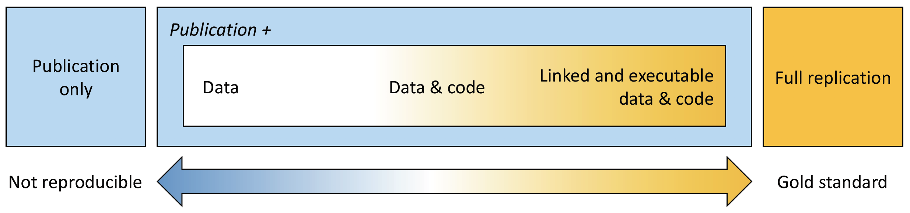
```

### Supporting Files {#Files}

Files supporting this chapter are available on [Google Drive](https://drive.google.com/drive/folders/1Olb6huHcBfv02OxL50WEbQR-uJvkuX7O?usp=drive_link).

### Install R Markdown Software

Software and packages required to perform this tutorial are detailed below. Students should install those software and packages on their personal computers to be able to complete this course. Additional packages might need to be installed and the instructor will provide guidance on how to install those as part of the forthcoming tutorials.

- **R**: https://www.r-project.org
- **R packages**: `bookdown`, `knitr` and `R Markdown`. Use the following R command to install those packages:
```{r eval=F, tidy=TRUE}
install.packages(c("bookdown","knitr", "rmarkdown"))
```
- **RStudio**: https://www.rstudio.com/products/rstudio/download/
- **TeX**: This software is required to compile document into `pdf` format. Please install MiKTeX on Windows, MacTeX on OS X and TeXLive on Linux. **For this class, you are not requested to install this software**, which takes significant hard drive space and is harder to operate on Windows OS. 

**NOTE:** The instructor is using the following version of `RStudio`: Version 2025.05.0+496 (2025.05.0+496). If your computer is experiencing issues running the latest version of the software, you can install previous versions [here](https://docs.posit.co/previous-versions/rstudio/).

### What is RStudio?

RStudio [@RStudio] is an **integrated development environment (IDE)** that allows you to interact with R more efficiently. While similar to the standard R GUI, RStudio is significantly more user-friendly. It offers more drop-down menus, tabbed windows, and extensive customization options (see Figure \@ref(fig:IDE)). 

Detailed information on using RStudio can be found on [RStudio’s website](https://support.rstudio.com/hc/en-us/sections/200107586-Using-RStudio).

```{r IDE, echo=FALSE, fig.cap="Snapshot of the RStudio environment showing the four windows and their content.", fig.show="asis", out.width = '100%'}
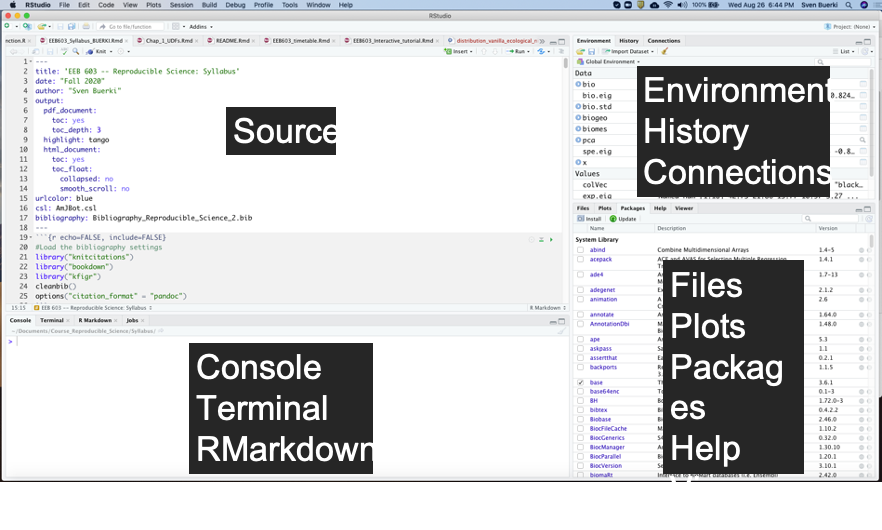
```

### Web Resources

Below are URLs to web resources that provide key information related to Chapter 2:

- **R Markdown:** https://rmarkdown.rstudio.com  
- **R Markdown: The Definitive Guide** (by Yihui Xie, J. J. Allaire, and Garrett Grolemund): https://bookdown.org/yihui/rmarkdown/  
- **Write HTML, PDF, ePub, and Kindle books with R Markdown:** https://bookdown.org  
- **bookdown: Authoring Books and Technical Documents with R Markdown** (by Yihui Xie): https://bookdown.org/yihui/bookdown/  
- **knitr:** http://yihui.name/knitr/  
- **Pandoc: A Universal Document Converter:** https://pandoc.org  
- **Bibliographies and Citations in R Markdown:** https://rmarkdown.rstudio.com/authoring_bibliographies_and_citations.html  
- **Tutorial on knitr with R Markdown** (by Karl Broman): http://kbroman.org/knitr_knutshell/pages/RMarkdown.html

## PART A: Learning the Basics {#partA}

In this part, we will provide a survey of the procedures to create and render (or knitting) your first R Markdown document.

### Learning Outcomes

This tutorial provides students with the opportunity to learn how to:

- [Create and render (or "knit") your first R Markdown document](#firstMDhow)
- Understand basic Markdown syntax and conventions, including:
    + [Headers](#headers)  
    + [Inside text commenting](#comment)  
    + [Lists](#lists)  
    + [Italicizing and bolding text](#itbold) 
    + [Creating hyperlinks](#hyperlinks)  
    + [Including code chunks](#codechunkhow)
    + [Inline code](#inlinecode)  
    + [Checking spelling](#checkspell)

### Introduction to R Markdown {#IntroRMd}

Markdown is a simple formatting syntax used for authoring HTML, PDF, and Microsoft Word documents. It is implemented in the `rmarkdown` package. An R Markdown document is typically divided into three sections (see Figure \@ref(fig:RMdown)):

1. **YAML metadata section:** This section provides high-level information about the output format of the R Markdown file. The information defined here is used by the Pandoc program to format the final document (see Figure \@ref(fig:RMdown)).
2. **Main body text:** This section represents the core content of your document or publication and uses Markdown syntax.
3. **Code chunks:** This section allows you to import and analyze data, and to produce figures and tables that are directly embedded in the output document.

```{r RMdown, echo=FALSE, fig.cap="Example of an R Markdown file showing the three major sections.", fig.show="asis", out.width = '100%'}
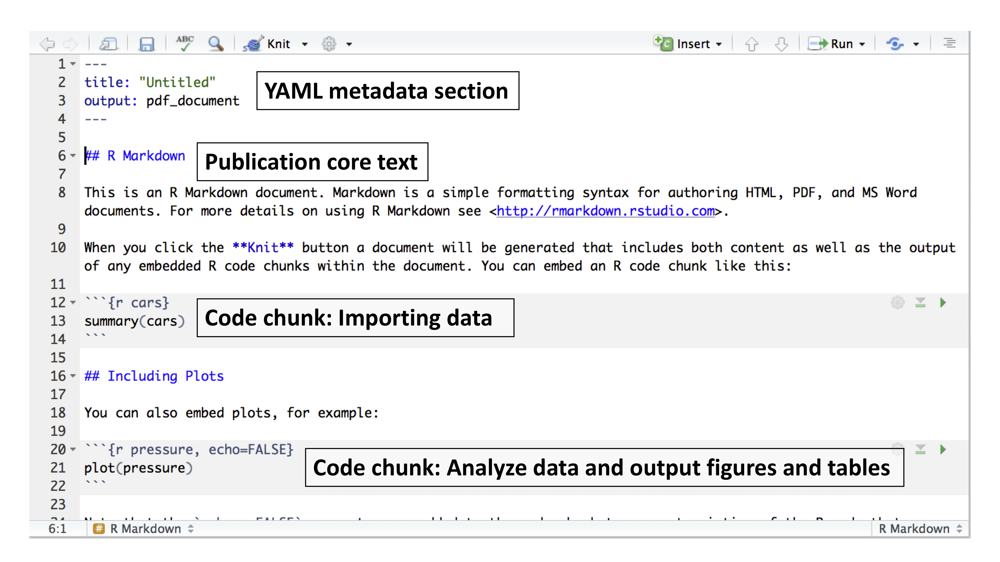
```

### Your First R Markdown Document {#firstMDhow}

In this section, you will learn how to create and knit your first R Markdown document.

#### Create Document

To create an R Markdown document, follow these steps in RStudio:

1. Navigate to: `File -> New File -> R Markdown...`  
2. Enter a title for your document and set the output format to `HTML` (see Figure \@ref(fig:RMdownscreen))
    - **Title:** `Chapter 2 - Part A` (This is the title of your document, not the name of your file; see below)
    - **Note:** We will knit documents to the `HTML` format, which is the default output in RStudio. If you prefer to generate a `PDF` document, you must have a version of the `TeX` program installed on your computer (see Figure \@ref(fig:RMdownscreen)).  
3. Save the `.Rmd` file by selecting: `File -> Save As...`  
    - **File name:** `Chapter_2_part_A.Rmd`  
    - **Project path:** `Reproducible_Science/Chapters/Chapter_2`  
    - **Warning:** Because the knitting process generates multiple files, you should save your `.Rmd` file in a dedicated project folder.

```{r RMdownscreen, echo=FALSE, fig.cap="Snapshot of window to create an R Markdown file.", fig.show="asis", out.width = '40%', fig.align="center"}
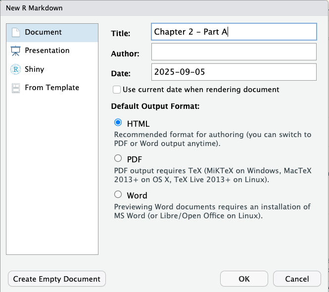
```

#### Knit Document

To knit  or render your R Markdown document into an HTML file, follow these steps in RStudio:

1. Click the `Knit` button (Figure \@ref(fig:RMdown)) in the top toolbar to render the document.  
2. There are several output format options; however, if you simply click the button, RStudio will automatically knit the document using the settings specified in the YAML metadata section (Figure \@ref(fig:RMdown)).  
3. The output file will be created in the same directory as your `.Rmd` file (Figure \@ref(fig:MyFirstRMfolder)). You can monitor the progress in the **R Markdown** console.  

<style>
.info {
  background-color: #e7f3fe;
  border-left: 6px solid #2196F3;
}
</style>
<div class="info">
  <p><strong>💡 Info</strong> If the knitting process fails, error messages will appear in the Render console, often indicating the line in the script where the error occurred (although this is not always the case). These messages are helpful for debugging your R Markdown document.
  </p>
</div>

```{r MyFirstRMfolder, echo=FALSE, fig.cap="Snapshot of your project folder with the knitted html document.", fig.show="asis", out.width = '100%', fig.align="center"}
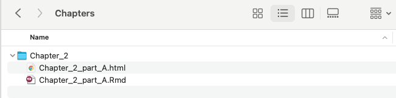
```

#### <a name="compilation"></a>How Does the Knitting Process Work?

When you knit your document, R Markdown passes the `.Rmd` file to the R *knitr* package, which executes all code chunks and generates a new Markdown (`.md`) file. This Markdown file includes both the code and its output (see Figure \@ref(fig:Rflow)).

The `.md` file created by *knitr* is then processed by the Pandoc program, which converts it into the final output format (e.g., HTML, PDF, or Word) as illustrated in Figure \@ref(fig:Rflow).

```{r Rflow, echo=FALSE, fig.cap="R Markdown flow.", out.width = '100%'}
knitr::include_graphics("Figures/rmarkdownflow.png")
```

### Basic R Markdown Syntax

In this section, we will focus on learning the syntax and protocols needed to create:

- [Headers](#headers)  
- [Inside text commenting](#comment) 
- [Lists](#lists)  
- [Italicized, bold, and combined formatting](#itbold) 
- [Embedded code chunks and inline code](#hyperlinks)  
- [Spell checking](#checkspell)

To master these skills, edit your `.Rmd` file as we progress, and knit the document to view the final result.

Additional syntax and formatting options are available in the **R Markdown Reference Guide**, which you can access in RStudio as follows:

- Select: `Help -> Cheatsheets -> R Markdown Reference Guide`

**Note:** The **Cheatsheets** section also provides access to other helpful resources related to R Markdown and data manipulation. These documents will be very useful throughout this course.

---

### Before Starting {#beforeyoustart}

Before you start this tutorial, please delete the content of your R Markdown file starting on line 11 `## R Markdown` to the end of the document (see Figure \@ref(fig:beforestart)).

```{r beforestart, echo=FALSE, fig.cap="R Markdown of Chapter 2 - Part A.", out.width = '100%'}
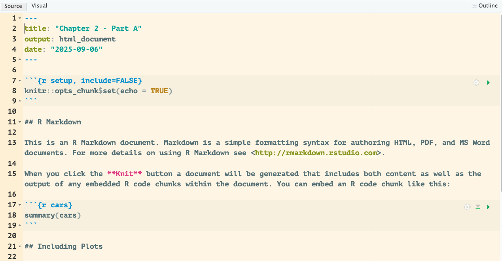
```

---

### Headers {#headers}

Below is the syntax to create headers at three levels:

**Syntax:**
```{r eval=FALSE}
The "#" refers to the level of the header
# Header 1

## Header 2  

### Header 3  
```  

<div class="info">
  <p><strong>💡 Info</strong></p>
  <ul>
    <li>While Markdown headers will render correctly without blank lines, it is best practice to include blank lines both before and after headers. Doing so improves the readability of the raw Markdown and helps minimize knitting quirks. Overall, including a blank line before a header (except at the very start of a document) and after it is not strictly required, but it makes your Markdown cleaner and more consistent.</li>  </ul>
</div>

<style>
.danger {
  background-color: #ffdddd;
  border-left: 6px solid #f44336;
}
</style>
<div class="danger">
  <p><strong>💡 Your turn to practice this syntax in your document by:</strong>
    <ul>
      <li>Including 2 level 1 headers</li>
      <li>Embedding 2 level 2 headers under each level 1 header</li>
      <li>Checking your code by knitting the document</li>
    </ul>
  </p>
  <p>
  I let you pick great names for your headers!
  </p>
</div>

---

### Inside Text Commenting {#comment}

Markdown does not have a built-in syntax for adding comments within text, but you can use HTML-style comments instead:

```{r eval = FALSE, echo = TRUE}
# HTML syntax to comment inside text
<!-- COMMENT -->
```

This syntax is typically used to highlight areas of the text that need revision, clarification, or further work. Comments inserted this way will not be visible in the knitted document.

You can learn more about this HTML syntax on this [webpage](https://www.w3schools.com/html/html_comments.asp).

<style>
.danger {
  background-color: #ffdddd;
  border-left: 6px solid #f44336;
}
</style>
<div class="danger">
  <p><strong>💡 Your turn to practice this syntax in your document by:</strong>
    <ul>
      <li>Adding comments describing the content included under each level 1 header</li>
      <li>Checking your code by knitting the document</li>
    </ul>
  </p>
</div>

---

### Lists {#lists}

There are two types of lists:

- Unordered
- Ordered

#### Syntax for unordered lists

**Syntax:**
```{r eval=FALSE}
* unordered list
* item 2
  + sub-item 1
  + sub-item 2
```

**Note:** For each sub-level include two tabs to create the hierarchy.

**Output:**

* unordered list
* item 2
  + sub-item 1
  + sub-item 2   

<style>
.danger {
  background-color: #ffdddd;
  border-left: 6px solid #f44336;
}
</style>
<div class="danger">
  <p><strong>💡 Your turn to practice this syntax in your document by:</strong>
    <ul>
      <li>Including a 2-level unordered list under the first level 1 header</li>
      <li>Checking your code by knitting the document</li>
    </ul>
  </p>
</div>

#### Syntax for ordered lists

**Syntax:**
```{r eval=FALSE}
1. ordered list
2. item 2
   + sub-item 1
   + sub-item 2
```

**Output:**

1. ordered list
2. item 2
   + sub-item 1
   + sub-item 2

<style>
.danger {
  background-color: #ffdddd;
  border-left: 6px solid #f44336;
}
</style>
<div class="danger">
  <p><strong>💡 Your turn to practice this syntax in your document by:</strong>
    <ul>
      <li>Including a 2-level ordered list under the second level 1 header</li>
      <li>Checking your code by knitting the document</li>
    </ul>
  </p>
</div>

---

### Italicize and Bold Words {#itbold}

The following syntax renders text in *italics*, **bold**, or ***both italics and bold***: 

```{r eval=FALSE}
#Syntax for italics
*italics*

#Syntax for bold
**bold**

#Syntax for italic and bold
***italic and bold***
```

**Output:**

- *Italic*
- **Bold**
- ***Italic and bold***

<style>
.danger {
  background-color: #ffdddd;
  border-left: 6px solid #f44336;
}
</style>
<div class="danger">
  <p><strong>💡 Your turn to practice this syntax in your document by:</strong>
    <ul>
      <li>Writing a sentence in your R Markdown document that includes an italicized word</li>
      <li>Writing a sentence that includes a word or phrase in bold</li>
      <li>Writing a sentence where a word or phrase is both bold and italicized</li>
      <li>Checking your code by knitting the document</li>
    </ul>
  </p>
</div>

---

### Create Hyperlinks {#hyperlinks}

Adding hyperlinks to your documents support reproducible science and it can be easily done with the following syntax:

```{r eval=FALSE}
#Syntax to add hyperlink
[text](link)

#Example to provide hyperlink to RStudio
[RStudio](https://www.rstudio.com)
```

When knitted, the example with RStudio turns like that [RStudio](https://www.rstudio.com).

<style>
.danger {
  background-color: #ffdddd;
  border-left: 6px solid #f44336;
}
</style>
<div class="danger">
  <p><strong>💡 Your turn to practice this syntax in your document by:</strong>
    <ul>
      <li>Creating a hyperlink to the Boise State website</li>
      <li>Creating a hyperlink to download R for Mac computers</li>
      <li>Checking your code by knitting the document</li>
    </ul>
  </p>
</div>

---

### Include Code Chunks {#codechunkhow}

One of the most exciting features of working with the R Markdown format is the ability to directly *embed* the output of R code into the compiled document (see Figure \@ref(fig:Rflow)). 

In other words, when you compile your `.Rmd` file, R Markdown will automatically execute each code chunk and inline code expression (see example below), and insert their results into the final document.

If the output is a table or a figure, you can assign a label to it (by adding metadata within the code chunk; see Part B) and refer to it later in your `PDF` or `HTML` document. This process—known as *cross-referencing*—is made possible through the `\@ref()` function, which is implemented in the R `bookdown` package.
 
#### Code Chunk

A code chunk can be easily inserted into your document using one of the following methods:

- Using the keyboard shortcut **Ctrl + Alt + I** (on macOS: **Cmd + Option + I**).
- Clicking the `Insert` button  in the editor toolbar.
- Typing ```{r} to open the chunk and ``` to close it.

By default, the code chunk expects R code, but you can also insert chunks for other programming languages (e.g., Bash, Python).

<style>
.danger {
  background-color: #ffdddd;
  border-left: 6px solid #f44336;
}
</style>
<div class="danger">
  <p><strong>💡 Your turn to practice this syntax in your document by:</strong>
    <ul>
      <li>Creating a code chunk in your R Markdown document that prints the message "Hello world" when you knit the document</li>
    </ul>
  </p>
</div>

#### Chunk Options

Chunk output can be customized with *knitr* options arguments set in the `{}` of a code chunk header. In the examples displayed in Figure \@ref(fig:RChunk) five arguments are used:

- `include = FALSE` prevents code and results from appearing in the finished file. R Markdown still runs the code in the chunk, and the results can be used by other chunks.
- `echo = FALSE` prevents code, but not the results from appearing in the finished file. This is a useful way to embed figures.
- `message = FALSE` prevents messages that are generated by code from appearing in the finished file.
- `warning = FALSE` prevents warnings that are generated by code from appearing in the finished.
- `fig.cap = "..."` adds a caption to graphical results.

We will delve more into chunk options in part D of chapter 2, but in the meantime please see the R Markdown Reference Guide for more details. 

```{r RChunk, echo=FALSE, fig.cap="Example of code chunks.", out.width = '100%'}
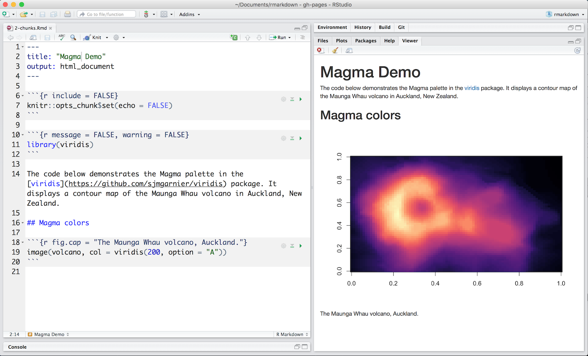
```

<style>
.danger {
  background-color: #ffdddd;
  border-left: 6px solid #f44336;
}
</style>
<div class="danger">
  <p><strong>💡 Your turn to practice this syntax in your document by:</strong>
    <ul>
      <li>Editing the code chunk you created earlier (that prints "Hello world") so that the <b>code is hidden</b> when you knit the document, but the <b>output is still displayed</b></li>
    </ul>
  </p>
</div>

---

### Inline Code {#inlinecode}

Code results can also be inserted directly into the text of a `.Rmd` file by enclosing the code as follows:
```{r eval=FALSE}
# Syntax for inline code
``r 2+2`` # Please amend to include only 1 back tick
```

**Output:**
`r 2+2`

R Markdown will always:

- Display the results of inline code, but not the code.
- Apply relevant text formatting to the results.

As a result, inline output is indistinguishable from the surrounding text. 

**Warning:** Inline expressions do not take *knitr* options and is therefore less versatile. We usually use inline code to perform simple stats (e.g. 4x4; `r 4*4`)

<style>
.danger {
  background-color: #ffdddd;
  border-left: 6px solid #f44336;
}
</style>
<div class="danger">
  <p><strong>💡 Your turn to practice this syntax in your document by:</strong>
    <ul>
      <li>Editing a sentence in your R Markdown text to include the <b>output of the line of code 2 + 2</b>, so that the result is automatically displayed when the document is knitted</li>
    </ul>
  </p>
</div>

---

### Check Spelling {#checkspell}

There are three ways to access spell checking in an R Markdown document in RStudio:

1. A spell check button  to the right of the save button.
2. `Edit > Check Spelling...`
3. The F7 key.

## PART B: Setting Your R Markdown Document {#partB}

### Introduction

The **aim** of this tutorial is to develop an R Markdown document that can be used as a template to produce your reproducible reports. 

We will focus on learning how to configure your document to manage software dependencies, set global parameters for knitting, and produce appendices with software citations, package version information, and details about the operating system used to generate the reproducible report.

### Learning Outcomes

This tutorial provides students with the opportunity to learn how to:

- [Study and understand the structure of an R Markdown document](#structRMD)  
- [Reinforce your skills in creating R Markdown documents within dedicated project folders](#creatRMDfile)  
- [Define parameters in the YAML metadata section to control the formatting of the knitted document](#YAMLset)  
- [Install R dependencies and load packages needed to produce your document](#loadRreq)
- [Generate a citation file for the R packages used in the document](#citfileRpkg)  
- [Generate an appendix with citations for all R packages](#appendixRpkg)  
- [Generate an appendix with R package versions used to produce the document](#appendixRverOS)  

---

### Structure of an R Markdown Document {#structRMD}

To facilitate the teaching of the learning outcomes, a roadmap of the R Markdown file (`*.Rmd`) structure is summarized in Figure \@ref(fig:RMarkdwnstrct).

To support the reproducibility of your research, we structure the R Markdown file as follows (Figure \@ref(fig:RMarkdwnstrct)):

1. The YAML metadata section (at the top of the document) must include information about your bibliography (`*.bib`) and citation style language (`*.csl`) files, both of which must be stored in the working directory.
2. Two R code chunks are provided just below the YAML metadata section:
    - [Code chunk #1]{.underline}: Installs and loads packages, and generates a `packages.bib` file (stored in the working directory).
    - [Code chunk #2]{.underline}: Sets global options for code chunks.
3. The Markdown section beneath the two R code chunks is edited to add headers for the References and Appendices sections.
4. Finally, two R code chunks are included in the Appendices section:
    - [Code chunk #3]{.underline}: Provides citations of software (relying on the output of Code chunk #1) for Appendix 1.
    - [Code chunk #4]{.underline}: Provides software version information (relying on *sessionInfo()*) for Appendix 2.

```{r RMarkdwnstrct, echo=FALSE, fig.cap = "Representation of the RMarkdown file structure taught in this class. The following colors represent the three main computing languages found in an RMarkdown document: Black: Markdown (we also sometimes use HTML), Green: YAML, and Blue: R (included in code chunks). See text for more details.", fig.show = "asis", out.width = '100%'}
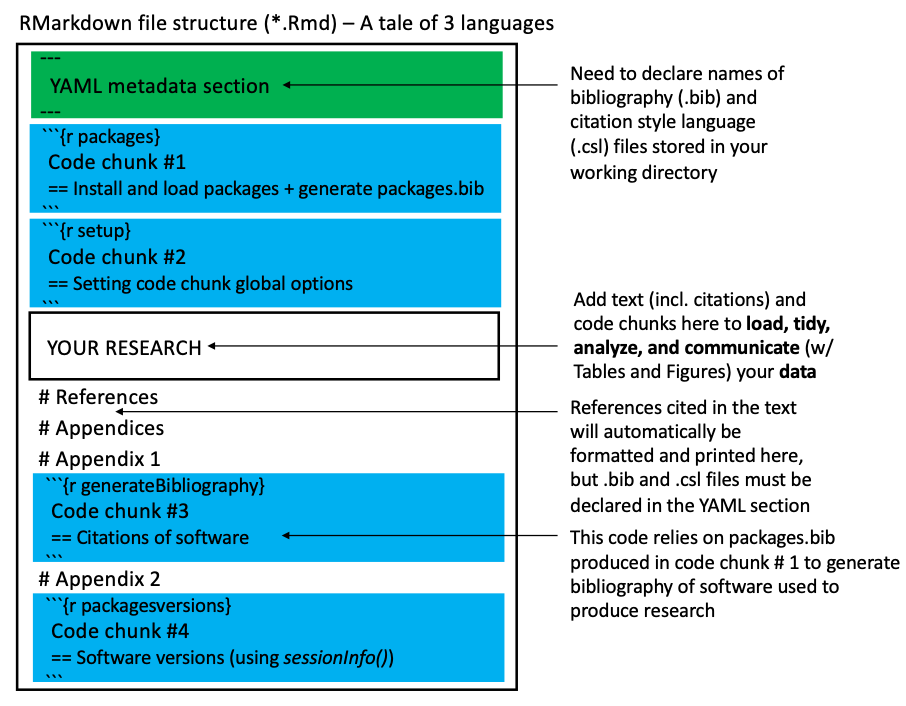
```

---

### Supporting Files

Please refer to [section](#Files) for more details on supporting files and their locations on the shared Google Drive.

---

### Create Your R Markdown Document {#creatRMDfile} 

Use the material from the [Chapter 2 – Part A](#firstMDhow) and [Before Starting](#beforeyoustart) sections to create and save your R Markdown document for this tutorial. 

<style>
.danger {
  background-color: #ffdddd;
  border-left: 6px solid #f44336;
}
</style>
<div class="danger">
  <p><strong>💡 Guidelines</strong> 
    <ul>
       <li><b>Document title:</b> Chapter 2 - part B</li>
       <li><b>Document output format:</b> HTML</li>
       <li><b>File name:</b> Chapter2_partB.Rmd</li>
       <li><b>File path:</b> `Reproducible_Science/Chapters/Chapter_2`</li>
    </ul>
  </p>
</div>

---

### YAML Metadata Section {#YAMLset}

The YAML metadata section (Figure \@ref(fig:RMarkdwnstrct)) allows users to provide arguments (referred to as *fields*) that control how an R Markdown document is converted into its final output format. In this class, we will use functions from the *knitr* [@R-knitr; @knitr2015] and *bookdown* [@R-bookdown; @bookdown2016] packages to populate this section. (Field names, as declared in the YAML metadata section, are provided in parentheses.)

1. Title (`title`)
2. Subtitle (`subtitle`)
3. Author(s) (`author`)
4. Date (`date`)
5. Output format(s) (`output`)
6. Citations link (`link-citations`)
7. Font size (`fontsize`)
8. Bibliography file(s) (`bibliography`)
9. Citation style file for journal formatting (`csl`)

The YAML code shown below generates either an `HTML` or `PDF` document (see the `output` field), includes a table of contents (see the `toc` field), and formats in-text citations and the bibliography section according to the journal style specified in the `AmJBot.csl` file (via the `csl` field). The bibliography must be stored in a `.bib` file (in this case, `Bibliography_Reproducible_Science_2.bib`) placed at the root of your working directory.

```{r YAML, eval=FALSE, echo=TRUE}
--- 
title: "Your title"
subtitle: "Your subtitle"
author: "Your name"
date: "`r Sys.Date()`"
output:
  bookdown::html_document2: 
    toc: TRUE
  bookdown::pdf_document2:
    toc: TRUE
link-citations: yes
fontsize: 12pt
bibliography: Bibliography_Reproducible_Science_2.bib 
csl: AmJBot.csl
---
```

#### Step-by-Step Procedure

Follow these steps to set up your YAML metadata section (also see Figure \@ref(fig:RMarkdwnstrct)):

1. Make sure you have created a document following the approach described [here](#creatRMDfile)
2. Copy the following files, available on [Google Drive](https://drive.google.com/drive/folders/1JFjKmb0JHm96UfimO8SJLq33hE1JRu5v?usp=drive_link), into your project folder:  
    + `Bibliography_Reproducible_Science_2.bib`  
    + `AmJBot.csl`  
3. Replace your YAML metadata section (at the top of your R Markdown document) with the code as shown in the [section above](#YAMLset)
4. Knit your document and inspect the output file. Read this [section](#knitmore) to get more details on the knitting procedure.  

<div class="info">
  <p><strong>💡 Info</strong></p>
  <ul>
    <li><b>Warning:</b> The `.bib` and `.csl` files must be stored in the same working directory as your `.Rmd` file.</li>
    <li><b><code>R</code> functions in the YAML metadata section:</b> This can be done using inline R code syntax. For example, use <code>Sys.Date()</code> to automatically add the current date to the output document.</li>
    <li><b>Bibliography files:</b> You can use multiple bibliography files by specifying them like this: <code>bibliography: [file1.bib, file2.bib]</code>.</li>
    <li><b>Omitting parameters in the YAML metadata section:</b> You can omit parameters by commenting them out with a <code>#</code> at the beginning of the line (equivalent to commenting).</li>
    <li><b>More information:</b> To learn more about YAML and its use in R Markdown, visit this 
      <a href="https://zsmith27.github.io/rmarkdown_crash-course/lesson-4-yaml-headers.html" target="_blank" rel="noopener noreferrer">website</a>.
    </li>
  </ul>
</div>

#### Knitting Procedure {#knitmore}

Since you have declared two output formats in the YAML metadata section, and both are specific to `bookdown` functions, you need to select which format you want to use to compile your document. To do this, click the drop-down menu to the left of the `Knit` button (see Figure \@ref(fig:knitout)).

To ensure that `bookdown` functions are applied correctly, make sure to select one of the following options (see Figure \@ref(fig:knitout)):

- `Knit to html_document2`
- `Knit to pdf_document2`

```{r knitout, echo=FALSE, fig.cap="Snapshot of RStudio console showing the drop-down list associated to Knit button.", out.width = "100%", fig.align='center', dpi=72, fig.pos= "H"}
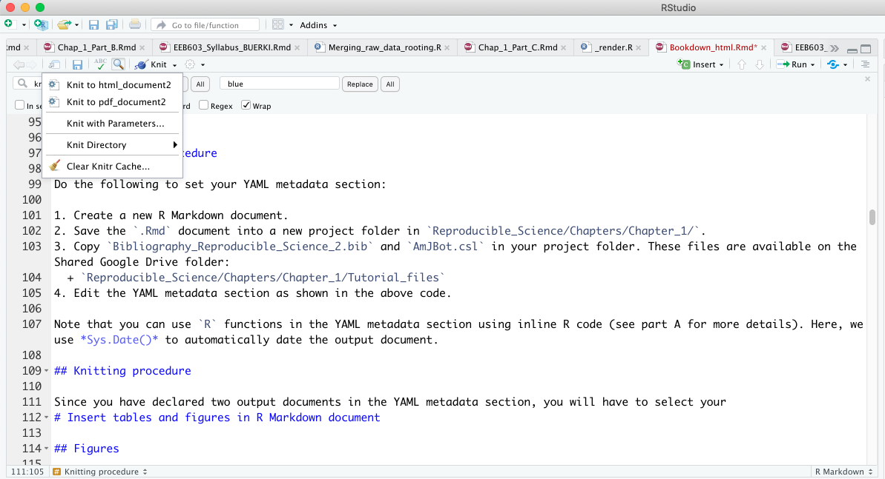
```

---

### Install R Dependencies and Load Packages {#loadRreq}

#### Introduction

It is best practice to **add an R code chunk** directly below the YAML metadata section **to automatically install and load the required R packages**.

This approach offers two key benefits that support the reproducibility of your research:

1. It ensures that all dependencies needed to produce your document are installed and available (see Figure \@ref(fig:RMarkdwnstrct)).  
2. It allows you to automatically generate a citation file for all R packages used in your report (see [below](#citfileRpkg)).

<style>
.disclaimer {
  background-color: #FFEFD5;       /* Pale orange */
  border-left: 6px solid #FFA500;  /* Slightly darker orange */
  padding: 1em;                    /* Space inside the box */
  margin: 1em 0;                   /* Space around the box */
  overflow-wrap: break-word;      /* Wrap long lines */
  box-sizing: border-box;         /* Ensure padding stays inside width */
}
</style>
<div class="disclaimer">
  <p><strong>💡 Disclaimer</strong></p>
  <ul>
    <li><b>Warning:</b> The code provided in this section will install the following <code>R</code> packages on your computer: "knitr", "rmarkdown", "bookdown", "formattable", "kableExtra", "dplyr", "magrittr", "prettydoc", "htmltools", "knitcitations", "bibtex", "devtools".</li>
    <li><b>More on the <code>R</code> packages:</b> These packages are required to produce your reproducible reports in RStudio. All of them are available on <a href="https://cran.r-project.org/web/packages/" target="_blank" rel="noopener noreferrer">CRAN</a>, the official repository for <code>R</code>.</li>
    <li><b><code>R</code> package repositories:</b> Make sure you have set your <code>R</code> package repositories in RStudio before proceeding with this tutorial. You can do this by following <a href="https://docs.posit.co/ide/user/ide/guide/environments/r/packages.html" target="_blank" rel="noopener noreferrer">this procedure</a>.</li>
    <li><b>Questions or concerns:</b> If you have any questions, please contact the instructor at <a href="mailto:svenbuerki@boisestate.edu">svenbuerki@boisestate.edu</a>.</li>
  </ul>
</div>

#### Step-by-Step Procedure

1. Insert an R code chunk  directly below your YAML metadata section (see Figure \@ref(fig:RMarkdwnstrct)).
2. Name the code chunk `packages` and set the chunk options as follows (see Figure \@ref(fig:packageschunkfig)):
   + `echo = FALSE`  
   + `warning = FALSE`  
   + `include = FALSE`
```{r packageschunkfig, echo=FALSE, fig.cap = "This is how your packages R code chunk should look like at this stage of the procedure.", fig.show = "asis", out.width = '100%'}
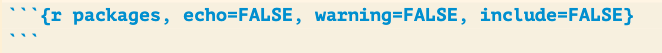
```
3. Copy the following code into your R code chunk (Figure \@ref(fig:packageschunkfig)) to install and load the packages required to produce your report:

```{r eval = FALSE, echo = TRUE, tidy = FALSE}
###~~~
# Load R packages
###~~~
#Create a vector w/ the required R packages
# --> If you have a new dependency, don't forget to add it in this vector
pkg <- c("knitr", "rmarkdown", "bookdown", "formattable", "kableExtra", "dplyr", "magrittr", "prettydoc", "htmltools", "knitcitations", "bibtex", "devtools")

##~~~
#2. Check if pkg are already installed on your computer
##~~~
print("Check if packages are installed")
#This line outputs a list of packages that are not installed
new.pkg <- pkg[!(pkg %in% installed.packages())]

##~~~
#3. Install missing packages
##~~~
# Use an if/else statement to check whether packages have to be installed
# WARNING: If your target R package is not deposited on CRAN then you need to adjust code/function
if(length(new.pkg) > 0){
  print(paste("Install missing package(s):", new.pkg, sep=' '))
  install.packages(new.pkg, dependencies = TRUE)
}else{
  print("All packages are already installed!")
}

##~~~
#4. Load all required packages
##~~~
print("Load packages and return status")
#Here we use the sapply() function to require all the packages
# To know more about the function type ?sapply() in R console
sapply(pkg, require, character.only = TRUE)
```

4. Review the R code to ensure you understand what it does and why
5. Knit your document and inspect the output file

---

### Generate a Citation File of R Packages Used {#citfileRpkg}

#### Introduction

I do not know about you, but I often struggle to properly cite R packages in my publications. Fortunately, R provides a built-in function to help with this. If you want to retrieve the citation for an R package, you can use the base R function `citation()`.

For example, the citation for the *knitr* package can be obtained as follows:

```{r cit, eval=T, echo=TRUE}
#Generate citation for knitr
# Type this code directly in the Console
citation("knitr")
```

If you want to generate those citation entries in BibTeX format, you can pass the object returned by `citation()` to `toBibtex()` as follows:

```{r cit2, eval=T, echo=TRUE}
#Generate citation for knitr in BibTex format
#Note that there is no citation identifiers. Those will be automatically generated in our next code. 
utils::toBibtex(utils::citation("knitr"))
```

<div class="info">
  <p><strong>💡 Info</strong></p>
  <ul>
    <li>
      Note that both <code>citation()</code> and <code>toBibtex()</code> are functions in the 
      <i>utils</i> R package.
    </li>
    <li>
      <strong>To make sure that you are calling the right R function</strong>, you can add the package 
      name in front of the function, followed by <code>::</code>. In this example, the code is as follows: 
      <code>utils::toBibtex(utils::citation("knitr"))</code>.
    </li>
  </ul>
</div>

#### Step-by-Step Procedure

Here, you will edit the `packages` code chunk to output a `.bib` file containing references for all R packages used to generate your document. This file will be included in the appendix 1 presented in the next section.

This can be done by **adding the following code at the end of your `packages` R code chunk**:

```{r cit3, eval=F, echo=TRUE}
#Generate BibTex citation file for all loaded R packages used to produce report
# Notice the syntax used here to call the function
knitr::write_bib(.packages(), file = 'packages.bib')
```

The `.packages()` function returns *invisibly* the names of all packages loaded in the current R session (to see the output, use `.packages(all.available = TRUE)`). This ensures that all packages used in your code will have their citation entries written to the `.bib` file.

Finally, to be able to cite these references (see [Citation identifier](#citationidentifier)) in your text, you need to edit the [YAML metadata section](#YAMLset). See [Appendix 1] for a full list of references associated with the R packages used to generate this report.

<div class="danger">
  <p><strong>💡 Your turn to practice this syntax in your document by:</strong></p>
  <ul>
    <li>Adding the code to generate <code>packages.bib</code> in your R code chunk entitled <q>packages</q>.</li>
    <li>Knitting your document and inspecting your project folder to observe the creation of a new file entitled <code>packages.bib</code>.</li>
  </ul>
</div>

---

### Generate Appendix with Citations of Used R Packages {#appendixRpkg}

Although a References section will be provided at the end of your document to cite in-text references (see [References] and Figure \@ref(fig:RMarkdwnstrct)), it is useful to create a customized appendix listing citations for all R packages used to conduct the research, as shown in [Appendix 1]. 

Here, we will learn the procedure to assemble such an appendix.

#### Step-by-Step Procedure

1. Add a level-1 header at the end of your document titled "References".
2. Include the appendices after the References section (see Figure \@ref(fig:RMarkdwnstrct)) by following the steps below:  
   + Insert `<div id="refs"></div>` as shown below. This ensures that the appendices (or any other material) appear *after* the References section.  
     (See [this resource](https://bookdown.org/yihui/rmarkdown-cookbook/bibliography.html#include-appendix-after-bibliography) for more details.)
```{r eval=FALSE}
# References

<div id="refs"></div>

# (APPENDIX) Appendices {-}

# Appendix 1

Citations of all R packages used to generate this report.
```
3. Insert an R code chunk  directly below `# Appendix 1` to read and print the citations saved in `packages.bib`. Use the following code:
```{r generateBibliography1, eval=FALSE, echo=TRUE, warning = FALSE, message=FALSE}
###
#Load R package
###
library("knitcitations")

###
#Process and print citations in packages.bib
###
# Clear all bibliography that could be in the cash
cleanbib()
# Set pandoc as the default output option for bib
options("citation_format" = "pandoc")
# Read and print bib from file
read.bibtex(file = "packages.bib")
``` 
4. Edit your R code chunk options as follows to correctly print the references:  
   `{r generateBibliography, results = "asis", echo = FALSE, warning = FALSE, message = FALSE}`
5. Knit your document to check that it produces the correct output (see [Knitting procedure]). Refer to [Appendix 1] to see an example of the expected result.

---

### Generate Appendix with R Package Versions and Operating System {#appendixRverOS}

In addition to citing R packages, you may also want to provide detailed information about the R package versions and operating system used (see Figure \@ref(fig:RMarkdwnstrct)).

In R, the simplest — yet highly useful and important — way to document your environment is to include the output of `sessionInfo()` (or `devtools::session_info()`). Among other details, this output shows all loaded packages and their versions from the R session used to run your analysis.

Providing this information allows others to reproduce your work more reliably, as they will know exactly which packages, versions, and operating system were used to execute the code.

For example, here is the output of `sessionInfo()` showing the R version and packages I used to create this document:

```{r eval=T, echo=T}
# Collect Information About the Current R Session
sessionInfo()
```

#### Step-by-Step Procedure

I have also used the approach described above to add this information in [Appendix 2]. This can be done as follows:

1. Edit your document to add the following text below Appendix 1.
```{r eval = FALSE}
# Appendix 2

Version information about R, the operating system (OS) and attached or R loaded packages. This appendix was generated using `sessionInfo()`.
```
2. Then, add an R code chunk  and set its options as follows to correctly print the content:  
   `{r sessionInfo, eval = TRUE, echo = FALSE, warning = FALSE, message = FALSE}`
3. Copy this code in your code chunk:
```{r eval=F, echo=T, warning = FALSE, message=FALSE}
#Load and provide all packages and versions
sessionInfo()
```
4. Knit your document to check that it produces the correct output.

---

### All Set — You’re Good to Go!

You have now set up your R Markdown environment and are ready to start populating it! This means you can begin inserting your text and additional code chunks directly below the `packages` code chunk.

The [References] section marks the end of the main body of your document. If you wish to add appendices, do so under [Appendix 2]. Note that appendices will be labeled differently from the main sections of the document.

<div class="info">
  <p><strong>💡 Info</strong></p>
  <ul>
    <li>This R Markdown document will be used as a template for the rest of Chapter 2.</li>
    <li>This document also serves as a foundation for your <a href="https://svenbuerki.github.io/EEB603_Reproducible_Science/index.html#BioTut" target="_blank" rel="noopener noreferrer">Bioinformatics Tutorial</a>.</li>
  </ul>
</div>

## PART C: Tables, Figures and References {#partC}

### Introduction

The **aim** of this tutorial is to provide students with the expertise to generate reproducible reports using *bookdown* [@R-bookdown; @bookdown2016] and related R packages (see [Appendix 1] for a full list). Unlike the functions implemented in the R *rmarkdown* package [@rmarkdown2018, which is better suited for generating `PDF` reproducible reports], *bookdown* allows the use of **one** unified set of functions to generate both `HTML` and `PDF` documents.

In addition, the same approach and functions are used to process tables and figures, as well as to cross-reference them in the main body of the text. This tutorial will also cover how to cite references in the text, automatically generate a bibliography/references section, and format citations according to journal styles. Finally, it demonstrates how to generate an Appendix containing citations of all R packages used to conduct your research (and to produce the report).

### Learning Outcomes

This tutorial provides students with the opportunity to learn how to:

- [Insert tables in an R Markdown document](#inserttable)
- [Insert figures in an R Markdown document](#insertfigure)
- [Cross-reference tables and figures in the text](#crossrefTabFig)
- [Cite references in the text](#bib)
- [Generate a References section](#refsection)
- [Format citations according to journal style](#cslForm)

---

### Create Your R Markdown

Follow the approach described in the box below to create your R Markdown file for Chapter 2 – Part C.

<div class="info">
  <p><strong>💡 Approach to Create Your R Markdown</strong></p>
  <ul>
    <li><strong>Create document:</strong> Make a copy of <code>Chapter2_partB.Rmd</code> in the same project folder and rename it <code>Chapter2_partC.Rmd</code></li>
    <li><strong>Download document:</strong> If you have any issues with Chapter 2 - part B, then download the instructor version on <a href="https://drive.google.com/drive/folders/1JFjKmb0JHm96UfimO8SJLq33hE1JRu5v?usp=drive_link" target="_blank" rel="noopener noreferrer">Google Drive</a></li>
    <li><strong>Document title:</strong> Open the file in RStudio and edit the title in the YAML section to <code>Chapter 2 – Part C</code></li>
    <li><strong>Test document:</strong> Knit your document to ensure it works properly</li>
  </ul>
</div>

---

### Insert Tables {#inserttable}

This tutorial introduces key concepts related to table creation in R Markdown, specifically the following:

- Creating a table based on R code  
- Assigning a table caption  
- Providing a unique label to the R code chunk for cross-referencing in the text  
- Displaying the table in the document  

More details on this topic will be provided in Chapter 9.

In this section, you will learn the R Markdown syntax and R code needed to replicate the grading scale presented in the syllabus (see Table \@ref(tab:tabgrades)).
 
```{r tabgrades, echo=F, fig.align='center'}
#Create a data.frame w/ grading scale
grades <- data.frame(Percentage = c("100-98","97.9-93", "92.9-90", "89.9-88", "87.9-83", "82.9-80", "79.9-78", "77.9-73", "72.9-70", "69.9-68", "67.9-60", "59.9-0"), Grade = c("A+","A","A-","B+","B","B-","C+","C","C-","D+","D","F"))
#Plot table
knitr::kable(grades, caption = "Grading scale applied in this class.") %>% kable_styling(c("striped","scale_down"))
```

#### Step-by-Step Protocol

Follow these steps to reproduce Table \@ref(tab:tabgrades) in your R Mardown document: 

1. Open `Chapter2_partC.Rmd` in RStudio.  
2. Add a first-level header titled `Tables` below the `packages`code chunk.  
3. Insert an R code chunk under your header by clicking the `Insert` button  in the editor toolbar.  
4. Copy and paste the following R code into your code chunk:
```{r tabgrades2, eval=FALSE, echo=TRUE}
###
# Load package (for testing)
###
library(dplyr)

###
# Create a data.frame w/ grading scale
###
grades <- data.frame(Percentage = c("100-98","97.9-93", "92.9-90", "89.9-88", "87.9-83", "82.9-80", "79.9-78", "77.9-73", "72.9-70", "69.9-68", "67.9-60", "59.9-0"), Grade = c("A+","A","A-","B+","B","B-","C+","C","C-","D+","D","F"))

###
# Plot table and add caption
###
knitr::kable(grades, caption = "Grading scale applied in this class.") %>% kableExtra::kable_styling(c("striped","scale_down"))
```
5. Edit the R code chunk options line by adding the following argument (**Note:** each argument should be separated by a comma):  
   - `echo = FALSE`  
6. Add the unique label `tabgrades` in the chunk options line (immediately after `{r`) to enable cross-referencing.  
7. Test your R code to ensure it produces the expected table by clicking the `Play` button at the top left of the code chunk (see Fig. \@ref(fig:runcodetab)).
```{r runcodetab, echo=FALSE, fig.cap = "Demonstrates how to test your code within the R Markdown document. Click the play icon in the top-right corner of the code chunk to execute the code and return its output directly in the R Markdown document without knitting.", fig.show = "asis", out.width = '100%'}
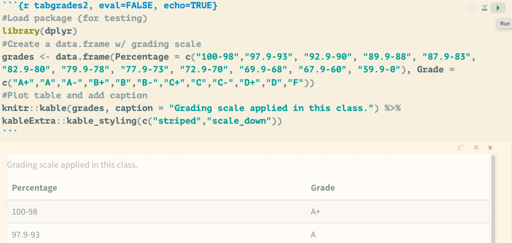
```
8. Knit your document using the `Knit` button  in the editor toolbar (see Figure \@ref(fig:knitout)) to inspect the output and check your syntax and code.

<div class="danger">
  <p><strong>💡 Something is Missing...</strong></p>
  <ul>
    <li><strong>Challenge:</strong> Scrutinize the code provided in this section to determine how the table caption is created.</li>
    <li><strong>Test Your Hypothesis:</strong> Once you have figured out how the caption is assigned, test your hypothesis by editing it and knitting your document.</li>
  </ul>
</div>

---

### Insert Figures {#insertfigure}

This tutorial introduces key concepts related to figure creation in R Markdown, specifically the following:

- Creating a figure based on R code. 
- Assigning a figure caption.
- Providing a unique label to the R code chunk allowing further cross-referencing in the text.
- Displaying the figure in the document.  

More details on this topic will be provided in Chapter 10.

In this section, you will learn the R Markdown syntax and R code needed to replicate Figure \@ref(fig:cars). 

```{r cars, echo=FALSE, results="hide", fig.cap="Plot of cars' speed in relation to distance.", out.width = '100%'}
summary(cars)
plot(cars)
```

#### Step-by-Step Protocol

Follow these steps to reproduce Figure \@ref(fig:cars) in your R Mardown document: 

1. If not done yet, open `Chapter2_partC.Rmd` in RStudio.
2. Add a first-level header titled `Figures` below the `Tables` header.  
3. Insert an R code chunk under your header by clicking the `Insert` button  in the editor toolbar.
4. Copy and paste the following R code into your code chunk:
```{r eval=FALSE}
###
# Load and summarize the cars dataset
###
summary(cars)

###
# Plot data
###
plot(cars)
```
5. Edit the R code chunk options line by adding the following argument (**Note:** each argument should be separated by a comma):
  - `echo = FALSE`
  - `results = "hide"`
  - `fig.cap = "Plot of cars' speed in relation to distance."`
  - `out.width = "100%"`
6. Add the unique label `cars` in the chunk options line (immediately after `{r`) to enable cross-referencing. 
7. Test your R code to ensure it produces the expected table by clicking the `Play` button at the top left of the code chunk (as done in [Tables](#inserttable)). 
8. Knit your document using the `Knit` button  in the editor toolbar (see Figure \@ref(fig:knitout)) to inspect the output and check your syntax and code.

<div class="danger">
  <p><strong>💡 Challenge</strong></p>
  <ul>
    <li>What syntax is used to assign a figure caption?</li>
    <li>How does the syntax for assigning captions to tables and figures compare?</li>
  </ul>
</div>

---

### Cross-reference Tables and Figures in the Text {#crossrefTabFig}

Cross-referencing tables and figures in the main body of your R Markdown document can easily be done by using the `\@ref()` function implemented in  the *bookdown* package (see Figure \@ref(fig:RMarkdwnstrct)). 

#### General Syntax

The general syntax is as follows:

```{r synt, eval=F}
# Cross-referencing tables in main body of text
Table \@ref(tab:code_chunk_ID)

# Cross-referencing figures in main body of text
Figure \@ref(fig:code_chunk_ID)
```

<div class="info">
  <p><strong>💡 More Info on the Syntax</strong></p>
  <ul>
    <li>It is worth mentioning that you need to manually add <code>Table</code> or <code>Figure</code> in front of <code>\@ref(tab:code_chunk_ID)</code> or <code>\@ref(fig:code_chunk_ID)</code>. This design allows the user to choose how tables and figures are referenced in the text. Journals often have distinct formatting styles, which must be followed during submission.</li>
  </ul>
</div>

#### Step-by-Step Procedure

1. To cross-reference your table (labeled `tabgrades`) in the text, follow these steps:
    - Type the following sentence below your `Tables` header:  
      `The grading scale presented in the syllabus is available in Table \@ref(tab:tabgrades).`
    - Knit your document using the `Knit` button  in the editor toolbar (see Figure \@ref(fig:knitout)) to inspect the output and verify that the syntax and code are working correctly.

2. To cross-reference your figure (labeled `cars`) in the text, follow these steps:
    - Type the following sentence below your `Figures` header:  
      `The plot of the cars data is available in Figure \@ref(fig:cars).`
    - Knit your document using the `Knit` button  in the editor toolbar (see Figure \@ref(fig:knitout)) to inspect the output and verify that the syntax and code are working correctly.

---

### Cite References in the Text {#bib}

#### Introduction

In this section, we will cover the following topics before delving into the practical implementation of citing references in your R Markdown document:

- [The Bibliography File](#bibFile)
- [The BibTeX Format](#BibTexFormat)
- [Citation Identifier](#citationidentifier)

##### The Bibliography File {#bibFile}

Pandoc can automatically generate citations in your text and a References section following a specific journal style (see Figure \@ref(fig:RMarkdwnstrct)). To use this feature, you need to declare a bibliography file in the [YAML metadata section].

In this course, we are working with bibliography files formatted using the [`BibTeX`](#BibTexFormat) format. Other formats can also be used — please see this [resource](https://rmarkdown.rstudio.com/authoring_bibliographies_and_citations.html) for more details.

Most journals allow citations to be downloaded in `BibTeX` format, but if this feature is not available, you can convert citation formats using online services (e.g., EndNote to BibTeX: https://www.bruot.org/ris2bib/).

##### The BibTeX Format {#BibTexFormat}

BibTeX is a reference management tool commonly used in conjunction with LaTeX (a Markup language) to format lists of references in scientific documents. It allows users to maintain a bibliographic database (`.bib` file) and cite references in a consistent and automated way.

Each entry in a `.bib` file follows this general structure:

Please find below an example of a reference formatted in `BibTeX` format:

```{r eval = FALSE}
@entrytype{citationIndentifier,
  field1 = {value1},
  field2 = {value2},
  ...
}
```

<div class="info">
  <p><strong>💡 Info on BibTeX format</strong></p>
  <ul>
    <li><strong><code>&#64;entrytype</code>:</strong> Type of reference (e.g., <code>&#64;article, &#64;book, &#64;inproceedings</code>).</li>
    <li><strong>citationIdentifier:</strong> Unique ID used to cite the entry in your R Markdown document.</li>
    <li><strong>fields:</strong> Key-value pairs with bibliographic information (e.g., author, title, year).</li>
  </ul>
</div>

Here is an example associated with @Baker_2016:

```{r eval = FALSE}
# Example of BibTex format for Baker (2016) published in Nature
@Article{Baker_2016,
  doi = {10.1038/533452a},
  url = {https://doi.org/10.1038/533452a},
  year = {2016},
  month = {may},
  publisher = {Springer Nature},
  volume = {533},
  number = {7604},
  pages = {452--454},
  author = {Monya Baker},
  title = {1,500 scientists lift the lid on reproducibility},
  journal = {Nature},
}
```

##### Citation Identifier {#citationidentifier}

The unique citation identifier of a reference (`Baker_2016` in the example above) is set by the user in the `BibTeX` citation file (see the first lines in the examples provided above). This identifier is used to refer to the publication in the R Markdown document and also enables citing references and generating the References section.

#### Step-by-Step Procedures

In this section, we will cover the following topics to implement the tools for references citing in your R Markdown document:

- [Steps to Complete Before Citing References in Your Text](#stepsbeforeciting)
- [Cite References in Your Text](#citerefintext)

##### Steps to Complete Before Citing References in Your Text {#stepsbeforeciting}  

1. Save all your `BibTeX`-formatted references in a bibliography text file, and make sure to add the `.bib` or `.bibtex` extension.  
2. Place the bibliography file in your project folder (alongside your `.Rmd` file).  
3. Declare the name of your bibliography file in the [YAML metadata section] under the `bibliography:` field.  
4. References formatted in the `BibTeX` format are available in the following file:  
    + `Bibliography_Reproducible_Science_2.bib`
    
<div class="danger">
  <p><strong>💡 Exercise: Download a Citation in BibTeX Format</strong></p>
  <ul>
    <li>Visit this <a href="https://doi.org/10.1093/botlinnean/box083" target="_blank" rel="noopener noreferrer">webpage</a>.</li>
    <li>Locate the <code>Cite</code> icon and download a citation in <code>.bibtex</code> format.</li>
    <li>Open the <code>.bibtex</code> file in a text editor and inspect its contents.</li>
    <li>What is the unique citation identifier of this article?</li>
  </ul>
</div>

##### Cite References in Your Text {#citerefintext}

We will examine the syntax for citing references, either as parenthetical citations or in-text citations.

- **Parenthetical Citation:** The entire citation appears in parentheses, usually at the end of a sentence or clause.  
- **In-Text Citation:** The author's name is part of the sentence, and the citation appears naturally in the flow of the text.

###### Parenthetical Citation

In this case, citations are placed inside square brackets (`[]`) (usually at the end of a sentence or clause) and separated by semicolons. Each citation must include a key composed of `@` followed by the citation identifier (as stored in the `BibTeX` file).

Please find below some examples on citation syntax:

```{r eval=FALSE}
#Syntax
Blah blah [see @Baker_2016, pp. 33-35; also @Smith2016, ch. 1].
Blah blah [@Baker_2016; @Smith2016].
```

Once knitted (using the  button), the citation syntax is rendered as:

Blah blah [see @Baker_2016, pp. 33–35; also @Smith2016, ch. 1].

Blah blah [@Baker_2016; @Smith2016].

A minus sign (`-`) before the `@` symbol will suppress the author's name in the citation. This is useful when the author is already mentioned in the text:
```{r eval=FALSE}
#Syntax
Baker says blah blah [-@Baker_2016].
```

Once knitted, the citation is rendered as:

Baker says blah blah [-@Baker_2016].

###### In-Text Citation

In this case, in-text citations can be rendered with the following syntax:
```{r eval=FALSE}
#Syntax
@Baker_2016 says blah.
@Baker_2016 [p. 1] says blah.
```

Once knitted, the citation is rendered as:

@Baker_2016 says blah.

@Baker_2016 [p. 1] says blah.

##### Practice Citing References

<div class="danger">
  <p><strong>💡 Your turn to practice citing references in your document by:</strong></p>
  <ul>
    <li>Write a sentence citing &#64;Baker_2016 using parenthetical citation syntax.</li>
    <li>Write a sentence citing &#64;Baker_2016 using in-text citation syntax.</li>
  </ul>
</div>

---

### Generate a References Section {#refsection}

Upon knitting, a References section will automatically be generated and inserted at the end of your document (see Figure \@ref(fig:RMarkdwnstrct)). 

We recommend adding a level-1 "References" header immediately after the final paragraph of the document, as shown below:

```{r eval=FALSE}
last paragraph...

# References
```

The bibliography will be inserted after this header (please see the [References] section of this tutorial for more details).

<div class="danger">
  <p><strong>💡 Your Turn!</strong></p>
  <ul>
    <li>Edit your document to add a References section.</li>
  </ul>
</div>

---

### Format Citations to Journal Style {#cslForm}

In this section, we will explore how your bibliography can be automatically formatted to match a specific journal style. This is done by specifying a **Citation Style Language (CSL)** file in the YAML metadata section using the `csl:` field. The CSL file contains the formatting rules required to style both in-text citations and the bibliography according to the selected journal or publication.

#### What is the Citation Style Language?

The **Citation Style Language (CSL)** is an open-source project designed to simplify scholarly publishing by **automating the formatting of citations and bibliographies**. The project maintains a crowdsourced repository of over 8,000 free CSL citation styles. For more information, visit: [https://citationstyles.org](https://citationstyles.org)

#### CSL repositories

There are two main CSL repositories: 

- **GitHub Repository:** https://github.com/citation-style-language/styles
- **Zotero Style Repository:** https://www.zotero.org/styles

#### Step-by-Step Procedure

To learn this procedure and syntax, you will be tasked with downloading a `.csl` file and using it in your document (in place of `AmJBot.csl`).

Follow these steps to format your citations and bibliography according to a specific citation style (see Figure \@ref(fig:RMarkdwnstrct) for more details):

1. Download a `.csl` file from one of the repositories provided above.  
2. Place your `.csl` file in your project folder (alongside your `.Rmd` file).  
3. Edit your YAML metadata section to specify the name of your `.csl` file.
4. Knit your document using the `Knit`  button. The Pandoc program will use the information specified in the YAML metadata section to format both the in-text citations and the bibliography section according to the citation style defined in the CSL file. Be sure to add a `References` header at the end of your `.Rmd` document.

## PART D: Advanced R and R Markdown settings {#partD}

### Introduction

The **aim** of this tutorial is to provide an overview of procedures that can be applied to streamline your R Markdown document, supporting both your computing needs and formatting style.

### Learning Outcomes

This tutorial provides students with the opportunity to learn how to:

- [Set up your working directory](#setwdir)
- Understand how to set global options for code chunks related to:
  + [text output](#textout)
  + [code formatting](#codeformat)
  + [code caching](#codecach)
  + [plot output (format and resolution)](#plotout)
  + [figure positioning (close to the associated code chunks)](#figpos)
- [Implement global options for code chunks](#setupcode)
- [Practice the global options procedure](#practglobalopt)

---

### Supporting Files

Please refer to [section](#Files) for more details on supporting files and their locations on the shared Google Drive.

---

### Set Up Your Working Directory {#setwdir}

Unlike R scripts, where you must set your working directory or provide the path to your files, the approach implemented in an R Markdown document (`.Rmd`) automatically sets the working directory to the location of the `.Rmd` file. This behavior is managed by functions from the **knitr** package. `knitr` expects all referenced files to be located either in the same directory as the `.Rmd` file or in a subfolder within this working directory. 

The primary reason for this approach is to maximize the portability of your R Markdown project, which is typically composed of a set of files.

#### Step-by-Step Procedure

Before knitting your document, you will be testing your code (see Figure \@ref(fig:runcodetab)). To ensure smooth code testing, you need to set your working directory. This can be done in RStudio by clicking (see Figure \@ref(fig:setwd)):

`Session --> Set Working Directory --> To Source File Location`

```{r setwd, echo=FALSE, fig.cap="Snapshot of RStudio showing procedure to set your working directory to allow testing your code prior to knitting.", out.width = "100%"}
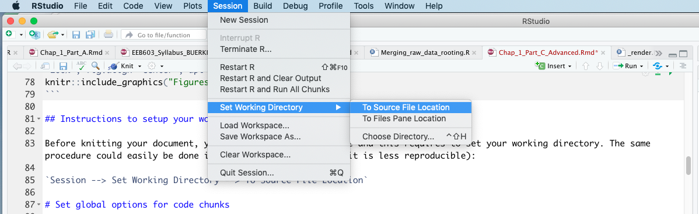
```

---

### Set Global Options for Code Chunks

#### Introduction

To improve code reproducibility and efficiency, and to comply with publication requirements, it is customary to include a code chunk at the beginning of your `.Rmd` file that sets global options for the entire document (see Figure \@ref(fig:RMarkdwnstrct)). These settings relate to the following elements of your code:

- [text output](#textout)
- [code formatting](##codeformat)
- [code caching](#codecach)
- [plot output (or figures)](#plotout)
- [figure positioning](#figpos)

These general settings will be configured using the `opts_chunk$set()` function provided by the `knitr` package [@R-knitr]. The following website contains valuable information on code chunk options:

- https://yihui.name/knitr/options/

##### The `opts_chunk$set()` Function

The `knitr` function `opts_chunk$set()` is used to modify the default global options in an `.Rmd` document.

Before starting, please note the following important points about the options:

1. Chunk options must be written on a single line; no line breaks are allowed within chunk options.
2. Avoid using spaces and periods (`.`) in chunk labels and directory names.
3. All option values must be valid R expressions, just as function arguments are written.

We will discuss each part of the settings individually; however, these settings must be combined into a single code chunk in your document named `setup` (please see below for more details).

---

#### Text Output {#textout}

This section covers settings related to the text output generated by code chunks.

Below is an example of options that can be applied across code chunks:

```{r echo= TRUE, eval = FALSE}
# Setup options for text results
opts_chunk$set(echo = TRUE, warning = TRUE, message = TRUE, include = TRUE)
```

##### Explanations of the Code

- `echo = TRUE`: Include all R source code in the output file.
- `warning = TRUE`: Preserve warnings (produced by `warning()`) in the output, as if running R code in a terminal.
- `message = TRUE`: Preserve messages emitted by `message()` (similar to warnings).
- `include = TRUE`: Include all chunk outputs in the final output document.

If you want some text results to use different options, please adjust those in their specific code chunks. This comment applies to all other general settings as well.

---

#### Code Formatting {#codeformat}

This section covers settings related to code formatting (that is, how code is displayed in the final `html` or `pdf` document) generated by code chunks.

Below is an example of options that can be applied across code chunks:

```{r echo= TRUE, eval=FALSE}
# Setup options for code formatting
opts_chunk$set(tidy = TRUE, tidy.opts = list(blank = FALSE, width.cutoff = 60), highlight = TRUE)
```

##### Explanations of the Code

- `tidy = TRUE`: Use `formatR::tidy_source()` to reformat the code. Please see the `tidy.opts` option below.
- `tidy.opts = list(blank = FALSE, width.cutoff = 60)`: A list of options passed to the function specified by the `tidy` option. Here, the code is formatted to avoid blank lines and has a width cutoff of 60 characters.
- `highlight = TRUE`: Highlight the source code.

---

#### Code Caching {#codecach}

To compile your `.Rmd` document faster—especially when you have computationally intensive tasks—you can cache the output of your code chunks. This process saves the results of these chunks, allowing you to reuse the output later without re-running the code.

The *knitr* package provides options to evaluate cached chunks only when necessary, but this must be set by the user. This procedure creates a unique MD5 digest (a data storage technique) for each chunk to track changes. When the option `cache = TRUE` (there are other, more granular settings; see below) is set, the chunk will only be re-evaluated in the following scenarios:

- There are no cached results (either this is the first time running or the cached results were moved or deleted).
- The code chunk has been modified.

The following code allows you to implement this caching procedure in your document:

```{r echo = TRUE, eval = FALSE}
# Setup options for code caching
opts_chunk$set(cache = 2, cache.path = "cache/")
```

##### Explanations of the Code

- In addition to `TRUE` and `FALSE`, the `cache` option also accepts numeric values (`cache = 0, 1, 2, 3`) for more granular control. `0` is equivalent to `FALSE`, and `3` is equivalent to `TRUE`.  
  - With `cache = 1`, the results are loaded from the cache, so the code is not re-evaluated; however, everything else is still executed, including output hooks and saving recorded plots to files.  
  - With `cache = 2` (used here), the behavior is similar to `1`, but recorded plots will not be re-saved to files if the plot files already exist—saving time when dealing with large plots.
- `cache.path = "cache/"`: Specifies the directory where cache files will be saved. You do not need to create the directory manually; *knitr* will create it automatically if it does not already exist.
  
---

#### Plot Output {#plotout}

Plots are a major component of your research and form the basis of your figures. You can take advantage of options provided by the `knitr` package to produce plots that meet publication requirements. This approach can save valuable time during the writing phase, as it eliminates the need to manually adjust figure size and resolution to comply with journal guidelines.

Below is an example of options that can be applied across code chunks:

```{r echo = TRUE, eval = FALSE}
# Setup options for plots
# The first dev is the master for the output document
opts_chunk$set(fig.path = "Figures_MS/", dev = c('png', 'pdf'), dpi = 300)
```

##### Explanations of the Code

- `fig.path = "Figures_MS/"`: Specifies the directory where figures generated by the R Markdown document will be saved. As with caching, this folder does not need to exist beforehand; it will be created automatically. Files will be saved based on the code chunk label and assigned figure number.
- `dev = c("pdf", "png")`: Saves each figure in both `pdf` and `png` formats.
- `dpi = 300`: Sets the resolution (dots per inch) for bitmap devices. The resulting image dimensions follow the formula: DPI × inches = pixels. Check the submission guidelines of your target publication to ensure this value meets their requirements.

<div class="info">
  <p><strong>💡 More Than One Type of Figure</strong></p>
  <ul>
    <li>It is worth noting that you might use external figures in your `.Rmd` document. To avoid confusion between figures generated by the `.Rmd` file and those imported from outside sources, it is best practice to save them in two separate subfolders (see Figure \@ref(fig:projstr) for more details).</li>
  </ul>
</div>

##### Additional Plot Options

Some journals have specific requirements for figure dimensions. You can easily set these using the following option:

- `fig.dim`: *(NULL; numeric)* — If a numeric vector of length 2, it specifies `fig.width` and `fig.height`. For example: `fig.dim = c(5, 7)`.  
  The unit for both dimensions is **inches**.

---

#### Figure Positioning {#figpos}

Positioning figures close to their corresponding code chunks is important for clarity and reproducibility. This can be controlled by adding another `opts_chunk$set()` option in your `setup` code chunk. 

Use the `fig.pos` argument and set it to `"H"` to enforce figure placement near the relevant code.

```{r echo= TRUE, eval=FALSE}
## Locate figures as close as possible to requested position (=code)
opts_chunk$set(fig.pos = "H")
```

<div class="disclaimer">
  <p><strong>💡 Warning</strong></p>
  <ul>
    <li>This setting may cause errors when the <code>.Rmd</code> file is knitted to a <code>pdf</code> document. If this occurs, comment out the line of code using <code>#</code> and try knitting again.</li>
  </ul>
</div>

---

### Implement Global Options for Code Chunks {#setupcode}

In this section, we will combine all the global settings discussed above into a code chunk named `setup`, which should be placed below the YAML metadata section (see Figure \@ref(fig:RMarkdwnstrct) for more details on its location). 

In addition to containing the global settings, it is advisable to include a code section for loading the required R packages (see [Chapter 2 - Part B](#partB) and Figure \@ref(fig:RMarkdwnstrct)).

Below is the code for the `setup` code chunk based on the options presented above:

```{r echo= TRUE, eval=FALSE}
###
# Load packages
###
## Add any packages specific to your code
library("knitr")
library("bookdown")

###
# Chunk options: see http://yihui.name/knitr/options/ ###
###
## Text output
opts_chunk$set(echo = TRUE, warning = TRUE, message = TRUE, include = TRUE)

## Code formatting
opts_chunk$set(tidy = TRUE, tidy.opts = list(blank = FALSE, width.cutoff = 60), highlight = TRUE)

## Code caching
opts_chunk$set(cache = 2, cache.path = "cache/")

## Plot output
# The first dev is the master for the output document
opts_chunk$set(fig.path = "Figures_MS/", dev = c('png', 'pdf'), dpi = 300)

## Figure positioning
opts_chunk$set(fig.pos = "H")
```

#### Settings of the `setup` R Code Chunk {#codechunkoptions}

When inserting the code above into an R code chunk (see Figure \@ref(fig:RMarkdwnstrct)), please set the chunk options as follows:

- `setup`: Unique ID of the code chunk.
- `include = FALSE`: The code will be evaluated, and any plot files will be generated, but nothing will be written to the output document.
- `cache = FALSE`: The code chunk will not be cached (see above for more details).
- `message = FALSE`: Messages emitted by `message()` will not be included in the output.

---

### Practice the Global Options Procedure {#practglobalopt}

Please follow the procedure outlined above to implement the material presented in this section and become familiar with the tutorial content. This exercise is divided into seven steps as follows:

1. Open RStudio and open your `Chapter_2_PartC.Rmd` document.
2. Set your working directory according to the file location. **Note:** This step is especially important if you want to test your R code prior to knitting the document.
3. Insert an R code chunk (using the `Insert`  button) directly below the YAML metadata section and name it `setup`. This code chunk will be used to define the global settings via the `opts_chunk$set()` function.
4. Copy the content of the code presented in this [section](#setupcode) into your `setup` code chunk.
5. Edit your code chunk options as presented [above](#codechunkoptions).
6. Use the R code provided [below](#step5) (which generates a plot) to explore the effect of global settings on code outputs.
7. Once you have completed the procedures associated with step 6, knit your document using the `Knit`  button. Please pay attention to the outputs in your working directory.
8. Use the `bookdown` `\@ref()` function to cite your figure or plot in the text.

#### Code for Step 6 {#step5}

The R code provided below corresponds to step 6 of the procedure and produces the plot shown in Figure \@ref(fig:PlotFig).

```{r PlotFig, echo=FALSE, results="hide", fig.cap="Plot of y ~ x."}
# Generate a set of observations (n=100) that have a normal distribution
x <- rnorm(100)

# Add a small amount of noise to x to generate a new vector (y)
y <- jitter(x, 1000)

# Plot y ~ x
plot(x, y)
```

**What you have to do:**

1. Insert an R code chunk (using the `Insert`  button) under the `Figures` header of your document and set the following options and arguments:
    - `Plot`: Unique ID of the code chunk.
    - `fig.cap = "Plot of y ~ x."`: Figure caption.
    - `fig.show = "asis"`: Figure display.
    - `out.width = "100%"`: Figure width on the page.
2. Enter the following R code inside the code chunk.

```{r Plot2, eval = FALSE}
# Generate a set of observations (n=100) that have a normal distribution
x <- rnorm(100)

# Add a small amount of noise to x to generate a new vector (y)
y <- jitter(x, 1000)

# Plot y ~ x
plot(x, y)
```

3. Test your code to ensure it performs as expected (using the `Run`  button).  
4. Proceed to step 7 in the above section and complete the procedure.

## PART E: User-Defined Functions in R {#partE}

### Introduction

The **aim** of this tutorial is to provide an introduction to functions; more specifically, we will be studying user-defined functions (UDFs) as implemented in R.

<div class="info">
  <p><strong>💡 UDFs 101</strong></p>
  <ul>
    <li><b>What are UDFs?</b> UDFs allow users to write their own functions and make them available in the R Global Environment.</li>
    <li><b>How do they work?</b> UDFs are saved in <code>.R</code> scripts and are made available to users using the <code>source()</code> function, which reads the file content and loads the UDFs.</li>
    <li><b>Your UDF collection can ultimately lead to creating <a href="https://r-pkgs.org">R packages</a>.</b></li>
  </ul>
</div>

### Learning Outcomes

By the end of this tutorial, students will be able to:

- [Define a function and understand its applicability](#definefunc)
- [Use the correct syntax to implement user-defined functions in R](#syntaxUDFs)
- [Apply best practices for writing clear and maintainable code](#bestcodepract1)
- [Load and call user-defined functions](#loadandcallUDFs)
- [Develop, implement, and apply user-defined functions that return a single value](#UDFsingle)
- Develop, implement, and apply user-defined functions that return multiple values
- Understand the role of R lists and how they support functions that return multiple values
- Implement defensive programming techniques to improve code robustness
- Use logical operators effectively within R functions

To achieve these outcomes, students will complete three guided exercises. Mathematical examples will be used to demonstrate the broad applicability of the material. Before diving into the exercises, the instructor will provide context on what functions are, when to use them, and best practices for writing pseudocode and R code (explored further in [Chapter 5](#Chap5)). The tutorial will also cover effective strategies for calling and organizing R functions.

<div class="disclaimer">
  <p><strong>💡 Disclaimer</strong></p>
  <ul>
    <li>This tutorial will be taught using an <code>.R</code> script.</li>
    <li>We will discuss how to integrate user-defined functions (UDFs) from an <code>.R</code> script into your R Markdown document.</li>
  </ul>
</div>

---

### Define a Function and Understand its Applicability {#definefunc}

In programming, you use functions to incorporate sets of instructions that you want to use repeatedly or that, because of their complexity, are better self-contained in a subprogram and called when needed.

**A function is a piece of code written to carry out a specified task**; it may or may not accept arguments or parameters, and it may or may not return one or more values.

#### Functions in R

There are many terms used to define and describe functions—subroutines, procedures, methods, etc.—but for the purposes of this tutorial, you will ignore these distinctions, which are often semantic and reminiscent of older programming languages (see here for more details on [semantics](http://programmers.stackexchange.com/questions/123159/what-are-the-specific-meanings-of-the-terms-functions-methods-procedures-and?rq=1)). In our context, these definitions are less important because, in R, we only have functions.

#### R Syntax for Functions

In R, according to the base documentation, you define a function with the following construct:

```{r Rfuncsyntax, tidy = FALSE, echo=TRUE, eval=FALSE}
function(arglist){
   body
}
```

The code between the curly braces is the `body` of the function.

When you use built-in functions, the only things you need to worry about are how to effectively communicate the correct input arguments (`arglist`) and how to manage the return value(s) (or outputs), if there are any. To learn more about the arguments associated with a specific function, you can access its documentation using the following syntax (entered in the R console):

```{r echo=TRUE, eval=F, tidy=F}
#General syntax
?function() 

#Example with read.csv()
?read.csv()
```

---

### Syntax to Implement UDFs in R {#syntaxUDFs}

R allows users to define their own functions (UDFs), which are based on the following syntax:

```{r eval=FALSE, tidy = FALSE}
function.name <- function(arguments){
   computations on the arguments
   some more code
   return value(s)
}
```

<div class="info">
  <p><strong>💡 In most cases, an R function has the following components:</strong></p>
  <ul>
    <li><b>A name:</b> In our example, <code>function.name</code>.</li>
    <li><b>Arguments (<code>arguments</code>):</b> These are inputs to the function, declared within the parentheses <code>()</code> following the keyword <code>function</code>.</li>
    <li><b>A body:</b> The body is the code enclosed within curly braces <code>{}</code>, where the computation is carried out.</li>
    <li><b>One or more return values:</b> These values are output by the user-defined function (UDF).</li>
    <li><b>Definition syntax:</b> Overall, you define the function similarly to variables, by “assigning” the directive <code>function(arguments)</code> to the “variable” <code>function.name</code>, followed by the function body.</li>
  </ul>
</div>

### Apply Best Practices for Writing Code {#bestcodepract1}

This topic will be explored in more detail in [Chapter 5](#Chap5), but here we introduce some best practices for writing clear and maintainable code.

**A key part of this process involves starting with pseudocode before transitioning to actual R code.** Pseudocode provides a high-level, language-agnostic description of the tasks your function needs to perform. It allows you to plan the structure and logic of your function before dealing with R syntax.

Once the pseudocode is defined, the next step is to translate each task into actual R code. This involves identifying existing R functions that can perform the required operations. If suitable functions do not exist, you may need to write your own—potentially supported by additional pseudocode to clarify the logic.

Below, you will find more detailed definitions of the two key concepts introduced here: [pseudocode](#writepseudointro) and [code writing/implementation](#writingcodeintro).

#### Writing Pseudocode {#writepseudointro}

**Pseudocode is an informal, high-level description of the operating logic of a computer program or algorithm.** It uses the structural conventions of a programming language (in this case, `R`) but is intended for human understanding rather than machine execution.

In this stage, you outline the major steps of your function and break them down into associated tasks. You then link these steps to specific `R` functions—either existing ones or those you will need to develop. This provides the backbone of your code and supports the transition to implementation.

#### Writing Code {#writingcodeintro}

Writing clear, reproducible code has (at least) three main benefits:

1. It makes it much easier to revisit your code months later—whether you're returning to an old project or making revisions after peer review.
2. It allows others to more easily scrutinize the results of your analysis, helping to establish their validity.
3. Clean, well-documented, and reproducible code can encourage others to adopt any new methods you've developed (and can lead to more citations).

---

### Load and Call UDFs {#loadandcallUDFs}

When working on your project, it is highly likely that you will develop multiple UDFs tailored to your research. In this case, it is recommended to create a dedicated folder named `R_functions` within your project directory (see Figure \@ref(fig:Structure)). Save each UDF as a separate file (e.g., `check.install.pkg.R`) inside the `R_functions` folder.

```{r Structure, echo=FALSE, fig.cap="Example file structure of a simple analysis project. See Chapter 4 for more details", fig.show="asis", out.width = '100%'}
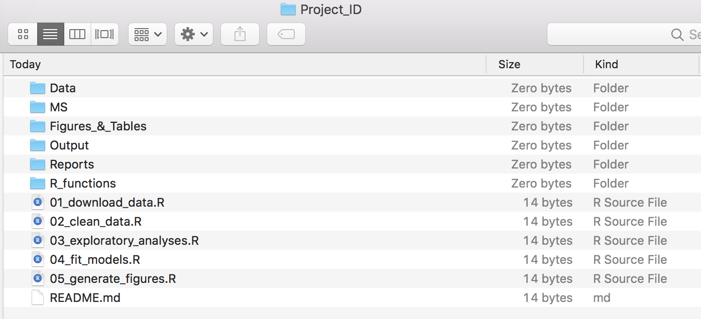
```

#### The `source()` Function

Once your project is properly structured (see Figure \@ref(fig:Structure)), it becomes easy to load specific UDFs stored in separate R scripts using the `source()` function.

For example, to load the `check.install.pkg()` function (saved as `R_functions/check.install.pkg.R`) into the Global Environment, enter the following code in the R console (see Figure \@ref(fig:sourceUDF)):


```{r echo=TRUE, eval=T}
source("R_functions/check.install.pkg.R")
```

```{r sourceUDF, echo=FALSE, fig.cap="Snapshot of RStudio showing output of source() function and the UDF made available in the Global Environment. You can also view the code unperpinning the UDF.", fig.show="asis", out.width = '100%'}
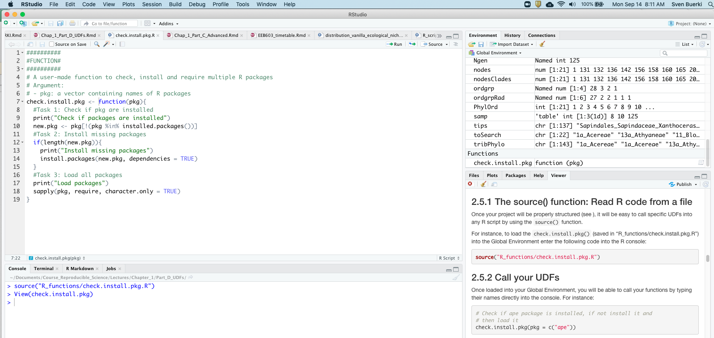
```

Below is an example of R code that loads all your UDFs stored in the `R_functions` folder. This approach is especially useful when you have multiple UDFs associated with your analysis pipeline.

```{r sourceallUDF, echo=T, eval=F}
###
#Load all UDFs stored in R_functions
##

#1. Create vector with names of UDF files in R_functions (with full path)
files_source <- list.files("R_functions", full.names = T)

#2. Iterative sourcing of all UDFs
sapply(files_source, source)
```

#### Call Your UDFs

Once your UDFs are loaded into the Global Environment (see Figure \@ref(fig:sourceUDF) for an example), you can call them by typing their names directly into the R console. For example:

```{r echo=TRUE, eval=T}
#Check if knitr package is installed, if not install it and then load it
check.install.pkg(pkg=c("knitr"))
```

---

### Develop, Implement, and Apply UDFs That Return a Single Value {#UDFsingle}

In this section, we will focus on developing UDFs that return a single value. But how do we tell a function what to return?

In R, this is done using the `return()` function.

To learn this skill, we will work on a challenge.

#### Challenge

We are tasked with **developing, implementing, and applying a UDF to calculate the square of a number.**

#### Writing Pseudocode

Let's begin by understanding this challenge from a mathematical perspective. Then, we will develop a pseudocode to solve it computationally. Finally, we will implement our solution in R.

In **mathematics**, the squared symbol ($^2$) is an arithmetic operator that signifies multiplying a number by itself. The “square” of a number is the product of the number and itself. Multiplying a number by itself is called “squaring” the number.

Although this task is straightforward, the function will still need to perform the following steps (i.e., pseudocode):

1. Store the number inputted by the user into an object called `base`, as part of the function’s argument(s).
2. Calculate the square of `base` by multiplying the number by itself.
3. Save the result of step 2 into an object called `sq`.
4. Return the `sq` object to the user (a single numeric value). To do this, we will use the `return()` function.

<div class="info">
  <p><strong>💡 Let's talk about the class of input/output data</strong></p>
  <ul>
    <li><strong>Input:</strong> The class of the input data must be <code>numeric</code>.</li>
    <li><strong>Output:</strong> The class of the output data must also be <code>numeric</code>.</li>
    <li><strong>Tip:</strong> You can check the class of an object using the <code>class()</code> function.</li>
    <li>The <code>class()</code> function is also useful when implementing defensive programming.</li>
  </ul>
</div>

#### Writing Code

In this section, we will implement the pseudocode outlined above in a function called `square_number()`. 

This function takes one argument from the user (`base`, a number) and returns the square of that number (i.e., `base * base`).

```{r tidy = FALSE, echo=TRUE, eval=T}
## Create a UDF in R to calculate square number:
# - argument: base (= one number)
# - output: square of base (= one number)
square_number <- function(base){
  #Infer square of base and save it into object
  sq <- base*base
  
  #Return sq object
  return(sq)
}
```

<!-- START HERE -->

Write the code associated to the `square_number` into your new R script (saved in your working directory) and load function by executing all lines associated to function. Please carry on populating this document with the rest of the exercises.

#### Loading your function into the Global Environment

Before being able to use your UDF, execute the code associated to the `square_number()` function in the console. The UDF should now be loaded in the Global Environment and therefore be available for use. To verify that the UDF is loaded, please check the Environment panel in RStudio (see Figure \@ref(fig:envir)).

```{r envir, echo=FALSE, fig.cap="Close-up of the Environment panel in RStudio showing that the UDF is loaded in the Global Environment and can be used.", fig.show="asis", out.width = '100%'}
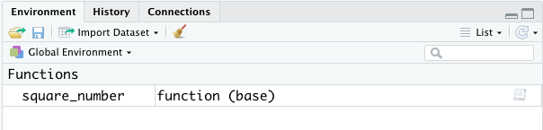
```

#### Applying your function

The R language is quite flexible and allows functions to be applied to a single value (e.g. `base = 2`) or a vector (e.g. `base = c(2,4,16,23,45)`). Please see below for more example:

1. Apply function to one value:

```{r echo=TRUE, eval=T}
#Square number of 2
square_number(base = 2)
```

2. Apply function to a vector containing multiple values:

```{r echo=TRUE, eval=T}
#Create vector with numbers
bases <- c(2,4,16,23,45)

#Apply function to vector
square_number(base = bases)
```

### Exercise 2: Develop, implement and apply function returning multiple values

In our previous exercise we developed a function returning only one value. As part of your research, there will be multiple instances where you will be performing multiple actions onto your data, which will call for multiple values to be outputted by the function. To do so, we will be **harvesting the different outputs of the function into a list, which will be returned to the users** (using `return()`).

#### What is a list in R?

Lists are **R objects containing elements of different types such as numbers, strings, vectors or another list** inside it. A list can also contain a matrix or a function as its elements. Lists are created using the `list()` function.

#### Creating a list

Find below an example to create a list containing strings, numbers, vectors and a logical values:

```{r echo=TRUE, eval=T}
#Create a list containing strings, numbers, vectors and a logical value
list_data <- list("Red", 51.3, 72, c(21,32,11), TRUE)

#Print object
print(list_data)
```

#### Naming list elements

The list elements can be given names and they can be accessed using these names (see below):

```{r echo=TRUE, eval=T}
# Create a list containing a vector, a matrix and a list
list_data <- list(c("Jan","Feb","Mar"), matrix(c(3,9,5,1,-2,8), nrow = 2),
   list("green",12.3))

# Give names to the elements in the list
names(list_data) <- c("1st_Quarter", "A_Matrix", "An_inner_list")

# Show the list
print(list_data)
```

#### Accessing list elements

Elements of the list can be accessed by the index of the element in the list. In case of named lists it can also be accessed using the names. We use the same example as above to illustrate procedure to access list elements:

```{r echo=TRUE, eval=T}
# Create a list containing a vector, a matrix and a list
list_data <- list(c("Jan","Feb","Mar"), matrix(c(3,9,5,1,-2,8), nrow = 2), list("green",12.3))

# Give names to the elements in the list
names(list_data) <- c("1st_Quarter", "A_Matrix", "An_inner_list")

# Access the first element of the list
print(list_data[1])

# Access the thrid element. As it is also a list, all its elements will be printed
print(list_data[3])

# Access the list element using the name of the element
print(list_data$A_Matrix)
```

#### Let's go back to our exercise

Now that you have more knowledge about list objects, we will be working on an **exercise aiming at developing and implementing a UDF to calculate the log and square of a number**.

#### Pseudocode and associated UDF

Each student is tasked to:

1. Develop a pseudocode to execute the UDF.
2. Implement the pseudocode into a UDF.
3. Apply and test your code/function.

#### Solution proposed by the instructor

Please find below the solution proposed by the instructor:

```{r tidy = FALSE, echo=TRUE, eval=T}
##Create a user defined function in R to calculate log and square of a number:
# argument: base (= one number)
# output: log and square of base (= two numbers) returned in a list
my_log_square <- function(base){
  #log (base 10)
  log_value <- log(base)
  #Square of base
  square_value <- base^2
  
  #Return both objects
  return(list(log_val = log_value, square_val = square_value))
}

# Call the function
my_log_square(base = 2)
```

### Exercise 3: Implement defensive programming to your code to support debugging

#### Background information and examples

Defensive programming is a technique to ensure that code fails with well-defined errors, i.e. where you know it should not work. **The key here is to ‘fail fast’ and ensure that the code throws an error as soon as something unexpected happens**. This creates a little more work for the programmer, but it makes debugging code a lot easier at a later date.

In order to demonstrate how to apply defensive programming to your code, a new function will be defined:

```{r tidy = FALSE, echo=TRUE, eval=T}
# Define a power function (exp_number): y = x^n
# - Arguments: base (= x) and power (= n)
# - Output: a number (y)
exp_number <- function(base, power){
  #Infer exp (y) based on base (x) and power (n) (y=base^power)
  exp <- base^power
  
  #Return exp object
  return(exp)
}

# Call function
exp_number(base = 2, power = 5)
```

You can employ defensive programming on the `exp_number` function defined above. The function requires that **both arguments are of class numeric**, if you were to provide a string (e.g. a word) as input, you would get an error:

```{r echo=TRUE, eval=T, error=TRUE}
#Example where we don't respect the class associated with the argument base
exp_number(base = "hello", power = 5)
```

If you **add in a line of code to test the data type of the inputs**, you get a more meaningful error.

```{r tidy = FALSE, echo=TRUE, eval=T, error=TRUE}
# Define a power function (exp_number): y = x ^n
# - Arguments: base (= x) and power (= n)
# - Output: a number (y)
exp_number <- function(base, power){
    # This if statement tests if classes of base and power are numeric.
    # If one of them is not numeric it stops and return meaningful message
    if(class(base) != "numeric" | class(power) != "numeric"){
          stop("Both base and power inputs must be numeric")
    }
    #If classes are good then infer exp
    exp <- base^power
    
    # Return exp object
    return(exp)
}

# Call function
exp_number(base = "hello", power = 5)
```

Although in this case debugging the error would not have taken long, in more complicated functions you are likely to either have less meaningful error messages, or code that runs for some time before it fails. By applying defensive programming and adding in these checks to the code, you can find unexpected behavior sooner and with more meaningful error messages.

### The logical operators in R

As you have seen in the previous example, we have used a logical operator (in this last case OR represented with the `|` syntax) to implement defensive programming into our UDF function. In a nutshell, the most used logical operators in `R` are as follows:

- AND (`&`): This operator takes two logical values and returns `TRUE` only if both values are TRUE themselves.
- OR (`|`): This operator takes two logical values and returns `TRUE` if just one value is `TRUE`.
- NOT (`!`): This operator negates the logical value it is used on.

You can learn more about the logical operators (including exercises) on the [website](https://builtin.com/data-science/and-in-r). 

### Exercise 4: Your turn to implement defensive programming!

Update `my_log_square()` to verify the class of `base` argument and print a meaningful error message if the class is not numeric.

## PART F: Interactive tutorials {#partF}

The objective of this section is to provide students with some tools and ideas to design their bioinformatic tutorials (for PART 2). Here, students will have an overview of the tools implemented in the R package [*learnr*](https://rstudio.github.io/learnr/index.html), which was developed to produce interactive tutorials. Although developed in R, the interactive tutorials are designed to be conducted in web browsers (but it could also be entirely done within RStudio).

The interactive tutorial presented here is subdivided into five topics:

1. **Introduction**: This part sets the scene and provides some background information on the tutorial.
2. **Exercise**: The aim of the exercise is presented together with a pseudocode (with associated R functions) outlying steps to design and implement an R code to complete the exercise. Students are asked to develop their R codes and execute them in the code chunk. You can type your code directly in the window/console and execute it using the `R Code` button. The instructor has also provided the solution to the exercise, which could be accessed by pressing the `Solution` button available in the top banner of the code chunk window. 
3. **Questions**: These questions are designed to test students' knowledge of the code.
4. **Solution**: A commented solution proposed by the instructor is available in a code chunk. Students can execute the code and inspect outputs produced to generate the final answer.
5. **YouTube tutorial**: Here, a short YouTube video presents the procedure to launch a *learn* interactive tutorial and briefly presents the exercise. The main objective of this video is to show students that it is quite easy to integrate a video into their tutorials.

Finally, the instructor wants to stress that students are not obliged to design their tutorials using *learnr*. You can also use the R Markdown language/syntax and output tutorials in HTML or PDF formats (more on this subject in Chapter 1).

This document highlights steps to execute the interactive tutorial designed by the instructor.

### Installation of required package

Open RStudio and install the *learnr* package from CRAN by typing the following command in the console:

```{r, eval=FALSE}
install.packages("learnr")
```

### Files location & description

Files associated to this tutorial are deposited on the [Google Drive](https://drive.google.com/drive/folders/1eZyjGQ478vaKiGD01hcryyNtdGp9t1J7?usp=sharing) under this path:
`Reproducible_Science -> Bioinformatic_tutorials -> Intro_interactive_tutorial`

There are two main files:

- `README.html`: The documentation to install R package and run interactive tutorial.
- `EEB603_Interactive_tutorial.Rmd`: The interactive tutorial written in R Markdown, but requiring functions from *learnr*.

### YouTube video

The instructor has made a video explaining the procedure to launch the interactive tutorial (based on option 1; see below) as well as some additional explanations related to the exercise. 

- https://youtu.be/ALSpVwymZbM

### Running tutorial

1. Download the `Intro_interactive_tutorial` folder and save it on your local computer.
2. Set working directory to location of `EEB603_Interactive_tutorial.Rmd`. 
  - This can be done as follows in RStudio: `Session -> Set Working Directory -> Choose Directory...`. 
  - You can also use the `setwd()` function to set your working directory (e.g. `setwd("~/Documents/Course_Reproducible_Science/Timetable/Intro_interactive_tutorial")`).
3. Running tutorial. There are two options to run the integrative tutorial:
  - **Option 1:** Open `EEB603_Interactive_tutorial.Rmd` in RStudio and press the `Run Document` button on the upper side bar to launch the tutorial. It will appear in the `Viewer` panel (on right bottom corner). You can open the interactive tutorial in your web browser by clicking on the third icon at the top of the viewer panel. This procedure is also explained in the [Youtube video](https://youtu.be/ALSpVwymZbM). 
  - **Option 2:** Type the following command in the console. This will open a window in RStudio. You can also open the tutorial in your web browser by pressing the `Open in Browser` button.
```{r, eval=FALSE}
rmarkdown::run("EEB603_Interactive_tutorial.Rmd")
```
4. Enjoy going through the tutorial!

### Learning syntax to develop interactive tutorials

The procedure to develop interactive tutorials using *learnr* is presented [here](https://rstudio.github.io/learnr/index.html). To learn more about the syntax, the instructor encourages you to open `EEB603_Interactive_tutorial.Rmd` in RStudio and inspect the document. This will allow learning syntax and associated procedures to:

- Design exercises (with embedded R code chunks and associated solutions).
- Include multiple choices questions.
- Embed a YouTube video.

# Chapter 3 {#chap3}

## Introduction

Improving the reliability and efficiency of scientific research will increase the credibility of the published scientific literature and accelerate discovery. 

In this chapter, we will survey measures that can be adopted to optimize key elements of the scientific process by especially focusing on:

- Methods
- Reporting and dissemination 
- Reproducibility
- Evaluation
- Incentives 

These measures aim at minimizing threats to the scientific process therefore making it more open and transparent (Figure \@ref(fig:ThreatReproSci)). 

While studying this topic, keep in mind this quote from [Richard Feynman](https://en.wikipedia.org/wiki/Richard_Feynman):

> *The first principle is that you must not fool yourself – and you are the easiest person to fool.*

```{r ThreatReproSci, echo=FALSE, fig.align="center", fig.cap="Overview of the scientific process and threats preventing reproducibility of the study (indicated in red). Abbreviations: HARKing: hypothesizing after the results are known; P-hacking: data dredging.", out.width = '80%'}
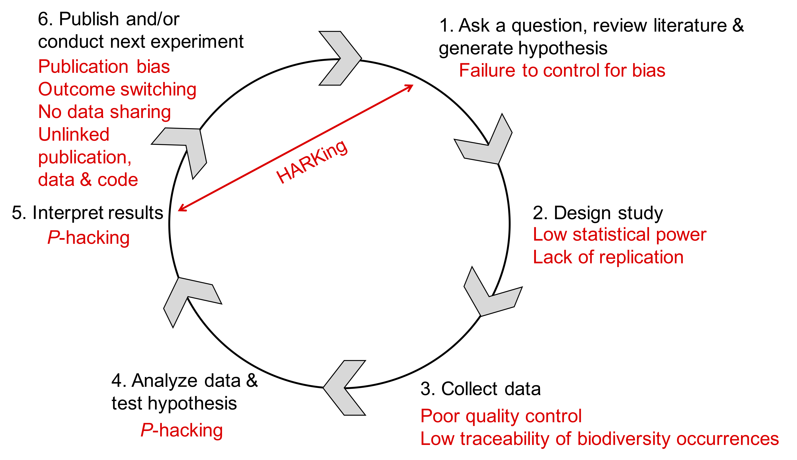
```

## Learning outcomes

- Review the steps involved in the scientific process.
- Identify and define threats to the scientific process.
- Discuss solutions to mitigate threats to the scientific process.
- Learn about the Transparency and Openness Promotion (TOP) guidelines and their applications in scientific publications and funding activities.

## Publications and web resources

This chapter is mostly based on the following resources:

- `r capture.output(print(refs["Kerr1998"]))` **- On HARKing (see Glossary section).**
- `r capture.output(print(refs["Nosek2012"]))` **- On incentives.** 
- `r capture.output(print(refs["Nosek1422"]))` **- On promoting an open research culture.**
- `r capture.output(print(refs["Baker_2016"]))` **- Results of reproducible survey.**
- `r capture.output(print(refs["Munafo"]))` **- Provides a framework to implement the measures proposed in this chapter.**
- `r capture.output(print(refs["Nosek2600"]))` **- On the pre-registration revolution.**
- `r capture.output(print(refs["Troudet2018"]))` **- On accuracy of biodiversity occurrences available in GBIF.**

The website of the **Center for Open Science** (https://cos.io) was also used to design the chapter content. More specifically, visit this [webpage](https://www.cos.io/initiatives/prereg#:~:text=When%20you%20preregister%20your%20research,%2Dtesting%20(confirmatory)%20research.) on study pre-registration.

## Teaching material

The presentation slides for this chapter can be downloaded [here](Chapters_files/Chapter_3_Scientific_process.pdf).

## Scientific process in a nutshell

The scientific process can be subdivided into six phases (Figure \@ref(fig:ThreatReproSci)):

1. Ask a question, review literature and generate hypothesis[^1].
2. Design study.
3. Collect data.
4. Analyze data and test hypothesis.
5. Interpret results.
6. Publish and/or conduct next experiment.

In order to facilitate the understanding of the material taught in this chapter, the six phases of the scientific process are split into three categories reflecting the study's progress:

- Pre-study: including phases 1 and 2.
- Study: including phases 3 to 5.
- Post-study: including phase 6.

The distinction of those categories is very important to ensure the reproducibility and transparency of the study and to avoid falling into the traps described in Figure \@ref(fig:ThreatReproSci). For instance, considering the pre-study category as an independent step in the scientific process will promote study pre-registration and therefore avoid HARKing, P-hacking and publication bias (see Figure \@ref(fig:ThreatReproSci) and the [Glossary](#gloss) section). The recognition of the post-study category is also very important since it encourages pre- and post-publication reviews therefore supporting a better dissemination and transparency of your research.    

## Threats to the scientific process

A hallmark of scientific creativity is the ability to see novel and unexpected patterns in data. However, a major challenge for scientists is to be open to new and important insights while simultaneously avoiding being misled by our tendency to see structure in randomness. The combination of: 

i) **Apophenia:** the tendency to see patterns in random data. 
ii) **Confirmation bias:** the tendency to focus on evidence that is in line with our expectations or favored explanation.
iii) **Hindsight bias (also known as knew-it-all-along effect):** the tendency to see an event as having been predictable only after it has occurred. 

Those factors can easily lead us to false conclusions and therefore be threats to our scientific process. Some of these threats (e.g. HARKing, P-hacking) are displayed in Figure \@ref(fig:ThreatReproSci) and definitions are provided in the Glossary section. 

## Chapter content

Our **objective is to tackle threats by providing measures to ensure reproducibility and transparency**. Following the approach proposed by @Munafo, the measures studied in this chapter to ensure research reproducibility and transparency are organized into five categories. In addition, when possible, categories contain specific working themes designed to minimize the threats discussed above (see Figure \@ref(fig:ThreatReproSci)).

1. **Methods**
    - Protecting against cognitive biases.
    - Improving methodological training.
    - Improving chain of evidence supporting (identification of) biodiversity occurrences.
    - Implementing independent methodological support.
    - Encouraging collaboration and team science.
2. **Reporting & dissemination**
    - Promoting study pre-registration.
    - Improving the quality of reporting.
    - Promoting linkage of publication, data, code & analyses into a unified environment (see [chapter 2](#chap2)).
3. **Reproducibility**
    - Promoting transparency and open science.
4. **Evaluation**
    - Diversifying peer review: pre- and post-publication reviews.
5. **Incentives**

These measures are not intended to be exhaustive, but aim at providing a broad, practical and evidence-based set of actions that can be implemented by researchers, institutions, journals and funders. They will also provide a road map for students to design their thesis projects.

## Methods

This section describes measures that can be implemented when performing research (including, for example, study design, methods, statistics, and collaboration).

### Protecting against cognitive biases 

There is a substantial literature on the difficulty of avoiding cognitive biases. An effective solution to mitigate self-deception and unwanted biases is blinding. In some research contexts, participants and data collectors can be blinded to the experimental condition that participants are assigned to, and to the research hypotheses, while the data analyst can be blinded to key parts of the data. For example, during data preparation and cleaning (see chapters 6, 7), the identity of experimental conditions or the variable labels can be masked so that the output is not interpretable in terms of the research hypothesis.

Pre-registration of the study design, primary outcome(s) and analysis plan (see the Promoting study pre-registration section below) is a highly effective form of blinding because the data do not exist and the outcomes are not yet known.

### Improving methodological training

Research design and statistical analysis are mutually dependent. Common misperceptions, such as the interpretation of *P* values, limitations of null-hypothesis significance testing, the meaning and importance of statistical power, the accuracy of reported effect sizes, and the likelihood that a sample size that generated a statistically significant finding will also be adequate to replicate a true finding, could all be addressed through improved statistical training. These concepts are presented in BIOL603, ADVANCED BIOMETRY.

### Improving chain of evidence supporting (identification of) biodiversity occurrences {#biodiv}

#### Are occurrences in GBIF scientifically sound?

Primary biodiversity occurrence data are at the core of research in Ecology & Evolution. They are, however, no longer gathered as they used to be and the mass-production of observation-based (OB) occurrences is overthrowing the collection of specimen-based (SB) occurrences. @Troudet2018 analyzed 536 million occurrences from the Global Biodiversity Information Facility ([GBIF](https://www.gbif.org)) database[^2] and concluded that from 1970 to 2016 the proportion of occurrences marked as traceable to tangible material (i.e., SB occurrences) fell from 68% to 18%. Moreover, the authors added that most of those specimen based-occurrences could not be readily traced back to a specimen because the necessary information was missing. This alarming trend (i.e. the low traceability of occurrences and therefore the low confidence of species identifications based on those observations) threatens the reproducibility of biodiversity research. For instance, low confidence in species identifications prevents mining into larger databases (to infer e.g. species distribution, ecology, phenology, conservation status, phylogenetic position) to gather data allowing testing hypotheses.

Overall, in their study, @Troudet2018 advocated that SB occurrences must be gathered, as a warrant to allow both repeating ecological and evolutionary studies and conducting rich and diverse investigations. They also suggested that when impossible to secure, voucher specimens must be replaced with OB occurrences combined with ancillary data (e.g., pictures, recordings, samples, DNA sequences). Ancillary data are instrumental for the usefulness of biodiversity occurrences and sadly those tend not to be shared. Such approach will allow ensuring that primary biodiversity data collected lately do not partly become obsolete when doubtful.  

#### Specimens are more than just dead stuff stored in dusty cabinets

Underpinning biodiversity occurrence with specimens (deposited in Natural History Museums and Botanical Gardens) allow:

- Confirming species identifications.
- Gathering ecological data from label (e.g. GPS point, vegetation type, soil).
- Gathering morphological features (conduct measurements allowing e.g. assessing phenotypic variability across species range).
- Sampling tissues to support additional inferences:
    - molecular analyses (e.g. genotyping or sequencing). 
    - anatomical analyses.
    - physiological analyses (e.g. infer diet based on carbon isotope analyses).
    - etc...
    
Those additional data provided by specimens are key in the data collecting phase and will allow further analyses to thoroughly test hypotheses. We fully understand that SB occurrences can be problematic to process (especially in Ecology), but we would urge students to consider gathering ancillary data to back-up their observations and make sure their analyses are reproducible.  

### Implementing independent methodological support

The need for independent methodological support is well-established in some areas — many clinical trials, for example, have multidisciplinary trial steering committees to provide advice and oversee the design and conduct of the trial. The need for these committees grew out of the well-understood financial conflicts of interest that exist in many clinical trials. Including independent researchers (particularly methodologists with no personal investment in a research topic) in the design, monitoring, analysis or interpretation of research outcomes may mitigate some of those influences, and can be done either at the level of the individual research project or through a process facilitated by a funding agency.

### Encouraging collaboration and team science

Studies of statistical power persistently find it to be below (sometimes well below) 50%, across both time and the different disciplines studied [see @Munafo and references therein]. Low statistical power increases the likelihood of obtaining both false-positive and false-negative results, meaning that it offers no advantage if the purpose is to accumulate knowledge. Despite this, low-powered research persists because of dysfunctional incentives, poor understanding of the consequences of low power, and lack of resources to improve power. Team science is a solution to the latter problem — instead of relying on the limited resources of single investigators, distributed collaboration across many study sites facilitates high-powered designs and greater potential for testing generalizability across the settings and populations sampled. This also brings greater scope for multiple theoretical and disciplinary perspectives, and a diverse range of research cultures and experiences, to be incorporated into a research project.

## Reporting and dissemination

This section describes measures that can be implemented when communicating research (including, for example, reporting standards, study pre-registration, and disclosing conflicts of interest).

### Promoting study pre-registration

**Progress in science relies in part on generating hypotheses with existing observations and testing hypotheses with new observations.** This distinction between postdiction[^3] and prediction is appreciated conceptually, but is not respected in practice. Mistaking generation of postdictions with testing of predictions reduces the credibility of research findings. However, ordinary biases in human reasoning, such as hindsight bias, make it hard to avoid this mistake. An effective solution is to define the research questions and analysis plan before observing the research outcomes —a process called pre-registration. Pre-registration distinguishes analyses and outcomes that result from predictions from those that result from postdictions. A variety of practical strategies are available to make the best possible use of pre-registration in circumstances that fall short of the ideal application, such as when the data are pre-existing. Services are now available for pre-registration across all disciplines, facilitating a rapid increase in the practice. Widespread adoption of pre-registration will increase distinctiveness between hypothesis generation and hypothesis testing and will improve the credibility of research findings (in term of research quality and transparency).

In its simplest form study pre-registration [see @Nosek2600] may simply comprise the registration of the basic study design, but it can also include a detailed pre-specification of the study procedures, outcomes and statistical analysis plan. 

Study pre-registration was introduced to address two major problems:

i) Publication bias.
ii) Analytical flexibility (in particular outcome switching). 

Please see the Glossary section for definitions of these concepts.

### Improving the quality of reporting

**Pre-registration will improve discoverability of research, but discoverability does not guarantee usability.** Poor usability reflects difficulty in evaluating what was done, in reusing the methodology to assess reproducibility, and in incorporating the evidence into systematic reviews and meta-analyses. Improving the quality and transparency in the reporting of research is necessary to address this.

#### The Transparency and Openness Promotion (TOP) guidelines: A mean to improve usability {#TOP}

TOP guidelines [published in @Nosek1422] offer standards as a basis for journals and funders to incentivize or require greater transparency in planning and reporting of research. More precisely, TOP guidelines include eight modular standards, each with three levels of increasing stringency (Figure \@ref(fig:OSF)). Journals are selecting which of the eight transparency standards they wish to implement and also select a level of implementation for each. These features provide flexibility for adoption depending on disciplinary variation, but simultaneously establish community standards.

##### TOP transparency modular standards

Please find below the list of eight TOP modular standards: 

1. Citation standards (citation of data sets etc.).
2. Data transparency (data archiving).
3. Analytic methods transparency (code archiving).
4. Research materials transparency (materials archiving).
5. Design and analysis transparency (reporting of details of methods and results).
6. Pre-registration of studies (registering study prior to initiation).
7. Pre-registration of analysis plans (registering analysis plan prior to study initiation).
8. Replication (a study designed to replicate a previously published study).

Each category template text for three levels of transparency: Level 1, Level 2, and Level 3 (Figure \@ref(fig:OSF)). Adopting journals select among the levels based on readiness to adopt milder to stronger transparency standards for authors and researchers. There are many factors that will influence level selection including considerations for implementation, and concordance with disciplinary norms and expectations.

```{r TOP, echo=FALSE, fig.cap="Table presenting the TOP standards and their associated levels of transparency.", fig.show="asis", out.width = '100%'}
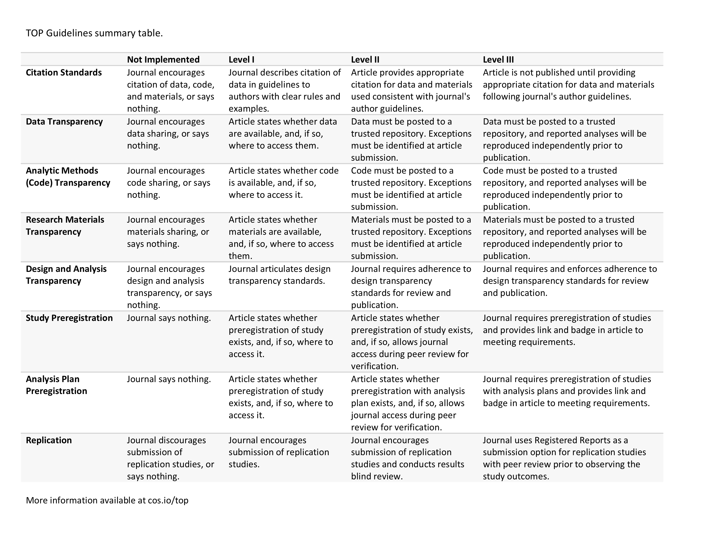
```

Over 1,000 journals or organizations have implemented one or more TOP-compliant policy as of August 2018 (e.g. *Ecology Letters*, *The Royal Society*, *Science*). The full list of journals implementing TOP guidelines is available at this url: https://osf.io/2sk9f/

### Promoting linkage of publication, data, code and analyses into a unified environment

The material presented in chapter 1 focusing on R Markdown (as implemented in RStudio) is a response to the need to provide a unified environment linking publication, code and data.

The Center for Open Science also proposes a platform called "Open Science Framework" or OSF to achieve the same goal (Figure \@ref(fig:OSF)). [OSF](https://cos.io/our-products/osf/) is a free and open source project management repository that supports researchers across their entire project life-cycle. As a collaboration tool, OSF helps researchers work on projects privately with a limited number of collaborators and make parts of their projects public, or make all the project publicly accessible for broader dissemination with citable, discoverable DOIs. As a workflow system, OSF enables connections to the many products researchers already use to streamline their process and increase efficiency.

With OSF's workflow and storage integrations, researchers can really manage their entire projects from one place. The OSF workflow connects the valuable research tools researchers are already using, so that they can effectively share the story of their research projects and eliminate data silos and information gaps (Figure \@ref(fig:OSF)). OSF ecosystem is designed to allow all those tools to work together the way researchers' do, removing barriers to collaboration and knowledge (Figure \@ref(fig:OSF)).

```{r OSF, echo=FALSE, fig.cap="Overview of the OSF workflow and connections with other widely used software.", fig.show="asis", out.width = '80%', fig.align="center"}
knitr::include_graphics("Figures/new-lifecycle.original_OSF.png")
```

## Reproducibility

This section describes measures that can be implemented to support verification of research (including, for example, sharing data and methods).

### Promoting transparency and open science

**Science is a social enterprise: independent and collaborative groups work to accumulate knowledge as a public good.** The credibility of scientific claims is rooted in the evidence supporting them, which includes the methodology applied, the data acquired, the process of methodology implementation, and data analysis and outcome interpretation. Claims become credible by the community reviewing, criticizing, extending and reproducing the supporting evidence. However, without transparency, claims only achieve credibility based on trust in the confidence or authority of the originator. **Transparency is superior to trust.**

**Open science refers to the process of making the content and process of producing evidence and claims transparent and accessible to others.** Transparency is a scientific ideal, and adding ‘open’ should therefore be redundant. In reality, science often lacks openness: many published articles are not available to people without a personal or institutional subscription, and most data, materials and code supporting research outcomes are not made accessible, for example, in a public repository (however this is rapidly changing with several initiatives, e.g., [Dryad](https://datadryad.org) digital repository).

Very little of the research process (for example, study protocols, analysis workflows, peer review) is accessible because, historically, there have been few opportunities to make it accessible even if one wanted to do so. This has motivated calls for open access, open data and open workflows (including analysis pipelines), but there are substantial barriers to meeting these ideals, including vested financial interests (particularly in scholarly publishing) and few incentives for researchers to pursue open practices.

#### Promoting open science is good, but "open" costs fall onto researchers...

To promote open science, several open-access journals were recently created (e.g. [*BMC*](https://www.biomedcentral.com/p/the-bmc-series-journals), [*Frontiers*](https://www.frontiersin.org), [*PLoS*](https://www.plos.org)). These journals facilitate sharing of scientific research (and associated methods, data and code), but they are quite expensive (>$1500 on average). Waivers can be obtained for researchers based in certain countries or institutions can sponsor those initiatives and have a certain amount of papers per year published for "free". However, if you do not fall into one of these categories, it will be quite challenging to pay for these costs without support from a grant (NSF is making an effort to promote open-science). The EEB program might be able to support some of those costs, but it will vary on the yearly budget (and when you ask). This topic is further investigated in [Chapter 4](#chap4).      

## Evaluation

This section describes measures that can be implemented when evaluating research (including, for example, peer review).

### Diversifying peer review: pre- and post-publication reviews 

For most of the history of scientific publishing, two functions have been confounded — evaluation and dissemination. Journals have provided dissemination via sorting and delivering content to the research community, and gate-keeping via peer review to determine what is worth disseminating. However, with the advent of the internet, individual researchers are no longer dependent on publishers to bind, print and mail their research to subscribers. Dissemination is now easy and can be controlled by researchers themselves (see examples of preprint publishers below). 

With increasing ease of dissemination, the role of publishers as a gate-keeper is declining. Nevertheless, the other role of publishing — evaluation — remains a vital part of the research enterprise. Conventionally, a journal editor will select a limited number of reviewers to assess the suitability of a submission for a particular journal. However, more diverse evaluation processes are now emerging, allowing the collective wisdom of the scientific community to be harnessed. For example, some preprint services support public comments on manuscripts, a form of pre-publication review that can be used to improve the manuscript (see below). Other services, such as PubMed Commons and PubPeer, offer public platforms to comment on published works facilitating post-publication peer review. At the same time, some journals are trialing ‘results-free’ review, where editorial decisions to accept are based solely on review of the rationale and study methods alone (that is, results-blind; for instance, [*PLoS ONE*](https://journals.plos.org/plosone/) is applying this approach.).

Both pre- and post-publication peer review mechanisms dramatically accelerate and expand the evaluation process. By sharing preprints, researchers can obtain rapid feedback on their work from a diverse community, rather than waiting several months for a few reviews in the conventional, closed peer review process. Using post-publication services, reviewers can make positive and critical commentary on articles instantly, rather than relying on the laborious, uncertain and lengthy process of authoring a commentary and submitting it to the publishing journal for possible publication.

#### Preprint services to disseminate your research early and even get feedbacks

[**bioRxiv**](https://www.biorxiv.org) (pronounced "bio-archive") is a free online archive and distribution service for unpublished preprints in the life sciences. It is operated by Cold Spring Harbor Laboratory, a not-for-profit research and educational institution. By posting preprints on bioRxiv, authors are able to make their findings immediately available to the scientific community and receive feedback on draft manuscripts before they are submitted to journals.

Articles are not peer-reviewed, edited, or typeset before being posted online. However, all articles undergo a basic screening process for offensive and/or non-scientific content and for material that might pose a health or bio-security risk and are checked for plagiarism. No endorsement of an article’s methods, assumptions, conclusions, or scientific quality by Cold Spring Harbor Laboratory is implied by its appearance in bioRxiv. An article may be posted prior to, or concurrently with, submission to a journal but should not be posted if it has already been accepted for publication by a journal.

[**PeerJ Preprints**](https://peerj.com/preprints-search/) is a 'preprint server' for the Biological Sciences, Environmental Sciences, Medical Sciences, Health Sciences and Computer Sciences. A PeerJ Preprint is a draft of an article, abstract, or poster that has not yet been peer-reviewed for formal publication. Submit a draft, incomplete, or final version of your work for free.

Submissions to PeerJ Preprints are not formally peer-reviewed. Instead they are screened by PeerJ staff to ensure that they fit the subject area; do not contravene any of their policies; and that they can reasonably be considered a part of the academic literature. If a submission is found to be unsuitable in any of these respects then it will not be accepted for posting. Content which is considered to be non-scientific or pseudo-scientific will not pass the screening.

## Incentives

**Publication is the currency of academic science and increases the likelihood of employment, funding, promotion and tenure.** However, not all research is equally publishable. Positive, novel and clean results are more likely to be published than negative results, replications and results with loose ends; as a consequence, researchers are incentivized to produce the former, even at the cost of accuracy [see @Nosek2012]. These incentives ultimately increase the likelihood of false positives in the published literature. Shifting the incentives therefore offers an opportunity to increase the credibility and reproducibility of published results.

Funders, publishers, societies, institutions, editors, reviewers and authors all contribute to the cultural norms that create and sustain dysfunctional incentives. Changing the incentives is therefore a problem that requires a coordinated effort by all stakeholders to alter reward structures. There will always be incentives for innovative outcomes — those who discover new things will be rewarded more than those who do not. However, there can also be incentives for efficiency and effectiveness — those who conduct rigorous, transparent and reproducible research could be rewarded more than those who do not. There are promising examples of effective interventions for nudging incentives. For example, journals are adopting:

- Badges to acknowledge open practices.
- Registered Reports as a results-blind publishing model.
- TOP guidelines to promote openness and transparency.

Collectively, and at scale, such efforts can shift incentives such that what is good for the scientist is also good for science — rigorous, transparent and reproducible research practices producing credible results.

## Glossary {#gloss}

**HARKing:** HARKing (hypothesizing after the results are known ) is defined as presenting a *post hoc* hypothesis (i.e., one based on or informed by one's results) in one's research report as if it were, in fact, an *a priori* hypothesis.

**Outcome switching:** refers to the possibility of changing the outcomes of interest in the study depending on the observed results. A researcher may include ten variables that could be considered outcomes of the research, and — once the results are known — intentionally or unintentionally select the subset of outcomes that show statistically significant results as the outcomes of interest. The consequence is an increase in the likelihood that reported results are spurious by leveraging chance, while negative evidence gets ignored.

**P-hacking:** also known as “Data dredging” is the misuse of data analysis to find patterns in data that can be presented as statistically significant when in fact there is no real underlying effect. This is done by performing many statistical tests on the data and only paying attention to those that come back with significant results, instead of stating a single hypothesis about an underlying effect before the analysis and then conducting a single test for it.

**Publication bias:** also known as the file drawer problem, refers to the fact that many more studies are conducted than published. Studies that obtain positive and novel results are more likely to be published than studies that obtain negative results or report replications of prior results. The consequence is that the published literature indicates stronger evidence for findings than exists in reality. 

[^1]: What is a Hypothesis? A hypothesis is a tentative, testable answer to a scientific question. Once a scientist has a scientific question they perform a literature review to find out what is already known on the topic. Then this information is used to form a tentative answer to the scientific question. Keep in mind, that the hypothesis also has to be testable since the next step is to do an experiment to determine whether or not the hypothesis is right! A hypothesis leads to one or more predictions that can be tested by experimenting. Predictions often take the shape of "If ____then ____" statements, but do not have to. Predictions should include both an independent variable (the factor you change in an experiment) and a dependent variable (the factor you observe or measure in an experiment). A single hypothesis can lead to multiple predictions.
[^2]: GBIF — the Global Biodiversity Information Facility — is an international network and research infrastructure funded by the world’s governments and aimed at providing anyone, anywhere, open access to data about all types of life on Earth.
[^3]: Postdiction involves explanation after the fact.

# Chapter 4 {#chap4}

## Introduction

**Balancing Open Science to support reproducibility with values of your stakeholders could be a challenging task.** 

Nowadays, funding agencies and journals are moving forward to promote Open Science and we started discussing this approach in [Chapter 3](#chap3). For instance, the [White House](https://www.whitehouse.gov/ostp/news-updates/2022/08/25/ostp-issues-guidance-to-make-federally-funded-research-freely-available-without-delay/) is requiring immediate public access to all U.S.-funded research papers by 2025 without an embargo or cost. You can learn more about this initiative in this *Science* news article ([doi: 10.1126/science.ade6076](https://www.science.org/content/article/white-house-requires-immediate-public-access-all-u-s--funded-research-papers-2025)).

## Objectives

The overarching objective of this chapter is to **study the mechanisms implemented to promote Open Science while highlighting circumstances where other principles might have to be adopted to respect different views, opinions and/or data sovereignty**. 

Overall, content of this chapter aims at **providing solutions to tackles threats to the scientific process** (discussed in Chapters 2 and 3) **as well as information to manage the data life cycle and research dissemination**. 

## Learning outcomes

- Learn what Open Science is
- Learn what are the seven pillars of Open Science:
    + [FAIR Data](#FAIR)
    + [Research Integrity](#RI)
    + [Next Generation Metrics](#NGSMet) 
    + [Future of Scholarly Communication](#FSC) 
    + [Citizen Science](#CS)
    + [Education and Skills](#ES)
    + [Rewards and Initiatives](#EI)
- Introduce the Open Access mechanism to promote Open Science
- Provide an overview of the Creative Common licenses and their applications in scientific publications
- Introduce the CARE Principles and Data sovereignty concepts and how these apply to Indigenous Peoples

## Web resources and publications

This chapter is based on:

**Web resources**

- Albertsons library: https://www.boisestate.edu/library/
- Altmetric: https://www.altmetric.com/
- BSU Office of Research Compliance: https://www.boisestate.edu/research-compliance/
- CARE Principles: https://www.gida-global.org/care
- Creative Common: https://creativecommons.org/
- DORA Declaration: https://sfdora.org/
- FAIR Principles: https://www.go-fair.org/fair-principles/
- LERU Roadmap for Open Science: https://www.leru.org/publications/open-science-and-its-role-in-universities-a-roadmap-for-cultural-change#
- United Nations Declaration on the Rights of Indigenous Peoples: https://www.un.org/development/desa/indigenouspeoples/declaration-on-the-rights-of-indigenous-peoples.html
- White House requires immediate public access to all U.S.-funded research papers by 2025: https://www.whitehouse.gov/ostp/news-updates/2022/08/25/ostp-issues-guidance-to-make-federally-funded-research-freely-available-without-delay/
 
**Publications**

- `r capture.output(print(refs["Carroll2021"]))`
- `r capture.output(print(refs["Groom2017"]))`
- `r capture.output(print(refs["Khoo_2019"]))`
- `r capture.output(print(refs["Wagenknecht2021"]))`
- `r capture.output(print(refs["Wilkinson2016"]))`

## What is Open Science?

The Organisation for Economic Co-operation and Development ([OECD](https://www.oecd.org/about/)) defines [Open Science](https://www.oecd.org/sti/inno/open-science.htm) as follows:

“*to make the primary outputs of publicly funded research results – publications and the research data – publicly accessible in digital format with no or minimal restriction*”. 

Several other agencies argue that the definition of Open Science should be expanded. For them, [Open Science](https://www.fosteropenscience.eu/content/what-open-science-introduction) is about *extending the principles of openness to the whole research cycle, fostering sharing and collaboration as early as possible thus entailing a systemic change to the way science and research is done*.

## What are the pillars of Open Science?

The 7 pillars of Open Science are: 

- [FAIR Data](#FAIR)
- [Research Integrity](#RI)
- [Next Generation Metrics](#NGSMet) 
- [Future of Scholarly Communication](#FSC) 
- [Citizen Science](#CS)
- [Education and Skills](#ES)
- [Rewards and Initiatives](#EI)

### FAIR Data {#FAIR}

The FAIR Principles [@Wilkinson2016] steward researchers in making outputs of research that are (Figure \@ref(fig:FAIR)):

- **F**indable: making research outputs **discoverable** by the wider academic community and the public.
- **A**ccessible: using **unique identifiers**, metadata and a clear use of language and access protocols.
- **I**nteroperable: applying **standards to encode and exchange** data and metadata. Interoperability is the ability of different systems, devices, applications or products to connect and communicate in a coordinated way, without effort from the end user.
- **R**eusable: enabling the **re-purposing** of research outputs to maximize their research potential.

When combined, these four elements are designed to help:

- Lower barriers to research outputs 
- Facilitate potential secondary researchers finding, understanding, reusing and re-purposing data to realize additional research opportunities
- Maximize existing resources

```{r FAIR, echo=FALSE, fig.cap="The FAIR Principles (source: SangyaPundir, CC BY-SA 4.0).", fig.show="asis", out.width = '90%', fig.align="center"}
knitr::include_graphics("Figures/FAIR_data_principles.jpeg")
```

#### The FAIR Guiding Principles

@Wilkinson2016 have provided the following guidelines that have to be applied to support the FAIR Principles:

1. **To be Findable:**
    - F1. (meta)data are assigned a globally unique and persistent identifier
    - F2. data are described with rich metadata (defined by R1 below)
    - F3. metadata clearly and explicitly include the identifier of the data it describes
    - F4. (meta)data are registered or indexed in a searchable resource

2. **To be Accessible:**
    - A1. (meta)data are retrievable by their identifier using a standardized communications protocol
      - A1.1 the protocol is open, free, and universally implementable
      - A1.2 the protocol allows for an authentication and authorization procedure, where necessary
      - A2. metadata are accessible, even when the data are no longer available

3. **To be Interoperable:**
    - I1. (meta)data use a formal, accessible, shared, and broadly applicable language for knowledge representation
    - I2. (meta)data use vocabularies that follow FAIR principles
    - I3. (meta)data include qualified references to other (meta)data

4. **To be Reusable:**
    - R1. meta(data) are richly described with a plurality of accurate and relevant attributes
      - R1.1. (meta)data are released with a clear and accessible data usage license
      - R1.2. (meta)data are associated with detailed provenance
      - R1.3. (meta)data meet domain-relevant community standards

### Research Integrity {#RI}

This is the practice of researchers acting honestly, reliably, respectfully and are accountable for their actions. 

At BSU, the [Office of Research Compliance](https://www.boisestate.edu/research-compliance/) is providing some information and guidance associated with research integrity.  

### Next Generation Metrics {#NGSMet}

The next-generation metrics pillar of Open Science seeks to catalyze a shift in cultural thinking around the way in which [bibliometrics](https://en.wikipedia.org/wiki/Bibliometrics) are utilized in research, particularly when evaluating quality, and go beyond simply citation counts and journal impact (Figure \@ref(fig:NGSMetrics)). Appropriate metrics, drawn from different sources and describing different things, can help us **gain a broader understanding of the significance and impact of research**.

```{r NGSMetrics, echo=FALSE, fig.cap="Example of new metrics associated to publications to assess impact of research beyond the impact factor.", fig.show="asis", out.width = '60%', fig.align="center"}
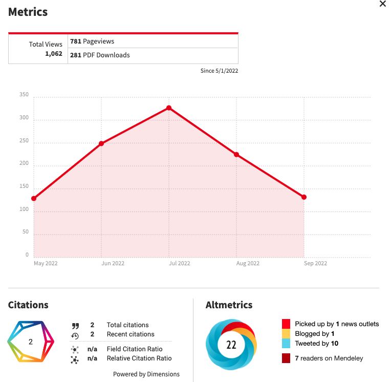
```

##### The San Francisco Declaration of Research Assessment - DORA

As an example showing changes in how research is perceived, more institutions and funders are supporting the [San Francisco Declaration of Research Assessment - DORA](https://sfdora.org/) and openly reject the use of quantitative metrics commonly associated with journal impact factors as a measure of research quality. Among many others, Springer Nature has joined DORA and [here](https://www.springernature.com/gp/researchers/dora) are their commitments.

##### Altmetric

Another example is the [Altmetric](https://www.altmetric.com/), which tracks and demonstrates the **reach and influence of your work to key stakeholders** by mainly focusing on social media (Figure \@ref(fig:NGSMetrics)).

### Future of Scholarly Communication {#FSC}

The future of scholarly communication is one of the most prominent pillars of Open Scholarship given its intention to **shift the current academic publishing model towards fully Open Access**. We will be developing more this topic below in our section on open access and associated licenses.

### Citizen Science {#CS}

Movement towards **members of the public having a greater role within research** and recognizing the invaluable role they play in providing insights a researcher may not typically have. Examples of such initiatives are e.g. [eBird](https://ebird.org/home) or [iNaturalist](https://www.inaturalist.org/).

Harnessing the advantages of the internet, openly available software packages and local knowledge, citizen science brings about a change in the way research is conducted – no longer limited to academic researchers, it encourages collaboration from groups across society.

@Wagenknecht2021 discuss this topic and its implementation in the case of a European Citizen Science project and @Groom2017 are reflecting on the role of Citizen Science in biodiversity research. Overall, citizen science could really propel your research forward, but you have to be aware of the potential pitfalls. Please see this [section in Chapter 3](#biodiv) where this topic was discussed.

### Education and Skills {#ES}

This pillar focuses on **identifying which are the training needs of researchers and sufficiently addressing any gaps in knowledge and skills around engaging with Open Science** such as making publications openly accessible, managing research data in-line with the FAIR Principles (Figure \@ref(fig:FAIR)) and acting with integrity. 

All researchers at all levels should have access to education and skills programmes to support their work and continued learning. Further, skill development programmes should be opened up to other stakeholders in research such as professional staff including librarians and data managers and members of the public to facilitate the undertaking of citizen science. At BSU, the [Alberstons library](https://www.boisestate.edu/library/) has resources on this topic and also runs workshops and seminars.  

### Rewards and Initiatives {#EI}

**Fostering engagement with the principle of Open Science requires reward and recognition of the efforts to do so** – this pillar addresses barriers and champions best practice.

A perceived lack of reward and recognition for work undertaken to manage research data and make publications openly accessible discourages researchers from engaging with the principle of Open Science. Work falling under this pillar seeks to address these challenges and champion engagement with Open Science practices. Please see [Chapter 3](#chap3) for more details on some of these initiatives and rewards to promote Open Science. 

## Open Access: A tool to promote Open Science?

Open access (OA) is a set of principles and a range of practices through which research outputs are distributed online, free of access charges or other barriers (Figure \@ref(fig:EcolEvolCC)). Although publications are free of charges to the users, researchers will have to pay publication fees (usually between \$1500 and \$2500) to publish their research as OA. With open access strictly defined (according to the 2001 definition), barriers to copying or reuse are also reduced or removed by applying an open license for copyright. An open license is a license which allows others to reuse another creator’s work as they wish. Without a special license, these uses are normally prohibited by copyright, patent or commercial license. Most free licenses are worldwide, royalty-free, non-exclusive, and perpetual.

### The Open Access conundrum 

Since the revenue of most open access journals is earned from publication fees charged to the authors, **OA publishers are motivated to increase their profits by accepting low-quality papers and by not performing thorough peer review.** On the other hand, the prices for OA publications in the most prestigious journals have exceeded \$5000, making such publishing model unaffordable to a large number of researchers. 

The increase in publishing cost has been called the "Open-Access Sequel to [the] Serials Crisis" [@Khoo_2019]. To provide further context, the serial crisis involves unsustainable budgetary pressures on libraries due to hyperinflation of subscription costs. In this framework, OA was proposed as one way of coping with these costs because articles would not require ongoing subscriptions to remain accessible, but findings by @Khoo_2019 might suggest that both systems have limitations. 

## Creative Common licences

Most open access journals will be using ([Creative Common](https://creativecommons.org/); CC) licenses and it is important that you and your co-authors are aware of their implications prior to submitting your manuscript, especially in regard to potential commercial usage of your work by third parties (Figure \@ref(fig:EcolEvolCC)). A CC license is one of several **public copyright licenses that enable the free distribution of an otherwise copyrighted "work".** 

A CC license is used when an author wants to give other people the **right to share, use, and build upon a work that the author has created**. CC provides an author flexibility (e.g., they might choose to allow only non-commercial uses of a given work) and protects the people who use or redistribute an author's work from concerns of copyright infringement as long as they abide by the conditions that are specified in the license by which the author distributes the work. To support this fexibility, the CC initiative is providing an [online tool](https://creativecommons.org/choose/) to choose the best license to share your work, which I would advise you to consult to identify what license best suits your work. To know more about CC licenses, please visit this [wikipedia page](https://en.wikipedia.org/wiki/Creative_Commons_license).

```{r EcolEvolCC, echo=FALSE, fig.cap="Front page of Ecology and Evolution, an open access journal publishing articles under the Creative Common licensing system.", fig.show="asis", out.width = '80%', fig.align="center"}
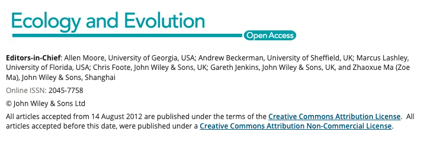
```

### Available CC licenses

The available licenses provided by the CC initiative are shown in Figure \@ref(fig:CC).

```{r CC, echo=FALSE, fig.cap="Overview of Creative Common licenses sorted from most open to most restrictive (provided by Andrew Child).", fig.show="asis", out.width = '100%', fig.align="center"}
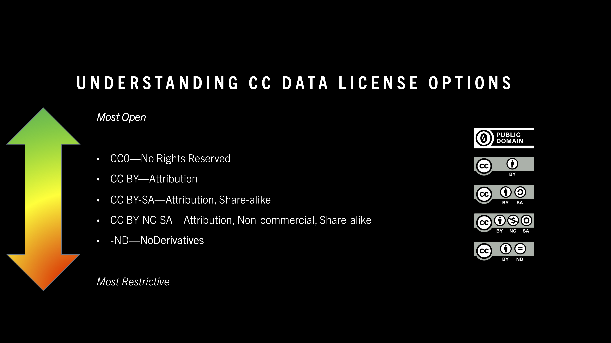
```

The description of these licenses are always presented in this format:

1. **You are free to:**
    - Share - Conditions.
    - Adapt - Conditions.
2. **Under the following terms:**
    - Attribution - Conditions.
    - No additional restrictions - Conditions.
    
Here is the list of some of the mostly used CC licenses with URLs leading to their descriptions:

- [Attribution 4.0 International (CC BY 4.0)](https://creativecommons.org/licenses/by/4.0/)
- [Attribution-ShareAlike 4.0 International (CC BY-SA 4.0)](https://creativecommons.org/licenses/by-sa/4.0/)
- [Attribution-NoDerivatives 4.0 International (CC BY-ND 4.0)](https://creativecommons.org/licenses/by-nd/4.0/)
- [Attribution-NonCommercial-NoDerivatives 4.0 International (CC BY-NC-ND 4.0)](https://creativecommons.org/licenses/by-nc-nd/4.0/)

## CARE Principles

We have been promoting Open Science, but is this approach always possible?

As pointed out by @Carroll2021, **as big data, open data, and open science advance to increase access to complex and large datasets for innovation, discovery, and decision-making, Indigenous Peoples’ rights to control and access their data within these data environments remain limited.** Operationalizing the FAIR Principles for scientific data with the CARE Principles for Indigenous Data Governance enhances machine actionability and brings people and purpose to the fore to resolve Indigenous Peoples’ rights to and interests in their data across the data lifecycle (Figure \@ref(fig:CARE)).

```{r CARE, echo=FALSE, fig.cap="Be FAIR and CARE (source: https://www.gida-global.org/care).", fig.show="asis", out.width = '100%', fig.align="center"}
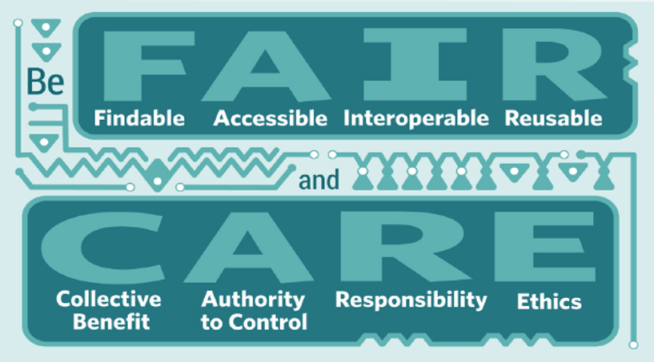
```

**The CARE Principles detail that the use of Indigenous data should result in tangible benefits for Indigenous collectives through inclusive development and innovation, improved governance and citizen engagement, and result in equitable outcomes.** 

**Collective benefit** is more likely to be realized when data ecosystems are designed to support Indigenous nations and when the use/reuse of data for resource allocation is consistent with community values. The [United Nations Declaration on the Rights of Indigenous Peoples](https://www.un.org/development/desa/indigenouspeoples/declaration-on-the-rights-of-indigenous-peoples.html) asserts Indigenous Peoples’ rights and interests in data and their **authority to control** their data. Access to ‘data for governance’ is vital to support self-determination and Indigenous nations should be actively involved in ‘governance of data’ to ensure ethical reuse of data. Given the majority of Indigenous data is controlled by non-Indigenous institutions there is a **responsibility** to engage respectfully with those communities to ensure the use of Indigenous data supports capacity development, increasing community data capabilities, and the strengthening of Indigenous languages and cultures. Similarly, Indigenous Peoples’ **ethics** should inform the use of data across time in order to minimize harm, maximize benefits, promote justice, and allow for future use [see @Carroll2021 for more details].

## Data sovereignty

The CARE Principles (Figure \@ref(fig:CARE)) are directly connected to the concept of data sovereignty. We will provide a definition here and it is especially important to cover such material in this course since data sovereignty could impact your data sharing protocols. More on this topic will be discussed in [Chapter 5](#partDM).

**Data sovereignty is the idea that data are subject to the laws and governance structures of the nation where they are collected.** The concept of data sovereignty is closely linked with data security, cloud computing, network sovereignty and technological sovereignty. Unlike technological sovereignty, which is vaguely defined and can be used as an umbrella term in policymaking, data sovereignty is specifically concerned with questions surrounding the data itself. Data sovereignty as the idea that data is subject to the laws and governance structures within one nation is usually discussed in two ways: in relation to Indigenous groups and Indigenous autonomy from post-colonial states or in relation to transnational data flow. With the rise of cloud computing, many countries have passed various laws around control and storage of data, which all reflects measures of data sovereignty. More than 100 countries have some sort of data sovereignty laws in place. With self-sovereign identity (SSI) the individual identity holders can fully create and control their credentials, although a nation can still issue a digital identity in that paradigm.

# Chapter 5 {#Chap5}

## Introduction

This chapter is subdivided into two parts as follows:

- [**PART A:**](#partDM) Data management.
- [**PART B:**](#repcode) Reproducible code.

## Data management {#partDM}

### Introduction

Good data management is fundamental to research excellence. It produces high-quality research data that are accessible to others and usable in the future (see [TOP guidelines](#TOP) in chapter 3). The value of data is now explicitly acknowledged through citations (e.g. GBIF and Dryad repositories provide [DOIs](https://www.doi.org/) to cite datasets) so researchers can make a difference to their own careers, as well as to their fields of research, by sharing and making data available for reuse. These citations have to be directly included in publications in devoted sections usually entitled "Data Availability Statement" located at the end of the article (see Figure \@ref(fig:DataAvail) for an example).

```{r DataAvail, echo=FALSE, fig.cap="Example of a Data Availability Statement.", fig.show="asis", out.width = '50%', fig.align="center"}
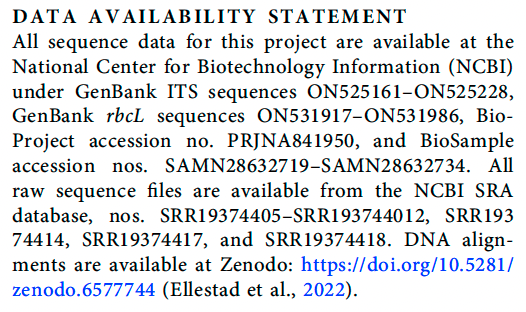
```

This chapter aims at helping students navigate data management firstly by explaining what data and data management are and why data sharing is important, and secondly by providing advice and examples of best practice in data management.

### Learning outcomes

- Learn what are the different types of research data and their specificity.
- Provide an overview of the data life-cycle.
- Highlight the benefits of good data management.
- Study best-practices to planning data management.

### Literature and web resources

This chapter is based on:

- @DataMan -- A Guide to Data Management in Ecology and Evolution published by the [British Ecological Society](https://www.britishecologicalsociety.org).
- UK Managing and Sharing Research Data handbook: https://data-archive.ac.uk/media/2894/managingsharing.pdf
- The companion website presenting material for UK Managing and Sharing Research Data handbook: https://www.ukdataservice.ac.uk/manage-data/handbook/
- Digital Object Identifier (DOI): https://www.doi.org/index.html
- [ASCII](https://www.asciitable.com/) or American Standard Code for Information Interchange used by computers to ensure data are readable by a maximum number of software programs 
- Dryad Data Repository: https://datadryad.org/stash
- Zenodo Data Repository: https://zenodo.org/

### Teaching material

The presentation slides for Chapter 5 - part A can be downloaded [here](Chapters_files/Chapter_5_PartA.pdf).

### What are research data?

**Research data are the factual pieces of information used to test research hypotheses.** Data can be classified into five categories:

- **Observational:** Data which are tied to time and place and are irreplaceable (e.g. field observations, weather station readings, satellite data).
- **Experimental:** Data generated in a controlled or partially controlled environment, which can be reproduced, although it may be expensive to do so (e.g. field plots or greenhouse experiments, chemical analyses).
- **Simulation:** Data generated from models (e.g. climate or population modelling).
- **Derived:** Data which are not collected directly but inferred from (an)other data file(s) (e.g. a population biomass which has been calculated from population density and average body size data).
- **Metadata:** Data about data (more about this category later).

A key challenge facing researchers today is the need to work with different data sources. It is not uncommon for projects to integrate any combination of data types into a single analysis, even drawing on data from disciplines outside Ecology and Evolution. As research becomes increasingly collaborative and interdisciplinary, issues surrounding data management are growing in prevalence.

### The data life cycle

Data have a longer lifespan than the project they were created for, as illustrated by the data life-cycle displayed in Figure \@ref(fig:LifeCycle).

```{r LifeCycle, echo=FALSE, fig.align="center", fig.cap="The data lifecycle", out.width = '60%'}
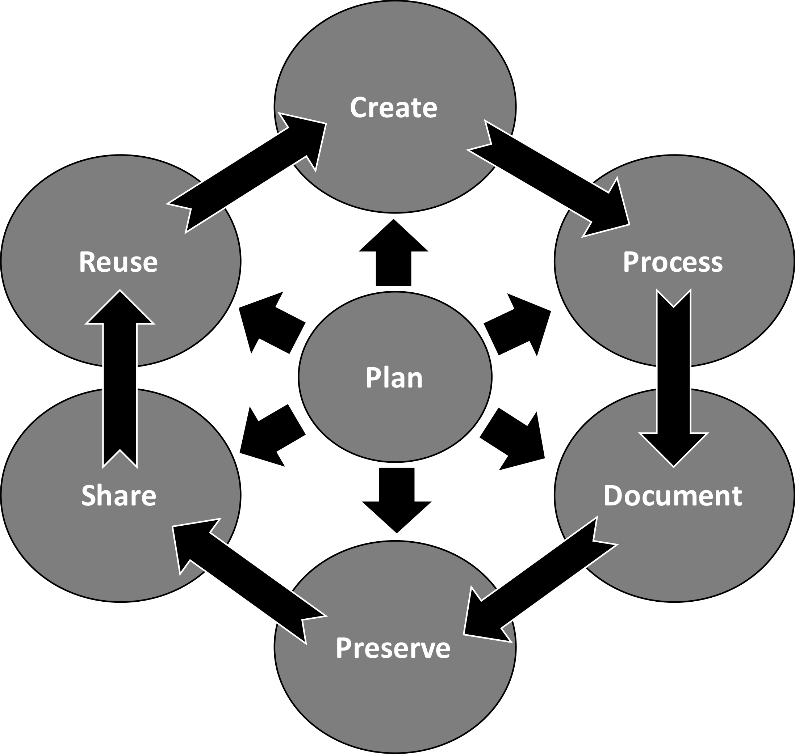
```

Some projects may only focus on certain parts of the data life-cycle, such as primary data creation, or reusing others’ data. Other projects may go through several revolutions of the cycle. Either way, most researchers will work with data at all stages throughout their career.

### Why should I manage data?

Data management concerns how you plan for all stages of the data life-cycle and implement this plan throughout the research project. Done effectively it will ensure that the data life-cycle is kept in motion. It will also keep the research process efficient and ensure that your data meet all the expectations set by you, funders, research institutions, legislation and publishers (e.g. copyright, data protection).

In order to bring some perspective on this topic, ask yourself this question:

> *Would a colleague be able to take over my project tomorrow if I disappeared, or make sense of the data without talking to me?* 

If you can answer **YES**, then you are managing your data well!

#### The benefits of good data management include:

- Ensuring data are accurate, complete, authentic and reliable.
- Increasing research efficiency.
- Saving time and money in the long run -- ‘undoing’ mistakes is frustrating.
- Meeting funder requirements.
- Minimizing the risk of data loss.
- Preventing duplication by others.
- Facilitating data sharing.

### Why should I share my data?

It is increasingly common for funders and publishers to mandate data sharing wherever possible. In addition, some funding bodies require data managing and sharing plans as part of grant applications (e.g. NSF). Sharing data can be daunting, but data are valuable resources and their usefulness could extend beyond the original purpose for which they were created. Benefits of sharing data include:

- Increasing the impact and visibility of research.
- Encouraging collaborations and partnerships with other researchers.
- Maximizing transparency and accountability.
- Encouraging the improvement and validation of research methods.
- Reducing costs of duplicating data collection.
- Advancing science by letting others use data in innovative ways.

#### There are circumstances where data can't be shared!

- If the datasets contain sensitive information about endangered or threatened species.
- If the data contain personal information – sharing them may be a breach of protocol (and even break the law).
- If parts of the data are owned by others – you may not have the rights to share them.

During the planning stages of your project determine which of your data can't and shouldn't be shared. Journal data archiving policies recognize these reasons for not sharing.

### Planning data management

Regardless of whether your funder requires you to have a data management or sharing plan as part of a grant application, having such a plan in place before you begin your research project will mean that you are prepared for any data management issues that may come your way (see the Data management checklist section below).

#### Before you start planning

Here are few things that you should consider before planning your data management workflow:

- Check funder specifications for data management plans.
- Consult with your institution (especially regarding resources and policies).
- Consider your budget.
- Talk to your supervisor, colleagues and collaborators.

#### What are the key things to consider when planning?

- **Time:** Writing a data management plan may well take a significant amount of time. It is not as simple as filling out a template or working through a checklist of things to include. Planning for data management should be thorough before the research project starts to ensure that data management is embedded throughout the research process.
- **Design according to your needs:** Data management should be planned and implemented with the purpose of the research project in mind.
- **Roles and responsibilities:** Creating a data management plan may be the responsibility of one single person, but data management implementation may involve various people at different stages. One of the major uses of a data management plan is to enable coordinated working and communication among researchers on a project.
- **Review:** Plan how data management will be reviewed throughout the project and adapted if necessary; this will help to integrate data management into the research process and ensure that the best data management practices are being implemented. Reviewing will also help to catch any issues early on, before they turn into bigger problems.

### Creating data

In the data life-cycle (Figure \@ref(fig:LifeCycle)), creating datasets occurs as a researcher collects data in the field or lab, and digitizes them to end up with a raw dataset. 

```
# Workflow associated with creating data

Collect data (in the field and/or lab) --> Digitize data --> Raw dataset

!! Perform quality checks @ each step to validate data !!
```

**Quality control during data collection is important** because often there is only one opportunity to collect data from a given situation. Researchers should be critical of methods before collection begins – high-quality methods will result in high-quality data. Likewise, when collection is under way, detailed documentation of the collection process should be kept as evidence of quality.

#### Key things to consider during data collection

- Logistical issues in the field (what are the challenges associated with your fieldwork (e.g. no power to re-charge your batteries?).
- Calibration of instruments (is the balance that I plan using accurate enough to weigh my samples?).
- Taking multiple measurements/observations/samples (to e.g. ensure statistical accuracy or cover genetic variation within population).
- Creating a template (and associated protocols) for use during data collection to ensure that all information is collected consistently, especially if there are multiple collectors.
- Describing any conditions during data collection that might affect the quality of the data (e.g. impact of weather conditions, tropical storm, on wildlife observations).
- Creating an accompanying questionnaire for multiple collectors, asking them any questions which may affect the quality of the data (this could account for slight differences observed during analytical phase of project. In other words, account for the effect of data collecting on analyses).
- Widening the possible applications of data, and therefore increasing their impact, by adding variables and parameters to data. For instance, wider landscape variables, which will encourage reuse and potentially open up new avenues for research.

### Data digitization

Data may be collected directly in a digital form using devices that feed results straight into a computer/tablet or they may be collected as hand-written notes. Either way, there will be some level of processing involved to end up with a digital raw dataset.

Key things to consider during data digitization include:

- Designing a database structure to organize data and data files (i.e. making sure that observations have unique IDs).
- Using a consistent format for each data file – e.g. one row represents a complete record and the columns represent all the parameters that make up that record (this is known as spreadsheet format).
- Atomizing data – make sure that only one piece of data is in each entry (this greatly helps analyses).
- Using plain text characters (e.g. [ASCII](https://www.asciitable.com/), which stands for American Standard Code for Information Interchange used for computers) to ensure data are readable by a maximum number of software programs.
- Using code – coding assigns a numerical value to variables and allows for statistical analysis of data. Keep coding simple.
- Describing the contents of your data files in a `Readme.txt` file or even better in protocol files (later attached as appendixes of your manuscript), or other metadata standard, including a definition of each parameter, the units used and codes for missing values.
- Keeping raw data raw.

### Processing data

**Data should be processed into a format that is suited to subsequent analyses and ensures long-term usability.** Data are at risk of being lost if the hardware and software originally used to create and process them are rendered obsolete. Therefore, data should be well organized, structured, named and versioned in standard formats that can be interpreted in the future (see the Data structure and organisation of files section below).

Here are some guidelines to ensure best processing of data (Figure \@ref(fig:LifeCycle)):

- **File formats:** Data should be written in *non-proprietary formats*, also known as open standard formats. These files can be used and implemented by anyone, as opposed to proprietary formats which can only be used by those with the correct software installed. The most common format used for spreadsheet data are comma-separated values files (`.csv`). Other non-proprietary formats include: plain text files (`.txt`) for text; and `GIF`, `JPEG` and `PNG` for images.
- **File names and folders:** To keep track of data and know how to find them, digital files and folders should be structured and well organized. Use a folder hierarchy that fits the structure of the project and ensure that it is used consistently. Drawing a folder map which details where specific data are saved may be particularly useful if others will be accessing folders, or if there is simply a lot to navigate (store this information in the `Readme.txt` file).
- **File names should be:**
    - unique, 
    - descriptive, 
    - succinct, 
    - naturally ordered and consistent, 
    - describing the project, file contents, location, date, researcher’s initials and version. 
- **File names should not** include spaces – these can cause problems with scripting and metadata.
- **Quality assurance:** Checking that data have been edited, cleaned, verified and validated to create a reliable masterfile which will become the basis for further analyses (tyding up data so that they are ready for analyses). Use a scripting language, such as R, to process your data for quality checking so that all steps are documented.  
**Assurance checks may include:**
    - Identifying estimated values, missing values or double entries.
    - Performing statistical analyses to check for questionable or impossible values and outliers (which may just be typos from data entry).
    - Checking the format of the data for consistency across the dataset.
    - Checking the data against similar data to identify potential problems.
- **Version control:** Once the masterfile has been finalized, keeping track of ensuing versions of this file can be challenging, especially if working with collaborators in different locations. A version control strategy will help locate required versions, and clarify how versions differ from one another.  
**Version control best practice includes:**
    - Deciding how many and which versions to keep.
    - Using a systematic file naming convention, using filenames that include the version number and status of the file (e.g. v1_draft, v2_internal, v3_final).
    - Record what changes took place to create the version in a separate file (e.g. a version table).
    - Mapping versions if they are stored in different locations.
    - Synchronizing versions across different locations.
    - Ensuring any cross-referenced information between files is also subject to version control.

### Data structure and organisation of files

Inferring the directory tree structure of your project provides a simple and efficient way to summarize the data structure and organization of files related to your project (see above). In UNIX, this can be easily achieved by using the *tree* package as shown in Figure \@ref(fig:TreeDir).

```{r TreeDir, echo=FALSE, fig.align="center", fig.cap="Infer directory tree structure using the UNIX tree package.", out.width = '60%'}
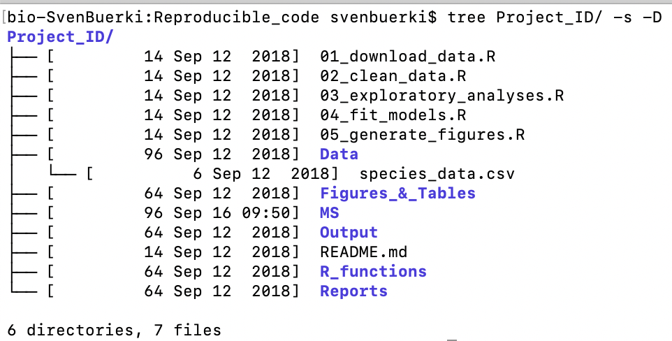
```

#### The UNIX *tree* package: A way to support data structure & organisation

The UNIX *tree* package was used here to infer the directory structure of the folder `Project_ID/` and several arguments were set to obtain data on files that could be used to check for file names and location as well as version control:

- `-s`: Print the size of each file in bytes along with the name.
- `-D`: Print the date of the last modification time or if `-c`  is  used, the last status change time for the file listed.


To install the *tree* package on your Mac, do the following:

```{r eval = FALSE, echo = TRUE}
#Install tree by typing the following code in a terminal
brew install tree
```

### Documenting data

Producing good documentation and metadata ensures that data can be understood and used in the long term (Figure \@ref(fig:LifeCycle)). Documentation (i.e. the manual associated with your data) describes the data, explains any manipulations and provides contextual information – no room should be left for others to misinterpret the data.

All documentation requirements should be identified at the planning stages so you are prepared for it during all stages of the data life-cycle, particularly during data creation and processing. This will avoid having to perform a rescue mission in situations where you have forgotten what has happened or when a collaborator has left without leaving any key documentation behind.

Data documentation includes information at project and data levels and should cover the following information.

#### Project level

- The project aim, objectives and hypotheses.
- Personnel involved throughout the project, including who to contact with questions.
- Details of sponsors.
- Data collection methods, including details of instrumentation and environmental conditions during collection, copies of collection instructions if applicable.
- Standards used.
- Data structure and organisation of files (see Figure \@ref(fig:TreeDir)).
- Software used to prepare and read the data.
- Procedures used for data processing, including quality control and versioning and the dates these were carried out.
- Known problems that may limit data use.
- Instructions on how to cite the data.
- Intellectual property rights and other licensing considerations.

#### Data level

- Names, labels and descriptions for variables.
- Detailed explanation of codes used.
- Definitions of acronyms or specialist terminology.
- Reasons for missing values.
- Derived data created from the raw file, including the code or algorithm used to create them. 

If a software package such as R is used for processing data, much of the data level documentation will be created and embedded during analysis.

**Metadata** help others discover data through searching and browsing online and enable machine-to-machine interoperability of data, which is necessary for data reuse. Metadata are created by using either a data center’s deposit form, a metadata editor, or a metadata creator tool, which can be searched for online. Metadata follow a standard structure and come in three forms:

- Descriptive – fields such as title, author, abstract and keywords.
- Administrative – rights and permissions and data on formatting.
- Structural – explanations of e.g. tables within the data.

### Preserving data

To protect data from loss and to make sure data are securely stored, good data management should include a strategy for backing up and storing data effectively (see where this step fits in Figure \@ref(fig:LifeCycle)). It is recommended to keep three versions of your data: the original, external/local and external/remote. Talk with your thesis supervisor to isolate best procedure to ensure preservation of your data.

#### Data backup 

When designing a backup strategy, thought should be given to the possible means by which data loss could occur. These include:

- Hardware failure.
- Software faults.
- Virus infection or hacking.
- Power failure.
- Human error.
- Hardware theft or misplacement (especially common during fieldwork).
- Hardware damage (e.g. fire, flood. Again common in the field).
- Backups – good backups being overwritten with backups from corrupt data (this happen more often that you would imagine).

An ideal backup strategy should provide protection against all the risks, but it can be sensible to consider which are the most likely to occur in any particular context and be aware of these when designing your backup strategy.

##### Things to consider to establish a backup plan

- Which files require backup.
- Who is responsible for backups.
- The frequency of backup needed, this will be affected by how regularly files are updated.
- Whether full or incremental backups are needed – consider running a mix of frequent incremental backups (capturing recent data changes) along with periodic full backups (capturing a ‘snapshot’ of the state of all files).
- Backup procedures for each location where data are held, e.g. tablets, home-based computers or remote drives.
- How to organize and label backup files.

### Data storage

**Data storage, whether of the original or backed up data, needs to be robust.** This is true whether the data are stored on paper or electronically, but electronic storage raises particular issues. 

#### Guidelines to ensure best practice for electronic storage of data

- Use high-quality storage systems (e.g. media, devices).
- Use non-proprietary formats for long-term software readability.
- Migrate data files every two to five years to new storage – storage media such as CDs, DVDs and hard drives can degrade over time or become outdated (e.g. floppy disks).
- Check stored data regularly to make sure nothing has been lost.
- Use different forms of storage for the same data, this also acts as a method of backup, e.g. using remote storage, external hard drives and a network drive.
- Label and organize stored files logically to make them easy to locate and access.
- Think about encryption: sensitive data may be regarded as protected while on a password-protected computer, but when backed up onto a portable hard drive they may become accessible to anyone – backups may need to be encrypted or secured too.

##### Storage and backing-up of data

Data can be stored and backed up on:

- **Network drives** which are managed by IT staff and are regularly backed up. They ensure secure storage and prohibit unauthorized access to files.
- **Personal devices** such as laptops and tablets are convenient for short-term, temporary storage but should not be used for storing master files. They are at high risk of being lost, stolen or damaged.
- **External devices** such as hard drives, USB sticks, CDs and DVDs are often convenient because of their cost and portability. However, they do not guarantee long-term preservation and can also be lost, stolen or damaged. High-quality external devices from reputable manufacturers should be used.
- **Remote or online services** such as Google Drive or Dropbox use cloud technology to allow users to synchronize files across different computers. They provide some storage space for free but any extra space or functions will have to be bought.
- **Paper!** If data files are not too big, do not overlook the idea of printing out a paper copy of important ones data files as a complement to electronic storage. It may not be convenient, but ink on paper has proven longevity and system independence (as long as you can remember where you put it)!

### Sharing data

Research data can be shared in many ways and each method of sharing will have advantages and disadvantages. Ways to share data include:

- Using a disciplinary data center such as Dryad or GenBank.
- Depositing data in your research funder’s data center.
- Depositing data in university repositories.
- Making data available online via open notebooks or project websites (e.g. Open Science Framework from the Center of Open Science).
- Using virtual research environments such as SharePoint and Sakai.

Institutions, funders and journals have specific policies associated with data sharing and you should read those prior to establishing a data sharing plan. Here we will discuss the advantages of archiving your data in data repositories. 

#### Data repositories

Archiving your data in a repository is a reliable method of sharing data. Data submitted to repositories will have to conform to submission guidelines, which may restrict which data you share via the repository. However, the advantages of sharing data through these centers include:

- Assurance for others that the data meet quality standards.
- Guaranteed long-term preservation.
- Data are secure and access can be controlled.
- Data are regularly backed up.
- Chances of others discovering the data are improved.
- Citation methods are specified.
- Secondary usage of the data is monitored.

### Reusing data

**All aspects of data management lead up to data discovery and reuse by others.** Intellectual property rights, licenses and permissions, which concern reuse of data, should be explained in the data documentation and/or metadata.

At this stage of the life-cycle it is important to **state your expectations for the reuse of your data**, e.g. terms of acknowledgment, citation and co-authorship. Likewise, it becomes the **responsibility of others to reuse data effectively**, credit the collectors of the original data, cite the original data and manage any subsequent research to the same effect. 

When requesting to use someone else’s data it is important to clearly state the purpose of the request, including the idea you will be addressing and your expectations for co-authorship or acknowledgment. Co-authorship is a complex issue and should be discussed with any collaborators at the outset of a project. 

**Increasing openness to data and ensuring long-term preservation of data fosters collaboration and transparency, furthering research that aims to answer the big questions in ecology and evolution.** By implementing good data management practices, researchers can ensure that high-quality data are preserved for the research community and will play a role in advancing science for future generations.

### Data management checklist

The data management checklist from the [UK Data Archive](https://www.ukdataservice.ac.uk/manage-data/plan/checklist) will help you design your own data management planning and data sharing. The text is available below:

#### Planning

- Who is responsible for which part of data management?
- Are new skills required for any activities?
- Do you need extra resources to manage data, such as people, time or hardware? 
- Have you accounted for costs associated with depositing data for longer-term preservation and access?

#### Documenting

- Will others be able to understand your data and use them properly?
- Are your structured data self-explanatory in terms of variable names, codes and abbreviations used?
- Which descriptions and contextual documentation explain what your data mean, how they were collected and the methods used to create them?
- How will you label and organize data, records and files?
- Will you be consistent in how data are cataloged?

#### Formatting

- Are you using standardized and consistent procedures to collect, process, transcribe, check, validate and verify data, such as standard protocols, templates or input forms?
- Which data formats will you use? Do formats and software enable sharing and long-term sustainability of data, such as non-proprietary software and software based on open standards?
- When converting data across formats, do you check that no data, annotation or internal metadata have been lost or changed?

#### Storing

- Are your digital and non-digital data, and any copies, held in multiple safe and secure locations?
- Do you need to securely store personal or sensitive data? If so, are they properly protected?
- If data are collected with mobile devices, how will you transfer and store the data?
- If data are held in multiple places, how will you keep track of versions?
- Are your files backed up sufficiently and regularly and are backups stored safely?
- Do you know which version of your data files is the master?
- Who has access to which data during and after research? Is there a need for access restrictions? How will these be managed after you are dead?
- How long will you store your data for and do you need to select which data to keep and which to destroy?
 
#### Confidentiality, ethics and consent

- Do your data contain confidential or sensitive information? If so, have you discussed data sharing with the respondents from whom you collected the data?
- Are you gaining written consent from respondents to share data beyond your research?
- Do you need to anonymise data, for example, to remove identifying information or personal data, during research or in preparation for sharing?

#### Copyright

- Have you established who owns the copyright in your data? Might there be joint copyright?
- Have you considered which kind of license is appropriate for sharing your data and what, if any, restrictions there might be on re-use?
- If you are purchasing or re-using someone else’s data sources have you considered how that data might be shareable, for example negotiating a new licence with the original supplier?
- Can you preserve for the long-term, personal information so that it can be used in the future?

#### Sharing

- Do you intend to make all your data available for sharing or how will you select which data to preserve and share?
- How and where will you preserve your research data for the longer-term?
- How will you make your data accessible to future users?

## Reproducible code {#repcode}

### Introduction

The following steps have to be fully integrated in order to produce a reproducible code:

- **Step 1:** Establish a reproducible project workflow.
- **Step 2:** Organize project for reproducibility.
- **Step 3:** Ensure basic programming standards.
- **Step 4:** Document and manage dependencies.
- **Step 5:** Produce a reproducible report (with R Markdown).
- **Step 6:** Implement a version control protocol (with Git).
- **Step 7:** Ensure archiving and citation of code.

In this chapter, we will cover steps 1 to 4. Steps 5 and 7 have been respectively studied in chapters [2](#chap2) and 5 ([Data management](#partDM)), whereas step 6 will be covered in the bioinformatic tutorial associated to chapter 12.

### Learning outcomes

- Learn protocol to organize projects for reproducibility.
- Discuss licenses for code and software.
- Learn basic programming standards to ensure transparency and broad understanding of the data workflow.
- Learn how to use R to infer data structure and files organization.
- Learn about code portability: Absolute vs. Relative paths.
- Review knowledge on documenting and managing software dependencies.

### Literature and web resources

This chapter is based on:

- @RepCode -- *A Guide to Reproducible Code in Ecology and Evolution* published by the [British Ecological Society](https://www.britishecologicalsociety.org).
- @wickham2014advanced -- *Advanced R* by Hadley Wickham (https://adv-r.hadley.nz)
- Hadley Wickham’s R Style Guides: http://adv-r.had.co.nz/Style.html
- Absolute vs relative paths: https://en.wikipedia.org/wiki/Path_(computing)#Absolute_and_relative_paths
- Comparison of free and open-source software licenses: https://en.wikipedia.org/wiki/Comparison_of_free_and_open-source_software_licenses
- [GNU Affero General Public License](https://www.gnu.org/licenses/agpl-3.0.en.html): This type of license is commonly used for code and software

### Teaching material

The presentation slides for Chapter 5 - part B can be downloaded [here](Chapters_files/Chapter_5_Reproducible_code.pdf).

### Data and dependencies

To conduct the exercises presented in this chapter, you will need to:

1. Download a [folder](#dataProjectID) from the shared Google Drive
2. Install [R packages](#RpkgRepCode)

More information on these items is provided below. 

#### Data {#dataProjectID}

The data (`Project_ID`) used for this chapter are deposited on our shared [Google Drive](https://drive.google.com/drive/folders/1ZNNfDcn6b1vLscjbg66aU5cWtx773lnw?usp=drive_link) at this address:

`Reproducible_Science > Exercises > Chapter_5 > Project_ID`

Please download this whole folder prior to starting the exercises.

#### R packages {#RpkgRepCode}

Here, we are using code developed in Chapter 1 to make sure the R dependencies (*data.tree*, *DiagrammeR*) are installed and loaded prior to pursuing the exercises.

```{r eval = TRUE, echo = TRUE}
##~~~
#1. List all required packages
##~~~
#Object (args) provided by user with names of packages stored into a vector
pkg <- c("data.tree", "DiagrammeR")

##~~~
#2. Check if pkg are installed
##~~~
print("Check if packages are installed")
#This line outputs a list of packages that are not installed
new.pkg <- pkg[!(pkg %in% installed.packages())]

##~~~
#3. Install missing packages
##~~~
if(length(new.pkg) > 0){
  print(paste("Install missing package(s):", new.pkg, sep=' '))
  install.packages(new.pkg, dependencies = TRUE)
}else{
  print("All packages are already installed!")
}

##~~~
#4. Load all packages
##~~~
print("Load packages and return status")
#Here we use the sapply() function to require all the packages
sapply(pkg, require, character.only = TRUE)
```

### Organize project for reproducibility

#### "Draw" a reproducible project workflow

Organizing your project for reproducibility starts by drawing a workflow serving as basis to guide your project implementation. An example of a reproducible project workflow is displayed in Figure \@ref(fig:ReproWorkflow). This workflow will be used as template for the material presented in this chapter.

```{r ReproWorkflow, echo=FALSE, fig.align="center", fig.cap="A simple reproducible project workflow.", out.width = '100%'}
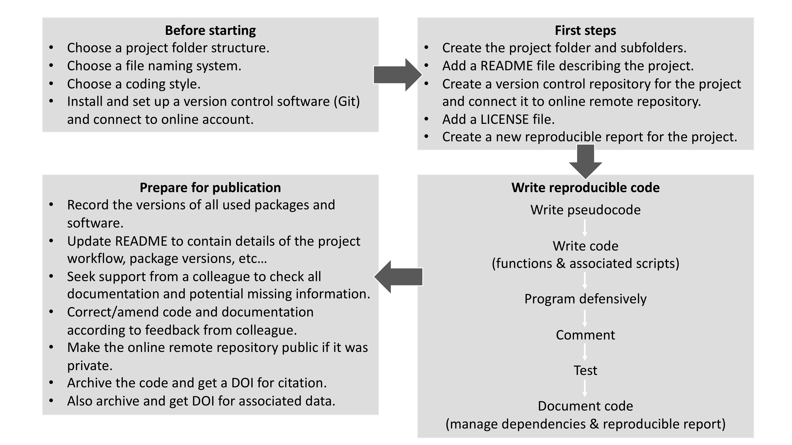
```

#### The repeatable, reproducible analysis workflow

The fundamental idea behind a robust, reproducible analysis is **a clean, repeatable script-based workflow** (i.e. the sequence of tasks from the start to the end of a project) **linking raw data through to clean data and to final analysis outputs**.

#### Principles of a good analysis workflow

Please find below some key concepts associated with this task:

- Start your analysis from copies of your raw data.
- Any cleaning, merging, transforming, etc. of data should be done in scripts, not manually.
- Split your workflow (scripts) into logical thematic units. For example, you might separate your code into scripts that 
  (i) load, merge and clean data, 
  (ii) analyse data, 
  (iii) produce outputs like figures and tables.
- Eliminate code duplication by packaging up useful code into custom functions (see Step3 : Ensure basic programming standards). Make sure to **comment your functions thoroughly, explaining their expected inputs and outputs (as well as the associated arguments and their options), and what they are doing and why**.
- Document your code and data as comments in your scripts and by producing separate documentation (using the R Markdown format).
- Any intermediary outputs generated by your workflow should be kept separate from raw data.
- Keep your raw data raw.

#### Organizing and documenting workflows

The simplest and most effective way of documenting your workflow – its inputs and outputs – is through good file system organization, and informative, consistent naming of materials associated with your analysis. The name and location of files should be as informative as possible on what a file contains, why it exists, and how it relates to other files in the project. These principles extend to all files in your project (not just scripts) and are also intimately linked to good research data management (see Chapter 5: Data management).

#### File system structure

It is best to keep all files associated with a particular project in a single root directory. RStudio projects offer a great way to keep everything together in a self-contained and portable (i.e. so they can be moved from computer to computer) manner, allowing internal pathways to data and other scripts to remain valid even when shared or moved.

```{r ProjStuct, echo=FALSE, fig.align="center", fig.cap="Example file structure of a simple analysis project. Make sure you left-pad single digit numbers with a zero for the R scripts to avoid having those misordered.", out.width = '100%'}

```

There is no single best way to organize a file system. The key is to make sure that the structure of directories and location of files are consistent, informative and works for you. Please find below an example of basic project directory structure (Figure \@ref(fig:ProjStuct)):

- The `data` folder contains all input data (and metadata) used in the analysis.
- The `MS` folder contains the manuscript.
- The `Figures_&_Tables` folder contains figures and tables generated by the analyses.
- The `Output` folder contains any type of intermediate or output files (e.g. simulation outputs, models, processed datasets, etc.). You might separate this and also have a `cleaned-data` folder.
- The `R_functions` folder contains R scripts with function definitions.
- The `Reports` folder contains RMarkdown files that document the analysis or report on results.
- The scripts (`*.R`) that actually do things are stored in the root directory together with the `README.md` file. If your project has too many scripts, you might consider organizing them in a separate folder.

#### License file

Usually, code and software are licensed under a [GNU Affero General Public License](https://www.gnu.org/licenses/agpl-3.0.en.html). This is a free, copyleft license for software and other kinds of works, specifically designed to ensure cooperation with the community in the case of network server software. For instance, this is the licence that the instructor has used for this [class](https://github.com/svenbuerki/EEB603_Reproducible_Science/blob/master/LICENSE.md). 

#### Using R to infer data structure and files organization

Inferring the directory tree structure of your project provides a simple and efficient way to summarize the data structure and organization of files related to your project as well as track versioning. The R base functions *list.files()* and *file.info()* can be combined to obtain information on files stored in your project. Please see code below for an example associated to Figure \@ref(fig:ProjStuct).  

```{r TreeDir2, echo=TRUE, tidy=TRUE, warning=FALSE}
#Produce a list of all files in working directory (Project-ID) together with info related to those files
file.info(list.files(path="Project_ID", recursive = TRUE, full.name = TRUE))
```

#### Pseudocode and associated R script

The code presented above could be at the core of a user-defined function that would aim at managing files and ensuring data reliability for your project. To help you define such a function, let's investigate this further and produce a diagram summarizing your project structure. This objective is achieved in three steps (see Figure \@ref(fig:plotProjStr)):

- **Step 1:** Produce a list of all files in your working directory using *file.info()* and *list.files()* functions. The output of this code is a `data.frame`
- **Step 2:** Convert the `data.frame` into a `data.tree` class object. This is done using the *data.tree::as.Node()* function from the `data.tree` package.
- **Step 3:** Prepare and plot diagram of project structure. This is done using set of functions from `data.tree` and plotting the output using `DiagrammR` package.
- **Step 4:** Save the output from step 3.

**WARNING:** Prior to starting the exercise, please go on the shared Google Drive and download the `Project_ID` folder at this path: 

`Reproducible_Science > Exercises > Chapter_5 > Project_ID`

##### R code and associated outputs

Procedure to follow:

1. Copy `Project_ID/` in a directory entitled `Chapter_5_PartB`.
2. Create and save an `R` script and save it in `Chapter_5_PartB`.
3. Make sure R packages are installed. See [here](#RpkgRepCode) for more details.
4. Study and execute the R code below to infer the file structure in `Project_ID/`. Also read the text below, which further explains the approach.   

```{r plotProjStr, echo = T, eval = T, fig.cap = "Diagram of project structure for the Project_ID directory. Nodes representing folders and files associated to R code are symbolized by boxes, whereas the others are rounded.", fig.dim = c(6,6)}
### Load R packages
library(data.tree)
library(DiagrammeR)

### Step 1: Produce a list of all files in Project_ID
filesInfo <- file.info(list.files(path="Project_ID", recursive = TRUE, full.name = TRUE))

### Step 2: Convert filesInfo into data.tree class
myproj <- data.tree::as.Node(data.frame(pathString = rownames(filesInfo)))

#Inspect output
print(myproj)

### Step 3: Prepare and plot diagram of project structure (it requires DiagrammeR)

#Set general parameters related to graph
data.tree::SetGraphStyle(myproj$root, rankdir = "LR")

#Set parameters for edges
data.tree::SetEdgeStyle(myproj$root, arrowhead = "vee", color = "grey", penwidth = "2px")

#Set parameters for nodes
data.tree::SetNodeStyle(myproj, style = "rounded", shape = "box")
#Apply specific criteria only to children nodes of Scripts and R_functions folders
data.tree::SetNodeStyle(myproj$Scripts, style = "box", penwidth = "2px")
data.tree::SetNodeStyle(myproj$R_functions, style = "box", penwidth = "2px")

#Plot diagram
plot(myproj)
```

Finally, the R DiagrammeR package sadly doesn't allow to easily save the graph into a file (step 4) using e.g. the *pdf()* and *dev.off()* functions, but this task can be done in RStudio as follows:

1. The diagram outputted by step 3 is displayed in the `Viewer` window (in the bottom right panel) and can be exported by clicking on the  button and select `Save as Image...` as shown in Figure \@ref(fig:ExportDiag1).

```{r ExportDiag1, echo=FALSE, fig.align="center", fig.cap="Snapshot showing how to export the diagram in RStudio.", out.width = '60%'}
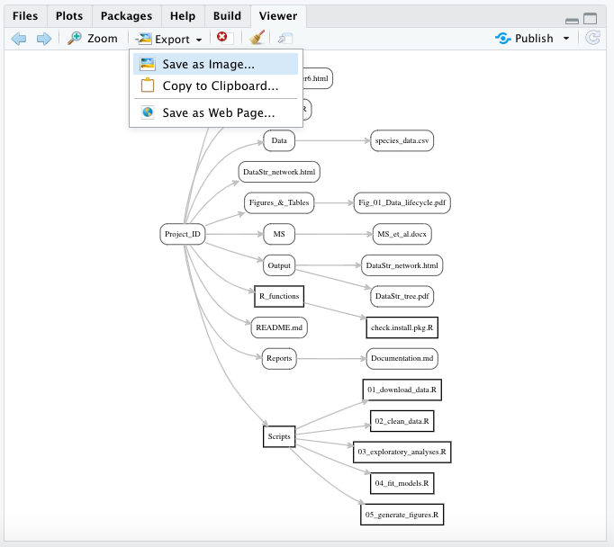
```

2. Once you have executed the latter step, a window will open allowing you to select the image format, directory and file name as shown in Figure \@ref(fig:ExportDiag2). 

```{r ExportDiag2, echo=FALSE, fig.align="center", fig.cap="Snapshot showing how to save the diagram in RStudio.", out.width = '60%'}
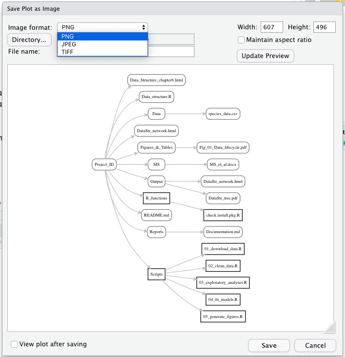
```

To find out more about your options to export/save DiagrammeR graphs please visit this website:

https://rich-iannone.github.io/DiagrammeR/io.html

#### Informative, consistent naming

Good naming extends to all files, folders and even objects in your analysis and serves to make the contents and relationships among elements of your analysis understandable, searchable and organised in a logical fashion (see Figure \@ref(fig:ProjStuct) for examples and Chapter 5: Data management for more details).

### Ensure basic programming standards

#### Writing pseudocode

Pseudocode is an informal high-level description of the operating principle of a computer program or other algorithm. It uses the structural conventions of a normal programming language (here R), but is intended for human reading rather than machine reading. Here, you will establish the big steps (and their associated tasks) and tie R functions (existing or that have to be made) to those steps. This provides the backbone of your code and will support writing it.  

#### Writing code

Writing clear, reproducible code has (at least) three main benefits:
1. It makes returning to the code much easier a few months down the line; whether revisiting an old project, or making revisions following peer review. 
2. The results of your analysis are more easily scrutinized by the readers of your paper, meaning it is easier to show their validity. 
3. Having clean and reproducible code available can encourage greater uptake of new methods that you have developed.

To write clear and reproducible code, it is recommended to follow the workflow depicted in Figure \@ref(fig:ReproWorkflow). The following section explains each part of the workflow along with some tips for writing code. Although this workflow would be the ‘gold standard’, just picking up some of the elements can help to make your code more effective and readable. 

#### Style guides

The foundation of writing readable code is to choose a logical and readable coding style, and to stick to it. Some key elements to consider when developing a coding style are:

- Using meaningful file names, and numbering these if they are in a sequence (see Figure \@ref(fig:ProjStuct) for examples and Chapter 5: Data management for more details).

```{r tidy=F, eval=FALSE}
### Naming files
# Good
fit-models.R
utility-functions.R

# Bad
foo.r
stuff.r
```

- Concise and descriptive object names. Variable names should usually be nouns and function names verbs. Using names of existing variables or functions should be avoided.

```{r tidy=F, eval=FALSE}
### Naming objects
# Good
day_one
day_1

# Bad
first_day_of_the_month
DayOne
dayone
djm1
```

- Spacing should be used to improve visual effect: use spaces around operators (`=`, `+`, `-`, `<-`, etc.), and after commas (much like in a sentence).

```{r tidy=F, eval=FALSE}
### Spacing
# Good
average <- mean(feet / 12 + inches, na.rm = TRUE)

# Bad
average<-mean(feet/12+inches,na.rm=TRUE)
```

- Indentation should be with two spaces, not tabs, and definitely not a mixture of tabs and spaces.
```{r tidy=F, eval=FALSE}
### Indentation
long_function_name <- function(a = "a long argument", 
                               b = "another argument",
                               c = "another long argument") {
  # As usual code is indented by two spaces.
}
```

- Assignment. Use `<-`, not `=`, for assignment.

```{r tidy=F, eval=FALSE}
### Assignment
# Good
x <- 5

# Bad
x = 5
```

The most important role of a style guide, however, is to introduce consistency to scripts.

#### Portable code: Absolute vs. Relative paths

When working collaboratively, portability between machines is very important, i.e. will your code work on someone else’s computer? Portability is also important if code is being run on another server, for example a High Performance Cluster. One way to improve portability of code is to avoid using absolute paths and use only relative paths (see https://en.wikipedia.org/wiki/Path_(computing)#Absolute_and_relative_paths). 

- **An absolute path** is one that gives the full address to a folder or file. 
- **A relative path** gives the location of the file from the current working directory. Relative paths are favored to promote code portability.

For example based on `species_data.csv` stored in the `Data` folder shown in Figure \@ref(fig:ProjStuct):

```{r eval=FALSE}
# Absolute path -----------------------------
C:/Project_ID/Data/species_data.csv

Project_ID = Project root folder = working directory

# Relative path ------
Data/species_data.csv
```

Relative paths are particularly useful when transferring between computers because while I may have stored my project folder in ‘C:/Project_ID/’, you may have yours stored in ‘C:/Users/My Documents’. Using relative paths and running from the project folder will ensure that *file-not-found errors* are avoided. 

RStudio is especially designed to help portability of code. For instance, you can easily set the working directory in RStudio by clicking:

```{r eval=FALSE}
Session > Set Working Directory > To Source File Location
```

or using the *setwd()* function. Please see Chapter 1 for more details.

#### Commenting code

How often have you revisited an old script six months down the line and not been able to figure out what you had been doing? Or have taken on a script from a collaborator and not been able to understand what their code is doing and why? An easy win for making code more readable and reproducible is the liberal, and effective, use of comments. A comment is a line of code that is visible, but does not get run with the rest of the script. In R and Python this is signified by beginning the line with a #.

**One good principle to adhere to is to comment the ‘why’ rather than the ‘what’**. The code itself tells the reader what is being done, it is far more important to document the reasoning behind a particular section of code or, if it is doing something nonstandard or complicated, to take some time to describe that section of code.

It is also good practice to use comments to add an overview at the beginning of a script, and commented lines of `---` to break up the script: e.g. in R

```{r eval=FALSE}
# Load data -------
```

#### Writing functions

Often when you are analyzing data, you need to repeat the same task many times. For example, you might have several files that all need loading and cleaning in the same way, or you might need to perform the same analysis for multiple species or parameters. The best way (by far) to handle those tasks is to write functions and store those in a specific folder (e.g. `R_functions` in \@ref(fig:ProjStuct)). Those functions will be loaded into the R environment (and therefore made available to users) by using the `source()` function, which will be placed at the top of your R script. Please see Chapter 1 part D for more details.

#### Testing scientific code

In the experimental sciences, rigorous testing is applied to ensure that results are accurate, reproducible and reliable. Testing will show that the experimental setup is doing what it is meant to do and will quantify any systematic biases. Results of experiments will not be trusted without such tests; why should your code be any different? Testing scientific code allows you to be sure that it is working as intended and to understand and quantify any limitations of the code. Using tests can also help to speed up the code development process by finding errors early on.

Although the instructor recognizes the importance of establishing protocols, those tests will be especially relevant if you were to design R packages. However, the instructor would recommend informal testing by loading functions that have been written by the students and running *ad hoc* tests in the command line to make sure that they perform as expected.

### Document and manage dependencies

Reproducibility is also about making sure someone else can re-use your code to obtain the same results as you (see [Appendix 1] for more details).

For someone else to be able to reproduce the results included in your report, you need to provide more than the code and the data. You also need to document the exact versions of all the packages, libraries, and software you used, and potentially your operating system as well as your hardware.

R itself is very stable, and the core team of developers takes backward compatibility (old code works with recent versions of R) very seriously. However, default values in some functions change, and new functions get introduced regularly. If you wrote your code on a recent version of R and give it to someone who has not upgraded recently, they may not be able to run your code. Code written for one version of a package may produce very different results with a more recent version.

#### Reporting R packages and versions

With R, the simplest (but a useful and important) approach to document your dependencies is to report the output of `sessionInfo()` (or `devtools::session_info()`). Among other information, this will show all the packages and their versions that are loaded in the session you used to run your analysis. If someone wants to recreate your analysis, they will know which packages they will need to install. Please see [Appendix 2] for more details.

For instance, here is the output of `sessionInfo()` showing the R version and packages that I used to create this document:

```{r echo=T, eval=T}
sessionInfo()
```

#### Using R packages to help managing dependencies and recreate setup

This will not be covered in this class, but it is worth noting that there are at least two R packages allowing to better manage dependencies and recreate your setup. Those packages are:

- *checkpoint*: https://cran.r-project.org/web/packages/checkpoint/vignettes/checkpoint.html
- *packrat*: https://rstudio.github.io/packrat/ 

The instructor expects students to discuss with their supervisors to identify if those packages are potentially useful for their projects. 

# Chapter 6

## Introduction

This chapter is subdivided into two parts as follows:

- [**PART A:**](#getpub) Getting published.
- [**PART B:**](#writpub) Writing papers in R Markdown.

## Getting published {#getpub}

### Learning outcome

- Learn procedures to present your research and disseminate it through publications.

To support the learning outcome, we will focus on discussing:

1. The importance of knowing the key conclusion that you want to communicate and revolve your publication around it.
2. The steps towards getting your research published:
    - Selecting your journal.
    - Writing your manuscript.
    - Submitting your manuscript.
    - Acceptance and publication.

### Literature and web resources

This chapter is mostly based on the following books, publications and web resources:

**Books and Guides**

- @GetPub -- A Guide to Getting Published in Ecology and Evolution published by the [British Ecological Society](https://www.britishecologicalsociety.org).
- @Margaret_OConnor -- A book entitled "Writing Scientific Research Articles: Strategy and Steps" available to download [here](http://www.idemployee.id.tue.nl/g.w.m.rauterberg/lecturenotes/2009-Writing_Scientific_Research_Articles.pdf).
- COPE: The guide entitled "How to handle authorship disputes: a guide for new researchers" available for download here: http://publicationethics.org/files/2003pdf12_0.pdf
- Moore, A. An eBook entitled "Writing Science Well: Techniques, tips and pitfalls" available to download here: http://www.wiley.com/legacy/wileyblackwell/gmspdfs/69204eBookECR/#/1/

**Publications**

- @Allen -- Comment published in *Nature* advocating for a “taxonomy” of author roles.
- @Fox2015 -- A publication investigating the relationship between manuscript title structure and success in Ecology.

**Websites**

- The Committee on Publication Ethics (COPE) website for general information on publishing ethics (http://publicationethics.org/).
- CRediT (Contribution Roles Taxonomy): https://authorservices.wiley.com/author-resources/Journal-Authors/open-access/credit.html
- Directory of Open Access journals: https://doaj.org/
- The Wiley Author Webinars website is full of seminars covering topics such as: How to get published; How to write for scientific publications; Grant funding tips; Understand the peer review process; Improve article/publication discoverability; Ethics in publishing; Open Access; Time management skills. Available here: https://authorservices.wiley.com/author-resources/Journal-Authors/Prepare/webinars/index.html

### Download presentation

The presentation slides for Chapter 6 - part A can be downloaded [here](Chapters_files/Chapter_6_Getting_published.pdf).

### Why publish?

**Publishing research results is the one thing that unites scientists across disciplines**, and it is a necessary part of the scientific process. You can have the best ideas in the world, but if you don't communicate them clearly enough to be published, your work won't be acknowledged by the scientific community.

By publishing you are achieving three key goals for yourself and the larger scientific endeavor:

- Disseminating your research.
- Advancing your career.
- Advancing science.

In biology, publishing research is equal to journal articles. 

### Know your message

Before beginning writing your journal article and thinking where to submit it, it is important to thoroughly understand your own research and **know the key conclusion you want to communicate** (see [chapter 3](#chap3)). In other words, **what is your take home message?**

Consider your conclusion and ask yourself, is it:

- New and interesting?
- Contributing to a hot topic?
- Providing solutions to difficult problems?

If you can answer ‘*yes*’ to all three, you have a good foundation message for a paper.

Shape the whole narrative of your paper around this message.

### Steps towards getting your research published

Once you know your message, getting your research published will be a four steps process:

- **Step 1:** Selecting your journal.
- **Step 2:** Writing your manuscript.
- **Step 3:** Submitting your manuscript.
- **Step 4:** Acceptance and publication.

Each step will be discussed below. Please seek support from your supervisor to learn more about specifics from you field.

### Step 1: Selecting your journal

To target the best journal to publish your research, you need to ask yourself **what audience do I want my paper to reach?**

Your manuscript should be tailored to the journal you want to submit to in terms of content and in terms of style (as outlined in journals’ author guidelines). To confirm that a journal is the best outlet to publish your research ask yourself this question: can I relate my research to other papers published in this journal?

Here are some things to consider when choosing which journal to submit to:

#### Journal aims and scope

Look closely at what the journal publishes; manuscripts are often rejected on the basis that they would be more suitable for another journal. There can be crossover between different journals’ aims and scope – differences may be subtle, but all important when it comes to getting accepted.

Do you want your article read by a more specialist audience working on closely related topics to yours, or researchers within your broader discipline? 

**Once you have decided which journal you are most interested in, make sure that you tailor the article according to its aims and scope.**

#### Editors and editorial boards

It is a good sign if you recognize the names of the editors and editorial board members of a journal from the work you have already encountered (even better if they contributed to some of the references cited in your manuscript). Research who would likely deal with your paper if you submitted to a journal and find someone who would appreciate reading your paper. You can suggest handling editors in your cover letter or in the submission form, if it allows, but be aware that journals do not have to follow your suggestions and/or requests.

#### Impact factor and other metrics

A summary of our previously discussed material is presented below to provide more context for this chapter, but please consult Chapter 4 for more details on this topic.

Impact factors are the one unambiguous measure widely used to compare journal quality based on citations the journal receives. However, other metrics are becoming more common, e.g. altmetric score measuring the impact of individual articles through online activity (shares on different social media platforms etc.), or article download figures listed next to the published paper. 

None of the metrics described here are an exact measure of the quality of the journal or published research. You will have to decide which of these metrics (if any) matter most to your work or your funders and institutions.

#### Open access

Do you need to publish open access (OA)? Some funders mandate it and grant money often has an amount earmarked to cover the article processing charge (APC) required for Gold OA. Some universities have established agreements with publishers whereby their staff get discounts on APCs when publishing in certain journals (or even a quota of manuscripts that can be published for "free" on a yearly basis). If you do not have grant funding, check whether your university or department has got an OA fund that you could tap into. 

However, if you are not mandated to publish OA by your funder and/or you do not have the funds to do so, **your paper will still reach your target audience if you select the right journal for your paper. Remember, you can share your paper over email.**

#### Author guidelines

Author guidelines will outline the journal’s requirements for submissions:

- Aims and scope. 
- Formatting requirements (incl. words limit, numbers of figures, tables, references).
- Journal policies (e.g. on data sharing and citation).

Always follow the author guidelines, stick to the word limit and tailor your manuscript accordingly. **Remember that papers can be rejected immediately if they do not meet the author guidelines.** 

#### Time to publication

The length of time a paper takes to be peer reviewed does not correlate to the quality of peer review, but rather reflects the resources a journal has to manage the process (e.g. do they have paid editorial staff or is it managed by full-time academics?).

Journals usually give their average time to a decision on their website, so take note of this if time is a consideration for you.

Some journals also make it clear that they are reviewing for soundness of science rather than novelty and will therefore often have a faster review process (e.g. *PLoS ONE*).

#### Ethics

Ethics can be divided into two groups: 

- **Research ethics:** this term includes aspects such as how you manage sensitive species information, whether you adhere to animal welfare guidelines and regulations or how you deal with data protection. 
- **Publication ethics:** this term concerns practices around the publication process. Standards set across scholarly publishing help define good practice and identify cases of misconduct. The Committee on Publication Ethics (COPE) provides the main forum for advice on ethics within scholarly publishing and has issued several sets of guidelines that help journals, editors and publishers handle cases of misconduct such as data fabrication, peer review fraud, plagiarism, etc. 

As an author, it helps if you are familiar with what constitutes good practices and what is considered unacceptable. Please see section "Used literature & web resources" for more details on this topic.

#### Authorship

Start talking about authorship and author order for your paper with collaborators at an early stage – before submitting and ideally before writing the paper. To deal with potential issues, ask yourself the question: **Who will do what?**

Some journals are now encouraging ‘authorship contribution statements’ so check the journal guidelines to see if this is required and how to format it. To help you figuring out authorship associated with your research article, you could apply the [CRediT (Contribution Roles Taxonomy)](https://authorservices.wiley.com/author-resources/Journal-Authors/open-access/credit.html) model presented by Wiley. The classification is as follows:

**CRediT Classification**

- *Conceptualization*: Ideas; formulation or evolution of overarching research goals and aims.
- *Data Curation*: Management activities to annotate (produce metadata), scrub data and maintain research data (including software code, where it is necessary for interpreting the data itself) for initial use and later reuse.
- *Formal Analysis*: Application of statistical, mathematical, computational, or other formal techniques to analyze or synthesize study data.
- *Funding Acquisition*: Acquisition of the financial support for the project leading to this publication.
- *Investigation*: Conducting a research and investigation process, specifically performing the experiments, or data/evidence collection.
- *Methodology*: Development or design of methodology; creation of models.
- *Project Administration*: Management and coordination responsibility for the research activity planning and execution.
- *Resources*: Provision of study materials, reagents, materials, patients, laboratory samples, animals, instrumentation, computing resources, or other analysis tools.
- *Software*: Programming, software development; designing computer programs; implementation of the computer code and supporting algorithms; testing of existing code components.
- *Supervision*: Oversight and leadership responsibility for the research activity planning and execution, including mentorship external to the core team.
- *Validation*: Verification, whether as a part of the activity or separate, of the overall replication/reproducibility of results/experiments and other research outputs.
- *Visualization*: Preparation, creation and/or presentation of the published work, specifically visualization/data presentation.
- *Writing – Original Draft Preparation*: Creation and/or presentation of the published work, specifically writing the initial draft (including substantive translation).
- *Writing – Review & Editing*: Preparation, creation and/or presentation of the published work by those from the original research group, specifically critical review, commentary or revision – including pre- or post-publication stages.

Here is an example of an author contributions paragraph inspired by the CRediT model:

*F.F., N.A.B. and S.B. designed study; F.F., E.B., S.P.B., J.M., and S.B. compiled data; F.F., S.B. and J.M. performed analyses; S.I.B., P.M.H., A.L., D.P.L., S.M., H.R., C.R., D.W.S., and P.T. provided material and/or sequences; F.F., J.M. and S.B. wrote the manuscript; all authors critically read and revised the manuscript, and approved the final submitted version.*

### Step 2: Writing your manuscript

#### Planning to write

Develop a narrative that leads to your main conclusion and develop a backbone around that narrative. The narrative should progress logically, which does not necessarily mean chronologically. Work out approximate word counts for each section to help manage the article structure and keep you on track for word limits.

It is important to **set aside enough time to write your manuscript and – importantly – enough time to edit**, which may actually take longer than the writing itself.

#### Structure

The article structure will be defined in the author guidelines, but if the journal’s guidelines permit it, there may be scope to use your own subheadings. **By breaking down your manuscript into smaller sections, you will be communicating your message in a much more digestible form.**

Use subheadings to shape your narrative and write each subheading in statement form (e.g. ecological variables do not predict genome size variation).

#### Title

**The title is the most visible part of your paper and it should thus clearly communicates your key message.** Pre-publication, reviewers base their decision on whether to review a paper on the quality of the title and abstract. Post-publication, if you publish in a subscription journal and not OA, the title and abstract are the only freely available parts of your paper, which will turn up in search engines and thus reach the widest audience. **A good title will help you get citations and may even be picked up by the press.**

Draft a title before you write your manuscript to help focusing your paper. The title needs to be informative and interesting to make it stand out to reviewers and subsequently readers. Some key tips for a successful title include:

- **Write it in statement form.** When scanning papers, most people skip to the last sentence of the abstract to look for the key message, so make that sentence your title.
- **Keep it around 15 words** – any longer or shorter and it has more chance of being rejected at peer review.
- **Use punctuation to split the main message** and qualifier/subtitle e.g. ‘Feeding evolution of a herbivore influences an arthropod community through plants: implications for plant-mediated eco-evolutionary feedback loop’.
- **Keep it general** – readers prefer titles that emphasize broader conceptual or comparative issues, and these titles fare better both pre- and post-publication than papers with organism-specific titles. Try to avoid using species names, put them in the abstract and keywords instead.
- **Do not use abbreviations** even if they are familiar in your field. You should keep a broad audience in mind.
- Do not use phrases such as ‘The effect of...’, ‘The involvement of...’. These phrases give the reader scope to question your message – instead tell the reader what they are being told.

#### Abstract

**Write your abstract after you have written your paper, when you are fully aware of the narrative of your paper.** After the title, the abstract is the most read part of your paper. Abstracts are freely available and affect how discoverable your article is via search engines. 

Given its importance, your abstract should:

- Articulate your new and interesting key message.
- Outline the methods and results.
- Contextualize the work.
- Highlight how your research contributes to the field and its future implications.
- Have the last sentence communicating the key message.

#### Writing style

**Writing with clarity, simplicity and accuracy** takes practice and we can all get carried away with what we think is ‘academic writing’ (i.e. long words and jargon) but good science speaks for itself. Write short sentences (ca. 12 words on average).

**Every extra word you write is another word for a reviewer to disagree with.** Single out the narrative that leads to your main conclusion and write that – it is easy to get side tracked with lots of interesting avenues distracting from your work, but by including those in your paper, you are inviting more criticism from reviewers.

Write in an active, positive voice (e.g. ‘we found this...’ ‘we did this...’) and be direct so that your message is clear. Ambiguous writing is another invitation for reviewers to disagree with you.

In your introduction, state that **your research is timely, important, and why**. Begin each section with that section’s key message and end each section with that message again plus further implications. This will place your work in the broader context that high-quality journals like.

Draft and redraft your work to ensure it flows well and your message is clear and focused throughout. While doing this process, keep the reader in mind at all times (to have a critical look on your research and its presentation).

#### Keywords

Keywords are used by readers to discover your paper. You will increase chances of your paper being discovered through search engines by using them strategically throughout your paper – this is search engine optimization (SEO). 

Think of the words you would search for to bring up your paper in a Google search. Try it and see what comes up – are there papers that cover similar research to your own?

Build up a list of 15–20 terms relevant to your paper and divide them into two groups: 

- A core group of around 5 keywords, 
- A larger group of secondary keywords. 

Place your core keywords in the title, abstract and subheadings, and the secondary keywords throughout the text and in figures and tables. Repeat keywords in the abstract and text naturally.

#### References

Reference all sources and do it as you go along (e.g. copy the BibTeX citation into a reference file; see [chapter 1 part B](#bib)), then tidy them once the paper is complete. 

Make sure that most of your references are recent to demonstrate both that you have a good understanding of current literature, and that your research is relevant to current topics.

#### Figures and tables

**Figures and tables enhance your paper by communicating results or data concisely** (more on this topic in chapters 9 and 10). 

Use figures and tables to maintain the flow of your narrative – e.g. instead of trying to describe patterns in your results, create a figure and say ‘see Fig. 1’. Not only does this keep your word count down, but a well-designed figure can replace 1000 words! 

Figures are useful for communicating overall trends and shapes, allowing simple comparisons between fewer elements. Tables should be used to display precise data values that require comparisons between many different elements.

Figure captions and table titles should explain what is presented and highlight the key message of this part of your narrative – the figure/table and its caption/title should be understandable in isolation from the rest of your manuscript.

Check the journal’s author guidelines for details on table and figure formatting, appropriate file types, number of tables and figures allowed and any other specifications that may apply. Material presented in chapter 1 part C can help you produce figures meeting journal expectations.

#### Editing

Once you have finished writing your manuscript, put it on ice for a week so you come back to it with fresh eyes. Take your time to read it through. Editing can take more time than you expect, but this is your opportunity to fine-tune and submit the best paper possible. Don't hesitate to seek support from your thesis committee to fasten and streamline this process.

Key things to look out for when editing include:

- Spelling and grammar – a surprising amount of errors slip through. If you are a non-native English speaker, ask a native speaker, ideally a colleague who knows a little bit about the subject, to read it through, or use a language-editing service if you have the funds to do so.
- Make sure all statements and assumptions are explained.
- Remove redundant words or phrases – keep it concise and jargon-free to avoid diluting your message.
- Abbreviations – check that they have been expanded on the first use.
- Acknowledgements – make sure all funders are clearly mentioned and that all people who contributed in any way are acknowledged.
- Keywords – they should be consistent, evenly spaced throughout the text and placed at key points in your manuscript e.g. subheadings.
- Make sure you have specifically dealt with the hypothesis set out in the introduction – you’d be surprised at the number of papers submitted that don’t!
- Circulate the manuscript to your co-authors to get their comments and final approval before submission.

### Step 3: Submitting your manuscript

You are now ready to submit your paper to your chosen journal. Each journal will have a different submission procedure that you will have to adhere to, and most manage their submissions through online submission systems (e.g. ScholarOne Manuscripts). 

**Only submit your paper for consideration to one journal at a time** otherwise you will be breaching publishing ethics.

#### Cover letters

A great cover letter can set the stage towards convincing editors to send your paper for review. Write a concise and engaging letter addressed to the editor-in-chief, who may not be an expert in your field or sub-field. 

The following points should be covered in your cover letter:

- State your key message and why your paper is important and relevant to the journal.
- State that your paper is not under review in another journal and hasn’t been published before (although you will most likely adhere to that during the submission process and if it is the case you then don't need to mention this in the cover letter).
- The cover letter should be shorter than your abstract and be written in less technical language.
- Use it to recommend reviewers (include their emails) and/or a relevant handling editor. Pick suggested reviewers with a good reputation to demonstrate both your knowledge of the field and your belief that your paper can stand up to their scrutiny.
- State any potential conflict of interest with other teams and blacklist potential reviewers. 

#### Handling revisions

Very rarely is a paper immediately accepted – almost all papers go through few rounds of reviews before they get published. 

If a decision comes back asking for revisions you should reply to all comments politely. Here are some tips on handling reviewer comments and revising your paper:

- Look at the reviewer comments with scrutiny and make a list of all the points that need to be addressed.
- Start with the minor revisions such as spelling, grammar, inconsistencies – these are often the most numerous but the easiest to correct.
- If you disagree with certain comments, disagree politely and with evidence. Do not skip over them when writing your reply.
- If things can’t be dealt with in this paper then explain that to the editor – reviewers may try to push their own agenda e.g. ‘why don’t you write this paper instead’, but you have the right to disagree if you don’t feel it is appropriate to deal with this in your paper.
- Respond to comments as thoroughly as you can.
- Include a point-by-point response to the reviewer comments in the relevant section of the online system.

#### Handling rejection

Reviewers are volunteers, but the service they provide is invaluable – by undergoing peer review, regardless of the outcome, you are receiving some of the best advice from leading experts for free. With this in mind, any feedback you get will be constructive in the end and will lead you on the way to a successful publishing portfolio. 

Keep in mind that **feedback is another person’s opinion on what you have done, not on who you are**, and it is up to you to decide what to do with it.

If your paper is rejected look at the reviewer’s comments and use their feedback to improve your paper before resubmitting it.

#### Appeals

If you are unhappy with a reject decision, 99.9% of the time, move on. However, don’t be afraid of appealing if you have well-founded concerns or think that the reviewers have done a bad job. There are instances where journals grant your appeal and allow you to revise your paper, but in the large majority of cases, the decision to reject will be upheld.

### Step 4: Acceptance and publication

Congratulations! By now you should have an acceptance email from the editor-in-chief in your inbox. The process from here will vary according to each journal, but the post-acceptance workflow is usually as follows:

- Your paper will be published online, unedited, but citable as an ‘Accepted Article’ within a week of acceptance (usually a DOI is assigned and your paper is citable at this stage).
- Your paper will be copy-edited. The level of copy-editing your paper will receive will vary according to each journal, so it is worth checking your proof thoroughly.
- Your paper will be typeset and a proof will be sent to you for checking. Author queries will be marked on the proof. At this stage, only minor corrections related to the typesetting are allowed.
- Your finalized proof will be published online in ‘Early View’.
- Finally, according to the journal’s schedule, your paper will be placed in an issue (or not if it is an online only journal, e.g. *Scientific Reports*).

It might be then time to coordinate the publication of a press release or post the link of your article on social media to share your joy!

## Writing papers in R Markdown {#writpub}

### Download presentation

The presentation slides for Chapter 6 - part B can be downloaded [here](Chapters_files/Chapter_6_writing_papers.pdf).

### Literature and web resources

This chapter is mostly based on the following books and web resources:

- **Bookdown ebook on writing scientific papers:** https://bookdown.org/yihui/rmarkdown/journals.html

- **A blog on "Writing papers in R Markdown" by Francisco Rodriguez-Sanchez:** https://sites.google.com/site/rodriguezsanchezf/news/writingpapersinrmarkdown

- **rmdTemplates R package GitHub repository:** https://github.com/Pakillo/rmdTemplates

- **rticles R package GitHub repository:** https://github.com/rstudio/rticles

### Software requirements

To apply the approach described below make sure that you have a Tex distribution installed on your computer. More information on this topic is available [here](#texdistr). You will also need to install the R *rticles* package as demonstrated [here](#rticlespkg). 

### Challenges to writing publications in R Markdown

Traditionally, journals are accepting manuscripts submitted in either Word (`.doc`) or LaTex (`.tex`) formats. In addition, most journals are requesting figures to be submitted as separate files (in e.g. `.tiff` or `.eps` formats). Online submission platforms are collating your different files to produce a `.pdf` document, which is shared with reviewers for evaluation. In this context, although the `.Rmd` format is growing in popularity (due to its ability to "mesh" data analyses with data communication), this format is technically currently not accepted by journals. In this document, we are discussing ways that have been developed to circumvent this issue and allow using the approach implemented in R Markdown for journal submissions.

### Solution: Develop templates producing LaTex files matching journal requirements!

As mentioned above, many journals support the LaTeX format (`.tex`) for manuscript submissions. While you can convert R Markdown (`.Rmd`) to LaTeX, different journals have different typesetting requirements and LaTeX styles. **The solution is to develop scripts converting R Markdown files into LaTex files, which are meeting journal requirements.**

### The *rticles* package {#rticlespkg}

Submitting scientific manuscripts written in R Markdown is still challenging; however the R [*rticles*](https://cran.r-project.org/web/packages/rticles/index.html) package was designed to simplify the creation of documents that conform to submission standards for academic journals [see @R-rticles]. The package provides a suite of custom R Markdown LaTeX formats and templates for the following journals/publishers that are relevant to the EEB program:

- Biometrics articles
- Elsevier journal submissions
- Frontiers articles
- MDPI journal submissions
- PeerJ articles
- PNAS articles
- Royal Society Open Science journal submissions
- Sage journal submissions
- Springer journal submissions
- The R Journal articles
- Taylor & Francis articles

An understanding of LaTeX is recommended, but not essential in order to use this package. R Markdown templates may sometimes inevitably contain LaTeX code, but usually we can use the simpler R Markdown and *knitr* function to produce elements like figures, tables, and math equations.

#### Install *rticles* and use templates to write publications

1. Install the *rticles* package:

  - Type the above code in the R console:

```{r, eval = FALSE}
install.packages("rticles")
```

  - Or use the RStudio interface to install the package by clicking:

```{r, eval = FALSE}
Tools -> Install Packages...

Then, type "rticles" in the prompted window to install package. 
```

  - If you wish to install the development version from GitHub (which often contains new article formats), you can do this [note that this code uses a function from the *remotes* package, @R-remotes]:
  
```{r, eval = FALSE}
remotes::install_github("rstudio/rticles")
```

2. Create a new R Markdown document in RStudio:

```{r, eval = FALSE}
File -> New File -> R Markdown... 
```

3. In the `New R Markdown` window, click on `From Template` in the left panel and select the journal style that you would like to follow for your article (here PNAS Journal Article; see Figure \@ref(fig:RMarkTemplate)). Before pushing the `OK` button, provide a name for your project and set a location where the project will be saved (see Figure \@ref(fig:RMarkTemplate)). 

```{r RMarkTemplate, echo=FALSE, fig.cap="R Markdown window allowing to select templates following journal styles.", fig.align = 'center', out.width = '60%'}
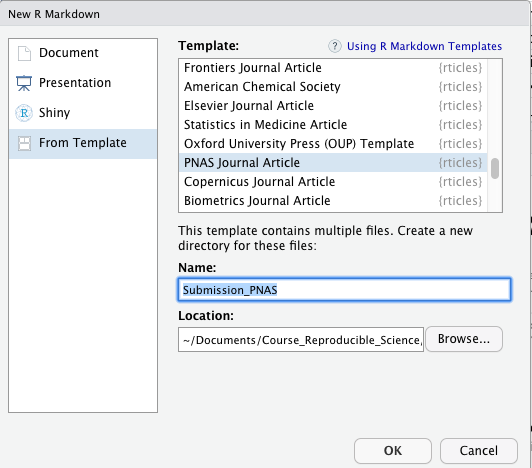
```

4. Once you completed this task, a folder will be created (and saved in the path that you provided) containing files associated with the article submission process and the template will be automatically opened in RStudio (see Figure \@ref(fig:filestr)).

```{r filestr, echo=FALSE, fig.cap="Snapshot showing the template R Markdown and the associated folder created to generate your submission.", fig.align = 'center', out.width = '100%'}
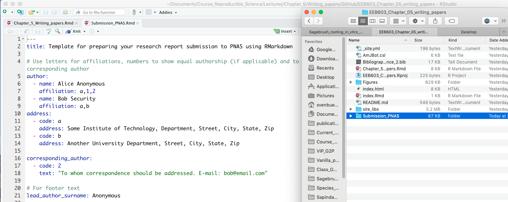
```

5. In this example, the following suite of files were created (see Figure \@ref(fig:filestr2)):
  - `Submission_PNAS.Rmd`: R Markdown file that will be used to write your article.
  - `pnas-sample.bib`: BibTeX file to store your bibliography.
  - `pnas.csl` and `pnas-new.cls`: Files containing information about the formatting of citations and bibliography adapted to journal policies. 
  - `frog.png`: A `.png` file used to show you how to include figures in `.Rmd` document.

```{r filestr2, echo=FALSE, fig.cap="Snapshot showing the suite of files associated to your submission and saved in your project folder.", fig.align = 'center', out.width = '80%'}
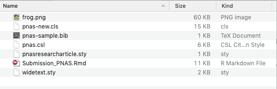
```

6. Start writing your article
  - Open `Submission_PNAS.Rmd` and update the YAML metadata section with information on authors, your abstract, summary and keywords (see Figure \@ref(fig:YAML2)).

```{r YAML2, echo=FALSE, fig.cap="Update YAML metadata section with information on authors, your abstract, summary and keywords.", fig.align = 'center', out.width = '100%'}
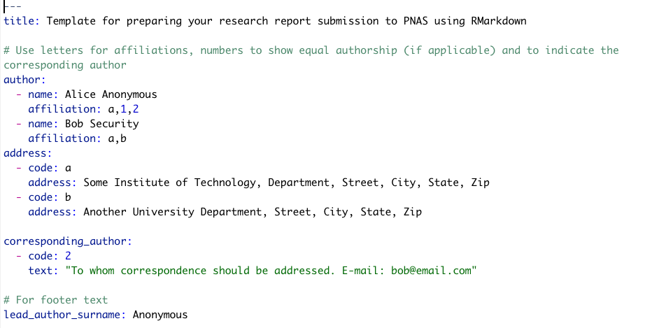
```
  - Write your manuscript by following the journal's structure. You can take advantage of the R Markdown language in your manuscript (e.g. include R code chunks and outputs) and those will be converted by *knitr* and *rticles* packages during the compilation procedure.

7. Compile your document and use both `.pdf` and `.tex` files to submit your article (see Figure \@ref(fig:Subm)). The output files will be saved in your project folder.

```{r Subm, echo=FALSE, fig.cap="Snapshot of the procedure to knit the document.", fig.align = 'center', out.width = '100%'}
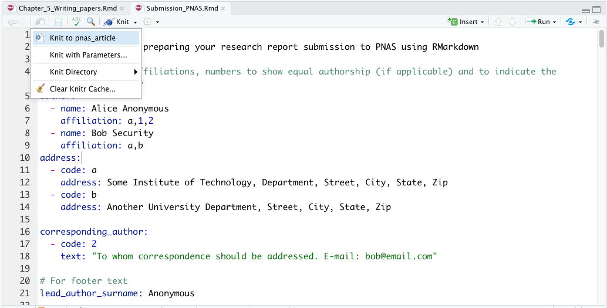
```

#### Exercise

To get familiar with this procedure, please practice by applying the above approach to different journal templates by favoring those where you might be submitting to. 

Enjoy writing scientific publications in R Markdown!

# Chapter 7

## Introduction

In this chapter, we will **study protocols to import and gather data with R**. As stated by @Gandrud2015 in the chapter 6 of his book, **how you gather your data directly impacts how reproducible your research will be**. In this context, it is your duty to try your best to document every step of your data gathering process. Reproduction will be easier if all of your data gathering steps are tied together by your source code, then independent researchers (and you) can more easily regather the data. Regathering data will be easiest if running your code allows you to get all the way back to the raw data files (the rawer the better). Of course, this may not always be possible. You may need to conduct interviews or compile information from paper based archives, for example. The best you can sometimes do is describe your data gathering process in detail. Nonetheless, R’s automated data gathering capabilities for internet-based information is extensive. Learning how to take full advantage of these capabilities greatly increases reproducibility and can save you considerable time and effort over the long run. 

Gathering data can be done by either importing locally stored data sets (= files stored on your computer) or by importing data sets from the Internet. Usually, these data sets are saved in plain-text format (usually in comma-separated values format or `csv`) making importing them into R a fairly straightforward task (using the *read.csv()* function). However, if data sets are not saved in plain-text format, the users will have to start by converting them. In most cases, data sets will be saved in `xls` or `xlsx` formats and functions implemented in the [*readxl*](https://readxl.tidyverse.org/) package [@readxl] would be used (using the *read_xlsx()* function). If your data sets were created by other statistical programs such as SPSS, SAS or Stata, these could be imported into R using functions from the *foreign* package [@foreign]. Finally, data sets could be saved in compressed documents, which will have to be processed prior to importing the data into R.

Learning skills to import and gather data sets is especially important in the fields of Ecology, Evolution and Behavior since your research is highly likely to depend on large and complex data sets (see Figure \@ref(fig:datainter)). In addition, testing your hypotheses will rely on your ability to manage your data sets to test for complex interactions (e.g. does abiotic factors such as temperature drive selection processes in plants?; Figure \@ref(fig:datainter)).

```{r datainter, echo=FALSE, fig.cap="Example of datasets involved in Ecology, Evolution and Behavior and their intercations.", fig.align = 'center', out.width = '60%'}
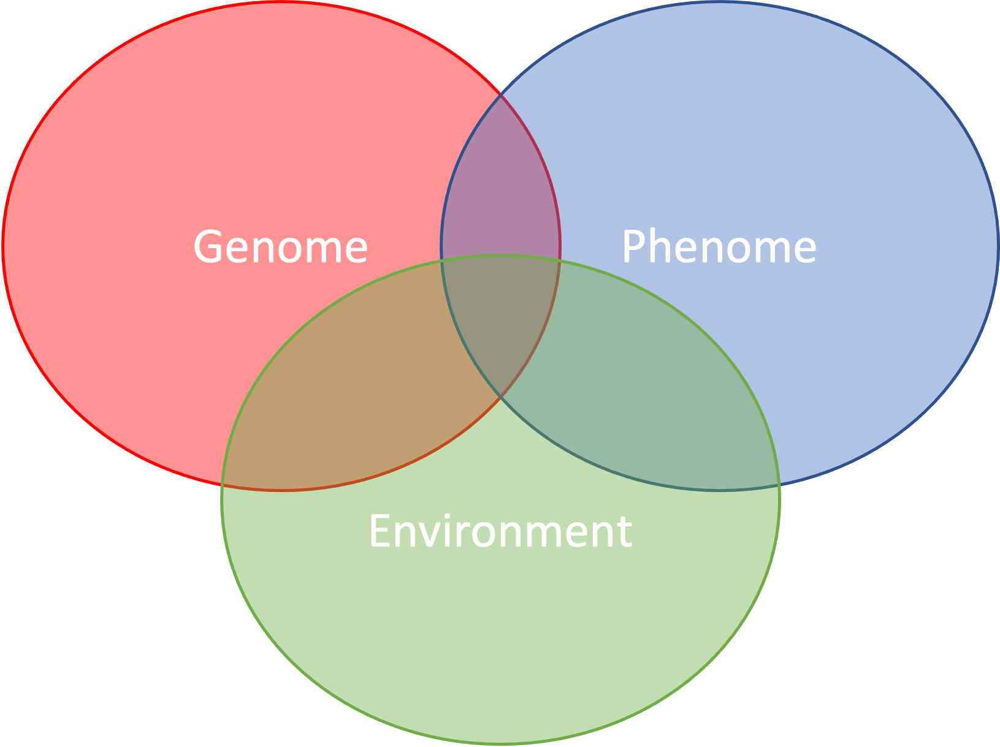
```

Here, we are providing methods and R functions that are applied to manage your projects and gather, convert and clean your data. Ultimately these tools will be applied to document and produce the raw data at the basis of your research.

## Learning outcomes

- Creating RStudio projects to manage your reproducible project.
- Importing `csv` files deposited on GitHub into R. 
- Learning about SHA-1 hash accession numbers and their usage to retrieve `csv` files associated to specific GitHub `commit` events.
- Downloading whole GitHub repository (in `zip` format) on your computer.
- Listing all files in a compressed `zip` file.
- Extracting and saving selected files from a `zip` file without decompressing it.
- Manipulating files and directories to organize your project.

## Managing projects in RStudio

RStudio projects (`.Rproj`) allow users to manage their project, more specifically by dividing their work into multiple contexts, each with their own working directory, workspace, history, and source documents.

### Creating projects

RStudio projects are associated with R working directories. You can create an RStudio project:

1. In a brand new directory.
2. In an existing directory where you already have R code and data.
3. By cloning a version control (Git or Subversion) repository.

We will be covering the last option during Chapter 11.

To create a new project in RStudio, do `File > New Project...` and then a window will pop-up allowing you to select among the 3 options (see Figure \@ref(fig:newproj)).

```{r newproj, echo=FALSE, fig.cap="Window allowing you to create a New RStudio project. See text for more details.", fig.align = 'center', out.width = '60%'}
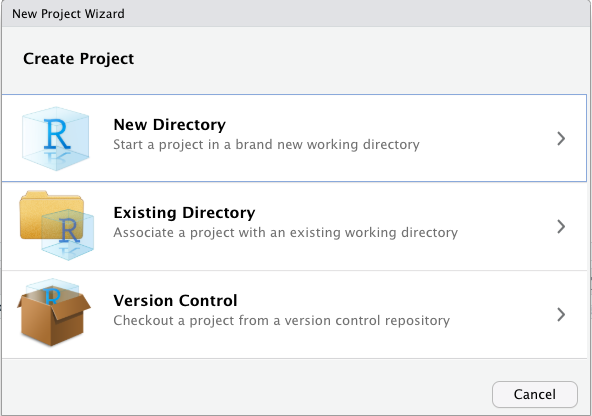
```

When a new project is created RStudio:

1. Creates a project file (with an `.Rproj` extension) within the project directory. This file contains various project options and can also be used as a shortcut for opening the project directly from the filesystem.
2. Creates a hidden directory (named .`Rproj.user`) where project-specific temporary files (e.g. auto-saved source documents, window-state, etc.) are stored. This directory is also automatically added to `.Rbuildignore`, `.gitignore`, etc. if required.
3. Loads the project into RStudio and display its name in the Projects toolbar (which is located on the far right side of the main toolbar).

### Working with projects

To open a project, go to your project directory and double-click on the project file (`*.Rproj`). When your project opens within RStudio, the following actions will be taken:

- A new R session (process) is started.
- The current working directory is set to the project directory.
- Previously edited source documents are restored into editor tabs.
- If you saved your workspace into a `.RData` file (see below), it will be loaded into your environment and allowing you to purse your work. 

When you are within a project and choose to either Quit, close the project, or open another project the following actions will be taken:

- `.RData` and/or `.Rhistory` are written to the project directory (if current options indicate they should be).
- The list of open source documents is saved (so it can be restored next time the project is opened).
- The R session is terminated.

### Additional information

Additional information on RStudio projects can be found here:

https://support.rstudio.com/hc/en-us/articles/200526207-Using-Projects

## Bioinformatic dependencies and data repositories

The list of R packages and GitHub repositories used in this chapter are listed below. Please make sure you have all these set-up before starting reading and completing the material presented in this chapter.

### R packages

Most of the functions that we will be using in this chapter are base R functions installed (by default) in the *utils* package [@utils].  However, the following R package (and its dependencies) has to be installed on your computer prior to starting this tutorial: *repmis* [@repmis]. In the event that you wanted to import `xsl` or `xlsx` files into R, you would also have to install the *readxl* package [@readxl]. 

### GitHub repositories used in this chapter

#### EEB603_Reproducible_Science repository

This repository is dedicated to this course and is used to demonstrate the procedure to import `csv` files into R from GitHub repositories. More specifically, we will be importing different versions of the file (`Timetable_EEB603_topic_tasks.csv`) at the origin of the [Timetable](Timetable.html) to study procedure associated to file versioning in GitHub. It is located at this URL (Uniform Resource Locator): 

- https://github.com/svenbuerki/EEB603_Reproducible_Science 

#### Sagebrush_rooting_in_vitro_prop

This repository is associated to @Barron2020 and is used to demonstrate procedure to download whole GitHub repositories. We will be downloading the whole repository on your local computer and then extracting all `csv` files in the `01_Raw_Data/` folder and saving them on your local computer using R (see Figure \@ref(fig:GitHubRawDatashot) for more details on file content). 

```{r GitHubRawDatashot, echo=FALSE, fig.cap="Snapshot showing files in the 01_Raw_Data folder that we will be targeting in the GitHub repository.", fig.align = 'center', out.width = '100%'}
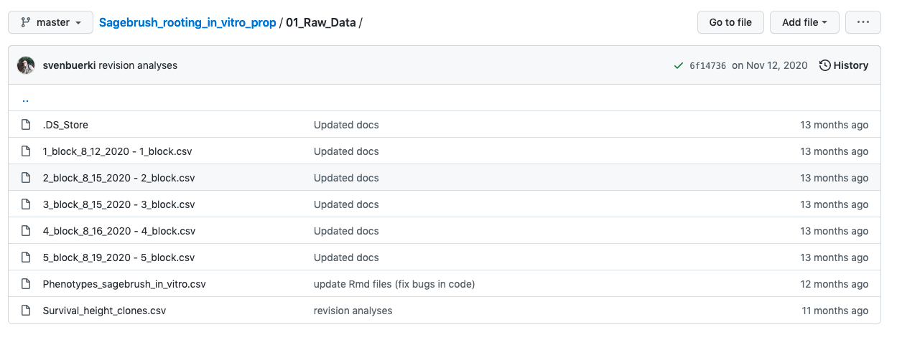
```

This approach is aimed at demonstrating how you could access raw data deposited on GitHub. The repository is located at this URL: 

- https://github.com/svenbuerki/Sagebrush_rooting_in_vitro_prop

## Overview of methods applied in this chapter

In this chapter, we will be focusing on learning procedures to import data from the internet focusing on GitHub. More precisely, we will be learning procedures to:

1. Import comma-separated values format (`csv`) stored in GitHub repositories.
2. Download and process whole GitHub repositories saved in compressed `zip` format.

## List of R functions covered in this chapter

The list of major R functions covered in this chapter are provided in the Table below.

```{r funcTab, eval = T, echo=F, warning = FALSE, message=FALSE}
###~~~
#Read in csv with functions
###~~~
funcTab <- read.csv("Data/Functions_Chapter_06.csv") 

###~~~
#Produce final table
###~~~

#Order table (alphabetically)
funcTab <- funcTab[order(funcTab$Function),]
rownames(funcTab) <- NULL
###~~~
#Plot timetable in doc
###~~~
#Plot table
DT::datatable(funcTab, extensions = 'Buttons', options = list(pageLength = 20, dom = 'Blfrtip', buttons = c('copy', 'csv', 'excel', 'pdf', 'print')), rownames= FALSE) %>%
  DT::formatStyle('Function', fontWeight = 'bold')

#knitr::kable(as.data.frame(lex), caption = "Lexicon of terms used in this course.") %>%
#  kable_styling(bootstrap_options = c("striped", "hover", "condensed"))

``` 

## Getting started!

Before starting coding, please do the following:

1. Open RStudio and create a **New Project** in a **New Directory** entitled `EEB603_Chapter_06`.
2. Open the new project and create and save a **new R script** entitled `01_Data_gathering.R`.

## Importing csv files from GitHub into R

Before delving into this subject, there are several topics that we need to cover.

### The SHA-1 hash accession number

With the growing popularity of GitHub, several authors are depositing their data sets on GitHub and you might would like to access those for your research. **Since Git and GitHub are supporting version control, it is important to report the exact version of the file or data set that you have downloaded**. To support such feature, **each version of a file/data set is associated to a unique encrypted [SHA-1](https://en.wikipedia.org/wiki/SHA-1) (Secure Hash Algorithm 1) hash accession number**. This means that if the file changes (because the owner of the repository updated it), its SHA-1 hash accession number will change. Such feature allows users to referring to the exact file/data set used in their analyses therefore supporting reproducibility.  

### How to retrieve the URL of a GitHub csv file?

Before being able to import a `csv` file deposited in GitHub into R you have to find it's *raw* URL. In this section, we will demonstrate how to obtain this information by using the `Timetable_EEB603_topic_tasks.csv` file located on the [course's GitHub repository](https://github.com/svenbuerki/EEB603_Reproducible_Science/blob/master/Data/Timetable_EEB603_topic_tasks.csv).

To retrieve the *raw* URL associated to `Timetable_EEB603_topic_tasks.csv` do the following:

1. Navigate to the file location on the GitHub repository by clicking [here](https://github.com/svenbuerki/EEB603_Reproducible_Science/blob/master/Data/Timetable_EEB603_topic_tasks.csv) (see Figure \@ref(fig:repoURL1)).
```{r repoURL1, echo=FALSE, fig.cap="Location of Timetable_EEB603_topic_tasks.csv on the EEB603_Reproducible_Science GitHub repository.", fig.align = 'center', out.width = '100%'}
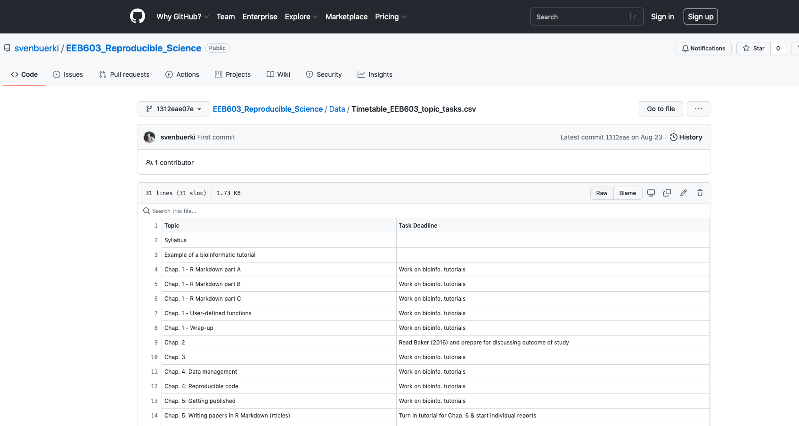
```
2. Click on the `Raw` button on the right just above the file preview (Figure \@ref(fig:repoURL1)). This action should open a new window showing you the *raw* `csv` file (see Figure \@ref(fig:repoURL2)). 
```{r repoURL2, echo=FALSE, fig.cap="Raw csv file associated to Timetable_EEB603_topic_tasks.csv. See text for more details.", fig.align = 'center', out.width = '100%'}
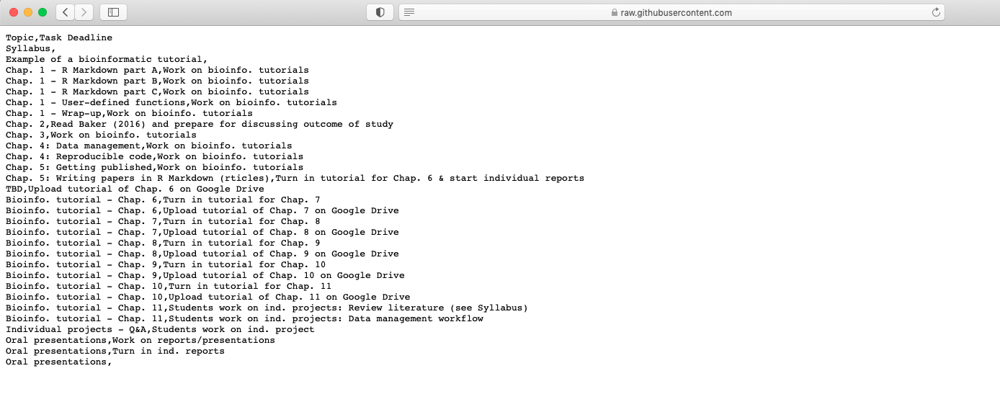
```
3. The *raw* URL for this `csv` file can be retrieved by copying the URL address (see Figure \@ref(fig:repoURL2)). In this case, the URL is as follows:
https://raw.githubusercontent.com/svenbuerki/EEB603_Reproducible_Science/master/Data/Timetable_EEB603_topic_tasks.csv
4. The URL can be shorten for free by using Bitly at https://bitly.com. In this case, the short URL pointing to our `csv` file is https://bit.ly/3BDxECl. We will be using this URL in the example below. 

### Importing GitHub csv into R

Now that we have retrieved and shortened the *raw* GitHub URL pointing to our target `csv` file, we can use the *source_data()* function implemented in the R package *repmis* [@repmis] to download the file. The object return by *source_data()* is a `data.frame` and can therefore be easily manipulated and saved on your local computer (using e.g. *write.csv()*). Retrieving a `csv` data set from a GitHub repository can be done as follows:

```{r githubcsv}
###~~~
#Load package
###~~~
library(repmis)

###~~~
#Store raw short URL into object
###~~~
urlcsv <- "https://bit.ly/3BDxECl"

###~~~
#Download/Import csv into R
###~~~
csvTimeTable <- repmis::source_data(url = urlcsv) 

###~~~
#Check class
###~~~
#Class should be `data.frame`
class(csvTimeTable)

###~~~
#Print csv
###~~~
print(csvTimeTable)
```

*source_data()* will always download the most recent version of the file from the master branch and return its unique SHA-1 hash. However, you could also download a prior version of the file by providing its specific SHA-1 hash associated to a previous `commit`.

### Retrieving csv from previous commit

Retrieving the `csv` file associated to a specific `commit` can be done by applying the following approach (here using the same example than above):

1. To find a file's particular `commit` *raw* URL navigate to its location on GitHub by clicking [here](https://github.com/svenbuerki/EEB603_Reproducible_Science/blob/master/Data/Timetable_EEB603_topic_tasks.csv).
2. Click the  button. This action will take you to a page listing all of the file's versions (see Figure \@ref(fig:hist)).
```{r hist, echo=FALSE, fig.cap="Page showing commit history associated to Timetable_EEB603_topic_tasks.csv.", fig.align = 'center', out.width = '100%'}
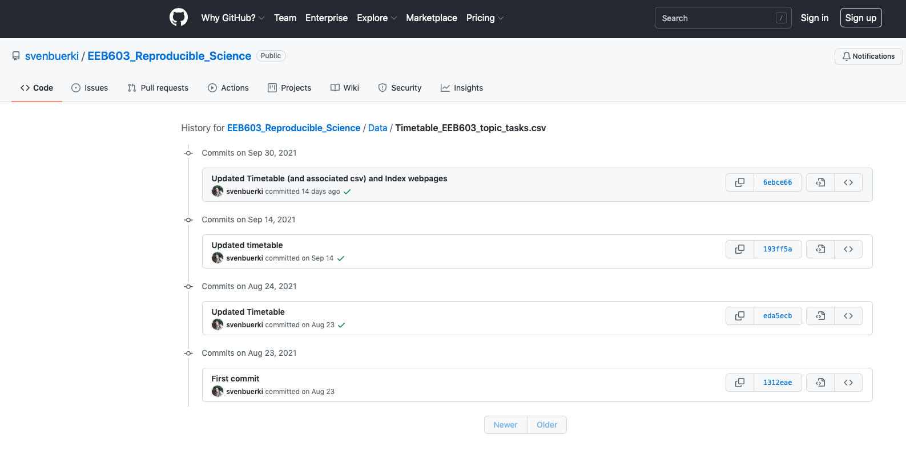
```
3. Click on the 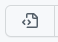 button next to the version of the file that you want to use (here `Commits on Aug 23, 2021`; Figure \@ref(fig:hist)). This will take you to the version of the file at this point in history. 
```{r hist2, echo=FALSE, fig.cap="Page showing prior commit associated to Timetable_EEB603_topic_tasks.csv.", fig.align = 'center', out.width = '100%'}
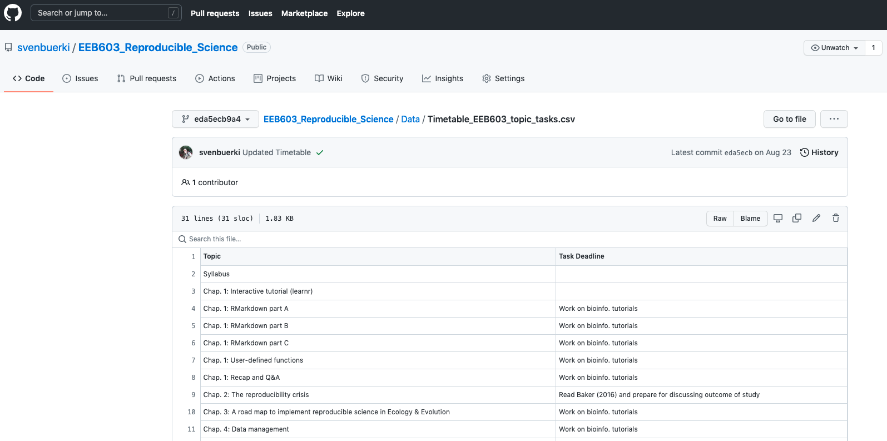
```
4. Clicking on the `Raw` button will load the `csv` file and allow you to retrieve the URL (as done above).
5. Download the file using the following R code:
```{r}
###~~~
#Store raw URL into object
###~~~
urlcsvold <- "https://raw.githubusercontent.com/svenbuerki/EEB603_Reproducible_Science/1312eae07e0515d8d2423ff83834b184cf6eeb8d/Data/Timetable_EEB603_topic_tasks.csv"

###~~~
#Download/Import csv into R
###~~~
csvTimeTableOld <- repmis::source_data(url = urlcsvold) 

###~~~
#Check class
###~~~
#Class should be `data.frame`
class(csvTimeTableOld)

###~~~
#Print csv
###~~~
print(csvTimeTableOld)
```
6. You can see here that the SHA-1 hash is different from our previous download confirming that the files are different.

## Downloading and processing GitHub repositories

Before being able to download a GitHub repository and work with its files into R, you have to find the URL pointing to the compressed `zip` file containing all the files for the target repository. In this section, we will demonstrate how to obtain this information by using the [Sagebrush_rooting_in_vitro_prop GitHub repository](https://github.com/svenbuerki/Sagebrush_rooting_in_vitro_prop). As mentioned above, we will be downloading the whole repository and then extract all the `csv` files in the `01_Raw_Data/` folder (see Figure \@ref(fig:GitHubRawDatashot)). 

### How to retrieve the URL for the GitHub repository?

To retrieve the URL associated to the compressed `zip` file containing all files for the repository do the following:

1. Navigate to the GitHub repository page by clicking [here](https://github.com/svenbuerki/Sagebrush_rooting_in_vitro_prop) (see Figure \@ref(fig:repo)).
```{r repo, echo=FALSE, fig.cap="GitHub repository page for Sagebrush_rooting_in_vitro_prop.", fig.align = 'center', out.width = '100%'}
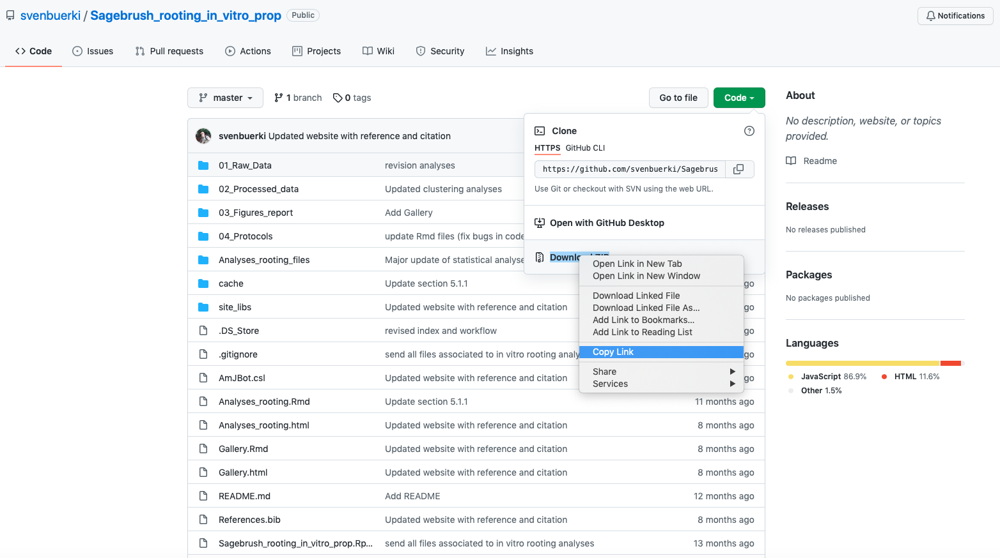
```
2. To copy the URL pointing to the compressed `zip` file do the following actions:
  - Click on the  button.
  - Navigate to the  section.
  - Right-click to copy the link (as shown in Figure \@ref(fig:repo)).
3. The copied URL (https://github.com/svenbuerki/Sagebrush_rooting_in_vitro_prop/archive/refs/heads/master.zip) will serve as input for downloading the repository on your local computer (see below).

### Downloading GitHub repository on your computer

Now that we have secured the URL pointing to the compressed `zip` file for the target repository (by copying it), we will use this URL and the base R *download.file()* function as input to download the file on our local computer. Since compressed files could be large, we are also providing some code to check if the file already exists on your computer before downloading.

```{r}
###~~~
#Store URL in object
###~~~
# Paste the URL that you copied in the previous section here
URLrepo <- "https://github.com/svenbuerki/Sagebrush_rooting_in_vitro_prop/archive/refs/heads/master.zip"

###~~~  
#Download the repository from GitHub
###~~~
# Arguments:
# - url:  URLrepo
# - destfile: Path and name of destination file on your computer
#             YOU HAVE TO ADJUST PATH TO YOUR COMPUTER

# First check if the file exists, if yes then return file already downloaded else proceed with download
if(file.exists("Data/GitHubRepoSagebrush.zip") == TRUE){
  #File already exists!
  print("file already exists and doesn't need to be downloaded!")
  }else{
  #Download the file
    print("Downloading GitHub repository!")
  download.file(url = URLrepo, destfile = "Data/GitHubRepoSagebrush.zip")
}
```

### Extracting raw data from compressed GitHub repository 

Compressed files can be quite large and you might would like to avoid decompressing them, but rather accessing target files and only decompressing those. Here, we are practicing such approach by using `GitHubRepoSagebrush.zip` and targeting `csv` files in the `01_Raw_Data/` folder.   

#### What is the size of the zip file?

To estimate the size (in bytes) of a file you can use base R function *file.size()* as follows:

```{r filesize}
###~~~
#Infer file size of GitHubRepoSagebrush.zip
###~~~

# Transform and round file size from bytes to Mb
ZipSize <- round(file.size("Data/GitHubRepoSagebrush.zip")/1e6,2)

print(paste("The zip file size is", ZipSize, "Mb", sep = " "))
```

#### Decompressing and saving csv files in 01_Raw_Data/

Finally, we can now i) list all files in the `zip` file, ii) identify `csv` files in `01_Raw_Data/` and iii) save these files on our local computer in a folder entitled `01_Raw_Data/`. These files will then constitute the raw data for your subsequent analyses. 

```{r decompsave}
###~~~
#List all files in zip file without decompressing it
###~~~
filesZip <- as.character(unzip("Data/GitHubRepoSagebrush.zip", list = TRUE)$Name)

###~~~
#Identify files in 01_Raw_Data/ that are csv
###~~~
# Use grepl() to match criteria
targetF <- which(grepl("01_Raw_Data/", filesZip) & grepl(".csv", filesZip) == TRUE)
# Subset files from filesZip to only get our target files
rawcsvfiles <- filesZip[targetF]
#print list of target files
print(rawcsvfiles)

###~~~
#Create local directory to save csv files
###~~~
#Check if the folder already exists
# if not then creates it
output_dir <- file.path(paste0("Data/01_Raw_Data/"))

if(dir.exists(output_dir)){
    print(paste0("Dir", output_dir, " already exists!"))
  }else{
    print(paste0("Created ", output_dir))
    dir.create(output_dir)  
}

###~~~
#Save csv in output_dir
###~~~
# Use loop to read csv file in and then save it in output_dir
for(i in 1:length(rawcsvfiles)){
  ###~~~
  #Decompress and read in csv file
  ###~~~
  tempcsv <- read.csv(unz("Data/GitHubRepoSagebrush.zip", rawcsvfiles[i]))
  ###~~~
  #Write file in
  ###~~~
  # Extract file name
  csvName <- strsplit(rawcsvfiles[i], split = "01_Raw_Data/")[[1]][2]
  # Write csv file in output_dir
  write.csv(tempcsv, file = paste0(output_dir, csvName))
}
```

We can verify that all the files are in the newly created directory on your computer by listing them as follows (compare your results with files shown in Figure \@ref(fig:GitHubRawDatashot)):
```{r}
#List all the files in output_dir (on your local computer)
list.files(paste0(output_dir))
```

# References

<div id="refs"></div>

# (APPENDIX) Appendices {-}

# Appendix 1

Citations of all R packages used to generate this report. 

```{r generateBibliography, results="asis", echo=FALSE, cache = FALSE, warning = FALSE, message=FALSE}
library("knitcitations")
cleanbib()
options("citation_format" = "pandoc")
read.bibtex(file = "packages.bib")
``` 

# Appendix 2

Version information about R, the operating system (OS) and attached or R loaded packages. This appendix was generated using `sessionInfo()`.

```{r sessionInfo, eval = TRUE, echo = FALSE, warning = FALSE, message = FALSE}
sessionInfo()
```
