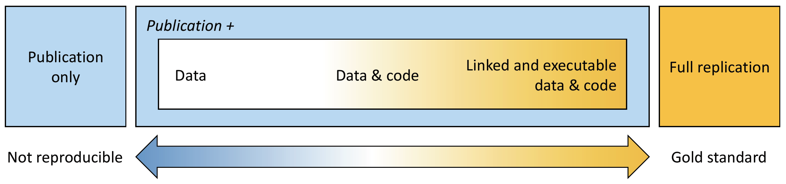
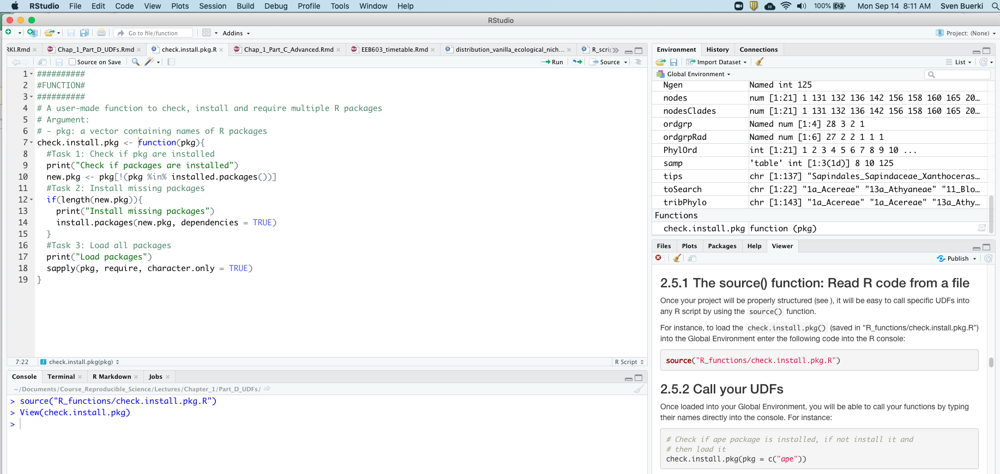
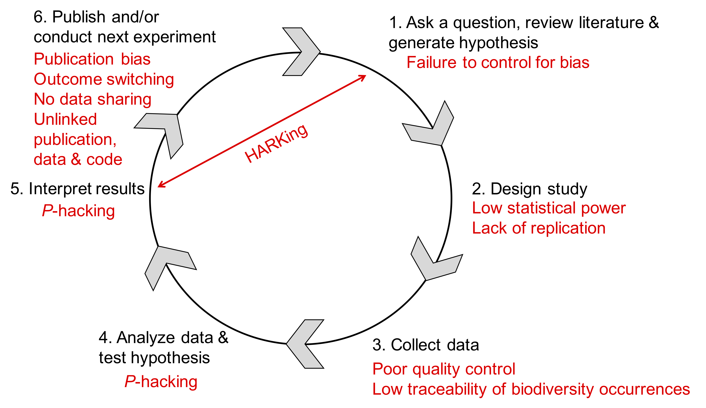
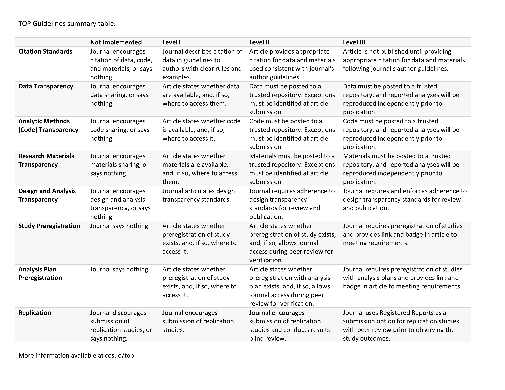
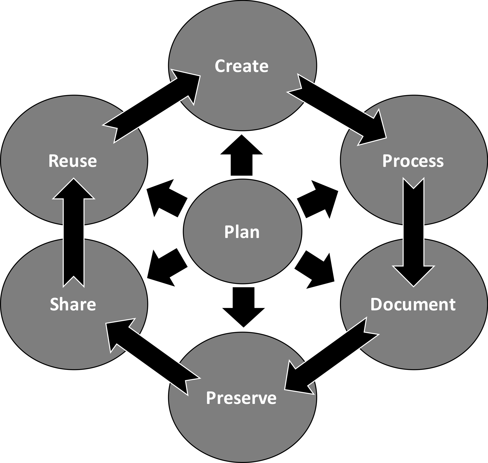

```{js logo-js, echo=FALSE}
$(document).ready(function() {
  $('#header').parent().prepend('<div id=\"logo\"></div>');
  $('#header').css('margin-right', '120px')
});
```

```{r packages, echo=FALSE, warning=FALSE, include=FALSE}
library(knitr)
library(rmarkdown)
library(bookdown)
#library(distill)
library(knitcitations)
library(formatR)
library(devtools)
library(kfigr)
library(dplyr)
library(kableExtra)
#library(learnr)
library(data.tree)
library(DiagrammeR)
library(rticles)
library(DT)

#Generate BibTex citation file for all R packages used to produce report
knitr::write_bib(.packages(), file = 'packages.bib')
```

```{r setup, include=FALSE, cache=FALSE, message = FALSE}
# Chunk options: see http://yihui.name/knitr/options/ ###

## Text results
#opts_chunk$set(echo = TRUE, warning = TRUE, message = TRUE, include = TRUE)

## Code decoration
opts_chunk$set(tidy = TRUE, tidy.opts = list(blank = FALSE, width.cutoff = 60), highlight = TRUE)

## Caching code
#opts_chunk$set(cache = 2, cache.path = "cache/")

## Plots
#opts_chunk$set(fig.path = "Figures_MS/", dev=c('pdf', 'png'), dpi = 300)

## Locate figures as close as possible to requested position (=code)
knitr::opts_chunk$set(fig.pos = 'H')

# Read bibtex file
refs <- bibtex::read.bib("Bibliography_Reproducible_Science_2.bib")
```

# Syllabus

Please see this [webpage](index.html) for more details on the Syllabus. In addition, the presentation slides can be downloaded [here](Chapters_files/Chapter_00_Syllabus_EEB603.pdf). 

# Chapter 1 {#chap1}

## Introduction

In this chapter, we will introduce the **bioinformatic tools to write and disseminate reproducible reports** as implemented in RStudio. More specifically, we will learn procedures to **link and execute data and code into a unified environment** (see Figure \@ref(fig:ReproScience)). This chapter focuses on learning the R Markdown syntax and protocols allowing to include text, code, figures, tables and bibliography into a document. This document will then be compiled into an output file (in either `pdf`, `HTML` or `Word` formats) allowing sharing your research. More specifically, this tutorial provides students with the minimum knowledge allowing them to complete their bioinformatic tutorials (PART 2) and individual projects (PART 3). The chapter will be subdivided into four parts as follows:

- [**PART A:**](#partA) Learning the basics.
- [**PART B:**](#partB) Tables, Figures and References.
- [**PART C:**](#partC) Advanced R Markdown settings.
- [**PART D:**](#partD) User Defined Functions in R.
- [**PART E:**](#partE) Interactive tutorials.

```{r ReproScience, echo=FALSE, fig.cap="The spectrum of reproducibility.", fig.show="asis", out.width = '100%'}

```

### Learning outcomes

This chapter provides students with opportunities to learn procedures to:

- Install R Markdown on your computer. 
- Create and render (or knitting) your first R Markdown document.
- Execute basic R Markdown syntax and protocols.
- Develop pseudocode and implement it using the R language.
- Create your own functions (referred to as user-defined functions).

### Files supporting this tutorial {#Files}

Although less used in PART A, a set of files are provided to support teaching of material presented in this chapter. These files are deposited in the shared Google Drive at this path: 
  
  + `Reproducible_Science/Chapters/Chapter_1/Tutorial_files`

Files are as follows:

- `EEB603_Syllabus_BUERKI.Rmd`: This is the `.Rmd` file used to compile the syllabus of this class. This file provides a good source of information for the syntax and protocols described in this tutorial.
- `Bibliography_Reproducible_Science_2.bib`: This file contains references cited in `BibTex` format. 
- `AmJBot.csl`: This citation style language (CSL) file allows formatting citations and bibliography following citation style of *American Journal of Botany*.
- `Bioinformatic workflow_PART2.pdf`: A `pdf` file containing the bioinformatic workflow taught in this class. This file will be used to learn how to incorporate a figure into R Markdown file.

### Install R Markdown software

Software and packages required to perform this tutorial are detailed below. Students should install those software and packages on their personal computers to be able to complete this course. Additional packages might need to be installed and the instructor will provide guidance on how to install those as part of the forthcoming tutorials.

- **R**: https://www.r-project.org
- **R packages**: `bookdown`, `knitr` and `R Markdown`. Use the following R command to install those packages:
```{r eval=F, tidy=TRUE}
install.packages(c("bookdown","knitr", "rmarkdown"))
```
- **RStudio**: https://www.rstudio.com/products/rstudio/download/
- **TeX**: This software is required to compile document into `pdf` format. Please install MiKTeX on Windows, MacTeX on OS X and TeXLive on Linux.

### RStudio

RStudio is an integrated development environment (IDE) that allows you to interact with R more readily. RStudio is similar to the standard RGUI, but it is considerably more user friendly. It has more drop-down menus, windows with multiple tabs, and many customization options (see Figure \@ref(fig:IDE)). Detailed information on using RStudio can be found at at [RStudio’s website](https://support.rstudio.com/hc/en-us/sections/200107586-Using-RStudio).

```{r IDE, echo=FALSE, fig.cap="Snapshot of the RStudio environment showing the four windows and their content.", fig.show="asis", out.width = '100%'}
knitr::include_graphics("Figures/IDE.png")
```

### Web resources

Please find below URLs to webpages that are providing key information for chapter 1:

- **R Markdown:** https://RMarkdown.rstudio.com
- **R Markdown: The Definitive Guide (by Yihui Xie, J. J. Allaire, Garrett Grolemund):** https://bookdown.org/yihui/RMarkdown/
- **Write HTML, PDF, ePub, and Kindle books with R Markdown:** https://bookdown.org
- **bookdown: Authoring Books and Technical Documents with R Markdown (by Yihui Xie):** https://bookdown.org/yihui/bookdown/
- **knitr:** http://yihui.name/knitr/
- **Pandoc: A universal document converter:** https://pandoc.org
- **Bibliographies and Citations in R Markdown:** https://RMarkdown.rstudio.com/authoring_bibliographies_and_citations.html
- **Tutorial on knitr with R Markdown (by Karl Broman):** http://kbroman.org/knitr_knutshell/pages/RMarkdown.html

## PART A: Learning the basics {#partA}

In this part, we will provide a survey of the procedures to create and render (or knitting) your first R Markdown document.

### Introduction to R Markdown

Markdown is a simple formatting syntax language used for authoring HTML, PDF, and MS Word documents, which is implemented in the `rmarkdown` package. An R Markdown document is usually subdivided into three sections (see Figure \@ref(fig:RMdown)):

1. **YAML metadata section:** This section provides high level information about the output format of the R Markdown file. Information stored in this section will be used by the Pandoc program to format the output document (see Figure \@ref(fig:RMdown)).
2. **Publication core text:** This section represents the core of your document/publication and uses Markdown syntax.
3. **Code chunk:** This section allows to import and analyze data as well as produce figures and tables that will be directly displayed in the output file. 

```{r RMdown, echo=FALSE, fig.cap="Example of an R Markdown file showing the three major sections.", fig.show="asis", out.width = '100%'}
knitr::include_graphics("Figures/Presentation_RMarkdown.png")
```

### Creating an R Markdown file

```{r RMdownscreen, echo=FALSE, fig.cap="Snapshot of window to create an R Markdown file.", fig.show="asis", out.width = '40%', fig.align="center"}
knitr::include_graphics("Figures/Create_RMarkdown.png")
```

To create an R Markdown document execute the following steps in RStudio:

1. Select: `File -> New File -> R Markdown...` 
2. Provide title for the document and define `Default output format` (see Figure \@ref(fig:RMdownscreen)).
If you want to knit your document in `pdf` format, a version of the `TeX` program has to be installed on your computer (see Figure \@ref(fig:RMdownscreen)). 
3. Save the `.Rmd` document (using `File -> Save As...`). Save this file in a new folder devoted to the project (**Warning:** Knitting the document will generate several files).

### Rendering (or knitting) an R Markdown document

To render or knit  your R Markdown document/script into the format specified in the YAML metadata section do the following steps in RStudio:

1. Select the `Knit` button (Figure \@ref(fig:RMdown)) in the upper bar of your window to render document.
2. There are several options depending on the output format; however if you just push the button it will automatically knit the document following settings provided in the YAML metadata section (Figure \@ref(fig:RMdown)).
3. The output file will automatically be created in the same directory as the `.Rmd` file. You can track progress in the `R Markdown` console. If the knitting fails, error messages will be printed in the `R Markdown` console (including information on which line of the script the error occurred, but it might not always be the case). Error messages are very useful to debug your R Markdown document.  

### <a name="compilation"></a>How does the knitting process work?

When you knit your document, R Markdown will feed the `.Rmd` file to the R *knitr* package, which executes all of the code chunks and creates a new markdown (`.md`) document. This latter document includes the code and its output (Figure \@ref(fig:Rflow)). The markdown file generated by `knitr` is then processed by the Pandoc program, which is responsible for creating the finished format (Figure \@ref(fig:Rflow)).

```{r Rflow, echo=FALSE, fig.cap="R Markdown flow.", out.width = '100%'}
knitr::include_graphics("Figures/rmarkdownflow.png")
```

### Basic R Markdown syntax and protocols

We will focus here on learning the syntax and protocols to produce:

- Headers. 
- Lists.
- Italicize and bold words.
- Embed code chunks and inline code.
- Check spelling.

More syntax are available in the R Markdown Reference Guide. You can access this document as follows in RStudio:

- Select: `Help -> Cheatsheets -> R Markdown Reference Guide`

**Notice:** The Cheatsheet section also allows accessing additional supporting documents related to R Markdown and Data manipulation. Those documents will be very useful for this class.

### Headers

Please find below the syntax to create headers (3 levels):

Syntax:
```{r eval=FALSE}
The "#" refers to the level of the header
# Header 1  
## Header 2  
### Header 3  
```  

### Lists

There are two types of lists:

- Unordered
- Ordered

#### Syntax for unordered lists

Syntax:

```{r eval=FALSE}
* unordered list
* item 2
  + sub-item 1
  + sub-item 2
```

**Note:** For each sub-level include two tabs to create the hierarchy.

Output:

* unordered list
* item 2
  + sub-item 1
  + sub-item 2   

#### Syntax for ordered lists

Syntax:
```{r eval=FALSE}
1. ordered list
2. item 2
   + sub-item 1
   + sub-item 2
```

Output:

1. ordered list
2. item 2
   + sub-item 1
   + sub-item 2

### Italicize and bold words

The following syntax will render text in italics or bold: 

```{r eval=FALSE}
#Syntax for italics
*italics*

#Syntax for bold
**bold**
```

### Embed code chunks and inline code

One of the most exciting features of working with the R Markdown format is the implementation of functions allowing to directly "plug" the output of R code into the compiled document (see Figure \@ref(fig:Rflow)). In other words, when you compile your `.Rmd` file, R Markdown will automatically run and process each code chunk and code lines and embed their results in your final document. If the output of the code is a table or a figure, you will be able to assign a label to this item (by adding information in the code chunk; see part B) and refer to it (= cross-referencing) in your `pdf` or `html` document. Cross-referencing is possible thanks to the `\@ref()` function implemented in the R `bookdown` package. 

#### Code chunk

A code chunk could easily be inserted in your document as follows:

- Using the keyboard shortcut **Ctrl + Alt + I** (OS X: **Cmd + Option + I**).
- Pressing on the `Insert` button  in the editor toolbar.
- Typing ```{r} and ````.

By default the code chunk will expect R code, but you can also insert code chunks supporting different computer languages (e.g. Bash, Python).

#### Chunk options

Chunk output can be customized with *knitr* options arguments set in the `{}` of a chunk header. In the examples displayed in Figure \@ref(fig:RChunk) five arguments are used:

- `include = FALSE` prevents code and results from appearing in the finished file. R Markdown still runs the code in the chunk, and the results can be used by other chunks.
- `echo = FALSE` prevents code, but not the results from appearing in the finished file. This is a useful way to embed figures.
- `message = FALSE` prevents messages that are generated by code from appearing in the finished file.
- `warning = FALSE` prevents warnings that are generated by code from appearing in the finished.
- `fig.cap = "..."` adds a caption to graphical results.

We will delve more into chunk options in part C of chapter 1, but in the meantime please see the R Markdown Reference Guide for more details. 

```{r RChunk, echo=FALSE, fig.cap="Example of code chunks.", out.width = '100%'}
knitr::include_graphics("Figures/code-1-options.png")
```

### Inline code

Code results can be inserted directly into the text of a `.Rmd` file by enclosing the code with ``r ``.

R Markdown will always:

- Display the results of inline code, but not the code.
- Apply relevant text formatting to the results.

As a result, inline output is indistinguishable from the surrounding text. **Warning:** Inline expressions do not take *knitr* options and is therefore less versatile. We usually use inline code to perform simple stats (e.g. 4x4; `r 4*4`)

### Check spelling

There are three ways to access spell checking in an R Markdown document in RStudio:

1. A spell check button  to the right of the save button.
2. `Edit > Check Spelling...`
3. The F7 key.

### Exercises

Students will work individually to complete the following exercises:

1. Create an `*.Rmd` file entitled `Exercises chapter 1: part A` and select `HTML` as output format.
2. Save this document as `Exe_chap1_partA.Rmd` in a sub-folder called `Exercises` located in:
  + `Reproducible_Science/Chapters/Chapter_1`
3. Practice syntax to do:
  + headers, 
  + lists, 
  + include R code chunk and inline code.
4. Confirm that your syntax works by knitting your document and inspecting the output.

To further learn syntax and protocols, please look at associated files provided by the instructor (see above for more details).

## PART B: Tables, Figures and References {#partB}

The aim of this tutorial is to provide students with the expertise to generate reproducible reports using *bookdown* [@R-bookdown; @bookdown2016] and allied R packages (see [Appendix 1] for a full list). Unlike functions implemented in the R *rmarkdown* package [@rmarkdown2018, which was better suited to generating `PDF` reproducible reports], *bookdown* allows to use ONE unified set of functions to generate `HTML` and `PDF` documents. In addition, the same approach and functions are used to process tables and figures as well as cross-reference those in the main body of the text. In this tutorial, we will also cover procedures to cite references in the text, automatically generate a bibliography/references section and format citations to journal styles as well as generating an Appendix containing citations of all R packages used to conduct your research (and produce the report).

### Learning outcomes

This tutorial is devoted to part B of chapter 1 and provides students with opportunities to learn procedures to:

- Set your R Markdown environment:
  + Install dependencies.
  + YAML metadata section.
  + Load required R packages.
  + Generate citation file of R packages used to produce the report.
  + Generate Appendix with citations for all R packages.
  + Generate Appendix with R package versions used to produce report.
- Insert tables and figures in R Markdown document. 
- Cross-reference tables and figures in the text.
- Cite references in the text and add a bibliography/references section.
- Format citations to journal styles.

### Associated files supporting this tutorial

Please refer to [section](#Files) for more details on supporting files and their locations on the shared Google Drive.

### Set your R Markdown environment

#### Install dependencies {#instDep}

To execute this tutorial the following R packages (declared in `pkg` object) have to be installed on your computer using the code provided below. The best procedure to ensure reproducibility would be to save the code below in an R script file saved at the root of your project.

```{r pck, eval=TRUE, tidy=FALSE}
##~~~
#1. List all required packages
##~~~
#Object (args) provided by user with names of packages stored into a vector
pkg <- c("knitr", "rmarkdown", "bookdown", "formattable", "kableExtra", "dplyr", "magrittr", "prettydoc", "htmltools", "knitcitations", "bibtex", "devtools")

##~~~
#2. Check if pkg are installed
##~~~
print("Check if packages are installed")
#This line outputs a list of packages that are not installed
new.pkg <- pkg[!(pkg %in% installed.packages())]

##~~~
#3. Install missing packages
##~~~
if(length(new.pkg) > 0){
  print(paste("Install missing package(s):", new.pkg, sep=' '))
  install.packages(new.pkg, dependencies = TRUE)
}else{
  print("All packages are already installed!")
}

##~~~
#4. Load all packages
##~~~
print("Load packages and return status")
#Here we use the sapply() function to require all the packages
sapply(pkg, require, character.only = TRUE)
```

#### TeX distribution {#texdistr}

If you are planning to create `PDF` documents, you will need to install a `TeX` distribution on your computers. Please refer to this website for more details: https://www.latex-project.org/get/

##### Set MiKTeX for compiling PDF documents on Windows computers

Several students working on Windows computers shared difficulties in compiling `PDF` documents in RStudio. This issue is associated to `MiKTeX` preventing RStudio to install or update `TeX` packages required to knit your documents.

To solve this issue apply the following procedure:

1. Start `MiKTeX` console by searching and clicking `MiKTeX Console` in the application launcher.
2. Enable automatic package installation by:
  a. Clicking on `Settings` tab.
  b. Ticking the radio button `Always install missing packages on-the-fly` under the "You can choose whether missing packages are to be installed on-the-fly" header (see Figure \@ref(fig:MikTex)).
3. Restarting `RStudio` and you should be able to knit `pdf` documents.

```{r MikTex, echo=FALSE, fig.cap="Snapshot of the MikTex Console showing the procedure to always install packages on-the-fly.", out.width = '100%'}
knitr::include_graphics("Figures/MikTex.png")
```

#### YAML metadata section

The YAML metadata section allows users to provide arguments (refereed to as fields) to convert their R Markdown document into its final form. Here, we will be using functions implemented in the *knitr* [@R-knitr; @knitr2015] and *bookdown* packages [@R-bookdown; @bookdown2016] to define (field names as declared in the YAML metadata section are provided between parenthesis):

1. Title (`title`).
2. Subtitle (`subtitle`).
3. Author(s) (`author`).
4. Date (`date`).
5. Output format(s) (`output`).
6. Citations link (`link-citations`).
7. Font size (`fontsize`).
8. Bibliography file(s) (`bibliography`).
9. Format for citations to follow journal styles (`csl`).

The YAML code provided below outputs either an `HTML` or `PDF` document (see `output` field) with a table of content (see `toc` field) and generates in text citations and bibliography section as declared in the `AmJBot.csl` file (under the `csl` field).

```{r YAML, eval=FALSE, echo=TRUE}
--- 
title: 'Your title'
subtitle: "Your subtitle"
author: "Your name"
date: "`r Sys.Date()`"
output:
  bookdown::html_document2: 
    toc: TRUE
  bookdown::pdf_document2:
    toc: TRUE
link-citations: yes
fontsize: 12pt
bibliography: Bibliography_Reproducible_Science_2.bib 
csl: AmJBot.csl
---
```

**Warning:** `.bib` and `.csl` files have to be stored in the same working directory as your `.Rmd` file.

**Citing multiple bibliography files** by using this syntax:

`bibliography: [file1.bib, file2.bib]` 

##### Step-by-step procedure

Do the following to set your YAML metadata section:

1. Create a new R Markdown document. 
2. Save the `.Rmd` document into a new project folder in `Reproducible_Science/Chapters/Chapter_1/`. 
3. Copy `Bibliography_Reproducible_Science_2.bib` and `AmJBot.csl` in your project folder. These files are available on the Shared Google Drive folder:
  + `Reproducible_Science/Chapters/Chapter_1/Tutorial_files`
4. Edit the YAML metadata section as shown in the above code.  

**Note:** 

- You can use `R` functions in the YAML metadata section using inline R code (see part A for more details). Here, we use `Sys.Date()` to automatically date the output document.
- The `bibliography` field includes two `BibTeX` files, the first contains your regular citations (of publications cited in the text; see [The bibliography file]), whereas the second is generated by `knitr::write_bib()` and contains citations for all R packages used to generate this report (see below for more details).

#### Knitting procedure

Since you have declared two output documents in the YAML metadata section and that those are specific to `bookdown` functions, you will have to select which output format you want to use to compile your document by clicking on the drop-down list on the left side of the `Knit` button (see Figure \@ref(fig:knitout)). To use `bookdown` functions, please make sure to select one of the following options (see Figure \@ref(fig:knitout)): `Knit to html_document2` or `Knit to pdf_document2`.

```{r knitout, echo=FALSE, fig.cap="Snapshot of RStudio console showing the drop-down list associated to Knit button.", out.width = "100%", fig.align='center', dpi=72, fig.pos= "H"}
knitr::include_graphics("Figures/knit_drop_down.png")
```

#### Load required R packages

It is best practice to add an R code chunk directly under the YAML metadata section to load all the required R packages used to produce your report. This feature will also allow to automatically generate a citation file with all R packages used to generate your report (see below). Applying this approach will contribute to improving the reproducibility of your research!   

##### Step-by-step procedure

1. Include an R code chunk directly under your YAML metadata section.
2. Name code chunk `packages` and set options line as follows:
  + `echo=FALSE`, 
  + `warning=FALSE`, 
  + `include=FALSE`.
3. Add the following code to load required packages to produce your report:

```
#Load packages
library(knitr)
library(rmarkdown)
library(bookdown)
library(formattable)
library(kableExtra)
library(dplyr)
library(magrittr)
library(prettydoc)
library(htmltools)
library(knitcitations)
library(bibtex)
library(devtools)
```

##### Challenge

Please get inspiration from the code presented in [section](#instDep) to improve the code in the `packages` code chunk. 

#### Generate citation file of R packages used to produce the report

I don't know about you, but I am always struggling to properly cite R packages in my publications. If you want to retrieve the citation for an R package, you can use the base R function `citation()`. For instance, citations for *knitr* can be obtained as follow:

```{r cit, eval=T, echo=TRUE}
#Generate citation for knitr
citation("knitr")
```

If you want to generate those latter citation entries in [BibTeX format], you can pass the returned object of `citation()` to `toBibtex()` as follows:

```{r cit2, eval=T, echo=TRUE}
#Generate citation for knitr in BibTex format
#Note that there is no citation identifiers. Those will be automatically generated in our next code. 
toBibtex(citation("knitr"))
```

To use citation entries generated from `toBibtex()`, you have to copy the output to a `.bib` file and save it in your working directory. You will then be able to cite references found in this document directly in your R Markdown. This can be done by **adding the following code to your `packages` R code chunk**:

```{r cit3, eval=F, echo=TRUE}
#Generate BibTex citation file for all R packages used to produce report
knitr::write_bib(.packages(), file = 'packages.bib')
```

The `.packages()` argument returns the names of all packages loaded in the current R session. This makes sure all packages being used will have their citation entries written to the `.bib` file. Finally, to be able to cite those references (see [Citation identifier]) in your text, the [YAML metadata section] has to be edited. See [Appendix 1] for a full list of references associated to the R packages used to generate this report. 

#### Generate Appendix with citations for all R packages

Although a bibliography/references section will be provided at the end of your document to cite in text references (see [References]), it is customized to add citations for all R packages used to generate the research in [Appendix 1]. We will learn here the procedure to assemble such Appendix.

##### Step-by-step procedure

1. Include Appendix after bibliography/references section.
  + This is done by using `<div id="refs"></div>` as shown below:
```{r eval=FALSE}
# References

<div id="refs"></div>

# (APPENDIX) Appendix {-}

# Appendix 1

Citations of all R packages used to generate this report.
```
2. Insert an R code chunk directly under `# Appendix` to read in and print citations saved in `packages.bib`. This is done as follows:
```{r generateBibliography1, eval=FALSE, echo=TRUE, warning = FALSE, message=FALSE}
###
#Load R package
###
library("knitcitations")
###
#Process and print citations in packages.bib
###
# Clear all bibliography that could be in the cash
cleanbib()
# Set pandoc as the default output option for bib
options("citation_format" = "pandoc")
#Read and print bib from file
read.bibtex(file = "packages.bib")
``` 
3. Edit your R code chunk options line as follows to correctly print out references:
`{r generateBibliography, results="asis", echo=FALSE, warning = FALSE, message=FALSE}`
4. Knit your code to check that it produces the right output (see [Knitting procedure]). See [Appendix 1] to get an idea of the output.

#### Generate Appendix with R package versions used to produce report

In addition to providing citations to R packages, you might also would like to provide full information on R package versions and your operating systems. With R, the simplest (but a useful and important) approach to document your R environment is to report the output of `sessionInfo()` (or `devtools::session_info()`). Among other information, this will show all the packages and their versions that are loaded in the session you used to run your analysis. If someone
wants to recreate your analysis, they will know which packages they will need to install, what versions and on which operating systems the code was executed. For instance, here is the output of `sessionInfo()` showing the R version and packages that I used to create this document:

```{r eval=T, echo=T}
# Collect Information About the Current R Session
sessionInfo()
```

I have also used the approach described above to add this information in [Appendix 2]. This can be done as follows:

1. Edit the Markdown section to add the following text below Appendix 1.
```{r eval = FALSE}
# Appendix 2

Version information about R, the operating system (OS) and attached or R loaded packages. This appendix was generated using `sessionInfo()`.
```

2. Then, add an R code chunk with the following code:
```{r eval=F, echo=T, warning = FALSE, message=FALSE}
#Load and provide all packages and versions
sessionInfo()
```

### All set, good to go!

We have now set our R Markdown environment and can start populating it! This means that you will be inserting your text and other code chunks directly under the `packages` code chunk. The [References] section constitutes the end of the main body of your document. If you want to add Appendices, do so under [Appendix 1], appendices will be labelled differently from the main body of the document.   

### Insert tables and figures in R Markdown document

#### Tables

There will be more details about figures in chapter 9; however this tutorial introduces key concepts related to table making in R Markdown, more specifically on the following topics:

- Creating a table in R. 
- Assigning a table caption.
- Providing a unique label to the R code chunk allowing further cross-referencing in the text.
- Displaying the table in the document.

##### Step-by-step protocol

Here, you will learn the R Markdown syntax and R code required to replicate the grading scale presented in the Syllabus (see Table \@ref(tab:tabgrades)):

```{r tabgrades, echo=F, fig.align='center'}
#Create a data.frame w/ grading scale
grades <- data.frame(Percentage = c("100-98","97.9-93", "92.9-90", "89.9-88", "87.9-83", "82.9-80", "79.9-78", "77.9-73", "72.9-70", "69.9-68", "67.9-60", "59.9-0"), Grade = c("A+","A","A-","B+","B","B-","C+","C","C-","D+","D","F"))
#Plot table
knitr::kable(grades, caption = "Grading scale applied in this class.") %>% kable_styling(c("striped","scale_down"))
```

1. Use the same `.Rmd` document as above to practice working with tables. 
2. Add a first-level header entitled `Tables`.
3. Insert an R code chunk under your header by clicking on the `Insert` button  in the editor toolbar.
4. Write the following R code in the code chunk:
```{r tabgrades2, eval=FALSE, echo=TRUE}
#Create a data.frame w/ grading scale
grades <- data.frame(Percentage = c("100-98","97.9-93", "92.9-90", "89.9-88", "87.9-83", "82.9-80", "79.9-78", "77.9-73", "72.9-70", "69.9-68", "67.9-60", "59.9-0"), Grade = c("A+","A","A-","B+","B","B-","C+","C","C-","D+","D","F"))
#Plot table and add caption
knitr::kable(grades, caption = "Grading scale applied in this class.") %>% kable_styling(c("striped","scale_down"))
```
5. Edit the code chunk options line by adding the following arguments (each argument should be separated by a comma):
  - `echo=FALSE`
6. Add the unique label `tabgrades` in the chunk options line (just after `{r`) to enable further cross-referencing.
7. Test your code to check that it produces the expected table (using the `Run` button). 
8. Knit your document using the `Knit` button  on the editor toolbar (remember to select your output format; Figure \@ref(fig:knitout)). 

#### Figures

There will be more details about figures in chapter 10; however this tutorial introduces key concepts related to figure making in R Markdown, more specifically on the following topics:

- Creating a figure in R (based on the `cars` dataset; Figure \@ref(fig:cars)). 
- Assigning a figure caption.
- Providing a unique label to the R code chunk allowing further cross-referencing in the text.
- Displaying the figure in the document.

```{r cars, echo=FALSE, results="hide", fig.cap="Plot of cars' speed in relation to distance.", out.width = '100%'}
summary(cars)
plot(cars)
```

##### Step-by-step protocol

Here, you will learn the R Markdown syntax and R code required to replicate Figure \@ref(fig:cars):

1. Use the same `.Rmd` document as above to practice working with figures. 
2. Add a first-level header entitled `Figures`.
3. Insert an R code chunk under your header by clicking on the `Insert` button  in the editor toolbar.
4. Write the following R code in the code chunk:
```{r eval=FALSE}
#Load and summarize cars dataset
summary(cars)
#Plot data
plot(cars)
```
5. Edit the code chunk options line by adding the following arguments (each argument should be separated by a comma):
  - `echo=FALSE`
  - `results="hide"`
  - `fig.cap="Plot of cars' speed in relation to distance."`
  - `out.width = '100%'`
6. Add the unique label `cars` in the chunk options line (just after `{r`) to enable further cross-referencing.
7. Test your code to check that it produces the expected plot (using the `Run` button). 
8. Knit your document using the `Knit` button  on the editor toolbar (remember to select your output format; Figure \@ref(fig:knitout)). 

### Cross-reference tables and figures in the text

Cross-referencing tables and figures in the main body of your R Markdown document can easily be done using the `\@ref()` function implemented in  the *bookdown* package. 

#### General syntax

The general syntax is as follows:

```{r synt, eval=F}
# Cross-referencing tables in main body of text
\@ref(tab:code_chunk_ID)

# Cross-referencing figures in main body of text
\@ref(fig:code_chunk_ID)
```

#### Step-by-step procedure

To cross-reference the `tabgrades` table type:

`\@ref(tab:tabgrades)`, which translates into \@ref(tab:tabgrades).

To cross-reference the `cars` figure type:

`\@ref(fig:cars)`, which translates into \@ref(fig:cars).

Note the this syntax doesn't automatically include the `Table` or `Figure` handles in front of the cross-reference. You will have to manually add `Table` or `Figure` in front of your `\@ref()` function.

### Citing references in text and adding a bibliography/references section {#bib}

#### The bibliography file

To cite references in the R Markdown document those have to be saved in a bibliography file using the `BibTeX` format. Other formats can be used, but the `BibTeX` format is open-source and easy to edit. Please see this webpage for more details on other formats: https://rmarkdown.rstudio.com/authoring_bibliographies_and_citations.html
 
Most journals allow saving citation of publications directly in `BibTeX` format, but when this feature is not available formats can be converted using online services (e.g. EndNote to BibTeX: https://www.bruot.org/ris2bib/).

##### Procedure to do prior to citing references in an R Markdown document  

1. Save all your `BibTeX` references in a text file and make sure to add the `.bib` extension. 
2. This file has to be deposited in the same folder as your `.Rmd` file.
3. You will be inserting the name of your references file in the [YAML metadata section].
4. You can visit this [webpage](https://academic.oup.com/botlinnean/article/186/4/435/4736317?searchresult=1) and click on the `Cite` icon to download a citation in `.bibtex` format. More details on the `BibTeX` format is provided below.
5. References formatted in `BibTeX` format are available in associated file: 
  + `Bibliography_Reproducible_Science_2.bib`.

#### Specifying a bibliography in the R Markdown file

The Pandoc program can automatically generate citations in the text and a bibliography/references section following various journal styles. In order to use this feature, you need to specify a bibliography file in the [YAML metadata section]. 

#### BibTeX format

Please find below an example of a reference formatted in `BibTeX` format:

```{r eval=FALSE}
# Example of BibTex format for Baker (2016) published in Nature
@Article{Baker_2016,
  doi = {10.1038/533452a},
  url = {https://doi.org/10.1038/533452a},
  year = {2016},
  month = {may},
  publisher = {Springer Nature},
  volume = {533},
  number = {7604},
  pages = {452--454},
  author = {Monya Baker},
  title = {1,500 scientists lift the lid on reproducibility},
  journal = {Nature},
}
```

#### Citation identifier

The unique citation identifier of a reference (`Baker_2016` in the example above) is set by the user in the `BibTeX` citation file (see first line in the example provided above). This unique identifier is used to refer to the reference/publication in the R Markdown document and also allows citing references and generating the bibliography/references section. 

#### Citing references

Citations go inside square brackets (`[]`) and are separated by semicolons. Each citation must have a key, composed of `@` + the citation identifier (see above) as stored into the `BibTeX` file. 

Please find below some examples on citation protocols:

```{r eval=FALSE}
#Syntax
Blah blah [see @Baker_2016, pp. 33-35; also @Smith2016, ch. 1].
Blah blah [@Baker_2016; @Smith2016].
```

Once knitted (using the  button), the above code/syntax turns into:

Blah blah [see @Baker_2016, pp. 33-35; also @Smith2016, ch. 1].

Blah blah [@Baker_2016; @Smith2016].

A minus sign (-) before the `@` will suppress mention of the author in the citation. This can be useful when the author is already mentioned in the text:
```{r eval=FALSE}
#Syntax
Baker says blah blah [-@Baker_2016].
```

Once knitted, the above code/syntax turns into:

Baker says blah blah [-@Baker_2016].

You can also write an in-text citation, as follows:
```{r eval=FALSE}
#Syntax
@Baker_2016 says blah.
@Baker_2016 [p. 1] says blah.
```

Once knitted, the above code/syntax turns into:

@Baker_2016 says blah.

@Baker_2016 [p. 1] says blah.

##### Practice citing references

Students have to use their `.Rmd` document to practice citing references in the text using procedures described above. To clearly define where you practice citing references, please do so under a `Citing references` header. 

### Adding a bibliography/references section

Upon knitting, a bibliography/references section will be automatically generated at the end of the document. Usually, we recommend adding a References header just after the last paragraph of the document as displayed below:

```{r eval=FALSE}
last paragraph...

# References
```

The bibliography will be inserted after this header (please see References section of this tutorial for more details).

#### Formatting citations to journal styles

In this section, we are studying how your bibliography can be automatically formatted following a journal style. This is achieved by providing the name of a citation style file (containing the protocol to format citations and bibliography following a journal style) in the YAML metadata section.  

#### What is the citation style language (CSL)?

The **C**itation **S**tyle **L**anguage (CSL) was developed by an open-source project and aims at facilitating scholarly publishing by automating the formatting of citations and bibliographies. This project has developed the CSL and maintains a crowd sourced repository with over 8000 free CSL citation styles. Please see the following website for more details: https://citationstyles.org

#### CSL repositories

There are two main CSL repositories: 

- **GitHub Repository:** https://github.com/citation-style-language/styles
- **Zotero Style Repository:** https://www.zotero.org/styles

#### How to use a CSL file in an R Markdown to format citations and bibliography?

Please follow the steps below to format your citations and bibliography following the citation style provided in a CSL file:

1. Download the CSL file using repositories provided above. Some journals provide their CSL files on their websites (one has been made available for you to use in the associated files: `AmJBot.csl`).
2. Save the CSL file in the same working directory as the `.Rmd` file.
3. Edit the YAML metadata section as follows to specify the CSL file:
```{r eval=FALSE}
# Add a "csl" argument and provide name of the CSL file (here AmJBot.csl) 
---
title: "Sample Document"
output:
  bookdown::html_document2: 
    toc: TRUE
  bookdown::pdf_document2:
    toc: TRUE
bibliography: bibliography.bib
csl: AmJBot.csl
---
```
4. Knit the R Markdown document using the `Knit`  button. The Pandoc program will use the information stored in the YAML metadata section to format the bibliography (citations and bibliography section) following the citation style provided in the CSL file. Do not forget to add a `References` header at the end of your `.Rmd` document.

## PART C: Advanced R and R Markdown settings {#partC}

### Learning outcomes

This tutorial is devoted to part C of chapter 1 and provides students with opportunities to learn procedures to:

- Set your working directory.
- Set global options for code chunks related to:
  + text,
  + code decoration,
  + caching,
  + plots (output format and resolution),
  + positioning figures (close to associated code chunks).

### Associated files supporting this tutorial

Please refer to [section](#Files) for more details on supporting files and their locations on the shared Google Drive.

### Set your working directory

Unlike R scripts where you have to set your working directory or provide the path to your files, the approach implemented in R Markdown document (`.Rmd`) automatically sets your working directory to the location of your `.Rmd` file. This procedure is done by `knitr` functions. `knitr` expects all declared files to be located in the same path as your `.Rmd` file or in a subfolder within this working directory. The main reason for this approach is to maximize portability of your R Markdown project, which is usually composed of a set of files (see Figure \@ref(fig:projstr)). 

```{r projstr, echo=FALSE, fig.cap="Snapshot of the project structure associated to part C of Chapter 1. External figures used in the document are in Figures, whereas those generated by the document are saved in Figures MS.", out.width = "100%", fig.align='center', dpi=72}
knitr::include_graphics("Figures/Project_structure.png")
```

#### Instructions to setup your working directory

Before knitting your document, you will be testing your code and this requires to set your working directory. The can be done in RStudio by clicking (see Figure \@ref(fig:setwd)):

`Session --> Set Working Directory --> To Source File Location`

```{r setwd, echo=FALSE, fig.cap="Snapshot of RStudio showing procedure to set your working directory to allow testing your code prior to knitting.", out.width = "100%"}
knitr::include_graphics("Figures/Setwkd.png")
```

### Set global options for code chunks

To improve code reproducibility and efficiency and to follow publication requirements, it is customed to include a "code chunk" at the beginning of your `.Rmd` file to set global options applying to the whole document. Those settings are related to the following elements of your code:

- text results.
- code decoration.
- caching code.
- plots (or figures).
- positioning figures.

These general settings will be set using the `opts_chunk()` function implemented in `knitr` [@R-knitr]. The following website contains valuable information on code chunk options:

- https://yihui.name/knitr/options/

#### The opts_chunk$set() function

The `knitr` function `opts_chunk$set()` is used to change the default global options in an `.Rmd` document. 

Before starting, a few special notes should be known on the options:

1. Chunk options must be written in one line; no line breaks are allowed inside chunk options.
2. Avoid spaces and periods (`.`) in chunk labels and directory names.
3. All option values must be valid R expressions just like how we write function arguments.

Here we will be discussing each part of the settings individually, but those will have to be merged into one code chunk in your document entitled `setup` (please see below for more details). 

#### Text results

This section deals with settings related to text results generated by code chunks.

Please find below an example of options that could be applied across code chunks:

```{r echo= TRUE, eval=FALSE}
# Setup options for text results
opts_chunk$set(echo = TRUE, warning = TRUE, message = TRUE, include = TRUE)
```

##### Explanations of the text results options 

- `echo = TRUE`: Include all R source codes in the output file.
- `warning = TRUE`: Preserve warnings (produced by `warning()`) in the output like we run R code in a terminal.
- `message = TRUE`: Preserve messages emitted by `message()` (similar to warning)
- `include = TRUE`: Include all chunk outputs in the final output document.

If you want some of the text results to have different options, please adjust those in their specific code chunks. This comment is valid for all the other general settings.

#### Code decoration

This section deals with settings related to code decoration (i.e. how it is outputted in the final `pdf` document) generated by code chunks.

Please find below an example of options that could be applied across code chunks:

```{r echo= TRUE, eval=FALSE}
# Setup options for code decoration
opts_chunk$set(tidy = TRUE, tidy.opts = list(blank = FALSE, width.cutoff = 60), highlight = TRUE)
```

##### Explanations of the code decoration options 

- `tidy = TRUE`: Use `formatR::tidy_source()` to reformat the code. Please see `tidy.opts` below.
- `tidy.opts = list(blank = FALSE, width.cutoff = 60)`: This provides a list of options to be passed to the function determined by the `tidy` option. Here we format the code to avoid blank lines and with a width cutoff of 60 characters. 
- `highlight = TRUE`: This highlights the source code.

#### Caching code

To compile your `.Rmd` document faster (especially if you have computing intensive tasks), you can cache the output of your code into files associated to each of your code chunks. This process allows compute intensive chunks to be saved and the output used later without being re-run. 

The *knitr* package has options to only evaluate cached chunks when necessary, but this has to be set by users. Such procedure creates a unique MD5 digest (= a data storage technique) of each chunk to track when changes are present. When the option `cache = TRUE` (there are other, more granular settings; see below) is set, the chunk will only be evaluated in the following scenarios:

- There are no cached results (either this is the first time running or the results were moved/deleted).
- The code chunk has been modified.

The following code allows implementing this procedure to your document:

```{r echo = TRUE, eval = FALSE}
# Setup options for code cache
opts_chunk$set(cache = 2, cache.path = "cache/")
```

##### Explanations of the caching code options 

- Besides `TRUE` and `FALSE` for the chunk option `cache`, advanced users can also consider more granular cache by using numeric values for `cache = 0, 1, 2, 3`. `0` means `FALSE`, and `3` is equivalent to `TRUE`. For `cache = 1`, the results of the computation are loaded from the cache, so the code is not evaluated again, but everything else is still executed, such the output hooks and saving recorded plots to files. For `cache = 2` (used here), it is very similar to `1`, and the only difference is that the recorded plots will not be re-saved to files when the plot files already exist, which might save some time when the plots are big.
- `cache.path = "cache/"`: Directory where cache files will be saved. You don't have to create the directory before executing the code, it will be created automatically by *knitr* if it doesn't exist yet.  

#### Plots

Plots are a major element of your research and they are at the core of your figures. We can take advantage of options implemented in the `knitr` package to output plots meeting publication requirements. This approach will save precious time during the writing phase of your research (= no need to fiddle with the size and resolution of figures to meet journal policies).

Please find below an example of options that could be applied across code chunks:

```{r echo= TRUE, eval=FALSE}
# Setup options for plots
# The first dev is the master for the output document
opts_chunk$set(fig.path = "Figures_MS/", dev=c('png', 'pdf'), dpi = 300)
```

##### Explanations of the caching plots options 

- `fig.path = "Figures_MS/""`: Set directory to save figures generated by the R Markdown document. As above, this folder doesn't need to exist prior to executing the code chunks. Files will be save based on code chunk title and assigned figure number.
- `dev = c('pdf', 'png')`: Save figures in both `pdf` and `png` formats.
- `dpi = 300`: The DPI (dots per inch) for bitmap devices (dpi * inches = pixels). Please look at publishing requirements to set this parameter appropriately.

It is worth noting that you might be using external figures in your `.Rmd` document. To avoid confusions between figures generated by the `.Rmd` document and those coming from outside, it is best practice to have them saved in two different subfolders (see Figure \@ref(fig:projstr) for more details). 


##### Additional plots options

Some journals have specific requirements on figure dimensions. You can easily set these by using the following option:

- `fig.dim`: (NULL; numeric) if a numeric vector of length 2, it gives `fig.width` and `fig.height`, e.g., `fig.dim = c(5, 7)`.

#### Positioning figures

Positioning figures close to their code chunks is critical and can get sorted by adding another `opts_chunk$set()` code line in your `setup` R code chunk. This is done by invoking the `fig.pos` argument and setting it to `"H"`. **Warning:** Setting this argument might generate errors when documents are knitted as `pdf` documents. If it happens, please comment this line using `#` and knit again.  

```{r echo= TRUE, eval=FALSE}
## Locate figures as close as possible to requested position (=code)
opts_chunk$set(fig.pos = "H")
```

### Applying global changes to all code chunks

In this section, we will collate all global settings discussed above into a code chunk entitled `setup`, which will be placed under the YAML metadata section. In addition to containing the global settings, it is advisable to also include a code section devoted to loading required R packages in the `setup` code chunk. 

Please find below the code for the `setup` code chunk based on the options presented above:

```{r echo= TRUE, eval=FALSE}
#Load packages

## Add any packages specific to your code
library("knitr")
library("bookdown")

# Chunk options: see http://yihui.name/knitr/options/ ###

## Text results
opts_chunk$set(echo = TRUE, warning = TRUE, message = TRUE, include = TRUE)

## Code decoration
opts_chunk$set(tidy = TRUE, tidy.opts = list(blank = FALSE, width.cutoff = 60), highlight = TRUE)

## Caching code
opts_chunk$set(cache = 2, cache.path = "cache/")

## Plots
# The first dev is the master for the output document
opts_chunk$set(fig.path = "Figures_MS/", dev=c('png', 'pdf'), dpi = 300)

## Locate figures as close as possible to requested position (=code)
opts_chunk$set(fig.pos = "H")
```

#### Settings of the `setup` R code chunk 

When inserting the above code into an R code chunk, please set the options of the chunk as follows:

- `setup`: Unique ID of the code chunk.
- `include = FALSE`: Nothing will be written into the output document, but the code will be evaluated and plot files will be generated (if there are any plots in the chunk).
- `cache = FALSE`: Code chunk will not be cached (see above for more details).
- `message = FALSE`: Messages emitted by `message()` will not be preserved. 

Options (and their associated arguments) in the code chunk have to be separated by commas.

### An exercise to work on learning objectives 

Please conduct the above exercise to get accustomed with the material presented in the tutorial. This exercise is divided into six steps as follows:

1. Open RStudio, create and save a `.Rmd` document (**Tip:** save the file in a new folder).
2. Set your working directory according to file location.
3. Insert an R code chunk (using the `Insert`  button) and entitle it `setup`. This code chunk will be used to define the global settings for the following options as implemented in the `opts_chunk$set()` function:
  - Text results.
  - Code decoration.
  - Caching code.
  - Plots.
  - Positioning of figures.
4. Use the R code provided below (which generates a plot) to learn more about the effect of global settings on code outputs.
5. Once the file is completed, compile your document using the `Knit`  button. Please pay attention to the outputs in your folder.
6. Use the `bookdown` `\@ref()` function to cite your figure/plot in the text.

### An R code to generate a plot & cross-reference it in text

The R code provided below is associated to step 4 of the exercise and it produces the plot displayed in Figure \@ref(fig:PlotFig).

```{r PlotFig, echo=FALSE, results="hide", fig.cap="Plot of y ~ x."}
# Generate a set of observations (n=100) that have a normal distribution
x <- rnorm(100)

# Add a small amount of noise to x to generate a new vector (y)
y <- jitter(x, 1000)

# Plot y ~ x
plot(x, y)
```

To get there:

1. Insert an R code chunk (using the `Insert`  button) and set the following options and associated arguments:

- `Plot`: Unique ID of code chunk.
- `fig.cap="Plot of y ~ x."`: Figure caption.
- `fig.show="asis"`: Figure display.
- `out.width = '100%'`: Figure width on the page.

2. Enter the following R code in the code chunk.

```{r Plot2, eval = FALSE}
# Generate a set of observations (n=100) that have a normal distribution
x <- rnorm(100)

# Add a small amount of noise to x to generate a new vector (y)
y <- jitter(x, 1000)

# Plot y ~ x
plot(x, y)
```

3. Test your code to make sure it does what it is supposed to do (using the `Run`  button).
4. Go to step 5 in the above section and complete the exercise.

## PART D: User Defined Functions in R {#partD}

### Learning outcomes

This tutorial provides students with opportunities to gain the following skills by:

- Defining what is a function and its applicability.
- Learning the syntax to implement user-defined functions in R.
- Learning R specific functions associated to producing and loading functions: `return()`, `source()`.
- Providing some background on R lists (`list()`) and their applicability to functions returning multiple values.
- Developing, implementing and applying user-defined functions returning single and multiple values.
- Learning protocols to implement defensive programming to your code.

### What do you need to complete this tutorial?

To complete part D, please create a new R script document (Figure \@ref(fig:Rscript)) and save it in your working directory. All the code and functions presented here should be reported in your R script. 

```{r Rscript, echo=FALSE, fig.cap="Snapshot of RStudio showing procedure to create a new R script document.", fig.show="asis", out.width = '100%'}
knitr::include_graphics("Figures/R_script.png")
```

### Introduction

This tutorial aims at providing an introduction to functions, more specifically, we will be studying the user defined functions (UDFs) as implemented in R. **UDFs allow users to write their own functions and make them available in the R Global Environment** (using the `source()` function) or ultimately in [R packages](https://r-pkgs.org). 

To gain this knowledge, students will be conducting three exercises to learn about the following topics:

1. Develop, implement and apply function returning a single value.
2. Develop, implement and apply function returning multiple values.
3. Implement defensive programming to your code to support debugging.

To show the broad applications of the teaching material, we will be using mathematical examples. Before delving into these topics, the instructor is providing some general context and touch upon what a function is and when it is best applied as well as best practices to write pseudocode/code (more during Chapter 4) and approaches to calling R functions.

### What is a function?

In programming, you use functions to incorporate sets of instructions that you want to use repeatedly or that, because of their complexity, are better self-contained in a sub program and called when needed. **A function is a piece of code written to carry out a specified task**; it can or can not accept arguments or parameters and it can or can not return one or more values.

### Functions in R

There exist many terms to define and express functions, subroutines, procedures, method, etc., but for the purposes of this tutorial, you will ignore these distinctions, which are often semantic and reminiscent of other older programming languages (see here for more details on [semantics](http://programmers.stackexchange.com/questions/123159/what-are-the-specific-meanings-of-the-terms-functions-methods-procedures-and?rq=1)). In our context, those definitions are less important, because in R we only have functions.

#### R syntax for function

In R, according to the base documentation, you define a function with the following construct:

```{r Rfuncsyntax, tidy = FALSE, echo=TRUE, eval=FALSE}
function(arglist){
   body
}
```

The code between the curly braces is the `body` of the function. 

When you use built-in functions, the only thing you need to worry about is how to effectively communicate the correct input arguments (`arglist`) and manage the return value(s) (or outputs), if there are any. To know more about arguments associated with a specific function you can access its documentation by using the following syntax (entered in the R console):

```{r echo=TRUE, eval=F, tidy=F}
#General syntax
?function() 

#Example with read.csv()
?read.csv()
```

#### User defined functions (UDFs) in R

R allows users to define their own functions, which are based on the following syntax:

```{r eval=FALSE, tidy = FALSE}
function.name <- function(arguments){
   computations on the arguments
   some more code
   return values
}
```

So, in most cases, a function has a name (here `function.name`), some arguments (here `arguments`) used as input to the function (declared within the `()` following the keyword `function`); a body, which is the code within the curly braces `{}`, where you carry out the computation; and can have one or more return values (the output). You define the function similarly to variables, by “assigning” the directive `function(arguments)` to the “variable” `function.name`, followed by the rest.

### Best practice to writing code

This topic will be covered in chapter 4, but here is an outline of the best practice to write code and functions in R. **Before delving into code writing, we will usually work on developing a pseudocode, which aims at providing a high-level description of the tasks that will have to be performed by the function.** Once this job done, we will then start writing the code by turning the tasks identified into the pseudocode into real R code. This will be done by searching for existing R functions allowing to execute each task described in the pseudocode and if they don't exist develop new functions (this task might require some additional pseudocode). Please find below more detailed definitions of the two concepts described here. 

#### Writing pseudocode

**Pseudocode is an informal high-level description of the operating principle of a computer program or other algorithm.** It uses the structural conventions of a normal programming language (here `R`), but is intended for human reading rather than machine reading. Here, you will establish the big steps (and their associated tasks) and tie `R` functions (existing or that have to be made) to those steps. This provides the backbone of your code and will support writing it.  

#### Writing code

Writing clear, reproducible code has (at least) three main benefits:

1. It makes returning to the code much easier a few months down the line; whether revisiting an old project, or making revisions following peer review. 
2. The results of your analysis are more easily scrutinized by the readers of your paper, meaning it is easier to show their validity. 
3. Having clean and reproducible code available can encourage greater uptake of new methods that you have developed (and therefore citations).

### Loading and calling UDFs

When you will be working on your project, it is highly likely that you will have developed multiple UDFs tailored to your research. In this case, it would be appropriate to create a new folder entitled `R_functions`, which will be located in the same directory as your R scripts (see Figure \@ref(fig:Structure)). Save all your UDFs as independent files (e.g. `check.install.pkg.R`) into the `R_functions` folder.

```{r Structure, echo=FALSE, fig.cap="Example file structure of a simple analysis project. See Chapter 4 for more details", fig.show="asis", out.width = '100%'}
knitr::include_graphics("Figures/Example_project_structure.png")
```

#### The `source()` function: Read R code from a file

Once your project will be properly structured (see Figure \@ref(fig:Structure)), it will be easy to call specific UDFs into any R script by using the `source()` function.

For instance, to load the `check.install.pkg()` (saved in `R_functions/check.install.pkg.R`) into the Global Environment enter the following code into the R console (see Figure \@ref(fig:sourceUDF)):

```{r echo=TRUE, eval=T}
source("R_functions/check.install.pkg.R")
```

```{r sourceUDF, echo=FALSE, fig.cap="Snapshot of RStudio showing output of source() function and the UDF made available in the Global Environment. You can also view the code unperpinning the UDF.", fig.show="asis", out.width = '100%'}

```

Below, you will find some R code allowing to load all your UDFs stored in `R_functions` folder. This code is very handy when you have several UDFs associated to your pipeline.

```{r sourceallUDF, echo=T, eval=F}
###
#Load all UDFs stored in R_functions
##

#1. Create vector with names of UDF files in R_functions (with full path)
files_source <- list.files("R_functions", full.names=T)

#2. Iterative sourcing of all UDFs
sapply(files_source, source)
```


### Call your UDFs

Once loaded into your Global Environment (see Figure \@ref(fig:sourceUDF) for an example), you will be able to call your functions by typing their names directly into the console. For instance:

```{r echo=TRUE, eval=T}
#Check if knitr package is installed, if not install it and then load it
check.install.pkg(pkg=c("knitr"))
```

### Exercise 1: Develop, implement and apply function returning a single value

In this exercise, we will be working on developing a function that returns a single value, but how do we tell our UDF to return the value? In R, this task is accomplished with the `return()` function.

#### Aim

**Develop, implement and apply a UDF to calculate the square of a number.** 

In math, the squared symbol ($^2$) is an arithmetic operator that signifies multiplying a number by itself. The “square” of a number is the product of the number and itself. Multiplying a number by itself is called “squaring” the number.

#### Pseudocode

Although straightforward, the function will have to execute the following tasks:

1. Store number inputted by user into an object entitled `base` as part of the argument(s) of the function.  
2. Infer square of `base` by multiplying number by itself.
3. Save output of task 2 into an object called `sq`.
4. Return `sq` object to user (here a single value). To return `sq`, we will be using the `return()` function.

This also means that the class of the **input** provided by user has to be **numeric** and the **output** will also be **numeric**. We will further discuss this topic during the third exercise. The class of an object can be checked by using the `class()` function. **Note:** The `class()` function will be useful for implementing defensive programming.

#### Turning your pseudocode into a function

In this section, we will implement the pseudocode proposed above into a function entitled `square_number()`. This function requires one argument from the user (`base`, which is a number) and returns the square of that number (here square of `base` = `base`*`base`). 

```{r tidy = FALSE, echo=TRUE, eval=T}
## Create a UDF in R to calculate square number:
# - argument: base (= one number)
# - output: square of base (= one number)
square_number <- function(base){
  #Infer square of base and save it into object
  sq <- base*base
  
  #Return sq object
  return(sq)
}
```

Write the code associated to the `square_number` into your new R script (saved in your working directory) and load function by executing all lines associated to function. Please carry on populating this document with the rest of the exercises.

#### Loading your function into the Global Environment

Before being able to use your UDF, execute the code associated to the `square_number()` function in the console. The UDF should now be loaded in the Global Environment and therefore be available for use. To verify that the UDF is loaded, please check the Environment panel in RStudio (see Figure \@ref(fig:envir)).

```{r envir, echo=FALSE, fig.cap="Close-up of the Environment panel in RStudio showing that the UDF is loaded in the Global Environment and can be used.", fig.show="asis", out.width = '100%'}
knitr::include_graphics("Figures/Environment_RStudio.png")
```

#### Applying your function

The R language is quite flexible and allows functions to be applied to a single value (e.g. `base = 2`) or a vector (e.g. `base = c(2,4,16,23,45)`). Please see below for more example:

1. Apply function to one value:

```{r echo=TRUE, eval=T}
#Square number of 2
square_number(base = 2)
```

2. Apply function to a vector containing multiple values:

```{r echo=TRUE, eval=T}
#Create vector with numbers
bases <- c(2,4,16,23,45)

#Apply function to vector
square_number(base = bases)
```

### Exercise 2: Develop, implement and apply function returning multiple values

In our previous exercise we developed a function returning only one value. As part of your research, there will be multiple instances where you will be performing multiple actions onto your data, which will call for multiple values to be outputted by the function. To do so, we will be **harvesting the different outputs of the function into a list, which will be returned to the users** (using `return()`).

#### What is a list in R?

Lists are R objects containing elements of different types such as numbers, strings, vectors or another list inside it. A list can also contain a matrix or a function as its elements. Lists are created using the `list()` function.

#### Creating a list

Find below an example to create a list containing strings, numbers, vectors and a logical values:

```{r echo=TRUE, eval=T}
#Create a list containing strings, numbers, vectors and a logical value
list_data <- list("Red", 51.3, 72, c(21,32,11), TRUE)

#Print object
print(list_data)
```

#### Naming list elements

The list elements can be given names and they can be accessed using these names (see below):

```{r echo=TRUE, eval=T}
# Create a list containing a vector, a matrix and a list
list_data <- list(c("Jan","Feb","Mar"), matrix(c(3,9,5,1,-2,8), nrow = 2),
   list("green",12.3))

# Give names to the elements in the list
names(list_data) <- c("1st_Quarter", "A_Matrix", "An_inner_list")

# Show the list
print(list_data)
```

#### Accessing list elements

Elements of the list can be accessed by the index of the element in the list. In case of named lists it can also be accessed using the names. We use the same example as above to illustrate procedure to access list elements:

```{r echo=TRUE, eval=T}
# Create a list containing a vector, a matrix and a list
list_data <- list(c("Jan","Feb","Mar"), matrix(c(3,9,5,1,-2,8), nrow = 2), list("green",12.3))

# Give names to the elements in the list
names(list_data) <- c("1st_Quarter", "A_Matrix", "An_inner_list")

# Access the first element of the list
print(list_data[1])

# Access the thrid element. As it is also a list, all its elements will be printed
print(list_data[3])

# Access the list element using the name of the element
print(list_data$A_Matrix)
```

#### Let's go back to our exercise

Now that you have more knowledge about list objects, we will be working on an **exercise aiming at developing and implementing a UDF to calculate the log and square of a number**.

#### Pseudocode and associated UDF

Each student is tasked to:

1. Develop a pseudocode to execute the UDF.
2. Implement the pseudocode into a UDF.
3. Apply and test your code/function.

#### Solution proposed by the instructor

Please find below the solution proposed by the instructor:

```{r tidy = FALSE, echo=TRUE, eval=T}
##Create a user defined function in R to calculate log and square of a number:
# argument: base (= one number)
# output: log and square of base (= two numbers) returned in a list
my_log_square <- function(base){
  #log (base 10)
  log_value <- log(base)
  #Square of base
  square_value <- base^2
  
  #Return both objects
  return(list(log_val = log_value, square_val = square_value))
}

# Call the function
my_log_square(base = 2)
```

### Exercise 3: Implement defensive programming to your code to support debugging

#### Background information and examples

Defensive programming is a technique to ensure that code fails with well-defined errors, i.e. where you know it should not work. **The key here is to ‘fail fast’ and ensure that the code throws an error as soon as something unexpected happens**. This creates a little more work for the programmer, but it makes debugging code a lot easier at a later date.

In order to demonstrate how to apply defensive programming to your code, a new function will be defined:

```{r tidy = FALSE, echo=TRUE, eval=T}
# Define a power function (exp_number): y = x^n
# - Arguments: base (= x) and power (= n)
# - Output: a number (y)
exp_number <- function(base, power){
  #Infer exp (y) based on base (x) and power (n) (y=base^power)
  exp <- base^power
  
  #Return exp object
  return(exp)
}

# Call function
exp_number(base = 2, power = 5)
```

You can employ defensive programming on the `exp_number` function defined above. The function requires that both arguments are of class numeric, if you were to provide a string (e.g. a word) as input, you would get an error:

```{r echo=TRUE, eval=T, error=TRUE}
#Example where we don't respect the class associated with the argument base
exp_number(base = "hello", power = 5)
```

If you add in a line of code to test the data type of the inputs, you get a more meaningful error.

```{r tidy = FALSE, echo=TRUE, eval=T, error=TRUE}
# Define a power function (exp_number): y = x ^n
# - Arguments: base (= x) and power (= n)
# - Output: a number (y)
exp_number <- function(base, power){
    # This if statement tests if classes of base and power are numeric.
    # If one of them is not numeric it stops and return meaningful message
    if(class(base) != "numeric" | class(power) != "numeric"){
          stop("Both base and power inputs must be numeric")
    }
    #If classes are good then infer exp
    exp <- base^power
    
    # Return exp object
    return(exp)
}

# Call function
exp_number(base = "hello", power = 5)
```

Although in this case debugging the error would not have taken long, in more complicated functions you are likely to either have less meaningful error messages, or code that runs for some time before it fails. By applying defensive programming and adding in these checks to the code, you can find unexpected behavior sooner and with more meaningful error messages.

#### Your turn to implement defensive programming

Update `my_log_square()` to verify the class of `base` argument and print a meaningful error message if the class is not numeric.


## PART E: Interactive tutorials {#partE}

The objective of this section is to provide students with some tools and ideas to design their bioinformatic tutorials (for PART 2). Here, students will have an overview of the tools implemented in the R package [*learnr*](https://rstudio.github.io/learnr/index.html), which was developed to produce interactive tutorials. Although developed in R, the interactive tutorials are designed to be conducted in web browsers (but it could also be entirely done within RStudio).

The interactive tutorial presented here is subdivided into five topics:

1. **Introduction**: This part sets the scene and provides some background information on the tutorial.
2. **Exercise**: The aim of the exercise is presented together with a pseudocode (with associated R functions) outlying steps to design and implement an R code to complete the exercise. Students are asked to develop their R codes and execute them in the code chunk. You can type your code directly in the window/console and execute it using the `R Code` button. The instructor has also provided the solution to the exercise, which could be accessed by pressing the `Solution` button available in the top banner of the code chunk window. 
3. **Questions**: These questions are designed to test students' knowledge of the code.
4. **Solution**: A commented solution proposed by the instructor is available in a code chunk. Students can execute the code and inspect outputs produced to generate the final answer.
5. **YouTube tutorial**: Here, a short YouTube video presents the procedure to launch a *learn* interactive tutorial and briefly presents the exercise. The main objective of this video is to show students that it is quite easy to integrate a video into their tutorials.

Finally, the instructor wants to stress that students are not obliged to design their tutorials using *learnr*. You can also use the R Markdown language/syntax and output tutorials in HTML or PDF formats (more on this subject in Chapter 1).

This document highlights steps to execute the interactive tutorial designed by the instructor.

### Installation of required package

Open RStudio and install the *learnr* package from CRAN by typing the following command in the console:

```{r, eval=FALSE}
install.packages("learnr")
```

### Files location & description

Files associated to this tutorial are deposited on the [Google Drive](https://drive.google.com/drive/folders/1eZyjGQ478vaKiGD01hcryyNtdGp9t1J7?usp=sharing) under this path:
`Reproducible_Science -> Bioinformatic_tutorials -> Intro_interactive_tutorial`

There are two main files:

- `README.html`: The documentation to install R package and run interactive tutorial.
- `EEB603_Interactive_tutorial.Rmd`: The interactive tutorial written in R Markdown, but requiring functions from *learnr*.

### YouTube video

The instructor has made a video explaining the procedure to launch the interactive tutorial (based on option 1; see below) as well as some additional explanations related to the exercise. 

- https://youtu.be/ALSpVwymZbM

### Running tutorial

1. Download the `Intro_interactive_tutorial` folder and save it on your local computer.
2. Set working directory to location of `EEB603_Interactive_tutorial.Rmd`. 
  - This can be done as follows in RStudio: `Session -> Set Working Directory -> Choose Directory...`. 
  - You can also use the `setwd()` function to set your working directory (e.g. `setwd("~/Documents/Course_Reproducible_Science/Timetable/Intro_interactive_tutorial")`).
3. Running tutorial. There are two options to run the integrative tutorial:
  - **Option 1:** Open `EEB603_Interactive_tutorial.Rmd` in RStudio and press the `Run Document` button on the upper side bar to launch the tutorial. It will appear in the `Viewer` panel (on right bottom corner). You can open the interactive tutorial in your web browser by clicking on the third icon at the top of the viewer panel. This procedure is also explained in the [Youtube video](https://youtu.be/ALSpVwymZbM). 
  - **Option 2:** Type the following command in the console. This will open a window in RStudio. You can also open the tutorial in your web browser by pressing the `Open in Browser` button.
```{r, eval=FALSE}
rmarkdown::run("EEB603_Interactive_tutorial.Rmd")
```
4. Enjoy going through the tutorial!

### Learning syntax to develop interactive tutorials

The procedure to develop interactive tutorials using *learnr* is presented [here](https://rstudio.github.io/learnr/index.html). To learn more about the syntax, the instructor encourages you to open `EEB603_Interactive_tutorial.Rmd` in RStudio and inspect the document. This will allow learning syntax and associated procedures to:

- Design exercises (with embedded R code chunks and associated solutions).
- Include multiple choices questions.
- Embed a YouTube video.

# Chapter 2

## Introduction

In this chapter, we are investigating the causes leading to irreproducible science and discussing ways to mitigate this crisis. We are using results from the survey published by @Baker_2016 as baseline to support our discussions. 

## Online resources

The list of websites listed here have been used to design this chapter:

- [RESCIENCE C](http://rescience.github.io/) - Reproducible Science is good. Replicated Science is better.
- [Retraction Watch](https://retractionwatch.com/) - Tracking retractions as a window into the scientific process.
- [Reproducibility and research integrity](https://www.biomedcentral.com/collections/reproducibility) - A Special Issue published in *BMC Research Notes*.
- [Research Integrity and Peer Review](https://researchintegrityjournal.biomedcentral.com/) - An international, open access, peer reviewed journal that encompasses all aspects of integrity in research publication, including peer review, study reporting, and research and publication ethics.
- [Peer Review Week](https://peerreviewweek.wordpress.com/) - Peer Review Week is a community-led yearly global virtual event celebrating the essential role that peer review plays in maintaining research quality. The event brings together individuals, institutions, and organizations committed to sharing the central message that quality peer review in whatever shape or form it may take is critical to scholarly communication.

## Teaching material

The `pdf` of the presentation can be downloaded [here](Chapters_files/Chapter_2_Reproducibility_crisis.pdf). The pdf of @Baker_2016 is available on our shared Google Drive at this path:

`Reproducible_Science > Publications > Baker_Nature_2016.pdf`

# Chapter 3 {#chap3}

The presentation slides for this chapter can be downloaded [here](Chapters_files/Chapter_3_Scientific_process.pdf).

Improving the reliability and efficiency of scientific research will increase the credibility of the published scientific literature and accelerate discovery. In this chapter, we will survey measures that can be adopted to optimize key elements of the scientific process by especially focusing on: methods, reporting and dissemination, reproducibility, evaluation and incentives. These measures aim at minimizing threats to the scientific process therefore making it more open and transparent (Figure \@ref(fig:ThreatReproSci)). While studying this topic keep this citation from [Richard Feynman](https://en.wikipedia.org/wiki/Richard_Feynman) in mind:

> *The first principle is that you must not fool yourself – and you are the easiest person to fool.*

```{r ThreatReproSci, echo=FALSE, fig.align="center", fig.cap="Overview of the scientific process and threats preventing reproducibility of the study (indicated in red). Abbreviations: HARKing: hypothesizing after the results are known; P-hacking: data dredging.", out.width = '80%'}

```

## Scientific process in a nutshell

The scientific process can be subdivided into six phases (Figure \@ref(fig:ThreatReproSci)):

1. Ask a question, review literature and generate hypothesis[^1].
2. Design study.
3. Collect data.
4. Analyze data and test hypothesis.
5. Interpret results.
6. Publish and/or conduct next experiment.

In order to facilitate the understanding of the material taught in this chapter, the six phases of the scientific process are split into three categories reflecting the study's progress:

- Pre-study: including phases 1 and 2.
- Study: including phases 3 to 5.
- Post-study: including phase 6.

The distinction of those categories is very important to ensure the reproducibility and transparency of the study and to avoid falling into the traps described in Figure \@ref(fig:ThreatReproSci). For instance, considering the pre-study category as an independent step in the scientific process will promote study pre-registration and therefore avoid HARKing, P-hacking and publication bias (see Figure \@ref(fig:ThreatReproSci) and the [Glossary](#gloss) section). The recognition of the post-study category is also very important since it encourages pre- and post-publication reviews therefore supporting a better dissemination and transparency of your research.    

## Threats to the scientific process

A hallmark of scientific creativity is the ability to see novel and unexpected patterns in data. However, a major challenge for scientists is to be open to new and important insights while simultaneously avoiding being misled by our tendency to see structure in randomness. The combination of: 

i) **Apophenia:** the tendency to see patterns in random data. 
ii) **Confirmation bias:** the tendency to focus on evidence that is in line with our expectations or favored explanation.
iii) **Hindsight bias (also known as knew-it-all-along effect):** the tendency to see an event as having been predictable only after it has occurred. 

Those factors can easily lead us to false conclusions and therefore be threats to our scientific process. Some of these threats (e.g. HARKing, P-hacking) are displayed in Figure \@ref(fig:ThreatReproSci) and definitions are provided in the Glossary section. 

## Chapter content

Our **objective is to tackle threats by providing measures to ensure reproducibility and transparency**. Following the approach proposed by @Munafo, the measures studied in this chapter to ensure research reproducibility and transparency are organized into five categories. In addition, when possible, categories contain specific working themes designed to minimize the threats discussed above (see Figure \@ref(fig:ThreatReproSci)).

1. **Methods**
    - Protecting against cognitive biases.
    - Improving methodological training.
    - Improving chain of evidence supporting (identification of) biodiversity occurrences.
    - Implementing independent methodological support.
    - Encouraging collaboration and team science.
2. **Reporting & dissemination**
    - Promoting study pre-registration.
    - Improving the quality of reporting.
    - Promoting linkage of publication, data, code & analyses into a unified environment (see [chapter 1](#chap1)).
3. **Reproducibility**
    - Promoting transparency and open science.
4. **Evaluation**
    - Diversifying peer review: pre- and post-publication reviews.
5. **Incentives**

These measures are not intended to be exhaustive, but aim at providing a broad, practical and evidence-based set of actions that can be implemented by researchers, institutions, journals and funders. They will also provide a road map for students to design their thesis projects.

## Publications and web resources

This chapter is mostly based on the following publications:

- `r capture.output(print(refs["Kerr1998"]))` **- On HARKing (see Glossary section).**
- `r capture.output(print(refs["Nosek2012"]))` **- On incentives.** 
- `r capture.output(print(refs["Nosek1422"]))` **- On promoting an open research culture.**
- `r capture.output(print(refs["Baker_2016"]))` **- Results of reproducible survey.**
- `r capture.output(print(refs["Munafo"]))` **- Provides a framework to implement the measures proposed in this chapter.**
- `r capture.output(print(refs["Nosek2600"]))` **- On the pre-registration revolution.**
- `r capture.output(print(refs["Troudet2018"]))` **- On accuracy of biodiversity occurrences available in GBIF.**

The website of the **Center for Open Science** (https://cos.io) was also used to design the chapter content.

## Methods

This section describes measures that can be implemented when performing research (including, for example, study design, methods, statistics, and collaboration).

### Protecting against cognitive biases 

There is a substantial literature on the difficulty of avoiding cognitive biases. An effective solution to mitigate self-deception and unwanted biases is blinding. In some research contexts, participants and data collectors can be blinded to the experimental condition that participants are assigned to, and to the research hypotheses, while the data analyst can be blinded to key parts of the data. For example, during data preparation and cleaning (see chapters 6, 7), the identity of experimental conditions or the variable labels can be masked so that the output is not interpretable in terms of the research hypothesis.

Pre-registration of the study design, primary outcome(s) and analysis plan (see the Promoting study pre-registration section below) is a highly effective form of blinding because the data do not exist and the outcomes are not yet known.

### Improving methodological training

Research design and statistical analysis are mutually dependent. Common misperceptions, such as the interpretation of *P* values, limitations of null-hypothesis significance testing, the meaning and importance of statistical power, the accuracy of reported effect sizes, and the likelihood that a sample size that generated a statistically significant finding will also be adequate to replicate a true finding, could all be addressed through improved statistical training. These concepts are presented in BIOL603, ADVANCED BIOMETRY.

### Improving chain of evidence supporting (identification of) biodiversity occurrences

#### Are occurrences in GBIF scientifically sound?

Primary biodiversity occurrence data are at the core of research in Ecology & Evolution. They are, however, no longer gathered as they used to be and the mass-production of observation-based (OB) occurrences is overthrowing the collection of specimen-based (SB) occurrences. @Troudet2018 analyzed 536 million occurrences from the Global Biodiversity Information Facility ([GBIF](https://www.gbif.org)) database[^2] and concluded that from 1970 to 2016 the proportion of occurrences marked as traceable to tangible material (i.e., SB occurrences) fell from 68% to 18%. Moreover, the authors added that most of those specimen based-occurrences could not be readily traced back to a specimen because the necessary information was missing. This alarming trend (i.e. the low traceability of occurrences and therefore the low confidence of species identifications based on those observations) threatens the reproducibility of biodiversity research. For instance, low confidence in species identifications prevents mining into larger databases (to infer e.g. species distribution, ecology, phenology, conservation status, phylogenetic position) to gather data allowing testing hypotheses.

Overall, in their study, @Troudet2018 advocated that SB occurrences must be gathered, as a warrant to allow both repeating ecological and evolutionary studies and conducting rich and diverse investigations. They also suggested that when impossible to secure, voucher specimens must be replaced with OB occurrences combined with ancillary data (e.g., pictures, recordings, samples, DNA sequences). Ancillary data are instrumental for the usefulness of biodiversity occurrences and sadly those tend not to be shared. Such approach will allow ensuring that primary biodiversity data collected lately do not partly become obsolete when doubtful.  

#### Specimens are more than just dead stuff stored in dusty cabinets

Underpinning biodiversity occurrence with specimens (deposited in Natural History Museums and Botanical Gardens) allow:

- Confirming species identifications.
- Gathering ecological data from label (e.g. GPS point, vegetation type, soil).
- Gathering morphological features (conduct measurements allowing e.g. assessing phenotypic variability across species range).
- Sampling tissues to support additional inferences:
    - molecular analyses (e.g. genotyping or sequencing). 
    - anatomical analyses.
    - physiological analyses (e.g. infer diet based on carbon isotope analyses).
    - etc...
    
Those additional data provided by specimens are key in the data collecting phase and will allow further analyses to thoroughly test hypotheses. We fully understand that SB occurrences can be problematic to process (especially in Ecology), but we would urge students to consider gathering ancillary data to back-up their observations and make sure their analyses are reproducible.  

### Implementing independent methodological support

The need for independent methodological support is well-established in some areas — many clinical trials, for example, have multidisciplinary trial steering committees to provide advice and oversee the design and conduct of the trial. The need for these committees grew out of the well-understood financial conflicts of interest that exist in many clinical trials. Including independent researchers (particularly methodologists with no personal investment in a research topic) in the design, monitoring, analysis or interpretation of research outcomes may mitigate some of those influences, and can be done either at the level of the individual research project or through a process facilitated by a funding agency.

### Encouraging collaboration and team science

Studies of statistical power persistently find it to be below (sometimes well below) 50%, across both time and the different disciplines studied [see @Munafo and references therein]. Low statistical power increases the likelihood of obtaining both false-positive and false-negative results, meaning that it offers no advantage if the purpose is to accumulate knowledge. Despite this, low-powered research persists because of dysfunctional incentives, poor understanding of the consequences of low power, and lack of resources to improve power. Team science is a solution to the latter problem — instead of relying on the limited resources of single investigators, distributed collaboration across many study sites facilitates high-powered designs and greater potential for testing generalizability across the settings and populations sampled. This also brings greater scope for multiple theoretical and disciplinary perspectives, and a diverse range of research cultures and experiences, to be incorporated into a research project.

## Reporting and dissemination

This section describes measures that can be implemented when communicating research (including, for example, reporting standards, study pre-registration, and disclosing conflicts of interest).

### Promoting study pre-registration

**Progress in science relies in part on generating hypotheses with existing observations and testing hypotheses with new observations.** This distinction between postdiction[^3] and prediction is appreciated conceptually, but is not respected in practice. Mistaking generation of postdictions with testing of predictions reduces the credibility of research findings. However, ordinary biases in human reasoning, such as hindsight bias, make it hard to avoid this mistake. An effective solution is to define the research questions and analysis plan before observing the research outcomes —a process called pre-registration. Pre-registration distinguishes analyses and outcomes that result from predictions from those that result from postdictions. A variety of practical strategies are available to make the best possible use of pre-registration in circumstances that fall short of the ideal application, such as when the data are pre-existing. Services are now available for pre-registration across all disciplines, facilitating a rapid increase in the practice. Widespread adoption of pre-registration will increase distinctiveness between hypothesis generation and hypothesis testing and will improve the credibility of research findings (in term of research quality and transparency).

In its simplest form study pre-registration [see @Nosek2600] may simply comprise the registration of the basic study design, but it can also include a detailed pre-specification of the study procedures, outcomes and statistical analysis plan. 

Study pre-registration was introduced to address two major problems:

i) Publication bias.
ii) Analytical flexibility (in particular outcome switching). 

Please see the Glossary section for definitions of these concepts.

### Improving the quality of reporting

**Pre-registration will improve discoverability of research, but discoverability does not guarantee usability.** Poor usability reflects difficulty in evaluating what was done, in reusing the methodology to assess reproducibility, and in incorporating the evidence into systematic reviews and meta-analyses. Improving the quality and transparency in the reporting of research is necessary to address this.

#### The Transparency and Openness Promotion (TOP) guidelines: A mean to improve usability {#TOP}

TOP guidelines [published in @Nosek1422] offer standards as a basis for journals and funders to incentivize or require greater transparency in planning and reporting of research. More precisely, TOP guidelines include eight modular standards, each with three levels of increasing stringency (Figure \@ref(fig:OSF)). Journals are selecting which of the eight transparency standards they wish to implement and also select a level of implementation for each. These features provide flexibility for adoption depending on disciplinary variation, but simultaneously establish community standards.

##### TOP transparency modular standards

Please find below the list of eight TOP modular standards: 

1. Citation standards (citation of data sets etc.).
2. Data transparency (data archiving).
3. Analytic methods transparency (code archiving).
4. Research materials transparency (materials archiving).
5. Design and analysis transparency (reporting of details of methods and results).
6. Pre-registration of studies (registering study prior to initiation).
7. Pre-registration of analysis plans (registering analysis plan prior to study initiation).
8. Replication (a study designed to replicate a previously published study).

Each category template text for three levels of transparency: Level 1, Level 2, and Level 3 (Figure \@ref(fig:OSF)). Adopting journals select among the levels based on readiness to adopt milder to stronger transparency standards for authors and researchers. There are many factors that will influence level selection including considerations for implementation, and concordance with disciplinary norms and expectations.

```{r TOP, echo=FALSE, fig.cap="Table presenting the TOP standards and their associated levels of transparency.", fig.show="asis", out.width = '100%'}

```

Over 1,000 journals or organizations have implemented one or more TOP-compliant policy as of August 2018 (e.g. *Ecology Letters*, *The Royal Society*, *Science*). The full list of journals implementing TOP guidelines is available at this url: https://osf.io/2sk9f/

### Promoting linkage of publication, data, code and analyses into a unified environment

The material presented in chapter 1 focusing on R Markdown (as implemented in RStudio) is a response to the need to provide a unified environment linking publication, code and data.

The Center for Open Science also proposes a platform called "Open Science Framework" or OSF to achieve the same goal (Figure \@ref(fig:OSF)). [OSF](https://cos.io/our-products/osf/) is a free and open source project management repository that supports researchers across their entire project life-cycle. As a collaboration tool, OSF helps researchers work on projects privately with a limited number of collaborators and make parts of their projects public, or make all the project publicly accessible for broader dissemination with citable, discoverable DOIs. As a workflow system, OSF enables connections to the many products researchers already use to streamline their process and increase efficiency.

With OSF's workflow and storage integrations, researchers can really manage their entire projects from one place. The OSF workflow connects the valuable research tools researchers are already using, so that they can effectively share the story of their research projects and eliminate data silos and information gaps (Figure \@ref(fig:OSF)). OSF ecosystem is designed to allow all those tools to work together the way researchers' do, removing barriers to collaboration and knowledge (Figure \@ref(fig:OSF)).

```{r OSF, echo=FALSE, fig.cap="Overview of the OSF workflow and connections with other widely used software.", fig.show="asis", out.width = '80%', fig.align="center"}
knitr::include_graphics("Figures/new-lifecycle.original_OSF.png")
```

## Reproducibility

This section describes measures that can be implemented to support verification of research (including, for example, sharing data and methods).

### Promoting transparency and open science

**Science is a social enterprise: independent and collaborative groups work to accumulate knowledge as a public good.** The credibility of scientific claims is rooted in the evidence supporting them, which includes the methodology applied, the data acquired, the process of methodology implementation, and data analysis and outcome interpretation. Claims become credible by the community reviewing, criticizing, extending and reproducing the supporting evidence. However, without transparency, claims only achieve credibility based on trust in the confidence or authority of the originator. **Transparency is superior to trust.**

**Open science refers to the process of making the content and process of producing evidence and claims transparent and accessible to others.** Transparency is a scientific ideal, and adding ‘open’ should therefore be redundant. In reality, science often lacks openness: many published articles are not available to people without a personal or institutional subscription, and most data, materials and code supporting research outcomes are not made accessible, for example, in a public repository (however this is rapidly changing with several initiatives, e.g., [Dryad](https://datadryad.org) digital repository).

Very little of the research process (for example, study protocols, analysis workflows, peer review) is accessible because, historically, there have been few opportunities to make it accessible even if one wanted to do so. This has motivated calls for open access, open data and open workflows (including analysis pipelines), but there are substantial barriers to meeting these ideals, including vested financial interests (particularly in scholarly publishing) and few incentives for researchers to pursue open practices.

#### Promoting open science is good, but "open" costs fall onto researchers...

To promote open science, several open-access journals were recently created (e.g. [*BMC*](https://www.biomedcentral.com/p/the-bmc-series-journals), [*Frontiers*](https://www.frontiersin.org), [*PLoS*](https://www.plos.org)). These journals facilitate sharing of scientific research (and associated methods, data and code), but they are quite expensive (>$1500 on average). Waivers can be obtained for researchers based in certain countries or institutions can sponsor those initiatives and have a certain amount of papers per year published for "free". However, if you do not fall into one of these categories, it will be quite challenging to pay for these costs without support from a grant (NSF is making an effort to promote open-science). The EEB program might be able to support some of those costs, but it will vary on the yearly budget (and when you ask).      

## Evaluation

This section describes measures that can be implemented when evaluating research (including, for example, peer review).

### Diversifying peer review: pre- and post-publication reviews 

For most of the history of scientific publishing, two functions have been confounded — evaluation and dissemination. Journals have provided dissemination via sorting and delivering content to the research community, and gate-keeping via peer review to determine what is worth disseminating. However, with the advent of the internet, individual researchers are no longer dependent on publishers to bind, print and mail their research to subscribers. Dissemination is now easy and can be controlled by researchers themselves (see examples of preprint publishers below). 

With increasing ease of dissemination, the role of publishers as a gate-keeper is declining. Nevertheless, the other role of publishing — evaluation — remains a vital part of the research enterprise. Conventionally, a journal editor will select a limited number of reviewers to assess the suitability of a submission for a particular journal. However, more diverse evaluation processes are now emerging, allowing the collective wisdom of the scientific community to be harnessed. For example, some preprint services support public comments on manuscripts, a form of pre-publication review that can be used to improve the manuscript (see below). Other services, such as PubMed Commons and PubPeer, offer public platforms to comment on published works facilitating post-publication peer review. At the same time, some journals are trialing ‘results-free’ review, where editorial decisions to accept are based solely on review of the rationale and study methods alone (that is, results-blind; for instance, [*PLoS ONE*](https://journals.plos.org/plosone/) is applying this approach.).

Both pre- and post-publication peer review mechanisms dramatically accelerate and expand the evaluation process. By sharing preprints, researchers can obtain rapid feedback on their work from a diverse community, rather than waiting several months for a few reviews in the conventional, closed peer review process. Using post-publication services, reviewers can make positive and critical commentary on articles instantly, rather than relying on the laborious, uncertain and lengthy process of authoring a commentary and submitting it to the publishing journal for possible publication.

#### Preprint services to disseminate your research early and even get feedbacks

[**bioRxiv**](https://www.biorxiv.org) (pronounced "bio-archive") is a free online archive and distribution service for unpublished preprints in the life sciences. It is operated by Cold Spring Harbor Laboratory, a not-for-profit research and educational institution. By posting preprints on bioRxiv, authors are able to make their findings immediately available to the scientific community and receive feedback on draft manuscripts before they are submitted to journals.

Articles are not peer-reviewed, edited, or typeset before being posted online. However, all articles undergo a basic screening process for offensive and/or non-scientific content and for material that might pose a health or bio-security risk and are checked for plagiarism. No endorsement of an article’s methods, assumptions, conclusions, or scientific quality by Cold Spring Harbor Laboratory is implied by its appearance in bioRxiv. An article may be posted prior to, or concurrently with, submission to a journal but should not be posted if it has already been accepted for publication by a journal.

[**PeerJ Preprints**](https://peerj.com/preprints-search/) is a 'preprint server' for the Biological Sciences, Environmental Sciences, Medical Sciences, Health Sciences and Computer Sciences. A PeerJ Preprint is a draft of an article, abstract, or poster that has not yet been peer-reviewed for formal publication. Submit a draft, incomplete, or final version of your work for free.

Submissions to PeerJ Preprints are not formally peer-reviewed. Instead they are screened by PeerJ staff to ensure that they fit the subject area; do not contravene any of their policies; and that they can reasonably be considered a part of the academic literature. If a submission is found to be unsuitable in any of these respects then it will not be accepted for posting. Content which is considered to be non-scientific or pseudo-scientific will not pass the screening.

## Incentives

**Publication is the currency of academic science and increases the likelihood of employment, funding, promotion and tenure.** However, not all research is equally publishable. Positive, novel and clean results are more likely to be published than negative results, replications and results with loose ends; as a consequence, researchers are incentivized to produce the former, even at the cost of accuracy [see @Nosek2012]. These incentives ultimately increase the likelihood of false positives in the published literature. Shifting the incentives therefore offers an opportunity to increase the credibility and reproducibility of published results.

Funders, publishers, societies, institutions, editors, reviewers and authors all contribute to the cultural norms that create and sustain dysfunctional incentives. Changing the incentives is therefore a problem that requires a coordinated effort by all stakeholders to alter reward structures. There will always be incentives for innovative outcomes — those who discover new things will be rewarded more than those who do not. However, there can also be incentives for efficiency and effectiveness — those who conduct rigorous, transparent and reproducible research could be rewarded more than those who do not. There are promising examples of effective interventions for nudging incentives. For example, journals are adopting:

- Badges to acknowledge open practices.
- Registered Reports as a results-blind publishing model.
- TOP guidelines to promote openness and transparency.

Collectively, and at scale, such efforts can shift incentives such that what is good for the scientist is also good for science — rigorous, transparent and reproducible research practices producing credible results.

## Glossary {#gloss}

**HARKing:** HARKing (hypothesizing after the results are known ) is defined as presenting a *post hoc* hypothesis (i.e., one based on or informed by one's results) in one's research report as if it were, in fact, an *a priori* hypothesis.

**Outcome switching:** refers to the possibility of changing the outcomes of interest in the study depending on the observed results. A researcher may include ten variables that could be considered outcomes of the research, and — once the results are known — intentionally or unintentionally select the subset of outcomes that show statistically significant results as the outcomes of interest. The consequence is an increase in the likelihood that reported results are spurious by leveraging chance, while negative evidence gets ignored.

**P-hacking:** also known as “Data dredging” is the misuse of data analysis to find patterns in data that can be presented as statistically significant when in fact there is no real underlying effect. This is done by performing many statistical tests on the data and only paying attention to those that come back with significant results, instead of stating a single hypothesis about an underlying effect before the analysis and then conducting a single test for it.

**Publication bias:** also known as the file drawer problem, refers to the fact that many more studies are conducted than published. Studies that obtain positive and novel results are more likely to be published than studies that obtain negative results or report replications of prior results. The consequence is that the published literature indicates stronger evidence for findings than exists in reality. 

[^1]: What is a Hypothesis? A hypothesis is a tentative, testable answer to a scientific question. Once a scientist has a scientific question they perform a literature review to find out what is already known on the topic. Then this information is used to form a tentative answer to the scientific question. Keep in mind, that the hypothesis also has to be testable since the next step is to do an experiment to determine whether or not the hypothesis is right! A hypothesis leads to one or more predictions that can be tested by experimenting. Predictions often take the shape of "If ____then ____" statements, but do not have to. Predictions should include both an independent variable (the factor you change in an experiment) and a dependent variable (the factor you observe or measure in an experiment). A single hypothesis can lead to multiple predictions.
[^2]: GBIF — the Global Biodiversity Information Facility — is an international network and research infrastructure funded by the world’s governments and aimed at providing anyone, anywhere, open access to data about all types of life on Earth.
[^3]: Postdiction involves explanation after the fact.

# Chapter 4

Balancing open science with values of your stakeholders is a challenging task, which requires your attention!

For instance, the White House requires immediate public access to all U.S.-funded research papers by 2025. See *Science* news article ([doi: 10.1126/science.ade6076](https://www.science.org/content/article/white-house-requires-immediate-public-access-all-u-s--funded-research-papers-2025)) to know more about this announcement.


### Literature and web resources

This chapter is based on:

- LERU Roadmap for Open Science: https://www.leru.org/publications/open-science-and-its-role-in-universities-a-roadmap-for-cultural-change#
- `r capture.output(print(refs["Wilkinson2016"]))`
- `r capture.output(print(refs["Wagenknecht2021"]))`
- `r capture.output(print(refs["Groom2017"]))`

## What are the pillars of open science?

The 7 pillars of Open Science are 

- [FAIR Data](#FAIR), 
- [Research Integrity](#RI), 
- [Next Generation Metrics](#NGSMet), 
- [Future of Scholarly Communication](#FSC), 
- [Citizen Science](#CS), 
- [Education and Skills](#ES),
- [Rewards and Initiatives](#EI).

### FAIR Data {#FAIR}

The FAIR principles [@Wilkinson2016] steward researchers in making outputs of research:

- **F**indable: making research outputs discoverable by the wider academic community and the public.
- **A**ccessible: using unique identifiers, metadata and a clear use of language and access protocols.
- **I**nteroperable: applying standards to encode and exchange data and metadata.
- **R**eusable: enabling the re-purposing of research outputs to maximize their research potential.

When combined, these four elements are designed to help lower barriers to research outputs and facilitate potential secondary researchers finding, understanding reusing and re-purposing them to realize additional research opportunities and maximize existing resources.

### Research Integrity {#RI}

This is the practice of researchers acting honestly, reliably, respectfully and are accountable for their actions. 

### Next Generation Metrics {#NGSMet}

The next-generation metrics pillar of Open Science seeks to catalyse a shift in cultural thinking around the way in which bibliometrics are utilized in research, particularly when evaluating quality, and go beyond simply citation counts and journal impact. Appropriate metrics, drawn from different sources and describing different things, can help us gain a broader understanding of the significance and impact of research.

For instance, more institutions and funders are supporting the [San Francisco Declaration of Research Assessment - DORA](https://sfdora.org/) and openly reject the use of quantitative metrics commonly associated with journal impact factors as a measure of research quality.

### Future of Scholarly Communication {#FSC}

The future of scholarly communication is one of the most prominent pillars of Open Scholarship given its intention to shift the current academic publishing model towards fully Open Access. We will be delevoping more this topic below in our section on open access and associated licenses.

### Citizen Science {#CS}

Movement towards members of the public having a greater role within research and recognizing the invaluable role they play in providing insights a researcher may not typically have.

Harnessing the advantages of the internet, openly available software packages and local knowledge, citizen science brings about a change in the way research is conducted – no longer limited to academic researchers, it encourages collaboration from groups across society.

@Wagenknecht2021 discuss this topic and its implementation in the case of a European Citizen Science project and @Groom2017 are reflecting on the role of Citizen Science in biodiversity research. 

### Education and Skills {#ES}

This pillar focuses on identifying which are the training needs of researchers and sufficiently addressing any gaps in knowledge and skills around engaging with Open Science such as making publications openly accessible, managing research data in-line with the FAIR principles and acting with integrity. All researchers at all levels should have access to education and skills programmes to support their work and continued learning. Further, skill development programmes should be opened up to other stakeholders in research such as professional staff including librarians and data managers and members of the public to facilitate the undertaking of citizen science. 

### Rewards and Initiatives {#EI}

Fostering engagement with the principle of Open Science requires reward and recognition of the efforts to do so – this pillar addresses barriers and champions best practice.

A perceived lack of reward and recognition for work undertaken to manage research data and make publications openly accessible discourages researchers from engaging with the principle of Open Science. Work falling under this pillar seeks to address these challenges and champion engagement with Open Science practices.

## Open Access: A tool to promote Open Science

Open access is a set of principles and a range of practices through which research outputs are distributed online, free of access charges or other barriers. Although publications are free of charges to the users, researchers will have to pay publication fees (usually between \$1500 and \$2500) to publish their research as open access. With open access strictly defined (according to the 2001 definition), barriers to copying or reuse are also reduced or removed by applying an open license for copyright. An open license is a license which allows others to reuse another creator’s work as they wish. Without a special license, these uses are normally prohibited by copyright, patent or commercial license. Most free licenses are worldwide, royalty-free, non-exclusive, and perpetual. 

Licensing your work focusing on publication (code will be covered in Chapter 5).


## Is Open Science always possible?

Presenting the FAIR and CARE Principles.


# Chapter 5

## Introduction

This chapter is subdivided into two parts as follows:

- [**PART A:**](#partDM) Data management.
- [**PART B:**](#repcode) Reproducible code.

## Data management {#partDM}

The presentation slides for Chapter 5 - part A can be downloaded [here](Chapters_files/Chapter_4_Data_management.pdf).

### Introduction

Good data management is fundamental to research excellence. It produces high-quality research data that are accessible to others and usable in the future (see [TOP guidelines](#TOP) in chapter 3). The value of data is now explicitly acknowledged through citations (e.g. GBIF and Dryad repositories provide DOIs to cite datasets) so researchers can make a difference to their own careers, as well as to their fields of research, by sharing and making data available for reuse.

This chapter aims at helping students navigate data management firstly by explaining what data and data management are and why data sharing is important, and secondly by providing advice and examples of best practice in data management.

### Literature and web resources

This chapter is based on:

- @DataMan -- A Guide to Data Management in Ecology and Evolution published by the [British Ecological Society](https://www.britishecologicalsociety.org).
- UK Managing and Sharing Research Data handbook: https://data-archive.ac.uk/media/2894/managingsharing.pdf
- The companion website presenting material for UK Managing and Sharing Research Data handbook: https://www.ukdataservice.ac.uk/manage-data/handbook/

### What are research data?

**Research data are the factual pieces of information used to test research hypotheses.** Data can be classified into five categories:

- **Observational:** Data which are tied to time and place and are irreplaceable (e.g. field observations, weather station readings, satellite data).
- **Experimental:** Data generated in a controlled or partially controlled environment, which can be reproduced, although it may be expensive to do so (e.g. field plots or greenhouse experiments, chemical analyses).
- **Simulation:** Data generated from models (e.g. climate or population modelling).
- **Derived:** Data which are not collected directly but inferred from (an)other data file(s) (e.g. a population biomass which has been calculated from population density and average body size data).
- **Metadata:** Data about data (more about this category later).

A key challenge facing researchers today is the need to work with different data sources. It is not uncommon for projects to integrate any combination of data types into a single analysis, even drawing on data from disciplines outside Ecology and Evolution. As research becomes increasingly collaborative and interdisciplinary, issues surrounding data management are growing in prevalence.

### The data life cycle

Data have a longer lifespan than the project they were created for, as illustrated by the data life-cycle displayed in Figure \@ref(fig:LifeCycle).

```{r LifeCycle, echo=FALSE, fig.align="center", fig.cap="The data lifecycle", out.width = '60%'}

```

Some projects may only focus on certain parts of the data life-cycle, such as primary data creation, or reusing others’ data. Other projects may go through several revolutions of the cycle. Either way, most researchers will work with data at all stages throughout their career.

### Why should I manage data?

Data management concerns how you plan for all stages of the data life-cycle and implement this plan throughout the research project. Done effectively it will ensure that the data life-cycle is kept in motion. It will also keep the research process efficient and ensure that your data meet all the expectations set by you, funders, research institutions, legislation and publishers (e.g. copyright, data protection).

In order to bring some perspective on this topic, ask yourself this question:

> *Would a colleague be able to take over my project tomorrow if I disappeared, or make sense of the data without talking to me?* 

If you can answer **YES**, then you are managing your data well!

#### The benefits of good data management include:

- Ensuring data are accurate, complete, authentic and reliable.
- Increasing research efficiency.
- Saving time and money in the long run -- ‘undoing’ mistakes is frustrating.
- Meeting funder requirements.
- Minimizing the risk of data loss.
- Preventing duplication by others.
- Facilitating data sharing.

### Why should I share my data?

It is increasingly common for funders and publishers to mandate data sharing wherever possible. In addition, some funding bodies require data managing and sharing plans as part of grant applications (e.g. NSF). Sharing data can be daunting, but data are valuable resources and their usefulness could extend beyond the original purpose for which they were created. Benefits of sharing data include:

- Increasing the impact and visibility of research.
- Encouraging collaborations and partnerships with other researchers.
- Maximizing transparency and accountability.
- Encouraging the improvement and validation of research methods.
- Reducing costs of duplicating data collection.
- Advancing science by letting others use data in innovative ways.

#### There are circumstances where data can't be shared!

- If the datasets contain sensitive information about endangered or threatened species.
- If the data contain personal information – sharing them may be a breach of protocol (and even break the law).
- If parts of the data are owned by others – you may not have the rights to share them.

During the planning stages of your project determine which of your data can't and shouldn't be shared. Journal data archiving policies recognize these reasons for not sharing.

### Planning data management

Regardless of whether your funder requires you to have a data management or sharing plan as part of a grant application, having such a plan in place before you begin your research project will mean that you are prepared for any data management issues that may come your way (see the Data management checklist section below).

#### Before you start planning

Here are few things that you should consider before planning your data management workflow:

- Check funder specifications for data management plans.
- Consult with your institution (especially regarding resources and policies).
- Consider your budget.
- Talk to your supervisor, colleagues and collaborators.

#### What are the key things to consider when planning?

- **Time:** Writing a data management plan may well take a significant amount of time. It is not as simple as filling out a template or working through a checklist of things to include. Planning for data management should be thorough before the research project starts to ensure that data management is embedded throughout the research process.
- **Design according to your needs:** Data management should be planned and implemented with the purpose of the research project in mind.
- **Roles and responsibilities:** Creating a data management plan may be the responsibility of one single person, but data management implementation may involve various people at different stages. One of the major uses of a data management plan is to enable coordinated working and communication among researchers on a project.
- **Review:** Plan how data management will be reviewed throughout the project and adapted if necessary; this will help to integrate data management into the research process and ensure that the best data management practices are being implemented. Reviewing will also help to catch any issues early on, before they turn into bigger problems.

### Creating data

In the data life-cycle (Figure \@ref(fig:LifeCycle)), creating datasets occurs as a researcher collects data in the field or lab, and digitizes them to end up with a raw dataset. 

```
# Workflow associated with creating data

Collect data (in the field and/or lab) --> Digitize data --> Raw dataset

!! Perform quality checks @ each step to validate data !!
```

**Quality control during data collection is important** because often there is only one opportunity to collect data from a given situation. Researchers should be critical of methods before collection begins – high-quality methods will result in high-quality data. Likewise, when collection is under way, detailed documentation of the collection process should be kept as evidence of quality.

#### Key things to consider during data collection

- Logistical issues in the field (what are the challenges associated with your fieldwork (e.g. no power to re-charge your batteries?).
- Calibration of instruments (is the balance that I plan using accurate enough to weigh my samples?).
- Taking multiple measurements/observations/samples (to e.g. ensure statistical accuracy or cover genetic variation within population).
- Creating a template (and associated protocols) for use during data collection to ensure that all information is collected consistently, especially if there are multiple collectors.
- Describing any conditions during data collection that might affect the quality of the data (e.g. impact of weather conditions, tropical storm, on wildlife observations).
- Creating an accompanying questionnaire for multiple collectors, asking them any questions which may affect the quality of the data (this could account for slight differences observed during analytical phase of project. In other words, account for the effect of data collecting on analyses).
- Widening the possible applications of data, and therefore increasing their impact, by adding variables and parameters to data. For instance, wider landscape variables, which will encourage reuse and potentially open up new avenues for research.

### Data digitization

Data may be collected directly in a digital form using devices that feed results straight into a computer/tablet or they may be collected as hand-written notes. Either way, there will be some level of processing involved to end up with a digital raw dataset.

Key things to consider during data digitization include:

- Designing a database structure to organize data and data files (i.e. making sure that observations have unique IDs).
- Using a consistent format for each data file – e.g. one row represents a complete record and the columns represent all the parameters that make up that record (this is known as spreadsheet format).
- Atomizing data – make sure that only one piece of data is in each entry (this greatly helps analyses).
- Using plain text characters (e.g. ASCII, Unicode) to ensure data are readable by a maximum number of software programmes.
- Using code – coding assigns a numerical value to variables and allows for statistical analysis of data. Keep coding simple.
- Describing the contents of your data files in a `Readme.txt` file or even better in protocol files (later attached as appendixes of your manuscript), or other metadata standard, including a definition of each parameter, the units used and codes for missing values.
- Keeping raw data raw.

### Processing data

**Data should be processed into a format that is suited to subsequent analyses and ensures long-term usability.** Data are at risk of being lost if the hardware and software originally used to create and process them are rendered obsolete. Therefore, data should be well organized, structured, named and versioned in standard formats that can be interpreted in the future (see the Data structure and organisation of files section below).

Here are some guidelines to ensure best processing of data (Figure \@ref(fig:LifeCycle)):

- **File formats:** Data should be written in *non-proprietary formats*, also known as open standard formats. These files can be used and implemented by anyone, as opposed to proprietary formats which can only be used by those with the correct software installed. The most common format used for spreadsheet data are comma-separated values files (`.csv`). Other non-proprietary formats include: plain text files (`.txt`) for text; and `GIF`, `JPEG` and `PNG` for images.
- **File names and folders:** To keep track of data and know how to find them, digital files and folders should be structured and well organized. Use a folder hierarchy that fits the structure of the project and ensure that it is used consistently. Drawing a folder map which details where specific data are saved may be particularly useful if others will be accessing folders, or if there is simply a lot to navigate (store this information in the `Readme.txt` file).
- **File names should be:**
    - unique, 
    - descriptive, 
    - succinct, 
    - naturally ordered and consistent, 
    - describing the project, file contents, location, date, researcher’s initials and version. 
- **File names should not** include spaces – these can cause problems with scripting and metadata.
- **Quality assurance:** Checking that data have been edited, cleaned, verified and validated to create a reliable masterfile which will become the basis for further analyses (tyding up data so that they are ready for analyses). Use a scripting language, such as R, to process your data for quality checking so that all steps are documented.  
**Assurance checks may include:**
    - Identifying estimated values, missing values or double entries.
    - Performing statistical analyses to check for questionable or impossible values and outliers (which may just be typos from data entry).
    - Checking the format of the data for consistency across the dataset.
    - Checking the data against similar data to identify potential problems.
- **Version control:** Once the masterfile has been finalized, keeping track of ensuing versions of this file can be challenging, especially if working with collaborators in different locations. A version control strategy will help locate required versions, and clarify how versions differ from one another.  
**Version control best practice includes:**
    - Deciding how many and which versions to keep.
    - Using a systematic file naming convention, using filenames that include the version number and status of the file (e.g. v1_draft, v2_internal, v3_final).
    - Record what changes took place to create the version in a separate file (e.g. a version table).
    - Mapping versions if they are stored in different locations.
    - Synchronizing versions across different locations.
    - Ensuring any cross-referenced information between files is also subject to version control.

### Data structure and organisation of files

Inferring the directory tree structure of your project provides a simple and efficient way to summarize the data structure and organization of files related to your project (see above). In UNIX, this can be easily achieved by using the *tree* package as shown in Figure \@ref(fig:TreeDir).

```{r TreeDir, echo=FALSE, fig.align="center", fig.cap="Infer directory tree structure using the UNIX tree package.", out.width = '60%'}
knitr::include_graphics("Figures/Tree_directory.png")
```

#### The UNIX *tree* package: A way to support data structure & organisation

The UNIX *tree* package was used here to infer the directory structure of the folder `Project_ID/` and several arguments were set to obtain data on files that could be used to check for file names and location as well as version control:

- `-s`: Print the size of each file in bytes along with the name.
- `-D`: Print the date of the last modification time or if `-c`  is  used, the last status change time for the file listed.


To install the *tree* package on your Mac, do the following:

```{r eval = FALSE, echo = TRUE}
#Install tree by typing the following code in a terminal
brew install tree
```

### Documenting data

Producing good documentation and metadata ensures that data can be understood and used in the long term (Figure \@ref(fig:LifeCycle)). Documentation (i.e. the manual associated with your data) describes the data, explains any manipulations and provides contextual information – no room should be left for others to misinterpret the data.

All documentation requirements should be identified at the planning stages so you are prepared for it during all stages of the data life-cycle, particularly during data creation and processing. This will avoid having to perform a rescue mission in situations where you have forgotten what has happened or when a collaborator has left without leaving any key documentation behind.

Data documentation includes information at project and data levels and should cover the following information.

#### Project level

- The project aim, objectives and hypotheses.
- Personnel involved throughout the project, including who to contact with questions.
- Details of sponsors.
- Data collection methods, including details of instrumentation and environmental conditions during collection, copies of collection instructions if applicable.
- Standards used.
- Data structure and organisation of files (see Figure \@ref(fig:TreeDir)).
- Software used to prepare and read the data.
- Procedures used for data processing, including quality control and versioning and the dates these were carried out.
- Known problems that may limit data use.
- Instructions on how to cite the data.
- Intellectual property rights and other licensing considerations.

#### Data level

- Names, labels and descriptions for variables.
- Detailed explanation of codes used.
- Definitions of acronyms or specialist terminology.
- Reasons for missing values.
- Derived data created from the raw file, including the code or algorithm used to create them. 

If a software package such as R is used for processing data, much of the data level documentation will be created and embedded during analysis.

**Metadata** help others discover data through searching and browsing online and enable machine-to-machine interoperability of data, which is necessary for data reuse. Metadata are created by using either a data center’s deposit form, a metadata editor, or a metadata creator tool, which can be searched for online. Metadata follow a standard structure and come in three forms:

- Descriptive – fields such as title, author, abstract and keywords.
- Administrative – rights and permissions and data on formatting.
- Structural – explanations of e.g. tables within the data.

### Preserving data

To protect data from loss and to make sure data are securely stored, good data management should include a strategy for backing up and storing data effectively (see where this step fits in Figure \@ref(fig:LifeCycle)). It is recommended to keep three versions of your data: the original, external/local and external/remote. Talk with your thesis supervisor to isolate best procedure to ensure preservation of your data.

#### Data backup 

When designing a backup strategy, thought should be given to the possible means by which data loss could occur. These include:

- Hardware failure.
- Software faults.
- Virus infection or hacking.
- Power failure.
- Human error.
- Hardware theft or misplacement (especially common during fieldwork).
- Hardware damage (e.g. fire, flood. Again common in the field).
- Backups – good backups being overwritten with backups from corrupt data (this happen more often that you would imagine).

An ideal backup strategy should provide protection against all the risks, but it can be sensible to consider which are the most likely to occur in any particular context and be aware of these when designing your backup strategy.

##### Things to consider to establish a backup plan

- Which files require backup.
- Who is responsible for backups.
- The frequency of backup needed, this will be affected by how regularly files are updated.
- Whether full or incremental backups are needed – consider running a mix of frequent incremental backups (capturing recent data changes) along with periodic full backups (capturing a ‘snapshot’ of the state of all files).
- Backup procedures for each location where data are held, e.g. tablets, home-based computers or remote drives.
- How to organize and label backup files.

### Data storage

**Data storage, whether of the original or backed up data, needs to be robust.** This is true whether the data are stored on paper or electronically, but electronic storage raises particular issues. 

#### Guidelines to ensure best practice for electronic storage of data

- Use high-quality storage systems (e.g. media, devices).
- Use non-proprietary formats for long-term software readability.
- Migrate data files every two to five years to new storage – storage media such as CDs, DVDs and hard drives can degrade over time or become outdated (e.g. floppy disks).
- Check stored data regularly to make sure nothing has been lost.
- Use different forms of storage for the same data, this also acts as a method of backup, e.g. using remote storage, external hard drives and a network drive.
- Label and organize stored files logically to make them easy to locate and access.
- Think about encryption: sensitive data may be regarded as protected while on a password-protected computer, but when backed up onto a portable hard drive they may become accessible to anyone – backups may need to be encrypted or secured too.

##### Storage and backing-up of data

Data can be stored and backed up on:

- **Network drives** which are managed by IT staff and are regularly backed up. They ensure secure storage and prohibit unauthorized access to files.
- **Personal devices** such as laptops and tablets are convenient for short-term, temporary storage but should not be used for storing master files. They are at high risk of being lost, stolen or damaged.
- **External devices** such as hard drives, USB sticks, CDs and DVDs are often convenient because of their cost and portability. However, they do not guarantee long-term preservation and can also be lost, stolen or damaged. High-quality external devices from reputable manufacturers should be used.
- **Remote or online services** such as Google Drive or Dropbox use cloud technology to allow users to synchronize files across different computers. They provide some storage space for free but any extra space or functions will have to be bought.
- **Paper!** If data files are not too big, do not overlook the idea of printing out a paper copy of important ones data files as a complement to electronic storage. It may not be convenient, but ink on paper has proven longevity and system independence (as long as you can remember where you put it)!

### Sharing data

Research data can be shared in many ways and each method of sharing will have advantages and disadvantages. Ways to share data include:

- Using a disciplinary data center such as Dryad or GenBank.
- Depositing data in your research funder’s data center.
- Depositing data in university repositories.
- Making data available online via open notebooks or project websites (e.g. Open Science Framework from the Center of Open Science).
- Using virtual research environments such as SharePoint and Sakai.

Institutions, funders and journals have specific policies associated with data sharing and you should read those prior to establishing a data sharing plan. Here we will discuss the advantages of archiving your data in data repositories. 

#### Data repositories

Archiving your data in a repository is a reliable method of sharing data. Data submitted to repositories will have to conform to submission guidelines, which may restrict which data you share via the repository. However, the advantages of sharing data through these centers include:

- Assurance for others that the data meet quality standards.
- Guaranteed long-term preservation.
- Data are secure and access can be controlled.
- Data are regularly backed up.
- Chances of others discovering the data are improved.
- Citation methods are specified.
- Secondary usage of the data is monitored.

### Reusing data

**All aspects of data management lead up to data discovery and reuse by others.** Intellectual property rights, licenses and permissions, which concern reuse of data, should be explained in the data documentation and/or metadata.

At this stage of the life-cycle it is important to **state your expectations for the reuse of your data**, e.g. terms of acknowledgment, citation and co-authorship. Likewise, it becomes the **responsibility of others to reuse data effectively**, credit the collectors of the original data, cite the original data and manage any subsequent research to the same effect. 

When requesting to use someone else’s data it is important to clearly state the purpose of the request, including the idea you will be addressing and your expectations for co-authorship or acknowledgment. Co-authorship is a complex issue and should be discussed with any collaborators at the outset of a project. 

**Increasing openness to data and ensuring long-term preservation of data fosters collaboration and transparency, furthering research that aims to answer the big questions in ecology and evolution.** By implementing good data management practices, researchers can ensure that high-quality data are preserved for the research community and will play a role in advancing science for future generations.

### Data management checklist

The data management checklist from the [UK Data Archive](https://www.ukdataservice.ac.uk/manage-data/plan/checklist) will help you design your own data management planning and data sharing. The text is available below:

#### Planning

- Who is responsible for which part of data management?
- Are new skills required for any activities?
- Do you need extra resources to manage data, such as people, time or hardware? 
- Have you accounted for costs associated with depositing data for longer-term preservation and access?

#### Documenting

- Will others be able to understand your data and use them properly?
- Are your structured data self-explanatory in terms of variable names, codes and abbreviations used?
- Which descriptions and contextual documentation explain what your data mean, how they were collected and the methods used to create them?
- How will you label and organize data, records and files?
- Will you be consistent in how data are cataloged?

#### Formatting

- Are you using standardized and consistent procedures to collect, process, transcribe, check, validate and verify data, such as standard protocols, templates or input forms?
- Which data formats will you use? Do formats and software enable sharing and long-term sustainability of data, such as non-proprietary software and software based on open standards?
- When converting data across formats, do you check that no data, annotation or internal metadata have been lost or changed?

#### Storing

- Are your digital and non-digital data, and any copies, held in multiple safe and secure locations?
- Do you need to securely store personal or sensitive data? If so, are they properly protected?
- If data are collected with mobile devices, how will you transfer and store the data?
- If data are held in multiple places, how will you keep track of versions?
- Are your files backed up sufficiently and regularly and are backups stored safely?
- Do you know which version of your data files is the master?
- Who has access to which data during and after research? Is there a need for access restrictions? How will these be managed after you are dead?
- How long will you store your data for and do you need to select which data to keep and which to destroy?
 
#### Confidentiality, ethics and consent

- Do your data contain confidential or sensitive information? If so, have you discussed data sharing with the respondents from whom you collected the data?
- Are you gaining written consent from respondents to share data beyond your research?
- Do you need to anonymise data, for example, to remove identifying information or personal data, during research or in preparation for sharing?

#### Copyright

- Have you established who owns the copyright in your data? Might there be joint copyright?
- Have you considered which kind of license is appropriate for sharing your data and what, if any, restrictions there might be on re-use?
- If you are purchasing or re-using someone else’s data sources have you considered how that data might be shareable, for example negotiating a new licence with the original supplier?
- Can you preserve for the long-term, personal information so that it can be used in the future?

#### Sharing

- Do you intend to make all your data available for sharing or how will you select which data to preserve and share?
- How and where will you preserve your research data for the longer-term?
- How will you make your data accessible to future users?

## Reproducible code {#repcode}

The presentation slides for Chapter 5 - part B can be downloaded [here](Chapters_files/Chapter_4_Reproducible_code.pdf).

### Introduction

The following steps have to be fully integrated in order to produce a reproducible code:

- **Step 1:** Establish a reproducible project workflow.
- **Step 2:** Organize project for reproducibility.
- **Step 3:** Ensure basic programming standards.
- **Step 4:** Document and manage dependencies.
- **Step 5:** Produce a reproducible report (with R Markdown).
- **Step 6:** Implement a version control protocol (with Git).
- **Step 7:** Ensure archiving and citation of code.

In this chapter, we will cover steps 1 to 4. Steps 5 and 7 have been respectively studied in chapters 1 and 4 (Data management), whereas step 6 will be covered in the bioinformatic tutorial associated to chapter 11.

### Literature and web resources

This chapter is based on:

- @RepCode -- *A Guide to Reproducible Code in Ecology and Evolution* published by the [British Ecological Society](https://www.britishecologicalsociety.org).
- @wickham2014advanced -- *Advanced R* by Hadley Wickham (https://adv-r.hadley.nz)
- Hadley Wickham’s R Style Guides: http://adv-r.had.co.nz/Style.html
- Absolute vs relative paths: https://en.wikipedia.org/wiki/Path_(computing)#Absolute_and_relative_paths
- Comparison of free and open-source software licenses: https://en.wikipedia.org/wiki/Comparison_of_free_and_open-source_software_licenses

### "Draw" a reproducible project workflow

```{r ReproWorkflow, echo=FALSE, fig.align="center", fig.cap="A simple reproducible project workflow.", out.width = '100%'}
knitr::include_graphics("Figures/Reproducible_code_workflow.png")
```

An example of a reproducible project workflow is displayed in Figure \@ref(fig:ReproWorkflow). This workflow serves as a basis for the discussion presented in this chapter.

### Organize project for reproducibility

#### The repeatable, reproducible analysis workflow

The fundamental idea behind a robust, reproducible analysis is **a clean, repeatable script-based workflow (i.e. the sequence of tasks from the start to the end of a project) linking raw data through to clean data and to final analysis outputs**.

#### Principles of a good analysis workflow

Please find below some key concepts associated with this task:

- Start your analysis from copies of your raw data.
- Any cleaning, merging, transforming, etc. of data should be done in scripts, not manually.
- Split your workflow (scripts) into logical thematic units. For example, you might separate your code into scripts that 
  (i) load, merge and clean data, 
  (ii) analyse data, 
  (iii) produce outputs like figures and tables.
- Eliminate code duplication by packaging up useful code into custom functions (see Step3 : Ensure basic programming standards). Make sure to **comment your functions thoroughly, explaining their expected inputs and outputs (as well as the associated arguments and their options), and what they are doing and why**.
- Document your code and data as comments in your scripts and by producing separate documentation (using the R Markdown format).
- Any intermediary outputs generated by your workflow should be kept separate from raw data.
- Keep your raw data raw.

#### Organizing and documenting workflows

The simplest and most effective way of documenting your workflow – its inputs and outputs – is through good file system organization, and informative, consistent naming of materials associated with your analysis. The name and location of files should be as informative as possible on what a file contains, why it exists, and how it relates to other files in the project. These principles extend to all files in your project (not just scripts) and are also intimately linked to good research data management (see Chapter 4: Data management).

#### File system structure

It is best to keep all files associated with a particular project in a single root directory. RStudio projects offer a great way to keep everything together in a self-contained and portable (i.e. so they can be moved from computer to computer) manner, allowing internal pathways to data and other scripts to remain valid even when shared or moved.

```{r ProjStuct, echo=FALSE, fig.align="center", fig.cap="Example file structure of a simple analysis project. Make sure you left-pad single digit numbers with a zero for the R scripts to avoid having those misordered.", out.width = '100%'}
knitr::include_graphics("Figures/Example_project_structure.png")
```

There is no single best way to organize a file system. The key is to make sure that the structure of directories and location of files are consistent, informative and works for you. Please find below an example of basic project directory structure (Figure \@ref(fig:ProjStuct)):

- The `data` folder contains all input data (and metadata) used in the analysis.
- The `MS` folder contains the manuscript.
- The `Figures_&_Tables` folder contains figures and tables generated by the analyses.
- The `Output` folder contains any type of intermediate or output files (e.g. simulation outputs, models, processed datasets, etc.). You might separate this and also have a `cleaned-data` folder.
- The `R_functions` folder contains R scripts with function definitions.
- The `Reports` folder contains RMarkdown files that document the analysis or report on results.
- The scripts (`*.R`) that actually do things are stored in the root directory together with the `README.md` file. If your project has too many scripts, you might consider organizing them in a separate folder.

#### Using R to infer data structure and files organization

Inferring the directory tree structure of your project provides a simple and efficient way to summarize the data structure and organization of files related to your project as well as track versioning. The R base functions *list.files()* and *file.info()* can be combined to obtain information on files stored in your project. Please see code below for an example associated to Figure \@ref(fig:ProjStuct).  

```{r TreeDir2, echo=TRUE, tidy=TRUE, warning=FALSE}
#Produce a list of all files in working directory (Project-ID) together with info related to those files
file.info(list.files(path="Project_ID", recursive = TRUE, full.name = TRUE))
```

#### Pseudocode and associated R script

The code presented above could be at the core of a user-defined function that would aim at managing files and ensuring data reliability for your project. To help you define such a function, let's investigate this further and produce a diagram summarizing your project structure. This objective is achieved in three steps (see Figure \@ref(fig:plotProjStr)):

- **Step 1:** Produce a list of all files in your working directory using *file.info* and *list.files* functions. The output of this code is a `data.frame`
- **Step 2:** Convert the `data.frame` into a `data.tree` class object. This is done using the *data.tree::as.Node* function from the `data.tree` package.
- **Step 3:** Prepare and plot diagram of project structure. This is done using set of functions from `data.tree` and plotting the output using `DiagrammR` package.
- **Step 4:** Save the output from step 3.

**WARNING:** Prior to starting the exercise, please go on the shared Google Drive and download the `Project_ID` folder at this path: 

`Reproducible_Science > Exercises > Chapter_4 > Project_ID`

##### R code and associated outputs

```{r plotProjStr, echo=T, eval=T, fig.cap="Diagram of project structure for the Project_ID directory. Nodes representing folders and files associated to R code are symbolized by boxes, whereas the others are rounded.", fig.dim=c(6,6)}
### Load R packages
library(data.tree)
library(DiagrammeR)

### Step 1: Produce a list of all files in Project_ID
filesInfo <- file.info(list.files(path="Project_ID", recursive = TRUE, full.name = TRUE))

### Step 2: Convert filesInfo into data.tree class
myproj <- data.tree::as.Node(data.frame(pathString = rownames(filesInfo)))

#Inspect output
print(myproj)

### Step 3: Prepare and plot diagram of project structure (it requires DiagrammeR)

#Set general parameters related to graph
data.tree::SetGraphStyle(myproj$root, rankdir = "LR")

#Set parameters for edges
data.tree::SetEdgeStyle(myproj$root, arrowhead = "vee", color = "grey", penwidth = "2px")

#Set parameters for nodes
data.tree::SetNodeStyle(myproj, style = "rounded", shape = "box")
#Apply specific criteria only to children nodes of Scripts and R_functions folders
data.tree::SetNodeStyle(myproj$Scripts, style = "box", penwidth = "2px")
data.tree::SetNodeStyle(myproj$R_functions, style = "box", penwidth = "2px")

#Plot diagram
plot(myproj)
```

Finally, the R DiagrammeR package sadly doesn't allow to easily save the graph into a file (step 4) using e.g. the *pdf()* and *dev.off()* functions, but this task can be done in RStudio as follows:

1. The diagram outputted by step 3 is displayed in the `Viewer` window (in the bottom right panel) and can be exported by clicking on the  button and select `Save as Image...` as shown in Figure \@ref(fig:ExportDiag1).

```{r ExportDiag1, echo=FALSE, fig.align="center", fig.cap="Snapshot showing how to export the diagram in RStudio.", out.width = '60%'}

```

2. Once you have executed the latter step, a window will open allowing you to select the image format, directory and file name as shown in Figure \@ref(fig:ExportDiag2). 

```{r ExportDiag2, echo=FALSE, fig.align="center", fig.cap="Snapshot showing how to save the diagram in RStudio.", out.width = '60%'}

```

To find out more about your options to export/save DiagrammeR graphs please visit this website:

https://rich-iannone.github.io/DiagrammeR/io.html

#### Informative, consistent naming

Good naming extends to all files, folders and even objects in your analysis and serves to make the contents and relationships among elements of your analysis understandable, searchable and organised in a logical fashion (see Figure \@ref(fig:ProjStuct) for examples and Chapter 4: Data management for more details).

### Ensure basic programming standards

#### Writing pseudocode

Pseudocode is an informal high-level description of the operating principle of a computer program or other algorithm. It uses the structural conventions of a normal programming language (here R), but is intended for human reading rather than machine reading. Here, you will establish the big steps (and their associated tasks) and tie R functions (existing or that have to be made) to those steps. This provides the backbone of your code and will support writing it.  

#### Writing code

Writing clear, reproducible code has (at least) three main benefits:
1. It makes returning to the code much easier a few months down the line; whether revisiting an old project, or making revisions following peer review. 
2. The results of your analysis are more easily scrutinized by the readers of your paper, meaning it is easier to show their validity. 
3. Having clean and reproducible code available can encourage greater uptake of new methods that you have developed.

To write clear and reproducible code, it is recommended to follow the workflow depicted in Figure \@ref(fig:ReproWorkflow). The following section explains each part of the workflow along with some tips for writing code. Although this workflow would be the ‘gold standard’, just picking up some of the elements can help to make your code more effective and readable. 

#### Style guides

The foundation of writing readable code is to choose a logical and readable coding style, and to stick to it. Some key elements to consider when developing a coding style are:

- Using meaningful file names, and numbering these if they are in a sequence (see Figure \@ref(fig:ProjStuct) for examples and Chapter 4: Data management for more details).

```{r tidy=F, eval=FALSE}
### Naming files
# Good
fit-models.R
utility-functions.R

# Bad
foo.r
stuff.r
```

- Concise and descriptive object names. Variable names should usually be nouns and function names verbs. Using names of existing variables or functions should be avoided.

```{r tidy=F, eval=FALSE}
### Naming objects
# Good
day_one
day_1

# Bad
first_day_of_the_month
DayOne
dayone
djm1
```

- Spacing should be used to improve visual effect: use spaces around operators (`=`, `+`, `-`, `<-`, etc.), and after commas (much like in a sentence).

```{r tidy=F, eval=FALSE}
### Spacing
# Good
average <- mean(feet / 12 + inches, na.rm = TRUE)

# Bad
average<-mean(feet/12+inches,na.rm=TRUE)
```

- Indentation should be with two spaces, not tabs, and definitely not a mixture of tabs and spaces.
```{r tidy=F, eval=FALSE}
### Indentation
long_function_name <- function(a = "a long argument", 
                               b = "another argument",
                               c = "another long argument") {
  # As usual code is indented by two spaces.
}
```

- Assignment. Use `<-`, not `=`, for assignment.

```{r tidy=F, eval=FALSE}
### Assignment
# Good
x <- 5

# Bad
x = 5
```

The most important role of a style guide, however, is to introduce consistency to scripts.

#### Portable code: Absolute vs. Relative paths

When working collaboratively, portability between machines is very important, i.e. will your code work on someone else’s computer? Portability is also important if code is being run on another server, for example a High Performance Cluster. One way to improve portability of code is to avoid using absolute paths and use only relative paths (see https://en.wikipedia.org/wiki/Path_(computing)#Absolute_and_relative_paths). 

**An absolute path is one that gives the full address to a folder or file. A relative path gives the location of the file from the current working directory.** 

For example based on `species_data.csv` stored in the `Data` folder shown in Figure \@ref(fig:ProjStuct):

```{r eval=FALSE}
# Absolute path -----------------------------
C:/Project_ID/Data/species_data.csv

Project_ID = Project root folder = working directory

# Relative path ------
Data/species_data.csv
```

Relative paths are particularly useful when transferring between computers because while I may have stored my project folder in ‘C:/Project_ID/’, you may have yours stored in ‘C:/Users/My Documents’. Using relative paths and running from the project folder will ensure that *file-not-found errors* are avoided. 

RStudio is especially designed to help portability of code. For instance, you can easily set the working directory in RStudio by clicking:

```{r eval=FALSE}
Session > Set Working Directory > To Source File Location
```

or using the *setwd()* function. Please see chapter 1 for more details.

#### Commenting code

How often have you revisited an old script six months down the line and not been able to figure out what you had been doing? Or have taken on a script from a collaborator and not been able to understand what their code is doing and why? An easy win for making code more readable and reproducible is the liberal, and effective, use of comments. A comment is a line of code that is visible, but does not get run with the rest of the script. In R and Python this is signified by beginning the line with a #.

**One good principle to adhere to is to comment the ‘why’ rather than the ‘what’**. The code itself tells the reader what is being done, it is far more important to document the reasoning behind a particular section of code or, if it is doing something nonstandard or complicated, to take some time to describe that section of code.

It is also good practice to use comments to add an overview at the beginning of a script, and commented lines of `---` to break up the script: e.g. in R

```{r eval=FALSE}
# Load data -------
```

#### Writing functions

Often when you are analyzing data, you need to repeat the same task many times. For example, you might have several files that all need loading and cleaning in the same way, or you might need to perform the same analysis for multiple species or parameters. The best way (by far) to handle those tasks is to write functions and store those in a specific folder (e.g. `R_functions` in \@ref(fig:ProjStuct)). Those functions will be loaded into the R environment (and therefore made available to users) by using the `source()` function, which will be placed at the top of your R script. Please see Chapter 1 part D for more details.

#### Testing scientific code

In the experimental sciences, rigorous testing is applied to ensure that results are accurate, reproducible and reliable. Testing will show that the experimental setup is doing what it is meant to do and will quantify any systematic biases. Results of experiments will not be trusted without such tests; why should your code be any different? Testing scientific code allows you to be sure that it is working as intended and to understand and quantify any limitations of the code. Using tests can also help to speed up the code development process by finding errors early on.

Although the instructor recognizes the importance of establishing protocols, those tests will be especially relevant if you were to design R packages. However, the instructor would recommend informal testing by loading functions that have been written by the students and running *ad hoc* tests in the command line to make sure that they perform as expected.

### Document and manage dependencies

Reproducibility is also about making sure someone else can re-use your code to obtain the same results as you (see [Appendix 1] for more details).

For someone else to be able to reproduce the results included in your report, you need to provide more than the code and the data. You also need to document the exact versions of all the packages, libraries, and software you used, and potentially your operating system as well as your hardware.

R itself is very stable, and the core team of developers takes backward compatibility (old code works with recent versions of R) very seriously. However, default values in some functions change, and new functions get introduced regularly. If you wrote your code on a recent version of R and give it to someone who has not upgraded recently, they may not be able to run your code. Code written for one version of a package may produce very different results with a more recent version.

#### Reporting R packages and versions

With R, the simplest (but a useful and important) approach to document your dependencies is to report the output of `sessionInfo()` (or `devtools::session_info()`). Among other information, this will show all the packages and their versions that are loaded in the session you used to run your analysis. If someone wants to recreate your analysis, they will know which packages they will need to install. Please see [Appendix 2] for more details.

For instance, here is the output of `sessionInfo()` showing the R version and packages that I used to create this document:

```{r echo=T, eval=T}
sessionInfo()
```

#### Using R packages to help managing dependencies and recreate setup

This will not be covered in this class, but it is worth noting that there are at least two R packages allowing to better manage dependencies and recreate your setup. Those packages are:

- *checkpoint*: https://cran.r-project.org/web/packages/checkpoint/vignettes/checkpoint.html
- *packrat*: https://rstudio.github.io/packrat/ 

The instructor expects students to discuss with their supervisors to identify if those packages are potentially useful for their projects. 

# Chapter 6

## Introduction

This chapter is subdivided into two parts as follows:

- [**PART A:**](#getpub) Getting published.
- [**PART B:**](#writpub) Writing papers in R Markdown.

## Getting published {#getpub}

The presentation slides for Chapter 5 - part A can be downloaded [here](Chapters_files/Chapter_5_Getting_published.pdf).

### Why publish?

**Publishing research results is the one thing that unites scientists across all disciplines**, and it is a necessary part of the scientific process. You can have the best ideas in the world, but if you don't communicate them clearly enough to be published, your work won't be acknowledged by the scientific community.

By publishing you are achieving three key goals for yourself and the larger scientific endeavor:

- Disseminating your research.
- Advancing your career.
- Advancing science.

In biology, publishing research is equal to journal articles. 

### Literature and web resources

This chapter is mostly based on the following books, publications and web resources:

- @Allen -- Comment published in *Nature* advocating for a “taxonomy” of author roles.
- @GetPub -- A Guide to Getting Published in Ecology and Evolution published by the [British Ecological Society](https://www.britishecologicalsociety.org).
- @Margaret_OConnor -- A book entitled "Writing Scientific Research Articles: Strategy and Steps" available to download [here](http://www.idemployee.id.tue.nl/g.w.m.rauterberg/lecturenotes/2009-Writing_Scientific_Research_Articles.pdf).
- The Committee on Publication Ethics (COPE) website for general information on publishing ethics (http://publicationethics.org/).
- COPE: The guide entitled "How to handle authorship disputes: a guide for new researchers" available for download here: http://publicationethics.org/files/2003pdf12_0.pdf
- @Fox2015 -- A publication investigating the relationship between manuscript title structure and success in Ecology.
- Moore, A. An eBook entitled "Writing Science Well: Techniques, tips and pitfalls" available to download here: http://www.wiley.com/legacy/wileyblackwell/gmspdfs/69204eBookECR/#/1/
- The Wiley Author Webinars website is full of seminars covering topics such as: How to get published; How to write for scientific publications; Grant funding tips; Understand the peer review process; Improve article/publication discoverability; Ethics in publishing; Open Access; Time management skills. Available here: https://authorservices.wiley.com/author-resources/Journal-Authors/Prepare/webinars/index.html

### Know your message

Before beginning writing your journal article and thinking where to submit it, it is important to thoroughly understand your own research and **know the key conclusion you want to communicate** (see [chapter 3](#chap3)). In other words, **what is your take home message?**

Consider your conclusion and ask yourself, is it:

- New and interesting?
- Contributing to a hot topic?
- Providing solutions to difficult problems?

If you can answer ‘*yes*’ to all three, you have a good foundation message for a paper.

Shape the whole narrative of your paper around this message.

### Steps towards getting your research published

Once you know your message, getting your research published will be a four steps process:

- Step 1: Selecting your journal.
- Step 2: Writing your manuscript.
- Step 3: Submitting your manuscript.
- Step 4: Acceptance and publication.

Each step will be discussed below. Please seek support from your supervisor to learn more about specifics from you field.

### Step 1: Selecting your journal

To target the best journal to publish your research, you need to ask yourself **what audience do I want my paper to reach?**

Your manuscript should be tailored to the journal you want to submit to in terms of content and in terms of style (as outlined in journals’ author guidelines). To confirm that a journal is the best outlet to publish your research ask yourself this question: can I relate my research to other papers published in this journal?

Here are some things to consider when choosing which journal to submit to:

#### Journal aims and scope

Look closely at what the journal publishes; manuscripts are often rejected on the basis that they would be more suitable for another journal. There can be crossover between different journals’ aims and scope – differences may be subtle, but all important when it comes to getting accepted.

Do you want your article read by a more specialist audience working on closely related topics to yours, or researchers within your broader discipline? 

**Once you have decided which journal you are most interested in, make sure that you tailor the article according to its aims and scope.**

#### Editors and editorial boards

It is a good sign if you recognize the names of the editors and editorial board members of a journal from the work you have already encountered (even better if they contributed to some of the references cited in your manuscript). Research who would likely deal with your paper if you submitted to a journal and find someone who would appreciate reading your paper. You can suggest handling editors in your cover letter or in the submission form, if it allows, but be aware that journals do not have to follow your suggestions and/or requests.

#### Impact factor and other metrics

Impact factors are the one unambiguous measure widely used to compare journal quality based on citations the journal receives. However, other metrics are becoming more common, e.g. altmetric score measuring the impact of individual articles through online activity (shares on different social media platforms etc.), or article download figures listed next to the published paper. 

None of the metrics described here are an exact measure of the quality of the journal or published research. You will have to decide which of these metrics (if any) matter most to your work or your funders and institutions.

#### Open access

Do you need to publish open access (OA)? Some funders mandate it and grant money often has an amount earmarked to cover the article processing charge (APC) required for Gold OA. Some universities have established agreements with publishers whereby their staff get discounts on APCs when publishing in certain journals (or even a quota of manuscripts that can be published for "free" on a yearly basis). If you do not have grant funding, check whether your university or department has got an OA fund that you could tap into. 

However, if you are not mandated to publish OA by your funder and/or you do not have the funds to do so, **your paper will still reach your target audience if you select the right journal for your paper. Remember, you can share your paper over email.**

#### Author guidelines

Author guidelines will outline the journal’s requirements for submissions:

- Aims and scope. 
- Formatting requirements (incl. words limit, numbers of figures, tables, references).
- Journal policies (e.g. on data sharing and citation).

Always follow the author guidelines, stick to the word limit and tailor your manuscript accordingly. **Remember that papers can be rejected immediately if they do not meet the author guidelines.** 

#### Time to publication

The length of time a paper takes to be peer reviewed does not correlate to the quality of peer review, but rather reflects the resources a journal has to manage the process (e.g. do they have paid editorial staff or is it managed by full-time academics?).

Journals usually give their average time to a decision on their website, so take note of this if time is a consideration for you.

Some journals also make it clear that they are reviewing for soundness of science rather than novelty and will therefore often have a faster review process (e.g. *PLoS ONE*).

#### Ethics

Ethics can be divided into two groups: 

- **Research ethics:** this term includes aspects such as how you manage sensitive species information, whether you adhere to animal welfare guidelines and regulations or how you deal with data protection. 
- **Publication ethics:** this term concerns practices around the publication process. Standards set across scholarly publishing help define good practice and identify cases of misconduct. The Committee on Publication Ethics (COPE) provides the main forum for advice on ethics within scholarly publishing and has issued several sets of guidelines that help journals, editors and publishers handle cases of misconduct such as data fabrication, peer review fraud, plagiarism, etc. 

As an author, it helps if you are familiar with what constitutes good practices and what is considered unacceptable. Please see section "Used literature & web resources" for more details on this topic.

#### Authorship

Start talking about authorship and author order for your paper with collaborators at an early stage – before submitting and ideally before writing the paper. To deal with potential issues, ask yourself the question: **Who will do what?**

Some journals are now encouraging ‘authorship contribution statements’ so check the journal guidelines to see if this is required and how to format it. Here is an example of an author contributions paragraph:

*F.F., N.A.B. and S.B. designed study; F.F., E.B., S.P.B., J.M., and S.B. compiled data; F.F., S.B. and J.M. performed analyses; S.I.B., P.M.H., A.L., D.P.L., S.M., H.R., C.R., D.W.S., and P.T. provided material and/or sequences; F.F., J.M. and S.B. wrote the manuscript; all authors critically read and revised the manuscript, and approved the final submitted version.*

### Step 2: Writing your manuscript

#### Planning to write

Develop a narrative that leads to your main conclusion and develop a backbone around that narrative. The narrative should progress logically, which does not necessarily mean chronologically. Work out approximate word counts for each section to help manage the article structure and keep you on track for word limits.

It is important to **set aside enough time to write your manuscript and – importantly – enough time to edit**, which may actually take longer than the writing itself.

#### Structure

The article structure will be defined in the author guidelines, but if the journal’s guidelines permit it, there may be scope to use your own subheadings. **By breaking down your manuscript into smaller sections, you will be communicating your message in a much more digestible form.**

Use subheadings to shape your narrative and write each subheading in statement form (e.g. ecological variables do not predict genome size variation).

#### Title

**The title is the most visible part of your paper and it should thus clearly communicates your key message.** Pre-publication, reviewers base their decision on whether to review a paper on the quality of the title and abstract. Post-publication, if you publish in a subscription journal and not OA, the title and abstract are the only freely available parts of your paper, which will turn up in search engines and thus reach the widest audience. **A good title will help you get citations and may even be picked up by the press.**

Draft a title before you write your manuscript to help focusing your paper. The title needs to be informative and interesting to make it stand out to reviewers and subsequently readers. Some key tips for a successful title include:

- **Write it in statement form.** When scanning papers, most people skip to the last sentence of the abstract to look for the key message, so make that sentence your title.
- **Keep it around 15 words** – any longer or shorter and it has more chance of being rejected at peer review.
- **Use punctuation to split the main message** and qualifier/subtitle e.g. ‘Feeding evolution of a herbivore influences an arthropod community through plants: implications for plant-mediated eco-evolutionary feedback loop’.
- **Keep it general** – readers prefer titles that emphasize broader conceptual or comparative issues, and these titles fare better both pre- and post-publication than papers with organism-specific titles. Try to avoid using species names, put them in the abstract and keywords instead.
- **Do not use abbreviations** even if they are familiar in your field. You should keep a broad audience in mind.
- Do not use phrases such as ‘The effect of...’, ‘The involvement of...’. These phrases give the reader scope to question your message – instead tell the reader what they are being told.

#### Abstract

**Write your abstract after you have written your paper, when you are fully aware of the narrative of your paper.** After the title, the abstract is the most read part of your paper. Abstracts are freely available and affect how discoverable your article is via search engines. 

Given its importance, your abstract should:

- Articulate your new and interesting key message.
- Outline the methods and results.
- Contextualize the work.
- Highlight how your research contributes to the field and its future implications.
- Have the last sentence communicating the key message.

#### Writing style

**Writing with clarity, simplicity and accuracy** takes practice and we can all get carried away with what we think is ‘academic writing’ (i.e. long words and jargon) but good science speaks for itself. Write short sentences (ca. 12 words on average).

**Every extra word you write is another word for a reviewer to disagree with.** Single out the narrative that leads to your main conclusion and write that – it is easy to get side tracked with lots of interesting avenues distracting from your work, but by including those in your paper, you are inviting more criticism from reviewers.

Write in an active, positive voice (e.g. ‘we found this...’ ‘we did this...’) and be direct so that your message is clear. Ambiguous writing is another invitation for reviewers to disagree with you.

In your introduction, state that **your research is timely, important, and why**. Begin each section with that section’s key message and end each section with that message again plus further implications. This will place your work in the broader context that high-quality journals like.

Draft and redraft your work to ensure it flows well and your message is clear and focused throughout. While doing this process, keep the reader in mind at all times (to have a critical look on your research and its presentation).

#### Keywords

Keywords are used by readers to discover your paper. You will increase chances of your paper being discovered through search engines by using them strategically throughout your paper – this is search engine optimization (SEO). 

Think of the words you would search for to bring up your paper in a Google search. Try it and see what comes up – are there papers that cover similar research to your own?

Build up a list of 15–20 terms relevant to your paper and divide them into two groups: 

- A core group of around 5 keywords, 
- A larger group of secondary keywords. 

Place your core keywords in the title, abstract and subheadings, and the secondary keywords throughout the text and in figures and tables. Repeat keywords in the abstract and text naturally.

#### References

Reference all sources and do it as you go along (e.g. copy the BibTeX citation into a reference file; see [chapter 1 part B](#bib)), then tidy them once the paper is complete. 

Make sure that most of your references are recent to demonstrate both that you have a good understanding of current literature, and that your research is relevant to current topics.

#### Figures and tables

**Figures and tables enhance your paper by communicating results or data concisely** (more on this topic in chapters 9 and 10). 

Use figures and tables to maintain the flow of your narrative – e.g. instead of trying to describe patterns in your results, create a figure and say ‘see Fig. 1’. Not only does this keep your word count down, but a well-designed figure can replace 1000 words! 

Figures are useful for communicating overall trends and shapes, allowing simple comparisons between fewer elements. Tables should be used to display precise data values that require comparisons between many different elements.

Figure captions and table titles should explain what is presented and highlight the key message of this part of your narrative – the figure/table and its caption/title should be understandable in isolation from the rest of your manuscript.

Check the journal’s author guidelines for details on table and figure formatting, appropriate file types, number of tables and figures allowed and any other specifications that may apply. Material presented in chapter 1 part C can help you produce figures meeting journal expectations.

#### Editing

Once you have finished writing your manuscript, put it on ice for a week so you come back to it with fresh eyes. Take your time to read it through. Editing can take more time than you expect, but this is your opportunity to fine-tune and submit the best paper possible. Don't hesitate to seek support from your thesis committee to fasten and streamline this process.

Key things to look out for when editing include:

- Spelling and grammar – a surprising amount of errors slip through. If you are a non-native English speaker, ask a native speaker, ideally a colleague who knows a little bit about the subject, to read it through, or use a language-editing service if you have the funds to do so.
- Make sure all statements and assumptions are explained.
- Remove redundant words or phrases – keep it concise and jargon-free to avoid diluting your message.
- Abbreviations – check that they have been expanded on the first use.
- Acknowledgements – make sure all funders are clearly mentioned and that all people who contributed in any way are acknowledged.
- Keywords – they should be consistent, evenly spaced throughout the text and placed at key points in your manuscript e.g. subheadings.
- Make sure you have specifically dealt with the hypothesis set out in the introduction – you’d be surprised at the number of papers submitted that don’t!
- Circulate the manuscript to your co-authors to get their comments and final approval before submission.

### Step 3: Submitting your manuscript

You are now ready to submit your paper to your chosen journal. Each journal will have a different submission procedure that you will have to adhere to, and most manage their submissions through online submission systems (e.g. ScholarOne Manuscripts). 

**Only submit your paper for consideration to one journal at a time** otherwise you will be breaching publishing ethics.

#### Cover letters

A great cover letter can set the stage towards convincing editors to send your paper for review. Write a concise and engaging letter addressed to the editor-in-chief, who may not be an expert in your field or sub-field. 

The following points should be covered in your cover letter:

- State your key message and why your paper is important and relevant to the journal.
- State that your paper is not under review in another journal and hasn’t been published before (although you will most likely adhere to that during the submission process and if it is the case you then don't need to mention this in the cover letter).
- The cover letter should be shorter than your abstract and be written in less technical language.
- Use it to recommend reviewers (include their emails) and/or a relevant handling editor. Pick suggested reviewers with a good reputation to demonstrate both your knowledge of the field and your belief that your paper can stand up to their scrutiny.
- State any potential conflict of interest with other teams and blacklist potential reviewers. 

#### Handling revisions

Very rarely is a paper immediately accepted – almost all papers go through few rounds of reviews before they get published. 

If a decision comes back asking for revisions you should reply to all comments politely. Here are some tips on handling reviewer comments and revising your paper:

- Look at the reviewer comments with scrutiny and make a list of all the points that need to be addressed.
- Start with the minor revisions such as spelling, grammar, inconsistencies – these are often the most numerous but the easiest to correct.
- If you disagree with certain comments, disagree politely and with evidence. Do not skip over them when writing your reply.
- If things can’t be dealt with in this paper then explain that to the editor – reviewers may try to push their own agenda e.g. ‘why don’t you write this paper instead’, but you have the right to disagree if you don’t feel it is appropriate to deal with this in your paper.
- Respond to comments as thoroughly as you can.
- Include a point-by-point response to the reviewer comments in the relevant section of the online system.

#### Handling rejection

Reviewers are volunteers, but the service they provide is invaluable – by undergoing peer review, regardless of the outcome, you are receiving some of the best advice from leading experts for free. With this in mind, any feedback you get will be constructive in the end and will lead you on the way to a successful publishing portfolio. 

Keep in mind that **feedback is another person’s opinion on what you have done, not on who you are**, and it is up to you to decide what to do with it.

If your paper is rejected look at the reviewer’s comments and use their feedback to improve your paper before resubmitting it.

#### Appeals

If you are unhappy with a reject decision, 99.9% of the time, move on. However, don’t be afraid of appealing if you have well-founded concerns or think that the reviewers have done a bad job. There are instances where journals grant your appeal and allow you to revise your paper, but in the large majority of cases, the decision to reject will be upheld.

### Step 4: Acceptance and publication

Congratulations! By now you should have an acceptance email from the editor-in-chief in your inbox. The process from here will vary according to each journal, but the post-acceptance workflow is usually as follows:

- Your paper will be published online, unedited, but citable as an ‘Accepted Article’ within a week of acceptance (usually a DOI is assigned and your paper is citable at this stage).
- Your paper will be copy-edited. The level of copy-editing your paper will receive will vary according to each journal, so it is worth checking your proof thoroughly.
- Your paper will be typeset and a proof will be sent to you for checking. Author queries will be marked on the proof. At this stage, only minor corrections related to the typesetting are allowed.
- Your finalized proof will be published online in ‘Early View’.
- Finally, according to the journal’s schedule, your paper will be placed in an issue (or not if it is an online only journal, e.g. *Scientific Reports*).

It might be then time to coordinate the publication of a press release or post the link of your article on social media to share your joy!

## Writing papers in R Markdown {#writpub}

The presentation slides for Chapter 5 - part B can be downloaded [here](Chapters_files/Chapter_5_writing_papers.pdf).

### Literature and web resources

This chapter is mostly based on the following books and web resources:

- **Bookdown ebook on writing scientific papers:** https://bookdown.org/yihui/rmarkdown/journals.html

- **A blog on "Writing papers in R Markdown" by Francisco Rodriguez-Sanchez:** https://sites.google.com/site/rodriguezsanchezf/news/writingpapersinrmarkdown

- **rmdTemplates R package GitHub repository:** https://github.com/Pakillo/rmdTemplates

- **rticles R package GitHub repository:** https://github.com/rstudio/rticles

### Software requirements

To apply the approach described below make sure that you have a Tex distribution installed on your computer. More information on this topic is available [here](#texdistr). You will also need to install the R *rticles* package as demonstrated [here](#rticlespkg). 

### Challenges to writing publications in R Markdown

Traditionally, journals are accepting manuscripts submitted in either Word (`.doc`) or LaTex (`.tex`) formats. In addition, most journals are requesting figures to be submitted as separate files (in e.g. `.tiff` or `.eps` formats). Online submission platforms are collating your different files to produce a `.pdf` document, which is shared with reviewers for evaluation. In this context, although the `.Rmd` format is growing in popularity (due to its ability to "mesh" data analyses with data communication), this format is technically currently not accepted by journals. In this document, we are discussing ways that have been developed to circumvent this issue and allow using the approach implemented in R Markdown for journal submissions.

### Solution: Develop templates producing LaTex files matching journal requirements!

As mentioned above, many journals support the LaTeX format (`.tex`) for manuscript submissions. While you can convert R Markdown (`.Rmd`) to LaTeX, different journals have different typesetting requirements and LaTeX styles. **The solution is to develop scripts converting R Markdown files into LaTex files, which are meeting journal requirements.**

### The *rticles* package {#rticlespkg}

Submitting scientific manuscripts written in R Markdown is still challenging; however the R [*rticles*](https://cran.r-project.org/web/packages/rticles/index.html) package was designed to simplify the creation of documents that conform to submission standards for academic journals [see @R-rticles]. The package provides a suite of custom R Markdown LaTeX formats and templates for the following journals/publishers that are relevant to the EEB program:

- Biometrics articles
- Elsevier journal submissions
- Frontiers articles
- MDPI journal submissions
- PeerJ articles
- PNAS articles
- Royal Society Open Science journal submissions
- Sage journal submissions
- Springer journal submissions
- The R Journal articles
- Taylor & Francis articles

An understanding of LaTeX is recommended, but not essential in order to use this package. R Markdown templates may sometimes inevitably contain LaTeX code, but usually we can use the simpler R Markdown and *knitr* function to produce elements like figures, tables, and math equations.

#### Install *rticles* and use templates to write publications

1. Install the *rticles* package:

  - Type the above code in the R console:

```{r, eval = FALSE}
install.packages("rticles")
```

  - Or use the RStudio interface to install the package by clicking:

```{r, eval = FALSE}
Tools -> Install Packages...

Then, type "rticles" in the prompted window to install package. 
```

  - If you wish to install the development version from GitHub (which often contains new article formats), you can do this [note that this code uses a function from the *remotes* package, @R-remotes]:
  
```{r, eval = FALSE}
remotes::install_github("rstudio/rticles")
```

2. Create a new R Markdown document in RStudio:

```{r, eval = FALSE}
File -> New File -> R Markdown... 
```

3. In the `New R Markdown` window, click on `From Template` in the left panel and select the journal style that you would like to follow for your article (here PNAS Journal Article; see Figure \@ref(fig:RMarkTemplate)). Before pushing the `OK` button, provide a name for your project and set a location where the project will be saved (see Figure \@ref(fig:RMarkTemplate)). 

```{r RMarkTemplate, echo=FALSE, fig.cap="R Markdown window allowing to select templates following journal styles.", fig.align = 'center', out.width = '60%'}
knitr::include_graphics("Figures/New_RMarkdown_window.png")
```

4. Once you completed this task, a folder will be created (and saved in the path that you provided) containing files associated with the article submission process and the template will be automatically opened in RStudio (see Figure \@ref(fig:filestr)).

```{r filestr, echo=FALSE, fig.cap="Snapshot showing the template R Markdown and the associated folder created to generate your submission.", fig.align = 'center', out.width = '100%'}

```

5. In this example, the following suite of files were created (see Figure \@ref(fig:filestr2)):
  - `Submission_PNAS.Rmd`: R Markdown file that will be used to write your article.
  - `pnas-sample.bib`: BibTeX file to store your bibliography.
  - `pnas.csl` and `pnas-new.cls`: Files containing information about the formatting of citations and bibliography adapted to journal policies. 
  - `frog.png`: A `.png` file used to show you how to include figures in `.Rmd` document.

```{r filestr2, echo=FALSE, fig.cap="Snapshot showing the suite of files associated to your submission and saved in your project folder.", fig.align = 'center', out.width = '80%'}
knitr::include_graphics("Figures/Structure_files_2.png")
```

6. Start writing your article
  - Open `Submission_PNAS.Rmd` and update the YAML metadata section with information on authors, your abstract, summary and keywords (see Figure \@ref(fig:YAML2)).

```{r YAML2, echo=FALSE, fig.cap="Update YAML metadata section with information on authors, your abstract, summary and keywords.", fig.align = 'center', out.width = '100%'}
knitr::include_graphics("Figures/YAML_section.png")
```
  - Write your manuscript by following the journal's structure. You can take advantage of the R Markdown language in your manuscript (e.g. include R code chunks and outputs) and those will be converted by *knitr* and *rticles* packages during the compilation procedure.

7. Compile your document and use both `.pdf` and `.tex` files to submit your article (see Figure \@ref(fig:Subm)). The output files will be saved in your project folder.

```{r Subm, echo=FALSE, fig.cap="Snapshot of the procedure to knit the document.", fig.align = 'center', out.width = '100%'}

```

#### Exercise

To get familiar with this procedure, please practice by applying the above approach to different journal templates by favoring those where you might be submitting to. 

Enjoy writing scientific publications in R Markdown!

# Chapter 7

## Introduction

In this chapter, we will **study protocols to import and gather data with R**. As stated by @Gandrud2015 in the chapter 6 of his book, **how you gather your data directly impacts how reproducible your research will be**. In this context, it is your duty to try your best to document every step of your data gathering process. Reproduction will be easier if all of your data gathering steps are tied together by your source code, then independent researchers (and you) can more easily regather the data. Regathering data will be easiest if running your code allows you to get all the way back to the raw data files (the rawer the better). Of course, this may not always be possible. You may need to conduct interviews or compile information from paper based archives, for example. The best you can sometimes do is describe your data gathering process in detail. Nonetheless, R’s automated data gathering capabilities for internet-based information is extensive. Learning how to take full advantage of these capabilities greatly increases reproducibility and can save you considerable time and effort over the long run. 

Gathering data can be done by either importing locally stored data sets (= files stored on your computer) or by importing data sets from the Internet. Usually, these data sets are saved in plain-text format (usually in comma-separated values format or `csv`) making importing them into R a fairly straightforward task (using the *read.csv()* function). However, if data sets are not saved in plain-text format, the users will have to start by converting them. In most cases, data sets will be saved in `xls` or `xlsx` formats and functions implemented in the [*readxl*](https://readxl.tidyverse.org/) package [@readxl] would be used (using the *read_xlsx()* function). If your data sets were created by other statistical programs such as SPSS, SAS or Stata, these could be imported into R using functions from the *foreign* package [@foreign]. Finally, data sets could be saved in compressed documents, which will have to be processed prior to importing the data into R.

Learning skills to import and gather data sets is especially important in the fields of Ecology, Evolution and Behavior since your research is highly likely to depend on large and complex data sets (see Figure \@ref(fig:datainter)). In addition, testing your hypotheses will rely on your ability to manage your data sets to test for complex interactions (e.g. does abiotic factors such as temperature drive selection processes in plants?; Figure \@ref(fig:datainter)).

```{r datainter, echo=FALSE, fig.cap="Example of datasets involved in Ecology, Evolution and Behavior and their intercations.", fig.align = 'center', out.width = '60%'}
knitr::include_graphics("Figures/Data_interactions.png")
```

Here, we are providing methods and R functions that are applied to manage your projects and gather, convert and clean your data. Ultimately these tools will be applied to document and produce the raw data at the basis of your research.

## Learning outcomes

- Creating RStudio projects to manage your reproducible project.
- Importing `csv` files deposited on GitHub into R. 
- Learning about SHA-1 hash accession numbers and their usage to retrieve `csv` files associated to specific GitHub `commit` events.
- Downloading whole GitHub repository (in `zip` format) on your computer.
- Listing all files in a compressed `zip` file.
- Extracting and saving selected files from a `zip` file without decompressing it.
- Manipulating files and directories to organize your project.

## Managing projects in RStudio

RStudio projects (`.Rproj`) allow users to manage their project, more specifically by dividing their work into multiple contexts, each with their own working directory, workspace, history, and source documents.

### Creating projects

RStudio projects are associated with R working directories. You can create an RStudio project:

1. In a brand new directory.
2. In an existing directory where you already have R code and data.
3. By cloning a version control (Git or Subversion) repository.

We will be covering the last option during Chapter 11.

To create a new project in RStudio, do `File > New Project...` and then a window will pop-up allowing you to select among the 3 options (see Figure \@ref(fig:newproj)).

```{r newproj, echo=FALSE, fig.cap="Window allowing you to create a New RStudio project. See text for more details.", fig.align = 'center', out.width = '60%'}
knitr::include_graphics("Figures/New_project_window.png")
```

When a new project is created RStudio:

1. Creates a project file (with an `.Rproj` extension) within the project directory. This file contains various project options and can also be used as a shortcut for opening the project directly from the filesystem.
2. Creates a hidden directory (named .`Rproj.user`) where project-specific temporary files (e.g. auto-saved source documents, window-state, etc.) are stored. This directory is also automatically added to `.Rbuildignore`, `.gitignore`, etc. if required.
3. Loads the project into RStudio and display its name in the Projects toolbar (which is located on the far right side of the main toolbar).

### Working with projects

To open a project, go to your project directory and double-click on the project file (`*.Rproj`). When your project opens within RStudio, the following actions will be taken:

- A new R session (process) is started.
- The current working directory is set to the project directory.
- Previously edited source documents are restored into editor tabs.
- If you saved your workspace into a `.RData` file (see below), it will be loaded into your environment and allowing you to purse your work. 

When you are within a project and choose to either Quit, close the project, or open another project the following actions will be taken:

- `.RData` and/or `.Rhistory` are written to the project directory (if current options indicate they should be).
- The list of open source documents is saved (so it can be restored next time the project is opened).
- The R session is terminated.

### Additional information

Additional information on RStudio projects can be found here:

https://support.rstudio.com/hc/en-us/articles/200526207-Using-Projects

## Bioinformatic dependencies and data repositories

The list of R packages and GitHub repositories used in this chapter are listed below. Please make sure you have all these set-up before starting reading and completing the material presented in this chapter.

### R packages

Most of the functions that we will be using in this chapter are base R functions installed (by default) in the *utils* package [@utils].  However, the following R package (and its dependencies) has to be installed on your computer prior to starting this tutorial: *repmis* [@repmis]. In the event that you wanted to import `xsl` or `xlsx` files into R, you would also have to install the *readxl* package [@readxl]. 

### GitHub repositories used in this chapter

#### EEB603_Reproducible_Science repository

This repository is dedicated to this course and is used to demonstrate the procedure to import `csv` files into R from GitHub repositories. More specifically, we will be importing different versions of the file (`Timetable_EEB603_topic_tasks.csv`) at the origin of the [Timetable](Timetable.html) to study procedure associated to file versioning in GitHub. It is located at this URL (Uniform Resource Locator): 

- https://github.com/svenbuerki/EEB603_Reproducible_Science 

#### Sagebrush_rooting_in_vitro_prop

This repository is associated to @Barron2020 and is used to demonstrate procedure to download whole GitHub repositories. We will be downloading the whole repository on your local computer and then extracting all `csv` files in the `01_Raw_Data/` folder and saving them on your local computer using R (see Figure \@ref(fig:GitHubRawDatashot) for more details on file content). 

```{r GitHubRawDatashot, echo=FALSE, fig.cap="Snapshot showing files in the 01_Raw_Data folder that we will be targeting in the GitHub repository.", fig.align = 'center', out.width = '100%'}

```

This approach is aimed at demonstrating how you could access raw data deposited on GitHub. The repository is located at this URL: 

- https://github.com/svenbuerki/Sagebrush_rooting_in_vitro_prop

## Overview of methods applied in this chapter

In this chapter, we will be focusing on learning procedures to import data from the internet focusing on GitHub. More precisely, we will be learning procedures to:

1. Import comma-separated values format (`csv`) stored in GitHub repositories.
2. Download and process whole GitHub repositories saved in compressed `zip` format.

## List of R functions covered in this chapter

The list of major R functions covered in this chapter are provided in the Table below.

```{r funcTab, eval = T, echo=F, warning = FALSE, message=FALSE}
###~~~
#Read in csv with functions
###~~~
funcTab <- read.csv("Data/Functions_Chapter_06.csv") 

###~~~
#Produce final table
###~~~

#Order table (alphabetically)
funcTab <- funcTab[order(funcTab$Function),]
rownames(funcTab) <- NULL
###~~~
#Plot timetable in doc
###~~~
#Plot table
DT::datatable(funcTab, extensions = 'Buttons', options = list(pageLength = 20, dom = 'Blfrtip', buttons = c('copy', 'csv', 'excel', 'pdf', 'print')), rownames= FALSE) %>%
  DT::formatStyle('Function', fontWeight = 'bold')

#knitr::kable(as.data.frame(lex), caption = "Lexicon of terms used in this course.") %>%
#  kable_styling(bootstrap_options = c("striped", "hover", "condensed"))

``` 

## Getting started!

Before starting coding, please do the following:

1. Open RStudio and create a **New Project** in a **New Directory** entitled `EEB603_Chapter_06`.
2. Open the new project and create and save a **new R script** entitled `01_Data_gathering.R`.

## Importing csv files from GitHub into R

Before delving into this subject, there are several topics that we need to cover.

### The SHA-1 hash accession number

With the growing popularity of GitHub, several authors are depositing their data sets on GitHub and you might would like to access those for your research. **Since Git and GitHub are supporting version control, it is important to report the exact version of the file or data set that you have downloaded**. To support such feature, **each version of a file/data set is associated to a unique encrypted [SHA-1](https://en.wikipedia.org/wiki/SHA-1) (Secure Hash Algorithm 1) hash accession number**. This means that if the file changes (because the owner of the repository updated it), its SHA-1 hash accession number will change. Such feature allows users to referring to the exact file/data set used in their analyses therefore supporting reproducibility.  

### How to retrieve the URL of a GitHub csv file?

Before being able to import a `csv` file deposited in GitHub into R you have to find it's *raw* URL. In this section, we will demonstrate how to obtain this information by using the `Timetable_EEB603_topic_tasks.csv` file located on the [course's GitHub repository](https://github.com/svenbuerki/EEB603_Reproducible_Science/blob/master/Data/Timetable_EEB603_topic_tasks.csv).

To retrieve the *raw* URL associated to `Timetable_EEB603_topic_tasks.csv` do the following:

1. Navigate to the file location on the GitHub repository by clicking [here](https://github.com/svenbuerki/EEB603_Reproducible_Science/blob/master/Data/Timetable_EEB603_topic_tasks.csv) (see Figure \@ref(fig:repoURL1)).
```{r repoURL1, echo=FALSE, fig.cap="Location of Timetable_EEB603_topic_tasks.csv on the EEB603_Reproducible_Science GitHub repository.", fig.align = 'center', out.width = '100%'}
knitr::include_graphics("Figures/GitHub_csv_URL1.png")
```
2. Click on the `Raw` button on the right just above the file preview (Figure \@ref(fig:repoURL1)). This action should open a new window showing you the *raw* `csv` file (see Figure \@ref(fig:repoURL2)). 
```{r repoURL2, echo=FALSE, fig.cap="Raw csv file associated to Timetable_EEB603_topic_tasks.csv. See text for more details.", fig.align = 'center', out.width = '100%'}
knitr::include_graphics("Figures/GitHub_csv_URL2.png")
```
3. The *raw* URL for this `csv` file can be retrieved by copying the URL address (see Figure \@ref(fig:repoURL2)). In this case, the URL is as follows:
https://raw.githubusercontent.com/svenbuerki/EEB603_Reproducible_Science/master/Data/Timetable_EEB603_topic_tasks.csv
4. The URL can be shorten for free by using Bitly at https://bitly.com. In this case, the short URL pointing to our `csv` file is https://bit.ly/3BDxECl. We will be using this URL in the example below. 

### Importing GitHub csv into R

Now that we have retrieved and shortened the *raw* GitHub URL pointing to our target `csv` file, we can use the *source_data()* function implemented in the R package *repmis* [@repmis] to download the file. The object return by *source_data()* is a `data.frame` and can therefore be easily manipulated and saved on your local computer (using e.g. *write.csv()*). Retrieving a `csv` data set from a GitHub repository can be done as follows:

```{r githubcsv}
###~~~
#Load package
###~~~
library(repmis)

###~~~
#Store raw short URL into object
###~~~
urlcsv <- "https://bit.ly/3BDxECl"

###~~~
#Download/Import csv into R
###~~~
csvTimeTable <- repmis::source_data(url = urlcsv) 

###~~~
#Check class
###~~~
#Class should be `data.frame`
class(csvTimeTable)

###~~~
#Print csv
###~~~
print(csvTimeTable)
```

*source_data()* will always download the most recent version of the file from the master branch and return its unique SHA-1 hash. However, you could also download a prior version of the file by providing its specific SHA-1 hash associated to a previous `commit`.

### Retrieving csv from previous commit

Retrieving the `csv` file associated to a specific `commit` can be done by applying the following approach (here using the same example than above):

1. To find a file's particular `commit` *raw* URL navigate to its location on GitHub by clicking [here](https://github.com/svenbuerki/EEB603_Reproducible_Science/blob/master/Data/Timetable_EEB603_topic_tasks.csv).
2. Click the  button. This action will take you to a page listing all of the file's versions (see Figure \@ref(fig:hist)).
```{r hist, echo=FALSE, fig.cap="Page showing commit history associated to Timetable_EEB603_topic_tasks.csv.", fig.align = 'center', out.width = '100%'}

```
3. Click on the  button next to the version of the file that you want to use (here `Commits on Aug 23, 2021`; Figure \@ref(fig:hist)). This will take you to the version of the file at this point in history. 
```{r hist2, echo=FALSE, fig.cap="Page showing prior commit associated to Timetable_EEB603_topic_tasks.csv.", fig.align = 'center', out.width = '100%'}
knitr::include_graphics("Figures/History3.png")
```
4. Clicking on the `Raw` button will load the `csv` file and allow you to retrieve the URL (as done above).
5. Download the file using the following R code:
```{r}
###~~~
#Store raw URL into object
###~~~
urlcsvold <- "https://raw.githubusercontent.com/svenbuerki/EEB603_Reproducible_Science/1312eae07e0515d8d2423ff83834b184cf6eeb8d/Data/Timetable_EEB603_topic_tasks.csv"

###~~~
#Download/Import csv into R
###~~~
csvTimeTableOld <- repmis::source_data(url = urlcsvold) 

###~~~
#Check class
###~~~
#Class should be `data.frame`
class(csvTimeTableOld)

###~~~
#Print csv
###~~~
print(csvTimeTableOld)
```
6. You can see here that the SHA-1 hash is different from our previous download confirming that the files are different.

## Downloading and processing GitHub repositories

Before being able to download a GitHub repository and work with its files into R, you have to find the URL pointing to the compressed `zip` file containing all the files for the target repository. In this section, we will demonstrate how to obtain this information by using the [Sagebrush_rooting_in_vitro_prop GitHub repository](https://github.com/svenbuerki/Sagebrush_rooting_in_vitro_prop). As mentioned above, we will be downloading the whole repository and then extract all the `csv` files in the `01_Raw_Data/` folder (see Figure \@ref(fig:GitHubRawDatashot)). 

### How to retrieve the URL for the GitHub repository?

To retrieve the URL associated to the compressed `zip` file containing all files for the repository do the following:

1. Navigate to the GitHub repository page by clicking [here](https://github.com/svenbuerki/Sagebrush_rooting_in_vitro_prop) (see Figure \@ref(fig:repo)).
```{r repo, echo=FALSE, fig.cap="GitHub repository page for Sagebrush_rooting_in_vitro_prop.", fig.align = 'center', out.width = '100%'}
knitr::include_graphics("Figures/URL_GitHub_repo.png")
```
2. To copy the URL pointing to the compressed `zip` file do the following actions:
  - Click on the  button.
  - Navigate to the  section.
  - Right-click to copy the link (as shown in Figure \@ref(fig:repo)).
3. The copied URL (https://github.com/svenbuerki/Sagebrush_rooting_in_vitro_prop/archive/refs/heads/master.zip) will serve as input for downloading the repository on your local computer (see below).

### Downloading GitHub repository on your computer

Now that we have secured the URL pointing to the compressed `zip` file for the target repository (by copying it), we will use this URL and the base R *download.file()* function as input to download the file on our local computer. Since compressed files could be large, we are also providing some code to check if the file already exists on your computer before downloading.

```{r}
###~~~
#Store URL in object
###~~~
# Paste the URL that you copied in the previous section here
URLrepo <- "https://github.com/svenbuerki/Sagebrush_rooting_in_vitro_prop/archive/refs/heads/master.zip"

###~~~  
#Download the repository from GitHub
###~~~
# Arguments:
# - url:  URLrepo
# - destfile: Path and name of destination file on your computer
#             YOU HAVE TO ADJUST PATH TO YOUR COMPUTER

# First check if the file exists, if yes then return file already downloaded else proceed with download
if(file.exists("Data/GitHubRepoSagebrush.zip") == TRUE){
  #File already exists!
  print("file already exists and doesn't need to be downloaded!")
  }else{
  #Download the file
    print("Downloading GitHub repository!")
  download.file(url = URLrepo, destfile = "Data/GitHubRepoSagebrush.zip")
}
```

### Extracting raw data from compressed GitHub repository 

Compressed files can be quite large and you might would like to avoid decompressing them, but rather accessing target files and only decompressing those. Here, we are practicing such approach by using `GitHubRepoSagebrush.zip` and targeting `csv` files in the `01_Raw_Data/` folder.   

#### What is the size of the zip file?

To estimate the size (in bytes) of a file you can use base R function *file.size()* as follows:

```{r filesize}
###~~~
#Infer file size of GitHubRepoSagebrush.zip
###~~~

# Transform and round file size from bytes to Mb
ZipSize <- round(file.size("Data/GitHubRepoSagebrush.zip")/1e6,2)

print(paste("The zip file size is", ZipSize, "Mb", sep = " "))
```

#### Decompressing and saving csv files in 01_Raw_Data/

Finally, we can now i) list all files in the `zip` file, ii) identify `csv` files in `01_Raw_Data/` and iii) save these files on our local computer in a folder entitled `01_Raw_Data/`. These files will then constitute the raw data for your subsequent analyses. 

```{r decompsave}
###~~~
#List all files in zip file without decompressing it
###~~~
filesZip <- as.character(unzip("Data/GitHubRepoSagebrush.zip", list = TRUE)$Name)

###~~~
#Identify files in 01_Raw_Data/ that are csv
###~~~
# Use grepl() to match criteria
targetF <- which(grepl("01_Raw_Data/", filesZip) & grepl(".csv", filesZip) == TRUE)
# Subset files from filesZip to only get our target files
rawcsvfiles <- filesZip[targetF]
#print list of target files
print(rawcsvfiles)

###~~~
#Create local directory to save csv files
###~~~
#Check if the folder already exists
# if not then creates it
output_dir <- file.path(paste0("Data/01_Raw_Data/"))

if(dir.exists(output_dir)){
    print(paste0("Dir", output_dir, " already exists!"))
  }else{
    print(paste0("Created ", output_dir))
    dir.create(output_dir)  
}

###~~~
#Save csv in output_dir
###~~~
# Use loop to read csv file in and then save it in output_dir
for(i in 1:length(rawcsvfiles)){
  ###~~~
  #Decompress and read in csv file
  ###~~~
  tempcsv <- read.csv(unz("Data/GitHubRepoSagebrush.zip", rawcsvfiles[i]))
  ###~~~
  #Write file in
  ###~~~
  # Extract file name
  csvName <- strsplit(rawcsvfiles[i], split = "01_Raw_Data/")[[1]][2]
  # Write csv file in output_dir
  write.csv(tempcsv, file = paste0(output_dir, csvName))
}
```

We can verify that all the files are in the newly created directory on your computer by listing them as follows (compare your results with files shown in Figure \@ref(fig:GitHubRawDatashot)):
```{r}
#List all the files in output_dir (on your local computer)
list.files(paste0(output_dir))
```

# References

<div id="refs"></div>

# (APPENDIX) Appendices {-}

# Appendix 1

Citations of all R packages used to generate this report. 

```{r generateBibliography, results="asis", echo=FALSE, warning = FALSE, message=FALSE}
library("knitcitations")
cleanbib()
options("citation_format" = "pandoc")
read.bibtex(file = "packages.bib")
``` 

# Appendix 2

Version information about R, the operating system (OS) and attached or R loaded packages. This appendix was generated using `sessionInfo()`.

```{r eval=T, echo=F, warning = FALSE, message=FALSE}
sessionInfo()
```
