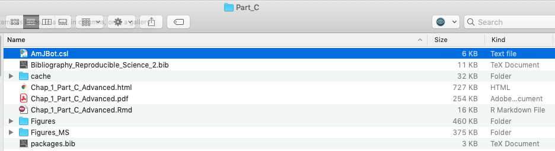
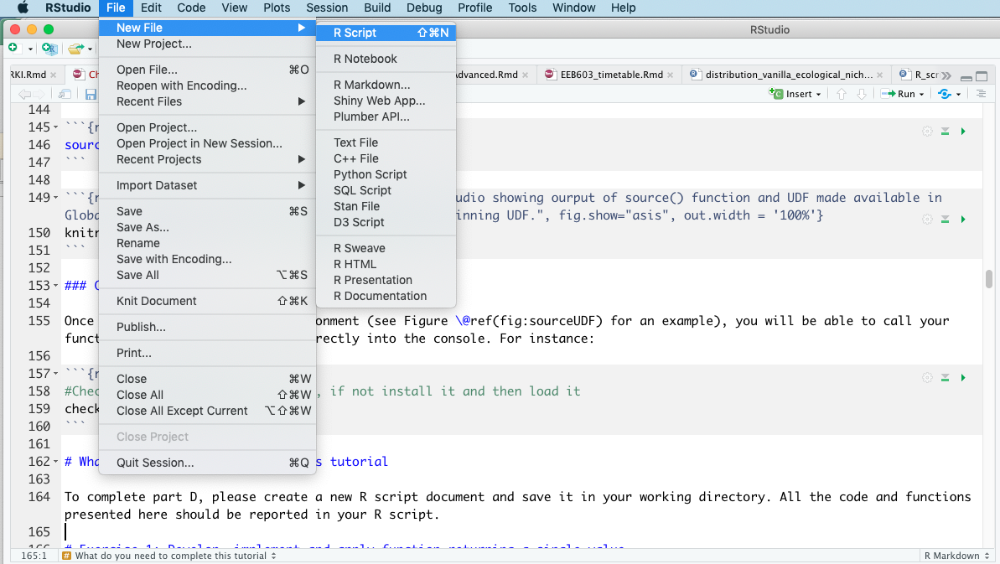
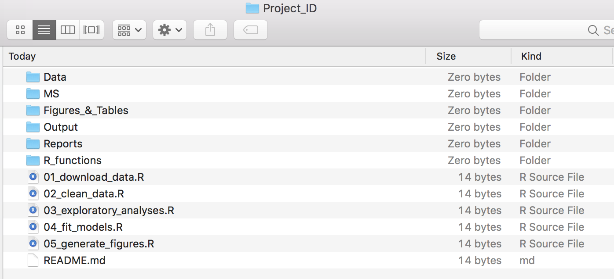

```{js logo-js, echo=FALSE}
$(document).ready(function() {
  $('#header').parent().prepend('<div id=\"logo\"></div>');
  $('#header').css('margin-right', '120px')
});
```

```{r packages, echo=FALSE, warning=FALSE, include=FALSE}
library(knitr)
library(rmarkdown)
library(bookdown)
#library(distill)
library(knitcitations)
library(formatR)
library(devtools)
library(kfigr)
library(dplyr)
library(kableExtra)
#library(learnr)

#Generate BibTex citation file for all R packages used to produce report
knitr::write_bib(.packages(), file = 'packages.bib')
```

```{r setup, include=FALSE, cache=FALSE, message = FALSE}
# Chunk options: see http://yihui.name/knitr/options/ ###

## Text results
#opts_chunk$set(echo = TRUE, warning = TRUE, message = TRUE, include = TRUE)

## Code decoration
opts_chunk$set(tidy = TRUE, tidy.opts = list(blank = FALSE, width.cutoff = 60), highlight = TRUE)

## Caching code
#opts_chunk$set(cache = 2, cache.path = "cache/")

## Plots
#opts_chunk$set(fig.path = "Figures_MS/", dev=c('pdf', 'png'), dpi = 300)

## Locate figures as close as possible to requested position (=code)
knitr::opts_chunk$set(fig.pos = 'H')
```

# Chapter 1

## Introduction

In this chapter, we will introduce the bioinformatic tools to write and disseminate reproducible reports as implemented in RStudio. More specifically, we will learn procedures to link and execute data and code into a unified environment (see Figure \@ref(fig:ReproScience)). This chapter focuses on learning the R Markdown syntax and protocols allowing to include text, code, figures, tables and bibliography into a document. This document will then be compiled into an output file (in either `pdf`, `HTML` or `Word` formats) allowing sharing your research. More specifically, this tutorial provides students with the minimum knowledge allowing them to complete their bioinformatic tutorials (PART 2) and individual projects (PART 3). The chapter will be subdivided into four parts as follows:

- [**PART A:**](#partA) Learning the basics.
- [**PART B:**](#partB) Tables, Figures and References.
- [**PART C:**](#partC) Advanced R Markdown settings.
- [**PART D:**](#partD) User Defined Functions in R.
- [**PART E:**](#partE) Interactive tutorials.

```{r ReproScience, echo=FALSE, fig.cap="The spectrum of reproducibility.", fig.show="asis", out.width = '100%'}
knitr::include_graphics("Figures/Fig1.png")
```

### Learning outcomes

This chapter provides students with opportunities to learn procedures to:

- Install R Markdown on your computer. 
- Create and render (or knitting) your first R Markdown document.
- Execute basic R Markdown syntax and protocols.
- Develop pseudocode and implement it using the R language.
- Create your own functions (referred to as user-defined functions).

### Files supporting this tutorial {#Files}

Although less used in PART A, a set of files are provided to support teaching of material presented in this chapter. These files are deposited in the shared Google Drive at this path: 
  
  + `Reproducible_Science/Chapters/Chapter_1/Tutorial_files`

Files are as follows:

- `EEB603_Syllabus_BUERKI.Rmd`: This is the `.Rmd` file used to compile the syllabus of this class. This file provides a good source of information for the syntax and protocols described in this tutorial.
- `Bibliography_Reproducible_Science_2.bib`: This file contains references cited in `BibTex` format. 
- `AmJBot.csl`: This citation style language (CSL) file allows formatting citations and bibliography following citation style of *American Journal of Botany*.
- `Bioinformatic workflow_PART2.pdf`: A `pdf` file containing the bioinformatic workflow taught in this class. This file will be used to learn how to incorporate a figure into R Markdown file.

### Install R Markdown software

Software and packages required to perform this tutorial are detailed below. Students should install those software and packages on their personal computers to be able to complete this course. Additional packages might need to be installed and the instructor will provide guidance on how to install those as part of the forthcoming tutorials.

- **R**: https://www.r-project.org
- **R packages**: `bookdown`, `knitr` and `R Markdown`. Use the following R command to install those packages:
```{r eval=F, tidy=TRUE}
install.packages(c("bookdown","knitr", "rmarkdown"))
```
- **RStudio**: https://www.rstudio.com/products/rstudio/download/
- **TeX**: This software is required to compile document into `pdf` format. Please install MiKTeX on Windows, MacTeX on OS X and TeXLive on Linux.

### RStudio

RStudio is an integrated development environment (IDE) that allows you to interact with R more readily. RStudio is similar to the standard RGUI, but it is considerably more user friendly. It has more drop-down menus, windows with multiple tabs, and many customization options (see Figure \@ref(fig:IDE)). Detailed information on using RStudio can be found at at [RStudio’s website](https://support.rstudio.com/hc/en-us/sections/200107586-Using-RStudio).

```{r IDE, echo=FALSE, fig.cap="Snapshot of the RStudio environment showing the four windows and their content.", fig.show="asis", out.width = '100%'}
knitr::include_graphics("Figures/IDE.png")
```

### Web resources

Please find below URLs to webpages that are providing key information for chapter 1:

- **R Markdown:** https://RMarkdown.rstudio.com
- **R Markdown: The Definitive Guide (by Yihui Xie, J. J. Allaire, Garrett Grolemund):** https://bookdown.org/yihui/RMarkdown/
- **Write HTML, PDF, ePub, and Kindle books with R Markdown:** https://bookdown.org
- **bookdown: Authoring Books and Technical Documents with R Markdown (by Yihui Xie):** https://bookdown.org/yihui/bookdown/
- **knitr:** http://yihui.name/knitr/
- **Pandoc: A universal document converter:** https://pandoc.org
- **Bibliographies and Citations in R Markdown:** https://RMarkdown.rstudio.com/authoring_bibliographies_and_citations.html
- **Tutorial on knitr with R Markdown (by Karl Broman):** http://kbroman.org/knitr_knutshell/pages/RMarkdown.html

## PART A: Learning the basics {#partA}

In this part, we will provide a survey of the procedures to create and render (or knitting) your first R Markdown document.

### Introduction to R Markdown

Markdown is a simple formatting syntax language used for authoring HTML, PDF, and MS Word documents, which is implemented in the `rmarkdown` package. An R Markdown document is usually subdivided into three sections (see Figure \@ref(fig:RMdown)):

1. **YAML metadata section:** This section provides high level information about the output format of the R Markdown file. Information stored in this section will be used by the Pandoc program to format the output document (see Figure \@ref(fig:RMdown)).
2. **Publication core text:** This section represents the core of your document/publication and uses Markdown syntax.
3. **Code chunk:** This section allows to import and analyze data as well as produce figures and tables that will be directly displayed in the output file. 

```{r RMdown, echo=FALSE, fig.cap="Example of an R Markdown file showing the three major sections.", fig.show="asis", out.width = '100%'}
knitr::include_graphics("Figures/Presentation_RMarkdown.png")
```

### Creating an R Markdown file

```{r RMdownscreen, echo=FALSE, fig.cap="Snapshot of window to create an R Markdown file.", fig.show="asis", out.width = '40%', fig.align="center"}
knitr::include_graphics("Figures/Create_RMarkdown.png")
```

To create an R Markdown document execute the following steps in RStudio:

1. Select: `File -> New File -> R Markdown...` 
2. Provide title for the document and define `Default output format` (see Figure \@ref(fig:RMdownscreen)).
If you want to knit your document in `pdf` format, a version of the `TeX` program has to be installed on your computer (see Figure \@ref(fig:RMdownscreen)). 
3. Save the `.Rmd` document (using `File -> Save As...`). Save this file in a new folder devoted to the project (**Warning:** Knitting the document will generate several files).

### Rendering (or knitting) an R Markdown document

To render or knit  your R Markdown document/script into the format specified in the YAML metadata section do the following steps in RStudio:

1. Select the `Knit` button (Figure \@ref(fig:RMdown)) in the upper bar of your window to render document.
2. There are several options depending on the output format; however if you just push the button it will automatically knit the document following settings provided in the YAML metadata section (Figure \@ref(fig:RMdown)).
3. The output file will automatically be created in the same directory as the `.Rmd` file. You can track progress in the `R Markdown` console. If the knitting fails, error messages will be printed in the `R Markdown` console (including information on which line of the script the error occurred, but it might not always be the case). Error messages are very useful to debug your R Markdown document.  

### <a name="compilation"></a>How does the knitting process work?

When you knit your document, R Markdown will feed the `.Rmd` file to the R *knitr* package, which executes all of the code chunks and creates a new markdown (`.md`) document. This latter document includes the code and its output (Figure \@ref(fig:Rflow)). The markdown file generated by `knitr` is then processed by the Pandoc program, which is responsible for creating the finished format (Figure \@ref(fig:Rflow)).

```{r Rflow, echo=FALSE, fig.cap="R Markdown flow.", out.width = '100%'}
knitr::include_graphics("Figures/rmarkdownflow.png")
```

### Basic R Markdown syntax and protocols

We will focus here on learning the syntax and protocols to produce:

- Headers. 
- Lists.
- Italicize and bold words.
- Embed code chunks and inline code.
- Check spelling.

More syntax are available in the R Markdown Reference Guide. You can access this document as follows in RStudio:

- Select: `Help -> Cheatsheets -> R Markdown Reference Guide`

**Notice:** The Cheatsheet section also allows accessing additional supporting documents related to R Markdown and Data manipulation. Those documents will be very useful for this class.

### Headers

Please find below the syntax to create headers (3 levels):

Syntax:
```{r eval=FALSE}
The "#" refers to the level of the header
# Header 1  
## Header 2  
### Header 3  
```  

### Lists

There are two types of lists:

- Unordered
- Ordered

#### Syntax for unordered lists

Syntax:

```{r eval=FALSE}
* unordered list
* item 2
  + sub-item 1
  + sub-item 2
```

**Note:** For each sub-level include two tabs to create the hierarchy.

Output:

* unordered list
* item 2
  + sub-item 1
  + sub-item 2   

#### Syntax for ordered lists

Syntax:
```{r eval=FALSE}
1. ordered list
2. item 2
   + sub-item 1
   + sub-item 2
```

Output:

1. ordered list
2. item 2
   + sub-item 1
   + sub-item 2

### Italicize and bold words

The following syntax will render text in italics or bold: 

```{r eval=FALSE}
#Syntax for italics
*italics*

#Syntax for bold
**bold**
```

### Embed code chunks and inline code

One of the most exciting features of working with the R Markdown format is the implementation of functions allowing to directly "plug" the output of R code into the compiled document (see Figure \@ref(fig:Rflow)). In other words, when you compile your `.Rmd` file, R Markdown will automatically run and process each code chunk and code lines and embed their results in your final document. If the output of the code is a table or a figure, you will be able to assign a label to this item (by adding information in the code chunk; see part B) and refer to it (= cross-referencing) in your `pdf` or `html` document. Cross-referencing is possible thanks to the `\@ref()` function implemented in the R `bookdown` package. 

#### Code chunk

A code chunk could easily be inserted in your document as follows:

- Using the keyboard shortcut **Ctrl + Alt + I** (OS X: **Cmd + Option + I**).
- Pressing on the `Insert` button  in the editor toolbar.
- Typing ```{r} and ````.

By default the code chunk will expect R code, but you can also insert code chunks supporting different computer languages (e.g. Bash, Python).

#### Chunk options

Chunk output can be customized with *knitr* options arguments set in the `{}` of a chunk header. In the examples displayed in Figure \@ref(fig:RChunk) five arguments are used:

- `include = FALSE` prevents code and results from appearing in the finished file. R Markdown still runs the code in the chunk, and the results can be used by other chunks.
- `echo = FALSE` prevents code, but not the results from appearing in the finished file. This is a useful way to embed figures.
- `message = FALSE` prevents messages that are generated by code from appearing in the finished file.
- `warning = FALSE` prevents warnings that are generated by code from appearing in the finished.
- `fig.cap = "..."` adds a caption to graphical results.

We will delve more into chunk options in part C of chapter 1, but in the meantime please see the R Markdown Reference Guide for more details. 

```{r RChunk, echo=FALSE, fig.cap="Example of code chunks.", out.width = '100%'}
knitr::include_graphics("Figures/code-1-options.png")
```

### Inline code

Code results can be inserted directly into the text of a `.Rmd` file by enclosing the code with ``r ``.

R Markdown will always:

- Display the results of inline code, but not the code.
- Apply relevant text formatting to the results.

As a result, inline output is indistinguishable from the surrounding text. **Warning:** Inline expressions do not take *knitr* options and is therefore less versatile. We usually use inline code to perform simple stats (e.g. 4x4; `r 4*4`)

### Check spelling

There are three ways to access spell checking in an R Markdown document in RStudio:

1. A spell check button  to the right of the save button.
2. `Edit > Check Spelling...`
3. The F7 key.

### Exercises

Students will work individually to complete the following exercises:

1. Create an `*.Rmd` file entitled `Exercises chapter 1: part A` and select `HTML` as output format.
2. Save this document as `Exe_chap1_partA.Rmd` in a sub-folder called `Exercises` located in:
  + `Reproducible_Science/Chapters/Chapter_1`
3. Practice syntax to do:
  + headers, 
  + lists, 
  + include R code chunk and inline code.
4. Confirm that your syntax works by knitting your document and inspecting the output.

To further learn syntax and protocols, please look at associated files provided by the instructor (see above for more details).

## PART B: Tables, Figures and References {#partB}

The aim of this tutorial is to provide students with the expertise to generate reproducible reports using *bookdown* [@R-bookdown; @bookdown2016] and allied R packages (see [Appendix 1] for a full list). Unlike functions implemented in the R *rmarkdown* package [@rmarkdown2018, which was better suited to generating `PDF` reproducible reports], *bookdown* allows to use ONE unified set of functions to generate `HTML` and `PDF` documents. In addition, the same approach and functions are used to process tables and figures as well as cross-reference those in the main body of the text. In this tutorial, we will also cover procedures to cite references in the text, automatically generate a bibliography/references section and format citations to journal styles as well as generating an Appendix containing citations of all R packages used to conduct your research (and produce the report).

### Learning outcomes

This tutorial is devoted to part B of chapter 1 and provides students with opportunities to learn procedures to:

- Set your R Markdown environment:
  + Install dependencies.
  + YAML metadata section.
  + Load required R packages.
  + Generate citation file of R packages used to produce the report.
  + Generate Appendix with citations for all R packages.
  + Generate Appendix with R package versions used to produce report.
- Insert tables and figures in R Markdown document. 
- Cross-reference tables and figures in the text.
- Cite references in the text and add a bibliography/references section.
- Format citations to journal styles.

### Associated files supporting this tutorial

Please refer to [section](#Files) for more details on supporting files and their locations on the shared Google Drive.

### Set your R Markdown environment

#### Install dependencies

To execute this tutorial the following R packages have to be installed on your computer using code provided below:

```{r pck, eval=FALSE, tidy=TRUE}
install.packages(c("knitr", "rmarkdown", "bookdown", "formattable", "kableExtra", "dplyr", "magrittr", "prettydoc", "htmltools", "knitcitations"))
```

#### TeX distribution

If you are planning to create `PDF` documents, you will need to install a `TeX` distribution on your computers. Please refer to this website for more details: https://www.latex-project.org/get/

##### Set MiKTeX for compiling PDF documents on Windows computers

Several students working on Windows computers shared difficulties in compiling `PDF` documents in RStudio. This issue is associated to `MiKTeX` preventing RStudio to install or update `TeX` packages required to knit your documents.

To solve this issue apply the following procedure:

1. Start `MiKTeX` console by searching and clicking `MiKTeX Console` in the application launcher.
2. Enable automatic package installation by:
  a. Clicking on `Settings` tab.
  b. Ticking the radio button `Always install missing packages on-the-fly` under the "You can choose whether missing packages are to be installed on-the-fly" header (\autoref{fig:MikTex}).
3. Restarting `RStudio` and you should be able to knit `pdf` documents.

```{r MikTex, echo=FALSE, fig.cap="Snapshot of the MikTex Console showing the procedure to always install packages on-the-fly.", out.width = '100%'}
knitr::include_graphics("Figures/MikTex.png")
```

#### YAML metadata section

The YAML metadata section allows users to provide arguments (refereed to as fields) to convert their R Markdown document into its final form. Here, we will be using functions implemented in the *knitr* [@R-knitr; @knitr2015] and *bookdown* packages [@R-bookdown; @bookdown2016] to define (field names as declared in the YAML metadata section are provided between parenthesis):

1. Title (`title`).
2. Subtitle (`subtitle`).
3. Author(s) (`author`).
4. Date (`date`).
5. Output format(s) (`output`).
6. Citations link (`link-citations`).
7. Font size (`fontsize`).
8. Bibliography file(s) (`bibliography`).
9. Format for citations to follow journal styles (`csl`).

The YAML code provided below outputs either an `HTML` or `PDF` document (see `output` field) with a table of content (see `toc` field) and generates in text citations and bibliography section as declared in the `AmJBot.csl` file (under the `csl` field).

```{r YAML, eval=FALSE, echo=TRUE}
--- 
title: 'Your title'
subtitle: "Your subtitle"
author: "Your name"
date: "`r Sys.Date()`"
output:
  bookdown::html_document2: 
    toc: TRUE
  bookdown::pdf_document2:
    toc: TRUE
link-citations: yes
fontsize: 12pt
bibliography: [Bibliography_Reproducible_Science_2.bib, packages.bib] 
csl: AmJBot.csl
---
```

**Warning:** `.bib` and `.csl` files have to be stored in the same working directory as your `.Rmd` file.

##### Step-by-step procedure

Do the following to set your YAML metadata section:

1. Create a new R Markdown document. 
2. Save the `.Rmd` document into a new project folder in `Reproducible_Science/Chapters/Chapter_1/`. 
3. Copy `Bibliography_Reproducible_Science_2.bib` and `AmJBot.csl` in your project folder. These files are available on the Shared Google Drive folder:
  + `Reproducible_Science/Chapters/Chapter_1/Tutorial_files`
4. Edit the YAML metadata section as shown in the above code.  

**Note:** 

- You can use `R` functions in the YAML metadata section using inline R code (see part A for more details). Here, we use `Sys.Date()` to automatically date the output document.
- The `bibliography` field includes two `BibTeX` files, the first contains your regular citations (of publications cited in the text; see [The bibliography file]), whereas the second is generated by `knitr::write_bib()` and contains citations for all R packages used to generate this report (see below for more details).

#### Knitting procedure

Since you have declared two output documents in the YAML metadata section and that those are specific to `bookdown` functions, you will have to select which output format you want to use to compile your document by clicking on the drop-down list on the left side of the `Knit` button (see Figure \@ref(fig:knitout)). To use `bookdown` functions, please make sure to select one of the following options (see Figure \@ref(fig:knitout)): `Knit to html_document2` or `Knit to pdf_document2`.

```{r knitout, echo=FALSE, fig.cap="Snapshot of RStudio console showing the drop-down list associated to Knit button.", out.width = "100%", fig.align='center', dpi=72, fig.pos= "H"}
knitr::include_graphics("Figures/knit_drop_down.png")
```

#### Load required R packages

It is best practice to add an R code chunk directly under the YAML metadata section to load all the required R packages used to produce your report. This feature will also allow to automatically generate a citation file with all R packages used to generate your report (see below). Applying this approach will contribute to improving the reproducibility of your research!   

##### Step-by-step procedure

1. Include an R code chunk directly under your YAML metadata section.
2. Name code chunk `packages` and set options line as follows:
  + `echo=FALSE`, 
  + `warning=FALSE`, 
  + `include=FALSE`.
3. Add the following code to load required packages to produce your report:

```
#Load packages
library(knitr)
library(rmarkdown)
library(bookdown)
library(formattable)
library(kableExtra)
library(dplyr)
library(magrittr)
library(prettydoc)
library(htmltools)
library(knitcitations)
library(devtools)
```
#### Generate citation file of R packages used to produce the report

I don't know about you, but I am always struggling to properly cite R packages in my publications. If you want to retrieve the citation for an R package, you can use the base R function `citation()`. For instance, citations for *knitr* can be obtained as follow:

```{r cit, eval=T, echo=TRUE}
#Generate citation for knitr
citation("knitr")
```

If you want to generate those latter citation entries in [BibTeX format], you can pass the returned object of `citation()` to `toBibtex()` as follows:

```{r cit2, eval=T, echo=TRUE}
#Generate citation for knitr in BibTex format
#Note that there is no citation identifiers. Those will be automatically generated in our next code. 
toBibtex(citation("knitr"))
```

To use citation entries generated from `toBibtex()`, you have to copy the output to a `.bib` file and save it in your working directory. You will then be able to cite references found in this document directly in your R Markdown. This can be done by adding the following code to your `packages` R code chunk:

```{r cit3, eval=F, echo=TRUE}
#Generate BibTex citation file for all R packages used to produce report
knitr::write_bib(.packages(), file = 'packages.bib')
```

The `.packages()` argument returns the names of all packages loaded in the current R session. This makes sure all packages being used will have their citation entries written to the `.bib` file. Finally, to be able to cite those references (see [Citation identifier]) in your text, the [YAML metadata section] has to be edited. See [Appendix 1] for a full list of references associated to the R packages used to generate this report. 

#### Generate Appendix with citations for all R packages

Although a bibliography/references section will be provided at the end of your document to cite in text references (see [References]), it is customed to add citations for all R packages used to generate the research in [Appendix 1]. We will learn here the procedure to assemble such Appendix.

##### Step-by-step procedure

1. Include Appendix after bibliography/references section.
  + This is done by using `<div id="refs"></div>` as shown below:
```{r eval=FALSE}
# References

<div id="refs"></div>

# (APPENDIX) Appendix {-}

# Appendix 1
```
2. Insert an R code chunk directly under `# Appendix` to read in and print citations saved in `packages.bib`. This is done as follows:
```{r generateBibliography1, eval=FALSE, echo=TRUE, warning = FALSE, message=FALSE}
###
#Load R package
###
library("knitcitations")
###
#Process and print citations in packages.bib
###
# Clear all bibliography that could be in the cash
cleanbib()
# Set pandoc as the default output option for bib
options("citation_format" = "pandoc")
#Read and print bib from file
read.bibtex(file = "packages.bib")
``` 
3. Edit your R code chunk options line as follows to correctly print out references:
`{r generateBibliography, results="asis", echo=FALSE, warning = FALSE, message=FALSE}`
4. Knit your code to check that it produces the right output (see [Knitting procedure]). See [Appendix 1] to get an idea of the output.

#### Generate Appendix with R package versions used to produce report

In addition to providing citations to R packages, you might also would like to provide full information on R package versions and your operating systems. With R, the simplest (but a useful and important) approach to document your R environment is to report the output of `sessionInfo()` (or `devtools::session_info()`). Among other information, this will show all the packages and their versions that are loaded in the session you used to run your analysis. If someone
wants to recreate your analysis, they will know which packages they will need to install, what versions and on which operating systems the code was executed. For instance, here is the output of `sessionInfo()` showing the R version and packages that I used to create this document:

```{r eval=T, echo=T}
sessionInfo()
```

I have also used the approach described above to add this information in [Appendix 2]. 

### All set, good to go!

We have now set our R Markdown environment and can start populating it! This means that you will be inserting your text and other code chunks directly under the `packages` code chunk. The [References] section constitutes the end of the main body of your document. If you want to add Appendices, do so under [Appendix 1], appendices will be labelled differently from the main body of the document.   

### Insert tables and figures in R Markdown document

#### Tables

There will be more details about figures in chapter 9; however this tutorial introduces key concepts related to table making in R Markdown, more specifically on the following topics:

- Creating a table in R. 
- Assigning a table caption.
- Providing a unique label to the R code chunk allowing further cross-referencing in the text.
- Displaying the table in the document.

##### Step-by-step protocol

Here, you will learn the R Markdown syntax and R code required to replicate the grading scale presented in the Syllabus (see Table \@ref(tab:tabgrades)):

```{r tabgrades, echo=F, fig.align='center'}
grades <- data.frame(Percentage = c("100-98","97.9-93", "92.9-90", "89.9-88", "87.9-83", "82.9-80", "79.9-78", "77.9-73", "72.9-70", "69.9-68", "67.9-60", "59.9-0"), Grade = c("A+","A","A-","B+","B","B-","C+","C","C-","D+","D","F"))
knitr::kable(grades, caption = "Grading scale applied in this class.") %>% kable_styling(c("striped","scale_down"))
```

1. Use the same `.Rmd` document as above to practice working with tables. 
2. Add a first-level header entitled `Tables`.
3. Insert an R code chunk under your header by clicking on the `Insert` button  in the editor toolbar.
4. Write the following R code in the code chunk:
```{r tabgrades2, eval=FALSE, echo=TRUE}
grades <- data.frame(Percentage = c("100-98","97.9-93", "92.9-90", "89.9-88", "87.9-83", "82.9-80", "79.9-78", "77.9-73", "72.9-70", "69.9-68", "67.9-60", "59.9-0"), Grade = c("A+","A","A-","B+","B","B-","C+","C","C-","D+","D","F"))
knitr::kable(grades, caption = "Grading scale applied in this class.") %>% kable_styling(c("striped","scale_down"))
```
5. Edit the code chunk options line by adding the following arguments (each argument should be separated by a comma):
  - `echo=FALSE`
6. Add the unique label `tabgrades` in the chunk options line (just after `{r`) to enable further cross-referencing.
7. Test your code to check that it produces the expected table (using the `Run` button). 
8. Knit your document using the `Knit` button  on the editor toolbar (remember to select your output format; Figure \@ref(fig:knitout)). 

#### Figures

There will be more details about figures in chapter 10; however this tutorial introduces key concepts related to figure making in R Markdown, more specifically on the following topics:

- Creating a figure in R (based on the `cars` dataset; Figure \@ref(fig:cars)). 
- Assigning a figure caption.
- Providing a unique label to the R code chunk allowing further cross-referencing in the text.
- Displaying the figure in the document.

```{r cars, echo=FALSE, results="hide", fig.cap="Plot of cars' speed in relation to distance.", out.width = '100%'}
summary(cars)
plot(cars)
```

##### Step-by-step protocol

Here, you will learn the R Markdown syntax and R code required to replicate Figure \@ref(fig:cars):

1. Use the same `.Rmd` document as above to practice working with figures. 
2. Add a first-level header entitled `Figures`.
3. Insert an R code chunk under your header by clicking on the `Insert` button  in the editor toolbar.
4. Write the following R code in the code chunk:
```{r eval=FALSE}
summary(cars)
plot(cars)
```
5. Edit the code chunk options line by adding the following arguments (each argument should be separated by a comma):
  - `echo=FALSE`
  - `results="hide"`
  - `fig.cap="Plot of cars' speed in relation to distance."`
  - `out.width = '100%'`
6. Add the unique label `cars` in the chunk options line (just after `{r`) to enable further cross-referencing.
7. Test your code to check that it produces the expected plot (using the `Run` button). 
8. Knit your document using the `Knit` button  on the editor toolbar (remember to select your output format; Figure \@ref(fig:knitout)). 

### Cross-reference tables and figures in the text

Cross-referencing tables and figures in the main body of your R Markdown document can easily be done using the `\@ref()` function implemented in  the *bookdown* package. 

#### General syntax

The general syntax is as follows:

```{r synt, eval=F}
# Cross-referencing tables in main body of text
\@ref(tab:code_chunk_ID)

# Cross-referencing figures in main body of text
\@ref(fig:code_chunk_ID)
```

#### Step-by-step procedure

To cross-reference the `tabgrades` table type:

`\@ref(tab:tabgrades)`, which translates into \@ref(tab:tabgrades).

To cross-reference the `cars` figure type:

`\@ref(fig:cars)`, which translates into \@ref(fig:cars).

Note the this syntax doesn't automatically include the `Table` or `Figure` handles in front of the cross-reference. You will have to manually add `Table` or `Figure` in front of your `\@ref()` function.

### Citing references in text and adding a bibliography/references section

#### The bibliography file

To cite references in the R Markdown document those have to be saved in a bibliography file using the `BibTeX` format. Other formats can be used, but the `BibTeX` format is open-source and easy to edit. Please see this webpage for more details on other formats: https://rmarkdown.rstudio.com/authoring_bibliographies_and_citations.html
 
Most journals allow saving citation of publications directly in `BibTeX` format, but when this feature is not available formats can be converted using online services (e.g. EndNote to BibTeX: https://www.bruot.org/ris2bib/).

##### Procedure to do prior to citing references in an R Markdown document  

1. Save all your `BibTeX` references in a text file and make sure to add the `.bib` extension. 
2. This file has to be deposited in the same folder as your `.Rmd` file.
3. You will be inserting the name of your references file in the [YAML metadata section].
4. You can visit this [webpage](https://academic.oup.com/botlinnean/article/186/4/435/4736317?searchresult=1) and click on the `Cite` icon to download a citation in `.bibtex` format. More details on the `BibTeX` format is provided below.
5. References formatted in `BibTeX` format are available in associated file: 
  + `Bibliography_Reproducible_Science_2.bib`.

#### Specifying a bibliography in the R Markdown file

The Pandoc program can automatically generate citations in the text and a bibliography/references section following various journal styles. In order to use this feature, you need to specify a bibliography file in the [YAML metadata section]. 

#### BibTeX format

Please find below an example of a reference formatted in `BibTeX` format:

```{r eval=FALSE}
# Example of BibTex format for Baker (2016) published in Nature
@Article{Baker_2016,
  doi = {10.1038/533452a},
  url = {https://doi.org/10.1038/533452a},
  year = {2016},
  month = {may},
  publisher = {Springer Nature},
  volume = {533},
  number = {7604},
  pages = {452--454},
  author = {Monya Baker},
  title = {1,500 scientists lift the lid on reproducibility},
  journal = {Nature},
}
```

#### Citation identifier

The unique citation identifier of a reference (`Baker_2016` in the example above) is set by the user in the `BibTeX` citation file (see first line in the example provided above). This unique identifier is used to refer to the reference/publication in the R Markdown document and also allows citing references and generating the bibliography/references section. 

#### Citing references

Citations go inside square brackets (`[]`) and are separated by semicolons. Each citation must have a key, composed of `@` + the citation identifier (see above) as stored into the `BibTeX` file. 

Please find below some examples on citation protocols:

```{r eval=FALSE}
#Syntax
Blah blah [see @Baker_2016, pp. 33-35; also @Smith2016, ch. 1].
Blah blah [@Baker_2016; @Smith2016].
```

Once knitted (using the  button), the above code/syntax turns into:

Blah blah [see @Baker_2016, pp. 33-35; also @Smith2016, ch. 1].

Blah blah [@Baker_2016; @Smith2016].

A minus sign (-) before the `@` will suppress mention of the author in the citation. This can be useful when the author is already mentioned in the text:
```{r eval=FALSE}
#Syntax
Baker says blah blah [-@Baker_2016].
```

Once knitted, the above code/syntax turns into:

Baker says blah blah [-@Baker_2016].

You can also write an in-text citation, as follows:
```{r eval=FALSE}
#Syntax
@Baker_2016 says blah.
@Baker_2016 [p. 1] says blah.
```

Once knitted, the above code/syntax turns into:

@Baker_2016 says blah.

@Baker_2016 [p. 1] says blah.

##### Practice citing references

Students have to use their `.Rmd` document to practice citing references in the text using procedures described above. To clearly define where you practice citing references, please do so under a `Citing references` header. 

### Adding a bibliography/references section

Upon knitting, a bibliography/references section will be automatically generated at the end of the document. Usually, we recommend adding a References header just after the last paragraph of the document as displayed below:

```{r eval=FALSE}
last paragraph...

# References
```

The bibliography will be inserted after this header (please see References section of this tutorial for more details).

#### Formatting citations to journal styles

In this section, we are studying how your bibliography can be automatically formatted following a journal style. This is achieved by providing the name of a citation style file (containing the protocol to format citations and bibliography following a journal style) in the YAML metadata section.  

#### What is the citation style language (CSL)?

The **C**itation **S**tyle **L**anguage (CSL) was developed by an open-source project and aims at facilitating scholarly publishing by automating the formatting of citations and bibliographies. This project has developed the CSL and maintains a crowd sourced repository with over 8000 free CSL citation styles. Please see the following website for more details: https://citationstyles.org

#### CSL repositories

There are two main CSL repositories: 

- **GitHub Repository:** https://github.com/citation-style-language/styles
- **Zotero Style Repository:** https://www.zotero.org/styles

#### How to use a CSL file in an R Markdown to format citations and bibliography?

Please follow the steps below to format your citations and bibliography following the citation style provided in a CSL file:

1. Download the CSL file using repositories provided above. Some journals provide their CSL files on their websites (one has been made available for you to use in the associated files: `AmJBot.csl`).
2. Save the CSL file in the same working directory as the `.Rmd` file.
3. Edit the YAML metadata section as follows to specify the CSL file:
```{r eval=FALSE}
# Add a "csl" argument and provide name of the CSL file (here AmJBot.csl) 
---
title: "Sample Document"
output:
  bookdown::html_document2: 
    toc: TRUE
  bookdown::pdf_document2:
    toc: TRUE
bibliography: bibliography.bib
csl: AmJBot.csl
---
```
4. Knit the R Markdown document using the `Knit`  button. The Pandoc program will use the information stored in the YAML metadata section to format the bibliography (citations and bibliography section) following the citation style provided in the CSL file. Do not forget to add a `References` header at the end of your `.Rmd` document.

## PART C: Advanced R and R Markdown settings {#partC}

### Learning outcomes

This tutorial is devoted to part C of chapter 1 and provides students with opportunities to learn procedures to:

- Set your working directory.
- Set global options for code chunks related to:
  + text,
  + code decoration,
  + caching,
  + plots (output format and resolution),
  + positioning figures (close to associated code chunks).

### Associated files supporting this tutorial

Please refer to [section](#Files) for more details on supporting files and their locations on the shared Google Drive.

### Set your working directory

Unlike R scripts where you have to set your working directory or provide the path to your files, the approach implemented in R Markdown document (`.Rmd`) automatically sets your working directory to the location of your `.Rmd` file. This procedure is done by `knitr` functions. `knitr` expects all declared files to be located in the same path as your `.Rmd` file or in a subfolder within this working directory. The main reason for this approach is to maximize portability of your R Markdown project, which is usually composed of a set of files (see Figure \@ref(fig:projstr)). 

```{r projstr, echo=FALSE, fig.cap="Snapshot of the project structure associated to part C of Chapter 1. External figures used in the document are in Figures, whereas those generated by the document are saved in Figures MS.", out.width = "100%", fig.align='center', dpi=72}

```

#### Instructions to setup your working directory

Before knitting your document, you will be testing your code and this requires to set your working directory. The can be done in RStudio by clicking (see Figure \@ref(fig:setwd)):

`Session --> Set Working Directory --> To Source File Location`

```{r setwd, echo=FALSE, fig.cap="Snapshot of RStudio showing procedure to set your working directory to allow testing your code prior to knitting.", out.width = "100%"}
knitr::include_graphics("Figures/Setwkd.png")
```

### Set global options for code chunks

To improve code reproducibility and efficiency and to follow publication requirements, it is customed to include a "code chunk" at the beginning of your `.Rmd` file to set global options applying to the whole document. Those settings are related to the following elements of your code:

- text results.
- code decoration.
- caching code.
- plots (or figures).
- positioning figures.

These general settings will be set using the `opts_chunk()` function implemented in `knitr` [@R-knitr]. The following website contains valuable information on code chunk options:

- https://yihui.name/knitr/options/

#### The opts_chunk$set() function

The `knitr` function `opts_chunk$set()` is used to change the default global options in an `.Rmd` document. 

Before starting, a few special notes should be known on the options:

1. Chunk options must be written in one line; no line breaks are allowed inside chunk options.
2. Avoid spaces and periods (`.`) in chunk labels and directory names.
3. All option values must be valid R expressions just like how we write function arguments.

Here we will be discussing each part of the settings individually, but those will have to be merged into one code chunk in your document entitled `setup` (please see below for more details). 

#### Text results

This section deals with settings related to text results generated by code chunks.

Please find below an example of options that could be applied across code chunks:

```{r echo= TRUE, eval=FALSE}
# Setup options for text results
opts_chunk$set(echo = TRUE, warning = TRUE, message = TRUE, include = TRUE)
```

##### Explanations of the text results options 

- `echo = TRUE`: Include all R source codes in the output file.
- `warning = TRUE`: Preserve warnings (produced by `warning()`) in the output like we run R code in a terminal.
- `message = TRUE`: Preserve messages emitted by `message()` (similar to warning)
- `include = TRUE`: Include all chunk outputs in the final output document.

If you want some of the text results to have different options, please adjust those in their specific code chunks. This comment is valid for all the other general settings.

#### Code decoration

This section deals with settings related to code decoration (i.e. how it is outputted in the final `pdf` document) generated by code chunks.

Please find below an example of options that could be applied across code chunks:

```{r echo= TRUE, eval=FALSE}
# Setup options for code decoration
opts_chunk$set(tidy = TRUE, tidy.opts = list(blank = FALSE, width.cutoff = 60), highlight = TRUE)
```

##### Explanations of the code decoration options 

- `tidy = TRUE`: Use `formatR::tidy_source()` to reformat the code. Please see `tidy.opts` below.
- `tidy.opts = list(blank = FALSE, width.cutoff = 60)`: This provides a list of options to be passed to the function determined by the `tidy` option. Here we format the code to avoid blank lines and with a width cutoff of 60 characters. 
- `highlight = TRUE`: This highlights the source code.

#### Caching code

To compile your `.Rmd` document faster (especially if you have computing intensive tasks), you can cache the output of your code into files associated to each of your code chunks. This process allows compute intensive chunks to be saved and the output used later without being re-run. 

The *knitr* package has options to only evaluate cached chunks when necessary, but this has to be set by users. Such procedure creates a unique MD5 digest (= a data storage technique) of each chunk to track when changes are present. When the option `cache=TRUE` (there are other, more granular settings; see below), the chunk will only be evaluated in the following scenarios:

- There are no cached results (either this is the first time running or the results were moved/deleted).
- The code chunk has been modified.

The following code allows implementing this procedure to your document:

```{r echo= TRUE, eval=FALSE}
# Setup options for code cache
opts_chunk$set(cache = 2, cache.path = "cache/")
```

##### Explanations of the caching code options 

- Besides `TRUE` and `FALSE` for the chunk option `cache`, advanced users can also consider more granular cache by using numeric values for `cache = 0, 1, 2, 3`. `0` means `FALSE`, and `3` is equivalent to `TRUE`. For `cache = 1`, the results of the computation are loaded from the cache, so the code is not evaluated again, but everything else is still executed, such the output hooks and saving recorded plots to files. For `cache = 2` (used here), it is very similar to `1`, and the only difference is that the recorded plots will not be re-saved to files when the plot files already exist, which might save some time when the plots are big.
- `cache.path = "cache/"`: Directory where cache files will be saved. You don't have to create the directory before executing the code, it will be created automatically by *knitr*.  

#### Plots

Plots are a major element of your research and they are at the core of your figures. We can take advantage of options implemented in the `knitr` package to output plots meeting publication requirements. This will save precious time during the writing phase of your research (= no need to fiddle with the size and resolution of figures to meet journal policies).

Please find below an example of options that could be applied across code chunks:

```{r echo= TRUE, eval=FALSE}
# Setup options for plots
opts_chunk$set(fig.path = "Figures_MS/", dev=c('pdf', 'png'), dpi = 300)
```

##### Explanations of the caching plots options 

- `fig.path = "Figures_MS/""`: Set directory to save figures generated by the R Markdown document. As above, this folder doesn't need to exist prior to executing the code chunks. Files will be save based on code chunk title and assigned figure number.
- `dev = c('pdf', 'png')`: Save figures in both `pdf` and `png` formats.
- `dpi = 300`: The DPI (dots per inch) for bitmap devices (dpi * inches = pixels). Please look at publishing requirements to set this parameter appropriately.

It is worth noting that you might be using external figures in your `.Rmd` document. To avoid confusions between figures generated by the `.Rmd` document and those coming from outside, it is best practice to have them saved in two different subfolders (see Figure \@ref(fig:projstr) for more details). 


##### Additional plots options

Some journals have specific requirements on figure dimensions. You can easily set these by using the following option:

- `fig.dim`: (NULL; numeric) if a numeric vector of length 2, it gives `fig.width` and `fig.height`, e.g., `fig.dim = c(5, 7)`.

#### Positioning figures

Positioning figures close to their code chunks is critical and can get sorted by adding another `opts_chunk$set()` code line in your `setup` R code chunk. This is done by invoking the `fig.pos` argument and setting it to `"H"`. **Warning:** Setting this argument might generate errors when documents are knitted as `pdf` documents. If it happens, please comment this line using `#` and knit again.  

```{r echo= TRUE, eval=FALSE}
## Locate figures as close as possible to requested position (=code)
opts_chunk$set(fig.pos = "H")
```

### Applying global changes to all code chunks

In this section, we will collate all global settings discussed above into a code chunk entitled `setup`, which will be placed under the YAML metadata section. In addition to containing the global settings, it is advisable to also include a code section devoted to loading required R packages in the `setup` code chunk. 

Please find below the code for the `setup` code chunk based on the options presented above:

```{r echo= TRUE, eval=FALSE}
#Load packages

## Add any packages specific to your code
library("knitr")
library("bookdown")

# Chunk options: see http://yihui.name/knitr/options/ ###

## Text results
opts_chunk$set(echo = TRUE, warning = TRUE, message = TRUE, include = TRUE)

## Code decoration
opts_chunk$set(tidy = TRUE, tidy.opts = list(blank = FALSE, width.cutoff = 60), highlight = TRUE)

## Caching code
opts_chunk$set(cache = 2, cache.path = "cache/")

## Plots
opts_chunk$set(fig.path = "Figures_MS/", dev=c('pdf', 'png'), dpi = 300)

## Locate figures as close as possible to requested position (=code)
opts_chunk$set(fig.pos = "H")
```

#### Settings of the `setup` R code chunk 

When inserting the above code into an R code chunk, please set the options of the chunk as follows:

- `setup`: Unique ID of the code chunk.
- `include = FALSE`: Nothing will be written into the output document, but the code will be evaluated and plot files will be generated (if there are any plots in the chunk).
- `cache = FALSE`: Code chunk will not be cached (see above for more details).
- `message = FALSE`: Messages emitted by `message()` will not be preserved. 

Options (and their associated arguments) in the code chunk have to be separated by commas.

### An exercise to work on learning objectives 

Please conduct the above exercise to get accustomed with the material presented in the tutorial. This exercise is divided into six steps as follows:

1. Open RStudio, create and save a `.Rmd` document (**Tip:** save the file in a new folder).
2. Set your working directory according to file location.
3. Insert an R code chunk (using the `Insert`  button) and entitle it `setup`. This code chunk will be used to define the global settings for the following options as implemented in the `opts_chunk$set()` function:
  - Text results.
  - Code decoration.
  - Caching code.
  - Plots.
  - Positioning of figures.
4. Use the R code provided below (which generates a plot) to learn more about the effect of global settings on code outputs.
5. Once the file is completed, compile your document using the `Knit`  button. Please pay attention to the outputs in your folder.
6. Use the `bookdown` `\@ref()` function to cite your figure/plot in the text.

### An R code to generate a plot & cross-reference it in text

The R code provided below is associated to step 4 of the exercise and it produces the plot displayed in Figure \@ref(fig:PlotFig).

```{r PlotFig, echo=FALSE, results="hide", fig.cap="Plot of y ~ x."}
# Generate a set of observations (n=100) that have a normal distribution
x <- rnorm(100)

# Add a small amount of noise to x to generate a new vector (y)
y <- jitter(x, 1000)

# Plot y ~ x
plot(x, y)
```

To get there:

1. Insert an R code chunk (using the `Insert`  button) and set the following options and associated arguments:

- `Plot`: Unique ID of code chunk.
- `fig.cap="Plot of y ~ x."`: Figure caption.
- `fig.show="asis"`: Figure display.
- `out.width = '100%'`: Figure width on the page.

2. Enter the following R code in the code chunk.

```{r Plot2, eval = FALSE}
# Generate a set of observations (n=100) that have a normal distribution
x <- rnorm(100)

# Add a small amount of noise to x to generate a new vector (y)
y <- jitter(x, 1000)

# Plot y ~ x
plot(x, y)
```

3. Test your code to make sure it does what it is supposed to do (using the `Run`  button).
4. Go to step 5 in the above section and complete the exercise.

## PART D: User Defined Functions in R {#partD}

### Learning outcomes

This tutorial provides students with opportunities to gain the following skills by:

- Defining what is a function and its applicability.
- Learning the syntax to implement user-defined functions in R.
- Learning R specific functions associated to producing and loading functions: `return()`, `source()`.
- Providing some background on R lists (`list()`) and their applicability to functions returning multiple values.
- Developing, implementing and applying user-defined functions returning single and multiple values.
- Learning protocols to implement defensive programming to your code.

### What do you need to complete this tutorial?

To complete part D, please create a new R script document (Figure \@ref(fig:Rscript)) and save it in your working directory. All the code and functions presented here should be reported in your R script. 

```{r Rscript, echo=FALSE, fig.cap="Snapshot of RStudio showing procedure to create a new R script document.", fig.show="asis", out.width = '100%'}

```

### Introduction

This tutorial aims at providing an introduction to functions, more specifically, we will be studying the user defined functions (UDFs) as implemented in R. UDFs allow users to write their own functions and make them available in the R Global Environment (using the `source()` function) or ultimately in [R packages](https://r-pkgs.org). 

To gain this knowledge, students will be conducting three exercises to learn about the following topics:

1. Develop, implement and apply function returning a single value.
2. Develop, implement and apply function returning multiple values.
3. Implement defensive programming to your code to support debugging.

To show the broad applications of the teaching material, we will be using mathematical examples. Before delving into these topics, the instructor is providing some general context and touch upon what a function is and when it is best applied as well as best practices to write pseudocode/code (more during Chapter 4) and approaches to calling R functions.

### What is a function?

In programming, you use functions to incorporate sets of instructions that you want to use repeatedly or that, because of their complexity, are better self-contained in a sub program and called when needed. **A function is a piece of code written to carry out a specified task**; it can or can not accept arguments or parameters and it can or can not return one or more values.

### Functions in R

There exist many terms to define and express functions, subroutines, procedures, method, etc., but for the purposes of this tutorial, you will ignore these distinctions, which are often semantic and reminiscent of other older programming languages (see here for more details on [semantics](http://programmers.stackexchange.com/questions/123159/what-are-the-specific-meanings-of-the-terms-functions-methods-procedures-and?rq=1)). In our context, those definitions are less important, because in R we only have functions.

#### R syntax for function

In R, according to the base documentation, you define a function with the following construct:

```{r Rfuncsyntax, echo=TRUE, eval=FALSE}
 function(arglist){
   body
   }
```

The code between the curly braces is the `body` of the function. 

When you use built-in functions, the only thing you need to worry about is how to effectively communicate the correct input arguments (`arglist`) and manage the return value(s), if there are any. To know more about arguments associated with a specific function you can access its documentation by using the following syntax (entered in the R console):

```{r echo=TRUE, eval=F, tidy=F}
#General syntax
?function() 

#Example with read.csv()
?read.csv()
```

#### User defined functions (UDFs) in R

R allows users to define their own functions, which are based on the following syntax:

```{r eval=FALSE, tidy = FALSE}
function.name <- function(arguments){
   computations on the arguments
   some more code
   return values
}
```

So, in most cases, a function has a name (here `function.name`), some arguments (here `arguments`) used as input to the function (declared within the `()` following the keyword ‘function’); a body, which is the code within the curly braces `{}`, where you carry out the computation; and can have one or more return values (the output). You define the function similarly to variables, by “assigning” the directive `function(arguments)` to the “variable” `function.name`, followed by the rest.

### Best practice to writing code

This topic will be covered in chapter 4, but here is an outline of the best practice to write code and functions in R. **Before delving into code writing, we will usually work on developing a pseudocode, which aims at providing a high-level description of the tasks that will have to be performed by the function.** Once this job done, we will then start writing the code by turning the tasks identified into the pseudocode into real R code. This will be done by searching for existing R functions allowing to execute each task described in the pseudocode and if they don't exist develop new functions (this task might require some additional pseudocode). Please find below more detailed definitions of the two concepts described here. 

#### Writing pseudocode

Pseudocode is an informal high-level description of the operating principle of a computer program or other algorithm. It uses the structural conventions of a normal programming language (here R), but is intended for human reading rather than machine reading. Here, you will establish the big steps (and their associated tasks) and tie R functions (existing or that have to be made) to those steps. This provides the backbone of your code and will support writing it.  

#### Writing code

Writing clear, reproducible code has (at least) three main benefits. Firstly, it makes returning to the code much easier a few months down the line; whether revisiting an old project, or making revisions following peer review. Secondly, the results of your analysis are more easily scrutinized by the readers of your paper, meaning it is easier to show their validity. Thirdly, having clean and reproducible code available can encourage greater uptake of new methods that you have developed.

### Loading and calling UDFs

When you will be working on your project, it is highly likely that you will have developed multiple UDFs tailored to your research. In this case, it would be appropriate to create a new folder entitled `R_functions`, which will be located in the same directory as your R scripts (see Figure \@ref(fig:Structure)). Save all your UDFs as independent files (e.g. `check.install.pkg.R`) into the `R_functions` folder.

```{r Structure, echo=FALSE, fig.cap="Example file structure of a simple analysis project. See Chapter 4 for more details", fig.show="asis", out.width = '100%'}

```

#### The `source()` function: Read R code from a file

Once your project will be properly structured (see Figure \@ref(fig:Structure)), it will be easy to call specific UDFs into any R script by using the `source()` function.

For instance, to load the `check.install.pkg()` (saved in `R_functions/check.install.pkg.R`) into the Global Environment enter the following code into the R console (see Figure \@ref(fig:sourceUDF)):

```{r echo=TRUE, eval=T}
source("R_functions/check.install.pkg.R")
```

```{r sourceUDF, echo=FALSE, fig.cap="Snapshot of RStudio showing output of source() function and the UDF made available in the Global Environment. You can also view the code unperpinning the UDF.", fig.show="asis", out.width = '100%'}
knitr::include_graphics("Figures/source_view.png")
```

### Call your UDFs

Once loaded into your Global Environment (see Figure \@ref(fig:sourceUDF) for an example), you will be able to call your functions by typing their names directly into the console. For instance:

```{r echo=TRUE, eval=T}
#Check if ape package is installed, if not install it and then load it
check.install.pkg(pkg=c("knitr"))
```

### Exercise 1: Develop, implement and apply function returning a single value

In this exercise, we will be working on developing a function that returns a single value, but how do we tell our UDF to return the value? In R, this task is accomplished with the `return()` function.

#### Aim

Develop, implement and apply a UDF to calculate the square of a number. 

In math, the squared symbol ($^2$) is an arithmetic operator that signifies multiplying a number by itself. The “square” of a number is the product of the number and itself. Multiplying a number by itself is called “squaring” the number.

#### Pseudocode

Although straightforward, the function will have to execute the following tasks:

1. Store number inputted by user into an object entitled `base` as part of the argument(s) of the function.  
2. Infer square of `base` by multiplying number by itself.
3. Save output of task 2 into an object called `sq`.
4. Return `sq` object to user (here a single value). To return `sq`, we will be using the `return()` function.

This also means that the class of the **input** provided by user has to be **numeric** and the **output** will also be **numeric**. We will further discuss this topic during the third exercise. The class of an object can be checked by using the `class()` function. Note: This function will be useful for implementing defensive programming.

#### Turning your pseudocode into a function

In this section, we will implement the pseudocode proposed above into a function entitled `square_number()`. This function requires one argument from the user (`base`, which is a number) and returns the square of that number (here square of `base` = `base`*`base`). 

```{r echo=TRUE, eval=T}
## Create a UDF in R to calculate square number:

# - argument: base (= one number)

# - output: square of base (= one number)
square_number <- function(base){
  #Infer square of base and save it into object
  sq <- base*base
  
  #Return sq
  return(sq)
}
```

Write the code associated to the `square_number` into your new R script (saved in your working directory) and load function by executing all lines associated to function. Please carry on populating this document with the rest of the exercises.

#### Loading your function into the Global Environment

Before being able to use your UDF, execute the code associated to the `square_number()` function in the console. The UDF should now be loaded in the Global Environment and therefore be available for use. To verify that the UDF is loaded, please check the Environment panel in RStudio (see Figure \@ref(fig:envir)).

```{r envir, echo=FALSE, fig.cap="Close-up of the Environment panel in RStudio showing that the UDF is loaded in the Global Environment and can be used.", fig.show="asis", out.width = '100%'}
knitr::include_graphics("Figures/Environment_RStudio.png")
```

#### Applying your function

The R language is quite flexible and allows functions to be applied to a single value (e.g. `base = 2`) or a vector (e.g. `base = c(2,4,16,23,45)`). Please see below for more example:

1. Apply function to one value:

```{r echo=TRUE, eval=T}
#Square number of 2
square_number(base = 2)
```

2. Apply function to a vector containing multiple values:

```{r echo=TRUE, eval=T}
#Create vector with numbers
bases <- c(2,4,16,23,45)

#Apply function to vector
square_number(base = bases)
```

### Exercise 2: Develop, implement and apply function returning multiple values

In our previous exercise we developed a function returning only one value. As part of your research, there will be multiple instances where you will be performing multiple actions onto your data, which will call for multiple values to be outputted by the function. To do so, we will be **harvesting the different outputs of the function into a list, which will be returned to the users** (using `return()`).

#### What is a list in R?

Lists are R objects containing elements of different types such as numbers, strings, vectors or another list inside it. A list can also contain a matrix or a function as its elements. Lists are created using the `list()` function.

#### Creating a list

Find below an example to create a list containing strings, numbers, vectors and a logical values:

```{r echo=TRUE, eval=T}
#Create a list containing strings, numbers, vectors and a logical value
list_data <- list("Red", 51.3, 72, c(21,32,11), TRUE)

#Print object
print(list_data)
```

#### Naming list elements

The list elements can be given names and they can be accessed using these names (see below):

```{r echo=TRUE, eval=T}
# Create a list containing a vector, a matrix and a list
list_data <- list(c("Jan","Feb","Mar"), matrix(c(3,9,5,1,-2,8), nrow = 2),
   list("green",12.3))

# Give names to the elements in the list
names(list_data) <- c("1st_Quarter", "A_Matrix", "An_inner_list")

# Show the list
print(list_data)
```

#### Accessing list elements

Elements of the list can be accessed by the index of the element in the list. In case of named lists it can also be accessed using the names. We use the same example as above to illustrate procedure to access list elements:

```{r echo=TRUE, eval=T}
# Create a list containing a vector, a matrix and a list
list_data <- list(c("Jan","Feb","Mar"), matrix(c(3,9,5,1,-2,8), nrow = 2), list("green",12.3))

# Give names to the elements in the list
names(list_data) <- c("1st_Quarter", "A_Matrix", "An_inner_list")

# Access the first element of the list
print(list_data[1])

# Access the thrid element. As it is also a list, all its elements will be printed
print(list_data[3])

# Access the list element using the name of the element
print(list_data$A_Matrix)
```

#### Let's go back to our exercise

Now that you have more knowledge about list objects, we will be working on an **exercise aiming at developing and implementing a UDF to calculate the log and square of a number**.

#### Pseudocode and associated UDF

Each student is tasked to:

1. Develop a pseudocode to execute the UDF.
2. Implement the pseudocode into a UDF.
3. Apply and test your code/function.

#### Solution proposed by the instructor

Please find below the solution proposed by the instructor:

```{r echo=TRUE, eval=T}
##Create a user defined function in R to calculate log and square of a number:

# argument: base (= one number)

# output: log and square of base (= two numbers) returned in a list
my_log_square <- function(base){
  #log (base 10)
  log_value <- log(base)
  #Square of base
  square_value <- base^2
  
  #Return both objects
  return(list(log_val = log_value, square_val = square_value))
}

# Call the function
my_log_square(base = 2)
```

### Exercise 3: Implement defensive programming to your code to support debugging

#### Background information and examples

Defensive programming is a technique to ensure that code fails with well-defined errors, i.e. where you know it should not work. **The key here is to ‘fail fast’ and ensure that the code throws an error as soon as something unexpected happens**. This creates a little more work for the programmer, but it makes debugging code a lot easier at a later date.

In order to demonstrate how to apply defensive programming to your code, a new function will be defined:

```{r echo=TRUE, eval=T}
# Define a power function (exp_number): y = x^n

# - Arguments: base (= x) and power (= n)

# - Output: a number (y)
exp_number <- function(base, power) {
        exp <- base^power
        return(exp)
}

# Call function
exp_number(base = 2, power = 5)
```

You can employ defensive programming on the `exp_number` function defined above. The function requires that both arguments are of class numeric, if you were to provide a string (e.g. a word) as input, you would get an error:

```{r echo=TRUE, eval=T, error=TRUE}
#Example where we don't respect the class associated with the argument base
exp_number(base = "hello", power = 5)
```

If you add in a line of code to test the data type of the inputs, you get a more meaningful error.

```{r echo=TRUE, eval=T, error=TRUE}
# Define a power function (exp_number): y = x ^n

# - Arguments: base (= x) and power (= n)

# - Output: a number (y)
exp_number <- function(base, power) {
    # This if statement tests if classes of base and power are numeric.
  
    # If one of them is not numeric it stops and return meaningful message
    if(class(base) != "numeric" | class(power) != "numeric"){
          stop("Both base and power inputs must be numeric")
    }
    exp <- base^power
    return(exp)
}

# Call function
exp_number(base = "hello", power = 5)
```

Although in this case debugging the error would not have taken long, in more complicated functions you are likely to either have less meaningful error messages, or code that runs for some time before it fails. By applying defensive programming and adding in these checks to the code, you can find unexpected behavior sooner and with more meaningful error messages.

#### Your turn to implement defensive programming

Update `my_log_square()` to verify the class of `base` argument and print a meaningful error message if the class is not numeric.


## PART E: Interactive tutorials {#partE}

The objective of this section is to provide students with some tools and ideas to design their bioinformatic tutorials (for PART 2). Here, students will have an overview of the tools implemented in the R package [*learnr*](https://rstudio.github.io/learnr/index.html), which was developed to produce interactive tutorials. Although developed in R, the interactive tutorials are designed to be conducted in web browsers (but it could also be entirely done within RStudio).

The interactive tutorial presented here is subdivided into five topics:

1. **Introduction**: This part sets the scene and provides some background information on the tutorial.
2. **Exercise**: The aim of the exercise is presented together with a pseudocode (with associated R functions) outlying steps to design and implement an R code to complete the exercise. Students are asked to develop their R codes and execute them in the code chunk. You can type your code directly in the window/console and execute it using the `R Code` button. The instructor has also provided the solution to the exercise, which could be accessed by pressing the `Solution` button available in the top banner of the code chunk window. 
3. **Questions**: These questions are designed to test students' knowledge of the code.
4. **Solution**: A commented solution proposed by the instructor is available in a code chunk. Students can execute the code and inspect outputs produced to generate the final answer.
5. **YouTube tutorial**: Here, a short YouTube video presents the procedure to launch a *learn* interactive tutorial and briefly presents the exercise. The main objective of this video is to show students that it is quite easy to integrate a video into their tutorials.

Finally, the instructor wants to stress that students are not obliged to design their tutorials using *learnr*. You can also use the R Markdown language/syntax and output tutorials in HTML or PDF formats (more on this subject in Chapter 1).

This document highlights steps to execute the interactive tutorial designed by the instructor.

### Installation of required package

Open RStudio and install the *learnr* package from CRAN by typing the following command in the console:

```{r, eval=FALSE}
install.packages("learnr")
```

### Files location & description

Files associated to this tutorial are deposited on the [Google Drive](https://drive.google.com/drive/folders/1eZyjGQ478vaKiGD01hcryyNtdGp9t1J7?usp=sharing) under this path:
`Reproducible_Science -> Bioinformatic_tutorials -> Intro_interactive_tutorial`

There are two main files:

- `README.html`: The documentation to install R package and run interactive tutorial.
- `EEB603_Interactive_tutorial.Rmd`: The interactive tutorial written in R Markdown, but requiring functions from *learnr*.

### YouTube video

The instructor has made a video explaining the procedure to launch the interactive tutorial (based on option 1; see below) as well as some additional explanations related to the exercise. 

- https://youtu.be/ALSpVwymZbM

### Running tutorial

1. Download the `Intro_interactive_tutorial` folder and save it on your local computer.
2. Set working directory to location of `EEB603_Interactive_tutorial.Rmd`. 
  - This can be done as follows in RStudio: `Session -> Set Working Directory -> Choose Directory...`. 
  - You can also use the `setwd()` function to set your working directory (e.g. `setwd("~/Documents/Course_Reproducible_Science/Timetable/Intro_interactive_tutorial")`).
3. Running tutorial. There are two options to run the integrative tutorial:
  - **Option 1:** Open `EEB603_Interactive_tutorial.Rmd` in RStudio and press the `Run Document` button on the upper side bar to launch the tutorial. It will appear in the `Viewer` panel (on right bottom corner). You can open the interactive tutorial in your web browser by clicking on the third icon at the top of the viewer panel. This procedure is also explained in the [Youtube video](https://youtu.be/ALSpVwymZbM). 
  - **Option 2:** Type the following command in the console. This will open a window in RStudio. You can also open the tutorial in your web browser by pressing the `Open in Browser` button.
```{r, eval=FALSE}
rmarkdown::run("EEB603_Interactive_tutorial.Rmd")
```
4. Enjoy going through the tutorial!

### Learning syntax to develop interactive tutorials

The procedure to develop interactive tutorials using *learnr* is presented [here](https://rstudio.github.io/learnr/index.html). To learn more about the syntax, the instructor encourages you to open `EEB603_Interactive_tutorial.Rmd` in RStudio and inspect the document. This will allow learning syntax and associated procedures to:

- Design exercises (with embedded R code chunks and associated solutions).
- Include multiple choices questions.
- Embed a YouTube video.

# Chapter 2

## Introduction

In this chapter, we are investigating the causes leading to irreproducible science and discussing ways to mitigate this crisis. We are using results from the survey published by @Baker_2016 as baseline to support our discussions. 

## Teaching material

The `pdf` of the presentation can be downloaded [here](Chapters_files/Chapter_2_Reproducibility_crisis.pdf).


# References

<div id="refs"></div>

# (APPENDIX) Appendices {-}

# Appendix 1

Citations of all R packages used to generate this report. 

```{r generateBibliography, results="asis", echo=FALSE, warning = FALSE, message=FALSE}
library("knitcitations")
cleanbib()
options("citation_format" = "pandoc")
read.bibtex(file = "packages.bib")
``` 

# Appendix 2

Version information about R, the operating system (OS) and attached or R loaded packages. This appendix was generated using `sessionInfo()`.

```{r eval=T, echo=F, warning = FALSE, message=FALSE}
sessionInfo()
```
