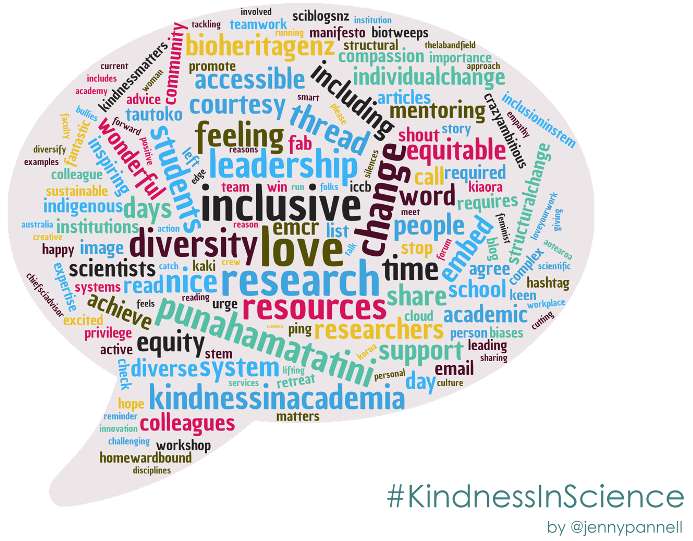
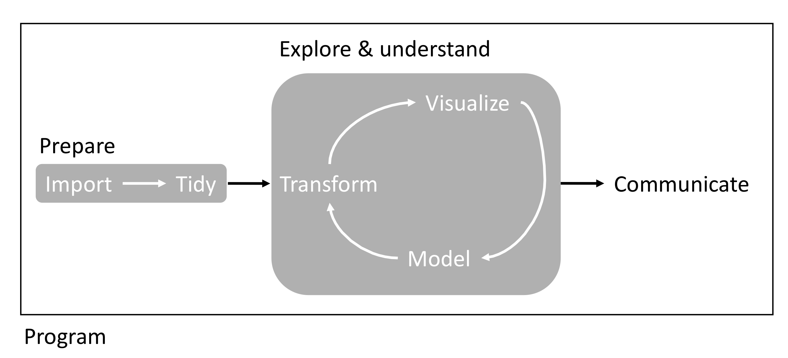

```{js logo-js, echo=FALSE}
$(document).ready(function() {
  $('#header').parent().prepend('<div id=\"logo\"></div>');
  $('#header').css('margin-right', '120px')
});
```

```{r packages, echo=FALSE, warning=FALSE, include=FALSE}
library(knitr)
library(rmarkdown)
library(bookdown)
#library(distill)
library(knitcitations)
library(formatR)
library(devtools)
library(kfigr)
library(dplyr)
library(kableExtra)
library(tufte)

#Generate BibTex citation file for all R packages used to produce report
knitr::write_bib(.packages(), file = 'packages.bib')
```

<div style="text-align: right"> [Download pdf version](Data/EEB603_Syllabus_BUERKI.pdf) </div>
<div style="text-align: right"> [Raw data on GitHub](https://github.com/svenbuerki/EEB603_Reproducible_Science) </div>

# Instructor

-   Name: Sven Buerki
-   Office: Science building, office 114 (ground floor).
-   Email: [svenbuerki\@boisestate.edu](mailto:svenbuerki@boisestate.edu){.email}
-   Office hours: By appointment.

# Our class ethos

> Everyone here is smart; distinguish yourself by being kind.
>
> `r tufte::quote_footer('Kindness in Science is an inclusive approach that fosters diversity, 	respect, wellbeing & openness leading to better science outcomes.')`

```{r kindness, echo=FALSE, fig.align='right', out.width = '40%', fig.pos= "h"}

```

# Class details

## Teaching mode and class location

In-person in [Science Bldg, Rm 149](https://maps.boisestate.edu/?id=715#!m/89069).

## Meeting days and times

Tuesday & Thursday from 9:00 to 10:15 AM.

## Timetable

The tentative timetable for this course is available [here](Timetable.html). The instructor wants to warn students that he might adjust the timetable to accommodate any needs. However, in case of changes, the instructor will make sure to contact enrolled students to keep them posted.

## Health and safety protocols

**Our priority is your safety!**

There are currently no specific health guidelines, but for more information on this topic please visit the [BSU public helath response](https://www.boisestate.edu/publichealth/) webpage.

# Course goal & description

The scientific community widely acknowledges that we are in the midst of a reproducibility crisis [see e.g. @Baker_2016]. This course starts by reviewing the evidence and causes supporting this crisis and aims at highlighting factors to boost reproducibility in science, especially in the fields of Ecology, Evolution & Behavior. 

The overarching aim of this course is therefore to provide students with the theoretical knowledge and bioinformatic tools necessary to improve transparency, reproducibility and efficiency in scientific research. Across the course of the course, students will be taught how to use open source software for their research such as [R](https://cran.r-project.org), [RStudio](https://www.rstudio.com) and [R Markdown](https://rmarkdown.rstudio.com) (incl. [knitr](https://kbroman.org/knitr_knutshell/)). To further master these latter skills and improve communication and teaching skills, students will *i*) design bioinformatic tutorials and teach those to their peers and *ii*) design and implement individual projects aiming at developing a reproducible workflow specific to their research interest.

Overall, this course **provides students with key knowledge to gather, store, share, prepare and analyze data as well as communicate results to the scientific community and various stakeholders** (see Figure \@ref(fig:part2)).

```{r part2, echo=FALSE, fig.cap="Overview of workflow studied in PART2.", out.width = '100%', fig.pos= "h"}

```

# <a name="Structure"></a>Structure of the course

The course is subdivided into three parts: 

- *PART 1: The Big Picture*
- *PART 2: Bioinformatics for Reproducible Science* 
- *PART 3: Apply a Reproducible Approach to your Data*

Part 1 provides students with key theoretical knowledge on reproducible science allowing them to successfully design and implement a reproducible approach tailored to Ecology, Evolution & Behavior. 

Part 2 provides students with opportunities to further learn and apply the bioinformatic tools required to implement a reproducible workflow (Figure \@ref(fig:part2)). Here, students (with the support of the instructor) will develop and teach a tutorial on a specific bioinformatic subject, which will be taught over two full classes. Tutorials will be written in RMarkdown and distributed to the class one week in advance. Depending on class size, this assignment will be conducted in group or individually.

Finally, part 3 was designed to provide students with an opportunity to develop individual reproducible workflows tailored to their research project (or to data presented in a publication if they don't have a thesis subject yet). This assignment will be done by applying knowledge gained during the previous parts and working in collaboration with the instructor (in some cases, we might seek support from thesis advisers).

## Content of the course

**PART 1: The Big Picture**

1. **Introduction: The reproducibility crisis & prospects to tackle it!**
   - Chapter 1: Introduction to R, RStudio, Markdown (incl. referencing) & User-defined functions.
   - Chapter 2: The reproducibility crisis.
   - Chapter 3: A roadmap to implement reproducible science in Ecology, Evolution & Behavior.
   - Chapter 4: Open science and CARE principles.
2. **Getting started: Overview of data workflow & used software**
   - Chapter 5: Data management, Reproducible code.
   - Chapter 6: Getting published & Peer review.
  
<a name="PART2"></a>**PART 2: Bioinformatics for Reproducible Science** 

3. **Prepare your data**
   - Chapter 7: Organize and import data with R.
   - Chapter 8: Prepare/tidy data for analyses in R.
4. **Explore & understand your data**
   - Chapter 9: Statistical modelling and *knitr*.
   - Chapter 10: Visualize results with Tables.
   - Chapter 11: Visualize results with Figures (incl. handling phylogenetic trees).
5. **Communicate/Disseminate your results**
   - Chapter 12: Git & GitHub: What are those and how can they help you with your code and communicating your research?
   
**PART 3: Apply a Reproducible Approach to your Data**

6. **Students develop and present reproducible workflows applied to their project**
   - Produce individual reports showcasing reproducible workflows tailored to thesis projects.
   - Oral presentations of individual students' projects. 

# <a name="GoogleSite"></a>Shared Google Drive
A shared Google drive is set up to facilitate data sharing and allow students uploading their [bioinformatic tutorials](#BioTut). 

- URL: https://drive.google.com/drive/folders/1eZyjGQ478vaKiGD01hcryyNtdGp9t1J7?usp=sharing

# <a name="Publis"></a>Publications & Textbooks

The reading material at the basis of this course is composed of a mixture of publications and chapters mostly from two textbooks [@Gandrud2015; @Wickham2017]. We will also study the *"Guides to"* published by the [British Ecological Society](https://www.britishecologicalsociety.org/publications/guides-to/). Please find below the references used in each [chapter](#Structure). **This list is not exhaustive and additional literature will be provided in class.** 

| Chapter | Reference(s)  |
| :--- |-------------|
| **Chap. 1** | Chapter 3 of @Gandrud2015 |
| **Chap. 2** | @Baker_2016; @Freedman_2015; @Munafo; @Peng2021; @Sarewitz_2016 |
| **Chap. 3** | @Bone2015; @Markowetz2015; @Smith2016 |
| **Chap. 4** | @Carroll2021; [Creative Commons](https://creativecommons.org/); @Wagner2022 |
| **Chap. 5** | @DataMan & Chapter 4 of @Gandrud2015; @RepCode & Chapter 2 of @Gandrud2015; @Trisovic2022 |
| **Chap. 6** | @GetPub; @PeerRev|
| **Chap. 7** | Chapter 6 of @Gandrud2015 |
| **Chap. 8** | Chapter 7 of @Gandrud2015 & Chapters 9-10 of @Wickham2017 |
| **Chap. 9** | Chapter 8 of @Gandrud2015 |
| **Chap. 10** | Chapter 9 of @Gandrud2015 |
| **Chap. 11** | Chapter 10 of @Gandrud2015, Chapters 1 and 22 of @Wickham2017 & @Yu2017 |
| **Chap. 12** | Chapter 5 of @Gandrud2015 |

# <a name="software"></a>The computing tools of reproducible science

Research is often presented in the form of slideshows, articles or books. These presentation documents announce a project's findings, but they are not the research, they are the advertisement part of the research project! 

> *The research is the full software environment, code, and data that produced the results [@Donoho2010].* 

**When we separate the research from its advertisement, we are making it difficult for others to verify the findings by reproducing them.**

This course will give you the tools to dynamically combine your research with the presentation of your findings. The first tool will be a workflow for reproducible research weaving the principles of reproducibility throughout your entire research project, from data gathering to the statistical analysis, and the presentation of results. To reach this goal, you will learn how to use a number of computer tools that make this workflow possible. 

## The bioinformatic tools

The main bioinformatic tools covered in this course are:

- The **R** statistical language that will allow you to gather data and analyze it.
- The **LaTeX** and **Markdown** markup languages that you can use to create documents (slideshows, articles, books, webpages) for presenting your findings.
- The *knitr* and *rmarkdown* **packages** for R and other tools, including **command-line shell programs** like GNU Make and Git version control, for dynamically tiding your data gathering, analysis, and presentation documents together so that they can be easily reproduced.
- **RStudio**, a program that brings all of these tools together in one place.

## Installing the main software

As shown above, **R** and **RStudio** are at the core of this course and will have to be installed on your computers. This can be easily done by downloading the software from the following websites:

- **R**: https://www.r-project.org
- **RStudio**: https://www.rstudio.com/products/rstudio/download/

The download webpages for these software have comprehensive information on how to install them, so please refer to those pages for more information.

## Installing markup languages

If you are planning to create LaTeX documents, you will need to install a Tex distribution. Please refer to this website for more details: https://www.latex-project.org/get/

If you want to create Markdown documents you can separately install the *rmarkdown* package in R (see [below](#Rpack) for more details).

## <a name="Rpack"></a>Installing R packages

We will be using a number of R packages especially designed to support reproducible research. Many of those packages are not included in the default R installation and will need to be installed separately. 
To install key packages used in class, copy the following code and paste it into your R console:

```{r eval=FALSE, tidy=TRUE}
install.packages(c("brew", "countrycode", "devtools", "dplyr", "ggplot2", "googleVis", "knitr", "rmarkdown", "tidyr", "xtable"))
```

Once you enter this code, you may be asked to select a CRAN "mirror" to download the packages from. Simply select the mirror closest to you.

Finally, it is highly likely that we will have to install additional packages. In this case, you can simply install it by using the same R function `install.packages()` or by using RStudio as follows: Select "Tools" -> "Install Packages ..." and then type the name of the package in the window (make sure to tick the "Install dependencies" box).

# <a name="Cheat"></a>RStudio Cheat Sheets: A gold mine to design your bioinformatic tutorials

RStudio provides a suite of cheat sheets that can be accessed by going to the "Help" menu and selecting "Cheatsheets". 

Five cheat sheets are especially relevant to chapters taught in this course:

  - *RStudio IDE : Cheat sheet*
  - *Data Manipulation with dplyr, tidyr*
  - *Data Visualization with ggplot2*
  - *R Markdown Cheat Sheet*
  - *R Markdown Reference Guide*

These documents together with the material presented in [publications & textbooks](#Publis) will provide the basis to design your [bioinformatic tutorials](#BioTut). 

# R tutorials

Please find below two documents providing a comprehensive introduction to R:

- R for beginners (a tutorial by Emmanuel Paradis): https://cran.r-project.org/doc/contrib/Paradis-rdebuts_en.pdf
- An introduction to R: https://cran.r-project.org/doc/manuals/r-release/R-intro.pdf

# Assessments

There will not be any classical exams in this course, but we will rather focus on developing theoretical and bioinformatic skills and applying those to your research. In this context, each student will be asked to produce a bioinformatic tutorial and teach it to their peers (see [PART 2](#PART2)). Each student will also be tasked to produce a report (tailored to their thesis project or a publication) and present their results and conclusions in class. 

## Tests conducted during the course & grading

Students will be graded based on the following four tasks:

- Produce a bioinformatic tutorial focusing on a chapter from [PART 2](#PART2). Depending on enrollment students may be working in pairs (150 points).
- Teach a bioinformatic lab (spread across 2 sessions; 100 points).
- Produce an individual report on thesis project/publication (200 points).
- One oral presentation on thesis project/publication (100 points).

Exams are summing to a total of **550 points** and Table \@ref(tab:mygrade) exhibits the grading scale applied in this course.

```{r mygrade, echo=FALSE}
library(bookdown)
#
grades <- data.frame("Percentage" = c("100-98","97.9-93", "92.9-90", "89.9-88", "87.9-83", "82.9-80", "79.9-78", "77.9-73", "72.9-70", "69.9-68", "67.9-60", "59.9-0"), Grade = c("A+","A","A-","B+","B","B-","C+","C","C-","D+","D","F"))
knitr::kable(grades, caption = "Grading scale applied in this course.") %>%
  kable_styling(bootstrap_options = c("striped", "hover", "condensed"))
```


## <a name="BioTut"></a>Bioinformatic tutorial (150 points)

During week 1, students will be assigned a chapter of [PART 2](#PART2) to study and produce a bioinformatic tutorial. Based on enrollment, students might work individually or in pairs (please see below for more information).

Tutorials will have to be written in the *knitr*/*rmarkdown* language as implemented in RStudio. Tutorials should be focused on developing a suite of exercises aiming at gaining key bioinformatic skills specific to each chapter (see [PART 2](#PART2)). Students will be welcomed to use material presented in @Gandrud2015 and @Wickham2017 to develop their tutorials, but they can also use other sources as long as they are properly cited in their documents. See [Publications & Textbooks](#Publis) and [RStudio Cheat Sheets](#Cheat) sections for more details.  

Students should design their tutorials to be completed within 2 laboratory sessions (see [below](#TeachTut)). **Tutorials should be submitted to the instructor 1 week in advance for correction and to be uploaded onto the shared Google drive.**

### What do you need to keep in mind?

While designing your tutorials, please think about the following points:

1. What are your major objectives and how do they fit within the scientific process and data life-cycle? Please also focus on the theoretical background.
2. What are the specific learning outcomes?
3. What data are used to teach this tutorial?
4. What are the bioinformatic dependencies and how to install them?
5. When you teach each concept, make sure to clearly explain the rational, steps to get there (pseudo-code) and focus on the input/output and data class/format used for each function.

### Content of the tutorial

Based on the information provided above, your tutorial should include:

- A short introduction highlighting the theory and aims of the tutorial.
- A section on R package requirements with instructions on how to install those packages and their dependencies.
- A section introducing the data (dataset) used to support these exercises (and how to download those).
- A references section and links to manuals of R packages. 
- Commented R code necessary to guide users through the exercises as well as some knowledge on expected outputs.

### Google sheet with groups for bioinformatic tutorials

The instructor is asking students to sign up for designing and teaching a bioinformatic tutorial by accessing the following Google sheet (the number of students per chapter is provided, please respect this guideline):

- https://docs.google.com/spreadsheets/d/1gUwbqJ4gbhhSY1DfsZ7HsoDLzOKB-57xAAC1_IJ3qmk/edit?usp=sharing

## <a name="TeachTut"></a>Teaching your bioinformatic tutorial (100 points)

Students are expected to prepare a 10 minutes presentation providing general guidelines to complete the tutorial. Presentations will be uploaded onto the shared Google drive and made accessible to all students. Students are expected to support their peers in completing tutorials by answering questions. The instructor will also be answering questions, but students are leading the teaching of the bioinformatic laboratories. 

Students will be graded according to their abilities to teach their tutorials and answer questions. The instructor might also use student's feedback to grade this test.

## Individual report on thesis project/publication (200 points)

Students will work alongside the instructor to develop a reproducible workflow specific to their thesis project. In cases where students do not yet have a clear idea on their thesis project, they will work with instructor to identify a publication that can serve as basis for their individual project.  

Reports will be written using the *knitr*/*rmarkdown* markup language as implemented in RStudio. The instructor expects students to provide a list of references supporting their reports. References will have to be cited in the text: it is not enough to through a bunch of references at the end of the report. This exercise aims at supporting methodological decisions taken in the report and increasing transparency.

### Students gather prior key elements on their project

- What kind of data are already published/available (and which of those are relevant to your topic)? 
- Where are those published data deposited?
- Can you reproduce the analyses based on published data?
- What types of data are or will be produced during your thesis project? 
- What are the specificity of your data (in term of storage, sharing, etc.)?
- What are the publication standards in your field [see e.g. @Donoho2010; @Smith2016]?
- etc...

### Students develop the following core processes for their project

- A data management workflow specific to your research, which will cover the following stages of the data life cycle [see e.g. @DataMan]:
  - Create
  - Process
  - Document
  - Preserve
  - Share
  - Reuse
- A reproducible code to perform the following tasks to your data (see Fig. \ref{fig:part2}):
  - Import
  - Tidy/clean
  - Transform
  - Visualize
  - Model
  - Communicate

## Oral presentation on thesis project/publication (100 points)

Each student will have to present their report during final week. The presentation should follow the same structure as the report and not exceed 15 minutes. There will be 5 minutes at the end of the presentation allocated for questions. 

# Late work policy

The instructor expects students to deliver their assignments on time and set enough time aside to work on their projects (see above for more details). However, if you have any issues preventing completion of your work on time, please contact the instructor as soon as possible to find common solutions. 

# Engagement expectations

The instructor is expecting students to attend classes (please join on time and for the full duration of the class) and actively engage by asking questions and giving feedback on teaching material and course content. This course was designed to help students implementing a reproducible approach to their research projects. If you are judging that additional content should be covered in class, please contact the instructor. The instructor will do his very best to obtain information or seek support from colleagues to cover the requested material. In the case that you have any issues attending class, please contact the instructor by email (svenbuerki@boisestate.edu) asap and see below for more details.

# What you can expect of me

The instructor will be prepared for class, on time and not leave early. He will also be respectful of you and your opinions. Overall, the instructor wants to foster a kind and respectful class environment where all students can express themselves and share their opinions. This means that meaningful and constructive dialogue is encouraged in this class and it requires a degree of mutual respect, willingness to listen, and tolerance of opposing points of view. Respect for individual differences and alternative viewpoints will be maintained at all times in this class. One’s words and use of language should be temperate and within acceptable bounds of civility and decency. Finally, the instructor will reply to emails and grade tests as soon as possible (and provide positive criticism) to allow students mastering the material presented in class.

# This course was designed with you in mind

The instructor has developed this course to provide a welcoming environment and effective, equitable learning experience for all students. If you encounter barriers in this course, please bring them to my attention so that I may work to address them.

## This class’s community is inclusive

Students in this class represent a rich variety of backgrounds and perspectives. The [Biological Sciences department](https://www.boisestate.edu/biology/) is committed to providing an atmosphere for learning that respects diversity and creates inclusive environments in our courses. While working together to build this community, we ask all members to:

- Share their unique experiences, values, and beliefs, if comfortable doing so.
- Listen deeply to one another.
- Honor the uniqueness of their peers.
- Appreciate the opportunity we have to learn from each other in this community.
- Use this opportunity together to discuss ways in which we can create an inclusive environment in this course and across the campus community.
- Recognize opportunities to invite a community member to exhibit more inclusive, equitable speech or behavior—and then also invite them into further conversation. We also expect community members to respond with gratitude and to take a moment of reflection when they receive such an invitation, rather than react immediately from defensiveness.
- Keep confidential any discussions that the community has of a personal (or professional) nature, unless the speaker has given explicit permission to share what they have said.
- Respect the right of students to be addressed and referred to by the names and pronouns that correspond to their gender identities, including the use of non-binary pronouns. 

## We use each other’s preferred names and pronouns

Please let the instructor know of your preferred or adopted name and gender pronoun(s), and he will make those changes to his own records and address you that way in all cases. 

To change to a preferred name so that it displays on all BSU sites, including Canvas and the course roster, contact the Registrar's Office at (208) 426-4249. Note that only a legal name change can alter your name on BSU official and legal documents (e.g., your transcript).

## This course is accessible to students with disabilities

The instructor recognizes that navigating your education and life can often be more difficult if you have disabilities. I want you to achieve at your highest capacity in this class. If you have a disability, the instructor needs to know if you encounter inequitable opportunities in this course related to:
- Accessing and understanding course materials.
- Engaging with course materials and other students in the course.
- Demonstrating your skills and knowledge on assignments and exams.

If you have a documented disability, you may be eligible for accommodations in all of your courses. To learn more, make an appointment with the university’s [Educational Access Center](https://www.boisestate.edu/eac/). 

## For students responsible for children

The instructor recognizes the unique challenges that can arise for students who are also parents or guardians of children. If you have any specific needs related to this topic, please contact the instructor asap.

# Academic integrity

To create a welcoming, engaging, and effective learning environment, the instructor expects all of us to exhibit behavior that reflects Boise State’s [Statement of Shared Values](https://www.boisestate.edu/president/values/statement-of-shared-values/). The Shared Values emphasize academic excellence, caring, citizenship, fairness, respect, responsibility, and trustworthiness. In keeping with these values, the instructor expects students in this course to uphold the standards outlined in the Boise State University [Student Code of Conduct](https://www.boisestate.edu/policy/student-affairs/code-of-conduct/).

# Student well-being

If you are struggling for any reason (e.g., COVID, relationship, family, or life’s stresses) and believe these may impact your performance in the course, the instructor is encouraging you to contact the Dean of Students at (208) 426-1527 or email deanofstudents@boisestate.edu for support. Additionally, if you are comfortable doing so, please reach out to me and I will provide any resources or accommodations that I can. If you notice a significant change in your mood, sleep, feelings of hopelessness or a lack of self worth, consider connecting immediately with Counseling Services (1529 Belmont Street, Norco Building) at (208) 426-1459 or email healthservices@boisestate.edu.

## What do you need?

The university has many resources designed to support you as a learner and human being. Among these are:

- [Albertsons Library](https://library.boisestate.edu/) provides a treasure trove of physical and electronic resources. 
  - As you enter the library, straight ahead you’ll find the Reference Desk, where librarians can help you find the information and resources you need. 
  - The Circulation Desk lets students borrow various technologies.
  - The MakerLab on the second floor offers tools for student use, and there are friendly staff in the MakerLab to help you learn how.
- The [Writing Center](https://www.boisestate.edu/writingcenter/) offers individual consultations tailored to your needs, including making sense of writing assignment instructions, brainstorming, crafting a thesis, organizing an essay, revisions, citations, and more.
- [Counseling Services](https://www.boisestate.edu/healthservices/counseling) helps you tap into your strengths and find resources to deal more effectively with concerns that impact your pursuit of personal and academic goals. It emphasizes prevention and early detection and provides a broad spectrum of short-term counseling, consultative, evaluative, teaching, and training functions. Counseling staff consists of licensed counselors, psychologists, and closely supervised trainees/post-graduate interns.
- The [Gender Equity Center](https://www.boisestate.edu/genderequity/) provides specialized, brief, no-cost, confidential support for campus members affected by:
  - Identity-related harassment.
  - Sexual harassment, sexual assault, unhealthy relationships, and stalking.
  - Life experiences related to gender, sexual orientation, and allyship.
  - Life transitions and crisis.
  - Personal, financial, or academic roadblocks.
- [Multicultural Student Services](https://www.boisestate.edu/mss/) works with all students interested in equity and social justice, students from different cultures, countries and ethnicities. The staff understands cultural differences and perspectives, and knows what it’s like living in a dominant culture. The training and the programs Multicultural Student Services provides can help you navigate through political correctness and into respectful dialogue. This center also provides:
  - Support and guidance for planning cultural festivals and events.
  - In-center tutoring and studying lounge.
  - Volunteer opportunities.
  - Mentoring and Training.
  - Programs and events.
- Food assistance: If you are hungry and cannot afford to purchase food, the campus has some resources to help you. You can visit the [campus food pantry](https://www.boisestate.edu/deanofstudents/student-support/food-help/food-pantry/) or [get free meals in the campus dining hall](https://www.boisestate.edu/deanofstudents/student-support/food-help/meal-assistance/).

# References

<div id="refs"></div>

# Appendix 1 {.appendix}

Citations of all R packages used to generate this report. 

```{r generateBibliography, eval = T, results="asis", cache = F, echo=F, warning = FALSE, message=FALSE}
library("knitcitations")
cleanbib()
options("citation_format" = "pandoc")
read.bibtex(file = "packages.bib")
``` 
