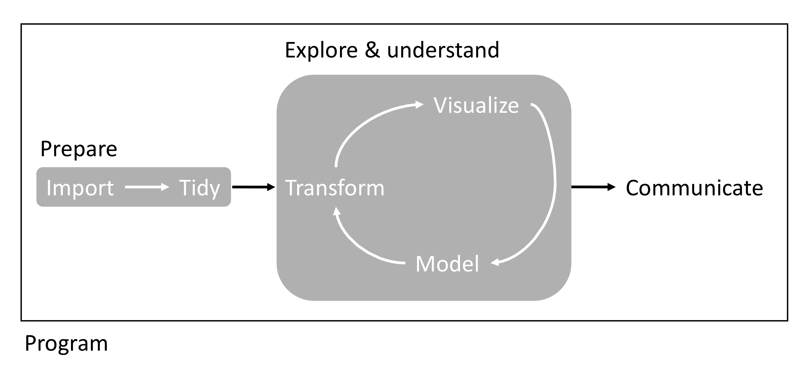

```{js logo-js, echo=FALSE}
$(document).ready(function() {
  $('#header').parent().prepend('<div id=\"logo\"></div>');
  $('#header').css('margin-right', '120px')
});
```

```{r packages, echo=FALSE, warning=FALSE, include=FALSE}
library(knitr)
library(rmarkdown)
library(bookdown)
#library(distill)
library(knitcitations)
library(formatR)
library(devtools)
library(kfigr)
library(dplyr)
library(kableExtra)
library(tufte)

#Generate BibTex citation file for all R packages used to produce report
knitr::write_bib(.packages(), file = 'packages.bib')
```

<div style="text-align: right"> [Download pdf version](index_syllabus_pdf.pdf) </div>
<div style="text-align: right"> [Raw data on GitHub](https://github.com/svenbuerki/EEB603_Reproducible_Science) </div>

# Course Information

- Course title: **Reproducible Science**
- Course number: **EEB 603**
- Credits: **3**
- Term: **Fall 2026**
- Department: Biological Sciences, Boise State University
- **Where to find things:** the [course website](https://svenbuerki.github.io/EEB603_Reproducible_Science/index.html) is the home of this course. The syllabus, the [schedule and all due dates](https://svenbuerki.github.io/EEB603_Reproducible_Science/Timetable.html), the [chapters](https://svenbuerki.github.io/EEB603_Reproducible_Science/Chapters.html), and all teaching material live there, and are available from the first day of class. **Canvas is used for one purpose only in this course: posting your grades.** Do not look to Canvas for deadlines or course content -- it will not have them.
- This syllabus is available as an accessible [pdf version](index_syllabus_pdf.pdf) that you can download and keep.
- Course source: all course materials, including the source of this syllabus, are openly available in the [course GitHub repository](https://github.com/svenbuerki/EEB603_Reproducible_Science) -- this syllabus is itself a reproducible document.

This syllabus provides the course information required by [University Policy 4095 (Course Information Policy)](https://www.boisestate.edu/policy/academic-affairs-faculty-administration/course-information-policy-policy-4095/).

## Quick Links

Whether you are reading this on the web or from a downloaded pdf, everything for this course is one click away:

| | |
| :--- | :--- |
| **Course website (home / syllabus)** | <https://svenbuerki.github.io/EEB603_Reproducible_Science/index.html> |
| **Schedule and all due dates** | <https://svenbuerki.github.io/EEB603_Reproducible_Science/Timetable.html> |
| **Assignments and evaluation rubrics** | <https://svenbuerki.github.io/EEB603_Reproducible_Science/Assignments.html> |
| **Course chapters and teaching material** | <https://svenbuerki.github.io/EEB603_Reproducible_Science/Chapters.html> |
| **Additional resources** | <https://svenbuerki.github.io/EEB603_Reproducible_Science/Resources.html> |
| **Downloadable pdf of this syllabus** | <https://svenbuerki.github.io/EEB603_Reproducible_Science/index_syllabus_pdf.pdf> |
| **GitHub repository (source of everything)** | <https://github.com/svenbuerki/EEB603_Reproducible_Science> |

# Meeting Time, Place and Modality

- Instructional mode: **In-person** (see the Registrar's [Course Delivery Type page](https://www.boisestate.edu/registrar/general-information-and-policies/course-delivery-type/) for how these terms are defined at Boise State)
- Days: Tuesday & Thursday
- Times: 9:00 to 10:15 AM
- Place: [Raptor Research Center Building, Rm 119](https://maps.boisestate.edu/?id=715#!m/115308?share)
- Important Information: Students must bring their **Bronco Card** to access the building using key card readers located at the east, west, or north entrances. Because the Raptor Research Building is on the edge of campus, it is kept secure and requires card access for entry. **Please carry your Bronco Card to every class session held in this building, as you will not be able to enter without it.**

If you forget your Bronco Card, contact **Campus Security** at 208-426-6911 to request access as a last resort.

# <a name="Instructor"></a>Instructor Information {#Instructor}

- Name: Sven Buerki (he/his)
- Office location: Science building, office 228 (first floor)
- Student hours: By appointment -- email me and we will find a time that works, in person or on Zoom
- Email address: [svenbuerki\@boisestate.edu](mailto:svenbuerki@boisestate.edu){.email}
- Preferred way to contact me: By email or in class
- Teaching assistants: None assigned to this course

# Welcome

Welcome to the course! I am looking forward to getting to know you this semester. To get started, please familiarize yourself with this syllabus and our [website](https://svenbuerki.github.io/EEB603_Reproducible_Science/index.html). I developed this course to provide a welcoming environment and effective learning experience for all students. If you encounter barriers in this course, please bring them to my attention so that I may work to address them, and reach out to me at any time if you have questions about course content or assignments. 

# Course Format

This is an in-person course that will meet two times a week. Our class sessions include important information and opportunities to apply what you are learning with your peers. To best achieve the learning outcomes for the course, it is important that you attend class and be engaged with the content, me and each other. You should expect to spend approximately 9 hours each week on work for this course (including in and out of class time).

**We take a short break in the middle of each session.** Our classes run for 75 minutes, and roughly halfway through I will call a **five-minute break**. I aim for a natural pause in the material rather than a fixed time on the clock, so it may fall a little either side of the midpoint. Use it however you need: step out, stretch, get some air, look away from your screen. During the bioinformatics laboratories the break doubles as a checkpoint -- before we stop, the teaching group and I will check that everyone's code is running, so that nobody spends the second half of the session stuck on something we could have sorted out in a minute.

**The course changes shape as it goes**, and it is worth knowing this from the start:

- **[PARTS 1 and 2](#Structure) are taught in class.** Sessions combine short lectures, group discussion of the assigned readings, and hands-on computing laboratories in which you work directly in R and RStudio. This is where the theory and the tools are taught, and where you and your peers teach one another -- so being present matters, and it is [assessed](#Participation).
- **[PART 3](#Structure) is individual work carried out mostly outside class time.** **One full class session is dedicated to working on your individual project**, with me there to give you feedback as you go, and I expect to set aside further time later in the semester for the same purpose (the [course schedule](https://svenbuerki.github.io/EEB603_Reproducible_Science/Timetable.html) will confirm when). The class also reconvenes in the **final week for oral presentations**. Beyond those sessions, the project is homework, so plan your time accordingly -- the report is substantial and cannot be written in the last week.
- **Please book time with me while you work on both of your major assignments.** My [student hours](#Instructor) are by appointment precisely so that we can find a slot that suits you, in person or on Zoom. Whether you are designing your [bioinformatics tutorial](#BioTut) or building your [individual project](#Report), coming to talk through your ideas, your data, or a piece of code that will not run is the single most useful thing you can do -- and the students who do it early consistently produce better work than those who arrive with a finished draft. You do not need a polished question; "I am stuck" is a perfectly good reason to email me.

# Pre- and Corequisites

This course is part of the **Ecology, Evolution and Behavior (EEB) Ph.D. program** at Boise State University, and is designed specifically for graduate students enrolled in that program and in **Biological Sciences**.

Graduate students from other programs are also welcome, and I regularly accept them: if your research involves gathering, managing, analyzing, or communicating data, the needs this course addresses are probably yours too. Please contact me and we will discuss whether it is a good fit for your project.

**No prior experience with R, Markdown, or version control is assumed** -- the course builds these skills from the ground up.

# Course Description and Goals

The scientific community widely acknowledges that we are in the midst of a ***reproducibility crisis*** [e.g. @Baker_2016]. This course begins by reviewing the evidence for, and causes of, this crisis, and aims to highlight key factors that can improve reproducibility in science—especially within Ecology, Evolution & Behavior. It also provides a platform to develop, practice, and strengthen science communication skills [e.g. @Soltis2023 for some innovative ways to share your research]. 

The overarching ***goal*** of this course is to equip students with the theoretical knowledge and bioinformatics tools necessary to enhance transparency, reproducibility, and efficiency in scientific research. Throughout the course, students will learn to use open-source software for research, including [R](https://cran.r-project.org), [RStudio](https://www.rstudio.com) and [R Markdown](https://rmarkdown.rstudio.com) (incl. [knitr](https://kbroman.org/knitr_knutshell/)). To further develop these skills—and improve communication and teaching competencies—students will: 

1. Design bioinformatics tutorials and teach them to peers
2. Design, implement, and present individual projects aimed at developing a reproducible workflow tailored to their research interests

Overall, this course **provides students with key knowledge to gather, store, share, prepare, and analyze data, as well as communicate results to the scientific community and various stakeholders** (see Figure \@ref(fig:part2)).

```{r part2, echo=FALSE, fig.cap="Overview of workflow studied in PART2.", fig.alt="Diagram of a reproducible data analysis workflow. On the left, a box labelled Prepare contains Import followed by Tidy. An arrow leads to a larger box labelled Explore and understand, in which Transform, Visualize and Model are connected in a repeating cycle. An arrow then leads out of that box to Communicate. The entire workflow is enclosed in an outer box labelled Program.", out.width = '100%', fig.pos= "h"}

```

## <a name="Structure"></a>Course Structure {#Structure}

The course is subdivided into three parts: 

- *PART 1: The Big Picture*
- *PART 2: Bioinformatics for Reproducible Science* 
- *PART 3: Apply a Reproducible Approach to your Data*

**Part 1** provides students with key theoretical knowledge on reproducible science, enabling them to design and implement a reproducible approach tailored to Ecology, Evolution & Behavior. This section also covers topics related to open science and data management, and how these practices intersect with scientific publishing.

**Part 2** offers students the opportunity to further develop and apply coding and bioinformatics tools essential for building reproducible workflows (Figure \@ref(fig:part2)). In this section, students—supported by me—will develop and teach a tutorial on a specific bioinformatics topic over two full classes. Tutorials will be written in RMarkdown and distributed to the class one week in advance. This is normally a **group** assignment; where enrollment does not divide evenly, a student may work on a chapter alone, in which case I provide additional support so that the workload remains comparable (see [Bioinformatics Tutorial](#BioTut)).

**Part 3** is designed to give students the chance to develop an individual reproducible workflow tailored to their own research project (or using data from a publication, if they have not yet defined a thesis topic). This assignment builds on knowledge gained in the earlier parts of the course and will involve collaboration with me—and in some cases, with your thesis advisor. **Unlike Parts 1 and 2, this is individual work carried out mostly outside class time.** I dedicate **one full class session to working on your individual projects**, with feedback from me as you go, and expect to allocate further time later in the semester; the class then reconvenes in the final week for everyone's oral presentations. The remainder of the work is done outside class, so I strongly encourage you to arrange meetings with me during the semester to get my input as your project develops. The [course schedule](https://svenbuerki.github.io/EEB603_Reproducible_Science/Timetable.html) shows when the in-class sessions fall.

## Course Content {#courseCont}

**PART 1: The Big Picture**

1. **The reproducibility crisis & prospects to tackle it!**
   - Chapter 1: The reproducibility crisis.
   - Chapter 2: Introduction to R, RStudio, Markdown (incl. referencing) & User-defined functions.
   - Chapter 3: A roadmap to implement reproducible science in Ecology, Evolution & Behavior.
   - Chapter 4: Open science and CARE principles.
2. **Getting started: Overview of data workflow & used software**
   - Chapter 5: Data management, Reproducible code.
   - Chapter 6: Getting published & Peer review.
  
<a name="PART2"></a>**PART 2: Bioinformatics for Reproducible Science**

3. **Prepare your data**
   - Chapter 7: Organize and import data with R.
   - Chapter 8: Prepare/tidy data for analyses in R.
4. **Explore & understand your data**
   - Chapter 9: Statistical modelling and *knitr*.
   - Chapter 10: Visualize results with Tables.
   - Chapter 11: Visualize results with Figures (incl. handling phylogenetic trees).
5. **Communicate/Disseminate your results**
   - Chapter 12: Git & GitHub: What are those and how can they help you with your code and communicating your research?
   
**PART 3: Apply a Reproducible Approach to your Data**

6. **Students develop and present reproducible workflows applied to their project**
   - Produce individual reports showcasing reproducible workflows tailored to thesis projects.
   - Oral presentations of individual students' projects. 

## <a name="Outcomes"></a>Course Learning Outcomes {#Outcomes}

After successful completion of this course, students will be able to:

1. **Explain** the evidence for, and the causes of, the reproducibility crisis in science, and distinguish between reproducibility and replicability in research.
2. **Evaluate** the factors that break reproducibility in Ecology, Evolution & Behavior, and identify strategies that mitigate them.
3. **Apply** the principles of open science, data management, and the CARE principles to the full data life cycle (create, process, document, preserve, share, reuse).
4. **Build** reproducible workflows using R, RStudio, R Markdown and *knitr*, from data import and tidying through to modelling, visualization, and reporting.
5. **Use** version control with Git and GitHub to track, document, and share code and research outputs.
6. **Design and teach** a bioinformatics tutorial that enables peers to acquire a defined set of computational skills.
7. **Communicate** research rationale, methods, and results to scientific and non-specialist audiences, in writing and orally, with complete and correctly formatted citations.

Detailed, chapter-level learning outcomes are available on the [course website](https://svenbuerki.github.io/EEB603_Reproducible_Science/Chapters.html).

## Program Learning Outcomes

This course supports the **Ecology, Evolution and Behavior (EEB) Ph.D. program** and the graduate programs in **Biological Sciences** by developing students' capacity to conduct rigorous, transparent, and well-documented research, and to communicate that research effectively. These competencies underpin doctoral and thesis work directly: a dissertation chapter that cannot be reproduced cannot be defended, and the data management and version control practices taught here are the ones you will rely on across the whole of your degree. They also align with the [University Learning Outcomes](https://www.boisestate.edu/academics-provost/university-learning-outcomes/) for graduate education.

# Course Schedule

The tentative schedule for this course is available on the [course schedule page](Timetable.html). I may adjust the schedule during the semester to accommodate the needs of the class -- if I do, I will contact everyone enrolled and post the change, so that you always have an up-to-date version.

# Course Resources

## <a name="GoogleSite"></a>Shared Google Drive {#GoogleSite}

A shared Google Drive folder has been set up for this course. **I will grant you access during the first week of the semester**, so you do not need to request it -- if you have not received access by the end of week 1, email me.

- **[Shared Google Drive folder for EEB 603](https://drive.google.com/drive/folders/1eZyjGQ478vaKiGD01hcryyNtdGp9t1J7?usp=drive_link)**

We use it for three things:

- **Sharing publications** and other reading material for the course.
- **Uploading your assignments**, in the relevant subfolder: `Bioinformatics_tutorials` for your [bioinformatics tutorial](#BioTut), and `Individual_reports` for your [individual project](#Report).
- **Coordinating who is doing what**, which means it contains the names of students alongside their assignments.

**Please keep this folder private.** Because it contains your classmates' names and their work, it is for the people enrolled in this course only. Do not share the link, forward its contents, or give access to anyone outside the class. If you want to share something of your own from it more widely -- your own tutorial, for instance -- that is entirely your call to make with your own material, but share it directly rather than by passing on access to the folder.

## <a name="Publis"></a> Publications and Textbooks {#Publis}

The reading material at the basis of this course is composed of a mixture of publications and chapters mostly from two textbooks [@Gandrud2015; @Wickham2017]. We will also study the *"Guides to"* published by the [British Ecological Society](https://www.britishecologicalsociety.org/publications/guides-to/). Please find below the references used in each [chapter](#Structure). **This list is not exhaustive and additional literature will be provided in class.** 

| Chapter | Reference(s)  |
| :--- |-------------|
| **Chap. 1** | @Baker_2016; @Freedman_2015; @Munafo; @NAP25303; @Peng2021; @Sarewitz_2016 |
| **Chap. 2** | Chapter 3 of @Gandrud2015 |
| **Chap. 3** | @Bone2015; @Markowetz2015; @Smith2016 |
| **Chap. 4** | @Carroll2021; [Creative Commons](https://creativecommons.org/); @Wagner2022; @Williams2023 |
| **Chap. 5** | @DataMan & Chapter 4 of @Gandrud2015; @RepCode & Chapter 2 of @Gandrud2015; @Trisovic2022 |
| **Chap. 6** | @GetPub; @PeerRev|
| **Chap. 7** | Chapter 6 of @Gandrud2015 |
| **Chap. 8** | Chapter 7 of @Gandrud2015 & Chapters 9-10 of @Wickham2017 |
| **Chap. 9** | Chapter 8 of @Gandrud2015 |
| **Chap. 10** | Chapter 9 of @Gandrud2015 |
| **Chap. 11** | Chapter 10 of @Gandrud2015, Chapters 1 and 22 of @Wickham2017 & @Yu2017 |
| **Chap. 12** | Chapter 5 of @Gandrud2015 |


The two main textbooks are available online:

- @Gandrud2015 -- *Reproducible Research with R and RStudio*. The chapter numbers in the table above refer to the **2nd edition (2015)**. A <a href="https://api.pageplace.de/preview/DT0400.9780429629594_A38620567/preview-9780429629594_A38620567.pdf" target="_blank" rel="noopener noreferrer">free publisher preview of the 3rd edition (2020)</a> is also available.
- @Wickham2017 -- *R for Data Science*. The chapter numbers above refer to the **1st edition**, which you can <a href="https://r4ds.had.co.nz/" target="_blank" rel="noopener noreferrer">read in full online</a>. The authors also maintain a <a href="https://r4ds.hadley.nz/" target="_blank" rel="noopener noreferrer">2nd edition (2023)</a>, which is more current.

**A note on editions:** chapter numbering changed between editions of both books. If you are reading a newer edition than the one cited above, match the chapter *title* rather than the number, and ask me if you are unsure which section is intended.


## Examples of Reproducible Science

To further illustrate how a reproducible approach can be applied to research, here are examples of publications and software produced by students who have taken this course (listed alphabetically):

- @Cole2022 -- **EcoCountHelper: an R package and analytical pipeline for the analysis of ecological count data using GLMMs, and a case study of bats in Grand Teton National Park.**
- @Ellestad2022 -- **Genomic Insights into Cultivated Mexican Vanilla planifolia Reveal High Levels of Heterozygosity Stemming from Hybridization.**
- @Wojahn2021 -- **G2PMineR: A Genome to Phenome Literature Review Approach.**

# <a name="software"></a>Computing Tools {#software}

Research is often presented in the form of slideshows, articles or books. These presentation documents announce a project's findings, but they are not the research, they are the advertisement part of the research project! 

> *The research is the full software environment, code, and data that produced the results [@Donoho2010].* 

**When we separate the research from its advertisement, we are making it difficult for others to verify the findings by reproducing them.**

This course will equip you with tools to integrate your research with clear and reproducible presentation of your findings. The first is a reproducible research workflow, which applies the principles of reproducibility throughout your entire project—from data collection to statistical analysis and results presentation. To support this, you will learn to use a range of computing tools that make this workflow possible.

## Required Materials and Technology Requirements

Class time includes hands-on computing laboratories, so you need access to a computer in every session. You have two options:

- **Bring your own laptop (preferred).** Setting up and troubleshooting the software on the machine you actually use for your research is itself part of the learning in this course, and it means your projects, files, and configuration stay with you after the semester ends.
- **Use a classroom computer.** Our classroom (Raptor Research Center Building, Rm 119) is equipped with computers that have all of the required software installed. These are available to you for every class session, so **you do not need to own a laptop to take this course.** If you need computer access outside of our meeting times, come and talk to me and we will sort it out -- [Albertsons Library](https://library.boisestate.edu/) also lends laptops from the Circulation Desk.

Whichever option you choose, you will need:

- **R and RStudio**, plus the R packages listed [below](#Rpack). Both are free and open-source, and installation is covered in the first weeks of class. They are already installed on the classroom computers.
- **A LaTeX distribution** if you wish to produce pdf output (see [Installing Markup Software](#Markup)). Also already installed on the classroom computers.
- **A GitHub account** (free) for the version control component of the course.
- **Internet access** and your Boise State account for the **course website**, **Google Drive**, **Zoom**, and **Canvas** (grades only).

There is **no required textbook to purchase.** All readings are either open access, available through [Albertsons Library](https://library.boisestate.edu/), or provided by me (see [Publications and Textbooks](#Publis)).

## Bioinformatics Tools

The main bioinformatics tools covered in this course are:

- The **R** statistical language that will allow you to gather data and analyze it.
- The **Markdown** and **LaTeX** markup languages that you can use to create documents (slideshows, articles, books, webpages) for presenting your findings.
- The *knitr* and *rmarkdown* **packages** for R and other tools, including **command-line shell programs** like GNU Make and Git version control, for dynamically tiding your data gathering, analysis, and presentation documents together so that they can be easily reproduced.
- **RStudio**, a program that brings all of these tools together in one place.

## Installing Software

As shown above, **R** and **RStudio** are at the core of this course and will have to be installed on your computers. This can be easily done by downloading the software from the following websites:

- **R**: https://www.r-project.org
- **RStudio**: https://www.rstudio.com/products/rstudio/download/

The download pages for these software tools include detailed installation instructions; please refer to them for more information.

## <a name="Markup"></a>Installing Markup Software {#Markup}

If you are planning to create LaTeX documents, you will need to install a Tex distribution. Please refer to this website for more details: https://www.latex-project.org/get/

If you want to create Markdown documents you can separately install the *rmarkdown* package in R (see [below](#Rpack) for more details).

## <a name="Rpack"></a>Installing R Packages {#Rpack}

We will be using several R packages specifically designed to support reproducible research. Many of these packages are not included in the default R installation and must be installed separately.

To install the core packages used in this course, copy the following code and paste it into your R console:

```{r eval=FALSE, tidy=TRUE}
install.packages(c("brew", "countrycode", "devtools", "dplyr", "ggplot2", "googleVis", "knitr", "rmarkdown", "tidyr", "xtable"))
```

Once you run this code, you may be prompted to select a CRAN "mirror" to download the packages from. Simply choose the mirror closest to your location.

It is also likely that we will need to install additional packages throughout the course. When that happens, you can install them using the same R function `install.packages()`, or through RStudio by selecting "Tools" → "Install Packages...", entering the package name in the dialog box, and ensuring the "Install dependencies" option is checked.

## <a name="Cheat"></a>RStudio Cheat Sheets {#Cheat}

RStudio offers a collection of cheat sheets accessible from the "Help" menu by selecting "Cheatsheets."

Five cheat sheets are especially relevant to chapters taught in this course:

  - *RStudio IDE : Cheat sheet*
  - *Data Manipulation with dplyr, tidyr*
  - *Data Visualization with ggplot2*
  - *R Markdown Cheat Sheet*
  - *R Markdown Reference Guide*

These documents together with the material presented in [course resources](#Publis) will provide the basis to design your [bioinformatics tutorials](#BioTut). 

## R Tutorials

Please find below two documents providing a comprehensive introduction to R:

- [R for Beginners](https://cran.r-project.org/doc/contrib/Paradis-rdebuts_en.pdf), a tutorial by Emmanuel Paradis (pdf)
- [An Introduction to R](https://cran.r-project.org/doc/manuals/r-release/R-intro.pdf), the official CRAN manual (pdf)

# Assessments and Grading

There will not be any classical exams in this course, but we will rather focus on developing theoretical and bioinformatics skills and applying those to your research. In this context, each student will be asked to produce a bioinformatics tutorial and teach it to their peers (see [Course Content - PART 2](#courseCont)). Each student will also be tasked to produce a report (tailored to their thesis project or a publication) and present their results and conclusions in class. 

## Assessments

Students will be graded on the following four mandatory assessments, worth 600 points in total:

1. Produce a bioinformatics tutorial based on a chapter from [Course Content - PART 2](#courseCont), normally as a group (150 points).
2. Teach the bioinformatics tutorial to their peers over two sessions (100 points).
3. Produce an **[individual project](#Report)** on their thesis project or a related publication, in three stages totalling 300 points:
    a. a mandatory [2-page proposal](#Proposal), due about a third of the way through the semester (50 points);
    b. the [final report](#Report) (150 points);
    c. the [oral presentation](#Oral) in the final week (100 points).
4. [Participate and engage](#Participation) in class sessions across PARTS 1 and 2 (50 points).

These assessments total **600 points**. Table \@ref(tab:mygrade) shows the grading scale used in this course.

**There are no proctored exams or proctored assessments in this course.** Your grade is based entirely on the assessments listed above, each of which is aligned with the [Course Learning Outcomes](#Outcomes): the bioinformatics tutorial and its teaching address outcomes 4--6; the individual report and oral presentation address outcomes 3--5 and 7; and participation in PART 1 addresses outcomes 1--2, where the reproducibility crisis and the factors that break reproducibility are studied through discussion of the assigned readings.

# Grading Policy 

The grading scale for this course is in Table \@ref(tab:mygrade).

```{r mygrade, echo=FALSE}
library(bookdown)
#
grades <- data.frame("Percentage" = c("100-98","97.9-93", "92.9-90", "89.9-88", "87.9-83", "82.9-80", "79.9-78", "77.9-73", "72.9-70", "69.9-68", "67.9-60", "59.9-0"), Grade = c("A+","A","A-","B+","B","B-","C+","C","C-","D+","D","F"))
knitr::kable(grades, caption = "Grading scale applied in this course.", format = "html") %>%
  kable_styling(bootstrap_options = c("striped", "hover", "condensed"))
```

You can look at all of your scores by accessing **Grades** in the Canvas course menu. Grades are the only thing Canvas is used for in this course -- everything else, including the schedule and all due dates, is on the [course website](https://svenbuerki.github.io/EEB603_Reproducible_Science/index.html).

## <a name="BioTut"></a>Bioinformatics Tutorial (150 points) {#BioTut}

During the first two weeks, students will [sign up](#GoogleBioTut) for a chapter from [Course Content - PART 2](#courseCont) to study and create a bioinformatics tutorial.

**This is designed as a group assignment.** Working in a group is deliberate rather than administrative: research code is almost always written collaboratively, and dividing up a tutorial, agreeing on conventions, and reconciling each other's contributions is itself practice in the reproducible working habits this course is about.

**How groups are formed depends on enrollment.** In a small cohort the numbers may not divide evenly, and in some years a student has ended up working on a chapter alone. **If that happens to you, you are not disadvantaged.** I adjust my support accordingly -- I work more closely with you while you develop the tutorial, and I take a larger share of the teaching load during your two sessions, so that the workload and the grading expectations are comparable to those of a group. I will tell you which arrangement applies when chapters are allocated in the first two weeks, and if you have a concern about it at any point, come and talk to me.

### <a name="GroupWork"></a>Group Work and How It Is Graded {#GroupWork}

**Where the tutorial is developed in a group, both the [tutorial](#BioTut) (150 points) and the [teaching](#TeachTut) (100 points) receive a single group grade**, awarded to every member of the group.

That group grade rests on an expectation, and I want to state it plainly. This is a **collaborative effort**, and I expect that:

- **the work of producing the tutorial is shared** among all group members;
- **the work of teaching it is shared** -- every member takes an active part across both laboratory sessions, rather than one person presenting while the others watch;
- **every member actively supports the class during the sessions**, by answering questions, helping classmates get the code running, and helping them understand what it does.

**If a group does not work this way, I will grade its members individually.** In that case I will ask each of you to tell me exactly what you produced and what you contributed to the teaching, and I will mark each of you on that basis. I would much rather not do this, and usually I do not have to -- but a shared grade is only fair when the work behind it was genuinely shared.

If something is going wrong inside your group -- someone has gone quiet, or the division of work has become lopsided -- **come and talk to me early**, while it can still be fixed. That is far easier in week three than in week ten, and raising it is never held against you.

Tutorials must be written using *knitr*/*rmarkdown* in RStudio and focus on a set of exercises designed to build key bioinformatics skills related to the chosen chapter (see [Course Content - PART 2](#courseCont)). Students are encouraged to use materials from @Gandrud2015 and @Wickham2017, or other properly cited sources. For additional resources, see the [Publications and Textbooks](#Publis) and [RStudio Cheat Sheets](#Cheat) sections.

**Come and talk to me while you are building it.** Designing a tutorial is harder than it looks -- choosing the right scope, finding a dataset that behaves, and pitching the exercises so your peers can actually finish them in two sessions all take some thought. Please **book time with me during my [student hours](#Instructor)** as you plan and draft, rather than waiting for the one-week-before deadline when it is too late to change direction. Email me and we will find a slot, in person or on Zoom. I am glad to help you scope the topic, suggest data, test-run an exercise, or work out why your document will not knit.

Each tutorial must:

- Be designed to fit within two laboratory sessions (see [Teaching Tutorials](#TeachTut))
- Be submitted to me **one week prior to the presentation** for review -- this is a firm deadline with no extensions, because your peers need that week to prepare (see [Late Work Policy](#LateWork))
- Be uploaded to the shared Google Drive, and an email must be sent to the class to introduce the tutorial and share the resources
- **Be written and knitted by you**, and be your own design -- generative AI use is *limited* on this assignment, so please read [Generative AI Use in This Course](#AI) carefully before you start

### What Should You Keep in Mind?

When designing your tutorials, please consider the following:

1. What are your main objectives, and how do they relate to the scientific process and data life cycle? Include the necessary theoretical background.
2. What specific learning outcomes do you want your peers to achieve?
3. What data will you use to teach the tutorial?
4. What bioinformatics tools or packages are required, and how can they be installed?

When explaining each concept, clearly describe the rationale, outline the steps (using pseudocode if helpful), and emphasize the input/output and data type or format for each function.

### Content of the Tutorial

Based on the information provided above, your tutorial should include:

- A short introduction highlighting the theory and aims of the tutorial.
- A section on R package requirements with instructions on how to install those packages and their dependencies.
- A section introducing the data (dataset) used to support these exercises (and how to download those).
- A references section and links to manuals of R packages. 
- Commented R code necessary to guide users through the exercises as well as some knowledge on expected outputs.

### <a name="GoogleBioTut"></a>Google Sheet {#GoogleBioTut}

Please sign up to design and teach a bioinformatics tutorial using the Google Sheet below, respecting the indicated number of students per chapter when making your selection.

- [Google Sheet for signing up to a tutorial chapter](https://docs.google.com/spreadsheets/d/1gUwbqJ4gbhhSY1DfsZ7HsoDLzOKB-57xAAC1_IJ3qmk/edit?usp=sharing)

## <a name="TeachTut"></a>Teaching Tutorials (100 points) {#TeachTut}

Students are expected to prepare a 10–20 minute presentation that provides general guidance on completing their tutorial. Presentations will be uploaded to the shared Google Drive and made accessible to all students. During the tutorial sessions, students must run through their tutorial with their peers, ensuring they understand the key concepts and are able to complete the assignments or tasks. Students are expected to support their peers by answering questions throughout. I will also be on hand to assist, but you will take the lead in teaching the bioinformatics laboratories.

Grading will be based on your ability to effectively teach your tutorial, facilitate understanding, and respond to questions. I may also consider peer feedback when assigning grades for this component.

Where a tutorial is taught by a group, this component is graded as a group, and **I expect every member to take an active part in both sessions** -- teaching, answering questions, and helping classmates run and understand the code. See [Group Work and How It Is Graded](#GroupWork) for what happens if that is not the case.

## <a name="Participation"></a>Participation and Engagement (50 points) {#Participation}

This course is built on the assumption that you are in the room. **PART 1** gives you the theory and the tools -- R, RStudio, R Markdown, data management, open science -- that you then need in order to build a tutorial and an individual project. **PART 2** is where you and your peers teach one another, and a laboratory cannot be taught to an empty room: your classmates' grades depend on having engaged colleagues in front of them, just as yours depends on theirs. Engagement in both parts is therefore assessed directly.

These 50 points are earned by attending class sessions in [PARTS 1 and 2](#courseCont) and engaging with them in good faith: doing the pre-class readings, taking part in discussions, working through the tutorial exercises, asking questions when you are stuck, and helping your classmates when you can.

- **I take attendance at every session in PARTS 1 and 2.** I record who is present and, where relevant, who arrived late; these records are what the points below are based on. If you ever think a record is wrong, tell me and I will check it.
- **Your first absence or late arrival is forgiven**, with no effect on these points and no need to tell me why.
- Absences and lateness excused under [Policy 3120 or Policy 3125](#Attendance), an [Educational Access Center](https://www.boisestate.edu/eac/) accommodation, or the [Communicable Disease Policy](#Disease) **never** count against these points, and are not limited to one.
- After that first forgiven session, deductions are as set out in the table below, to a minimum of zero. This is a graduate course and the sessions are few, so if you need to miss more, **please get in touch with me** -- that is what the excused categories above are for, and I would much rather hear from you than mark you absent.

### What Counts as Being Present

So that there is no ambiguity about how these points are recorded:

| Recorded as | What it means | Effect |
| :--- | :--- | :---: |
| **Present** | You arrive by **9:00 AM** and stay for the session. | -- |
| **Present (slightly late)** | You arrive **before 9:10 AM**. Please come in quietly and settle in without disrupting whoever is teaching. | -- |
| **Late** | You arrive at **9:10 AM or later**. | **--2 points** |
| **Absent** | You do not attend, or you leave part-way through without having arranged it with me beforehand. | **--5 points** |

Our sessions are 75 minutes long and they start promptly. The first ten minutes are usually where I set up what we are doing and why, or where the teaching group frames their tutorial -- arriving after that means you have missed the part that makes the rest make sense, and walking in mid-explanation interrupts a peer who is teaching for a grade.

**Note that arriving late always costs you less than not coming at all.** If you are running badly behind, still come: a late arrival costs 2 points, while skipping the session costs 5, and you will have learned something either way.

**If you know you are going to be late, tell me.** An email or a message beforehand is enough. If your lateness is for a reason covered by the [excused categories above](#Participation) -- a University-recognized activity, a religious observance, an [Educational Access Center](https://www.boisestate.edu/eac/) accommodation, illness -- it is excused and costs you nothing, and that applies to lateness just as it does to a full absence. The same is true if something genuinely unforeseen happens on the day: a delayed bus, an accident on the way in, a building access problem. **Talk to me and it will be fine.** What this rule is aimed at is habitual, unexplained lateness, not the occasional bad morning.

One practical note specific to our room: the Raptor Research Building requires **Bronco Card** access and sits on the edge of campus, so please allow yourself time to get in. If you are ever locked out, contact me or [Campus Security](tel:2084266911) straight away and I will not count it against you.

**You are not graded on how much you speak.** I know that people differ in how comfortable they are talking in a group, and quietly doing the reading and working through the exercises alongside your classmates counts as full participation. If anything about this component is difficult for you -- for any reason -- come and talk to me and we will find an arrangement that works.

## <a name="Report"></a>Individual Project on Thesis Project/Publication (300 points, in three stages) {#Report}

Your individual project runs across **three stages**: a **project proposal (50 points)**, due about a third of the way through the semester; the **final report (150 points)**, due near the end; and the **[oral presentation](#Oral) (100 points)** in the final week. Together they are worth **300 points** -- half the marks in this course.

The proposal exists so that I can give you feedback while you still have most of the semester to act on it -- a good report is very hard to write if the first time anyone else sees the plan is the week it is due. The presentation is not a separate assignment bolted on at the end: it is where you communicate the same project to an audience, which is the last stage of the reproducible workflow you have been building all semester.

### <a name="Proposal"></a>Project Proposal (50 points) {#Proposal}

**A two-page proposal is mandatory**, and is due on the date given in the [course schedule](https://svenbuerki.github.io/EEB603_Reproducible_Science/Timetable.html) (roughly one third of the way through the semester). It should set out what you intend to do for your individual project, and should cover:

1. **The scientific question** at the core of your project, and why it matters.
2. **The data** you will use: whether it is your own or published, where it lives or will live, its format and approximate size, and any restrictions on sharing it.
3. **The workflow** you plan to build -- which steps of import, tidying, transformation, modelling, visualization and communication you will implement, and with which tools.
4. **How your project supports reproducible science, and which part of that process you are focusing on.** You are not expected to solve reproducibility in general, and a proposal that claims to address all of it at once will score poorly. Tell me *where* in the research workflow your project sits -- data management, reproducible code, workflow automation, version control, transparent reporting -- and then tell me concretely **what will be reproducible at the end that is not reproducible now, and for whom**: your future self, your lab, your advisor, or the wider field.
5. **How you will know whether your approach works.** State, in advance, what would count as success and how you will test it. The strongest answers are ones somebody could actually check -- for example: a colleague can re-run my workflow from a clean environment and get identical output; the published analysis is reproduced to within a stated tolerance; the pipeline runs end to end from raw data with a single command; the report knits from scratch on another machine. Then tell me **what you will do if it does not work.** Naming a risk honestly is worth more than not noticing it.
6. **A rough timeline** for the rest of the semester.

Two pages is a limit, not a target -- a clear, concrete two pages is worth far more than a padded five.

**The proposal must itself be a reproducible document.** This is not an extra hoop: it is the point. Write it in *knitr*/*rmarkdown* and submit a source that **knits successfully**, contains **at least one code chunk that actually runs** (reading or simulating your data, summarising your dataset, or even just `sessionInfo()`), and manages its **citations through a bibliography file**. Ten of the fifty points are for this.

Doing it this way means you set up your project environment in week 6 rather than in December, you find out early if something in your toolchain is broken while there is still time to fix it, and your proposal becomes the skeleton of your final report instead of a document you write once and throw away.

**I will read every proposal and return written feedback**, normally within one week. That feedback is the point of the exercise: it is where I can tell you that your question is too broad, that your data will not support the analysis you have in mind, or that you are about to reinvent something a package already does -- at a stage when you can still change course. You then have the rest of the semester to build the project and to prepare your oral presentation without a last-minute scramble.

Marks for the proposal are for its **clarity and feasibility**, not for having all the answers. It is entirely acceptable, and often sensible, to propose something you are not yet certain will work; say so, and say what you will do if it does not.

**The full rubric is on the [Assignments](Assignments.html) page, and I would like you to write with it open.** It sets out exactly how the 50 points are allocated across each of the elements above, so there should be no mystery about what I am expecting or how your proposal will be judged. The same is true of every other assessment in this course: each has its evaluation form published in advance, and you should treat those forms as a description of what good work looks like rather than as something I apply to you afterwards.

### Final Report (150 points)

You will work with me to develop a reproducible workflow tailored to your thesis project. If you do not yet have a defined thesis topic, I will help you select a relevant publication to serve as the basis for your individual project. Please reach out as early as you can so that we can start designing it together.

**If you are working from a publication, it must be a primary research article** -- one reporting original data that the authors generated for the research presented in that article. **Reviews, opinion pieces, perspectives, commentaries and meta-analyses are not suitable**, because there is no underlying dataset and analysis for you to examine, and reproducibility is exactly what this project asks you to assess. Choose the article with me before you start work on it.

**This project is done outside class time, and it works best when you do not do it alone.** One full class session is dedicated to working on it with feedback from me, and I expect to allocate further time later in the semester -- but that is not enough on its own. Please **book meetings with me during my [student hours](#Instructor)** as your project develops: to sanity-check your scientific question, to talk through your data management plan, or to work through code that will not run. Email me and we will find a time, in person or on Zoom. Students who come and see me repeatedly over the semester consistently produce stronger reports than those who arrive with a finished draft.

Reports should be written using *knitr*/*rmarkdown* in RStudio. Students must clearly state the rationale, objectives, and the scientific question at the core of their report. Framing the project within the scientific process is essential, as it is impossible to evaluate reproducibility without this context.

Additionally, students are expected to include a list of references supporting their report. References must be properly cited within the text; simply listing them at the end is not sufficient. This practice helps justify methodological choices and enhances transparency.

Generative AI use is **permitted** on this assignment, subject to the conditions on scientific integrity, verification, and disclosure set out in [Generative AI Use in This Course](#AI). If you use such tools, include the short "Use of generative AI" statement described there in your report.

### Students Gather Key Elements for their Project

When considering your individual project, keep the following questions in mind:

- What types of data are already published or available, and which are relevant to your topic?
- Where are these published data deposited?
- Can you reproduce the analyses based on the published data?
- What types of data are or will be generated during your thesis project?
- What are the specific characteristics of your data (e.g., storage, sharing requirements)?
- What are the publication standards in your field? [see e.g., @Donoho2010; @Smith2016]
- Etc.

### Students Develop these Core Processes for their Project

- A data management workflow specific to your research, which will cover the following stages of the data life cycle [see e.g. @DataMan]:
  - Create
  - Process
  - Document
  - Preserve
  - Share
  - Reuse
- A reproducible code to perform the following tasks to your data (see Figure \@ref(fig:part2)):
  - Import
  - Tidy/clean
  - Transform
  - Visualize
  - Model
  - Communicate

## <a name="Oral"></a>Oral Presentation on Thesis Project/Publication (100 points) {#Oral}

This is the **third and final stage of your [individual project](#Report)**, following the proposal and the report. Its evaluation form records the combined total across all three stages (300 points).

Each student will have to present their report during final week. The presentation should follow the same structure as the report and not exceed 15 minutes. There will be 5 minutes at the end of the presentation allocated for questions. 

# Expectation for Student Success

My goal is that every student is successful in this course, but I need your help to achieve that. In order to do your part to ensure your success in this course, please: 

- **Attend class, and arrive on time.** We will be using class time to practice and apply what we are learning, so it is important for your and your fellow students’ learning that you are present and participatory. I take attendance, and your first absence or late arrival is forgiven; beyond that, please talk to me. See [Attendance and Participation](#Attendance) for the full policy, including University-recognized absences and religious observances.
- **Ask questions.** Learning is all about asking questions, so always feel free to do so in this class. 
- **Be respectful of your fellow students.** While working together to build this community, we ask all members to:
  - Share their unique experiences, values, and beliefs, if comfortable doing so.
  - Listen deeply to one another.
  - Honor the uniqueness of their peers.
  - Create a respectful environment in this course and across the campus community.
- **Check announcements or e-mails regularly.** Announcements will serve as courtesy reminders and also point you to any new materials or changes. 
- **Do the pre-class assignments.** In order to make the most of our class time, it is important that all students complete the pre-class assignments so we can jump into our application activities. 

If you are unable to attend class, please email me at svenbuerki@boisestate.edu as soon as you can.

# Expectations for Me

In support of my goal that every student be successful in this course, you can expect that I: 

- **Will be available to answer questions throughout the course.** I encourage you to visit me during Student Hours to ask any questions about the course material or to further your curiosity in the subject matter. You may also email me with questions or concerns or ask to meet via Zoom or on campus outside of the Student Hours, and I will do my best to accommodate your needs.
- **Will provide regular feedback on your work in a timely fashion.** I will return completed work to you, with feedback, within one week of the due date. 
- **Will continuously work on improving your learning experience through my own class observations and based on your feedback.** You will have the opportunity to provide feedback to me at the midpoint of the semester, and via the end of course evaluations. 

# This Class Welcomes Everyone

Students in this class represent a rich variety of backgrounds and perspectives. The Department of Biological Sciences is committed to providing an environment where similarities and differences are respected, supported, and valued.  While working together to build this community, we ask all members to:

- share their unique experiences, values, and beliefs, if comfortable doing so.
- listen deeply to one another.
- honor the uniqueness of their peers.
- appreciate the opportunity we have to learn from each other in this community.
- use this opportunity together to discuss ways in which we can create a welcoming and respectful environment in this course and across the campus community.
- recognize opportunities to invite a community member to exhibit more respectful speech or behavior—and then also invite them into further conversation. We also expect community members to respond with gratitude and to take a moment of reflection when they receive such an invitation, rather than react immediately from defensiveness.
- keep confidential any discussions that the community has of a personal (or professional) nature, unless the speaker has given explicit permission to share what they have said.

As your instructor, my goal is to make sure that our learning environment is effective for everyone. This means, in part, that each student is encouraged to share perspectives relevant to the course material and that our class activities and discussions are conducted in a way that supports everyone’s learning.

# Student Well-being

If you are struggling for any reason (e.g., family emergency, financial/basic needs, mental/physical health concerns, caregiving responsibilities, etc.) and believe these struggles may impact your performance in the course, I encourage you to reach out to me if you are comfortable doing so, and I will refer you to an appropriate university resource. You may also reach out directly to the outreach team in the Office of the Dean of Students at (208) 426-1527 or email studentoutreach@boisestate.edu for support. The [Student Life Essentials page](https://www.boisestate.edu/student-life/) is also a great place to find helpful resources. If you notice a significant change in your mood, sleep, feelings of hopelessness or a lack of self worth, consider connecting immediately with [Counseling Services](https://www.boisestate.edu/healthservices/counseling/) (1529 Belmont Street, Norco Building) at (208) 426-1459 or email healthservices@boisestate.edu.

# What Do you Need?

The university has many resources designed to support you as a learner and human being. Among these are:

- The [Educational Access Center (EAC)](https://www.boisestate.edu/eac/) works with students with documented disabilities to arrange reasonable accommodations. If you have a disability, or think you may have one, please contact the EAC at (208) 426-1583 or [eacinfo@boisestate.edu](mailto:eacinfo@boisestate.edu) to discuss your options. Accommodations are not retroactive, so please get in touch as early in the semester as you can. Once the EAC has issued your accommodation letter, come and talk to me and we will put it into practice -- you never need to disclose the nature of your disability to me.
- [Albertsons Library](https://library.boisestate.edu/) provides a treasure trove of physical and electronic resources.
  - As you enter the library, straight ahead you’ll find the Reference Desk, where librarians can help you find the information and resources you need. 
  - The Circulation Desk lets students borrow various technologies.
  - The MakerLab on the second floor offers tools for student use, and there are friendly staff in the MakerLab to help you learn how.
- The [Writing Center](https://www.boisestate.edu/writingcenter/) offers individual consultations tailored to your needs, including making sense of writing assignment instructions, brainstorming, crafting a thesis, organizing an essay, revisions, citations, and more.
- [Counseling Services](https://www.boisestate.edu/healthservices/counseling) helps you tap into your strengths and find resources to deal more effectively with concerns that impact your pursuit of personal and academic goals. It emphasizes prevention and early detection and provides a broad spectrum of short-term counseling, consultative, evaluative, teaching, and training functions. Counseling staff consists of licensed counselors, psychologists, and closely supervised trainees/post-graduate interns.
- Food assistance: If you are hungry and cannot afford to purchase food, the campus has some resources to help you. You can visit the [campus food pantry](https://www.boisestate.edu/campusfoodpantry/) or [get free meals in the campus dining hall](https://www.boisestate.edu/deanofstudents/student-support/food-help/meal-assistance/).

# Course Policies

## Academic Integrity

Academic Excellence is a [Shared Value](https://www.boisestate.edu/president/values/statement-of-shared-values/) at Boise State, and part of your responsibility in pursuing academic excellence includes avoiding cheating, plagiarism, and any other kind of academic misconduct. If I find a student responsible for academic misconduct in our class, the outcome of their choice to not fully engage in their learning might range from a 'revise & resubmit' up to an 'F (failure) for the course.' For more info, please read [The Student Code of Conduct (Policy 2020), Section 7: Academic Misconduct Complaints, Violations, Processes and Sanctions](https://www.boisestate.edu/policy/student-affairs/code-of-conduct/#academic_misconduct), with particular attention to Section 7.B.1 (Cheating) and Section 7.B.2 (Plagiarism).

If I have a concern about academic misconduct, I will follow the process set out in [University Policy 4180: Faculty Responsibility to Address Student Academic Misconduct](https://www.boisestate.edu/policy/academic-affairs-faculty-administration/policy-title-faculty-responsibility-to-address-student-academic-misconduct/). That means I will notify you of the concern and give you a genuine opportunity to respond before any decision is made.

This course is about reproducibility, so a word on what integrity looks like here specifically. **Reusing other people's code and data is normal, expected, and encouraged in this field -- passing it off as your own is not.** In practice, that means: cite the source of any code, function, package, dataset, or figure that you did not write or generate yourself, in the same way you would cite a paper; attribute the origin of any tutorial exercise you adapt; and make clear in group work what each member contributed. When in doubt, cite. You will never lose points in my course for over-attributing.

## <a name="Attendance"></a>Attendance and Participation {#Attendance}

Attendance and participation matter in this course because class time is where we practice: you will run code, teach your peers, and work through problems together. Much of that is difficult to reconstruct after the fact.

**How attendance relates to your grade.** Attendance and engagement in **[PARTS 1 and 2](#courseCont)** are worth **50 points** through the [Participation and Engagement](#Participation) component. PART 1 is where you acquire the theory and the tools that your tutorial and individual project are built on, and PART 2 is where you and your peers teach one another. **I take attendance at every session in PARTS 1 and 2**, and your first absence or late arrival is forgiven, with no effect on your grade and no need to explain why. After that, an absence costs 5 points and arriving 10 minutes or more after the start costs 2; see [that section](#Participation) for the full table. Beyond the forgiven session, I ask you to be in touch with me rather than simply not appear.

PART 3 is individual work done largely outside class time, so it is not covered by the participation points. The exception is the final week of oral presentations: these are scheduled sessions and **I expect you to attend your classmates' presentations as well as give your own.** Presenting your semester's work to an empty room is a poor end to the course, and listening to how your peers solved problems in their own fields is one of the most useful sessions we have.

If you need to miss more than that one session, email me as soon as you can and we will find a way for you to engage with the material asynchronously. Getting in touch is never held against you; going quiet is what causes problems.

**Please do not come to class in person when you are unwell.** Staying home when you are sick protects your classmates and is never held against you; contact me and we will make arrangements.

### University-Recognized Absences

Boise State's [University-Recognized Student Absence Policy (Policy 3120)](https://www.boisestate.edu/policy/academic-affairs-student/policy-title-official-student-absence-policy/) defines the reasons for which a student is granted an excused absence -- these include University-sponsored activities such as athletics, band, forensics, dance, music and theatre, bereavement for the death of an immediate family member, and jury duty. **Absences excused under Policy 3120 do not count toward the one forgiven absence described above, and are not capped.**

Under that policy, please give me **written notification at least ten (10) days in advance** of a University-recognized absence where that is possible (advance notice is not expected for bereavement or jury duty). An excused absence excuses you from attending class, but not from the associated coursework -- we will agree on a plan for anything you miss.

### Religious Observance

Requests for academic accommodation related to religious observances, including absences for religious holidays, are now covered by [Policy 3125: Religious Observance Academic Accommodations for Students](https://www.boisestate.edu/policy/academic-affairs-student/religious-observance-academic-accommodations-for-students/), rather than by Policy 3120.

If you anticipate that a religious observance will conflict with a class session, a due date, or your presentation slot, please contact me early in the semester -- ideally in the first two weeks -- so that we can arrange a reasonable accommodation. You are not required to justify or explain your beliefs to me in order to make such a request.

## <a name="AI"></a>Generative Artificial Intelligence (AI) Use in This Course {#AI}

In this course, I want to see *your* thoughts, understand *your* reasoning, and hear *your* voice. However, there are moments in this course where you might find it useful to use generative AI tools in support of your learning, and also where I may specifically ask you to engage with AI tools.

**Generative AI use is permitted in this course, with limits that differ by assignment.** You may use generative AI tools for specified activities and assignments if their use supports, rather than undermines, your learning. While generative AI can help to advance your learning, its usefulness depends on the purpose of each activity or assignment. You will find guidelines for generative AI use in the instructions for each assignment; please read them very carefully, as **these guidelines differ by assignment** and are summarized in Table \@ref(tab:aitable).

```{r aitable, echo=FALSE}
ai <- data.frame(
  "Assessment" = c("Bioinformatics tutorial (150 pts)",
                   "Teaching the tutorial (100 pts)",
                   "Individual report (200 pts)",
                   "Oral presentation (100 pts)"),
  "AI use" = c("Limited", "Not used during teaching", "Permitted", "Permitted in preparation"),
  "Core condition" = c("You write and knit the code yourself",
                       "You lead and answer questions live",
                       "Disclose use; follow research ethics",
                       "Delivery and Q&A are your own"),
  check.names = FALSE)
knitr::kable(ai, caption = "Summary of generative AI expectations by assessment. The full conditions are given in the text below and in each assignment's instructions.", format = "html") %>%
  kable_styling(bootstrap_options = c("striped", "hover", "condensed"))
```

### Bioinformatics Tutorial and Teaching (limited use)

The [bioinformatics tutorial](#BioTut) is where you build the computing skills this course exists to teach, so the limits here are the tightest -- and they are pedagogical, not punitive.

- **You must write and knit your tutorial manually.** Producing a working `*.Rmd` document means wrestling with the language and its syntax yourself: chunk options, paths, package dependencies, and the errors that appear when knitting fails. That struggle *is* the learning. Submitting a tutorial that a generative AI tool wrote and assembled for you skips exactly the skill the assignment is designed to build, and it will not serve you when you are debugging your own thesis analyses at 11 pm.
- **You must be the instigator of your tutorial's development and implementation.** The choice of topic, the learning outcomes you set for your peers, the design of the exercises, the dataset, and the structure of the document must originate with you (and your group). AI may not stand in for that design work.
- **You must be able to teach it.** During your two sessions you will run the tutorial live, field questions, and help your peers when their code breaks. If you cannot explain why a line of code is there, it does not belong in your tutorial. **A useful test before you submit: can you justify every line to me, without notes?**

Within those limits, generative AI is a legitimate study aid for this assignment. You may use it to explain an error message, clarify what a function does, suggest how to phrase a concept for your peers, or check your understanding of a package's documentation -- much as you would use a textbook, a vignette, or Stack Overflow. What you may not do is outsource the writing, knitting, or design of the tutorial itself.

### Individual Project (AI permitted)

For your [individual report](#Report) and its [oral presentation](#Oral), **you may use generative AI tools**, provided that your use is consistent with scientific integrity and research ethics. This is deliberate: AI tools are becoming part of the research workflow you will enter after this course, and learning to use them well -- critically, transparently, and reproducibly -- is itself a reproducible-science skill.

Using AI in line with scientific integrity and ethics means, in this course:

- **Verify everything.** You are responsible for the correctness of every result, citation, and claim in your report. Generative AI fabricates plausible references and subtly wrong code. A hallucinated citation in your report is your error, not the tool's.
- **Never fabricate data or results.** Generative AI must not be used to produce, impute, extend, or embellish data, figures, or findings. This is fabrication, and it is the most serious form of research misconduct.
- **Protect what is not yours to share.** Do not paste unpublished data, your advisor's or collaborators' unpublished work, or confidential information into a commercial AI tool. Once submitted to an external service, you have lost control of it. If in doubt, ask me or your advisor first.
- **Keep it reproducible.** If AI-assisted code ends up in your workflow, it must be documented, commented, and reproducible by someone else -- the same standard as any other code in this course.
- **Disclose your use.** Include a short "Use of generative AI" statement in your report describing which tools you used and for what (e.g., drafting, code debugging, language editing). Transparency about methods is the core value of this course; treat AI use as part of your methods.

### Citing and Disclosing AI Use

If you use AI tools in support of your work in this course, cite any ideas, text, images, or other media generated by the tool using the instructions and format of the [Modern Language Association](https://style.mla.org/citing-generative-ai/) (MLA), [American Psychological Association](https://apastyle.apa.org/blog/how-to-cite-chatgpt) (APA), [Chicago Manual of Style](https://www.chicagomanualofstyle.org/qanda/data/faq/topics/Documentation/faq0422.html), or other citation style as appropriate. When you use a tool in an assignment, include a brief, clear description of how you used it. If you use generative AI, you must not let this tool replace *your* thinking and work. In fact, it is your responsibility to ensure you are fully engaging in learning and submitting authentic work. To learn more about how to learn successfully and avoid academic misconduct behaviors, please review the [Student Code of Conduct](https://www.boisestate.edu/policy/student-affairs/code-of-conduct/), with special attention to Section 7.B.1: Cheating and Section 7.B.2: Plagiarism.

If you're unsure of whether or when to use generative AI tools in this course, please reach out to me. I'm eager to learn about how we might use them in new ways to meaningfully advance your learning and prepare you for your future beyond Boise State.

## <a name="Disease"></a>Communicable Disease Policy {#Disease}

Boise State has a [Communicable Disease Policy (Policy 9270)](https://www.boisestate.edu/policy/facilities-planning-campus-safety/communicable-disease/) that guides everyone working and learning in our community. The policy has two key implications:

1.	Any illness covered by the policy must be reported to Boise State Public Health by the impacted individual,
2.	Faculty are required to accommodate any student impacted by any illness covered by the policy as directed by Boise State Public Health. 

## <a name="LateWork"></a>Late Work Policy {#LateWork}

Due dates for every assignment are provided on the course [schedule](https://svenbuerki.github.io/EEB603_Reproducible_Science/Timetable.html), on the course website. **Deadlines are not posted in Canvas** -- please check the schedule page, and check it again if I announce a change. Unless otherwise stated, assignments are due on the dates given there.

I recognize that unforeseen circumstances may arise. If this happens, **please contact me ahead of the due date, or as soon as possible afterwards**, so that we can establish a plan for submitting the assignment as close to the original due date as possible. Talking to me early is always better than going quiet: I can almost always help if I know in time, and I have very little room to help once a deadline has passed. Absences and deadlines covered by [University-Recognized Absences](#Attendance) or [Religious Observance](#Attendance) are handled under those policies, not as late work.

### What Counts as a Valid Excuse

To save you from having to guess, a **valid excuse** in this course means any of the following:

1. **A University-recognized absence** under [Policy 3120](https://www.boisestate.edu/policy/academic-affairs-student/policy-title-official-student-absence-policy/) -- University-sponsored activities (athletics, band, forensics, dance, music, theatre), bereavement for an immediate family member, or jury duty. Please give me the written notice the policy asks for, normally ten days in advance.
2. **A religious observance** accommodated under [Policy 3125](https://www.boisestate.edu/policy/academic-affairs-student/religious-observance-academic-accommodations-for-students/). Contact me early in the semester and you do not need to justify your beliefs to me.
3. **An accommodation arranged through the [Educational Access Center](https://www.boisestate.edu/eac/)**, where your accommodation letter covers deadline flexibility.
4. **An illness covered by the [Communicable Disease Policy (Policy 9270)](https://www.boisestate.edu/policy/facilities-planning-campus-safety/communicable-disease/)**, which I am required to accommodate as directed by Boise State Public Health.
5. **Any other serious and unforeseen circumstance** -- illness, injury, family emergency, or a crisis in your personal life -- that you raise with me. I do not require documentation or a personal explanation for this category; I do require that you tell me, as early as you reasonably can.

Categories 1--4 are governed by University policy and I apply them as written. Category 5 is my own discretion, and I use it generously for students who communicate with me. What does *not* count is simply not having started in time, or missing a deadline and saying nothing.

### Automatic Late Penalty

- If you do not submit an assignment by the due date without a valid excuse as defined above, a **10% penalty** will be applied to that assignment's grade.
- I will then contact you to establish a new submission deadline and clarify expectations for completing the assignment.
- An assignment that is not submitted, and about which you have not communicated with me, will be recorded as **Incomplete in Canvas** until we discuss it and agree on a course of action.

### Firm Deadlines in This Course

This course is built around work that your peers depend on, so **two deadlines are firm and are not covered by the flexibility described above**:

- **Bioinformatics tutorial -- due one week before you teach it, no extensions.** Your tutorial must reach me a full week ahead of your session so that I can review it and so that the whole class can install the required packages and read it in advance. A tutorial that arrives late cannot be reviewed, distributed, or taught as scheduled, and it costs your peers their preparation time as well as your own grade. If illness or an emergency puts this deadline at risk, contact me **immediately** -- the realistic remedy is rescheduling your teaching slot, which requires several days' notice, not extending the submission date.
- **Project proposal -- due about a third of the way through the semester.** The whole point of the proposal is that I read it and return feedback in time for you to act on it, so a late proposal defeats the exercise. The 10% automatic penalty applies, and a proposal submitted more than one week late may not receive written feedback.
- **Individual report -- accepted up to one week late, and no later.** Beyond one week past the due date, the report cannot be accepted for credit, because the oral presentations and the end of term leave no room to absorb further delay. The 10% automatic penalty applies to any report submitted late within that one-week window.

Oral presentations take place during the final week and are scheduled in advance, so they cannot be submitted late. If you are unable to present at your scheduled time, contact me as soon as you know so that we can find another slot within the presentation period.

If something serious is going on in your life, please tell me rather than letting a deadline pass in silence. These limits exist because of how the course is sequenced, not because I am unsympathetic, and I would much rather adjust a plan with you in advance than apply a penalty afterwards.

# Note on Course Content and Idaho Law

Under Idaho law (Section § 67-5909D), some university courses with content related to diversity, equity, inclusion, or critical theory may be subject to certain restrictions. However, the law affirms and does not limit free discussion in the learning environment. Like all Boise State courses, this course supports open inquiry, intellectual honesty, and respectful engagement with a range of perspectives, all of which are consistent with student rights and responsibilities described in the [Student Code of Conduct (Policy 2020)](https://www.boisestate.edu/policy/student-affairs/code-of-conduct/). 

This course may include content that touches on concepts related to diversity, equity, inclusion (DEI), or critical theory—such as systemic inequality, cultural identity, or gender and race in society. If these topics are included, it is because they are relevant to the learning outcomes for this course and are explored to support critical thinking, deeper understanding, and respectful engagement with different perspectives. As part of the course, you may be asked to apply or explain ideas that come from a particular perspective. However, you are not required to adopt such perspectives as your own.

Our learning environment is a space for open dialogue and thoughtful discussion, including complex or challenging topics. Everyone is expected to engage with curiosity, listen respectfully, and contribute in ways that support a productive and welcoming learning environment. Boise State and the Idaho State Board of Education affirm the importance of free expression and academic inquiry. As outlined in [SBOE Policy III.B](https://boardofed.idaho.gov/board-policies-rules/board-policies/higher-education-affairs-section-iii/):

> “Membership in the academic community imposes on administrators, faculty members, other institutional employees, and students an obligation to respect the dignity of others, to acknowledge the right of others to express differing opinions, and to foster and defend intellectual honesty, freedom of inquiry and instruction, and free expression on and off the campus of an institution.”

Disruptive behavior that interferes with the learning environment will not be tolerated and may result in removal from this course, in line with university policy (See [Policy 3240 Maintaining Effective Learning Environments](https://www.boisestate.edu/policy/academic-affairs-student/maintaining-effective-learning-environments/)).

In this course, I will foster critical discussion and analysis, and a respectful consideration of a wide range of ideas, in accordance with the [Faculty Code of Rights, Responsibilities, and Conduct (Policy 4000)](https://www.boisestate.edu/policy/academic-affairs-faculty-administration/faculty-code-of-rights-responsibilities-and-conduct/). You are encouraged to think critically, question ideas, and form your own conclusions. As always, you have the freedom to choose courses that align with your academic goals—if you have concerns about course content, please talk with your instructor or advisor. Refer to the academic calendar for important deadlines related to course withdrawal.

To learn more about the law and its impact at Boise State, visit the [Provost Office’s Information Regarding Section 67-5909D page](https://www.boisestate.edu/academics/information-regarding-section-67-5909d-course-and-curriculum/).


# References

<div id="refs"></div>

# Appendix 1 {.appendix}

Citations of all R packages used to generate this report. 

```{r generateBibliography, eval = T, results="asis", cache = F, echo=F, warning = FALSE, message=FALSE}
library("knitcitations")
cleanbib()
options("citation_format" = "pandoc")
read.bibtex(file = "packages.bib")
``` 
