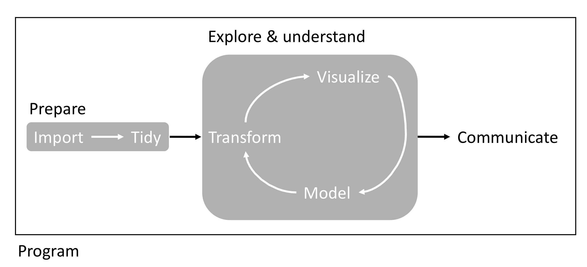

```{js logo-js, echo=FALSE}
$(document).ready(function() {
  $('#header').parent().prepend('<div id=\"logo\"></div>');
  $('#header').css('margin-right', '120px')
});
```

```{r packages, echo=FALSE, warning=FALSE, include=FALSE}
library(knitr)
library(rmarkdown)
library(bookdown)
#library(distill)
library(knitcitations)
library(formatR)
library(devtools)
library(kfigr)
library(dplyr)
library(kableExtra)
library(tufte)

#Generate BibTex citation file for all R packages used to produce report
knitr::write_bib(.packages(), file = 'packages.bib')
```

<div style="text-align: right"> [Raw data on GitHub](https://github.com/svenbuerki/EEB603_Reproducible_Science) </div>

# Meeting Time and Place

- Days: Tuesday & Thursday 
- Times: 9:00 to 10:15 AM
- Place: [Raptor Research Center Building, Rm 119](https://maps.boisestate.edu/?id=715#!m/115308?share)
- Important Information: Students must bring their **Bronco Card** to access the building using key card readers located at the east, west, or north entrances. Because the Raptor Research Building is on the edge of campus, it is kept secure and requires card access for entry. **Please carry your Bronco Card to every class session held in this building, as you will not be able to enter without it.**

If you forget your Bronco Card, contact **Campus Security** at 208-426-6911 to request access as a last resort.

# Instructor Information

- Name: Sven Buerki (he/his)
- Office location: Science building, office 228 (first floor)
- Office hours: By appointment
- Email address: [svenbuerki\@boisestate.edu](mailto:svenbuerki@boisestate.edu){.email}
- Preferred way to contact me: By email or in class

# Welcome

Welcome to the course! I am looking forward to getting to know you this semester. To get started, please familiarize yourself with this syllabus and our [website](https://svenbuerki.github.io/EEB603_Reproducible_Science/index.html). I developed this course to provide a welcoming environment and effective learning experience for all students. If you encounter barriers in this course, please bring them to my attention so that I may work to address them, and reach out to me at any time if you have questions about course content or assignments. 

# Course Format

This is a face to face course that will meet two times a week. Our class sessions include important information and opportunities to apply what you are learning with your peers. To best achieve the learning outcomes for the course, it is important that you attend class and be engaged with the content, me and each other. You should expect to spend approximately 9 hours each week on work for this course (including in and out of class time).

# Course Description and Goals

The scientific community widely acknowledges that we are in the midst of a reproducibility crisis [e.g. @Baker_2016]. This course begins by reviewing the evidence for, and causes of, this crisis, and aims to highlight key factors that can improve reproducibility in science—especially within Ecology, Evolution & Behavior. It also provides a platform to develop, practice, and strengthen science communication skills [e.g. @Soltis2023 for some innovative ways to share your research]. 

The overarching aim of this course is to equip students with the theoretical knowledge and bioinformatics tools necessary to enhance transparency, reproducibility, and efficiency in scientific research. Throughout the course, students will learn to use open-source software for research, including [R](https://cran.r-project.org), [RStudio](https://www.rstudio.com) and [R Markdown](https://rmarkdown.rstudio.com) (incl. [knitr](https://kbroman.org/knitr_knutshell/)). To further develop these skills—and improve communication and teaching competencies—students will 

1. design bioinformatics tutorials and teach them to peers
2. design, implement, and present individual projects aimed at developing a reproducible workflow tailored to their research interests

Overall, this course **provides students with key knowledge to gather, store, share, prepare, and analyze data, as well as communicate results to the scientific community and various stakeholders** (see Figure \@ref(fig:part2)).

```{r part2, echo=FALSE, fig.cap="Overview of workflow studied in PART2.", out.width = '100%', fig.pos= "h"}

```

## <a name="Structure"></a>Course Structure {#Structure}

The course is subdivided into three parts: 

- *PART 1: The Big Picture*
- *PART 2: Bioinformatics for Reproducible Science* 
- *PART 3: Apply a Reproducible Approach to your Data*

**Part 1** provides students with key theoretical knowledge on reproducible science, enabling them to design and implement a reproducible approach tailored to Ecology, Evolution & Behavior. This section also covers topics related to open science and data management, and how these practices intersect with scientific publishing.

**Part 2** offers students the opportunity to further develop and apply coding and bioinformatics tools essential for building reproducible workflows (Figure \@ref(fig:part2)). In this section, students—supported by the instructor—will develop and teach a tutorial on a specific bioinformatics topic over two full classes. Tutorials will be written in RMarkdown and distributed to the class one week in advance. Depending on class size, this assignment may be completed individually or in groups.

**Part 3** is designed to give students the chance to develop an individual reproducible workflow tailored to their own research project (or using data from a publication, if they have not yet defined a thesis topic). This assignment builds on knowledge gained in the earlier parts of the course and will involve collaboration with the instructor—and in some cases, with thesis advisors.

## Course Content {#courseCont}

**PART 1: The Big Picture**

1. **The reproducibility crisis & prospects to tackle it!**
   - Chapter 1: The reproducibility crisis.
   - Chapter 2: Introduction to R, RStudio, Markdown (incl. referencing) & User-defined functions.
   - Chapter 3: A roadmap to implement reproducible science in Ecology, Evolution & Behavior.
   - Chapter 4: Open science and CARE principles.
2. **Getting started: Overview of data workflow & used software**
   - Chapter 5: Data management, Reproducible code.
   - Chapter 6: Getting published & Peer review.
  
<a name="PART2"></a>**PART 2: Bioinformatics for Reproducible Science**

3. **Prepare your data**
   - Chapter 7: Organize and import data with R.
   - Chapter 8: Prepare/tidy data for analyses in R.
4. **Explore & understand your data**
   - Chapter 9: Statistical modelling and *knitr*.
   - Chapter 10: Visualize results with Tables.
   - Chapter 11: Visualize results with Figures (incl. handling phylogenetic trees).
5. **Communicate/Disseminate your results**
   - Chapter 12: Git & GitHub: What are those and how can they help you with your code and communicating your research?
   
**PART 3: Apply a Reproducible Approach to your Data**

6. **Students develop and present reproducible workflows applied to their project**
   - Produce individual reports showcasing reproducible workflows tailored to thesis projects.
   - Oral presentations of individual students' projects. 

## Course Learning Outcomes

Learning outcomes for each chapter are available on the [course website](https://svenbuerki.github.io/EEB603_Reproducible_Science/Chapters.html).

# Course Schedule

The tentative schedule for this course is available [here](Timetable.html). The instructor wants to warn students that he might adjust the schedule to accommodate any needs. However, in case of changes, the instructor will make sure to contact enrolled students to keep them posted.

# Course Resources

## <a name="GoogleSite"></a>Shared Google Drive {#GoogleSite}

A shared Google Drive has been set up for data sharing and uploading [bioinformatic tutorials](#BioTut).

- URL: https://drive.google.com/drive/folders/1eZyjGQ478vaKiGD01hcryyNtdGp9t1J7?usp=sharing

## <a name="Publis"></a> Publications and Textbooks {#Publis}

The reading material at the basis of this course is composed of a mixture of publications and chapters mostly from two textbooks [@Gandrud2015; @Wickham2017]. We will also study the *"Guides to"* published by the [British Ecological Society](https://www.britishecologicalsociety.org/publications/guides-to/). Please find below the references used in each [chapter](#Structure). **This list is not exhaustive and additional literature will be provided in class.** 

| Chapter | Reference(s)  |
| :--- |-------------|
| **Chap. 1** | @Baker_2016; @Freedman_2015; @Munafo; ; @NAP25303; @Peng2021; @Sarewitz_2016 |
| **Chap. 2** | Chapter 3 of @Gandrud2015 |
| **Chap. 3** | @Bone2015; @Markowetz2015; @Smith2016 |
| **Chap. 4** | @Carroll2021; [Creative Commons](https://creativecommons.org/); @Wagner2022; @Williams2023 |
| **Chap. 5** | @DataMan & Chapter 4 of @Gandrud2015; @RepCode & Chapter 2 of @Gandrud2015; @Trisovic2022 |
| **Chap. 6** | @GetPub; @PeerRev|
| **Chap. 7** | Chapter 6 of @Gandrud2015 |
| **Chap. 8** | Chapter 7 of @Gandrud2015 & Chapters 9-10 of @Wickham2017 |
| **Chap. 9** | Chapter 8 of @Gandrud2015 |
| **Chap. 10** | Chapter 9 of @Gandrud2015 |
| **Chap. 11** | Chapter 10 of @Gandrud2015, Chapters 1 and 22 of @Wickham2017 & @Yu2017 |
| **Chap. 12** | Chapter 5 of @Gandrud2015 |

## Examples of Reproducible Science

To further illustrate how a reproducible approach can be applied to research, the instructor provides examples of publications and software produced by students who have taken this course (listed alphabetically):

- @Cole2022 -- **EcoCountHelper: an R package and analytical pipeline for the analysis of ecological count data using GLMMs, and a case study of bats in Grand Teton National Park.**
- @Ellestad2022 -- **Genomic Insights into Cultivated Mexican Vanilla planifolia Reveal High Levels of Heterozygosity Stemming from Hybridization.**
- @Wojahn2021 -- **G2PMineR: A Genome to Phenome Literature Review Approach.**

# <a name="software"></a>Computing Tools {#software}

Research is often presented in the form of slideshows, articles or books. These presentation documents announce a project's findings, but they are not the research, they are the advertisement part of the research project! 

> *The research is the full software environment, code, and data that produced the results [@Donoho2010].* 

**When we separate the research from its advertisement, we are making it difficult for others to verify the findings by reproducing them.**

This course will equip you with tools to integrate your research with clear and reproducible presentation of your findings. The first is a reproducible research workflow, which applies the principles of reproducibility throughout your entire project—from data collection to statistical analysis and results presentation. To support this, you will learn to use a range of computing tools that make this workflow possible.

## Bioinformatics Tools

The main bioinformatics tools covered in this course are:

- The **R** statistical language that will allow you to gather data and analyze it.
- The **Markdown** and **LaTeX** markup languages that you can use to create documents (slideshows, articles, books, webpages) for presenting your findings.
- The *knitr* and *rmarkdown* **packages** for R and other tools, including **command-line shell programs** like GNU Make and Git version control, for dynamically tiding your data gathering, analysis, and presentation documents together so that they can be easily reproduced.
- **RStudio**, a program that brings all of these tools together in one place.

## Installing Software

As shown above, **R** and **RStudio** are at the core of this course and will have to be installed on your computers. This can be easily done by downloading the software from the following websites:

- **R**: https://www.r-project.org
- **RStudio**: https://www.rstudio.com/products/rstudio/download/

The download pages for these software tools include detailed installation instructions; please refer to them for more information.

## Installing Markup Software

If you are planning to create LaTeX documents, you will need to install a Tex distribution. Please refer to this website for more details: https://www.latex-project.org/get/

If you want to create Markdown documents you can separately install the *rmarkdown* package in R (see [below](#Rpack) for more details).

## <a name="Rpack"></a>Installing R Packages {#Rpack}

We will be using several R packages specifically designed to support reproducible research. Many of these packages are not included in the default R installation and must be installed separately.

To install the core packages used in this course, copy the following code and paste it into your R console:

```{r eval=FALSE, tidy=TRUE}
install.packages(c("brew", "countrycode", "devtools", "dplyr", "ggplot2", "googleVis", "knitr", "rmarkdown", "tidyr", "xtable"))
```

Once you run this code, you may be prompted to select a CRAN "mirror" to download the packages from. Simply choose the mirror closest to your location.

It is also likely that we will need to install additional packages throughout the course. When that happens, you can install them using the same R function `install.packages()`, or through RStudio by selecting "Tools" → "Install Packages...", entering the package name in the dialog box, and ensuring the "Install dependencies" option is checked.

## <a name="Cheat"></a>RStudio Cheat Sheets {#Cheat}

RStudio offers a collection of cheat sheets accessible from the "Help" menu by selecting "Cheatsheets."

Five cheat sheets are especially relevant to chapters taught in this course:

  - *RStudio IDE : Cheat sheet*
  - *Data Manipulation with dplyr, tidyr*
  - *Data Visualization with ggplot2*
  - *R Markdown Cheat Sheet*
  - *R Markdown Reference Guide*

These documents together with the material presented in [course resources](#Publis) will provide the basis to design your [bioinformatics tutorials](#BioTut). 

## R Tutorials

Please find below two documents providing a comprehensive introduction to R:

- R for beginners (a tutorial by Emmanuel Paradis): https://cran.r-project.org/doc/contrib/Paradis-rdebuts_en.pdf
- An introduction to R: https://cran.r-project.org/doc/manuals/r-release/R-intro.pdf

# Assessments and Grading

There will not be any classical exams in this course, but we will rather focus on developing theoretical and bioinformatics skills and applying those to your research. In this context, each student will be asked to produce a bioinformatics tutorial and teach it to their peers (see [Course Content - PART 2](#courseCont)). Each student will also be tasked to produce a report (tailored to their thesis project or a publication) and present their results and conclusions in class. 

## Assessments

Students will be graded on the following four mandatory assessments:

1. Produce a group bioinformatics tutorial based on a chapter from [Course Content - PART 2](#courseCont) (150 points).
2. Teach the bioinformatics tutorial to their peers over two sessions (100 points).
3. Produce an individual report on their thesis project or a related publication (200 points).
4. Deliver an oral presentation on their thesis project or publication (100 points).

These assessments total **550 points**. Table \@ref(tab:mygrade) shows the grading scale used in this course.

# Grading Policy 

The grading scale for this course is in Table \@ref(tab:mygrade).

```{r mygrade, echo=FALSE}
library(bookdown)
#
grades <- data.frame("Percentage" = c("100-98","97.9-93", "92.9-90", "89.9-88", "87.9-83", "82.9-80", "79.9-78", "77.9-73", "72.9-70", "69.9-68", "67.9-60", "59.9-0"), Grade = c("A+","A","A-","B+","B","B-","C+","C","C-","D+","D","F"))
knitr::kable(grades, caption = "Grading scale applied in this course.") %>%
  kable_styling(bootstrap_options = c("striped", "hover", "condensed"))
```

You can look at all of your scores by accessing Grades in the Canvas course menu. 

## <a name="BioTut"></a>Bioinformatics Tutorial (150 points) {#BioTut}

During the first two weeks, students will [sign up](#GoogleBioTut) for a chapter from [Course Content - PART 2](#courseCont) to study and create a bioinformatics tutorial. Depending on enrollment, tutorials will be developed individually or in groups, with support from the instructor (see details below).

Tutorials must be written using *knitr*/*rmarkdown* in RStudio and focus on a set of exercises designed to build key bioinformatics skills related to the chosen chapter (see [Course Content - PART 2](#courseCont)). Students are encouraged to use materials from @Gandrud2015 and @Wickham2017, or other properly cited sources. For additional resources, see the [Publications and Textbooks](#Publis) and [RStudio Cheat Sheets](#Cheat) sections.

Each tutorial should be designed to fit within two laboratory sessions (see [Teaching Tutorials](#TeachTut)). **Tutorials must be submitted to the instructor one week before presentation for review and uploading to the shared Google Drive.**

### What Should You Keep in Mind?

When designing your tutorials, please consider the following:

1. What are your main objectives, and how do they relate to the scientific process and data life cycle? Include the necessary theoretical background.
2. What specific learning outcomes do you want your peers to achieve?
3. What data will you use to teach the tutorial?
4. What bioinformatics tools or packages are required, and how can they be installed?

When explaining each concept, clearly describe the rationale, outline the steps (using pseudocode if helpful), and emphasize the input/output and data type or format for each function.

### Content of the Tutorial

Based on the information provided above, your tutorial should include:

- A short introduction highlighting the theory and aims of the tutorial.
- A section on R package requirements with instructions on how to install those packages and their dependencies.
- A section introducing the data (dataset) used to support these exercises (and how to download those).
- A references section and links to manuals of R packages. 
- Commented R code necessary to guide users through the exercises as well as some knowledge on expected outputs.

### <a name="GoogleBioTut"></a>Google Sheet {#GoogleBioTut}

The instructor asks students to sign up to design and teach a bioinformatics tutorial by accessing the following Google Sheet. Please respect the indicated number of students per chapter when making your selection.

- https://docs.google.com/spreadsheets/d/1gUwbqJ4gbhhSY1DfsZ7HsoDLzOKB-57xAAC1_IJ3qmk/edit?usp=sharing

## <a name="TeachTut"></a>Teaching Tutorials (100 points) {#TeachTut}

Students are expected to prepare a 10–20 minute presentation that provides general guidance on completing their tutorial. Presentations will be uploaded to the shared Google Drive and made accessible to all students. During the tutorial sessions, students must run through their tutorial with their peers, ensuring they understand the key concepts and are able to complete the assignments or tasks. Students are expected to support their peers by answering questions throughout. While the instructor will also be available to assist, students will take the lead in teaching the bioinformatics laboratories.

Grading will be based on students’ ability to effectively teach their tutorials, facilitate understanding, and respond to questions. The instructor may also consider peer feedback when assigning grades for this component.

## Individual Report on Thesis Project/Publication (200 points)

Students will collaborate with the instructor to develop a reproducible workflow tailored to their thesis project. For students who do not yet have a defined thesis topic, the instructor will help select a relevant publication to serve as the basis for their individual project. The instructor encourages students to reach out as soon as possible to begin designing their individual projects.

Reports should be written using *knitr*/*rmarkdown* in RStudio. Students must clearly state the rationale, objectives, and the scientific question at the core of their report. Framing the project within the scientific process is essential, as it is impossible to evaluate reproducibility without this context.

Additionally, students are expected to include a list of references supporting their report. References must be properly cited within the text; simply listing them at the end is not sufficient. This practice helps justify methodological choices and enhances transparency.

### Students Gather Key Elements for their Project

When considering your individual project, keep the following questions in mind:

- What types of data are already published or available, and which are relevant to your topic?
- Where are these published data deposited?
- Can you reproduce the analyses based on the published data?
- What types of data are or will be generated during your thesis project?
- What are the specific characteristics of your data (e.g., storage, sharing requirements)?
- What are the publication standards in your field? [see e.g., @Donoho2010; @Smith2016]
- Etc.

### Students Develop these Core Processes for their Project

- A data management workflow specific to your research, which will cover the following stages of the data life cycle [see e.g. @DataMan]:
  - Create
  - Process
  - Document
  - Preserve
  - Share
  - Reuse
- A reproducible code to perform the following tasks to your data (see Fig. \ref{fig:part2}):
  - Import
  - Tidy/clean
  - Transform
  - Visualize
  - Model
  - Communicate

## Oral Presentation on Thesis Project/Publication (100 points)

Each student will have to present their report during final week. The presentation should follow the same structure as the report and not exceed 15 minutes. There will be 5 minutes at the end of the presentation allocated for questions. 

# Expectation for Student Success

My goal is that every student is successful in this course, but I need your help to achieve that. In order to do your part to ensure your success in this course, please: 

- **Attend class.** We will be using class time to practice and apply what we are learning, so it is important for your and your fellow students’ learning that you are present and participatory. You can miss two class periods without it affecting your grade. If you have to miss beyond two classes, please email me as soon as possible to discuss ways to help you participate in classroom activities asynchronously as appropriate.
- **Ask questions.** Learning is all about asking questions, so always feel free to do so in this class. 
- **Be respectful of your fellow students.** While working together to build this community, we ask all members to:
  - Share their unique experiences, values, and beliefs, if comfortable doing so.
  - Listen deeply to one another.
  - Honor the uniqueness of their peers.
  - Create a respectful environment in this course and across the campus community.
- **Check announcements or e-mails regularly.** Announcements will serve as courtesy reminders and also point you to any new materials or changes. 
- **Do the pre-class assignments.** In order to make the most of our class time, it is important that all students complete the pre-class assignments so we can jump into our application activities. 

If you are unable to attend class, please contact the instructor as soon as possible via email at svenbuerki@boisestate.edu.

# Expectations for Me

In support of my goal that every student be successful in this course, you can expect that I: 

- **Will be available to answer questions throughout the course.** I encourage you to visit me during Student Hours to ask any questions about the course material or to further your curiosity in the subject matter. You may also email me with questions or concerns or ask to meet via Zoom or on campus outside of the Student Hours, and I will do my best to accommodate your needs.
- **Will provide regular feedback on your work in a timely fashion.** I will return completed work to you, with feedback, within one week of the due date. 
- **Will continuously work on improving your learning experience through my own class observations and based on your feedback.** You will have the opportunity to provide feedback to me at the midpoint of the semester, and via the end of course evaluations. 

# This Class Welcomes Everyone

Students in this class represent a rich variety of backgrounds and perspectives. The (program/dept) is committed to providing an environment where similarities and differences are respected, supported, and valued.  While working together to build this community, we ask all members to:

- share their unique experiences, values, and beliefs, if comfortable doing so.
- listen deeply to one another.
- honor the uniqueness of their peers.
- appreciate the opportunity we have to learn from each other in this community.
- use this opportunity together to discuss ways in which we can create a welcoming and respectful environment in this course and across the campus community.
- recognize opportunities to invite a community member to exhibit more respectful speech or behavior—and then also invite them into further conversation. We also expect community members to respond with gratitude and to take a moment of reflection when they receive such an invitation, rather than react immediately from defensiveness.
- keep confidential any discussions that the community has of a personal (or professional) nature, unless the speaker has given explicit permission to share what they have said.

As your instructor, my goal is to make sure that our learning environment is effective for everyone. This means, in part, that each student is encouraged to share perspectives relevant to the course material and that our class activities and discussions are conducted in a way that supports everyone’s learning.

# Student Well-being

If you are struggling for any reason (e.g., family emergency, financial/basic needs, mental/physical health concerns, caregiving responsibilities, etc.) and believe these struggles may impact your performance in the course, I encourage you to reach out to me if you are comfortable doing so, and I will refer you to an appropriate university resource. You may also reach out directly to the outreach team in the Office of the Dean of Students at (208) 426-1527 or email studentoutreach@boisestate.edu for support. The [Student Life Essentials page](https://www.boisestate.edu/student-life/) is also a great place to find helpful resources. If you notice a significant change in your mood, sleep, feelings of hopelessness or a lack of self worth, consider connecting immediately with [Counseling Services](https://www.boisestate.edu/healthservices/counseling/) (1529 Belmont Street, Norco Building) at (208) 426-1459 or email healthservices@boisestate.edu.

# What Do you Need?

The university has many resources designed to support you as a learner and human being. Among these are:

- [Albertsons Library](https://library.boisestate.edu/) provides a treasure trove of physical and electronic resources. 
  - As you enter the library, straight ahead you’ll find the Reference Desk, where librarians can help you find the information and resources you need. 
  - The Circulation Desk lets students borrow various technologies.
  - The MakerLab on the second floor offers tools for student use, and there are friendly staff in the MakerLab to help you learn how.
- The [Writing Center](https://www.boisestate.edu/writingcenter/) offers individual consultations tailored to your needs, including making sense of writing assignment instructions, brainstorming, crafting a thesis, organizing an essay, revisions, citations, and more.
- [Counseling Services](https://www.boisestate.edu/healthservices/counseling) helps you tap into your strengths and find resources to deal more effectively with concerns that impact your pursuit of personal and academic goals. It emphasizes prevention and early detection and provides a broad spectrum of short-term counseling, consultative, evaluative, teaching, and training functions. Counseling staff consists of licensed counselors, psychologists, and closely supervised trainees/post-graduate interns.
- Food assistance: If you are hungry and cannot afford to purchase food, the campus has some resources to help you. You can visit the [campus food pantry](https://www.boisestate.edu/campusfoodpantry/) or [get free meals in the campus dining hall](https://www.boisestate.edu/deanofstudents/student-support/food-help/meal-assistance/).

# Course Policies

## Academic Integrity

Academic Excellence is a [Shared Value](https://www.boisestate.edu/president/values/statement-of-shared-values/) at Boise State, and part of your responsibility in pursuing academic excellence includes avoiding cheating, plagiarism, and any other kind of academic misconduct. If I find a student responsible for academic misconduct in our class, the outcome of their choice to not fully engage in their learning might range from a 'revise & resubmit' up to an 'F (failure) for the course.' For more info, please read [The Student Code of Conduct (Policy 2020), Section 7: Academic Misconduct Complaints, Violations, Processes and Sanctions](https://www.boisestate.edu/policy/student-affairs/code-of-conduct/#academic_misconduct).

## Artifical Intelligence (AI) Use in The Course

In this course, I want to see your thoughts, understand your reasoning, and hear your voice. However, there are moments in this course where you might find it useful to use generative AI tools in support of your learning.
 
You may use generative AI tools for specified activities and assignments if their use supports, rather than undermines, your learning. While generative AI can help to advance your learning, its usefulness depends on the purpose of each activity or assignment. You will find guidelines for generative AI use in the instructions for each assignment; please read them very carefully, as these guidelines differ by assignment.

If you use ChatGPT, Gemini, Grammarly, Midjourney, or other AI tools in support of your work in this course, cite any ideas, text, images, or other media generated by the tool using the instructions and format of the [Modern Language Association](https://style.mla.org/citing-generative-ai/) (MLA), [American Psychological Association](https://apastyle.apa.org/blog/how-to-cite-chatgpt) (APA), [Chicago Manual of Style](https://www.chicagomanualofstyle.org/qanda/data/faq/topics/Documentation/faq0422.html), or other citation style as appropriate. When you use a tool in an assignment, include a brief, clear description of how you used it. If you use generative AI, you must not let this tool replace your thinking and work. In fact, it is your responsibility to ensure you are fully engaging in learning and submitting authentic work. To learn more about how to learn successfully and avoid academic misconduct behaviors, please review the [Student Code of Conduct](https://www.boisestate.edu/policy/student-affairs/code-of-conduct/) with special attention to [Section 8: Procedures for Academic Misconduct](https://www.boisestate.edu/policy/student-affairs/code-of-conduct/#procedures). 

If you are unsure of whether or when to use generative AI tools in this course, please reach out to me. I’m eager to learn about how we might use them in new ways to meaningfully advance your learning and prepare you for your future beyond Boise State.

## Communicable Disease Policy

Boise State has a [Communicable Disease Policy (Policy 9270)](https://www.boisestate.edu/policy/facilities-planning-campus-safety/communicable-disease/#:~:text=Students%2C%20faculty%2C%20and%20other%20employees,to%20the%20Public%20Health%20Office.) that guides everyone working and learning in our community. The policy has two key implications:

1.	Any illness covered by the policy must be reported to Boise State Public Health by the impacted individual,
2.	Faculty are required to accommodate any student impacted by any illness covered by the policy as directed by Boise State Public Health. 

## Late Work Policy

Due dates for every assignment are provided on the course [schedule](https://svenbuerki.github.io/EEB603_Reproducible_Science/Timetable.html). Unless otherwise stated, assignments are due on those days. However, I recognize that things can happen that are out of your control. In these instances, please reach out to me ahead of the due date, or as soon as possible afterwards, so that we can make a plan for you to submit the assignment as close to the original due date as possible. If an assignment is not submitted within two weeks of the due date, and you have not contacted me about when you will be submitting it, I will enter the assignment as Incomplete in Canvas until such time that we discuss the missing assignment and agree on a course of action. 

# Note on Course Content and Idaho Law

Under Idaho law (Section § 67-5909D), some university courses with content related to diversity, equity, inclusion, or critical theory may be subject to certain restrictions. However, the law affirms and does not limit free discussion in the learning environment. Like all Boise State courses, this course supports open inquiry, intellectual honesty, and respectful engagement with a range of perspectives, all of which are consistent with student rights and responsibilities described in the [Student Code of Conduct (Policy 2020)](https://www.boisestate.edu/policy/student-affairs/code-of-conduct/). 

This course may include content that touches on concepts related to diversity, equity, inclusion (DEI), or critical theory—such as systemic inequality, cultural identity, or gender and race in society. If these topics are included, it is because they are relevant to the learning outcomes for this course and are explored to support critical thinking, deeper understanding, and respectful engagement with different perspectives. As part of the course, you may be asked to apply or explain ideas that come from a particular perspective. However, you are not required to adopt such perspectives as your own.

Our learning environment is a space for open dialogue and thoughtful discussion, including complex or challenging topics. Everyone is expected to engage with curiosity, listen respectfully, and contribute in ways that support a productive and welcoming learning environment. Boise State and the Idaho State Board of Education affirm the importance of free expression and academic inquiry. As outlined in SBOE Policy III.B:

> “Membership in the academic community imposes on administrators, faculty members, other institutional employees, and students an obligation to respect the dignity of others, to acknowledge the right of others to express differing opinions, and to foster and defend intellectual honesty, freedom of inquiry and instruction, and free expression on and off the campus of an institution.”

Disruptive behavior that interferes with the learning environment will not be tolerated and may result in removal from this course, in line with university policy (See [Policy 3240 Maintaining Effective Learning Environments](https://www.boisestate.edu/policy/academic-affairs-student/maintaining-effective-learning-environments/)).

In this course, I will foster critical discussion and analysis, and a respectful consideration of a wide range of ideas, in accordance with the [Faculty Code of Rights, Responsibilities, and Conduct (Policy 4000)](https://www.boisestate.edu/policy/academic-affairs-faculty-administration/faculty-code-of-rights-responsibilities-and-conduct/). You are encouraged to think critically, question ideas, and form your own conclusions. As always, you have the freedom to choose courses that align with your academic goals—if you have concerns about course content, please talk with your instructor or advisor. Refer to the academic calendar for important deadlines related to course withdrawal.

To learn more about the law and its impact at Boise State, visit the [Provost Office’s Information Regarding Section 67-5909D page](https://www.boisestate.edu/academics/information-regarding-section-67-5909d-course-and-curriculum/).


# References

<div id="refs"></div>

# Appendix 1 {.appendix}

Citations of all R packages used to generate this report. 

```{r generateBibliography, eval = T, results="asis", cache = F, echo=F, warning = FALSE, message=FALSE}
library("knitcitations")
cleanbib()
options("citation_format" = "pandoc")
read.bibtex(file = "packages.bib")
``` 
